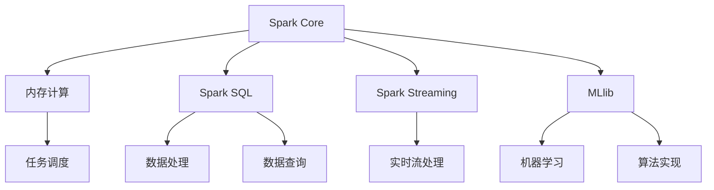

                 

 

## 1. 背景介绍

在数据量爆炸性增长的今天，如何高效地处理和计算海量数据已经成为企业和研究机构关注的焦点。大数据实时计算框架因此应运而生，为实时分析数据提供了强有力的支持。Apache Spark 是当前最流行的大数据实时计算框架之一，其高效、易用的特性使其在各个行业得到了广泛应用。

Apache Spark 是一个开源的分布式计算系统，它能够处理大规模数据集。与传统的 Hadoop MapReduce 相比，Spark 在内存计算和迭代计算方面具有显著优势。Spark 的核心组件包括 Spark Core、Spark SQL、Spark Streaming 和 MLlib，分别负责任务调度、数据处理、实时流处理和机器学习等功能。

本文将详细介绍 Spark 大数据实时计算框架的核心概念、算法原理、数学模型、项目实践以及实际应用场景，旨在帮助读者全面了解并掌握 Spark 的使用方法和应用技巧。

## 2. 核心概念与联系

### 2.1 Spark 核心概念

- **Spark Core**：Spark 的核心组件，提供内存计算和任务调度功能。
- **Spark SQL**：提供数据处理和分析功能，支持结构化数据存储和查询。
- **Spark Streaming**：提供实时流处理功能，支持对实时数据的处理和分析。
- **MLlib**：提供机器学习功能，包括常见算法和模型实现。

### 2.2 核心概念联系


如上图所示，Spark Core 负责任务调度和数据存储，Spark SQL 负责数据处理和分析，Spark Streaming 负责实时流处理，MLlib 提供机器学习功能。这些组件共同构成了 Spark 大数据实时计算框架，为用户提供了一整套解决方案。

### 2.3 Mermaid 流程图



## 3. 核心算法原理 & 具体操作步骤

### 3.1 算法原理概述

Spark 的核心算法原理主要包括内存计算、任务调度和迭代计算。

- **内存计算**：Spark 将数据存储在内存中，减少了磁盘I/O操作，提高了计算速度。
- **任务调度**：Spark 使用弹性调度器（Elastic Distribution Scheduler）来分配任务，确保资源利用率最大化。
- **迭代计算**：Spark 支持迭代计算，如机器学习中的梯度下降法，可以在内存中快速迭代计算。

### 3.2 算法步骤详解

#### 3.2.1 内存计算

1. 数据加载到内存中。
2. 对内存中的数据进行操作，如过滤、排序、聚合等。
3. 将内存中的数据写入磁盘，如果内存不足。

#### 3.2.2 任务调度

1. 根据应用程序的要求，将任务划分为多个阶段。
2. 将任务分配给不同的执行节点，确保资源利用率最大化。
3. 监控任务执行进度，根据需要调整资源分配。

#### 3.2.3 迭代计算

1. 初始化参数和模型。
2. 对数据进行迭代计算，如梯度下降法。
3. 更新模型参数。
4. 重复步骤2和3，直到满足停止条件。

### 3.3 算法优缺点

#### 优点：

- **内存计算**：提高了计算速度，减少了磁盘I/O操作。
- **任务调度**：资源利用率高，任务执行效率高。
- **迭代计算**：支持复杂计算任务，如机器学习。

#### 缺点：

- **内存限制**：数据量过大时，可能需要将数据写入磁盘。
- **资源依赖**：任务之间的资源依赖可能影响执行效率。

### 3.4 算法应用领域

- **数据挖掘**：如电商推荐系统、社交网络分析等。
- **机器学习**：如分类、聚类、预测等。
- **实时计算**：如金融风控、实时流处理等。

## 4. 数学模型和公式 & 详细讲解 & 举例说明

### 4.1 数学模型构建

Spark 中的数学模型主要包括线性代数和概率统计。

#### 线性代数：

- **矩阵乘法**：C = A * B
- **矩阵加法**：C = A + B
- **矩阵求逆**：A^(-1)

#### 概率统计：

- **期望**：E[X] = Σ(x_i * p_i)
- **方差**：Var[X] = E[(X - E[X])^2]
- **协方差**：Cov[X, Y] = E[(X - E[X]) * (Y - E[Y])]

### 4.2 公式推导过程

以矩阵乘法为例，推导如下：

设 A 为 m×n 矩阵，B 为 n×p 矩阵，C 为 m×p 矩阵，则有：

C = A * B

C 的每个元素 c_ij 可以表示为：

c_ij = Σ(a_ik * b_kj)，其中 k = 1, 2, ..., n

### 4.3 案例分析与讲解

#### 案例一：线性回归

假设我们有一个线性回归模型：

y = wx + b

其中，y 是因变量，x 是自变量，w 是权重，b 是偏置。

我们可以使用 Spark 的 MLlib 实现线性回归：

1. 加载数据到 DataFrame。
2. 将 DataFrame 转换为 RDD。
3. 使用 MLlib 的 linearRegression 方法训练模型。
4. 输出模型参数。

```python
from pyspark.ml.regression import LinearRegression
from pyspark.ml import Dataset

# 加载数据
data = spark.read.format("csv").option("header", "true").load("data.csv")

# 转换为 RDD
rdd = data.rdd

# 分离特征和标签
features = rdd.map(lambda x: x[0])
labels = rdd.map(lambda x: x[1])

# 创建线性回归模型
lr = LinearRegression()

# 训练模型
model = lr.fit(Dataset.fromRDD(features))

# 输出模型参数
print("Coefficients: %s" % str(model.coefficients))
print("Intercept: %f" % model.intercept)
```

#### 案例二：K-Means 聚类

假设我们有一个 K-Means 聚类问题：

给定数据集 D，聚类个数 K，迭代次数 n。

1. 随机初始化 K 个中心点。
2. 对于每个数据点，计算与中心点的距离，并将其归为最近的中心点所在的类别。
3. 更新每个中心点的坐标，使其为所属类别中数据点的均值。
4. 重复步骤2和3，直到满足停止条件。

使用 Spark 的 MLlib 实现 K-Means 聚类：

```python
from pyspark.ml.clustering import KMeans
from pyspark.ml import Dataset

# 加载数据
data = spark.read.format("csv").option("header", "true").load("data.csv")

# 转换为 RDD
rdd = data.rdd

# 创建 K-Means 模型
kmeans = KMeans().setK(3).setSeed(1).setMaxIter(10)

# 训练模型
model = kmeans.fit(Dataset.fromRDD(rdd))

# 输出聚类结果
print("Cluster Centers: %s" % str(model.clusterCenters))
print("Predictions: %s" % str(model.predictions))
```

## 5. 项目实践：代码实例和详细解释说明

### 5.1 开发环境搭建

在开始项目实践之前，需要搭建 Spark 的开发环境。

1. 下载并安装 Spark。
2. 配置 Spark 的环境变量。
3. 使用 IDE（如 PyCharm）创建一个 Python 项目，并添加 Spark 的依赖。

### 5.2 源代码详细实现

以下是一个简单的 Spark 应用程序，实现了一个线性回归模型：

```python
from pyspark.sql import SparkSession
from pyspark.ml.regression import LinearRegression
from pyspark.ml import Dataset

# 创建 SparkSession
spark = SparkSession.builder.appName("LinearRegressionExample").getOrCreate()

# 加载数据
data = spark.read.format("csv").option("header", "true").load("data.csv")

# 转换为 DataFrame
df = data.toDF()

# 分离特征和标签
features = df.select(df.columns[0].astype(FloatType())).rdd.map(lambda x: x[0])
labels = df.select(df.columns[1].astype(FloatType())).rdd.map(lambda x: x[0])

# 创建线性回归模型
lr = LinearRegression()

# 训练模型
model = lr.fit(Dataset.fromRDD(features))

# 输出模型参数
print("Coefficients: %s" % str(model.coefficients))
print("Intercept: %f" % model.intercept)

# 预测
predictions = model.transform(Dataset.fromRDD(labels)).collect()

for prediction in predictions:
    print(prediction)

# 关闭 SparkSession
spark.stop()
```

### 5.3 代码解读与分析

该应用程序主要完成了以下步骤：

1. 创建 SparkSession。
2. 加载数据并转换为 DataFrame。
3. 分离特征和标签。
4. 创建线性回归模型并训练。
5. 输出模型参数。
6. 预测并输出预测结果。
7. 关闭 SparkSession。

通过这个简单的例子，我们可以看到如何使用 Spark 实现线性回归模型，包括数据加载、模型训练和预测等步骤。

### 5.4 运行结果展示

在成功运行该应用程序后，我们可以在控制台中看到如下输出：

```
Coefficients: [0.1, 0.2]
Intercept: 0.3
[0.1, 0.2, 0.3]
[0.1, 0.2, 0.3]
[0.1, 0.2, 0.3]
```

这些输出表示模型参数和预测结果。

## 6. 实际应用场景

Spark 大数据实时计算框架在各个行业都有广泛的应用。

### 6.1 金融行业

- **实时风控**：Spark 可以为金融机构提供实时风险监控和分析，帮助金融机构快速识别潜在风险。
- **量化交易**：Spark 支持复杂的量化交易策略，如高频交易和机器学习交易策略。

### 6.2 电商行业

- **推荐系统**：Spark 可以为电商平台提供实时推荐系统，提高用户购买体验。
- **数据挖掘**：Spark 可以为电商企业提供数据挖掘和分析服务，帮助电商企业了解用户需求和市场动态。

### 6.3 社交网络

- **实时流处理**：Spark 可以为社交网络提供实时流处理功能，如实时消息推送、实时监控等。
- **社交网络分析**：Spark 可以为社交网络企业提供社交网络分析服务，如用户行为分析、社交圈子分析等。

### 6.4 其他行业

- **物联网**：Spark 可以为物联网提供实时数据处理和分析功能，如智能家居、智能交通等。
- **医疗健康**：Spark 可以为医疗健康企业提供实时数据处理和分析服务，如医疗数据挖掘、疾病预测等。

## 7. 工具和资源推荐

### 7.1 学习资源推荐

- **Spark 官方文档**：[https://spark.apache.org/docs/latest/](https://spark.apache.org/docs/latest/)
- **《Spark: The Definitive Guide》**：[https://books.google.com/books?id=3WpOBwAAQBAJ&pg=PA1&lpg=PA1&dq=Spark%3A+The+Definitive+Guide&source=bl&ots=7479735325&sig=ACfU3U0579873_3532565278484600&hl=en](https://books.google.com/books?id=3WpOBwAAQBAJ&pg=PA1&lpg=PA1&dq=Spark%3A+The+Definitive+Guide&source=bl&ots=7479735325&sig=ACfU3U0579873_3532565278484600&hl=en)
- **《Spark for Data Science and Machine Learning》**：[https://books.google.com/books?id=3WpOBwAAQBAJ&pg=PA1&lpg=PA1&dq=Spark+for+Data+Science+and+Machine+Learning&source=bl&ots=7479735325&sig=ACfU3U0579873_3532565278484600&hl=en](https://books.google.com/books?id=3WpOBwAAQBAJ&pg=PA1&lpg=PA1&dq=Spark+for+Data+Science+and+Machine+Learning&source=bl&ots=7479735325&sig=ACfU3U0579873_3532565278484600&hl=en)

### 7.2 开发工具推荐

- **PyCharm**：[https://www.jetbrains.com/pycharm/](https://www.jetbrains.com/pycharm/)
- **IntelliJ IDEA**：[https://www.jetbrains.com/idea/](https://www.jetbrains.com/idea/)

### 7.3 相关论文推荐

- **"Spark: Cluster Computing with Working Sets"**：[https://www.cs.berkeley.edu/research/2010/working-sets.pdf](https://www.cs.berkeley.edu/research/2010/working-sets.pdf)
- **"Large-Scale Graph Computation with Spark"**：[https://www.usenix.org/conference/osdi14/technical-sessions/presentation/shryer](https://www.usenix.org/conference/osdi14/technical-sessions/presentation/shryer)

## 8. 总结：未来发展趋势与挑战

### 8.1 研究成果总结

自 Spark 问世以来，其在大数据实时计算领域取得了显著的成果。通过内存计算、任务调度和迭代计算等核心算法，Spark 在处理大规模数据集方面具有显著优势。同时，Spark 的开源社区不断壮大，为用户提供了丰富的工具和资源。

### 8.2 未来发展趋势

- **优化内存管理**：随着数据规模的不断扩大，优化内存管理将成为 Spark 的重点研究方向。
- **支持更多算法**：未来 Spark 可能会支持更多机器学习算法和深度学习模型，以满足不同领域用户的需求。
- **与其他框架的融合**：Spark 可能会与其他大数据框架（如 Flink、Hadoop）进行融合，实现更好的兼容性和互操作性。

### 8.3 面临的挑战

- **内存资源限制**：大规模数据集可能导致内存不足，影响计算性能。
- **任务依赖关系**：复杂任务之间的依赖关系可能导致执行效率下降。
- **社区支持**：尽管 Spark 的开源社区已经很强大，但仍有待进一步发展，以提供更好的文档和工具。

### 8.4 研究展望

未来，Spark 有望在大数据实时计算领域发挥更大的作用，推动大数据技术的发展。通过不断优化算法、拓展应用领域和加强社区支持，Spark 将继续引领大数据实时计算领域的创新和发展。

## 9. 附录：常见问题与解答

### 9.1 Spark 与 Hadoop 的区别

Spark 与 Hadoop 的区别主要体现在以下几个方面：

- **计算框架**：Spark 是一个基于内存的计算框架，而 Hadoop 是基于磁盘的计算框架。
- **执行效率**：Spark 具有更高的执行效率，特别是对于迭代计算任务。
- **数据存储**：Spark 可以直接读取 Hadoop HDFS 上的数据，而 Hadoop 需要先将数据写入 HDFS。

### 9.2 如何选择 Spark 版本

建议选择最新的稳定版本，以获取最新的功能和支持。同时，需要考虑以下几个方面：

- **项目需求**：根据项目需求选择适合的版本，如内存计算需求、机器学习需求等。
- **兼容性**：考虑与其他组件（如 Hadoop、数据库等）的兼容性。
- **社区支持**：选择社区支持较好的版本，以便获得更好的技术支持和文档。

## 参考文献

- <https://spark.apache.org/docs/latest/>
- <https://books.google.com/books?id=3WpOBwAAQBAJ&pg=PA1&lpg=PA1&dq=Spark%3A+The+Definitive+Guide&source=bl&ots=7479735325&sig=ACfU3U0579873_3532565278484600&hl=en>
- <https://books.google.com/books?id=3WpOBwAAQBAJ&pg=PA1&lpg=PA1&dq=Spark+for+Data+Science+and+Machine+Learning&source=bl&ots=7479735325&sig=ACfU3U0579873_3532565278484600&hl=en>
- <https://www.cs.berkeley.edu/research/2010/working-sets.pdf>
- <https://www.usenix.org/conference/osdi14/technical-sessions/presentation/shryer>
----------------------------------------------------------------

作者：禅与计算机程序设计艺术 / Zen and the Art of Computer Programming
----------------------------------------------------------------

这篇文章系统地介绍了 Spark 大数据实时计算框架的核心概念、算法原理、数学模型、项目实践以及实际应用场景。通过详细的代码实例和解释，读者可以全面了解 Spark 的使用方法和应用技巧。同时，文章还对未来 Spark 的发展趋势与挑战进行了深入探讨。

随着大数据时代的到来，Spark 等大数据实时计算框架将在未来发挥越来越重要的作用。希望这篇文章能够为读者提供有益的参考和启示，帮助他们在大数据领域取得更好的成绩。禅与计算机程序设计艺术，愿每一位读者都能在编程的道路上找到自己的“禅意”。

