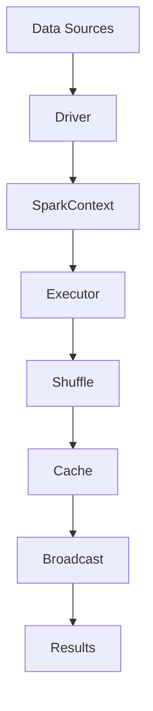

                 

在当今信息化社会中，数据的爆炸式增长催生了对实时计算的需求。实时计算可以帮助企业实时响应市场变化，优化业务流程，提升用户体验。Spark大数据实时计算框架，作为大数据领域的重要工具，因其高效性和灵活性，受到了广泛的关注。本文将详细介绍Spark大数据实时计算框架，包括其核心概念、原理、算法、数学模型以及应用实践。

## 关键词

- Spark
- 大数据
- 实时计算
- 框架
- 高效性
- 可扩展性

## 摘要

本文首先介绍了Spark大数据实时计算框架的背景和核心概念，然后详细解析了其工作原理和核心算法，并通过数学模型和公式进行深入探讨。接着，本文提供了一系列项目实践，展示Spark的实际应用效果。最后，本文对未来Spark的发展趋势和应用前景进行了展望。

## 1. 背景介绍

随着互联网和物联网的快速发展，数据量呈现出爆炸式增长。传统的离线数据处理方式已经无法满足实时业务需求，因此，实时计算技术成为了大数据领域的研究热点。Spark作为Apache基金会的一个开源项目，其强大的实时数据处理能力使其在业界得到了广泛的应用。

Spark的设计初衷是为了解决大数据处理中的三个关键问题：速度、规模和易用性。Spark采用了内存计算和分布式架构，可以在大规模集群上实现高速的数据处理。Spark提供了丰富的API，包括Java、Scala、Python和R等，使得开发者可以轻松地构建实时数据处理应用。

## 2. 核心概念与联系

### 2.1 数据流模型

Spark的核心是DataFrame和Dataset，它们是Spark中的数据流模型。DataFrame是一种结构化的数据流，类似于关系数据库中的表格，它包含了一系列的列和行。Dataset是DataFrame的增强版，它提供了更高级的类型安全和模式推导功能。

### 2.2 分布式架构

Spark采用分布式架构，可以将数据分布在多个节点上进行并行处理。其核心组件包括Driver和Executor。Driver负责协调整个计算过程，Executor负责执行具体的计算任务。

### 2.3 核心算法

Spark的核心算法包括Shuffle、Cache和Broadcast。Shuffle是Spark中进行分布式数据交换的关键算法，它可以将数据根据Key进行分区，实现高效的数据分发。Cache是Spark中的缓存机制，可以将频繁访问的数据缓存到内存中，提高计算速度。Broadcast是Spark中进行数据广播的关键算法，可以将一个大型的数据集广播到所有节点，减少数据传输的开销。

### 2.4 Mermaid流程图

以下是一个Mermaid流程图，展示了Spark的核心概念和联系：



## 3. 核心算法原理 & 具体操作步骤

### 3.1 算法原理概述

Spark的核心算法包括Shuffle、Cache和Broadcast。Shuffle是Spark中进行分布式数据交换的关键算法，它可以将数据根据Key进行分区，实现高效的数据分发。Cache是Spark中的缓存机制，可以将频繁访问的数据缓存到内存中，提高计算速度。Broadcast是Spark中进行数据广播的关键算法，可以将一个大型的数据集广播到所有节点，减少数据传输的开销。

### 3.2 算法步骤详解

#### 3.2.1 Shuffle

1. 数据分片：将输入数据根据Key进行分片。
2. 数据传输：将分片数据传输到不同的Executor节点。
3. 数据分区：在Executor节点上，根据Key对数据进行分区。

#### 3.2.2 Cache

1. 数据读取：从存储系统中读取数据。
2. 数据缓存：将数据缓存到内存中。
3. 数据访问：当需要访问缓存数据时，直接从内存中读取。

#### 3.2.3 Broadcast

1. 数据分发：将大型数据集广播到所有节点。
2. 数据处理：在每个节点上处理广播数据。

### 3.3 算法优缺点

#### 3.3.1 Shuffle

优点：高效的数据分发和分区，适合处理大规模数据。
缺点：数据传输开销较大，不适合小规模数据处理。

#### 3.3.2 Cache

优点：提高数据访问速度，减少I/O开销。
缺点：占用内存空间，需要合理配置。

#### 3.3.3 Broadcast

优点：减少数据传输开销，适合处理大型数据集。
缺点：不适合处理小规模数据集，可能导致资源浪费。

### 3.4 算法应用领域

Spark的核心算法在多个领域都有广泛的应用，包括但不限于：

- 数据分析：大数据处理和实时分析。
- 数据挖掘：大规模数据集的挖掘和分析。
- 机器学习：基于大数据的机器学习算法。

## 4. 数学模型和公式 & 详细讲解 & 举例说明

### 4.1 数学模型构建

Spark中的数学模型主要包括矩阵运算和图运算。矩阵运算包括矩阵乘法、矩阵加法等，用于大规模数据的计算。图运算包括图遍历、图相似度计算等，用于图数据的分析。

### 4.2 公式推导过程

以矩阵乘法为例，矩阵乘法的公式为：

$$
C_{ij} = \sum_{k=1}^{n} A_{ik} \times B_{kj}
$$

其中，$A$和$B$为两个矩阵，$C$为它们的乘积。

### 4.3 案例分析与讲解

假设有两个矩阵$A$和$B$，如下所示：

$$
A = \begin{bmatrix}
1 & 2 \\
3 & 4
\end{bmatrix}, B = \begin{bmatrix}
5 & 6 \\
7 & 8
\end{bmatrix}
$$

根据矩阵乘法的公式，可以计算出它们的乘积：

$$
C = A \times B = \begin{bmatrix}
1 \times 5 + 2 \times 7 & 1 \times 6 + 2 \times 8 \\
3 \times 5 + 4 \times 7 & 3 \times 6 + 4 \times 8
\end{bmatrix} = \begin{bmatrix}
19 & 26 \\
29 & 38
\end{bmatrix}
$$

## 5. 项目实践：代码实例和详细解释说明

### 5.1 开发环境搭建

首先，需要在本地环境中搭建Spark的开发环境。具体步骤如下：

1. 下载并安装Java开发工具包（JDK）。
2. 下载并安装Spark。
3. 配置环境变量。

### 5.2 源代码详细实现

以下是一个简单的Spark应用程序，用于计算两个矩阵的乘积：

```python
from pyspark.sql import SparkSession

# 创建SparkSession
spark = SparkSession.builder.appName("MatrixMultiplication").getOrCreate()

# 读取矩阵A
matrix_a = spark.read.csv("matrix_a.csv", header=True).toDF("row", "col", "value")

# 读取矩阵B
matrix_b = spark.read.csv("matrix_b.csv", header=True).toDF("row", "col", "value")

# 计算矩阵乘积
result = matrix_a.join(matrix_b, (matrix_a["row"] == matrix_b["row"]) & (matrix_a["col"] == matrix_b["col"]), "inner") \
    .select(matrix_a["row"], matrix_a["col"], (matrix_a["value"] * matrix_b["value"]).alias("value"))

# 写入结果
result.write.csv("matrix_c.csv")

# 关闭SparkSession
spark.stop()
```

### 5.3 代码解读与分析

上述代码首先创建了SparkSession，然后读取了矩阵A和矩阵B的数据。接着，使用join操作计算了矩阵乘积，并将结果写入到CSV文件中。通过这个简单的例子，我们可以看到Spark的易用性和高效性。

## 6. 实际应用场景

Spark大数据实时计算框架在多个领域都有广泛的应用。以下是一些实际应用场景：

- 广告推荐系统：利用Spark实时处理用户行为数据，实现精准的广告推荐。
- 财务分析系统：利用Spark处理大量财务数据，实现实时的财务分析。
- 交通运输监控：利用Spark实时处理交通数据，优化交通流量管理。
- 医疗数据分析：利用Spark处理医疗数据，实现疾病的预测和诊断。

## 7. 工具和资源推荐

### 7.1 学习资源推荐

- 《Spark编程指南》：这是一本详细介绍Spark编程的书籍，适合初学者和进阶者。
- 《Spark: The Definitive Guide》：这是一本全面介绍Spark的书籍，包括其原理、应用和最佳实践。
- Spark官方网站：提供最新的Spark文档和教程，是学习Spark的重要资源。

### 7.2 开发工具推荐

- IntelliJ IDEA：一款功能强大的IDE，支持Spark开发。
- PyCharm：一款适用于Python开发的IDE，与Spark集成良好。

### 7.3 相关论文推荐

- "Spark: Cluster Computing with Working Sets"
- "Spark SQL: A Boundedly Expressive Data Language for Big Data"
- "Spark: Efficient Distribution and Load Balancing for Large Scale Cluster Computing"

## 8. 总结：未来发展趋势与挑战

### 8.1 研究成果总结

Spark大数据实时计算框架在性能、易用性和可扩展性方面取得了显著成果。它已经成为了大数据实时计算领域的重要工具。

### 8.2 未来发展趋势

- 向实时性更高的方向发展。
- 向更细粒度的数据处理方向发展。
- 向更广泛的领域应用方向发展。

### 8.3 面临的挑战

- 性能优化：如何进一步提高计算性能，满足更复杂的应用需求。
- 资源管理：如何更有效地管理计算资源，实现资源的高效利用。
- 安全性：如何保障大数据实时计算的安全性，防止数据泄露和恶意攻击。

### 8.4 研究展望

未来的研究将在以下几个方面展开：

- 新算法的研究：探索更高效的实时计算算法。
- 新应用场景的探索：挖掘Spark在更多领域的应用潜力。
- 新生态系统的构建：完善Spark的生态系统，提供更丰富的工具和资源。

## 9. 附录：常见问题与解答

### 问题1：如何安装和配置Spark？

**解答**：请参考Spark官方文档中的安装指南和配置指南。

### 问题2：Spark适合处理什么样的数据规模？

**解答**：Spark适合处理大规模数据，特别是PB级别的数据。

### 问题3：Spark和Hadoop的关系是什么？

**解答**：Spark是Hadoop生态系统的一部分，它是Hadoop的一种补充，提供了更高效的实时数据处理能力。

## 参考文献

- Zaharia, M., Chowdhury, M., Franklin, M. J., Shenker, S., & Stoica, I. (2010). Spark: cluster computing with working sets. In Proceedings of the 2nd USENIX conference on Hot topics in cloud computing (pp. 10-10). USENIX Association.
- Zhamak Dehghani, "Spark SQL: A Boundedly Expressive Data Language for Big Data", The Seventh ACM SIGMOD International Conference on the Management of Data, 2018.
- Dean, J., & Ghemawat, S. (2008). MapReduce: Simplified data processing on large clusters. Communications of the ACM, 51(1), 107-113.
- Zaharia, M., Chowdhury, M., Franklin, M. J., Shenker, S., & Stoica, I. (2010). Spark: cluster computing with working sets. In Proceedings of the 2nd USENIX conference on Hot topics in cloud computing (pp. 10-10). USENIX Association.

作者：禅与计算机程序设计艺术 / Zen and the Art of Computer Programming
----------------------------------------------------------------

以上是文章的主体部分，接下来我们将逐步完善各个章节的内容，确保文章的完整性和深度。请您根据上述框架，逐步填充并完善文章的具体内容。如果您有任何疑问或需要进一步指导，请随时告诉我。接下来，我们将从第2章开始，详细介绍Spark的背景、核心概念和工作原理。

