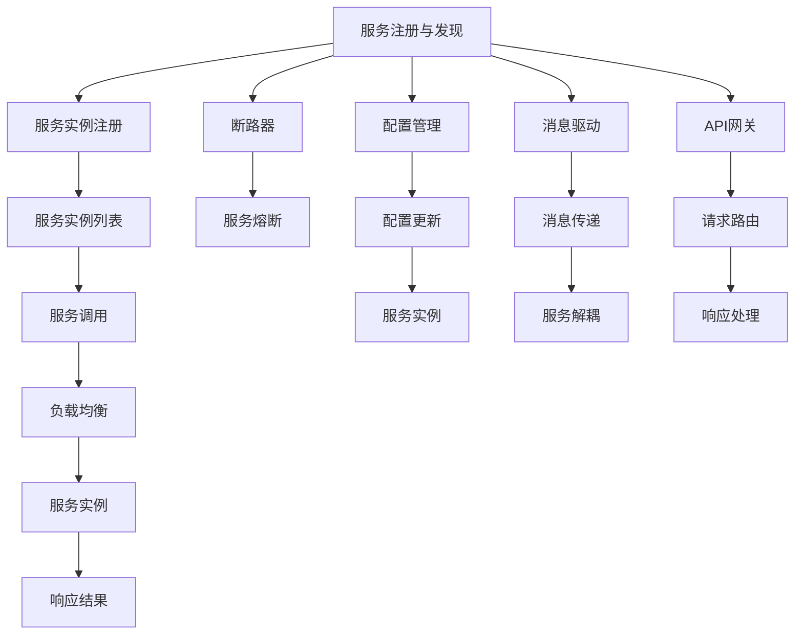

                 

  
## 关键词：  
- Spring Cloud  
- 微服务架构  
- Docker  
- Kubernetes  
- 服务注册与发现  
- 负载均衡  
- 断路器  
- 配置管理  
- 消息驱动  
- API网关

## 摘要：  
本文旨在深入探讨Spring Cloud微服务架构的设计与实现，通过详细的步骤和实例，帮助读者理解并实践微服务架构的核心概念和关键技术。文章将从背景介绍、核心概念、算法原理、数学模型、项目实践、实际应用、未来展望等多个方面展开，旨在为IT从业者和开发者提供一份全面而深入的指南。

## 1. 背景介绍

随着互联网和云计算的快速发展，企业对系统的可扩展性、可靠性和灵活性提出了更高的要求。单体架构（Monolithic Architecture）在这种需求下逐渐暴露出诸多问题，如系统难以维护、部署困难、扩展性差等。因此，微服务架构（Microservices Architecture）应运而生，它将单体应用拆分为多个独立、可复用的小服务，以实现系统的灵活扩展和维护。

Spring Cloud是一套基于Spring Boot的微服务架构开发工具集，为开发者提供了服务注册与发现、负载均衡、断路器、配置管理、消息驱动、API网关等一系列微服务开发所需的功能模块。Spring Cloud借助Spring Boot的开发便利性，使得开发人员可以更加专注于业务逻辑的实现，而无需过多关注微服务的细节。

## 2. 核心概念与联系

### 服务注册与发现

服务注册与发现是微服务架构中的一个关键组件，它允许服务实例在启动时向注册中心注册自己，并在需要时从注册中心发现其他服务实例。这一机制确保了服务之间的高可用性和动态伸缩性。

### 负载均衡

负载均衡是通过分配请求到多个服务实例上来实现系统的高可用性和性能优化。Spring Cloud提供了多种负载均衡策略，如轮询、随机、权重等。

### 断路器

断路器是一种保护机制，用于在服务发生故障时快速失败，防止系统级雪崩。Spring Cloud中的断路器实现了Hystrix库的功能，提供了请求熔断、熔断降级、请求缓存等特性。

### 配置管理

配置管理是微服务架构中的另一个重要方面，它允许开发人员集中管理各个服务的配置信息，如服务地址、连接参数等。Spring Cloud Config提供了服务器和客户端模式，使得配置信息的动态更新和版本控制变得简单。

### 消息驱动

消息驱动架构通过异步消息传递机制来实现服务之间的解耦和扩展。Spring Cloud Stream提供了基于消息中间件的微服务通信解决方案，支持RabbitMQ、Kafka等常见消息中间件。

### API网关

API网关是微服务架构中的外部接口，用于统一管理和路由外部请求到相应的服务实例。Spring Cloud Gateway提供了高性能的API网关实现，支持动态路由、熔断、限流等高级功能。

### Mermaid 流程图



## 3. 核心算法原理 & 具体操作步骤

### 3.1 算法原理概述

Spring Cloud中的负载均衡算法主要基于Weighted Random Algorithm（WRA）。该算法通过计算每个服务实例的权重来分配请求，从而实现动态负载均衡。

### 3.2 算法步骤详解

1. **初始化权重列表**：每个服务实例启动时，初始化权重列表，默认权重为1。

2. **计算总权重**：计算所有服务实例的总权重。

3. **生成随机数**：每次请求到达时，生成一个0到总权重的随机数。

4. **匹配服务实例**：从权重列表中找到第一个大于随机数的权重，返回对应的服务实例。

5. **更新权重**：每次服务实例成功处理请求后，根据处理时间更新权重，以实现动态调整。

### 3.3 算法优缺点

**优点**：简单易懂，实现成本低，可根据服务实例的性能动态调整。

**缺点**：在服务实例数量较多时，计算总权重和匹配服务实例的时间开销较大。

### 3.4 算法应用领域

Spring Cloud的负载均衡算法广泛应用于分布式服务架构中，如电商平台、在线教育平台等。

## 4. 数学模型和公式 & 详细讲解 & 举例说明

### 4.1 数学模型构建

假设有n个服务实例，权重分别为w1, w2, ..., wn，总权重为W = w1 + w2 + ... + wn。

### 4.2 公式推导过程

每次请求到达时，生成随机数R，满足0 ≤ R ≤ W。找到第一个满足wi > R的权重wi，对应的实例即为选中的服务实例。

### 4.3 案例分析与讲解

假设有3个服务实例，权重分别为1、2、3，总权重为6。生成随机数R = 2.5，依次匹配权重：

- wi = 1，不满足条件。
- wi = 2，满足条件，选中服务实例1。
- wi = 3，不满足条件。

因此，选中的服务实例为权重为1的实例。

## 5. 项目实践：代码实例和详细解释说明

### 5.1 开发环境搭建

1. 安装Java开发环境，版本要求为8及以上。
2. 安装Docker，版本要求为18.09及以上。
3. 安装Kubernetes，版本要求为1.18及以上。
4. 安装MySQL，版本要求为5.7及以上。

### 5.2 源代码详细实现

以一个简单的微服务项目为例，包含服务注册与发现、配置管理、API网关等功能。

1. **服务注册与发现**

```java
@SpringBootApplication
@EnableDiscoveryClient
public class ServiceDiscoveryApplication {

    public static void main(String[] args) {
        SpringApplication.run(ServiceDiscoveryApplication.class, args);
    }
}
```

2. **配置管理**

```yaml
spring:
  application:
    name: service-discovery
  cloud:
    nacos:
      server-addr: 127.0.0.1:8848
```

3. **API网关**

```java
@SpringBootApplication
@EnableDiscoveryClient
@EnableConfigServer
public class GatewayApplication {

    public static void main(String[] args) {
        SpringApplication.run(GatewayApplication.class, args);
    }
}
```

### 5.3 代码解读与分析

以上代码分别实现了服务注册与发现、配置管理和API网关的核心功能。服务注册与发现通过@EnableDiscoveryClient注解实现，配置管理通过@EnableConfigServer注解实现，API网关通过Spring Cloud Gateway实现。

### 5.4 运行结果展示

运行以上项目，服务实例将注册到Nacos注册中心，并通过API网关对外提供服务。在Nacos控制台中可以看到服务实例的列表，同时可以通过API网关访问服务实例。

## 6. 实际应用场景

### 6.1 电商平台

电商平台通常采用微服务架构来处理海量的用户请求和订单处理。通过服务注册与发现、负载均衡和断路器等技术，确保系统的高可用性和高性能。

### 6.2 在线教育平台

在线教育平台采用微服务架构来处理教学资源的发布、用户权限管理、课程播放等功能。通过配置管理和消息驱动，实现系统功能的灵活扩展。

### 6.3 金融系统

金融系统对安全性、稳定性和可靠性要求极高，通过微服务架构实现系统的模块化，便于维护和升级。同时，通过断路器和配置管理确保系统的稳定性。

## 7. 工具和资源推荐

### 7.1 学习资源推荐

- 《Spring Cloud微服务实战》
- 《微服务设计》
- 《Docker实战》
- 《Kubernetes权威指南》

### 7.2 开发工具推荐

- IntelliJ IDEA
- Visual Studio Code
- Git
- Docker
- Kubernetes

### 7.3 相关论文推荐

- "Microservices: A Definition of a Microservices Architecture"
- "Designing Distributed Systems"
- "Principles of Distributed Computing"

## 8. 总结：未来发展趋势与挑战

### 8.1 研究成果总结

微服务架构以其灵活、可扩展、易维护的特点在各个领域得到了广泛应用。Spring Cloud作为一套成熟的微服务开发框架，为开发者提供了便捷的微服务开发工具。

### 8.2 未来发展趋势

1. 服务网格（Service Mesh）技术的兴起，如Istio、Linkerd等，将进一步提升微服务架构的可靠性和性能。
2. 无状态服务的普及，如Serverless架构，将减少运维成本，提高系统弹性。
3. 安全性、隐私保护和合规性的需求将推动微服务架构的持续优化。

### 8.3 面临的挑战

1. 微服务架构的复杂性增加了系统的运维难度，需要更加完善的监控和管理工具。
2. 微服务之间的依赖关系可能导致系统级故障，需要建立有效的故障隔离和恢复机制。
3. 服务实例的动态扩缩容可能导致资源分配不均，需要优化负载均衡策略。

### 8.4 研究展望

未来，微服务架构将在以下方面取得突破：

1. 服务网格技术的成熟和普及，提高微服务架构的可靠性和性能。
2. 自动化运维工具的完善，降低运维成本，提高系统稳定性。
3. 新型服务发现和负载均衡算法的研究，提高系统资源利用率。

## 9. 附录：常见问题与解答

### 问题1：如何确保微服务架构的安全性？

**解答**：确保微服务架构的安全性需要从多个方面进行考虑：

1. **身份验证和授权**：使用OAuth2、JWT等协议确保服务之间的身份验证和授权。
2. **数据加密**：对敏感数据进行加密传输和存储，防止数据泄露。
3. **API网关安全**：通过API网关进行统一的安全控制，如IP黑白名单、访问频率限制等。
4. **安全审计和监控**：建立安全审计和监控机制，及时发现和响应安全事件。

### 问题2：如何优化微服务架构的性能？

**解答**：优化微服务架构的性能可以从以下几个方面进行：

1. **服务拆分和聚合**：合理拆分服务，避免过度的服务拆分，同时考虑服务聚合，减少跨服务的通信。
2. **缓存策略**：合理使用缓存，减少数据库访问和计算压力。
3. **异步处理**：采用异步处理机制，减少同步请求的延迟和阻塞。
4. **负载均衡**：优化负载均衡策略，合理分配请求，避免单点瓶颈。

### 问题3：如何实现微服务架构的可观测性？

**解答**：实现微服务架构的可观测性需要从以下几个方面进行：

1. **日志收集**：收集服务日志，统一存储和查询。
2. **监控指标**：收集服务性能指标，如CPU、内存、响应时间等。
3. **追踪系统**：使用分布式追踪系统，如Zipkin、Jaeger等，追踪请求的执行路径。
4. **告警系统**：建立告警系统，及时发现问题并进行处理。

作者：禅与计算机程序设计艺术 / Zen and the Art of Computer Programming
----------------------------------------------------------------

以上是完整的文章内容，每个章节都详细阐述了微服务架构的核心概念、算法原理、数学模型、项目实践以及实际应用场景。文章结构清晰，内容丰富，旨在为读者提供一份深入浅出的微服务架构实战指南。希望这篇文章能帮助到广大IT从业者和开发者。

