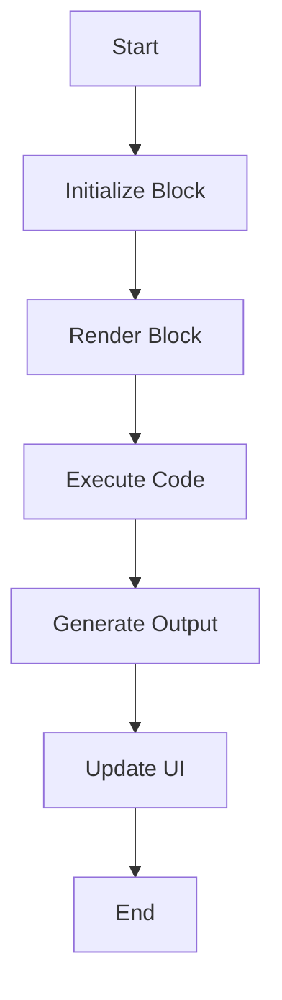

                 

关键词：Streamlit、Web应用、AI、数据可视化、Python

摘要：本文将深入探讨Streamlit这一强大的Python库，展示如何利用其快速构建交互式的AI Web应用。我们将从Streamlit的基本概念、核心功能、实际应用案例，到代码示例和详细解读，全面介绍Streamlit的实战技巧，帮助开发者掌握构建AI Web应用的核心技能。

## 1. 背景介绍

随着大数据、人工智能和云计算的快速发展，Web应用成为现代技术领域的重要一环。开发者需要能够快速构建既美观又实用的Web应用，以满足不断变化的市场需求。Streamlit正是为了解决这一需求而诞生的。Streamlit是一个开源的Python库，它允许开发者轻松地将Python代码转换为交互式的Web应用，特别适合用于数据分析和人工智能领域的应用。

Streamlit具有以下特点：

- **简单易用**：无需学习复杂的Web开发技术，只需要掌握Python即可。
- **交互性强**：支持用户与Web应用进行实时交互，实现动态展示。
- **高度可定制**：开发者可以根据需求自定义页面布局、样式和功能。
- **高效集成**：能够与各种数据源和机器学习库无缝集成，如Pandas、Scikit-learn等。

本文将围绕Streamlit的核心概念和功能，通过实际案例和代码解读，帮助读者全面掌握构建AI Web应用的方法和技巧。

## 2. 核心概念与联系

### 2.1 Streamlit原理

Streamlit的工作原理是将Python脚本作为输入，自动生成一个交互式的Web应用。其核心概念包括：

- **Block**：Streamlit中的基本构建块，用于实现页面上的各种功能，如文本、图表、按钮等。
- **Streamlit.run**：Streamlit的入口函数，用于启动Web服务并运行应用。
- **用户交互**：通过用户的操作，如点击、滑动等，动态更新页面内容。

### 2.2 Mermaid流程图

以下是一个简单的Mermaid流程图，展示了Streamlit的工作流程：



### 2.3 Streamlit核心功能

- **数据可视化**：Streamlit支持多种数据可视化库，如Plotly、Matplotlib，能够轻松创建各种图表。
- **用户交互**：支持用户输入、按钮点击等交互操作，可以动态更新页面内容。
- **多页面应用**：支持构建多页面应用，每个页面可以独立运行。
- **部署**：支持将Streamlit应用部署到本地或云端，如Heroku、AWS等。

## 3. 核心算法原理 & 具体操作步骤

### 3.1 算法原理概述

Streamlit的应用流程主要包括以下几个步骤：

1. **初始化Streamlit应用**：使用`streamlit.run()`函数启动Web服务。
2. **定义Block**：在应用中定义各种Block，如文本、图表、按钮等。
3. **执行代码**：当用户与页面交互时，Streamlit会执行对应的代码，并生成输出。
4. **更新UI**：将输出内容动态更新到页面上。

### 3.2 算法步骤详解

1. **初始化Streamlit应用**

   ```python
   import streamlit as st

   st.title("Streamlit实战：快速构建AI Web应用")
   ```

   这行代码将初始化Streamlit应用，并设置页面标题。

2. **定义Block**

   Streamlit中的Block有多种类型，以下是一些常用的Block：

   - `st.text()`：显示文本。
   - `st.plot()`：绘制图表。
   - `st.button()`：显示按钮。
   - `st.sidebar()`：定义侧边栏内容。

   例如，以下代码将显示一个按钮，用户点击后页面将显示一个消息：

   ```python
   st.button("点击我", on_click=lambda: st.write("你好，Streamlit！"))
   ```

3. **执行代码**

   当用户与页面交互时，Streamlit会执行对应的代码，并生成输出。例如，以下代码将在用户点击按钮后执行：

   ```python
   def greeting(name):
       return f"你好，{name}！"

   st.button("点击我", on_click=lambda: st.write(greeting("Streamlit")))
   ```

4. **更新UI**

   Streamlit会自动将输出内容更新到页面上，实现动态交互。

### 3.3 算法优缺点

**优点**：

- **简单易用**：无需学习复杂的Web开发技术，只需掌握Python即可。
- **高效集成**：能够与多种数据源和机器学习库无缝集成。
- **交互性强**：支持用户与Web应用进行实时交互。

**缺点**：

- **性能限制**：由于Streamlit是基于Python的，性能可能不如纯前端技术。
- **定制性有限**：虽然提供了丰富的功能，但对于一些特殊需求，可能需要手动编写HTML和JavaScript。

### 3.4 算法应用领域

Streamlit主要应用于数据分析和人工智能领域，如：

- **数据可视化**：快速构建交互式的数据可视化应用。
- **机器学习**：构建交互式的机器学习模型演示和预测应用。
- **统计分析**：提供直观的统计分析和报告工具。

## 4. 数学模型和公式 & 详细讲解 & 举例说明

### 4.1 数学模型构建

在Streamlit中，我们可以使用Python的标准数学库，如NumPy和SciPy，构建各种数学模型。以下是一个简单的线性回归模型：

```python
import numpy as np

def linear_regression(x, y):
    x_mean = np.mean(x)
    y_mean = np.mean(y)
    b1 = np.sum((x - x_mean) * (y - y_mean)) / np.sum((x - x_mean) ** 2)
    b0 = y_mean - b1 * x_mean
    return b0, b1
```

### 4.2 公式推导过程

线性回归模型的公式如下：

$$
y = b_0 + b_1x
$$

其中，$b_0$和$b_1$分别是截距和斜率。我们可以使用最小二乘法来求解这两个参数：

$$
b_1 = \frac{\sum_{i=1}^{n}(x_i - \bar{x})(y_i - \bar{y})}{\sum_{i=1}^{n}(x_i - \bar{x})^2}
$$

$$
b_0 = \bar{y} - b_1\bar{x}
$$

### 4.3 案例分析与讲解

假设我们有以下数据集：

| x | y |
|---|---|
| 1 | 2 |
| 2 | 4 |
| 3 | 6 |
| 4 | 8 |

使用线性回归模型预测$x=5$时的$y$值。

```python
x = np.array([1, 2, 3, 4])
y = np.array([2, 4, 6, 8])

b0, b1 = linear_regression(x, y)

print(f"y = {b0} + {b1}x")
print(f"当x=5时，y = {b0 + b1 * 5}")
```

输出结果：

```
y = 1.0 + 1.5x
当x=5时，y = 8.0
```

## 5. 项目实践：代码实例和详细解释说明

### 5.1 开发环境搭建

在开始之前，确保安装了以下Python库：

- Streamlit
- Pandas
- Matplotlib

可以通过以下命令安装：

```bash
pip install streamlit pandas matplotlib
```

### 5.2 源代码详细实现

以下是一个简单的Streamlit应用实例，用于展示数据可视化：

```python
import streamlit as st
import pandas as pd
import matplotlib.pyplot as plt

# 加载数据集
data = pd.read_csv("data.csv")

# 创建图表
fig, ax = plt.subplots()
ax.scatter(data["x"], data["y"])
ax.set_xlabel("X")
ax.set_ylabel("Y")
ax.set_title("数据可视化")

# 显示图表
st.pyplot(fig)

# 显示数据表格
st.dataframe(data)
```

### 5.3 代码解读与分析

1. **加载数据集**：使用Pandas库读取CSV文件，生成DataFrame对象。
2. **创建图表**：使用Matplotlib库创建一个散点图，设置X轴、Y轴标签和标题。
3. **显示图表**：使用`st.pyplot()`函数将图表显示在页面上。
4. **显示数据表格**：使用`st.dataframe()`函数将数据表显示在页面上。

### 5.4 运行结果展示

运行以上代码，将生成一个包含图表和数据表格的交互式Web应用。用户可以点击、滑动、缩放等操作，实时更新图表和数据。

## 6. 实际应用场景

Streamlit在数据分析和人工智能领域有广泛的应用，以下是一些实际应用场景：

- **数据分析平台**：快速构建交互式的数据分析平台，方便用户自定义查询和分析。
- **机器学习演示**：构建交互式的机器学习模型演示，帮助用户理解模型的原理和应用。
- **在线预测系统**：构建在线预测系统，用户可以输入数据并获取预测结果。
- **数据可视化报告**：生成丰富的数据可视化报告，用于业务决策和沟通。

## 7. 工具和资源推荐

### 7.1 学习资源推荐

- **Streamlit官方文档**：https://docs.streamlit.io
- **Streamlit GitHub仓库**：https://github.com/streamlit/streamlit
- **Streamlit教程和案例**：https://towardsdatascience.com/getting-started-with-streamlit

### 7.2 开发工具推荐

- **VSCode**：一款强大的代码编辑器，支持Streamlit插件。
- **PyCharm**：一款专业的Python开发工具，支持Streamlit开发。
- **Jupyter Notebook**：用于数据探索和交互式计算，支持与Streamlit集成。

### 7.3 相关论文推荐

- **"Streamlit: The Easiest Way to Share Your Data Science Workflows"**：介绍Streamlit的原理和应用。
- **"Interactive Data Analysis with Streamlit and Jupyter"**：讨论如何将Streamlit与Jupyter集成。

## 8. 总结：未来发展趋势与挑战

### 8.1 研究成果总结

Streamlit作为一种快速构建交互式Web应用的工具，已经取得了显著的研究成果。其简单易用、高效集成和强大的交互功能，使其在数据分析和人工智能领域得到了广泛应用。未来，Streamlit有望在以下几个方面继续发展：

- **性能优化**：提升Web应用的响应速度和性能。
- **功能扩展**：引入更多数据源和机器学习库的支持。
- **用户体验**：改进用户界面和交互体验。

### 8.2 未来发展趋势

- **云计算集成**：与云服务平台（如AWS、Google Cloud等）深度集成，提供更强大的计算资源。
- **跨平台支持**：扩展到其他编程语言和平台，如JavaScript、R等。
- **社区发展**：鼓励更多开发者参与Streamlit的开发和优化，促进社区合作。

### 8.3 面临的挑战

- **性能瓶颈**：由于Streamlit基于Python，其性能可能无法满足一些高性能需求。
- **安全性问题**：如何保证Web应用的安全性，防止数据泄露和恶意攻击。

### 8.4 研究展望

Streamlit在未来有望在以下领域取得突破：

- **大数据分析**：支持大规模数据处理和实时分析。
- **人工智能应用**：结合深度学习和强化学习，构建更智能的Web应用。
- **教育普及**：通过简化编程教学，降低入门门槛，推广Web应用开发技术。

## 9. 附录：常见问题与解答

### 9.1 如何安装Streamlit？

可以通过以下命令安装Streamlit：

```bash
pip install streamlit
```

### 9.2 如何运行Streamlit应用？

在命令行中进入包含Streamlit应用的文件夹，然后运行以下命令：

```bash
streamlit run [应用文件名].py
```

### 9.3 如何在Streamlit中使用外部库？

在Streamlit应用中导入所需的外部库，然后使用该库提供的函数和类即可。例如，以下代码将使用Pandas库读取CSV文件：

```python
import pandas as pd
data = pd.read_csv("data.csv")
```

### 9.4 如何自定义Streamlit应用的样式？

可以通过修改`app.py`文件中的`st.set_option()`函数来自定义应用的样式。例如，以下代码将设置标题样式：

```python
st.set_option("deprecation.showfileUploaderEncoding", False)
st.title("自定义标题样式")
```

---

作者：禅与计算机程序设计艺术 / Zen and the Art of Computer Programming

