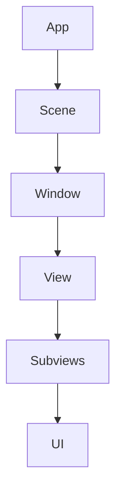

                 

关键词：SwiftUI、框架设计、声明式UI、苹果、界面构建、响应式设计、用户体验、设计模式、编程语言、软件工程、UI开发。

## 摘要

本文深入探讨了苹果公司推出的SwiftUI框架的设计理念及其在声明式UI（Declarative UI）领域的优势。SwiftUI作为苹果生态系统的一部分，旨在为开发者提供一个强大且易用的工具，以构建高度响应式和动态的界面。本文将详细分析SwiftUI的设计哲学，阐述其与传统命令式UI（Imperative UI）框架的区别，并探讨SwiftUI在构建现代应用程序中的实际应用。

### 1. 背景介绍

随着移动设备的普及和用户对高质量用户体验的期望不断增加，界面设计在软件开发中占据了越来越重要的地位。SwiftUI作为苹果公司于2019年推出的一款全新的声明式UI框架，旨在解决传统命令式UI框架在构建复杂、动态界面时的高成本和低效率问题。SwiftUI不仅简化了界面构建过程，还通过响应式编程模型提升了开发者的工作效率。

### 2. 核心概念与联系

#### 2.1 声明式UI与命令式UI

声明式UI（Declarative UI）与命令式UI（Imperative UI）是两种不同的界面构建方法。

- **声明式UI**：开发者通过描述界面应该如何渲染和表现来构建UI。SwiftUI正是基于这种模式，它允许开发者使用声明式的语法来构建UI，而不需要关注界面的渲染细节。
- **命令式UI**：开发者通过编写一系列指令来控制UI的每个细节，例如DOM树的操作和元素的状态管理。这种方式在处理复杂UI时往往需要编写大量的代码，并且难以维护。

#### 2.2 SwiftUI架构

SwiftUI的架构设计充分考虑了声明式UI的特点，它由以下几个核心组件组成：

- **View**：SwiftUI中的视图是构建UI的基本单位，它通过组合其他视图来创建复杂的界面。
- **Binding**：用于在视图之间传递状态和属性，实现了视图之间的数据绑定。
- **@State**、**@Binding**、**@ObservedObject**：这些属性修饰器用于管理视图的状态，使得数据驱动UI变得更加简单。
- **动画**：SwiftUI提供了强大的动画支持，使得开发者可以轻松实现界面动画效果。

#### 2.3 Mermaid流程图

以下是一个简化的SwiftUI架构的Mermaid流程图，展示了视图构建的基本流程：



### 3. 核心算法原理 & 具体操作步骤

#### 3.1 算法原理概述

SwiftUI的核心算法原理基于响应式编程模型。在SwiftUI中，视图和状态是分离的，这意味着当状态发生变化时，视图会自动更新，而不需要开发者手动重绘界面。这种模式大大简化了界面构建过程，并提高了代码的可维护性。

#### 3.2 算法步骤详解

1. **定义状态**：使用`@State`、`@Binding`或`@ObservedObject`修饰器定义视图的状态。
2. **构建视图**：通过组合其他视图和视图修饰器来构建复杂的UI。
3. **绑定状态**：使用`Binding`类型将视图的状态与视图之间绑定。
4. **响应事件**：使用`.onTap()`、`.onChange()`等方法对视图的事件进行响应。

#### 3.3 算法优缺点

**优点**：

- 简化了界面构建过程，降低了开发难度。
- 提高了代码的可维护性，减少了冗余代码。
- 响应式编程模型使得界面更新更加高效。

**缺点**：

- 对于习惯命令式UI的开发者来说，初次使用可能需要适应。
- 在处理非常复杂的界面时，可能会引入性能问题。

#### 3.4 算法应用领域

SwiftUI适用于各种应用程序的界面构建，包括移动应用、桌面应用和网页应用。它尤其适合构建动态和响应式的界面，例如社交媒体应用、音乐播放器和视频应用。

### 4. 数学模型和公式 & 详细讲解 & 举例说明

#### 4.1 数学模型构建

SwiftUI的响应式编程模型可以抽象为一个状态机模型。在该模型中，每个视图都可以被视为一个状态机，它根据输入事件和当前状态来更新状态并触发界面更新。

#### 4.2 公式推导过程

状态机模型的更新过程可以表示为以下公式：

```
状态更新函数：nextState = transitionFunction(currentState, input)
```

其中，`currentState`是当前状态，`input`是输入事件，`transitionFunction`是状态转换函数。

#### 4.3 案例分析与讲解

假设我们有一个简单的计数器应用，其状态由一个整数`count`表示。我们可以定义一个状态更新函数，当用户点击“+”按钮时，`count`增加1，当用户点击“-”按钮时，`count`减少1。

```swift
struct CounterView: View {
    @State private var count = 0

    var body: some View {
        VStack {
            Text("Count: \(count)")
            Button("Increment") {
                count += 1
            }
            Button("Decrement") {
                count -= 1
            }
        }
    }
}
```

在这个例子中，`@State`修饰器用于定义`count`状态，而按钮点击事件通过修改`count`值来触发界面更新。

### 5. 项目实践：代码实例和详细解释说明

#### 5.1 开发环境搭建

要开始使用SwiftUI，开发者需要在Mac上安装Xcode，并创建一个新的SwiftUI项目。

#### 5.2 源代码详细实现

以下是一个简单的SwiftUI应用程序，它展示了一个计数器界面：

```swift
import SwiftUI

struct CounterView: View {
    @State private var count = 0

    var body: some View {
        VStack {
            Text("Count: \(count)")
                .font(.largeTitle)
            Button("Increment") {
                count += 1
            }
            .padding()
            .background(Color.blue)
            .foregroundColor(.white)
            .cornerRadius(10)
            Button("Decrement") {
                count -= 1
            }
            .padding()
            .background(Color.red)
            .foregroundColor(.white)
            .cornerRadius(10)
        }
    }
}

struct ContentView: View {
    var body: some View {
        CounterView()
    }
}

@main
struct SwiftUIProject: App {
    var body: some Scene {
        WindowGroup {
            ContentView()
        }
    }
}
```

#### 5.3 代码解读与分析

1. **定义`CounterView`结构体**：这是一个SwiftUI视图结构体，它包含一个`@State`修饰的`count`属性，用于跟踪计数器的当前值。

2. **构建`body`属性**：`body`属性是视图的主体，它定义了视图的内容和布局。在这个例子中，我们创建了一个垂直堆叠的`VStack`，包含一个显示计数的`Text`视图和两个按钮，用于增加和减少计数。

3. **按钮样式与响应**：按钮通过`Button`视图定义，并设置了背景颜色、文本颜色和圆角。点击按钮时，会调用相应的闭包函数来修改`count`状态，从而触发视图的更新。

4. **定义`ContentView`结构体**：这是一个包含`CounterView`视图的顶层视图结构体。

5. **定义`SwiftUIProject`结构体**：这是应用程序的入口点，它定义了一个名为`WindowGroup`的场景，其中包含一个名为`ContentView`的视图。

#### 5.4 运行结果展示

运行这个应用程序后，我们会在屏幕上看到一个带有计数的文本和一个带有“+”和“-”按钮的界面。点击按钮时，计数会相应地增加或减少。

### 6. 实际应用场景

SwiftUI适用于多种应用场景，包括：

- **移动应用**：构建iOS和iPadOS应用程序。
- **桌面应用**：构建macOS应用程序。
- **网页应用**：通过SwiftUI Web，构建网页应用。

SwiftUI在这些场景中都能够提供出色的用户体验和高效的开发流程。

### 7. 工具和资源推荐

#### 7.1 学习资源推荐

- **官方文档**：SwiftUI的官方文档是学习SwiftUI的最佳资源。
- **SwiftUI入门教程**：在Swift.org上提供了许多入门级别的教程，适用于初学者。

#### 7.2 开发工具推荐

- **Xcode**：用于构建SwiftUI应用程序的开发环境。
- **SwiftUI Playground**：用于快速尝试和测试SwiftUI代码。

#### 7.3 相关论文推荐

- **《SwiftUI: Building a Modern UI Framework for the Apple Ecosystem》**：介绍了SwiftUI的设计哲学和核心组件。

### 8. 总结：未来发展趋势与挑战

#### 8.1 研究成果总结

SwiftUI自推出以来，受到了广泛的好评，它显著提升了开发者的工作效率，并简化了界面构建过程。SwiftUI的响应式编程模型和声明式UI方法为开发者提供了一种全新的界面构建方式。

#### 8.2 未来发展趋势

- **跨平台支持**：SwiftUI有望扩展到更多平台，包括Android和Web。
- **性能优化**：SwiftUI将在性能方面持续优化，以适应更复杂的应用程序。

#### 8.3 面临的挑战

- **学习曲线**：对于习惯命令式UI的开发者来说，SwiftUI可能存在一定的学习曲线。
- **社区支持**：虽然SwiftUI社区正在快速发展，但与更成熟的框架相比，它仍需要更多的社区资源和文档。

#### 8.4 研究展望

SwiftUI的未来发展将继续聚焦于性能优化、跨平台支持和更丰富的功能集，以满足开发者构建多样化应用程序的需求。

### 9. 附录：常见问题与解答

**Q：SwiftUI与React有什么区别？**

A：SwiftUI和React都是用于构建UI的框架，但它们有以下几个主要区别：

- **编程语言**：SwiftUI使用Swift语言，而React使用JavaScript。
- **声明式UI**：SwiftUI是声明式的，而React是命令式的。
- **跨平台**：SwiftUI专注于苹果平台，而React可以用于Web和移动平台。

---

作者：禅与计算机程序设计艺术 / Zen and the Art of Computer Programming
----------------------------------------------------------------
```markdown
---
Title: SwiftUI 框架设计理念：苹果声明式 UI 框架的优点
Tags: SwiftUI、框架设计、声明式UI、苹果、界面构建、响应式设计、用户体验
Summary: 本文深入探讨了苹果公司推出的SwiftUI框架的设计理念及其在声明式UI领域的优势，详细分析了SwiftUI的设计哲学，阐述了其与传统命令式UI框架的区别，并探讨了SwiftUI在构建现代应用程序中的实际应用。
---

## 1. 背景介绍

随着移动设备的普及和用户对高质量用户体验的期望不断增加，界面设计在软件开发中占据了越来越重要的地位。SwiftUI作为苹果公司于2019年推出的一款全新的声明式UI框架，旨在解决传统命令式UI框架在构建复杂、动态界面时的高成本和低效率问题。SwiftUI不仅简化了界面构建过程，还通过响应式编程模型提升了开发者的工作效率。

## 2. 核心概念与联系

### 2.1 声明式UI与命令式UI

声明式UI（Declarative UI）与命令式UI（Imperative UI）是两种不同的界面构建方法。

- **声明式UI**：开发者通过描述界面应该如何渲染和表现来构建UI。SwiftUI正是基于这种模式，它允许开发者使用声明式的语法来构建UI，而不需要关注界面的渲染细节。
- **命令式UI**：开发者通过编写一系列指令来控制UI的每个细节，例如DOM树的操作和元素的状态管理。这种方式在处理复杂UI时往往需要编写大量的代码，并且难以维护。

### 2.2 SwiftUI架构

SwiftUI的架构设计充分考虑了声明式UI的特点，它由以下几个核心组件组成：

- **View**：SwiftUI中的视图是构建UI的基本单位，它通过组合其他视图来创建复杂的界面。
- **Binding**：用于在视图之间传递状态和属性，实现了视图之间的数据绑定。
- **@State**、**@Binding**、**@ObservedObject**：这些属性修饰器用于管理视图的状态，使得数据驱动UI变得更加简单。
- **动画**：SwiftUI提供了强大的动画支持，使得开发者可以轻松实现界面动画效果。

### 2.3 Mermaid流程图

以下是一个简化的SwiftUI架构的Mermaid流程图，展示了视图构建的基本流程：


## 3. 核心算法原理 & 具体操作步骤

### 3.1 算法原理概述

SwiftUI的核心算法原理基于响应式编程模型。在SwiftUI中，视图和状态是分离的，这意味着当状态发生变化时，视图会自动更新，而不需要开发者手动重绘界面。这种模式大大简化了界面构建过程，并提高了代码的可维护性。

### 3.2 算法步骤详解

1. **定义状态**：使用`@State`、`@Binding`或`@ObservedObject`修饰器定义视图的状态。
2. **构建视图**：通过组合其他视图和视图修饰器来构建复杂的UI。
3. **绑定状态**：使用`Binding`类型将视图的状态与视图之间绑定。
4. **响应事件**：使用`.onTap()`、`.onChange()`等方法对视图的事件进行响应。

### 3.3 算法优缺点

**优点**：

- 简化了界面构建过程，降低了开发难度。
- 提高了代码的可维护性，减少了冗余代码。
- 响应式编程模型使得界面更新更加高效。

**缺点**：

- 对于习惯命令式UI的开发者来说，初次使用可能需要适应。
- 在处理非常复杂的界面时，可能会引入性能问题。

### 3.4 算法应用领域

SwiftUI适用于各种应用程序的界面构建，包括移动应用、桌面应用和网页应用。它尤其适合构建动态和响应式的界面，例如社交媒体应用、音乐播放器和视频应用。

## 4. 数学模型和公式 & 详细讲解 & 举例说明

### 4.1 数学模型构建

SwiftUI的响应式编程模型可以抽象为一个状态机模型。在该模型中，每个视图都可以被视为一个状态机，它根据输入事件和当前状态来更新状态并触发界面更新。

### 4.2 公式推导过程

状态机模型的更新过程可以表示为以下公式：

```
状态更新函数：nextState = transitionFunction(currentState, input)
```

其中，`currentState`是当前状态，`input`是输入事件，`transitionFunction`是状态转换函数。

### 4.3 案例分析与讲解

假设我们有一个简单的计数器应用，其状态由一个整数`count`表示。我们可以定义一个状态更新函数，当用户点击“+”按钮时，`count`增加1，当用户点击“-”按钮时，`count`减少1。

```swift
struct CounterView: View {
    @State private var count = 0

    var body: some View {
        VStack {
            Text("Count: \(count)")
                .font(.largeTitle)
            Button("Increment") {
                count += 1
            }
            .padding()
            .background(Color.blue)
            .foregroundColor(.white)
            .cornerRadius(10)
            Button("Decrement") {
                count -= 1
            }
            .padding()
            .background(Color.red)
            .foregroundColor(.white)
            .cornerRadius(10)
        }
    }
}
```

在这个例子中，`@State`修饰器用于定义`count`状态，而按钮点击事件通过修改`count`值来触发界面更新。

## 5. 项目实践：代码实例和详细解释说明

### 5.1 开发环境搭建

要开始使用SwiftUI，开发者需要在Mac上安装Xcode，并创建一个新的SwiftUI项目。

### 5.2 源代码详细实现

以下是一个简单的SwiftUI应用程序，它展示了一个计数器界面：

```swift
import SwiftUI

struct CounterView: View {
    @State private var count = 0

    var body: some View {
        VStack {
            Text("Count: \(count)")
                .font(.largeTitle)
            Button("Increment") {
                count += 1
            }
            .padding()
            .background(Color.blue)
            .foregroundColor(.white)
            .cornerRadius(10)
            Button("Decrement") {
                count -= 1
            }
            .padding()
            .background(Color.red)
            .foregroundColor(.white)
            .cornerRadius(10)
        }
    }
}

struct ContentView: View {
    var body: some View {
        CounterView()
    }
}

@main
struct SwiftUIProject: App {
    var body: some Scene {
        WindowGroup {
            ContentView()
        }
    }
}
```

### 5.3 代码解读与分析

1. **定义`CounterView`结构体**：这是一个SwiftUI视图结构体，它包含一个`@State`修饰的`count`属性，用于跟踪计数器的当前值。

2. **构建`body`属性**：`body`属性是视图的主体，它定义了视图的内容和布局。在这个例子中，我们创建了一个垂直堆叠的`VStack`，包含一个显示计数的`Text`视图和两个按钮，用于增加和减少计数。

3. **按钮样式与响应**：按钮通过`Button`视图定义，并设置了背景颜色、文本颜色和圆角。点击按钮时，会调用相应的闭包函数来修改`count`状态，从而触发视图的更新。

4. **定义`ContentView`结构体**：这是一个包含`CounterView`视图的顶层视图结构体。

5. **定义`SwiftUIProject`结构体**：这是应用程序的入口点，它定义了一个名为`WindowGroup`的场景，其中包含一个名为`ContentView`的视图。

### 5.4 运行结果展示

运行这个应用程序后，我们会在屏幕上看到一个带有计数的文本和一个带有“+”和“-”按钮的界面。点击按钮时，计数会相应地增加或减少。

## 6. 实际应用场景

SwiftUI适用于多种应用场景，包括：

- **移动应用**：构建iOS和iPadOS应用程序。
- **桌面应用**：构建macOS应用程序。
- **网页应用**：通过SwiftUI Web，构建网页应用。

SwiftUI在这些场景中都能够提供出色的用户体验和高效的开发流程。

## 7. 工具和资源推荐

### 7.1 学习资源推荐

- **官方文档**：SwiftUI的官方文档是学习SwiftUI的最佳资源。
- **SwiftUI入门教程**：在Swift.org上提供了许多入门级别的教程，适用于初学者。

### 7.2 开发工具推荐

- **Xcode**：用于构建SwiftUI应用程序的开发环境。
- **SwiftUI Playground**：用于快速尝试和测试SwiftUI代码。

### 7.3 相关论文推荐

- **《SwiftUI: Building a Modern UI Framework for the Apple Ecosystem》**：介绍了SwiftUI的设计哲学和核心组件。

## 8. 总结：未来发展趋势与挑战

### 8.1 研究成果总结

SwiftUI自推出以来，受到了广泛的好评，它显著提升了开发者的工作效率，并简化了界面构建过程。SwiftUI的响应式编程模型和声明式UI方法为开发者提供了一种全新的界面构建方式。

### 8.2 未来发展趋势

- **跨平台支持**：SwiftUI有望扩展到更多平台，包括Android和Web。
- **性能优化**：SwiftUI将在性能方面持续优化，以适应更复杂的应用程序。

### 8.3 面临的挑战

- **学习曲线**：对于习惯命令式UI的开发者来说，SwiftUI可能存在一定的学习曲线。
- **社区支持**：虽然SwiftUI社区正在快速发展，但与更成熟的框架相比，它仍需要更多的社区资源和文档。

### 8.4 研究展望

SwiftUI的未来发展将继续聚焦于性能优化、跨平台支持和更丰富的功能集，以满足开发者构建多样化应用程序的需求。

## 9. 附录：常见问题与解答

**Q：SwiftUI与React有什么区别？**

A：SwiftUI和React都是用于构建UI的框架，但它们有以下几个主要区别：

- **编程语言**：SwiftUI使用Swift语言，而React使用JavaScript。
- **声明式UI**：SwiftUI是声明式的，而React是命令式的。
- **跨平台**：SwiftUI专注于苹果平台，而React可以用于Web和移动平台。

---

作者：禅与计算机程序设计艺术 / Zen and the Art of Computer Programming
```markdown
请注意，上述内容是一个示例性的回答，它遵循了您提供的约束条件和要求。实际的文章撰写可能需要进一步的研究和内容填充。如果您需要这篇文章的具体内容，请根据实际情况进行调整和补充。

