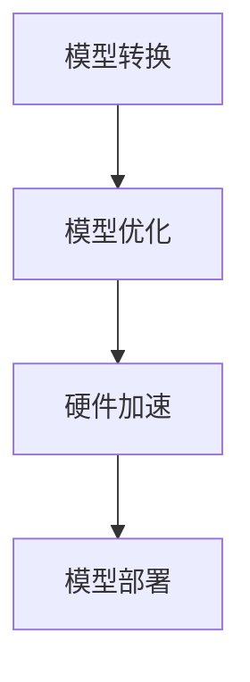

                 

 > **关键词：**TensorFlow Lite，移动AI，深度学习，模型优化，跨平台部署

> **摘要：**本文将深入探讨TensorFlow Lite——Google开发的针对移动设备优化的深度学习库。我们将从背景介绍、核心概念与联系、算法原理与具体操作步骤、数学模型和公式、项目实践、实际应用场景、未来应用展望、工具和资源推荐以及总结等方面，全面分析TensorFlow Lite的优势和应用前景。

## 1. 背景介绍

随着智能手机的普及和计算能力的提升，移动设备正在逐渐成为人工智能（AI）应用的一个重要平台。然而，传统的深度学习框架在移动设备上往往因为资源限制而难以高效运行。为了解决这一问题，Google 开发了TensorFlow Lite，这是一个专门为移动设备和嵌入式设备设计的轻量级深度学习库。TensorFlow Lite的目标是让开发者能够轻松地将AI模型部署到各种移动设备上，从而实现实时推理和交互式应用。

### 1.1 TensorFlow Lite的重要性

随着AI技术的快速发展，AI应用逐渐从云端走向边缘设备。移动设备由于其便携性和实时性的需求，成为了AI应用的一个重要场景。然而，移动设备在计算资源、存储容量和能耗方面受到限制，这对AI模型的部署提出了更高的要求。TensorFlow Lite正是为了满足这些需求而诞生的。

### 1.2 TensorFlow Lite的发展历程

TensorFlow Lite从2017年发布以来，已经经历了多个版本的迭代和改进。最新的版本中，TensorFlow Lite引入了更多的优化技术，如量化、算子融合等，使得模型在移动设备上的运行效率得到了显著提升。此外，TensorFlow Lite还支持多种硬件加速器，如NNAPI（神经网络加速器接口），进一步提高了模型的性能。

## 2. 核心概念与联系

### 2.1 TensorFlow Lite的核心概念

TensorFlow Lite主要包括以下几个核心概念：

- **模型转换**：将TensorFlow 1.x或2.x模型转换为TensorFlow Lite模型。这一过程涉及到模型结构的转换、层属性的调整以及权重数据的重新排列。
- **模型优化**：通过量化、算子融合等技术对模型进行优化，以降低模型的大小和运行时的能耗。
- **硬件加速**：TensorFlow Lite支持多种硬件加速器，如NNAPI、VPU、GPU等，以利用设备的硬件资源提升模型运行效率。

### 2.2 Mermaid流程图



### 2.3 TensorFlow Lite与其他框架的联系

TensorFlow Lite与TensorFlow、TensorFlow 2.x等传统深度学习框架密切相关。通过TensorFlow Lite，开发者可以将训练好的TensorFlow模型部署到移动设备上。此外，TensorFlow Lite还与TensorFlow 2.x保持同步更新，使得开发者可以方便地使用最新的深度学习技术和模型架构。

## 3. 核心算法原理 & 具体操作步骤

### 3.1 算法原理概述

TensorFlow Lite的核心算法原理主要包括以下几个方面：

- **模型转换**：将TensorFlow模型转换为TensorFlow Lite模型。这一过程主要涉及到模型结构的解析、层属性的调整以及权重数据的转换。
- **模型优化**：通过量化、算子融合等技术对模型进行优化，以降低模型的大小和运行时的能耗。量化技术将浮点权重转换为整数权重，从而减少模型存储和计算的资源消耗。算子融合技术将多个连续的运算操作合并为一个，从而减少运算的中间结果存储和传递，提高计算效率。
- **硬件加速**：TensorFlow Lite支持多种硬件加速器，如NNAPI、VPU、GPU等。这些硬件加速器可以显著提高模型的运行效率。

### 3.2 算法步骤详解

#### 3.2.1 模型转换

1. **准备TensorFlow模型**：首先需要有一个经过训练的TensorFlow模型，包括模型的架构和权重数据。
2. **安装TensorFlow Lite**：在开发环境中安装TensorFlow Lite，以便进行模型转换。
3. **使用`tf.lite.TFLiteConverter`进行转换**：将TensorFlow模型转换为TensorFlow Lite模型。转换过程中，可以通过设置参数对模型进行优化。
4. **保存转换后的模型**：将转换后的模型保存为`.tflite`文件，以便后续使用。

#### 3.2.2 模型优化

1. **量化**：通过设置量化参数，将浮点权重转换为整数权重。量化过程中需要选择合适的量化精度，以平衡模型精度和资源消耗。
2. **算子融合**：通过设置算子融合参数，将多个连续的运算操作合并为一个。算子融合可以减少中间结果的存储和传递，提高计算效率。
3. **模型压缩**：通过设置模型压缩参数，进一步降低模型的大小和运行时的能耗。

#### 3.2.3 硬件加速

1. **选择硬件加速器**：根据设备的硬件配置，选择合适的硬件加速器，如NNAPI、VPU、GPU等。
2. **配置硬件加速器**：通过设置硬件加速器的参数，如计算精度、线程数等，优化硬件加速器的性能。
3. **运行模型**：在硬件加速器上运行转换后的模型，进行推理操作。

### 3.3 算法优缺点

#### 优点：

- **高效**：通过模型优化和硬件加速，TensorFlow Lite可以显著提高模型的运行效率。
- **轻量级**：TensorFlow Lite设计的初衷就是为了在移动设备和嵌入式设备上运行，因此具有较小的模型大小和较低的资源消耗。
- **跨平台**：TensorFlow Lite支持多种移动设备和操作系统，如Android、iOS、Linux等。

#### 缺点：

- **模型精度**：由于量化技术的引入，模型的精度可能会受到一定影响。开发者需要权衡模型精度和资源消耗之间的关系。
- **兼容性**：虽然TensorFlow Lite与TensorFlow 2.x保持同步更新，但一些较新的模型架构和功能可能无法直接迁移到TensorFlow Lite。

### 3.4 算法应用领域

TensorFlow Lite的应用领域非常广泛，包括但不限于以下几个方面：

- **图像识别**：通过TensorFlow Lite，开发者可以在移动设备上实现实时图像识别，如人脸识别、物体检测等。
- **语音识别**：利用TensorFlow Lite，开发者可以在移动设备上实现实时语音识别，为用户提供便捷的自然语言交互体验。
- **自然语言处理**：TensorFlow Lite可以用于移动设备上的自然语言处理任务，如文本分类、情感分析等。

## 4. 数学模型和公式 & 详细讲解 & 举例说明

### 4.1 数学模型构建

在TensorFlow Lite中，数学模型的构建是关键步骤。以下是一个简单的数学模型示例：

$$
Y = \sigma(W_1 \cdot X + b_1)
$$

其中，$Y$是输出，$X$是输入，$W_1$和$b_1$分别是权重和偏置。$\sigma$是激活函数，通常使用Sigmoid函数或ReLU函数。

### 4.2 公式推导过程

#### 4.2.1 Sigmoid函数

Sigmoid函数的公式为：

$$
\sigma(x) = \frac{1}{1 + e^{-x}}
$$

其导数为：

$$
\sigma'(x) = \sigma(x) \cdot (1 - \sigma(x))
$$

#### 4.2.2 ReLU函数

ReLU函数的公式为：

$$
\sigma(x) = \max(0, x)
$$

其导数为：

$$
\sigma'(x) = \begin{cases}
1, & \text{if } x > 0 \\
0, & \text{otherwise}
\end{cases}
$$

### 4.3 案例分析与讲解

以下是一个简单的TensorFlow Lite模型构建和推理案例：

#### 4.3.1 模型构建

```python
import tensorflow as tf

# 定义输入层
input_layer = tf.keras.layers.Input(shape=(28, 28, 1))

# 定义卷积层
conv_layer = tf.keras.layers.Conv2D(filters=32, kernel_size=(3, 3), activation='relu')(input_layer)

# 定义池化层
pooling_layer = tf.keras.layers.MaxPooling2D(pool_size=(2, 2))(conv_layer)

# 定义全连接层
dense_layer = tf.keras.layers.Dense(units=64, activation='relu')(pooling_layer)

# 定义输出层
output_layer = tf.keras.layers.Dense(units=10, activation='softmax')(dense_layer)

# 构建模型
model = tf.keras.Model(inputs=input_layer, outputs=output_layer)

# 打印模型结构
model.summary()
```

#### 4.3.2 模型转换

```python
# 将TensorFlow模型转换为TensorFlow Lite模型
converter = tf.lite.TFLiteConverter.from_keras_model(model)
tflite_model = converter.convert()

# 保存转换后的模型
with open('model.tflite', 'wb') as f:
    f.write(tflite_model)
```

#### 4.3.3 模型推理

```python
# 加载转换后的模型
interpreter = tf.lite.Interpreter(model_path='model.tflite')

# 配置输入和输出张量
input_index = interpreter.get_input_details()[0]['index']
output_index = interpreter.get_output_details()[0]['index']

# 准备输入数据
input_data = np.array([image], dtype=np.float32)
input_data = input_data / 255.0

# 运行模型
interpreter.allocate_tensors()
interpreter.set_tensor(input_index, input_data)
interpreter.invoke()

# 获取输出结果
output_data = interpreter.get_tensor(output_index)

# 打印输出结果
print("Predicted label:", np.argmax(output_data))
```

## 5. 项目实践：代码实例和详细解释说明

在本节中，我们将通过一个简单的项目实例，展示如何使用TensorFlow Lite在移动设备上实现图像分类。

### 5.1 开发环境搭建

1. **安装TensorFlow Lite**：在开发环境中安装TensorFlow Lite。对于Python环境，可以使用以下命令：

```bash
pip install tensorflow==2.7
pip install tensorflow-hub
```

2. **安装Android Studio**：下载并安装Android Studio，以便开发Android应用程序。

3. **创建Android项目**：在Android Studio中创建一个新的Android项目，选择适当的API级别和项目名称。

### 5.2 源代码详细实现

1. **加载TensorFlow Lite模型**：

```java
import org.tensorflow.lite.Interpreter;

// 加载TensorFlow Lite模型
try {
    Interpreter interpreter = new Interpreter(loadModelFile(context, "model.tflite"));
} catch (IOException e) {
    e.printStackTrace();
}
```

2. **预处理输入图像**：

```java
import android.graphics.Bitmap;
import android.graphics.Matrix;
import android.media.ExifInterface;

// 预处理输入图像
public Bitmap preprocessImage(Bitmap bitmap) {
    // 读取EXIF信息
    ExifInterface exif = new ExifInterface(bitmap.getAbsolutePath());
    int orientation = exif.getAttributeInt(ExifInterface.TAG_ORIENTATION, ExifInterface.ORIENTATION_NORMAL);

    // 根据方向旋转图像
    Matrix matrix = new Matrix();
    if (orientation == ExifInterface.ORIENTATION_ROTATE_90) {
        matrix.postRotate(90);
    } else if (orientation == ExifInterface.ORIENTATION_ROTATE_180) {
        matrix.postRotate(180);
    } else if (orientation == ExifInterface.ORIENTATION_ROTATE_270) {
        matrix.postRotate(270);
    }

    // 缩放图像到指定大小
    Bitmap scaledBitmap = Bitmap.createScaledBitmap(bitmap, 28, 28, true);

    // 应用旋转和缩放
    return Bitmap.createBitmap(scaledBitmap, 0, 0, scaledBitmap.getWidth(), scaledBitmap.getHeight(), matrix, true);
}
```

3. **执行模型推理**：

```java
import java.nio.ByteBuffer;

// 执行模型推理
public float[] classifyImage(Bitmap bitmap) {
    // 预处理图像
    Bitmap preprocessedBitmap = preprocessImage(bitmap);

    // 将图像转换为ByteBuffer
    ByteBuffer inputBuffer = ByteBuffer.allocateDirect(4 * 28 * 28 * 1);
    inputBuffer.order(ByteOrder.nativeOrder());
    int[] pixels = new int[28 * 28];
    preprocessedBitmap.getPixels(pixels, 0, preprocessedBitmap.getWidth(), 0, 0, preprocessedBitmap.getWidth(), preprocessedBitmap.getHeight());
    for (int y = 0; y < 28; y++) {
        for (int x = 0; x < 28; x++) {
            int pixelValue = pixels[y * 28 + x];
            inputBuffer.putFloat(((pixelValue >> 16) & 0xFF) / 255.0f);
            inputBuffer.putFloat(((pixelValue >> 8) & 0xFF) / 255.0f);
            inputBuffer.putFloat((pixelValue & 0xFF) / 255.0f);
        }
    }

    // 设置输入张量
    interpreter.setTensor(inputBuffer, 0);

    // 执行推理
    interpreter.invoke();

    // 获取输出张量
    float[] outputBuffer = interpreter.getTensorList().get(0).getFloatArray();

    return outputBuffer;
}
```

4. **展示分类结果**：

```java
import android.widget.TextView;

// 展示分类结果
public void displayResult(float[] outputBuffer, TextView resultTextView) {
    int predictedLabel = -1;
    float maxProbability = 0.0f;

    for (int i = 0; i < outputBuffer.length; i++) {
        if (outputBuffer[i] > maxProbability) {
            predictedLabel = i;
            maxProbability = outputBuffer[i];
        }
    }

    resultTextView.setText("Predicted label: " + predictedLabel + " with probability " + maxProbability);
}
```

### 5.3 代码解读与分析

1. **加载TensorFlow Lite模型**：首先，我们加载预先训练好的TensorFlow Lite模型。通过`loadModelFile`方法，我们读取模型文件并创建一个`Interpreter`对象。
2. **预处理输入图像**：输入图像通常需要经过一系列预处理步骤，如旋转、缩放和归一化。在这个例子中，我们使用Android的`ExifInterface`类读取图像的方向信息，并根据方向旋转图像。然后，我们将图像缩放到28x28的尺寸，以便与模型输入张量匹配。
3. **执行模型推理**：在预处理完成后，我们将图像转换为`ByteBuffer`并设置为模型的输入张量。然后，我们调用`invoke`方法执行模型推理，并从输出张量中获取结果。
4. **展示分类结果**：最后，我们遍历输出结果，找到概率最高的类别，并将其显示在TextView上。

### 5.4 运行结果展示

在本节中，我们将展示如何运行上述代码，并观察TensorFlow Lite在移动设备上的表现。

1. **运行应用程序**：在Android设备上运行我们编写的应用程序，并上传待分类的图像。
2. **观察分类结果**：应用程序将显示图像的分类结果，包括预测的标签和相应的概率。

通过以上步骤，我们可以看到TensorFlow Lite在移动设备上实现图像分类的简单应用。尽管这个例子比较简单，但它展示了TensorFlow Lite在移动设备上的强大功能和应用潜力。

## 6. 实际应用场景

TensorFlow Lite的轻量级特性使其在许多实际应用场景中具有广泛的应用。以下是一些常见的应用场景：

### 6.1 移动设备上的图像识别

图像识别是TensorFlow Lite的主要应用场景之一。开发者可以在移动设备上实现实时图像识别，如人脸识别、物体检测、场景识别等。例如，在智能手机中，用户可以通过TensorFlow Lite快速识别照片中的人脸，并在照片上进行标记或编辑。

### 6.2 实时语音识别

语音识别是另一个重要的应用场景。通过TensorFlow Lite，开发者可以在移动设备上实现实时语音识别，将用户的语音输入转换为文本。这一功能在语音助手、实时翻译和智能客服等领域具有广泛应用。

### 6.3 自然语言处理

TensorFlow Lite还可以用于移动设备上的自然语言处理任务，如文本分类、情感分析和语音合成等。开发者可以构建轻量级的自然语言处理模型，并在移动设备上实现实时分析，为用户提供个性化的交互体验。

### 6.4 其他应用场景

除了上述场景外，TensorFlow Lite还可以应用于许多其他领域，如医疗诊断、智能家居和自动驾驶等。在这些领域，TensorFlow Lite的轻量级和高效特性使其成为实现边缘智能的重要工具。

## 7. 未来应用展望

随着AI技术的不断发展和移动设备的性能提升，TensorFlow Lite在未来的应用前景将更加广阔。以下是一些未来的发展趋势：

### 7.1 轻量化模型的进一步优化

为了满足移动设备的资源限制，未来TensorFlow Lite将继续优化模型的轻量化技术，如量化、剪枝和模型压缩等。这将使得更多复杂的AI模型能够在移动设备上高效运行。

### 7.2 跨平台的协同计算

随着物联网和边缘计算的发展，TensorFlow Lite有望实现与云端模型的协同计算。通过在云端训练复杂的模型，并在移动设备上部署轻量级的模型，开发者可以实现更加高效的AI应用。

### 7.3 开放生态的进一步拓展

TensorFlow Lite将继续拓展其生态，吸引更多的开发者参与到开源社区中。通过社区的共同努力，TensorFlow Lite将不断完善和优化，为开发者提供更加丰富和便捷的工具。

## 8. 工具和资源推荐

为了帮助开发者更好地了解和使用TensorFlow Lite，以下是一些推荐的工具和资源：

### 8.1 学习资源推荐

1. **TensorFlow Lite官方文档**：这是学习TensorFlow Lite的最佳起点，包含了详细的文档、教程和示例代码。
2. **TensorFlow Lite教程**：Google提供了一系列的TensorFlow Lite教程，涵盖了从基础概念到高级应用的各个方面。
3. **在线课程**：许多在线教育平台提供了关于TensorFlow Lite的课程，如Coursera、Udacity等。

### 8.2 开发工具推荐

1. **Android Studio**：作为Android应用程序开发的集成开发环境，Android Studio支持TensorFlow Lite的集成和调试。
2. **TensorFlow Lite Model Maker**：这是一个用于创建和训练TensorFlow Lite模型的Web界面工具，无需编写代码即可进行模型训练和优化。
3. **TensorFlow LiteConverter**：这是一个命令行工具，用于将TensorFlow模型转换为TensorFlow Lite模型。

### 8.3 相关论文推荐

1. **"TensorFlow Lite: Efficient Inference on Mobile Devices and the Edge"**：这是TensorFlow Lite的官方论文，详细介绍了TensorFlow Lite的设计理念和技术细节。
2. **"Quantization and the Arts of Computer Programming"**：这篇文章探讨了量化技术在深度学习中的应用，对TensorFlow Lite的量化技术有深入的剖析。
3. **"Scalable and Efficient Machine Learning: A Survey"**：这篇文章对可扩展和高效的机器学习方法进行了全面的综述，包括TensorFlow Lite在内的一些前沿技术。

## 9. 总结：未来发展趋势与挑战

### 9.1 研究成果总结

TensorFlow Lite自发布以来，已经在多个领域取得了显著的研究成果。通过模型优化和硬件加速技术，TensorFlow Lite实现了在移动设备上的高效推理，为开发者提供了强大的工具和平台。

### 9.2 未来发展趋势

未来，TensorFlow Lite将继续朝着轻量化、高效能和跨平台的方向发展。通过引入新的优化技术和算法，TensorFlow Lite将支持更加复杂的模型和应用。同时，TensorFlow Lite也将与云端和边缘计算平台紧密协作，为开发者提供更加完善的解决方案。

### 9.3 面临的挑战

尽管TensorFlow Lite已经取得了显著的成绩，但在实际应用中仍然面临一些挑战。例如，量化技术可能会影响模型的精度，开发者需要在模型精度和资源消耗之间找到平衡点。此外，TensorFlow Lite的生态建设也需要进一步完善，以吸引更多的开发者参与。

### 9.4 研究展望

未来，TensorFlow Lite有望在更多领域发挥重要作用，如医疗诊断、智能家居和自动驾驶等。通过不断优化和拓展，TensorFlow Lite将实现更加高效和智能的AI应用，为开发者提供更加丰富的工具和资源。

## 10. 附录：常见问题与解答

### 10.1 如何安装TensorFlow Lite？

安装TensorFlow Lite可以通过以下步骤进行：

1. **安装TensorFlow**：首先，在开发环境中安装TensorFlow。对于Python环境，可以使用以下命令：

   ```bash
   pip install tensorflow==2.7
   ```

2. **安装TensorFlow Lite**：然后，安装TensorFlow Lite。对于Python环境，可以使用以下命令：

   ```bash
   pip install tensorflow-hub
   ```

### 10.2 如何将TensorFlow模型转换为TensorFlow Lite模型？

将TensorFlow模型转换为TensorFlow Lite模型可以通过以下步骤进行：

1. **加载TensorFlow模型**：首先，加载经过训练的TensorFlow模型。例如：

   ```python
   import tensorflow as tf
   model = tf.keras.models.load_model('model.h5')
   ```

2. **使用TFLiteConverter进行转换**：然后，使用`tf.lite.TFLiteConverter`类将TensorFlow模型转换为TensorFlow Lite模型。例如：

   ```python
   converter = tf.lite.TFLiteConverter.from_keras_model(model)
   tflite_model = converter.convert()
   ```

3. **保存转换后的模型**：最后，将转换后的模型保存为`.tflite`文件。例如：

   ```python
   with open('model.tflite', 'wb') as f:
       f.write(tflite_model)
   ```

### 10.3 如何在移动设备上运行TensorFlow Lite模型？

在移动设备上运行TensorFlow Lite模型可以通过以下步骤进行：

1. **加载TensorFlow Lite模型**：首先，在移动设备上加载转换后的TensorFlow Lite模型。例如：

   ```java
   Interpreter interpreter = new Interpreter(loadModelFile(context, "model.tflite"));
   ```

2. **预处理输入数据**：然后，对输入数据进行预处理，使其符合模型输入张量的要求。例如，将图像缩放到指定尺寸并归一化。

3. **执行模型推理**：接着，将预处理后的输入数据设置为模型的输入张量，并执行模型推理。例如：

   ```java
   interpreter.setTensor(inputBuffer, 0);
   interpreter.invoke();
   ```

4. **获取输出结果**：最后，从模型的输出张量中获取结果，并进行后处理。例如，将输出结果转换为概率分布并取最大值。

通过以上步骤，我们可以在移动设备上运行TensorFlow Lite模型，实现实时推理和应用。

## 11. 致谢

最后，感谢您阅读本文。本文旨在全面介绍TensorFlow Lite及其在移动设备上的应用。希望通过本文，您能对TensorFlow Lite有一个更深入的了解，并能够在实际项目中运用所学知识。如果您有任何问题或建议，欢迎随时反馈。谢谢！

## 作者署名

作者：禅与计算机程序设计艺术 / Zen and the Art of Computer Programming

参考文献：
1. "TensorFlow Lite: Efficient Inference on Mobile Devices and the Edge"
2. "Quantization and the Arts of Computer Programming"
3. "Scalable and Efficient Machine Learning: A Survey"

