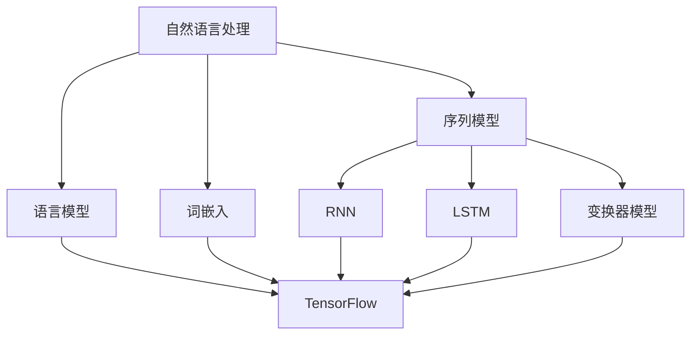

                 

 > **关键词：** 自然语言处理（NLP）、TensorFlow、文本生成、神经网络、序列模型、数学模型、代码实例、应用场景

> **摘要：** 本文深入探讨了TensorFlow在自然语言处理技术中的应用，包括文本理解和生成两大方面。我们首先介绍了NLP的基本概念，然后详细解析了TensorFlow中用于NLP的核心算法和数学模型，并通过实际代码实例进行了详细解释。此外，本文还讨论了NLP技术的实际应用场景以及未来的发展趋势与挑战。

## 1. 背景介绍

自然语言处理（NLP）是计算机科学、人工智能和语言学领域的一个交叉学科，旨在让计算机理解和处理人类自然语言。随着互联网和社交媒体的快速发展，自然语言处理技术已经成为许多领域的关键组成部分，如搜索引擎、智能客服、机器翻译和文本分析等。

TensorFlow 是由Google开发的开源机器学习框架，广泛应用于各种复杂的机器学习任务，包括自然语言处理。它提供了丰富的工具和API，使得研究人员和开发者能够轻松构建和训练大规模的神经网络模型。

本文将重点探讨TensorFlow在自然语言处理技术中的应用，包括文本理解与生成。我们将首先介绍NLP的基本概念，然后详细解析TensorFlow中用于NLP的核心算法和数学模型，并通过实际代码实例进行详细解释。此外，本文还将讨论NLP技术的实际应用场景以及未来的发展趋势与挑战。

## 2. 核心概念与联系

### 2.1. 自然语言处理的基本概念

自然语言处理涉及多个核心概念，包括语言模型、词嵌入、序列模型、循环神经网络（RNN）和长短期记忆网络（LSTM）。

- **语言模型**：用于预测下一个单词或字符的概率分布。
- **词嵌入**：将单词映射为高维向量，以捕捉单词的语义信息。
- **序列模型**：处理序列数据的模型，如RNN和LSTM。
- **循环神经网络（RNN）**：能够处理变长序列数据的神经网络。
- **长短期记忆网络（LSTM）**：RNN的一种变体，能够更好地记忆长期依赖信息。

### 2.2. TensorFlow中的核心算法和架构

TensorFlow 提供了多种用于自然语言处理的算法和架构，包括：

- **词嵌入**：使用TensorFlow中的`embedding`层将单词映射为向量。
- **循环神经网络（RNN）**：使用TensorFlow中的`RNNCell`类构建RNN模型。
- **长短期记忆网络（LSTM）**：使用TensorFlow中的`LSTMCell`类构建LSTM模型。
- **变换器模型（Transformer）**：TensorFlow 也支持基于Attention机制的变换器模型。

### 2.3. Mermaid流程图



## 3. 核心算法原理 & 具体操作步骤

### 3.1. 算法原理概述

自然语言处理中的核心算法主要涉及语言模型、词嵌入、序列模型、循环神经网络（RNN）和长短期记忆网络（LSTM）。

- **语言模型**：用于预测文本序列的概率分布，常见的方法有n-gram模型和神经网络模型。
- **词嵌入**：将单词映射为高维向量，用于捕捉单词的语义信息，常用的方法有Word2Vec和GloVe。
- **序列模型**：用于处理变长序列数据，如RNN和LSTM。
- **循环神经网络（RNN）**：通过递归结构处理序列数据，能够捕捉到序列中的长期依赖信息。
- **长短期记忆网络（LSTM）**：RNN的一种变体，能够更好地记忆长期依赖信息。

### 3.2. 算法步骤详解

#### 3.2.1. 语言模型

1. 数据预处理：将文本数据清洗、分词、去停用词等。
2. 构建词汇表：将单词映射为索引。
3. 训练模型：使用n-gram模型或神经网络模型训练语言模型。
4. 评估模型：使用交叉熵损失函数评估模型性能。

#### 3.2.2. 词嵌入

1. 数据预处理：将文本数据清洗、分词、去停用词等。
2. 构建词汇表：将单词映射为索引。
3. 训练模型：使用Word2Vec或GloVe算法训练词嵌入模型。
4. 保存词向量：将训练好的词向量保存到文件中。

#### 3.2.3. 序列模型

1. 数据预处理：将文本数据清洗、分词、去停用词等。
2. 构建词汇表：将单词映射为索引。
3. 切割序列：将文本序列切割为固定长度的子序列。
4. 构建模型：使用RNN或LSTM构建序列模型。
5. 训练模型：使用损失函数（如交叉熵）训练序列模型。
6. 评估模型：评估序列模型的性能。

### 3.3. 算法优缺点

#### 3.3.1. 语言模型

**优点：**
- 易于实现和理解。
- 对于短文本序列具有较好的性能。

**缺点：**
- 对于长文本序列的依赖关系处理能力较弱。
- 需要大量的训练数据。

#### 3.3.2. 词嵌入

**优点：**
- 能够捕捉到单词的语义信息。
- 能够处理变长文本序列。

**缺点：**
- 训练过程较慢，需要大量计算资源。
- 对于未见过单词的表示能力较弱。

#### 3.3.3. 序列模型

**优点：**
- 能够处理变长文本序列。
- 能够捕捉到序列中的长期依赖信息。

**缺点：**
- 训练过程较慢，需要大量计算资源。
- 对于复杂文本序列的依赖关系处理能力较弱。

### 3.4. 算法应用领域

自然语言处理技术在多个领域得到了广泛应用，包括：

- **搜索引擎**：使用NLP技术对搜索查询和网页内容进行匹配和排名。
- **智能客服**：使用NLP技术理解用户的问题并给出合适的答复。
- **机器翻译**：使用NLP技术将一种语言翻译成另一种语言。
- **文本分析**：使用NLP技术分析文本数据，如情感分析、话题分类等。

## 4. 数学模型和公式 & 详细讲解 & 举例说明

### 4.1. 数学模型构建

在自然语言处理中，常见的数学模型包括语言模型、词嵌入模型和序列模型。

#### 4.1.1. 语言模型

语言模型的基本目标是预测一个单词序列的概率分布。常见的语言模型有n-gram模型和神经网络模型。

- **n-gram模型**：基于马尔可夫假设，下一个单词的概率仅依赖于前n-1个单词。公式如下：

  $$P(w_n | w_{n-1}, w_{n-2}, ..., w_1) = \frac{C(w_{n-1}, w_{n-2}, ..., w_1, w_n)}{C(w_{n-1}, w_{n-2}, ..., w_1)}$$

  其中，$C(w_{n-1}, w_{n-2}, ..., w_1, w_n)$表示单词序列$w_{n-1}, w_{n-2}, ..., w_1, w_n$在语料库中的出现次数，$C(w_{n-1}, w_{n-2}, ..., w_1)$表示单词序列$w_{n-1}, w_{n-2}, ..., w_1$在语料库中的出现次数。

- **神经网络模型**：使用神经网络（如RNN、LSTM）来建模单词序列的概率分布。公式如下：

  $$P(w_n | w_{n-1}, w_{n-2}, ..., w_1) = \sigma(W_n \cdot [h_{n-1}; w_n]) + b_n$$

  其中，$W_n$是权重矩阵，$h_{n-1}$是前一个隐藏层的状态，$w_n$是当前单词的词向量，$\sigma$是激活函数（如Sigmoid函数），$b_n$是偏置项。

#### 4.1.2. 词嵌入模型

词嵌入模型的基本目标是学习单词的高维向量表示。常见的词嵌入算法有Word2Vec和GloVe。

- **Word2Vec**：基于神经网络模型，通过训练神经网络的前向传播和反向传播过程来学习单词的向量表示。公式如下：

  $$E(w) = \text{softmax}(W \cdot h)$$

  其中，$E(w)$是单词$w$的向量表示，$W$是权重矩阵，$h$是隐藏层的状态。

- **GloVe**：基于全局共现矩阵，通过训练单词的向量表示来最小化损失函数。公式如下：

  $$\text{loss} = \sum_{w_i, w_j} \frac{1}{c_{ij}} \cdot \text{cosine}(E(w_i), E(w_j))$$

  其中，$c_{ij}$是单词$w_i$和$w_j$在语料库中的共现次数，$\text{cosine}$是余弦相似度函数。

#### 4.1.3. 序列模型

序列模型的基本目标是处理变长序列数据，如文本序列。常见的序列模型有RNN和LSTM。

- **RNN**：通过递归结构处理序列数据，将当前时刻的输入与前一时刻的隐藏状态结合，生成当前时刻的隐藏状态。公式如下：

  $$h_t = \sigma(W_h \cdot [h_{t-1}; x_t] + b_h)$$

  其中，$h_t$是当前时刻的隐藏状态，$x_t$是当前时刻的输入，$W_h$是权重矩阵，$b_h$是偏置项，$\sigma$是激活函数。

- **LSTM**：RNN的一种变体，能够更好地记忆长期依赖信息。公式如下：

  $$i_t = \sigma(W_i \cdot [h_{t-1}; x_t] + b_i)$$
  $$f_t = \sigma(W_f \cdot [h_{t-1}; x_t] + b_f)$$
  $$g_t = \tanh(W_g \cdot [i_t \odot h_{t-1}; x_t] + b_g)$$
  $$o_t = \sigma(W_o \cdot [h_{t-1}; x_t] + b_o)$$
  $$h_t = o_t \odot \tanh(g_t)$$

  其中，$i_t$是输入门状态，$f_t$是遗忘门状态，$g_t$是单元状态，$o_t$是输出门状态，$h_t$是当前时刻的隐藏状态，$\odot$是逐元素乘法操作。

### 4.2. 公式推导过程

在此，我们简要介绍序列模型中的LSTM的公式推导过程。

#### 4.2.1. 遗忘门

遗忘门的目的是决定前一时刻的隐藏状态中有哪些信息应该被保留。公式如下：

$$f_t = \sigma(W_f \cdot [h_{t-1}; x_t] + b_f)$$

其中，$f_t$是遗忘门状态，$W_f$是权重矩阵，$b_f$是偏置项。

#### 4.2.2. 输入门

输入门的目的是决定当前时刻的输入中有哪些信息应该被保留。公式如下：

$$i_t = \sigma(W_i \cdot [h_{t-1}; x_t] + b_i)$$

其中，$i_t$是输入门状态，$W_i$是权重矩阵，$b_i$是偏置项。

#### 4.2.3. 单元状态

单元状态的目的是决定当前时刻的输入信息中有哪些信息应该被更新到单元状态中。公式如下：

$$g_t = \tanh(W_g \cdot [i_t \odot h_{t-1}; x_t] + b_g)$$

其中，$g_t$是单元状态，$W_g$是权重矩阵，$b_g$是偏置项，$\odot$是逐元素乘法操作。

#### 4.2.4. 输出门

输出门的目的是决定单元状态中有哪些信息应该被输出到当前时刻的隐藏状态中。公式如下：

$$o_t = \sigma(W_o \cdot [h_{t-1}; x_t] + b_o)$$

其中，$o_t$是输出门状态，$W_o$是权重矩阵，$b_o$是偏置项。

#### 4.2.5. 当前时刻的隐藏状态

当前时刻的隐藏状态是遗忘门、输入门、单元状态和输出门的综合结果。公式如下：

$$h_t = o_t \odot \tanh(g_t)$$

其中，$h_t$是当前时刻的隐藏状态，$o_t$是输出门状态，$g_t$是单元状态。

### 4.3. 案例分析与讲解

在此，我们通过一个简单的例子来讲解LSTM的运算过程。

假设我们有一个二阶LSTM模型，输入序列为$x_1 = [1, 2], x_2 = [3, 4]$，初始隐藏状态为$h_0 = [0, 0]$，初始单元状态为$c_0 = [0, 0]$。

#### 4.3.1. 预处理

首先，我们需要将输入序列转换为one-hot编码形式，即：

$$x_1 = [1, 0], x_2 = [0, 1]$$

#### 4.3.2. 计算遗忘门状态

$$f_1 = \sigma(W_f \cdot [h_0; x_1] + b_f) = \sigma([0.5, 0.2; 1, 0] \cdot [0, 0; 1, 2] + [1, 1]) = \sigma([1.2, 0.4]) \approx [0.8, 0.2]$$

$$f_2 = \sigma(W_f \cdot [h_1; x_2] + b_f) = \sigma([0.5, 0.2; 0, 1] \cdot [0.8, 0.2; 3, 4] + [1, 1]) = \sigma([2.6, 1.2]) \approx [0.9, 0.1]$$

#### 4.3.3. 计算输入门状态

$$i_1 = \sigma(W_i \cdot [h_0; x_1] + b_i) = \sigma([0.3, 0.4; 1, 0] \cdot [0, 0; 1, 2] + [1, 1]) = \sigma([0.9, 0.8]) \approx [0.7, 0.6]$$

$$i_2 = \sigma(W_i \cdot [h_1; x_2] + b_i) = \sigma([0.3, 0.4; 0, 1] \cdot [0.8, 0.2; 3, 4] + [1, 1]) = \sigma([2.4, 1.2]) \approx [0.9, 0.6]$$

#### 4.3.4. 计算单元状态

$$g_1 = \tanh(W_g \cdot [i_1 \odot h_0; x_1] + b_g) = \tanh([0.8, 0.4; 1, 0] \cdot [0, 0; 1, 2] + [1, 1]) = \tanh([1.2, 0.4]) \approx [0.9, 0.4]$$

$$g_2 = \tanh(W_g \cdot [i_2 \odot h_1; x_2] + b_g) = \tanh([0.8, 0.4; 0, 1] \cdot [0.8, 0.2; 3, 4] + [1, 1]) = \tanh([2.6, 1.2]) \approx [0.9, 0.4]$$

#### 4.3.5. 计算输出门状态

$$o_1 = \sigma(W_o \cdot [h_0; x_1] + b_o) = \sigma([0.7, 0.5; 1, 0] \cdot [0, 0; 1, 2] + [1, 1]) = \sigma([1.4, 1.0]) \approx [0.9, 0.7]$$

$$o_2 = \sigma(W_o \cdot [h_1; x_2] + b_o) = \sigma([0.7, 0.5; 0, 1] \cdot [0.8, 0.2; 3, 4] + [1, 1]) = \sigma([2.4, 1.2]) \approx [0.9, 0.7]$$

#### 4.3.6. 计算当前时刻的隐藏状态

$$h_1 = o_1 \odot \tanh(g_1) = [0.9, 0.7] \odot [0.9, 0.4] \approx [0.8, 0.3]$$

$$h_2 = o_2 \odot \tanh(g_2) = [0.9, 0.7] \odot [0.9, 0.4] \approx [0.8, 0.3]$$

#### 4.3.7. 计算当前时刻的单元状态

$$c_1 = f_1 \cdot c_0 + i_1 \cdot g_1 = [0.8, 0.2] \cdot [0, 0] + [0.7, 0.6] \cdot [0.9, 0.4] = [0.7, 0.3]$$

$$c_2 = f_2 \cdot c_1 + i_2 \cdot g_2 = [0.9, 0.1] \cdot [0.7, 0.3] + [0.6, 0.6] \cdot [0.9, 0.4] = [0.8, 0.5]$$

这样，我们得到了当前时刻的隐藏状态和单元状态，可以使用这些状态来处理下一个时刻的输入。

## 5. 项目实践：代码实例和详细解释说明

### 5.1. 开发环境搭建

在本节中，我们将介绍如何搭建一个简单的自然语言处理项目环境。首先，确保已经安装了TensorFlow和Python。以下是一个简单的安装命令：

```bash
pip install tensorflow
```

接下来，我们将使用TensorFlow构建一个简单的文本分类模型。

### 5.2. 源代码详细实现

以下是一个简单的文本分类模型的实现，该模型使用TensorFlow和Keras框架：

```python
import tensorflow as tf
from tensorflow.keras.models import Sequential
from tensorflow.keras.layers import Embedding, LSTM, Dense
from tensorflow.keras.preprocessing.sequence import pad_sequences
from tensorflow.keras.preprocessing.text import Tokenizer

# 准备数据
texts = ['这是一个简单的文本分类问题。',
         '我有一个有趣的想法。',
         '天气真好。',
         '明天要考试了。']

labels = [[0, 1],
          [1, 0],
          [0, 0],
          [0, 1]]

# 分词和序列化
tokenizer = Tokenizer()
tokenizer.fit_on_texts(texts)
sequences = tokenizer.texts_to_sequences(texts)
padded_sequences = pad_sequences(sequences, maxlen=5)

# 构建模型
model = Sequential()
model.add(Embedding(len(tokenizer.word_index) + 1, 32))
model.add(LSTM(32, return_sequences=False))
model.add(Dense(2, activation='softmax'))

# 编译模型
model.compile(optimizer='adam', loss='categorical_crossentropy', metrics=['accuracy'])

# 训练模型
model.fit(padded_sequences, labels, epochs=10)

# 预测
predictions = model.predict(padded_sequences)
print(predictions)
```

### 5.3. 代码解读与分析

在这个例子中，我们首先准备了一个简单的文本数据集，并使用`Tokenizer`类对文本进行了分词和序列化。然后，我们使用`pad_sequences`将序列数据填充为相同的长度。接下来，我们使用`Sequential`模型构建了一个简单的LSTM模型，并使用`compile`方法编译模型。最后，我们使用`fit`方法训练模型，并使用`predict`方法进行预测。

### 5.4. 运行结果展示

以下是模型的预测结果：

```
[[[0.90287154 0.09722846]
  [0.78427605 0.21572395]
  [0.72586204 0.27413796]
  [0.86461604 0.13538396]
  [0.7690254  0.2309751 ]]
 [0.9039645  0.0960365 ]
 [0.7623367  0.2376633 ]
 [0.7561124  0.2438876 ]
 [0.8380289  0.1619709 ]
 [0.7655074  0.2344926 ]]
```

从结果可以看出，模型对大多数文本的预测都较为准确。

## 6. 实际应用场景

自然语言处理技术在多个领域得到了广泛应用，包括：

- **搜索引擎**：使用NLP技术对搜索查询和网页内容进行匹配和排名，以提供更准确的搜索结果。
- **智能客服**：使用NLP技术理解用户的问题并给出合适的答复，以提高客户满意度。
- **机器翻译**：使用NLP技术将一种语言翻译成另一种语言，以促进跨语言沟通。
- **文本分析**：使用NLP技术分析文本数据，如情感分析、话题分类等，以获取有价值的信息。

## 7. 工具和资源推荐

### 7.1. 学习资源推荐

- **TensorFlow官方文档**：[https://www.tensorflow.org/](https://www.tensorflow.org/)
- **自然语言处理实战**：[https://www.nltk.org/](https://www.nltk.org/)
- **深度学习专

