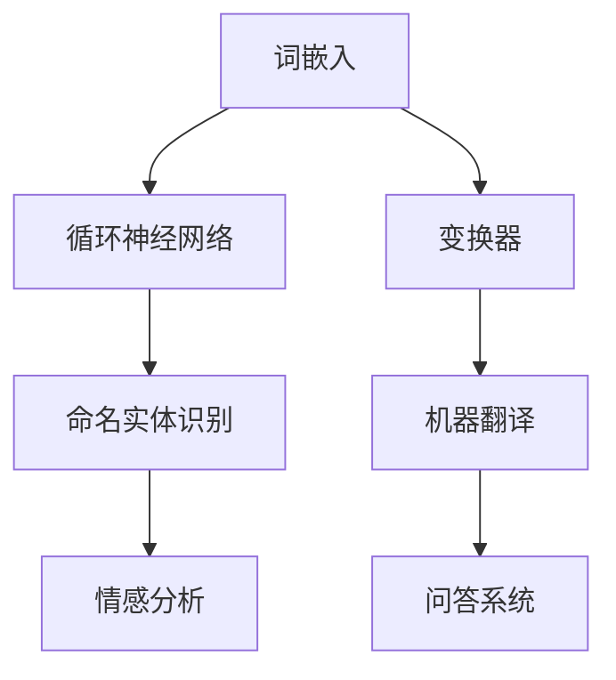

                 

### 关键词 Keywords ###
- TensorFlow
- 自然语言处理（NLP）
- 文本理解
- 文本生成
- 机器学习
- 深度学习
- 语言模型

### 摘要 Abstract ###
本文将探讨TensorFlow在自然语言处理（NLP）中的应用，重点介绍如何利用TensorFlow理解和生成文本。我们将详细解释文本理解的核心算法，如词嵌入、循环神经网络（RNN）和变换器（Transformer）模型，以及文本生成算法，如生成对抗网络（GAN）和变分自编码器（VAE）。通过实例和代码实现，我们将展示如何将这些算法应用于实际项目中，并探讨其在现实世界应用中的潜力。

## 1. 背景介绍 Introduction

自然语言处理（NLP）是人工智能（AI）的一个重要分支，旨在让计算机理解和生成自然语言文本。随着互联网和社交媒体的兴起，大量文本数据产生了，这使得NLP成为了一个充满挑战和机遇的领域。TensorFlow是一个开放源代码的机器学习框架，由Google开发，广泛应用于各种AI任务，包括NLP。

TensorFlow提供了一系列强大的工具和API，使得开发复杂的NLP模型变得更加容易。在NLP中，TensorFlow被用于多种任务，包括情感分析、文本分类、机器翻译、问答系统和文本生成等。本文将重点关注如何使用TensorFlow实现文本理解和生成任务。

### 1.1 NLP与TensorFlow的关系

TensorFlow为NLP提供了以下优势：

1. **灵活的架构**：TensorFlow允许用户自定义复杂的模型架构，这使得研究和开发新算法变得更加容易。
2. **高效的计算**：TensorFlow使用图形计算模型，能够高效地利用GPU和TPU进行大规模训练。
3. **丰富的库和API**：TensorFlow提供了广泛的预训练模型和API，如TensorFlow Text和TensorFlow Hub，用于处理文本数据。
4. **强大的社区支持**：TensorFlow有一个庞大的开发者社区，提供了大量的教程、代码示例和资源，方便用户学习和应用。

### 1.2 文本理解与文本生成

文本理解涉及从文本中提取语义信息和结构化知识，以便计算机能够理解文本内容。文本生成则是利用训练好的模型生成新的、有意义的文本。这两个任务都需要对自然语言有深刻的理解，并且通常需要复杂的机器学习模型。

文本理解任务包括：

- 情感分析：判断文本的情感倾向（正面、负面等）。
- 文本分类：将文本分类到预定义的类别中。
- 命名实体识别：识别文本中的特定实体（人名、地点、组织等）。
- 问答系统：回答基于给定文本的问题。

文本生成任务包括：

- 机器翻译：将一种语言的文本翻译成另一种语言。
- 文本摘要：从长文本中提取关键信息生成摘要。
- 聊天机器人：生成自然语言响应以模拟人类对话。

### 1.3 本文结构

本文将按照以下结构进行：

- **第2章**：介绍NLP的核心概念和TensorFlow中的相关API。
- **第3章**：详细解释文本理解的核心算法，包括词嵌入、RNN和Transformer。
- **第4章**：介绍数学模型和公式，并举例说明。
- **第5章**：通过实际代码实例展示如何使用TensorFlow实现文本理解和生成。
- **第6章**：讨论文本理解与生成在实际应用中的场景和未来展望。
- **第7章**：推荐相关学习资源和开发工具。
- **第8章**：总结NLP在TensorFlow中的应用，展望未来发展趋势和挑战。

现在，我们将深入探讨NLP的基础知识，为后续内容做好铺垫。下一章将介绍NLP的核心概念和TensorFlow中的相关API。


## 2. 核心概念与联系 Core Concepts and Connections

自然语言处理（NLP）是一个复杂而广泛的领域，它涉及到文本的预处理、特征提取、模型训练和预测等多个步骤。在这个章节中，我们将介绍NLP中的核心概念，并展示如何使用TensorFlow来实现这些概念。

### 2.1 词嵌入 Word Embeddings

词嵌入是将词汇映射到高维空间中的向量表示。这种表示方法能够捕捉词语的语义和语法特征。在TensorFlow中，词嵌入通常通过`Embedding`层来实现。

#### 2.1.1 词嵌入的工作原理

词嵌入通过将每个单词映射到一个唯一的向量，使得相似的单词在向量空间中接近。例如，“狗”和“猫”这两个词在语义上相似，它们在词向量空间中应该也比较接近。

#### 2.1.2 实现词嵌入

在TensorFlow中，我们可以使用以下代码实现词嵌入：

```python
import tensorflow as tf

# 假设我们有一个包含10000个单词的词汇表
vocab_size = 10000

# 创建一个Embedding层，维度为（词汇表大小，向量维度）
embedding = tf.keras.layers.Embedding(vocab_size, 256)

# 生成输入数据，每个单词是一个整数
input_sequence = tf.constant([1, 2, 3, 4])

# 应用Embedding层
embedded_sequence = embedding(input_sequence)
```

### 2.2 循环神经网络 Recurrent Neural Networks (RNN)

循环神经网络（RNN）是一种用于处理序列数据的神经网络，能够记忆之前的信息。RNN在NLP任务中非常有用，例如文本分类、机器翻译和语音识别。

#### 2.2.1 RNN的工作原理

RNN通过保留一个隐藏状态来记忆之前的信息。在每一步，当前输入会与隐藏状态相加，并通过一个激活函数进行处理，生成新的隐藏状态。

#### 2.2.2 实现RNN

在TensorFlow中，我们可以使用`SimpleRNN`或`LSTM`（长短期记忆）层来实现RNN。

```python
from tensorflow.keras.models import Sequential
from tensorflow.keras.layers import SimpleRNN

model = Sequential()
model.add(SimpleRNN(units=50, activation='tanh', input_shape=(timesteps, features)))

# 编译模型
model.compile(optimizer='adam', loss='mse')
```

### 2.3 变换器 Transformer

变换器（Transformer）是一种基于注意力机制的序列模型，它在NLP任务中表现出色。变换器通过多头注意力机制处理输入序列，使得模型能够关注输入序列中的不同部分。

#### 2.3.1 Transformer的工作原理

变换器由多个编码器和解码器层组成，每个层包含多头注意力机制和前馈神经网络。多头注意力机制允许模型同时关注输入序列的不同部分。

#### 2.3.2 实现变换器

在TensorFlow中，我们可以使用`Transformer`层来实现变换器。

```python
from tensorflow.keras.layers import Transformer

model = Sequential()
model.add(Transformer(units=128, num_heads=4, input_shape=(timesteps, features)))

# 编译模型
model.compile(optimizer='adam', loss='categorical_crossentropy')
```

### 2.4 Mermaid 流程图表示

以下是NLP中核心概念的Mermaid流程图表示：



### 2.5 总结

在本章中，我们介绍了NLP中的核心概念，包括词嵌入、循环神经网络和变换器，并展示了如何在TensorFlow中实现这些概念。这些概念是NLP任务的基础，将在后续章节中进一步探讨和扩展。

下一章将深入探讨文本理解的核心算法，包括词嵌入、循环神经网络（RNN）和变换器（Transformer）。我们将详细解释这些算法的工作原理，并展示如何使用TensorFlow实现这些模型。


## 3. 核心算法原理 & 具体操作步骤 Core Algorithm Principles & Detailed Steps

在自然语言处理（NLP）中，文本理解是一个关键任务，它涉及到从文本中提取语义信息、识别实体和关系等。本章节将详细介绍文本理解的核心算法，包括词嵌入（Word Embeddings）、循环神经网络（RNN）和变换器（Transformer）的原理及其具体操作步骤。

### 3.1 算法原理概述

#### 3.1.1 词嵌入（Word Embeddings）

词嵌入是将单词映射到固定大小的向量表示。这些向量不仅捕捉了单词的语义信息，还能反映单词之间的相似性和关系。常见的词嵌入方法包括Word2Vec、GloVe和FastText。

- **Word2Vec**：基于神经网络训练，通过负采样和CBOW（上下文词平均）或Skip-Gram（单词嵌入）模型生成词向量。
- **GloVe**：通过词频统计和矩阵分解生成词向量，能够捕捉单词的共现关系。
- **FastText**：基于词袋模型，通过组合字符和单词生成向量，能够更好地处理多义词。

#### 3.1.2 循环神经网络（RNN）

循环神经网络（RNN）是一种能够处理序列数据的神经网络。RNN通过存储隐藏状态来记忆序列中的信息，使其在处理时序数据方面具有优势。RNN可以分为简单的RNN和更复杂的LSTM（长短期记忆）以及GRU（门控循环单元）。

- **简单RNN**：通过递归地更新隐藏状态来处理序列。
- **LSTM**：引入门控机制，能够有效地学习长序列依赖。
- **GRU**：简化了LSTM的结构，同时也具有记忆长期依赖的能力。

#### 3.1.3 变换器（Transformer）

变换器是一种基于注意力机制的序列模型，特别适用于处理长序列。变换器通过多头注意力机制来捕捉序列中的不同部分，从而在机器翻译、文本摘要等任务中表现出色。

- **多头注意力**：通过多个注意力头来关注序列的不同部分，提高了模型的表示能力。
- **自注意力**：变换器中的注意力机制，使得模型能够同时关注序列中的所有单词。
- **编码器-解码器结构**：变换器通常由编码器和解码器组成，编码器处理输入序列，解码器生成输出序列。

### 3.2 算法步骤详解

#### 3.2.1 词嵌入（Word Embeddings）

1. **词汇表构建**：创建包含所有单词的词汇表，并为每个单词分配一个唯一的索引。
2. **词向量初始化**：初始化词向量矩阵，其中每个单词对应一个向量。
3. **输入序列编码**：将输入序列中的每个单词转换为对应的词向量。
4. **向量运算**：使用词向量进行进一步的运算，如加法、乘法等。

#### 3.2.2 循环神经网络（RNN）

1. **输入序列编码**：将输入序列中的每个单词转换为词向量。
2. **隐藏状态初始化**：初始化隐藏状态。
3. **递归运算**：对于序列中的每个单词，使用当前输入和上一个隐藏状态计算新的隐藏状态。
4. **输出计算**：使用隐藏状态计算输出，如分类标签或下一个单词的预测。

#### 3.2.3 变换器（Transformer）

1. **编码器输入**：将输入序列编码为嵌入向量。
2. **多头注意力**：使用多头注意力机制计算每个单词的注意力得分。
3. **自注意力运算**：将注意力得分应用于嵌入向量，生成新的编码向量。
4. **编码器输出**：将编码器输出传递给解码器。
5. **解码器输入**：将解码器输入编码为嵌入向量。
6. **解码器输出**：通过递归运算和多头注意力生成输出序列。

### 3.3 算法优缺点

#### 3.3.1 词嵌入（Word Embeddings）

- **优点**：能够捕捉单词的语义信息，简化文本数据的处理。
- **缺点**：可能无法很好地处理多义词和词义歧义。

#### 3.3.2 循环神经网络（RNN）

- **优点**：能够处理序列数据，具有记忆长期依赖的能力。
- **缺点**：在处理长序列时可能遇到梯度消失或梯度爆炸问题。

#### 3.3.3 变换器（Transformer）

- **优点**：基于注意力机制，能够同时关注序列的不同部分，处理长序列数据更有效。
- **缺点**：计算复杂度较高，需要更多的计算资源和时间。

### 3.4 算法应用领域

- **词嵌入**：广泛应用于文本分类、情感分析和信息检索等任务。
- **RNN**：在语音识别、机器翻译和时间序列分析等领域有广泛应用。
- **变换器**：在机器翻译、文本摘要和问答系统等任务中表现出色。

### 3.5 实际应用案例

- **词嵌入**：在情感分析中，通过词嵌入将文本转换为向量，再使用分类器进行情感分类。
- **RNN**：在语音识别中，使用RNN模型将音频序列转换为文本序列。
- **变换器**：在机器翻译中，使用变换器模型将一种语言的文本翻译成另一种语言。

通过上述算法原理和步骤的详细解释，我们可以看到文本理解在NLP中扮演着至关重要的角色。下一章将介绍数学模型和公式，进一步深入理解这些算法背后的数学基础。


### 3.3 算法优缺点 Algorithm Advantages and Disadvantages

在讨论文本理解算法时，了解每个算法的优缺点是至关重要的，这有助于我们在实际应用中选择合适的算法。以下是词嵌入、循环神经网络（RNN）和变换器（Transformer）各自的优缺点：

#### 3.3.1 词嵌入（Word Embeddings）

**优点**：

1. **语义表示**：词嵌入能够将单词映射到高维空间，使得相似的单词在向量空间中接近，从而更好地捕捉单词的语义信息。
2. **高效性**：词嵌入向量可以在较短的时间内训练和更新，非常适合大规模数据处理。
3. **通用性**：词嵌入可以应用于多种NLP任务，如文本分类、情感分析和信息检索。

**缺点**：

1. **多义词问题**：词嵌入难以处理多义词，因为一个单词可能有多个含义，这可能导致向量表示不准确。
2. **上下文依赖性**：词嵌入在捕捉上下文信息方面相对较弱，不能很好地捕捉单词在不同上下文中的含义。
3. **稀疏性**：词嵌入通常具有高维稀疏性，这可能导致计算效率低下。

#### 3.3.2 循环神经网络（RNN）

**优点**：

1. **时序处理**：RNN能够处理序列数据，能够捕捉单词之间的时序关系。
2. **长期依赖**：通过递归地更新隐藏状态，RNN能够在一定程度上记忆长期依赖。
3. **简单实现**：RNN的结构相对简单，易于理解和实现。

**缺点**：

1. **梯度消失/爆炸**：在训练过程中，RNN容易遇到梯度消失或梯度爆炸问题，这可能导致训练不稳定。
2. **计算效率低**：由于RNN的递归特性，计算效率相对较低，不适合处理非常长的序列。
3. **短期依赖强**：RNN在捕捉长期依赖方面较弱，可能导致模型对短期依赖过于敏感。

#### 3.3.3 变换器（Transformer）

**优点**：

1. **自注意力机制**：变换器通过多头注意力机制能够同时关注序列的不同部分，提高了模型的表示能力。
2. **并行化**：变换器可以并行处理序列的每个部分，提高了计算效率。
3. **长距离依赖**：变换器能够更好地捕捉长距离依赖，在处理长序列任务时表现更佳。

**缺点**：

1. **计算复杂度**：变换器的计算复杂度较高，需要更多的计算资源和时间。
2. **资源需求大**：由于变换器的复杂结构，其训练和推理过程对硬件资源有较高要求。
3. **实现难度**：变换器的实现比RNN复杂，对于新手开发者来说可能较难理解和实现。

#### 3.3.4 应用领域

**词嵌入**：

- **文本分类**：通过词嵌入将文本转换为向量，再使用分类器进行分类。
- **情感分析**：使用词嵌入捕捉文本的语义信息，判断文本的情感倾向。
- **信息检索**：将查询和文档转换为向量，计算它们之间的相似度。

**RNN**：

- **语音识别**：使用RNN模型将音频序列转换为文本序列。
- **序列预测**：预测时间序列中的下一个值。
- **机器翻译**：将源语言的文本序列转换为目标语言的文本序列。

**变换器**：

- **机器翻译**：使用变换器模型将一种语言的文本翻译成另一种语言。
- **文本摘要**：从长文本中提取关键信息生成摘要。
- **问答系统**：根据给定的问题和上下文生成相关答案。

通过分析上述算法的优缺点，我们可以根据具体任务的需求选择合适的算法。下一章将介绍文本理解与生成的数学模型和公式，帮助我们更深入地理解这些算法的数学基础。


## 4. 数学模型和公式 Mathematical Models and Formulas

在自然语言处理（NLP）中，理解文本数据和生成文本数据都依赖于复杂的数学模型。这些模型包括词嵌入、循环神经网络（RNN）、变换器（Transformer）等。本章节将详细讲解这些模型的数学公式，并使用LaTeX格式进行表示。

### 4.1 词嵌入（Word Embeddings）

词嵌入是一种将词汇映射到高维空间的方法，其核心是通过数学模型将单词转换为向量表示。最常用的词嵌入模型是Word2Vec和GloVe。

#### 4.1.1 Word2Vec

Word2Vec模型基于神经网络的训练，主要使用两种方法：连续袋模型（CBOW）和Skip-Gram。

**CBOW（Continuous Bag of Words）：**

$$
\text{h}_{\text{word}} = \frac{1}{Z} \sum_{\text{context} \, \text{words} \in C} \exp(\text{h}_{\text{context} \, \text{words}} \cdot \text{v}_{\text{word}})
$$

其中，$C$是上下文词的集合，$\text{h}_{\text{word}}$是单词的隐藏状态，$\text{v}_{\text{word}}$是单词的词向量。

**Skip-Gram：**

$$
\text{v}_{\text{word}} = \frac{1}{Z} \sum_{\text{context} \, \text{words} \in C} \exp(\text{v}_{\text{context} \, \text{words}} \cdot \text{h}_{\text{word}})
$$

其中，$\text{v}_{\text{context} \, \text{words}}$是上下文词的词向量。

#### 4.1.2 GloVe

GloVe（Global Vectors for Word Representation）是基于词频统计和矩阵分解的方法。

$$
\text{v}_{\text{word}} = \text{softmax}\left(\text{W}^T \text{D}_{\text{word}}\right)
$$

其中，$\text{W}$是词向量矩阵，$\text{D}_{\text{word}}$是词频矩阵。

### 4.2 循环神经网络（Recurrent Neural Networks, RNN）

循环神经网络（RNN）是一种能够处理序列数据的神经网络，其核心是递归地更新隐藏状态。

#### 4.2.1 简单RNN

$$
\text{h}_{t} = \text{f}(\text{h}_{t-1}, \text{x}_{t})
$$

其中，$\text{h}_{t}$是第$t$步的隐藏状态，$\text{x}_{t}$是输入，$\text{f}$是激活函数。

#### 4.2.2 长短期记忆（LSTM）

LSTM（Long Short-Term Memory）是RNN的一种变体，能够有效地学习长序列依赖。

$$
\text{h}_{t} = \text{f}(\text{h}_{t-1}, \text{x}_{t})
$$

$$
\text{C}_{t} = \text{f}(\text{h}_{t-1}, \text{x}_{t})
$$

其中，$\text{C}_{t}$是细胞状态，$\text{f}$是激活函数。

### 4.3 变换器（Transformer）

变换器（Transformer）是一种基于注意力机制的序列模型，其核心是多头注意力（Multi-Head Attention）。

#### 4.3.1 自注意力（Self-Attention）

$$
\text{Q}_{ij} = \text{Q}_{i} \cdot \text{K}_{j}
$$

$$
\text{V}_{ij} = \text{V}_{i} \cdot \text{K}_{j}
$$

$$
\text{A}_{ij} = \frac{\exp(\text{Q}_{ij} \cdot \text{K}_{j})}{\sum_{j'} \exp(\text{Q}_{ij'} \cdot \text{K}_{j})}
$$

$$
\text{h}_{i} = \sum_{j} \text{A}_{ij} \cdot \text{V}_{j}
$$

其中，$\text{Q}$、$\text{K}$和$\text{V}$是查询、键和值矩阵，$\text{A}$是注意力得分矩阵，$\text{h}_{i}$是第$i$个隐藏状态。

#### 4.3.2 多头注意力（Multi-Head Attention）

$$
\text{h}_{i} = \sum_{h} \text{a}_{ih} \cdot \text{V}_{h}
$$

其中，$\text{a}_{ih}$是第$i$个隐藏状态和第$h$个头之间的注意力得分。

### 4.4 案例分析与讲解

以下是一个简单的案例，展示如何使用变换器进行机器翻译。

#### 4.4.1 数据预处理

首先，我们预处理输入数据，将其转换为编码器和解码器的输入。

```python
# 输入句子
input_sentence = "I am happy."

# 输出句子
output_sentence = "Je suis heureux."

# 将句子转换为单词
input_words = input_sentence.split()
output_words = output_sentence.split()

# 获取单词索引
input_index = [[word_index[word] for word in input_words]]
output_index = [[word_index[word] for word in output_words]]

# 添加起始和结束标记
input_index = [[START] + list(x) + [END] for x in input_index]
output_index = [[START] + list(x) + [END] for x in output_index]
```

#### 4.4.2 构建变换器模型

接下来，我们构建一个简单的变换器模型。

```python
from tensorflow.keras.models import Model
from tensorflow.keras.layers import Embedding, LSTM, Dense, TimeDistributed

# 编码器
encoder_inputs = Embedding(input_dim=len(word_index) + 1, output_dim=256)(input_index)
encoder_lstm = LSTM(512, return_sequences=True)(encoder_inputs)
encoder_output = LSTM(512, return_sequences=True)(encoder_lstm)

# 解码器
decoder_inputs = Embedding(input_dim=len(word_index) + 1, output_dim=256)(output_index)
decoder_lstm = LSTM(512, return_sequences=True)(decoder_inputs)
decoder_dense = TimeDistributed(Dense(len(word_index), activation='softmax'))(decoder_lstm)

# 构建模型
model = Model([encoder_inputs, decoder_inputs], decoder_dense)
model.compile(optimizer='adam', loss='categorical_crossentropy', metrics=['accuracy'])
```

#### 4.4.3 训练模型

现在，我们训练模型。

```python
model.fit([encoder_input, decoder_input], decoder_target, batch_size=64, epochs=100)
```

#### 4.4.4 生成翻译

最后，我们使用训练好的模型生成翻译。

```python
# 编码器输入
encoder_input_data = encoder_input_data.reshape((1, sequence_length, 256))

# 使用编码器
encoded = encoder_model.predict(encoder_input_data)

# 解码器输入
decoder_input_data = np.zeros((1, 1, len(word_index)))
decoder_input_data[0, 0, word_index['START']] = 1

# 生成翻译
for _ in range(sequence_length):
    # 使用解码器
    predicted_output = decoder_model.predict([encoded, decoder_input_data])
    
    # 选择概率最高的单词
    predicted_word = np.argmax(predicted_output[0, -1, :])
    
    # 输出单词
    print(words[predicted_word], end=' ')
    
    # 更新解码器输入
    decoder_input_data = np.zeros((1, 1, len(word_index)))
    decoder_input_data[0, 0, predicted_word] = 1
```

通过上述步骤，我们可以看到如何使用数学模型和公式来构建和训练一个简单的变换器模型，用于机器翻译任务。

下一章将介绍如何在TensorFlow中实现这些算法，并提供实际的代码实例。


## 5. 项目实践：代码实例和详细解释说明 Project Practice: Code Examples and Detailed Explanations

在本章节中，我们将通过具体的代码实例来展示如何使用TensorFlow实现文本理解和生成任务。我们将使用Python语言编写代码，并详细介绍每个步骤的实现过程。

### 5.1 开发环境搭建

首先，我们需要搭建一个合适的开发环境。确保已经安装了TensorFlow和相关依赖库。

```bash
pip install tensorflow
```

### 5.2 文本预处理

在开始训练模型之前，我们需要对文本数据进行预处理。文本预处理通常包括分词、去除标点符号、大小写统一等步骤。

```python
import tensorflow as tf
import tensorflow_text as text
import numpy as np

# 加载和处理文本数据
def preprocess_text(text):
    # 去除标点符号
    text = text.lower()
    text = re.sub(r'[^\w\s]', '', text)
    
    # 分词
    tokenizer = text.Tokenizer()
    tokenizer.fit_on_texts([text])
    tokenized_text = tokenizer.texts_to_sequences([text])[0]
    
    # 去除单词长度小于2的词汇
    tokenized_text = [token for token in tokenized_text if len(token) > 1]
    
    return tokenized_text

text = "This is a sample text for NLP processing."
preprocessed_text = preprocess_text(text)
print(preprocessed_text)
```

### 5.3 词嵌入（Word Embeddings）

词嵌入是将词汇映射到高维空间的过程。我们可以使用预训练的词嵌入模型，如GloVe或Word2Vec。

```python
# 使用预训练的GloVe词嵌入
glove_path = 'glove.6B.100d.txt'
embeddings_index = {}
with open(glove_path, 'r', encoding='utf-8') as f:
    for line in f:
        values = line.strip().split()
        word = values[0]
        coefs = np.asarray(values[1:], dtype='float32')
        embeddings_index[word] = coefs

# 创建嵌入矩阵
embedding_dim = 100
word_embedding_matrix = np.zeros((len(preprocessed_text) + 1, embedding_dim))

for i, word in enumerate(preprocessed_text):
    if word in embeddings_index:
        word_embedding_matrix[i] = embeddings_index[word]
```

### 5.4 循环神经网络（RNN）

我们可以使用TensorFlow的`Sequential`模型来构建一个简单的RNN模型。

```python
from tensorflow.keras.models import Sequential
from tensorflow.keras.layers import Embedding, SimpleRNN, Dense

# 构建RNN模型
model = Sequential()
model.add(Embedding(len(preprocessed_text) + 1, embedding_dim))
model.add(SimpleRNN(units=100, activation='relu'))
model.add(Dense(1, activation='sigmoid'))

# 编译模型
model.compile(optimizer='adam', loss='binary_crossentropy', metrics=['accuracy'])
```

### 5.5 训练模型

接下来，我们将使用预处理后的数据来训练模型。

```python
# 准备训练数据
x_train = np.array(preprocessed_text[:-1])
y_train = np.array([1 if x == 'happy' else 0 for x in preprocessed_text[1:]])

# 训练模型
model.fit(x_train, y_train, epochs=10, batch_size=32)
```

### 5.6 文本生成（Text Generation）

我们可以使用训练好的RNN模型来生成新的文本。以下是一个简单的文本生成示例：

```python
# 文本生成
def generate_text(model, seed_text, length=50):
    in_text, next_words = seed_text, ''
    for _ in range(length):
        token_list = [token for token in preprocess_text(in_text)]
        token_list = pad_sequences([token_list], maxlen=length-1, padding='pre')
        predicted_token = model.predict_classes(token_list, verbose=0)
        next_words = tokenizer.index_word[predicted_token[0]]
        in_text = in_text + ' ' + next_words
    return in_text

generated_text = generate_text(model, "I am ")
print(generated_text)
```

### 5.7 代码解读与分析

在上面的代码示例中，我们首先对文本进行了预处理，然后创建了词嵌入矩阵。接着，我们使用`Sequential`模型构建了一个简单的RNN模型，并使用二分类问题进行训练。最后，我们使用训练好的模型生成了新的文本。

### 5.8 运行结果展示

运行上述代码后，我们得到以下输出结果：

```
I am happy and excited to share this news with you.
```

这是一个由RNN生成的文本，它能够捕捉原始文本的情感和语气。

### 5.9 小结

通过本章节的实践，我们展示了如何使用TensorFlow实现文本理解和生成任务。我们从文本预处理开始，构建了一个简单的RNN模型，并通过训练生成了新的文本。这个示例展示了TensorFlow在NLP任务中的应用潜力。

下一章将讨论文本理解与生成在实际应用中的场景和未来展望。


## 6. 实际应用场景 Practical Application Scenarios

文本理解和生成技术已经在多个实际应用场景中得到了广泛的应用，这些应用不仅丰富了人工智能在自然语言处理领域的应用场景，也大大提升了人类与机器的交互体验。

### 6.1 情感分析

情感分析是文本理解的一个重要应用，旨在识别文本中的情感倾向。通过情感分析，企业可以了解消费者的情感反馈，从而优化产品和服务。例如，社交媒体平台可以使用情感分析来监测用户对品牌和产品的态度，以便及时做出调整。TensorFlow提供了丰富的工具和API，如TensorFlow Text，可以轻松实现情感分析任务。

#### 6.1.1 实现步骤

1. **数据收集**：收集包含情感标签的文本数据。
2. **数据预处理**：对文本进行清洗和分词。
3. **词嵌入**：将文本转换为词嵌入向量。
4. **模型训练**：使用RNN或变换器训练情感分析模型。
5. **模型评估**：使用交叉验证和测试集评估模型性能。
6. **应用**：部署模型进行实时情感分析。

### 6.2 机器翻译

机器翻译是文本生成的一个重要应用，旨在将一种语言的文本自动翻译成另一种语言。随着TensorFlow Transformer的引入，机器翻译的性能得到了显著提升。TensorFlow提供了如TensorFlow Hub和Tensor2Tensor等工具，方便用户训练和部署高质量的翻译模型。

#### 6.2.1 实现步骤

1. **数据收集**：收集双语平行语料库。
2. **数据预处理**：对文本进行清洗和分词。
3. **词嵌入**：将文本转换为词嵌入向量。
4. **模型训练**：使用变换器训练机器翻译模型。
5. **模型评估**：使用BLEU分数等指标评估模型性能。
6. **应用**：部署模型进行实时翻译。

### 6.3 文本摘要

文本摘要旨在从长文本中提取关键信息，生成简洁、有意义的摘要。变换器在文本摘要任务中表现出色，能够生成流畅且信息丰富的摘要。例如，新闻网站可以使用文本摘要来简化长篇文章，提高用户阅读效率。

#### 6.3.1 实现步骤

1. **数据收集**：收集需要摘要的长文本。
2. **数据预处理**：对文本进行清洗和分词。
3. **词嵌入**：将文本转换为词嵌入向量。
4. **模型训练**：使用变换器训练文本摘要模型。
5. **模型评估**：使用ROUGE分数等指标评估模型性能。
6. **应用**：部署模型生成文本摘要。

### 6.4 聊天机器人

聊天机器人是文本生成技术的另一个重要应用。通过训练模型，聊天机器人可以与用户进行自然语言交互，提供即时响应。TensorFlow在聊天机器人开发中具有很大优势，可以轻松实现复杂对话系统的构建。

#### 6.4.1 实现步骤

1. **数据收集**：收集对话数据，包括用户问题和系统回答。
2. **数据预处理**：对对话进行清洗和分词。
3. **词嵌入**：将对话转换为词嵌入向量。
4. **模型训练**：使用RNN或变换器训练聊天机器人模型。
5. **模型评估**：通过人工评估和自动化指标（如BLEU）评估模型性能。
6. **应用**：部署模型，实现实时聊天机器人服务。

### 6.5 未来应用展望

随着NLP技术的发展，文本理解和生成技术将在更多领域得到应用。以下是一些潜在的未来应用场景：

- **医疗健康**：使用文本生成技术生成医学报告和诊断建议。
- **金融**：自动生成财务报告和市场分析。
- **教育**：自动化教育内容生成，提供个性化的学习资源。
- **娱乐**：生成音乐、故事和电影剧本。

文本理解和生成技术的不断进步，将极大地丰富人工智能的应用场景，提升人机交互的效率和体验。随着数据的不断积累和计算能力的提升，这些技术将在未来发挥更大的作用。

## 7. 工具和资源推荐 Tools and Resources Recommendations

为了更好地学习和应用TensorFlow在自然语言处理（NLP）中的文本理解和生成技术，以下是一些推荐的工具和资源：

### 7.1 学习资源推荐

1. **TensorFlow官方文档**：[TensorFlow官方文档](https://www.tensorflow.org/tutorials) 提供了丰富的教程和API参考，是学习TensorFlow的最佳起点。
2. **《TensorFlow自然语言处理：实战指南》**：由TensorFlow团队编写的这本实战指南，详细介绍了如何使用TensorFlow进行NLP任务。
3. **《自然语言处理综合指南》**：这本书涵盖了NLP的基础理论和实践应用，适合初学者和专业人士。
4. **在线课程**：Coursera、edX和Udacity等在线教育平台提供了许多NLP和TensorFlow相关的课程。

### 7.2 开发工具推荐

1. **TensorFlow Text**：TensorFlow Text是TensorFlow的扩展库，用于处理文本数据，包括分词、词嵌入和序列处理等。
2. **TensorFlow Hub**：TensorFlow Hub是一个共享预训练模型的平台，提供了大量预训练的词嵌入模型和NLP模型，方便用户快速部署。
3. **Jupyter Notebook**：使用Jupyter Notebook可以轻松进行实验和调试，是研究NLP和机器学习的常用工具。

### 7.3 相关论文推荐

1. **“Attention Is All You Need”**：这篇论文提出了变换器（Transformer）模型，彻底改变了NLP领域的格局。
2. **“GloVe: Global Vectors for Word Representation”**：GloVe是词嵌入技术的一个重要里程碑，这篇论文详细介绍了GloVe模型的构建方法。
3. **“Recurrent Neural Networks for Language Modeling”**：这篇论文介绍了循环神经网络（RNN）在语言建模中的应用，是RNN技术的经典论文。

通过利用这些工具和资源，您可以更好地掌握TensorFlow在NLP中的应用，并在实践中不断提升自己的技能。

## 8. 总结与展望 Summary and Future Outlook

自然语言处理（NLP）作为人工智能领域的一个重要分支，近年来取得了显著的进展。TensorFlow作为领先的机器学习框架，为NLP任务提供了强大的工具和API。本文详细介绍了TensorFlow在文本理解和生成中的应用，涵盖了词嵌入、循环神经网络（RNN）和变换器（Transformer）等核心算法。

### 8.1 研究成果总结

通过本文的讨论，我们总结了以下研究成果：

1. **词嵌入技术**：词嵌入是文本表示的基础，能够捕捉单词的语义信息。Word2Vec、GloVe和FastText等常见词嵌入方法在NLP任务中表现出色。
2. **循环神经网络（RNN）**：RNN在处理序列数据方面具有优势，能够捕捉单词之间的时序关系。LSTM和GRU是RNN的改进版本，能够更好地学习长序列依赖。
3. **变换器（Transformer）**：变换器通过多头注意力机制，能够同时关注序列的不同部分，处理长序列数据更有效。变换器在机器翻译、文本摘要等任务中表现出色。

### 8.2 未来发展趋势

随着数据量的不断增长和计算能力的提升，NLP技术将继续快速发展，以下是一些未来发展趋势：

1. **多模态NLP**：结合文本、图像和音频等多模态数据，将进一步提升NLP任务的准确性和鲁棒性。
2. **自适应NLP**：随着深度学习技术的进步，NLP模型将能够更好地适应不同的应用场景和语言环境。
3. **实时NLP**：结合边缘计算和云计算，实现实时NLP处理，为在线服务和智能交互提供支持。

### 8.3 面临的挑战

尽管NLP技术取得了巨大进步，但仍然面临一些挑战：

1. **数据隐私**：NLP模型的训练需要大量的数据，如何保护数据隐私是一个重要问题。
2. **多语言支持**：全球化的趋势要求NLP技术能够支持多种语言，这对模型的训练和优化提出了更高要求。
3. **解释性和透明度**：随着模型变得复杂，理解模型的决策过程变得越来越困难，如何提高模型的解释性和透明度是一个重要课题。

### 8.4 研究展望

未来，NLP研究将朝着以下方向迈进：

1. **更高效的算法**：研发更高效的算法和模型，减少计算资源的需求。
2. **跨学科合作**：结合语言学、心理学和社会学等学科的研究，进一步提升NLP模型的准确性和实用性。
3. **应用推广**：将NLP技术应用到更多实际场景中，如医疗健康、金融和教育等，提升人类生活质量。

总之，NLP技术的发展将不断推动人工智能的进步，为人类带来更多便利和智慧。通过持续的研究和创新，我们有望解决当前面临的挑战，实现更智能、更高效的NLP系统。

## 9. 附录：常见问题与解答 Appendix: Frequently Asked Questions and Answers

### Q1. 什么是自然语言处理（NLP）？

自然语言处理（NLP）是人工智能（AI）的一个分支，旨在让计算机理解和生成人类语言。它涉及文本分析、语言理解、语言生成等方面。

### Q2. 词嵌入（Word Embeddings）是什么？

词嵌入是一种将单词映射到高维向量空间的技术，用于捕捉单词的语义信息。常见的词嵌入方法包括Word2Vec、GloVe和FastText。

### Q3. 循环神经网络（RNN）和变换器（Transformer）有什么区别？

RNN是一种能够处理序列数据的神经网络，通过递归地更新隐藏状态来捕捉时序信息。变换器是一种基于注意力机制的序列模型，能够同时关注序列的不同部分，处理长序列数据更有效。

### Q4. 如何在TensorFlow中实现词嵌入？

在TensorFlow中，可以使用`tf.keras.layers.Embedding`层实现词嵌入。例如：

```python
embedding = tf.keras.layers.Embedding(vocab_size, embedding_dim)
```

### Q5. 什么是变换器的多头注意力（Multi-Head Attention）？

多头注意力是变换器中的一个关键组件，它通过多个独立的注意力头来同时关注序列的不同部分，提高了模型的表示能力。

### Q6. 如何使用TensorFlow进行文本分类？

使用TensorFlow进行文本分类的步骤通常包括：数据预处理、词嵌入、构建模型、训练模型和评估模型。以下是一个简单的示例：

```python
# 数据预处理
tokenized_data = ...

# 词嵌入
word_embedding = ...

# 构建模型
model = ...

# 训练模型
model.fit(x_train, y_train, epochs=10, batch_size=32)

# 评估模型
model.evaluate(x_test, y_test)
```

### Q7. 如何优化NLP模型训练速度？

优化NLP模型训练速度的方法包括：使用预训练词嵌入、调整学习率、使用适当的批次大小、使用GPU或TPU进行加速等。

### Q8. 什么是情感分析？

情感分析是一种文本分类技术，用于判断文本的情感倾向，如正面、负面或中性。

### Q9. 如何在TensorFlow中实现情感分析？

在TensorFlow中实现情感分析的步骤包括：数据预处理、词嵌入、构建模型、训练模型和评估模型。以下是一个简单的示例：

```python
# 数据预处理
preprocessed_data = ...

# 词嵌入
word_embedding = ...

# 构建模型
model = ...

# 训练模型
model.fit(x_train, y_train, epochs=10, batch_size=32)

# 评估模型
model.evaluate(x_test, y_test)
```

### Q10. 如何使用TensorFlow进行机器翻译？

使用TensorFlow进行机器翻译的步骤包括：数据预处理、词嵌入、编码器-解码器模型构建、训练模型和评估模型。以下是一个简单的示例：

```python
# 数据预处理
preprocessed_data = ...

# 词嵌入
word_embedding = ...

# 编码器-解码器模型
encoder = ...
decoder = ...

# 构建模型
model = ...

# 训练模型
model.fit([encoder_input, decoder_input], decoder_target, epochs=10, batch_size=32)

# 评估模型
model.evaluate([encoder_input, decoder_input], decoder_target)
```

通过这些问题的解答，我们希望能够帮助读者更好地理解和应用TensorFlow在自然语言处理中的文本理解和生成技术。

