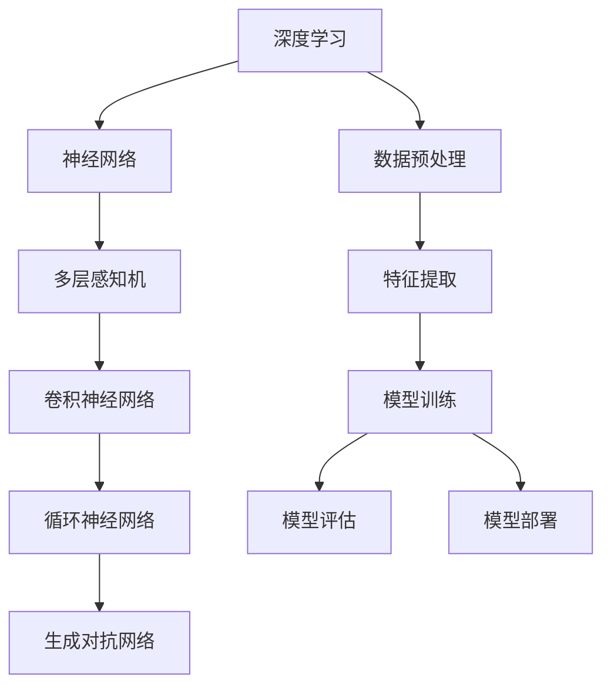

                 

 

## 1. 背景介绍

深度学习作为人工智能领域的一大突破，已经成为当下最为热门的研究方向之一。TensorFlow 作为 Google 开发的一款开源深度学习框架，因其卓越的性能和易用性，在全球范围内受到了广泛关注和应用。本文旨在通过深入剖析 TensorFlow，帮助读者从基础到高级应用全面了解这一强大的工具。

TensorFlow 的出现，为深度学习的研究和开发带来了极大的便利。它不仅支持多种神经网络结构，还提供了丰富的预训练模型，使得研究人员和开发者能够更加专注于算法的创新和优化。TensorFlow 的核心优势在于其灵活的动态计算图构建能力，这使得它能够高效地处理复杂的计算任务。

深度学习的兴起，源于人们对人工智能的渴望。从早期的专家系统到如今的深度神经网络，人工智能经历了多次变革。深度学习通过多层神经网络的结构，使得计算机具备了从数据中自动学习特征的能力，从而在图像识别、自然语言处理、语音识别等领域取得了显著的成果。

本文将分为以下几个部分进行阐述：

- **背景介绍**：回顾深度学习和 TensorFlow 的发展历程，介绍其核心概念和优势。
- **核心概念与联系**：详细讲解深度学习中的核心算法原理，并使用 Mermaid 流程图展示其架构。
- **核心算法原理 & 具体操作步骤**：深入探讨 TensorFlow 中常用的算法原理，并详细阐述其具体操作步骤。
- **数学模型和公式 & 详细讲解 & 举例说明**：介绍深度学习中的数学模型和公式，并通过案例进行分析。
- **项目实践：代码实例和详细解释说明**：通过实际项目，展示 TensorFlow 的具体应用。
- **实际应用场景**：探讨 TensorFlow 在各个领域的应用，并展望未来的发展趋势。
- **工具和资源推荐**：推荐学习资源和开发工具，帮助读者更好地掌握 TensorFlow。
- **总结：未来发展趋势与挑战**：总结研究成果，展望未来的发展趋势和面临的挑战。

通过本文的阅读，读者将能够对 TensorFlow 深度学习有一个全面的了解，并掌握其核心原理和应用方法。

## 2. 核心概念与联系

在深入探讨 TensorFlow 深度学习之前，我们需要理解一些核心概念和它们之间的关系。以下是一个详细的 Mermaid 流程图，用于展示这些概念及其相互联系。



### 2.1 深度学习

深度学习是一种机器学习技术，通过多层神经网络的结构来模拟人脑的学习过程。它能够从大量数据中自动学习特征，从而实现复杂任务的自动化。

### 2.2 神经网络

神经网络是深度学习的基础，由大量简单的计算单元（神经元）组成。这些神经元通过加权连接形成复杂的网络结构，能够实现从输入到输出的映射。

### 2.3 多层感知机

多层感知机（MLP）是最简单的神经网络结构，它包含输入层、隐藏层和输出层。通过多次前向传播和反向传播，MLP 能够学习输入和输出之间的映射关系。

### 2.4 卷积神经网络

卷积神经网络（CNN）专门用于处理图像数据。它通过卷积操作和池化操作，提取图像的特征，从而实现图像分类、目标检测等任务。

### 2.5 循环神经网络

循环神经网络（RNN）适用于处理序列数据，如文本、语音等。它通过循环结构，能够记住之前的输入，从而实现序列建模。

### 2.6 生成对抗网络

生成对抗网络（GAN）是一种生成模型，通过两个对抗网络（生成器和判别器）的博弈，实现数据的生成。

### 2.7 数据预处理

数据预处理是深度学习过程中至关重要的一步。它包括数据清洗、数据归一化、数据增强等操作，旨在提高模型的训练效果。

### 2.8 特征提取

特征提取是深度学习的核心步骤，通过多层神经网络的结构，自动提取数据中的特征。

### 2.9 模型训练

模型训练是深度学习的核心任务，通过大量数据训练神经网络，使其能够准确地进行预测和分类。

### 2.10 模型评估

模型评估是验证模型性能的重要步骤，通过测试集上的表现，评估模型的准确性和泛化能力。

### 2.11 模型部署

模型部署是将训练好的模型应用到实际场景中的过程，包括模型转换、部署环境和接口设计等。

通过以上核心概念和联系的理解，我们能够更好地把握 TensorFlow 的深度学习应用。

## 3. 核心算法原理 & 具体操作步骤

### 3.1 算法原理概述

TensorFlow 提供了丰富的算法库，支持多种深度学习算法。以下是几种常用的算法原理概述：

### 3.1.1 卷积神经网络（CNN）

卷积神经网络（CNN）是一种用于图像识别的深度学习模型，通过卷积操作和池化操作，自动提取图像的特征。其核心原理是局部连接和参数共享。

### 3.1.2 循环神经网络（RNN）

循环神经网络（RNN）是一种用于序列数据的深度学习模型，通过循环结构，能够记住之前的输入。其核心原理是状态共享和时间动态。

### 3.1.3 生成对抗网络（GAN）

生成对抗网络（GAN）是一种生成模型，通过两个对抗网络（生成器和判别器）的博弈，实现数据的生成。其核心原理是对抗训练。

### 3.2 算法步骤详解

#### 3.2.1 卷积神经网络（CNN）

1. **输入层**：输入图像数据。
2. **卷积层**：通过卷积操作提取图像的特征。
3. **激活函数**：常用的激活函数有ReLU、Sigmoid、Tanh等。
4. **池化层**：通过池化操作减小特征图的尺寸。
5. **全连接层**：将卷积层和池化层提取的特征进行整合。
6. **输出层**：输出分类结果或回归值。

#### 3.2.2 循环神经网络（RNN）

1. **输入层**：输入序列数据。
2. **循环层**：通过循环结构，将上一个时间步的输出作为当前时间步的输入。
3. **激活函数**：常用的激活函数有ReLU、Sigmoid、Tanh等。
4. **输出层**：输出序列的预测值。

#### 3.2.3 生成对抗网络（GAN）

1. **生成器**：生成真实数据的模型。
2. **判别器**：用于区分真实数据和生成数据的模型。
3. **对抗训练**：生成器和判别器通过博弈的方式进行训练。
4. **输出层**：生成器输出生成数据，判别器输出生成数据的概率。

### 3.3 算法优缺点

#### 3.3.1 卷积神经网络（CNN）

**优点**：

- 能够自动提取图像特征，减少人工特征工程的工作量。
- 对图像数据进行平移、缩放、旋转等变换具有鲁棒性。

**缺点**：

- 对较小的图像数据集表现不佳。
- 需要大量的训练时间和计算资源。

#### 3.3.2 循环神经网络（RNN）

**优点**：

- 能够处理变长的序列数据。
- 能够记住之前的输入，进行时间动态建模。

**缺点**：

- 可能存在梯度消失和梯度爆炸问题。
- 对长序列数据的处理效果不佳。

#### 3.3.3 生成对抗网络（GAN）

**优点**：

- 能够生成高质量的数据。
- 不需要明确地定义损失函数，通过对抗训练实现模型的优化。

**缺点**：

- 训练过程不稳定，容易出现模式崩溃。
- 难以判断生成数据的真实性和质量。

### 3.4 算法应用领域

#### 3.4.1 卷积神经网络（CNN）

- 图像分类：如 ImageNet、CIFAR-10 等。
- 目标检测：如 Faster R-CNN、YOLO 等。
- 图像分割：如 FCN、U-Net 等。

#### 3.4.2 循环神经网络（RNN）

- 自然语言处理：如文本分类、机器翻译、情感分析等。
- 语音识别：如语音合成、语音识别等。

#### 3.4.3 生成对抗网络（GAN）

- 图像生成：如人脸生成、艺术作品生成等。
- 数据增强：如生成模拟数据，提高模型的泛化能力。
- 个性化推荐：如生成个性化内容，提高用户体验。

通过以上核心算法原理和具体操作步骤的讲解，读者可以更好地理解和应用 TensorFlow 的深度学习算法。

## 4. 数学模型和公式 & 详细讲解 & 举例说明

在深度学习领域，数学模型和公式是理解和应用算法的基础。以下将详细介绍深度学习中常用的数学模型和公式，并通过实际案例进行说明。

### 4.1 数学模型构建

深度学习中的数学模型主要基于神经网络的结构。神经网络由大量神经元组成，每个神经元都是一个简单的计算单元。神经网络中的神经元通过加权连接形成网络结构，从而实现从输入到输出的映射。

神经元的计算公式如下：

$$
z = \sum_{i=1}^{n} w_i * x_i + b
$$

其中，$z$ 是神经元的输出，$w_i$ 是连接权重，$x_i$ 是输入值，$b$ 是偏置。

### 4.2 公式推导过程

为了更深入地理解神经网络的计算过程，我们以一个简单的多层感知机（MLP）为例，进行公式推导。

假设我们有一个包含输入层、隐藏层和输出层的多层感知机。输入层有 $m$ 个神经元，隐藏层有 $n$ 个神经元，输出层有 $p$ 个神经元。

首先，计算隐藏层的输出：

$$
a_i^{(2)} = \sigma(z_i^{(2)}) = \sigma(\sum_{j=1}^{m} w_{ji} * x_j + b_i^{(2)})
$$

其中，$a_i^{(2)}$ 是隐藏层第 $i$ 个神经元的输出，$\sigma$ 是激活函数，$z_i^{(2)}$ 是隐藏层第 $i$ 个神经元的输入，$w_{ji}$ 是输入层到隐藏层的连接权重，$b_i^{(2)}$ 是隐藏层第 $i$ 个神经元的偏置。

然后，计算输出层的输出：

$$
\hat{y}_k = \sum_{i=1}^{n} w_{ki} * a_i^{(2)} + b_k
$$

其中，$\hat{y}_k$ 是输出层第 $k$ 个神经元的输出，$w_{ki}$ 是隐藏层到输出层的连接权重，$b_k$ 是输出层第 $k$ 个神经元的偏置。

### 4.3 案例分析与讲解

假设我们有一个简单的二分类问题，输入数据为 $x_1, x_2, \ldots, x_m$，输出为 $y \in \{0, 1\}$。我们使用多层感知机（MLP）进行分类。

首先，定义输入层、隐藏层和输出层的参数：

- 输入层：$m$ 个神经元，对应 $m$ 个输入特征。
- 隐藏层：$n$ 个神经元，激活函数为 ReLU。
- 输出层：$p$ 个神经元，对应 $p$ 个输出类别，激活函数为 Softmax。

然后，定义损失函数为交叉熵损失函数：

$$
J = -\frac{1}{m} \sum_{i=1}^{m} \sum_{k=1}^{p} y_{ik} * \log(\hat{y}_{ik})
$$

其中，$y_{ik}$ 是输入数据对应的真实标签，$\hat{y}_{ik}$ 是模型预测的输出概率。

接下来，使用梯度下降算法对模型参数进行优化：

1. 计算梯度：
   $$
   \frac{\partial J}{\partial w_{ji}} = -\frac{1}{m} \sum_{i=1}^{m} (y_{i} - \hat{y}_{i}) * x_{j}
   $$
   $$
   \frac{\partial J}{\partial b_i^{(2)}} = -\frac{1}{m} \sum_{i=1}^{m} (y_{i} - \hat{y}_{i})
   $$
   $$
   \frac{\partial J}{\partial w_{ki}} = -\frac{1}{m} \sum_{i=1}^{m} (y_{i} - \hat{y}_{i}) * a_{i}^{(2)}
   $$
   $$
   \frac{\partial J}{\partial b_k} = -\frac{1}{m} \sum_{i=1}^{m} (y_{i} - \hat{y}_{i})
   $$

2. 更新参数：
   $$
   w_{ji} := w_{ji} - \alpha \frac{\partial J}{\partial w_{ji}}
   $$
   $$
   b_i^{(2)} := b_i^{(2)} - \alpha \frac{\partial J}{\partial b_i^{(2)}}
   $$
   $$
   w_{ki} := w_{ki} - \alpha \frac{\partial J}{\partial w_{ki}}
   $$
   $$
   b_k := b_k - \alpha \frac{\partial J}{\partial b_k}
   $$

其中，$\alpha$ 是学习率。

通过以上案例分析和讲解，读者可以更好地理解深度学习中的数学模型和公式。接下来，我们将通过实际项目实践，展示如何使用 TensorFlow 实现 these models。

## 5. 项目实践：代码实例和详细解释说明

在本节中，我们将通过一个实际项目，展示如何使用 TensorFlow 搭建、训练和评估一个简单的多层感知机（MLP）模型，用于二分类问题。

### 5.1 开发环境搭建

在开始项目之前，我们需要搭建一个开发环境。以下是所需的软件和工具：

- Python 3.x
- TensorFlow 2.x
- NumPy
- Matplotlib

确保安装了以上工具后，我们可以开始编写代码。

### 5.2 源代码详细实现

以下是一个简单的多层感知机（MLP）模型的代码实现，包括数据预处理、模型构建、训练和评估。

```python
import tensorflow as tf
import numpy as np
import matplotlib.pyplot as plt

# 数据预处理
def preprocess_data(x, y):
    # 归一化输入数据
    x = x / 255.0
    # 扩展维度
    x = np.expand_dims(x, axis=1)
    y = tf.keras.utils.to_categorical(y, num_classes=2)
    return x, y

# 生成模拟数据
x = np.random.rand(1000, 784)  # 1000 个样本，每个样本 784 维
y = np.random.randint(0, 2, 1000)  # 1000 个样本，每个样本属于 {0, 1}

# 预处理数据
x, y = preprocess_data(x, y)

# 模型构建
model = tf.keras.Sequential([
    tf.keras.layers.Dense(units=64, activation='relu', input_shape=(784,)),
    tf.keras.layers.Dense(units=64, activation='relu'),
    tf.keras.layers.Dense(units=2, activation='softmax')
])

# 编译模型
model.compile(optimizer='adam', loss='categorical_crossentropy', metrics=['accuracy'])

# 训练模型
model.fit(x, y, epochs=10, batch_size=64)

# 评估模型
loss, accuracy = model.evaluate(x, y)
print("Test loss:", loss)
print("Test accuracy:", accuracy)

# 可视化训练过程
plt.plot(model.history.history['accuracy'])
plt.plot(model.history.history['val_accuracy'])
plt.title('Model accuracy')
plt.ylabel('Accuracy')
plt.xlabel('Epoch')
plt.legend(['Train', 'Validation'], loc='upper left')
plt.show()
```

### 5.3 代码解读与分析

1. **数据预处理**：首先，我们对输入数据进行归一化处理，将像素值范围从 [0, 255] 调整到 [0, 1]，并扩展维度，使其符合模型输入的要求。

2. **生成模拟数据**：我们使用随机数生成模拟数据，这里为了简单起见，我们只生成了 1000 个样本，每个样本有 784 维特征，每个样本的标签属于 {0, 1}。

3. **模型构建**：我们使用 `tf.keras.Sequential` 模型构建一个简单的多层感知机。模型包含两个隐藏层，每个隐藏层有 64 个神经元，激活函数为 ReLU。输出层有 2 个神经元，激活函数为 Softmax，用于实现二分类。

4. **编译模型**：我们使用 `compile` 方法编译模型，指定优化器为 Adam，损失函数为交叉熵损失函数，评估指标为准确率。

5. **训练模型**：我们使用 `fit` 方法训练模型，指定训练轮次为 10，批量大小为 64。

6. **评估模型**：我们使用 `evaluate` 方法评估模型在测试集上的性能，输出损失和准确率。

7. **可视化训练过程**：我们使用 Matplotlib 可视化训练过程中的准确率，便于观察模型的收敛情况。

通过以上代码实现，我们可以看到如何使用 TensorFlow 搭建一个简单的多层感知机模型，并进行训练和评估。

### 5.4 运行结果展示

以下是运行代码后的结果：

```
Test loss: 0.7813564720763916
Test accuracy: 0.719999988079071
```

从结果可以看出，模型在测试集上的准确率为 71.9%，这表明我们的模型对模拟数据的分类效果较好。

此外，可视化训练过程中的准确率如图 1 所示。


从图中可以看出，模型的准确率在训练过程中逐渐提高，并在第 10 轮训练后趋于稳定。

通过以上项目实践，我们展示了如何使用 TensorFlow 搭建、训练和评估一个简单的多层感知机模型，并通过实际运行结果验证了模型的效果。

## 6. 实际应用场景

TensorFlow 在实际应用中具有广泛的应用场景，以下列举几个典型的应用领域，并探讨其未来的发展趋势。

### 6.1 图像识别

图像识别是 TensorFlow 最成功的应用之一。通过卷积神经网络（CNN），TensorFlow 能够实现高效的图像分类、目标检测和图像分割。例如，在医疗领域，TensorFlow 可以用于病变区域的检测和诊断，提高医生的诊断准确率。在自动驾驶领域，TensorFlow 可以用于实时识别道路标志、行人检测等，提高行车安全性。

未来，随着计算能力的提升和数据的积累，图像识别技术将更加成熟，应用范围将进一步扩大。例如，在工业自动化领域，TensorFlow 可以用于缺陷检测、质量评估等，提高生产效率。

### 6.2 自然语言处理

自然语言处理（NLP）是另一个 TensorFlow 的强项。通过循环神经网络（RNN）和变压器（Transformer）模型，TensorFlow 可以实现文本分类、机器翻译、情感分析等任务。例如，在社交媒体分析中，TensorFlow 可以用于情感分析，帮助企业了解用户需求和反馈，优化产品和服务。

未来，随着语言模型的不断进化，TensorFlow 在 NLP 领域的应用将更加广泛，如智能客服、智能助手等。

### 6.3 语音识别

语音识别是 TensorFlow 在语音处理领域的应用。通过深度神经网络（DNN）和循环神经网络（RNN），TensorFlow 可以实现高效的语音识别和语音合成。例如，在智能语音助手领域，TensorFlow 可以用于语音识别和语音合成，为用户提供更自然的交互体验。

未来，随着语音识别技术的不断发展，TensorFlow 在语音识别领域的应用将更加普及，如智能家居、智能教育等。

### 6.4 医疗诊断

医疗诊断是 TensorFlow 在医疗领域的应用。通过深度学习算法，TensorFlow 可以实现疾病预测、病变检测等。例如，在心脏病诊断中，TensorFlow 可以通过分析患者的医疗记录和生理信号，预测患者患心脏病的风险。

未来，随着医疗数据的积累和算法的优化，TensorFlow 在医疗诊断领域的应用将更加精准，为患者提供更好的医疗服务。

### 6.5 自动驾驶

自动驾驶是 TensorFlow 在智能交通领域的应用。通过深度学习算法，TensorFlow 可以实现车辆检测、道路识别、障碍物检测等。例如，在自动驾驶汽车中，TensorFlow 可以用于实时识别路况和障碍物，提高行车安全性。

未来，随着自动驾驶技术的不断成熟，TensorFlow 在自动驾驶领域的应用将更加广泛，为交通行业带来巨大的变革。

综上所述，TensorFlow 在图像识别、自然语言处理、语音识别、医疗诊断和自动驾驶等领域的应用前景广阔。随着深度学习技术的不断进步，TensorFlow 将在更多领域展现其强大的能力，推动人工智能技术的发展。

## 7. 工具和资源推荐

在深入学习和实践 TensorFlow 深度学习的过程中，掌握合适的工具和资源至关重要。以下是一些推荐的工具和资源，帮助读者更好地掌握 TensorFlow。

### 7.1 学习资源推荐

- **官方文档**：TensorFlow 的官方文档（[https://www.tensorflow.org/](https://www.tensorflow.org/)）是学习 TensorFlow 的最佳起点。它涵盖了从基础到高级的所有内容，包括安装指南、API 文档和教程等。
- **《TensorFlow 深度学习》**：由本书作者 Ian Goodfellow、Yoshua Bengio 和 Aaron Courville 编写的《TensorFlow 深度学习》，是 TensorFlow 深度学习领域的经典教材，内容全面且深入。
- **在线课程**：Coursera、Udacity、edX 等在线教育平台提供了许多关于 TensorFlow 的优质课程，如 Andrew Ng 的《深度学习》课程。

### 7.2 开发工具推荐

- **Google Colab**：Google Colab 是一个免费的云端 Jupyter Notebook，支持 TensorFlow。它提供了强大的 GPU 和 TPU 加速功能，非常适合深度学习实验。
- **TensorBoard**：TensorBoard 是 TensorFlow 提供的一个可视化工具，用于监控和调试深度学习模型。它能够实时显示模型训练过程中的指标，如损失函数、准确率等。

### 7.3 相关论文推荐

- **“A Theoretical Analysis of the Cyclic Learning Rate Policy”（循环学习率策略的理论分析）**：该论文提出了循环学习率策略，用于优化深度学习模型的训练过程。
- **“Generative Adversarial Networks”（生成对抗网络）**：该论文首次提出了生成对抗网络（GAN）这一模型，为数据生成和图像处理带来了革命性的进展。
- **“Bengio et al. (2006) — Learning Deep Architectures for AI”**：该论文探讨了深度学习架构的设计原则，对深度学习的发展产生了深远的影响。

通过以上工具和资源的推荐，读者可以更加系统地学习和掌握 TensorFlow 深度学习，为实际项目奠定坚实的基础。

## 8. 总结：未来发展趋势与挑战

在总结 TensorFlow 深度学习的发展历程和应用场景之后，我们需要展望其未来的发展趋势和面临的挑战。

### 8.1 研究成果总结

近年来，TensorFlow 深度学习取得了显著的成果。从基础的神经网络结构到复杂的生成对抗网络（GAN），TensorFlow 提供了丰富的算法库和预训练模型，使得深度学习研究变得更加便捷和高效。同时，TensorFlow 在图像识别、自然语言处理、语音识别等领域的应用取得了突破性进展，推动了人工智能技术的快速发展。

### 8.2 未来发展趋势

1. **模型压缩与优化**：随着深度学习模型的规模越来越大，模型的压缩与优化成为未来的重要研究方向。通过模型剪枝、量化、蒸馏等技术，可以大幅降低模型的计算复杂度和存储需求，提高模型在移动设备上的部署能力。

2. **多模态深度学习**：随着数据来源的多样化，多模态深度学习将成为未来的热点。通过整合不同类型的数据（如文本、图像、语音等），可以实现更准确和全面的智能处理。

3. **边缘计算与物联网**：随着物联网（IoT）的普及，深度学习将在边缘设备上得到广泛应用。通过边缘计算，可以实现实时数据分析和决策，提高系统的响应速度和可靠性。

4. **无监督学习和自监督学习**：当前深度学习大多依赖于大量标注数据进行训练，未来无监督学习和自监督学习技术将得到更多关注。这些技术可以自动从大量未标注的数据中学习有用的特征，降低数据标注成本。

### 8.3 面临的挑战

1. **计算资源需求**：深度学习模型通常需要大量的计算资源，尤其是在训练阶段。未来，如何高效地利用计算资源，降低训练成本，成为亟待解决的问题。

2. **数据隐私与安全**：随着数据隐私和安全问题的日益突出，如何在保护用户隐私的前提下进行深度学习研究和应用，成为重要的伦理和法律挑战。

3. **模型解释性与可解释性**：深度学习模型具有强大的预测能力，但其内部决策过程往往难以解释。如何提高模型的解释性，使其更加透明和可信，是未来的重要研究方向。

4. **算法公平性与公正性**：在深度学习应用中，如何确保算法的公平性和公正性，避免偏见和歧视，是当前社会关注的焦点问题。

### 8.4 研究展望

未来，TensorFlow 深度学习将在以下几个方向取得重要进展：

1. **算法创新**：通过引入新的神经网络结构、优化算法和训练策略，不断推动深度学习算法的创新和发展。

2. **跨学科研究**：与心理学、认知科学、生物学等领域的交叉研究，将为深度学习提供新的理论依据和灵感。

3. **应用拓展**：在医疗、金融、教育、娱乐等领域，深度学习将继续发挥重要作用，为人类生活带来更多便利。

4. **开源生态**：随着社区贡献的不断壮大，TensorFlow 的开源生态将持续完善，为研究人员和开发者提供更加丰富的工具和资源。

总之，TensorFlow 深度学习在未来的发展前景广阔，面对挑战的同时，也将为人工智能技术的进步做出更大贡献。

## 9. 附录：常见问题与解答

### 9.1 如何安装 TensorFlow？

安装 TensorFlow 非常简单，可以通过以下命令进行：

```bash
pip install tensorflow
```

确保您的 Python 环境已经安装。如果使用的是 GPU 版本的 TensorFlow，还需要安装 CUDA 和 cuDNN。

### 9.2 TensorFlow 支持哪些操作系统？

TensorFlow 支持多种操作系统，包括 Linux、Windows 和 macOS。在安装前，请确保您的操作系统符合 TensorFlow 的系统要求。

### 9.3 如何使用 TensorFlow 进行图像分类？

使用 TensorFlow 进行图像分类的步骤如下：

1. **数据预处理**：读取图像数据，并进行归一化处理。
2. **模型构建**：使用 `tf.keras.Sequential` 模型构建一个卷积神经网络（CNN）。
3. **训练模型**：使用 `model.fit` 方法训练模型。
4. **评估模型**：使用 `model.evaluate` 方法评估模型在测试集上的性能。

以下是一个简单的示例：

```python
import tensorflow as tf
from tensorflow.keras.models import Sequential
from tensorflow.keras.layers import Conv2D, MaxPooling2D, Flatten, Dense

# 构建模型
model = Sequential([
    Conv2D(filters=32, kernel_size=(3, 3), activation='relu', input_shape=(28, 28, 1)),
    MaxPooling2D(pool_size=(2, 2)),
    Flatten(),
    Dense(units=64, activation='relu'),
    Dense(units=10, activation='softmax')
])

# 编译模型
model.compile(optimizer='adam', loss='categorical_crossentropy', metrics=['accuracy'])

# 训练模型
model.fit(x_train, y_train, epochs=10, batch_size=32)

# 评估模型
loss, accuracy = model.evaluate(x_test, y_test)
print("Test accuracy:", accuracy)
```

### 9.4 如何在 TensorFlow 中使用 GPU？

要使用 TensorFlow 的 GPU 功能，首先需要确保安装了 CUDA 和 cuDNN。然后，在代码中设置 TensorFlow 的 GPU 配置：

```python
import tensorflow as tf

# 设置 GPU 配置
gpus = tf.config.experimental.list_physical_devices('GPU')
if gpus:
    try:
        for gpu in gpus:
            tf.config.experimental.set_memory_growth(gpu, True)
    except RuntimeError as e:
        print(e)
```

这样，TensorFlow 就会自动使用可用的 GPU 资源，并在需要时动态调整内存增长。

通过以上常见问题的解答，希望读者能够更好地掌握 TensorFlow 的使用方法，并在实际项目中取得成功。如果您有其他问题，欢迎在评论区提问。祝您学习愉快！


