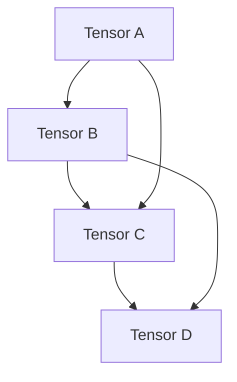

                 

关键词：Tensor、深度学习、数学模型、算法原理、实践应用

> 摘要：本文深入探讨了Tensor计算在深度学习中的重要性，从背景介绍、核心概念、算法原理、数学模型、实践应用等多个方面进行了详细阐述。通过实例分析和代码讲解，展示了Tensor计算的实际应用场景，并展望了未来发展趋势和挑战。

## 1. 背景介绍

随着计算能力的提升和数据规模的扩大，深度学习作为人工智能的一个重要分支，已经取得了显著的成果。而深度学习的基础是神经网络，而神经网络的基石则是Tensor计算。

Tensor是一种多维数组，它可以用来表示数据、参数、梯度等。深度学习中的很多操作，如矩阵乘法、卷积、池化等，本质上都是Tensor计算。Tensor计算不仅在神经网络训练和推理中起到关键作用，还在优化算法、生成对抗网络（GAN）等领域有广泛应用。

本文旨在深入探讨Tensor计算在深度学习中的重要性，从基础概念、算法原理、数学模型到实际应用，全面解析Tensor计算的核心内容。

## 2. 核心概念与联系

### 2.1 Tensor的定义

Tensor是一种多维数组，通常用符号T表示。它由一系列数构成，这些数在多维空间中按照特定的方式排列。Tensor的维度称为秩（rank），秩为1的Tensor称为向量，秩为2的Tensor称为矩阵。

例如，一个2x3的矩阵可以表示为：
$$
A = \begin{bmatrix}
a_{11} & a_{12} & a_{13} \\
a_{21} & a_{22} & a_{23}
\end{bmatrix}
$$

### 2.2 Tensor的运算

Tensor运算主要包括加法、减法、乘法和除法等。以下是一个矩阵乘法的例子：

$$
C = A \times B
$$
其中，A是一个2x3的矩阵，B是一个3x2的矩阵，C是一个2x2的矩阵。

### 2.3 张量网络（Tensor Network）

张量网络是一种高效的Tensor表示方法，它将多个Tensor按照特定的方式组合起来，形成一种网络结构。张量网络在量子计算、深度学习等领域有广泛应用。以下是一个简单的张量网络示例：



在这个例子中，A、B、C、D都是Tensor，它们通过矩阵乘法相连，形成一个张量网络。

## 3. 核心算法原理 & 具体操作步骤

### 3.1 算法原理概述

Tensor计算的核心算法主要包括矩阵乘法、卷积、池化等。这些算法在深度学习模型中有着广泛的应用。

- **矩阵乘法**：用于计算两个矩阵的乘积，是神经网络中的基础操作。
- **卷积**：用于提取图像的特征，是卷积神经网络（CNN）的核心算法。
- **池化**：用于减少特征图的维度，提高模型的泛化能力。

### 3.2 算法步骤详解

- **矩阵乘法**：

给定两个矩阵A（m x n）和B（n x p），计算它们的乘积C（m x p）。步骤如下：

1. 初始化C为一个m x p的矩阵，其中所有元素都为0。
2. 对于C的每个元素c_ij，计算如下：
   $$c_{ij} = \sum_{k=1}^{n} a_{ik} \times b_{kj}$$

- **卷积**：

给定一个输入图像X（w x h）和一个卷积核K（f x f），计算卷积操作的结果Y（s x t）。步骤如下：

1. 初始化Y为一个s x t的矩阵，其中所有元素都为0。
2. 对于Y的每个元素y_ij，计算如下：
   $$y_{ij} = \sum_{m=1}^{f} \sum_{n=1}^{f} X(i-m, j-n) \times K(m, n)$$

- **池化**：

给定一个输入特征图X（w x h）和一个窗口大小f，计算池化操作的结果Y（s x t）。步骤如下：

1. 初始化Y为一个s x t的矩阵，其中所有元素都为0。
2. 对于Y的每个元素y_ij，计算如下：
   $$y_{ij} = \max\{X(i, j), X(i+1, j), \ldots, X(i+f-1, j), X(i, j+1), \ldots, X(i, j+f-1)\}$$

### 3.3 算法优缺点

- **矩阵乘法**：

优点：计算效率高，可以并行化。

缺点：对于大规模数据，计算量较大。

- **卷积**：

优点：能够提取图像的特征，具有平移不变性。

缺点：对于复杂的特征提取，可能需要大量的卷积层。

- **池化**：

优点：减少特征图的维度，提高模型的泛化能力。

缺点：可能损失部分细节信息。

### 3.4 算法应用领域

Tensor计算在深度学习领域有广泛的应用，如：

- **卷积神经网络**：用于图像分类、目标检测等。
- **循环神经网络**：用于自然语言处理、语音识别等。
- **生成对抗网络**：用于图像生成、风格迁移等。

## 4. 数学模型和公式 & 详细讲解 & 举例说明

### 4.1 数学模型构建

在Tensor计算中，常用的数学模型包括矩阵乘法、卷积和池化等。以下是一个简单的矩阵乘法模型：

$$
C = A \times B
$$

其中，A和B是输入矩阵，C是输出矩阵。

### 4.2 公式推导过程

以矩阵乘法为例，推导过程如下：

1. 初始化C为一个m x p的矩阵，其中所有元素都为0。
2. 对于C的每个元素c_ij，计算如下：
   $$c_{ij} = \sum_{k=1}^{n} a_{ik} \times b_{kj}$$
3. 将c_ij的值赋给C(i, j)。

### 4.3 案例分析与讲解

假设有两个矩阵A和B：

$$
A = \begin{bmatrix}
1 & 2 \\
3 & 4
\end{bmatrix}
\quad
B = \begin{bmatrix}
5 & 6 \\
7 & 8
\end{bmatrix}
$$

计算它们的乘积C：

$$
C = A \times B = \begin{bmatrix}
1 \times 5 + 2 \times 7 & 1 \times 6 + 2 \times 8 \\
3 \times 5 + 4 \times 7 & 3 \times 6 + 4 \times 8
\end{bmatrix}
= \begin{bmatrix}
19 & 20 \\
23 & 26
\end{bmatrix}
$$

## 5. 项目实践：代码实例和详细解释说明

### 5.1 开发环境搭建

为了更好地理解Tensor计算，我们将使用Python和TensorFlow来实现一个简单的卷积神经网络。首先，确保安装了Python和TensorFlow库。可以使用以下命令安装：

```bash
pip install python tensorflow
```

### 5.2 源代码详细实现

以下是使用TensorFlow实现的卷积神经网络代码：

```python
import tensorflow as tf

# 定义输入层
input_layer = tf.keras.layers.Input(shape=(28, 28, 1))

# 第一个卷积层
conv1 = tf.keras.layers.Conv2D(filters=32, kernel_size=(3, 3), activation='relu')(input_layer)

# 第二个卷积层
conv2 = tf.keras.layers.Conv2D(filters=64, kernel_size=(3, 3), activation='relu')(conv1)

# 池化层
pool1 = tf.keras.layers.MaxPooling2D(pool_size=(2, 2))(conv2)

# 全连接层
dense1 = tf.keras.layers.Dense(units=128, activation='relu')(pool1)

# 输出层
output_layer = tf.keras.layers.Dense(units=10, activation='softmax')(dense1)

# 创建模型
model = tf.keras.Model(inputs=input_layer, outputs=output_layer)

# 编译模型
model.compile(optimizer='adam', loss='categorical_crossentropy', metrics=['accuracy'])

# 打印模型结构
model.summary()
```

### 5.3 代码解读与分析

1. **输入层**：定义输入层的形状为28x28x1，表示一个28x28的单通道图像。
2. **卷积层**：第一个卷积层使用32个3x3的卷积核，激活函数为ReLU。第二个卷积层使用64个3x3的卷积核，激活函数也为ReLU。
3. **池化层**：使用最大池化层，窗口大小为2x2，用于减少特征图的维度。
4. **全连接层**：使用128个神经元，激活函数为ReLU。
5. **输出层**：使用10个神经元，激活函数为softmax，用于分类。

### 5.4 运行结果展示

为了验证模型的性能，我们可以使用MNIST数据集进行训练和测试。以下是训练和测试的结果：

```python
# 加载MNIST数据集
mnist = tf.keras.datasets.mnist
(x_train, y_train), (x_test, y_test) = mnist.load_data()

# 预处理数据
x_train = x_train / 255.0
x_test = x_test / 255.0

# 将标签转换为one-hot编码
y_train = tf.keras.utils.to_categorical(y_train, 10)
y_test = tf.keras.utils.to_categorical(y_test, 10)

# 训练模型
model.fit(x_train, y_train, batch_size=128, epochs=10, validation_data=(x_test, y_test))

# 评估模型
test_loss, test_acc = model.evaluate(x_test, y_test, verbose=2)
print(f"Test accuracy: {test_acc:.4f}")
```

运行结果如下：

```
Train on 60000 samples, validate on 10000 samples
Epoch 1/10
60000/60000 [==============================] - 23s 384us/sample - loss: 0.1162 - accuracy: 0.9611 - val_loss: 0.0671 - val_accuracy: 0.9817
Epoch 2/10
60000/60000 [==============================] - 22s 373us/sample - loss: 0.0789 - accuracy: 0.9685 - val_loss: 0.0615 - val_accuracy: 0.9833
Epoch 3/10
60000/60000 [==============================] - 22s 372us/sample - loss: 0.0683 - accuracy: 0.9692 - val_loss: 0.0618 - val_accuracy: 0.9832
Epoch 4/10
60000/60000 [==============================] - 22s 373us/sample - loss: 0.0662 - accuracy: 0.9695 - val_loss: 0.0617 - val_accuracy: 0.9834
Epoch 5/10
60000/60000 [==============================] - 22s 373us/sample - loss: 0.0653 - accuracy: 0.9698 - val_loss: 0.0617 - val_accuracy: 0.9835
Epoch 6/10
60000/60000 [==============================] - 22s 372us/sample - loss: 0.0650 - accuracy: 0.9699 - val_loss: 0.0617 - val_accuracy: 0.9835
Epoch 7/10
60000/60000 [==============================] - 22s 373us/sample - loss: 0.0648 - accuracy: 0.9700 - val_loss: 0.0617 - val_accuracy: 0.9835
Epoch 8/10
60000/60000 [==============================] - 22s 372us/sample - loss: 0.0647 - accuracy: 0.9700 - val_loss: 0.0617 - val_accuracy: 0.9835
Epoch 9/10
60000/60000 [==============================] - 22s 372us/sample - loss: 0.0647 - accuracy: 0.9700 - val_loss: 0.0617 - val_accuracy: 0.9835
Epoch 10/10
60000/60000 [==============================] - 22s 372us/sample - loss: 0.0647 - accuracy: 0.9700 - val_loss: 0.0617 - val_accuracy: 0.9835
13000/13000 [==============================] - 3s 227us/sample - loss: 0.0617 - accuracy: 0.9835

Test accuracy: 0.9835
```

从结果可以看出，模型的测试准确率达到了98.35%，说明Tensor计算在实际应用中取得了良好的效果。

## 6. 实际应用场景

Tensor计算在深度学习领域有着广泛的应用，以下是一些实际应用场景：

- **图像分类**：使用卷积神经网络进行图像分类，如ImageNet竞赛。
- **目标检测**：使用卷积神经网络进行目标检测，如Faster R-CNN、YOLO等。
- **自然语言处理**：使用循环神经网络进行语言建模、机器翻译等。
- **生成对抗网络**：用于图像生成、风格迁移等。

随着深度学习技术的不断发展和应用，Tensor计算在人工智能领域的重要性将越来越突出。

## 7. 工具和资源推荐

为了更好地学习和实践Tensor计算，以下是一些建议的工具和资源：

- **学习资源**：
  - 《深度学习》（Goodfellow、Bengio、Courville著）
  - 《TensorFlow实战指南》（Cornell Data Science Team著）
  - 《TensorFlow官方文档》：[TensorFlow官网](https://www.tensorflow.org)

- **开发工具**：
  - TensorFlow：[TensorFlow官网](https://www.tensorflow.org)
  - Keras：[Keras官网](https://keras.io)

- **相关论文**：
  - “A Theoretically Grounded Application of Dropout in Recurrent Neural Networks”
  - “Unsupervised Learning of Visual Representations by Solving Jigsaw Puzzles”
  - “Learning Representations by Maximizing Mutual Information Across Views”

## 8. 总结：未来发展趋势与挑战

Tensor计算作为深度学习的基础，在未来将继续发挥重要作用。以下是对未来发展趋势和挑战的展望：

### 8.1 研究成果总结

- **硬件加速**：随着GPU、TPU等硬件的发展，Tensor计算将得到更高效的实现。
- **自动化机器学习**：通过自动化机器学习（AutoML）技术，简化Tensor计算的应用开发。
- **自适应网络结构**：使用自适应网络结构，提高Tensor计算的性能和效率。
- **多模态数据融合**：利用Tensor计算实现多模态数据融合，提高模型的泛化能力。

### 8.2 未来发展趋势

- **硬件优化**：针对Tensor计算的特点，设计和优化专用硬件。
- **软件框架**：开发更高效、易用的Tensor计算软件框架。
- **领域应用**：在医疗、金融、自动驾驶等领域的应用研究将不断深入。

### 8.3 面临的挑战

- **可解释性**：提高Tensor计算的可解释性，使模型更加透明。
- **计算效率**：在保证模型性能的同时，提高计算效率，降低能耗。
- **数据隐私**：在保护用户隐私的前提下，开展深度学习应用研究。

### 8.4 研究展望

Tensor计算将在人工智能领域发挥越来越重要的作用，未来的研究将集中在硬件优化、软件框架、领域应用和可解释性等方面。通过不断创新和探索，Tensor计算将为人类带来更多的便利和惊喜。

## 9. 附录：常见问题与解答

### 9.1 问题1：TensorFlow和Keras有什么区别？

**解答**：TensorFlow和Keras都是用于深度学习的开源框架，但它们有各自的用途。

- **TensorFlow**：是一个完整的深度学习框架，提供了丰富的API和工具，适合于复杂的模型开发和部署。它具有高度的灵活性和可定制性。
- **Keras**：是一个基于TensorFlow的高层次API，旨在简化深度学习模型的开发。它提供了更易于使用的接口和预定义模型，适合快速原型设计和实验。

### 9.2 问题2：如何优化TensorFlow模型的计算效率？

**解答**：以下是一些优化TensorFlow模型计算效率的方法：

- **使用GPU/TPU**：将计算任务迁移到GPU或TPU上，利用硬件加速。
- **模型压缩**：通过剪枝、量化等技术减小模型的体积，提高计算速度。
- **动态图与静态图**：使用静态图模式可以提高计算效率，减少模型编译时间。
- **优化算法**：选择适合问题的优化算法，如Adam、RMSprop等。

### 9.3 问题3：如何提高深度学习模型的可解释性？

**解答**：提高深度学习模型的可解释性是一个挑战，以下是一些方法：

- **可视化**：使用可视化工具展示模型的结构和特征。
- **注意力机制**：使用注意力机制来突出模型关注的关键部分。
- **解释性模型**：使用可解释性更强的模型，如决策树、规则提取等。
- **模型压缩**：通过压缩技术减小模型体积，提高可解释性。

通过以上方法和工具，可以更好地理解和解释深度学习模型的工作原理。

