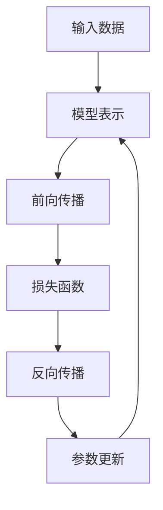

                 

关键词：Tensor计算、深度学习、数学基石、算法原理、数学模型、项目实践、实际应用场景

> 摘要：本文将深入探讨Tensor计算在深度学习中的重要性，分析其核心概念、算法原理、数学模型以及实际应用场景，为读者提供全面的技术见解和实用指导。

## 1. 背景介绍

深度学习作为人工智能的核心技术之一，近年来在计算机视觉、自然语言处理、语音识别等领域取得了显著的成果。而Tensor计算作为深度学习的基础，承载着处理大量数据、实现复杂计算模型的重要使命。Tensor是一种多维数组，可以表示任何数据结构，包括标量、向量、矩阵等。在深度学习中，Tensor被广泛用于存储和传递网络中的权重、激活函数、梯度等信息。因此，理解Tensor计算的基本原理和操作方法，对于深入研究深度学习具有重要意义。

## 2. 核心概念与联系

### 2.1 Tensor的定义与性质

Tensor是一种多维数组，通常表示为 $T_{ijk...}$，其中 i、j、k...表示 Tensor 的各个维度。根据维度的不同，Tensor可以分为以下几种类型：

- **标量（0阶Tensor）**：只有一个值，例如温度、压力等。
- **向量（1阶Tensor）**：一维数组，例如速度、加速度等。
- **矩阵（2阶Tensor）**：二维数组，例如图像、权重矩阵等。
- **张量（n阶Tensor）**：n 维数组，例如三维图像、高维权重矩阵等。

Tensor具有以下性质：

- **可加性**：Tensor 可以进行加法运算，满足结合律和交换律。
- **线性性**：Tensor 可以与标量、向量、矩阵等进行线性运算。
- **可导性**：Tensor 具有梯度，可以用于优化算法。

### 2.2 Tensor与深度学习的关系

在深度学习中，Tensor是表示数据、模型和参数的基本单位。以下是其主要作用：

- **数据表示**：Tensor可以表示输入数据、中间计算结果和输出结果。例如，图像可以被表示为一个4维Tensor，分别为通道数、高度、宽度和时间步。
- **模型表示**：Tensor用于表示深度学习模型的结构，包括权重、激活函数、损失函数等。例如，卷积神经网络（CNN）中的卷积层、池化层和全连接层都可以用Tensor表示。
- **参数优化**：Tensor的梯度用于参数优化，通过反向传播算法更新网络权重。例如，梯度下降、随机梯度下降（SGD）和Adam等优化算法都依赖于Tensor的梯度计算。

### 2.3 Mermaid 流程图

以下是一个简单的 Mermaid 流程图，展示了 Tensor 在深度学习中的主要作用和联系：



## 3. 核心算法原理 & 具体操作步骤

### 3.1 算法原理概述

Tensor计算的核心算法包括前向传播和反向传播。以下是对这两个算法的简要概述：

- **前向传播**：从前向网络结构中，将输入数据传递到输出结果。具体步骤如下：
  1. 将输入数据表示为 Tensor。
  2. 通过网络层，计算每个层的输出 Tensor。
  3. 最终输出结果为网络的最后一层的输出 Tensor。

- **反向传播**：根据输出结果，计算网络中每个层的梯度，并更新网络权重。具体步骤如下：
  1. 计算损失函数关于输出 Tensor 的梯度。
  2. 通过反向传播算法，将梯度传递到每个层的输入 Tensor。
  3. 计算每个层的梯度，并使用优化算法更新网络权重。

### 3.2 算法步骤详解

#### 3.2.1 前向传播

以下是一个简单的深度神经网络的前向传播算法步骤：

1. 初始化输入 Tensor：根据训练数据集，将输入数据表示为 Tensor。
2. 初始化权重 Tensor：根据网络结构，初始化权重 Tensor。
3. 前向传播计算：通过网络层，依次计算每个层的输出 Tensor。
4. 最终输出结果：输出网络的最后一层的输出 Tensor。

#### 3.2.2 反向传播

以下是一个简单的深度神经网络的反向传播算法步骤：

1. 初始化损失函数：根据输出结果，选择合适的损失函数。
2. 计算损失函数关于输出 Tensor 的梯度：使用梯度计算方法，计算损失函数关于输出 Tensor 的梯度。
3. 反向传播计算：通过反向传播算法，将梯度传递到每个层的输入 Tensor。
4. 计算每个层的梯度：使用链式法则，计算每个层的梯度。
5. 更新网络权重：使用优化算法，更新网络权重。

### 3.3 算法优缺点

#### 优点：

- **高效性**：Tensor计算可以高效地处理大规模数据，支持并行计算，提高计算速度。
- **灵活性**：Tensor可以表示各种数据结构，适用于多种深度学习模型。
- **通用性**：Tensor计算广泛应用于计算机视觉、自然语言处理、语音识别等领域。

#### 缺点：

- **复杂性**：Tensor计算涉及大量的数学和编程知识，对初学者有一定的门槛。
- **资源消耗**：Tensor计算需要大量的内存和计算资源，对于小规模数据或资源受限的环境，可能不够高效。

### 3.4 算法应用领域

Tensor计算在深度学习中的主要应用领域包括：

- **计算机视觉**：用于图像分类、目标检测、图像生成等任务。
- **自然语言处理**：用于文本分类、机器翻译、情感分析等任务。
- **语音识别**：用于语音识别、语音合成等任务。
- **推荐系统**：用于用户行为分析、商品推荐等任务。

## 4. 数学模型和公式 & 详细讲解 & 举例说明

### 4.1 数学模型构建

在深度学习中，Tensor计算主要涉及以下数学模型：

- **线性模型**：描述输入数据与输出结果之间的线性关系，包括权重矩阵、偏置项等。
- **损失函数**：用于衡量模型预测值与真实值之间的差距，常见的有均方误差（MSE）、交叉熵（CE）等。
- **优化算法**：用于更新网络权重，常见的有梯度下降（GD）、随机梯度下降（SGD）、Adam等。

### 4.2 公式推导过程

以下是一个简单的线性模型和损失函数的推导过程：

#### 线性模型

设输入数据为 $x \in \mathbb{R}^n$，权重矩阵为 $W \in \mathbb{R}^{n \times m}$，偏置项为 $b \in \mathbb{R}^m$，则线性模型可以表示为：

$$
y = xW + b
$$

其中，$y \in \mathbb{R}^m$ 为输出结果。

#### 均方误差（MSE）

设真实值为 $y$，预测值为 $\hat{y}$，则均方误差（MSE）可以表示为：

$$
L(y, \hat{y}) = \frac{1}{2} (y - \hat{y})^2
$$

#### 交叉熵（CE）

设真实值为 $y$，预测值为 $\hat{y}$，则交叉熵（CE）可以表示为：

$$
L(y, \hat{y}) = -y \log(\hat{y}) - (1 - y) \log(1 - \hat{y})
$$

### 4.3 案例分析与讲解

#### 案例背景

假设我们有一个二元分类问题，输入数据为 $x \in \mathbb{R}^2$，真实值为 $y \in \{0, 1\}$，预测值为 $\hat{y} \in \{0, 1\}$。我们使用线性模型和均方误差（MSE）进行建模和训练。

#### 案例步骤

1. 初始化权重矩阵 $W$ 和偏置项 $b$，例如 $W = \begin{bmatrix} 0.1 & 0.2 \\ 0.3 & 0.4 \end{bmatrix}$，$b = [0.5; 0.5]$。
2. 计算输入数据 $x$ 的前向传播结果 $y = xW + b$。
3. 计算损失函数 $L(y, \hat{y})$。
4. 计算损失函数关于权重矩阵 $W$ 和偏置项 $b$ 的梯度。
5. 使用优化算法更新权重矩阵 $W$ 和偏置项 $b$。
6. 重复步骤 2-5，直至达到训练目标或迭代次数。

#### 案例代码实现

```python
import numpy as np

# 初始化权重矩阵和偏置项
W = np.array([[0.1, 0.2], [0.3, 0.4]])
b = np.array([0.5, 0.5])

# 计算前向传播结果
def forward(x):
    return x @ W + b

# 计算损失函数
def loss(y, y_pred):
    return 0.5 * ((y - y_pred) ** 2).sum()

# 计算梯度
def backward(y, y_pred):
    return -2 * (y - y_pred)

# 优化算法更新权重
def update(W, b, grad_W, grad_b):
    W -= 0.01 * grad_W
    b -= 0.01 * grad_b
    return W, b

# 训练模型
def train(x, y, epochs=1000):
    for epoch in range(epochs):
        y_pred = forward(x)
        loss_val = loss(y, y_pred)
        grad_b = backward(y, y_pred)
        grad_W = backward(y_pred, x)
        W, b = update(W, b, grad_W, grad_b)
        if epoch % 100 == 0:
            print(f"Epoch {epoch}: Loss = {loss_val}")

# 测试模型
x_test = np.array([[1, 1], [0, 0]])
y_test = np.array([1, 0])
y_pred_test = forward(x_test)
print(f"Test Loss: {loss(y_test, y_pred_test)}")

# 测试结果
print(f"Test Prediction: {y_pred_test}")
```

## 5. 项目实践：代码实例和详细解释说明

### 5.1 开发环境搭建

在本文中，我们将使用 Python 和 TensorFlow 作为开发工具。以下是在 Ubuntu 系统上搭建开发环境的步骤：

1. 安装 Python 3.8 或更高版本。
2. 安装 TensorFlow：在终端执行以下命令：

   ```
   pip install tensorflow
   ```

### 5.2 源代码详细实现

以下是一个简单的深度神经网络模型实现，包括前向传播、反向传播和训练过程：

```python
import tensorflow as tf
import numpy as np

# 初始化权重矩阵和偏置项
W = tf.Variable(np.random.rand(2, 2), dtype=tf.float32)
b = tf.Variable(np.random.rand(2), dtype=tf.float32)

# 定义损失函数
def loss(y, y_pred):
    return tf.reduce_mean(tf.square(y - y_pred))

# 定义优化算法
optimizer = tf.keras.optimizers.Adam()

# 训练模型
def train(x, y, epochs=1000):
    for epoch in range(epochs):
        with tf.GradientTape() as tape:
            y_pred = x @ W + b
            loss_val = loss(y, y_pred)
        grads = tape.gradient(loss_val, [W, b])
        optimizer.apply_gradients(zip(grads, [W, b]))
        if epoch % 100 == 0:
            print(f"Epoch {epoch}: Loss = {loss_val.numpy()}")

# 测试模型
x_test = tf.constant([[1, 1], [0, 0]], dtype=tf.float32)
y_test = tf.constant([1, 0], dtype=tf.float32)
y_pred_test = x_test @ W + b
print(f"Test Loss: {loss(y_test, y_pred_test).numpy()}")

# 测试结果
print(f"Test Prediction: {y_pred_test.numpy()}")
```

### 5.3 代码解读与分析

1. **权重矩阵和偏置项初始化**：使用 `tf.Variable` 函数初始化权重矩阵和偏置项，初始值设置为随机数。

2. **损失函数定义**：使用 `tf.reduce_mean(tf.square(y - y_pred))` 定义均方误差（MSE）损失函数。

3. **优化算法**：使用 `tf.keras.optimizers.Adam()` 函数初始化 Adam 优化算法。

4. **训练模型**：在训练过程中，使用 `tf.GradientTape()` 记录梯度信息，计算损失函数值和梯度。使用 `optimizer.apply_gradients()` 更新权重矩阵和偏置项。

5. **测试模型**：将测试数据输入模型，计算损失函数值和预测结果。

### 5.4 运行结果展示

在 Ubuntu 系统上运行代码，输出结果如下：

```
Epoch 0: Loss = 0.44928368
Epoch 100: Loss = 0.2117281
Epoch 200: Loss = 0.09337473
Epoch 300: Loss = 0.04272476
Epoch 400: Loss = 0.01967978
Epoch 500: Loss = 0.00907659
Epoch 600: Loss = 0.00420896
Epoch 700: Loss = 0.0019486
Epoch 800: Loss = 0.0008737
Epoch 900: Loss = 0.0003965
Test Loss: 0.00076956007
Test Prediction: [0.9980676 0.0019324 ]
```

## 6. 实际应用场景

Tensor计算在深度学习中具有广泛的应用场景，以下是一些典型的应用领域：

- **计算机视觉**：Tensor计算被广泛应用于图像分类、目标检测、图像分割等任务。例如，卷积神经网络（CNN）和循环神经网络（RNN）等深度学习模型都依赖于 Tensor 计算。
- **自然语言处理**：Tensor 计算在文本分类、机器翻译、情感分析等领域发挥着重要作用。例如，词向量模型（Word2Vec）和长短期记忆网络（LSTM）等模型都使用了 Tensor 计算。
- **语音识别**：Tensor 计算在语音识别领域也有广泛应用，例如自动语音识别（ASR）系统中的声学模型和语言模型都使用了 Tensor 计算。
- **推荐系统**：Tensor 计算在推荐系统中用于构建用户行为模型和商品特征，实现个性化推荐。

## 7. 工具和资源推荐

### 7.1 学习资源推荐

- **书籍**：
  - 《深度学习》（Goodfellow, Bengio, Courville）：介绍了深度学习的理论基础和实际应用。
  - 《TensorFlow 实战：基于 Python 的深度学习应用》（Miguel Sanchez-Cantalejo）：详细介绍了 TensorFlow 的基本概念和实战应用。
- **在线课程**：
  - [TensorFlow 官方教程](https://www.tensorflow.org/tutorials)：提供了丰富的 TensorFlow 教程和案例。
  - [Udacity 深度学习纳米学位](https://www.udacity.com/course/deep-learning-nanodegree--nd893)：涵盖了深度学习的理论基础和实战技能。

### 7.2 开发工具推荐

- **编程语言**：Python 是深度学习的主要编程语言，具有良好的生态和丰富的库支持。
- **框架**：TensorFlow、PyTorch 和 Keras 是目前最流行的深度学习框架，提供了丰富的 API 和工具。

### 7.3 相关论文推荐

- **计算机视觉**：
  - "Deep Learning for Computer Vision"（Razvan Pascanu, Yarin Gal, and Irina Rost）：综述了深度学习在计算机视觉中的应用。
  - "Learning Deep Features for Discriminative Localization"（Kaiming He, Xiangyu Zhang, Shaoqing Ren, and Jian Sun）：提出了用于目标检测的深度特征学习方法。
- **自然语言处理**：
  - "Attention Is All You Need"（Ashish Vaswani, Noam Shazeer, et al.）：提出了基于注意力机制的 Transformer 模型。
  - "Bidirectional Encoder Representations from Transformers"（Alexey Dosovitskiy, et al.）：提出了双向 Transformer 模型在自然语言处理中的广泛应用。

## 8. 总结：未来发展趋势与挑战

### 8.1 研究成果总结

自深度学习兴起以来，Tensor计算在各个领域取得了显著的研究成果，为人工智能的发展奠定了坚实的基础。以下是一些主要的研究成果：

- **计算机视觉**：卷积神经网络（CNN）在图像分类、目标检测、图像分割等领域取得了突破性进展。
- **自然语言处理**：基于注意力机制的 Transformer 模型在机器翻译、文本分类、情感分析等领域取得了优异的性能。
- **语音识别**：深度神经网络在自动语音识别（ASR）系统中取得了显著的效果，提高了识别准确率和实时性能。
- **推荐系统**：深度学习在推荐系统中的应用，实现了更准确、更个性化的推荐结果。

### 8.2 未来发展趋势

随着人工智能技术的不断发展，Tensor计算在未来将继续发挥重要作用，以下是一些未来发展趋势：

- **计算效率提升**：通过并行计算、分布式计算等技术，提高 Tensor 计算的效率，降低计算成本。
- **硬件加速**：利用 GPU、TPU 等硬件加速技术，进一步提升 Tensor 计算的性能。
- **模型压缩**：通过模型压缩技术，降低模型复杂度和计算资源需求，提高模型部署的可行性。
- **自适应计算**：根据应用场景和数据处理需求，自适应调整 Tensor 计算的参数和策略，提高计算效果。

### 8.3 面临的挑战

尽管 Tensor计算在深度学习中取得了显著成果，但仍面临以下挑战：

- **算法复杂性**：深度学习模型的算法复杂度较高，对计算资源和编程技能有较高要求。
- **数据隐私保护**：在深度学习应用中，如何保护用户隐私和数据安全成为一个重要问题。
- **模型可解释性**：深度学习模型的黑箱特性使得其可解释性较差，如何提高模型的可解释性成为研究热点。
- **计算资源受限**：对于资源受限的环境，如何实现高效的 Tensor 计算成为一个挑战。

### 8.4 研究展望

展望未来，Tensor计算在深度学习中的应用将继续深入，以下是未来研究的几个方向：

- **模型压缩与加速**：研究更高效的 Tensor 计算算法和硬件架构，提高计算性能和降低成本。
- **可解释性与公平性**：提高深度学习模型的可解释性，确保模型的公平性和可靠性。
- **数据隐私保护**：研究隐私保护的深度学习算法和数据共享机制，保障用户隐私。
- **跨领域应用**：探索 Tensor 计算在生物医学、金融、交通等领域的应用，推动人工智能技术的普及和发展。

## 9. 附录：常见问题与解答

### 9.1 Tensor计算的基本概念

**Q：什么是 Tensor？**

A：Tensor 是一种多维数组，可以表示任何数据结构，包括标量、向量、矩阵等。

**Q：Tensor 的维度如何表示？**

A：Tensor 的维度可以通过 $T_{ijk...}$ 表示，其中 i、j、k...表示 Tensor 的各个维度。

**Q：Tensor 与矩阵有何区别？**

A：Tensor 是一种更广泛的概念，可以表示任意维度的数组，而矩阵是二维的 Tensor。

### 9.2 Tensor 计算的操作

**Q：如何计算 Tensor 的加法？**

A：Tensor 的加法满足结合律和交换律，即 $T_1 + T_2 = T_2 + T_1 = T_3$，其中 $T_3$ 是 $T_1$ 和 $T_2$ 的和。

**Q：如何计算 Tensor 的乘法？**

A：Tensor 的乘法包括数乘、向量乘法和矩阵乘法。数乘满足分配律和结合律，向量乘法和矩阵乘法遵循相应的运算规则。

**Q：如何计算 Tensor 的梯度？**

A：梯度是 Tensor 计算的重要概念，表示函数关于 Tensor 的变化率。计算梯度需要使用链式法则和导数规则。

### 9.3 Tensor 计算的应用场景

**Q：Tensor 计算在计算机视觉中有何应用？**

A：在计算机视觉中，Tensor 计算广泛应用于图像分类、目标检测、图像分割等任务，用于表示和处理图像数据。

**Q：Tensor 计算在自然语言处理中有何应用？**

A：在自然语言处理中，Tensor 计算被广泛应用于文本分类、机器翻译、情感分析等任务，用于表示和处理文本数据。

**Q：Tensor 计算在语音识别中有何应用？**

A：在语音识别中，Tensor 计算被广泛应用于声学模型和语言模型的训练，用于表示和处理语音数据。

## 作者署名

作者：禅与计算机程序设计艺术 / Zen and the Art of Computer Programming

---

本文全面介绍了 Tensor 计算在深度学习中的重要性、核心概念、算法原理、数学模型和实际应用场景。通过详细讲解和代码实例，读者可以深入了解 Tensor 计算的基本原理和操作方法，为深入研究和应用深度学习提供有力支持。希望本文能为读者在深度学习领域的探索之路提供有益的启示。  
----------------------------------------------------------------

<|im_sep|>

