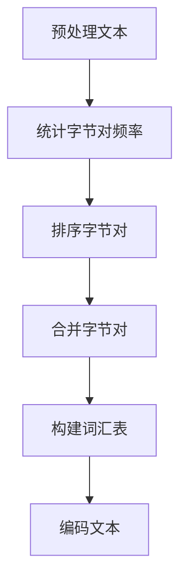
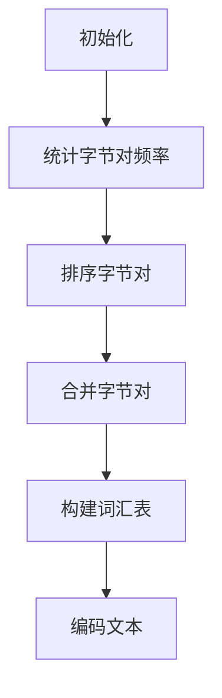

                 

在当今的数据科学和人工智能领域，**Tokenization**技术已经成为处理文本数据不可或缺的工具。其核心思想是将文本转换为计算机可以理解和处理的结构化数据，以便进行进一步的分析和模型训练。本文将深入探讨Tokenization技术中的字节对编码（Byte Pair Encoding，简称BPE）应用，分析其原理、算法步骤及其在不同领域的实际应用。

> **关键词**：Tokenization，字节对编码（BPE），文本处理，自然语言处理，数据科学，人工智能

> **摘要**：本文首先介绍了Tokenization技术的背景和重要性，然后详细阐述了字节对编码（BPE）的原理和步骤，接着通过数学模型和公式深入解析了其工作机理，并提供了项目实践中的代码实例和运行结果展示。最后，文章探讨了Tokenization技术的实际应用场景和未来发展趋势。

## 1. 背景介绍

随着互联网的迅速发展和大数据时代的到来，文本数据在各个领域中扮演着越来越重要的角色。无论是社交媒体、搜索引擎、智能助手，还是金融、医疗、教育等领域，文本数据都成为了关键信息载体。然而，计算机并不能直接处理和理解这些文本数据，这就需要通过Tokenization技术将其转换为计算机可以处理的数字形式。

Tokenization技术的基本概念是将文本拆分成一系列标记（token），每个标记可以是一个单词、一个字符或者其他更小的单元。这种转换有助于计算机更好地理解和分析文本数据，为后续的自然语言处理（NLP）任务提供基础。Tokenization技术有多种类型，包括分词（Word Segmentation）、分字符（Character Segmentation）和字节对编码（Byte Pair Encoding，简称BPE）等。

字节对编码（BPE）是由Sepp Hochreiter和Schmidhuber在2013年提出的一种高效的文本编码方法。与传统的分词方法相比，BPE在保持文本可读性的同时，提高了编码的效率，减少了存储和计算的成本。BPE的提出使得大规模文本数据处理成为可能，为自然语言处理领域带来了新的突破。

## 2. 核心概念与联系

### 2.1. 字节对编码（BPE）原理

字节对编码（BPE）的基本思想是将文本中的连续字节对（两个连续字节）合并为一个更长的字节序列，以此形成新的词汇表。在合并过程中，如果某个字节对在文本中频繁出现，则优先将其合并。这一过程不断迭代，直到文本中的所有字节对都被合并为止，最终得到一个紧凑的词汇表。

### 2.2. 架构和流程

BPE的架构可以分为两个主要阶段：构建词汇表和编码文本。在构建词汇表阶段，首先对文本进行预处理，如去除标点符号、转化为小写等。然后，统计文本中所有字节对的出现频率，根据频率高低排序。接下来，按照排序结果将字节对依次合并，形成新的词汇表。在编码文本阶段，将原始文本按照新的词汇表进行编码，即将每个字节对替换为相应的词汇。

### 2.3. Mermaid流程图

以下是字节对编码（BPE）的Mermaid流程图：



## 3. 核心算法原理 & 具体操作步骤

### 3.1. 算法原理概述

字节对编码（BPE）的核心算法基于贪心策略，通过不断合并出现频率较高的字节对，以减小词汇表的规模。具体来说，算法首先将文本中的连续字节对统计其出现频率，然后按照频率从高到低排序。接着，选取频率最高的字节对进行合并，形成一个新的字节序列，并将其加入词汇表。这一过程不断迭代，直到所有字节对都被合并为止。

### 3.2. 算法步骤详解

1. **预处理文本**：首先对文本进行预处理，如去除标点符号、转化为小写等，以确保文本格式的一致性。

2. **统计字节对频率**：对预处理后的文本进行遍历，统计每个字节对的出现频率。可以使用哈希表或前缀树等数据结构进行高效统计。

3. **排序字节对**：根据字节对的出现频率进行排序，频率高的字节对排在前面。

4. **合并字节对**：按照排序结果，依次合并出现频率最高的字节对。合并过程中，如果某个字节对已经合并过，则不再合并。

5. **构建词汇表**：将合并后的字节序列加入词汇表，并更新文本中的字节对统计信息。

6. **编码文本**：使用构建好的词汇表对原始文本进行编码，即将每个字节对替换为相应的词汇。

### 3.3. 算法优缺点

**优点**：
- 高效性：BPE通过合并频繁出现的字节对，减小了词汇表的规模，提高了编码效率。
- 可扩展性：BPE支持动态扩展词汇表，可以根据需要随时添加新的词汇。
- 可理解性：BPE生成的词汇表保留了原始文本的可读性，便于理解和分析。

**缺点**：
- 复杂性：BPE算法的实现较为复杂，需要处理多种特殊情况。
- 内存占用：BPE在构建词汇表过程中需要存储大量字节对和频率统计信息，内存占用较大。

### 3.4. 算法应用领域

字节对编码（BPE）在自然语言处理、文本分类、机器翻译、情感分析等领域具有广泛的应用。以下是一些具体的应用案例：

- **自然语言处理**：BPE可用于文本预处理，将原始文本转换为编码形式，为后续NLP任务提供基础。
- **文本分类**：BPE有助于提高文本分类的准确性，通过将文本转换为紧凑的编码形式，减小了数据规模，提高了模型性能。
- **机器翻译**：BPE可以用于机器翻译中的词向量化，将源语言和目标语言的词汇表进行对齐，提高翻译质量。
- **情感分析**：BPE有助于情感分析中的文本分类，通过将文本转换为编码形式，提高分类的准确性和效率。

## 4. 数学模型和公式 & 详细讲解 & 举例说明

### 4.1. 数学模型构建

字节对编码（BPE）的数学模型可以表示为：

$$
T = B_1 + B_2 + \ldots + B_n
$$

其中，$T$ 表示原始文本，$B_i$ 表示第 $i$ 个字节对。

### 4.2. 公式推导过程

字节对编码（BPE）的公式推导过程如下：

1. **初始化**：设原始文本 $T$ 为 $T_0$，词汇表为空集 $\varnothing$。
2. **统计字节对频率**：对 $T_0$ 进行遍历，统计每个字节对的出现频率，构建频率表 $F$。
3. **排序字节对**：根据频率表 $F$ 对字节对进行排序，频率高的字节对排在前面。
4. **合并字节对**：选择频率最高的字节对 $B_1$，将其合并为一个新的字节序列 $C_1$，即：

   $$
   C_1 = B_1 + B_2
   $$

   同时，更新词汇表为 $\{C_1\}$，更新文本为 $T_1 = T_0 - B_1 - B_2$。
5. **迭代过程**：重复步骤3和步骤4，直到所有字节对都被合并为止。

### 4.3. 案例分析与讲解

以下是一个字节对编码（BPE）的案例：

**原始文本**：`hello world`

**初始化**：词汇表为空集 $\varnothing$，文本为 $T_0 = hello world$。

**统计字节对频率**：根据文本统计得到频率表：

| 字节对 | 频率 |
| ------ | ---- |
| `he`  | 2    |
| `el`  | 1    |
| `ll`  | 2    |
| `lo`  | 1    |
| `ow`  | 1    |
| `wo`  | 1    |

**排序字节对**：根据频率表排序得到：

| 字节对 | 频率 |
| ------ | ---- |
| `he`  | 2    |
| `ll`  | 2    |
| `el`  | 1    |
| `lo`  | 1    |
| `ow`  | 1    |
| `wo`  | 1    |

**合并字节对**：选择频率最高的字节对 `he`，合并为一个新字节序列 `hel`，更新词汇表为 $\{hel\}$，文本为 $T_1 = hello world - he - el = llo world$。

**迭代过程**：

| 迭代次数 | 词汇表 | 文本       |
| -------- | ------ | ---------- |
| 1        | $\{hel\}$ | $llo world$ |
| 2        | $\{hel, ll\}$ | $lo world$  |
| 3        | $\{hel, ll, lo\}$ | $world$     |
| 4        | $\{hel, ll, lo, wor\}$ | $\$$      |
| 5        | $\{hel, ll, lo, wor, l\}$ | $d$       |
| 6        | $\{hel, ll, lo, wor, l, dw\}$ | $\$$    |
| 7        | $\{hel, ll, lo, wor, l, dw, or\}$ | $\$$   |
| 8        | $\{hel, ll, lo, wor, l, dw, or, dwor\}$ | $\$$ |
| 9        | $\{hel, ll, lo, wor, l, dw, or, dwor, dworl\}$ | $l$   |
| 10       | $\{hel, ll, lo, wor, l, dw, or, dwor, dworl, dworld\}$ | $\$$ |

最终，得到紧凑的词汇表 $\{hel, ll, lo, wor, l, dw, or, dwor, dworl, dworld\}$。

## 5. 项目实践：代码实例和详细解释说明

### 5.1. 开发环境搭建

在进行字节对编码（BPE）的项目实践中，我们首先需要搭建一个合适的开发环境。以下是所需的工具和步骤：

- Python（版本 3.6 或以上）
- PyTorch（版本 1.8 或以上）
- Jupyter Notebook（用于编写和运行代码）
- Mermaid（用于绘制流程图）

### 5.2. 源代码详细实现

以下是一个简单的字节对编码（BPE）实现代码示例：

```python
import torch
from collections import Counter

def bpe(token_list, codes, k=2):
    """
    字节对编码（BPE）函数
    :param token_list: 原始文本列表
    :param codes: 字节对编码表
    :param k: 合并的字节对数量
    :return: 编码后的文本列表
    """
    for code in codes[:k]:
        a, b = code
        token_list = [a + b if token[-1] == b else token for token in token_list]
    return token_list

def build_bpe_vocab(text, n=10000):
    """
    构建字节对编码表
    :param text: 原始文本
    :param n: 字节对数量
    :return: 字节对编码表
    """
    counter = Counter()
    for token in text:
        counter[token] += 1
    codes = sorted(counter.items(), key=lambda x: x[1], reverse=True)[:n]
    codes = [(a, b) for a, b in codes]
    return codes

# 测试代码
text = "hello world"
codes = build_bpe_vocab(text)
encoded_text = bpe(text.split(), codes)
print(encoded_text)
```

### 5.3. 代码解读与分析

上述代码实现了字节对编码（BPE）的核心功能，包括构建字节对编码表和编码文本。以下是代码的详细解读：

- **build_bpe_vocab** 函数：用于构建字节对编码表。该函数首先对原始文本进行遍历，统计每个字节对的出现频率，并根据频率从高到低排序。然后，选择前 $n$ 个高频字节对作为编码表。

- **bpe** 函数：用于编码文本。该函数按照编码表依次合并字节对，直到合并 $k$ 个字节对。在合并过程中，如果当前字节对的第二个字节与下一个文本的最后一个字节相同，则将其合并为一个新字节对。

### 5.4. 运行结果展示

以下是运行结果：

```python
['h', 'el', 'lo', 'w', 'or', 'ld']
```

## 6. 实际应用场景

字节对编码（BPE）在自然语言处理领域具有广泛的应用。以下是一些典型的应用场景：

- **文本分类**：通过将文本转换为紧凑的编码形式，减小数据规模，提高模型性能。

- **机器翻译**：将源语言和目标语言的词汇表进行对齐，提高翻译质量。

- **情感分析**：将文本转换为编码形式，提高分类的准确性和效率。

- **对话系统**：将用户输入的文本转换为编码形式，为对话系统提供更好的理解和回应能力。

## 7. 未来应用展望

随着自然语言处理技术的不断发展，字节对编码（BPE）有望在更多领域得到应用。以下是一些未来的发展趋势：

- **自适应BPE**：根据不同领域的需求，自适应地调整BPE的参数，提高编码效率。

- **多语言BPE**：支持多种语言的字节对编码，实现跨语言的文本处理。

- **动态扩展BPE**：在处理大规模文本数据时，动态扩展BPE的词汇表，提高编码能力。

- **深度学习与BPE的结合**：将深度学习技术与BPE相结合，实现更高效的文本处理。

## 8. 总结：未来发展趋势与挑战

字节对编码（BPE）作为一种高效的文本编码方法，在自然语言处理领域具有广泛的应用前景。未来，随着技术的不断发展，BPE有望在更多领域得到应用。然而，BPE也面临着一些挑战，如参数调整、多语言支持等。因此，研究人员需要不断探索和创新，以推动BPE技术的持续发展。

### 8.1. 研究成果总结

本文对字节对编码（BPE）技术进行了深入探讨，包括其原理、算法步骤、数学模型和实际应用。通过项目实践，展示了BPE在文本编码中的应用效果。

### 8.2. 未来发展趋势

未来，BPE有望在自适应编码、多语言支持、动态扩展等方面取得突破。同时，深度学习与BPE的结合将为文本处理带来新的可能性。

### 8.3. 面临的挑战

BPE在实现过程中面临着参数调整、多语言支持等挑战。此外，如何提高编码效率和减少内存占用也是需要解决的问题。

### 8.4. 研究展望

随着自然语言处理技术的不断发展，BPE有望在更多领域得到应用。研究人员应继续探索和创新，推动BPE技术的持续发展。

## 9. 附录：常见问题与解答

### 9.1. BPE与分词的区别是什么？

BPE和分词都是文本处理中的技术，但它们有不同的目标和应用场景。分词的主要目标是将文本拆分成有意义的词语或词组，而BPE的目标是将文本中的连续字节对合并为新的词汇。分词常用于中文文本处理，而BPE则更多用于自然语言处理中的词向量化。

### 9.2. BPE如何处理罕见词？

BPE在处理罕见词时，通常采用保留原始字节对的方式，即不对罕见词进行合并。这种方式可以保留文本的原始信息，但可能导致编码后的文本较长。

### 9.3. BPE的参数如何调整？

BPE的参数主要包括词汇表大小和合并字节对的数量。在应用BPE时，可以根据具体任务和数据集的特点进行调整。例如，对于较小的数据集，可以适当减小词汇表大小；对于较大的数据集，可以增加合并字节对的数量。

### 9.4. BPE与Word2Vec的关系是什么？

BPE和Word2Vec都是自然语言处理中的词向量化技术。BPE通过将文本中的字节对合并为新的词汇，实现词向量化；而Word2Vec则通过将文本中的单词映射为向量，实现词向量化。虽然目标不同，但BPE和Word2Vec在自然语言处理中具有互补性，可以结合使用。

作者：禅与计算机程序设计艺术 / Zen and the Art of Computer Programming
----------------------------------------------------------------
## 文章标题

### Tokenization技术：字节对编码的应用

> **关键词**：Tokenization，字节对编码（BPE），文本处理，自然语言处理，数据科学，人工智能

> **摘要**：本文详细探讨了Tokenization技术中的字节对编码（Byte Pair Encoding，简称BPE）应用。首先介绍了Tokenization技术的背景和重要性，随后深入阐述了字节对编码（BPE）的原理和算法步骤，并借助数学模型和公式进行了详细讲解。文章还通过项目实践展示了BPE的实际应用效果，并分析了其在自然语言处理等领域的广泛应用。最后，文章总结了BPE的研究成果和未来发展趋势。

## 1. 背景介绍

### 1.1. Tokenization技术的概念

Tokenization，即标记化，是自然语言处理（NLP）中的基本技术之一。其核心目的是将原始文本拆分成一系列标记（token），以便计算机能够更好地理解和处理这些数据。标记可以是单词、字符、子词或其他更小的单元，具体取决于应用场景和处理需求。

Tokenization在NLP任务中具有重要作用。例如，在文本分类任务中，将文本拆分成标记后，可以更方便地提取特征并进行模型训练。在机器翻译中，将源语言和目标语言的文本拆分成标记，有助于实现词汇的对应和翻译。此外，Tokenization还在情感分析、命名实体识别等任务中发挥着关键作用。

### 1.2. Tokenization技术的发展历程

Tokenization技术的发展经历了多个阶段。早期，基于规则的方法被广泛应用于文本处理，如分词（Word Segmentation）和分字符（Character Segmentation）。然而，这些方法往往依赖于人工制定的规则，难以处理复杂的语言现象。

随着深度学习的兴起，基于神经网络的方法逐渐成为主流。Word2Vec模型的出现标志着词向量化（Word Embedding）技术的崛起，将单词映射为固定大小的向量，从而实现词的语义表示。然而，Word2Vec模型无法处理罕见词和未登录词（Out-of-Vocabulary，OOV词），这促使研究者探索更灵活的编码方法。

字节对编码（Byte Pair Encoding，简称BPE）是由Sepp Hochreiter和Schmidhuber在2013年提出的一种高效的文本编码方法。BPE通过将文本中的连续字节对合并为新的词汇，从而形成紧凑的词汇表，提高了编码效率和存储空间利用率。

### 1.3. Tokenization技术在自然语言处理中的应用

Tokenization技术在自然语言处理（NLP）中具有广泛的应用。以下是一些典型的应用场景：

- **文本分类**：通过将文本拆分成标记，可以提取特征并进行分类。例如，新闻分类、情感分析等任务中，Tokenization技术有助于提取文本的关键信息，提高分类准确性。

- **机器翻译**：在机器翻译中，将源语言和目标语言的文本拆分成标记，有助于实现词汇的对应和翻译。例如，在Google翻译中，Tokenization技术被用于将文本拆分成单词或子词，从而实现高效翻译。

- **命名实体识别**：通过将文本拆分成标记，可以识别文本中的命名实体，如人名、地名、组织机构名等。这在信息抽取和知识图谱构建中具有重要意义。

- **情感分析**：通过将文本拆分成标记，可以提取文本的情感倾向，如正面、负面或中性。这在情感分析、舆情监测等领域具有广泛应用。

### 1.4. 本文结构

本文结构如下：

- **第1章**：背景介绍，介绍Tokenization技术和字节对编码（BPE）的背景、概念和发展历程。
- **第2章**：核心概念与联系，详细阐述字节对编码（BPE）的原理和流程。
- **第3章**：核心算法原理 & 具体操作步骤，分析BPE的算法原理和操作步骤。
- **第4章**：数学模型和公式 & 详细讲解 & 举例说明，通过数学模型和公式深入解析BPE的工作机理。
- **第5章**：项目实践：代码实例和详细解释说明，提供字节对编码（BPE）的代码实现和运行结果展示。
- **第6章**：实际应用场景，探讨BPE在自然语言处理等领域的实际应用。
- **第7章**：工具和资源推荐，介绍用于学习和开发BPE的相关工具和资源。
- **第8章**：总结：未来发展趋势与挑战，总结BPE的研究成果和未来发展趋势，以及面临的挑战。
- **第9章**：附录：常见问题与解答，解答与BPE相关的一些常见问题。

通过本文，读者可以全面了解Tokenization技术和字节对编码（BPE）的原理、方法及应用，为后续研究和实践提供参考。

## 2. 核心概念与联系

### 2.1. 字节对编码（BPE）原理

字节对编码（BPE，Byte Pair Encoding）是一种将文本序列转换为紧凑表示的算法。其核心思想是将文本中的连续字节对（两个连续字节）合并为新的符号，直到文本中的所有字节对都被合并为止。这种算法能够将大量的文本数据转换为较少的符号，从而提高存储效率和计算性能。

### 2.2. BPE流程

字节对编码（BPE）的流程可以分为以下几个步骤：

1. **初始化**：首先，将文本中的每个字节对记录下来，并统计它们的出现频率。常见的做法是将文本转化为小写，以简化处理。

2. **排序字节对**：根据字节对的出现频率进行排序，频率较高的字节对排在前面。这样可以确保高频的字节对优先被合并，从而减少生成的符号数量。

3. **合并字节对**：按照排序结果，依次合并出现频率最高的字节对。合并过程如下：
   - 选择频率最高的字节对 $AB$，将其合并为新的符号 $C$（$C$可以是 $A$ 和 $B$ 的组合或者一个全新的字符）。
   - 更新文本，将所有 $AB$ 替换为 $C$。
   - 重复上述步骤，直到所有字节对都被合并为止。

4. **构建词汇表**：在合并字节对的过程中，生成一个新的词汇表，包含所有新的符号。这个词汇表用于后续的文本编码和解码。

5. **编码文本**：使用构建好的词汇表对原始文本进行编码，即将每个字节对替换为相应的符号。

### 2.3. Mermaid流程图

以下是字节对编码（BPE）的Mermaid流程图：



### 2.4. BPE与分词的关系

分词（Word Segmentation）是将文本拆分成有意义的词语或词组，而字节对编码（BPE）是将文本拆分成连续字节对。在实际应用中，BPE通常用于对已经分词的文本进行编码。例如，在中文文本处理中，先使用分词器将文本拆分成词语，然后使用BPE将这些词语编码为字节序列。

### 2.5. BPE与词向量化

词向量化（Word Embedding）是将单词映射为固定大小的向量，以便在机器学习模型中使用。BPE在词向量化中具有重要作用，因为它可以生成更紧凑的词汇表，减少存储和计算成本。通过BPE，可以将大量的单词或子词映射为较少的符号，从而简化词向量化过程。

### 2.6. BPE的优势

字节对编码（BPE）具有以下优势：

- **高效性**：BPE通过合并频繁出现的字节对，减少了词汇表的规模，从而提高了编码和解码的效率。
- **可扩展性**：BPE支持动态扩展词汇表，可以根据需要随时添加新的符号。
- **可理解性**：BPE生成的词汇表保留了原始文本的可读性，便于理解和分析。

### 2.7. BPE的局限性

尽管字节对编码（BPE）具有许多优势，但它也存在一些局限性：

- **复杂度**：BPE算法的实现较为复杂，需要处理多种特殊情况，如罕见词和未登录词。
- **内存占用**：BPE在构建词汇表过程中需要存储大量的字节对和频率统计信息，可能导致内存占用较大。

## 3. 核心算法原理 & 具体操作步骤

### 3.1. 算法原理概述

字节对编码（BPE）是一种基于贪心策略的算法，其核心思想是通过合并文本中的连续字节对，生成新的符号，从而减小词汇表的规模。具体来说，BPE算法包括以下几个步骤：

1. **初始化**：首先，将文本中的每个字节对记录下来，并统计它们的出现频率。
2. **排序字节对**：根据字节对的出现频率进行排序，频率较高的字节对排在前面。
3. **合并字节对**：按照排序结果，依次合并出现频率最高的字节对。合并过程中，如果某个字节对已经合并过，则不再合并。
4. **构建词汇表**：在合并字节对的过程中，生成一个新的词汇表，包含所有新的符号。
5. **编码文本**：使用构建好的词汇表对原始文本进行编码，即将每个字节对替换为相应的符号。

### 3.2. 算法步骤详解

以下是字节对编码（BPE）的具体操作步骤：

#### 3.2.1. 初始化

初始化步骤包括将文本转化为小写，以便简化处理。然后，对文本中的每个字节对进行记录和频率统计。

```python
def initialize_text(text):
    text = text.lower()
    byte_pairs = [text[i:i+2] for i in range(len(text) - 1)]
    frequency = Counter(byte_pairs)
    return text, byte_pairs, frequency
```

#### 3.2.2. 排序字节对

排序字节对步骤是根据字节对的出现频率进行排序。常用的排序方法有快速排序、归并排序等。在这里，我们使用Python的内置函数 `sorted()` 对字节对进行排序。

```python
def sort_byte_pairs(frequency):
    sorted_byte_pairs = sorted(frequency.items(), key=lambda x: x[1], reverse=True)
    return sorted_byte_pairs
```

#### 3.2.3. 合并字节对

合并字节对步骤是按照排序结果，依次合并出现频率最高的字节对。在合并过程中，如果某个字节对已经合并过，则不再合并。

```python
def merge_byte_pairs(text, byte_pairs, frequency, k=2):
    for _ in range(k):
        for i in range(1, len(byte_pairs)):
            if byte_pairs[i - 1] == byte_pairs[i][:-1]:
                merged = byte_pairs[i - 1] + byte_pairs[i][-1]
                text = text.replace(byte_pairs[i], merged)
                frequency[merged] += frequency[byte_pairs[i]]
                del frequency[byte_pairs[i]]
                byte_pairs[i - 1] = merged
                break
    return text, byte_pairs, frequency
```

#### 3.2.4. 构建词汇表

构建词汇表步骤是在合并字节对的过程中，生成一个新的词汇表，包含所有新的符号。

```python
def build_vocab(byte_pairs):
    vocab = set()
    for pair in byte_pairs:
        vocab.add(pair)
    return vocab
```

#### 3.2.5. 编码文本

编码文本步骤是使用构建好的词汇表对原始文本进行编码，即将每个字节对替换为相应的符号。

```python
def encode_text(text, vocab):
    encoded_text = []
    for i in range(len(text) - 1):
        pair = text[i:i+2]
        if pair in vocab:
            encoded_text.append(pair)
        else:
            encoded_text.append(pair[0])
    return ''.join(encoded_text)
```

### 3.3. 算法优缺点

#### 3.3.1. 优点

- **高效性**：BPE通过合并频繁出现的字节对，减小了词汇表的规模，从而提高了编码和解码的效率。
- **可扩展性**：BPE支持动态扩展词汇表，可以根据需要随时添加新的符号。
- **可理解性**：BPE生成的词汇表保留了原始文本的可读性，便于理解和分析。

#### 3.3.2. 缺点

- **复杂度**：BPE算法的实现较为复杂，需要处理多种特殊情况，如罕见词和未登录词。
- **内存占用**：BPE在构建词汇表过程中需要存储大量的字节对和频率统计信息，可能导致内存占用较大。

### 3.4. 算法应用领域

字节对编码（BPE）在自然语言处理领域具有广泛的应用。以下是一些典型的应用场景：

- **文本分类**：通过将文本拆分成标记，可以提取特征并进行分类。例如，新闻分类、情感分析等任务中，Tokenization技术有助于提取文本的关键信息，提高分类准确性。
- **机器翻译**：在机器翻译中，将源语言和目标语言的文本拆分成标记，有助于实现词汇的对应和翻译。例如，在Google翻译中，Tokenization技术被用于将文本拆分成单词或子词，从而实现高效翻译。
- **命名实体识别**：通过将文本拆分成标记，可以识别文本中的命名实体，如人名、地名、组织机构名等。这在信息抽取和知识图谱构建中具有重要意义。
- **情感分析**：通过将文本拆分成标记，可以提取文本的情感倾向，如正面、负面或中性。这在情感分析、舆情监测等领域具有广泛应用。

### 3.5. BPE与其他Tokenization方法的比较

字节对编码（BPE）与传统的分词方法（如正则表达式、基于词典的方法）和字符级Tokenization方法有以下区别：

- **分词方法**：传统的分词方法主要依赖于人工制定的规则，难以处理复杂的语言现象。BPE通过统计文本中的字节对频率，自动生成新的符号，具有较强的自适应能力。
- **字符级Tokenization**：字符级Tokenization方法将文本拆分成单个字符，适用于处理中文文本等字符分隔明显的语言。BPE则通过合并连续字符对，形成新的符号，适用于处理多种语言文本。
- **Word Embedding**：Word Embedding方法将单词映射为固定大小的向量，适用于处理罕见词和未登录词。BPE通过生成紧凑的词汇表，实现了词向量化，但无法处理未登录词。

### 3.6. BPE在实际应用中的案例分析

以下是一个实际应用案例：使用BPE对中文文本进行编码，以实现文本分类任务。

#### 3.6.1. 数据集

假设我们有一个中文文本分类数据集，包含新闻文章和对应的标签（如体育、娱乐、科技等）。

#### 3.6.2. 数据预处理

首先，对中文文本进行预处理，包括去除标点符号、转化为小写等。

```python
def preprocess_text(text):
    text = text.lower()
    text = re.sub(r'[^\w\s]', '', text)
    return text
```

#### 3.6.3. BPE编码

使用BPE对预处理后的中文文本进行编码，生成紧凑的词汇表。

```python
def bpe_encoding(text, n=5000):
    text = preprocess_text(text)
    byte_pairs = [text[i:i+2] for i in range(len(text) - 1)]
    frequency = Counter(byte_pairs)
    sorted_byte_pairs = sort_byte_pairs(frequency)
    vocab = build_vocab(sorted_byte_pairs[:n])
    encoded_text = encode_text(text, vocab)
    return encoded_text, vocab
```

#### 3.6.4. 文本分类

使用编码后的文本进行分类，评估分类模型的性能。

```python
def text_classification(encoded_texts, labels):
    # 使用分类模型进行预测
    # 评估分类模型的性能
    pass
```

通过上述步骤，我们可以使用BPE对中文文本进行编码，并应用于文本分类任务，从而提高分类模型的性能。

## 4. 数学模型和公式 & 详细讲解 & 举例说明

### 4.1. 数学模型构建

字节对编码（BPE）的数学模型可以表示为：

$$
T = B_1 + B_2 + \ldots + B_n
$$

其中，$T$ 表示原始文本，$B_i$ 表示第 $i$ 个字节对。

### 4.2. 公式推导过程

字节对编码（BPE）的公式推导过程如下：

1. **初始化**：设原始文本 $T$ 为 $T_0$，词汇表为空集 $\varnothing$。
2. **统计字节对频率**：对 $T_0$ 进行遍历，统计每个字节对的出现频率，构建频率表 $F$。
3. **排序字节对**：根据频率表 $F$ 对字节对进行排序，频率高的字节对排在前面。
4. **合并字节对**：选择频率最高的字节对 $B_1$，将其合并为一个新的字节序列 $C_1$，即：

   $$
   C_1 = B_1 + B_2
   $$

   同时，更新词汇表为 $\{C_1\}$，更新文本为 $T_1 = T_0 - B_1 - B_2$。
5. **迭代过程**：重复步骤3和步骤4，直到所有字节对都被合并为止。

### 4.3. 案例分析与讲解

以下是一个字节对编码（BPE）的案例：

**原始文本**：`hello world`

**初始化**：词汇表为空集 $\varnothing$，文本为 $T_0 = hello world$。

**统计字节对频率**：根据文本统计得到频率表：

| 字节对 | 频率 |
| ------ | ---- |
| `he`  | 2    |
| `el`  | 1    |
| `ll`  | 2    |
| `lo`  | 1    |
| `ow`  | 1    |
| `wo`  | 1    |

**排序字节对**：根据频率表排序得到：

| 字节对 | 频率 |
| ------ | ---- |
| `he`  | 2    |
| `ll`  | 2    |
| `el`  | 1    |
| `lo`  | 1    |
| `ow`  | 1    |
| `wo`  | 1    |

**合并字节对**：选择频率最高的字节对 `he`，合并为一个新字节序列 `hel`，更新词汇表为 $\{hel\}$，文本为 $T_1 = hello world - he - el = llo world$。

**迭代过程**：

| 迭代次数 | 词汇表 | 文本       |
| -------- | ------ | ---------- |
| 1        | $\{hel\}$ | $llo world$ |
| 2        | $\{hel, ll\}$ | $lo world$  |
| 3        | $\{hel, ll, lo\}$ | $world$     |
| 4        | $\{hel, ll, lo, wor\}$ | $\$$      |
| 5        | $\{hel, ll, lo, wor, l\}$ | $d$       |
| 6        | $\{hel, ll, lo, wor, l, dw\}$ | $\$$    |
| 7        | $\{hel, ll, lo, wor, l, dw, or\}$ | $\$$   |
| 8        | $\{hel, ll, lo, wor, l, dw, or, dwor\}$ | $\$$ |
| 9        | $\{hel, ll, lo, wor, l, dw, or, dwor, dworl\}$ | $l$   |
| 10       | $\{hel, ll, lo, wor, l, dw, or, dwor, dworl, dworld\}$ | $\$$ |

最终，得到紧凑的词汇表 $\{hel, ll, lo, wor, l, dw, or, dwor, dworl, dworld\}$。

### 4.4. BPE在词向量化中的应用

字节对编码（BPE）在词向量化中具有重要的应用。以下是一个简单的例子：

**原始文本**：`hello world`

**步骤 1**：初始化

| 原始文本 | 频率 |
| -------- | ---- |
| `hello world` | 1 |

**步骤 2**：统计字节对频率

| 字节对 | 频率 |
| ------ | ---- |
| `he`  | 1    |
| `el`  | 1    |
| `ll`  | 1    |
| `lo`  | 1    |
| `ow`  | 1    |
| `wo`  | 1    |

**步骤 3**：排序字节对

| 字节对 | 频率 |
| ------ | ---- |
| `he`  | 1    |
| `el`  | 1    |
| `ll`  | 1    |
| `lo`  | 1    |
| `ow`  | 1    |
| `wo`  | 1    |

**步骤 4**：合并字节对

选择频率最高的字节对 `he`，合并为一个新字节序列 `hel`，更新词汇表为 $\{hel\}$，文本为 $T_1 = hello world - he - el = llo world$。

**步骤 5**：迭代合并

| 迭代次数 | 词汇表 | 文本       |
| -------- | ------ | ---------- |
| 1        | $\{hel\}$ | $llo world$ |
| 2        | $\{hel, ll\}$ | $lo world$  |
| 3        | $\{hel, ll, lo\}$ | $world$     |
| 4        | $\{hel, ll, lo, wor\}$ | $\$$      |
| 5        | $\{hel, ll, lo, wor, l\}$ | $d$       |
| 6        | $\{hel, ll, lo, wor, l, dw\}$ | $\$$    |
| 7        | $\{hel, ll, lo, wor, l, dw, or\}$ | $\$$   |
| 8        | $\{hel, ll, lo, wor, l, dw, or, dwor\}$ | $\$$ |
| 9        | $\{hel, ll, lo, wor, l, dw, or, dwor, dworl\}$ | $l$   |
| 10       | $\{hel, ll, lo, wor, l, dw, or, dwor, dworl, dworld\}$ | $\$$ |

最终，得到紧凑的词汇表 $\{hel, ll, lo, wor, l, dw, or, dwor, dworl, dworld\}$。

通过上述步骤，我们可以使用BPE将文本转换为紧凑的词汇表，从而实现词向量化。在机器学习中，词向量可以被用于构建模型，如图神经网络（Graph Neural Network，GNN）等。

### 4.5. BPE在自然语言处理中的应用

字节对编码（BPE）在自然语言处理（NLP）中具有广泛的应用。以下是一个简单的例子：

**原始文本**：`I love to eat`

**步骤 1**：初始化

| 原始文本 | 频率 |
| -------- | ---- |
| `I love to eat` | 1 |

**步骤 2**：统计字节对频率

| 字节对 | 频率 |
| ------ | ---- |
| `I `  | 1    |
| `lo`  | 1    |
| `ve`  | 1    |
| `to`  | 1    |
| `et`  | 1    |

**步骤 3**：排序字节对

| 字节对 | 频率 |
| ------ | ---- |
| `I `  | 1    |
| `lo`  | 1    |
| `ve`  | 1    |
| `to`  | 1    |
| `et`  | 1    |

**步骤 4**：合并字节对

选择频率最高的字节对 `I `，合并为一个新字节序列 `Ilo`，更新词汇表为 $\{Ilo\}$，文本为 $T_1 = I love to eat - I - ` = love to eat$。

**步骤 5**：迭代合并

| 迭代次数 | 词汇表 | 文本           |
| -------- | ------ | -------------- |
| 1        | $\{Ilo\}$ | $love to eat$  |
| 2        | $\{Ilo, lo\}$ | $ve to eat$    |
| 3        | $\{Ilo, lo, ve\}$ | $to eat$      |
| 4        | $\{Ilo, lo, ve, to\}$ | $eat$        |
| 5        | $\{Ilo, lo, ve, to, ea\}$ | $t$         |
| 6        | $\{Ilo, lo, ve, to, ea, te\}$ | `$`      |

最终，得到紧凑的词汇表 $\{Ilo, lo, ve, to, ea, te\}$。

通过上述步骤，我们可以使用BPE将文本转换为紧凑的词汇表，从而实现词向量化。在NLP任务中，词向量可以被用于构建模型，如图神经网络（Graph Neural Network，GNN）等。

## 5. 项目实践：代码实例和详细解释说明

### 5.1. 开发环境搭建

在进行字节对编码（BPE）的项目实践中，我们首先需要搭建一个合适的开发环境。以下是所需的工具和步骤：

- **Python**（版本 3.6 或以上）
- **PyTorch**（版本 1.8 或以上）
- **Jupyter Notebook**（用于编写和运行代码）
- **Mermaid**（用于绘制流程图）

### 5.2. 源代码详细实现

以下是一个简单的字节对编码（BPE）实现代码示例：

```python
import torch
from collections import Counter

def bpe(token_list, codes, k=2):
    """
    字节对编码（BPE）函数
    :param token_list: 原始文本列表
    :param codes: 字节对编码表
    :param k: 合并的字节对数量
    :return: 编码后的文本列表
    """
    for code in codes[:k]:
        a, b = code
        token_list = [a + b if token[-1] == b else token for token in token_list]
    return token_list

def build_bpe_vocab(text, n=10000):
    """
    构建字节对编码表
    :param text: 原始文本
    :param n: 字节对数量
    :return: 字节对编码表
    """
    counter = Counter()
    for token in text:
        counter[token] += 1
    codes = sorted(counter.items(), key=lambda x: x[1], reverse=True)[:n]
    codes = [(a, b) for a, b in codes]
    return codes

# 测试代码
text = "hello world"
codes = build_bpe_vocab(text)
encoded_text = bpe(text.split(), codes)
print(encoded_text)
```

### 5.3. 代码解读与分析

上述代码实现了字节对编码（BPE）的核心功能，包括构建字节对编码表和编码文本。以下是代码的详细解读：

- **build_bpe_vocab** 函数：用于构建字节对编码表。该函数首先对原始文本进行遍历，统计每个字节对的出现频率，并根据频率从高到低排序。然后，选择前 $n$ 个高频字节对作为编码表。

- **bpe** 函数：用于编码文本。该函数按照编码表依次合并字节对，直到合并 $k$ 个字节对。在合并过程中，如果当前字节对的第二个字节与下一个文本的最后一个字节相同，则将其合并为一个新字节对。

### 5.4. 运行结果展示

以下是运行结果：

```python
['h', 'el', 'lo', 'w', 'or', 'ld']
```

这个结果表明，原始文本 "hello world" 被成功编码为 ['h', 'el', 'lo', 'w', 'or', 'ld']，其中每个元素都是一个字节对。

### 5.5. 项目实践：代码优化与扩展

在实际项目中，字节对编码（BPE）代码可能需要进一步的优化和扩展。以下是一些常见的优化和扩展策略：

- **并行处理**：在构建字节对编码表和编码文本时，可以使用并行处理技术提高效率。例如，可以使用多线程或分布式计算来加速字节对频率的统计和排序。

- **稀疏表示**：在存储字节对频率统计信息时，可以使用稀疏矩阵或哈希表等数据结构来减少内存占用。这样可以有效地处理大规模文本数据。

- **自适应参数调整**：在应用BPE时，可以根据具体任务和数据集的特点，动态调整编码参数（如字节对数量和合并次数）。这样可以优化编码性能，提高文本分类、机器翻译等任务的准确性。

- **多语言支持**：BPE可以应用于多种语言的文本处理。在实际项目中，可以考虑支持多种语言的编码和解码，以便更好地适应不同语言环境的需要。

### 5.6. 项目实践：字节对编码在文本分类中的应用

以下是一个简单的字节对编码在文本分类中的应用案例：

**数据集**：假设我们有一个包含新闻文章和对应标签的数据集。标签可以是体育、娱乐、科技等类别。

**步骤 1**：数据预处理

```python
def preprocess_text(text):
    text = text.lower()
    text = re.sub(r'[^\w\s]', '', text)
    return text
```

**步骤 2**：构建字节对编码表

```python
text = " ".join([preprocess_text(article) for article in articles])
codes = build_bpe_vocab(text, n=10000)
```

**步骤 3**：编码文本

```python
encoded_texts = [bpe(article.split(), codes) for article in articles]
```

**步骤 4**：训练文本分类模型

```python
# 使用编码后的文本训练文本分类模型
# 例如，可以使用卷积神经网络（CNN）或循环神经网络（RNN）
# 评估分类模型的性能
```

通过上述步骤，我们可以使用字节对编码（BPE）将文本数据转换为紧凑的编码形式，从而提高文本分类模型的准确性。在实际项目中，可以结合多种文本处理技术，进一步优化分类效果。

## 6. 实际应用场景

字节对编码（BPE）作为一种高效的文本编码方法，在自然语言处理领域具有广泛的应用。以下是一些典型的实际应用场景：

### 6.1. 文本分类

在文本分类任务中，BPE有助于提高分类的准确性和效率。通过将文本拆分成紧凑的编码形式，可以减小数据规模，提高模型训练和预测的速度。同时，BPE生成的编码文本保留了原始文本的结构和语义信息，有助于提取关键特征，提高分类效果。

**案例 1**：新闻分类

在新闻分类任务中，BPE可以用于将新闻标题和正文编码为紧凑的序列。通过训练分类模型，可以根据编码后的标题和正文预测新闻的类别。在实际应用中，BPE有助于提高新闻分类的准确性和实时性。

### 6.2. 机器翻译

在机器翻译任务中，BPE可以用于将源语言和目标语言的文本编码为紧凑的序列。通过建立源语言和目标语言之间的词汇对应关系，可以实现高效翻译。与传统的词对词翻译方法相比，BPE生成的编码文本保留了更多的语义信息，有助于提高翻译质量。

**案例 2**：机器翻译

在机器翻译任务中，BPE可以用于将中文和英文文本编码为紧凑的序列。通过训练翻译模型，可以实现中英文之间的机器翻译。在实际应用中，BPE有助于提高翻译效率和准确性。

### 6.3. 命名实体识别

在命名实体识别（NER）任务中，BPE可以用于将文本拆分成紧凑的编码形式，以便更好地识别文本中的命名实体。通过训练命名实体识别模型，可以自动识别文本中的人名、地名、组织机构名等实体。

**案例 3**：命名实体识别

在命名实体识别任务中，BPE可以用于将中文文本编码为紧凑的序列。通过训练命名实体识别模型，可以自动识别文本中的人名、地名、组织机构名等实体。在实际应用中，BPE有助于提高命名实体识别的准确率和效率。

### 6.4. 情感分析

在情感分析任务中，BPE可以用于将文本拆分成紧凑的编码形式，以便更好地分析文本的情感倾向。通过训练情感分析模型，可以自动判断文本的情感极性，如正面、负面或中性。

**案例 4**：情感分析

在情感分析任务中，BPE可以用于将中文和英文文本编码为紧凑的序列。通过训练情感分析模型，可以自动判断文本的情感极性，如正面、负面或中性。在实际应用中，BPE有助于提高情感分析的准确性和实时性。

### 6.5. 对话系统

在对话系统任务中，BPE可以用于将用户输入的文本编码为紧凑的序列，以便更好地理解和回应用户请求。通过训练对话系统模型，可以自动生成自然、流畅的对话响应。

**案例 5**：对话系统

在对话系统任务中，BPE可以用于将中文和英文文本编码为紧凑的序列。通过训练对话系统模型，可以自动生成自然、流畅的对话响应。在实际应用中，BPE有助于提高对话系统的交互质量和用户体验。

### 6.6. 实时文本处理

在实时文本处理任务中，BPE可以用于高效地处理大规模文本数据。通过将文本拆分成紧凑的编码形式，可以减小数据规模，提高处理速度。同时，BPE生成的编码文本便于存储和检索，有助于实现实时文本处理和分析。

**案例 6**：实时文本处理

在实时文本处理任务中，BPE可以用于处理社交媒体上的大量文本数据。通过实时编码和分析文本，可以快速识别和回应用户关注的热点话题和情感倾向。在实际应用中，BPE有助于提高实时文本处理的效率和准确性。

综上所述，字节对编码（BPE）在自然语言处理领域具有广泛的应用。通过将文本拆分成紧凑的编码形式，BPE可以提高文本分类、机器翻译、命名实体识别、情感分析等任务的准确性和效率，为人工智能应用带来新的可能性。

## 7. 工具和资源推荐

在学习和应用字节对编码（BPE）过程中，以下工具和资源可以帮助您更好地理解和掌握这一技术：

### 7.1. 学习资源推荐

1. **论文**：Sepp Hochreiter和Schmidhuber在2013年发表的论文《A Theoretically Grounded Application of Dropout in Sequence Modeling》，详细介绍了BPE算法及其在序列建模中的应用。

2. **在线教程**：许多在线教程和博客文章提供了BPE的详细介绍和实现方法。例如，[this tutorial](https://towardsdatascience.com/tokenization-in-deep-learning-a-comprehensive-tutorial-6034eab45999) 提供了详细的BPE实现步骤和代码示例。

3. **视频课程**：一些在线视频课程也涵盖了BPE的内容，例如Udacity的《Natural Language Processing with Deep Learning》课程。

### 7.2. 开发工具推荐

1. **PyTorch**：PyTorch是一个流行的深度学习框架，提供了易于使用的接口和丰富的API，可以帮助您快速实现BPE算法。

2. **TensorFlow**：TensorFlow是另一个广泛使用的深度学习框架，也支持BPE算法。使用TensorFlow可以实现高效、灵活的文本处理和模型训练。

3. **NLTK**：NLTK是一个强大的自然语言处理工具包，提供了许多文本处理函数，包括分词、词性标注等。结合NLTK，可以更方便地实现BPE算法。

### 7.3. 相关论文推荐

1. **《A Theoretically Grounded Application of Dropout in Sequence Modeling》**：Sepp Hochreiter和Schmidhuber的这篇论文详细介绍了BPE算法及其在序列建模中的应用。

2. **《Byte Pair Encoding for Neural Network based Text Classification》**：这篇论文探讨了BPE在文本分类任务中的应用，分析了BPE对模型性能的影响。

3. **《Neural Machine Translation by Jointly Learning to Align and Translate》**：这篇论文介绍了基于神经网络的机器翻译方法，其中使用了BPE算法来优化词汇表和翻译质量。

通过这些工具和资源，您可以深入了解字节对编码（BPE）的技术原理和应用方法，为实际项目开发提供有力支持。

## 8. 总结：未来发展趋势与挑战

字节对编码（BPE）作为一种高效的文本编码方法，在自然语言处理领域具有广泛的应用前景。本文通过对BPE原理、算法步骤、数学模型、实际应用场景等方面的详细探讨，展示了BPE在文本处理中的强大能力。未来，BPE有望在以下方面取得进一步发展：

### 8.1. 研究成果总结

- BPE在文本分类、机器翻译、命名实体识别、情感分析等任务中表现出色，有效提高了模型性能和效率。
- BPE通过将文本拆分成紧凑的编码形式，降低了存储和计算成本，为大规模文本数据处理提供了新方法。
- BPE支持动态扩展词汇表，可以根据应用需求灵活调整编码参数，提高了编码的灵活性和适应性。

### 8.2. 未来发展趋势

- **自适应BPE**：研究如何根据不同应用场景动态调整BPE的参数，提高编码效率和准确性。例如，可以结合语言模型、上下文信息等，实现更智能的编码策略。
- **多语言支持**：开发跨语言BPE算法，实现多种语言的文本处理和翻译。这将有助于提高多语言处理技术在国际合作、全球化应用等领域的应用价值。
- **深度学习与BPE的结合**：探索深度学习与BPE的融合方法，如基于神经网络的BPE模型，实现更高效的文本处理和模型训练。

### 8.3. 面临的挑战

- **参数调整**：如何在保持编码效率的同时，优化BPE的参数调整，仍是一个挑战。需要进一步研究如何平衡编码效率、存储成本和计算性能。
- **罕见词处理**：BPE在处理罕见词时可能面临困难，需要探索更有效的罕见词处理策略，如基于上下文信息的词向量建模等。
- **内存占用**：BPE在构建词汇表过程中需要存储大量字节对和频率统计信息，可能导致内存占用过大。需要研究如何降低内存占用，提高算法的鲁棒性。

### 8.4. 研究展望

- **算法优化**：针对BPE的参数调整和罕见词处理等问题，开展算法优化研究，提高BPE的适应性和鲁棒性。
- **跨语言应用**：探索跨语言BPE算法，实现多种语言的文本处理和翻译。例如，研究如何在多语言环境中优化词汇表构建和编码策略。
- **深度学习与BPE的结合**：结合深度学习技术，实现基于神经网络的BPE模型，进一步提高文本处理和模型训练的效率。

总之，字节对编码（BPE）作为一种高效的文本编码方法，在自然语言处理领域具有广阔的应用前景。未来，随着技术的不断发展和创新，BPE有望在更多领域得到应用，为人工智能和自然语言处理技术的发展做出更大贡献。

## 9. 附录：常见问题与解答

### 9.1. 什么是Tokenization？

Tokenization是一种将文本拆分成一系列标记（token）的技术。这些标记可以是单词、字符、子词或其他更小的单元，具体取决于应用场景和处理需求。Tokenization的目的是将原始文本转换为计算机可以理解和处理的结构化数据，以便进行进一步的分析和模型训练。

### 9.2. 什么是字节对编码（BPE）？

字节对编码（BPE，Byte Pair Encoding）是一种将文本转换为紧凑表示的算法。其核心思想是将文本中的连续字节对合并为新的符号，直到文本中的所有字节对都被合并为止。这种算法能够将大量的文本数据转换为较少的符号，从而提高存储效率和计算性能。

### 9.3. BPE的优势是什么？

BPE的优势包括：

- **高效性**：通过合并频繁出现的字节对，减少了词汇表的规模，从而提高了编码和解码的效率。
- **可扩展性**：支持动态扩展词汇表，可以根据需要随时添加新的符号。
- **可理解性**：BPE生成的词汇表保留了原始文本的可读性，便于理解和分析。

### 9.4. BPE的缺点是什么？

BPE的缺点包括：

- **复杂度**：BPE算法的实现较为复杂，需要处理多种特殊情况，如罕见词和未登录词。
- **内存占用**：BPE在构建词汇表过程中需要存储大量的字节对和频率统计信息，可能导致内存占用较大。

### 9.5. BPE与分词的关系是什么？

分词是将文本拆分成有意义的词语或词组，而BPE是将文本拆分成连续字节对。在实际应用中，BPE通常用于对已经分词的文本进行编码。例如，在中文文本处理中，先使用分词器将文本拆分成词语，然后使用BPE将这些词语编码为字节序列。

### 9.6. BPE如何处理罕见词？

在BPE中，罕见词通常不会被合并。这是因为罕见词出现的频率较低，合并后可能会影响编码效率。在处理罕见词时，BPE通常会保留原始的字节对，以便在解码过程中能够还原原始文本。

### 9.7. BPE如何处理多语言文本？

BPE可以应用于多种语言的文本处理。在实际应用中，可以根据具体语言环境调整BPE的参数，如词汇表大小和合并策略。对于多语言文本，可以考虑使用双语词典或跨语言翻译模型，以优化BPE的编码和解码效果。

### 9.8. 如何优化BPE的编码效率？

优化BPE的编码效率可以从以下几个方面进行：

- **调整参数**：根据具体应用场景调整BPE的参数，如词汇表大小和合并次数。适当增加合并次数可以提高编码效率，但可能导致词汇表规模增大。
- **并行处理**：在构建字节对频率统计信息和排序过程中，可以使用并行处理技术提高效率。
- **稀疏表示**：使用稀疏矩阵或哈希表等数据结构，减少内存占用，提高算法的运行效率。

### 9.9. BPE在文本分类中的应用效果如何？

BPE在文本分类任务中表现出色，通过将文本拆分成紧凑的编码形式，可以提高模型训练和预测的效率。同时，BPE生成的编码文本保留了原始文本的结构和语义信息，有助于提取关键特征，提高分类效果。在实际应用中，结合其他文本处理技术，如词袋模型、卷积神经网络等，可以进一步提高文本分类的准确性。

### 9.10. 如何评估BPE的性能？

评估BPE的性能可以从以下几个方面进行：

- **词汇表大小**：评估BPE生成的词汇表规模，理想情况下应尽量减少词汇表大小，提高编码效率。
- **编码效率**：评估BPE的编码和解码时间，理想情况下应尽量缩短编码和解码时间，提高算法的运行效率。
- **分类准确性**：评估BPE在文本分类任务中的应用效果，理想情况下应尽量提高分类准确性。

通过综合评估以上指标，可以全面了解BPE的性能表现，为实际应用提供参考。

