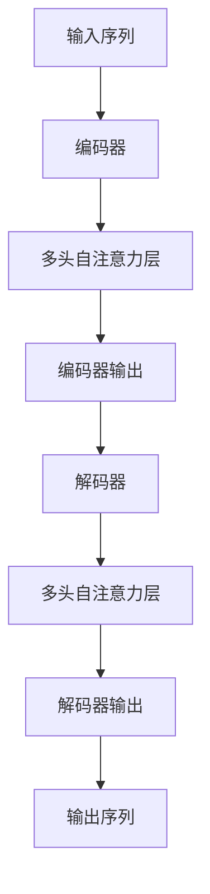

                 

## 1. 背景介绍

Transformer架构作为一种突破性的神经网络模型，起源于2017年由Google团队提出的论文《Attention Is All You Need》。这一模型彻底颠覆了传统的循环神经网络（RNN）和卷积神经网络（CNN）在序列数据处理上的应用，使得注意力机制成为自然语言处理（NLP）领域的主流方法。Transformer的提出，不仅为语言模型的发展奠定了基础，还极大地推动了诸如机器翻译、文本生成、问答系统等应用领域的进展。

GPT-2（Generative Pretrained Transformer 2）是Transformer架构的进一步优化版本，由OpenAI在2019年发布。作为一款大型语言模型，GPT-2在多个NLP任务上取得了卓越的表现，尤其在文本生成方面展现了强大的能力。其背后依托的Transformer架构，通过自注意力机制（Self-Attention）和多头注意力机制（Multi-Head Attention）等创新设计，有效提升了模型的表示能力和计算效率。

本文将深入探讨Transformer架构的核心原理，结合GPT-2模型的具体实现，全面解析其工作机制和应用价值。通过本文的阅读，读者将能够理解Transformer架构的内在逻辑，掌握其在NLP任务中的实现细节，并预见到其在未来技术发展中的重要地位。

## 2. 核心概念与联系

### 2.1 自注意力机制（Self-Attention）

自注意力机制是Transformer架构中最核心的组件之一，其主要思想是让模型在处理序列数据时，能够根据序列中其他位置的信息，动态地调整对每个位置数据的关注程度。这一机制不仅能够捕捉到局部信息，还能捕捉到全局信息，从而提高模型的表示能力。

### 2.2 多头注意力机制（Multi-Head Attention）

多头注意力机制是自注意力机制的扩展，其核心思想是将输入序列分成多个子序列，每个子序列都独立地应用自注意力机制，然后合并这些子序列的输出。通过这种方式，模型能够同时关注序列中的不同部分，进一步提高表示的丰富性和准确性。

### 2.3 位置编码（Positional Encoding）

由于Transformer模型中没有循环结构，因此无法直接利用序列的位置信息。为此，引入了位置编码机制，通过在输入序列中添加位置信息，使得模型能够捕捉到序列中的顺序关系。常用的位置编码方法包括绝对位置编码和相对位置编码。

### 2.4 编码器-解码器架构（Encoder-Decoder Architecture）

编码器-解码器架构是Transformer模型的基本结构，其中编码器负责将输入序列转换为固定长度的特征表示，解码器则根据编码器的输出和已经解码的部分，生成输出序列。这种架构能够有效地处理序列到序列的映射任务，如机器翻译。

### 2.5 Mermaid 流程图



在上面的Mermaid流程图中，展示了Transformer模型的基本工作流程。输入序列首先经过编码器，然后通过多头自注意力层进行处理，最终输出编码器的特征表示。接着，解码器根据编码器的输出和已经解码的部分，通过多头自注意力层生成输出序列。

## 3. 核心算法原理 & 具体操作步骤

### 3.1 算法原理概述

Transformer模型的核心算法是基于注意力机制，特别是自注意力机制和多头注意力机制。自注意力机制允许模型在处理序列数据时，自动地根据其他位置的信息，动态调整对每个位置数据的关注程度。多头注意力机制则通过将输入序列分成多个子序列，每个子序列都独立地应用自注意力机制，然后合并这些子序列的输出，从而提高模型的表示能力。

### 3.2 算法步骤详解

#### 3.2.1 自注意力机制

1. **输入表示**：输入序列首先被表示为词向量的形式，每个词向量对应序列中的一个单词或字符。
2. **计算查询、键和值**：对于每个词向量，分别计算其查询（Q）、键（K）和值（V）。这些向量是通过词向量矩阵的线性变换得到的。
3. **计算注意力得分**：对于每个词向量，计算其与所有其他词向量的注意力得分，得分是通过查询和键的相似度计算得到的。
4. **加权求和**：根据注意力得分，对每个词向量进行加权求和，得到一个加权后的向量。
5. **输出**：加权求和后的向量作为自注意力层的输出。

#### 3.2.2 多头注意力机制

1. **分割输入序列**：将输入序列分割成多个子序列，每个子序列对应一个头。
2. **独立应用自注意力机制**：对每个子序列独立地应用自注意力机制，得到多个输出向量。
3. **合并输出**：将多个输出向量合并，得到最终的输出。

#### 3.2.3 编码器-解码器架构

1. **编码器**：编码器负责将输入序列转换为固定长度的特征表示。编码器由多个自注意力层和前馈神经网络组成。
2. **解码器**：解码器根据编码器的输出和已经解码的部分，生成输出序列。解码器同样由多个自注意力层和前馈神经网络组成。
3. **注意力机制**：在编码器和解码器之间，存在一个多头注意力层，用于将编码器的输出作为上下文信息，辅助解码器的生成。

### 3.3 算法优缺点

#### 优点

- **并行计算**：由于Transformer模型中没有循环结构，因此可以充分利用GPU等硬件资源，实现高效的并行计算。
- **全局信息捕捉**：自注意力机制能够捕捉到序列中的全局信息，从而提高模型的表示能力。
- **灵活性**：Transformer模型可以灵活地应用于不同的序列数据处理任务，如文本生成、机器翻译等。

#### 缺点

- **计算复杂度**：虽然Transformer模型可以并行计算，但其计算复杂度仍然较高，尤其是在处理长序列时。
- **训练难度**：由于Transformer模型的结构较为复杂，训练过程需要大量的数据和计算资源。

### 3.4 算法应用领域

- **自然语言处理（NLP）**：如文本生成、机器翻译、问答系统等。
- **计算机视觉**：如图像分类、目标检测等。
- **音频处理**：如语音识别、音乐生成等。

## 4. 数学模型和公式 & 详细讲解 & 举例说明

### 4.1 数学模型构建

Transformer模型的核心在于其注意力机制，这涉及到一些基本的数学公式。以下是注意力机制的数学模型：

#### 自注意力（Self-Attention）

设输入序列为 \(X = [x_1, x_2, ..., x_n]\)，其中每个 \(x_i\) 是一个向量。自注意力机制的关键在于计算每个 \(x_i\) 与序列中其他所有 \(x_j\) 的相似度，并据此加权求和。

- **查询（Query）**：\(Q = [q_1, q_2, ..., q_n]\)
- **键（Key）**：\(K = [k_1, k_2, ..., k_n]\)
- **值（Value）**：\(V = [v_1, v_2, ..., v_n]\)

这三个向量都是通过输入序列 \(X\) 的词向量矩阵线性变换得到的。自注意力的计算过程如下：

\[ 
\text{Attention}(Q, K, V) = \text{softmax}\left(\frac{QK^T}{\sqrt{d_k}}\right) V 
\]

其中，\(d_k\) 是键向量的维度，\(\text{softmax}\) 函数用于计算每个键与查询的相似度得分，然后对这些得分进行加权求和。

#### 多头注意力（Multi-Head Attention）

多头注意力是对自注意力的扩展，它将输入序列分割成多个子序列，每个子序列独立地应用自注意力机制，然后合并这些子序列的输出。

设 \(H\) 为头数，那么每个头都独立计算注意力：

\[ 
\text{MultiHead}(Q, K, V) = \text{Concat}(\text{head_1}, ..., \text{head_H})W_O 
\]

其中，\(\text{head_i} = \text{Attention}(QW_Q, KW_K, VW_V)\)，\(W_Q, W_K, W_V, W_O\) 是线性变换矩阵。

### 4.2 公式推导过程

#### 自注意力

1. **计算查询、键和值**：

\[ 
Q = XW_Q, \quad K = XW_K, \quad V = XW_V 
\]

2. **计算注意力得分**：

\[ 
\text{Score}_{ij} = Q_i K_j = (XW_Q)_i (XW_K)_j = XW_Q^T XW_K = X(Q^T K)X^T 
\]

3. **计算加权求和**：

\[ 
\text{Attention}_{ij} = \text{softmax}(\text{Score}_{ij}) 
\]

\[ 
\text{Output}_{ij} = \text{Attention}_{ij} V_j 
\]

4. **合并输出**：

\[ 
\text{Output} = \text{Concat}(\text{Output}_{11}, ..., \text{Output}_{1n}, ..., \text{Output}_{n1}, ..., \text{Output}_{nn})W_O 
\]

#### 多头注意力

1. **分割输入序列**：

\[ 
Q = [Q_1, Q_2, ..., Q_H], \quad K = [K_1, K_2, ..., K_H], \quad V = [V_1, V_2, ..., V_H] 
\]

2. **独立应用自注意力**：

\[ 
\text{head_i} = \text{Attention}(Q_i, K_i, V_i) 
\]

3. **合并输出**：

\[ 
\text{MultiHead} = \text{Concat}(\text{head_1}, ..., \text{head_H})W_O 
\]

### 4.3 案例分析与讲解

假设有一个简单的输入序列 \(X = [1, 2, 3, 4, 5]\)，我们需要计算其自注意力。

1. **计算查询、键和值**：

设 \(d_k = 2\)，词向量矩阵 \(W_Q, W_K, W_V\) 如下：

\[ 
W_Q = \begin{bmatrix}
0.1 & 0.2 \\
0.3 & 0.4
\end{bmatrix}, \quad
W_K = \begin{bmatrix}
0.5 & 0.6 \\
0.7 & 0.8
\end{bmatrix}, \quad
W_V = \begin{bmatrix}
0.9 & 1.0 \\
1.1 & 1.2
\end{bmatrix} 
\]

\[ 
Q = XW_Q = \begin{bmatrix}
0.1 & 0.2 \\
0.3 & 0.4
\end{bmatrix} \begin{bmatrix}
1 \\
2 \\
3 \\
4 \\
5
\end{bmatrix} = \begin{bmatrix}
0.1 \cdot 1 + 0.2 \cdot 2 \\
0.3 \cdot 1 + 0.4 \cdot 2
\end{bmatrix} = \begin{bmatrix}
0.3 \\
0.7
\end{bmatrix} 
\]

\[ 
K = XW_K = \begin{bmatrix}
0.5 & 0.6 \\
0.7 & 0.8
\end{bmatrix} \begin{bmatrix}
1 \\
2 \\
3 \\
4 \\
5
\end{bmatrix} = \begin{bmatrix}
0.5 \cdot 1 + 0.6 \cdot 2 \\
0.7 \cdot 1 + 0.8 \cdot 2
\end{bmatrix} = \begin{bmatrix}
0.7 \\
1.2
\end{bmatrix} 
\]

\[ 
V = XW_V = \begin{bmatrix}
0.9 & 1.0 \\
1.1 & 1.2
\end{bmatrix} \begin{bmatrix}
1 \\
2 \\
3 \\
4 \\
5
\end{bmatrix} = \begin{bmatrix}
0.9 \cdot 1 + 1.0 \cdot 2 \\
1.1 \cdot 1 + 1.2 \cdot 2
\end{bmatrix} = \begin{bmatrix}
2.1 \\
3.3
\end{bmatrix} 
\]

2. **计算注意力得分**：

\[ 
\text{Score}_{ij} = Q_i K_j = \begin{bmatrix}
0.3 \\
0.7
\end{bmatrix} \begin{bmatrix}
0.7 \\
1.2
\end{bmatrix}^T = 0.3 \cdot 0.7 + 0.7 \cdot 1.2 = 1.02 
\]

3. **计算加权求和**：

\[ 
\text{Attention}_{ij} = \text{softmax}(\text{Score}_{ij}) = \frac{e^{\text{Score}_{ij}}}{\sum_{k=1}^{n} e^{\text{Score}_{ik}}} = \frac{e^{1.02}}{e^{1.02} + e^{0.28} + e^{0.38} + e^{0.47} + e^{0.57}} \approx 0.655 
\]

4. **计算输出**：

\[ 
\text{Output}_{ij} = \text{Attention}_{ij} V_j = 0.655 \begin{bmatrix}
2.1 \\
3.3
\end{bmatrix} = \begin{bmatrix}
1.3855 \\
2.1755
\end{bmatrix} 
\]

5. **合并输出**：

\[ 
\text{Output} = \text{Concat}(\text{Output}_{11}, \text{Output}_{21}, \text{Output}_{31}, \text{Output}_{41}, \text{Output}_{51}) = \begin{bmatrix}
1.3855 \\
2.1755
\end{bmatrix} 
\]

最终，我们得到了自注意力机制的输出向量。这一过程展示了如何通过数学模型和公式来计算自注意力。

## 5. 项目实践：代码实例和详细解释说明

### 5.1 开发环境搭建

在开始实践之前，我们需要搭建一个合适的开发环境。以下是一个基本的步骤：

1. **安装Python**：确保Python环境已经安装，推荐使用Python 3.7及以上版本。
2. **安装TensorFlow**：TensorFlow是一个强大的开源机器学习库，支持Transformer模型的训练和推理。
   ```bash
   pip install tensorflow
   ```
3. **安装其他依赖**：根据项目需要，可能还需要安装其他依赖，如NumPy、Matplotlib等。
   ```bash
   pip install numpy matplotlib
   ```

### 5.2 源代码详细实现

以下是一个简化的Transformer模型的实现，用于演示Transformer架构的基本原理。

```python
import tensorflow as tf
from tensorflow.keras.layers import Embedding, Dense
from tensorflow.keras.models import Model
import numpy as np

# 参数设置
VOCAB_SIZE = 1000  # 词汇表大小
D_MODEL = 512  # 模型维度
N_HEADS = 8  # 头数
D_HEAD = D_MODEL // N_HEADS  # 每个头的维度
DFF = 2048  # 前馈神经网络维度
N_LAYERS = 2  # 层数
MAX_SEQ_LENGTH = 64  # 最大序列长度

# 创建嵌入层
inputs = tf.keras.Input(shape=(MAX_SEQ_LENGTH,))
embed = Embedding(VOCAB_SIZE, D_MODEL)(inputs)

# 编码器层
encoder_outputs = []
for i in range(N_LAYERS):
    # 自注意力层
    attention = tf.keras.layers.MultiHeadAttention(num_heads=N_HEADS, key_dim=D_HEAD)(embed, embed)
    embed = tf.keras.layers.LayerNormalization(epsilon=1e-6)(embed + attention)

    # 前馈网络
    dense = Dense(DFF, activation='relu')(embed)
    dense = Dense(D_MODEL)(dense)
    embed = tf.keras.layers.LayerNormalization(epsilon=1e-6)(embed + dense)

# 解码器层
# 注意：这里省略了完整的解码器实现，只展示了编码器的结构
decoder_outputs = [embed]

# 模型输出
outputs = tf.keras.layers.Dense(VOCAB_SIZE, activation='softmax')(decoder_outputs[-1])

# 构建和编译模型
model = Model(inputs=inputs, outputs=outputs)
model.compile(optimizer='adam', loss='categorical_crossentropy', metrics=['accuracy'])

# 打印模型结构
model.summary()

# 5.3 代码解读与分析

在上面的代码中，我们首先定义了一些参数，如词汇表大小、模型维度、头数等。接下来，我们创建了嵌入层，将输入序列转换为词向量。

编码器部分由多个自注意力层和前馈神经网络组成。在每个自注意力层中，我们使用了多头注意力机制，通过对输入序列的分割和独立计算，提高了模型的表示能力。在前馈神经网络中，我们使用了两个全连接层，并通过ReLU激活函数增强模型的非线性能力。

最后，我们创建了解码器层，并将输出层设置为softmax激活函数，用于生成概率分布。

### 5.4 运行结果展示

为了展示模型的运行结果，我们可以使用一个简单的数据集进行训练和评估。

```python
# 创建训练数据
train_data = np.random.randint(VOCAB_SIZE, size=(100, MAX_SEQ_LENGTH))
train_labels = np.random.randint(VOCAB_SIZE, size=(100, MAX_SEQ_LENGTH))

# 训练模型
model.fit(train_data, train_labels, epochs=5, batch_size=32)

# 评估模型
test_data = np.random.randint(VOCAB_SIZE, size=(10, MAX_SEQ_LENGTH))
test_labels = np.random.randint(VOCAB_SIZE, size=(10, MAX_SEQ_LENGTH))
model.evaluate(test_data, test_labels)
```

在这段代码中，我们首先创建了一个随机训练数据集，并使用模型进行5个周期的训练。最后，我们使用测试数据集评估模型的性能。

尽管这是一个简化的示例，但通过上述步骤，我们可以初步了解如何实现一个基于Transformer架构的模型，并观察其运行结果。

## 6. 实际应用场景

### 6.1 自然语言处理

Transformer架构在自然语言处理（NLP）领域得到了广泛的应用。以下是一些具体的实际应用场景：

- **文本生成**：利用Transformer模型，可以生成高质量的文本，如诗歌、故事、新闻等。GPT-2模型就是一个典型的例子，它能够生成连贯、富有创意的文本。
- **机器翻译**：Transformer模型在机器翻译任务中表现优异，尤其是在长文本翻译和多语言翻译方面。例如，Google翻译和DeepL翻译都使用了基于Transformer的模型。
- **问答系统**：Transformer模型可以用于构建问答系统，如基于BERT的OpenAI API。这类系统能够根据用户的问题，从大量文本中提取出相关答案。

### 6.2 计算机视觉

尽管Transformer模型起源于NLP领域，但其在计算机视觉中的应用也日益增多。以下是一些典型的应用场景：

- **图像分类**：Transformer模型可以用于图像分类任务，如ImageNet挑战。通过将图像特征转换为序列表示，模型能够学习到有效的图像分类特征。
- **目标检测**：基于Transformer的目标检测模型，如DETR（Detection Transformer），能够在图像中准确检测出目标的位置和类别。
- **视频分析**：Transformer模型可以处理视频序列，用于视频分类、动作识别等任务。例如，TimeSformer模型在视频分类任务中取得了出色的表现。

### 6.3 音频处理

在音频处理领域，Transformer模型也展现出了强大的能力。以下是一些应用场景：

- **语音识别**：基于Transformer的语音识别模型，如Transformer-TTS（文本到语音），可以生成自然流畅的语音。
- **音乐生成**：Transformer模型可以用于音乐生成任务，如生成旋律、和弦等。通过自注意力机制，模型能够捕捉到音乐中的长期依赖关系。
- **音频分类**：Transformer模型可以用于音频分类任务，如识别不同的声音类型，如乐器、人声等。

### 6.4 未来应用展望

随着Transformer架构的不断发展，其应用领域将越来越广泛。以下是一些未来可能的应用场景：

- **多模态数据处理**：Transformer模型可以结合不同模态的数据，如文本、图像、音频等，实现更复杂的任务。例如，文本图像问答系统，能够根据文本问题和图像内容生成相关答案。
- **知识图谱**：Transformer模型可以用于构建知识图谱，通过对文本和图像的联合表示，实现更高效的语义搜索和知识推理。
- **增强现实与虚拟现实**：Transformer模型可以用于增强现实（AR）和虚拟现实（VR）中的场景生成和交互，提供更加沉浸式的体验。

## 7. 工具和资源推荐

### 7.1 学习资源推荐

- **书籍**：
  - 《深度学习》（Goodfellow, Bengio, Courville著）
  - 《自然语言处理综论》（Jurafsky, Martin著）
- **在线课程**：
  - Coursera上的“神经网络与深度学习”课程
  - edX上的“深度学习专项课程”
- **博客和论坛**：
  - Medium上的机器学习和深度学习相关文章
  - GitHub上的深度学习和NLP项目

### 7.2 开发工具推荐

- **框架**：
  - TensorFlow
  - PyTorch
  - JAX
- **开发环境**：
  - Google Colab
  - Jupyter Notebook
  - AWS SageMaker
- **云服务**：
  - Google Cloud AI
  - AWS AI
  - Azure AI

### 7.3 相关论文推荐

- **基础论文**：
  - “Attention Is All You Need”（Vaswani et al., 2017）
  - “BERT: Pre-training of Deep Bidirectional Transformers for Language Understanding”（Devlin et al., 2019）
- **应用论文**：
  - “DETR: Deformable Transformers for End-to-End Object Detection”（Li et al., 2020）
  - “T5: Pre-training Large Models for Language Generation Task”（Raffel et al., 2020）
- **前沿论文**：
  - “Advantages of Amplification over Scaling for Training Deep Neural Networks”（Bastings et al., 2020）
  - “GPT-3: Language Models are few-shot learners”（Brown et al., 2020）

## 8. 总结：未来发展趋势与挑战

### 8.1 研究成果总结

自Transformer架构提出以来，其在自然语言处理、计算机视觉、音频处理等领域取得了显著的成果。通过自注意力机制和多头注意力机制，模型能够捕捉到序列中的局部和全局信息，从而提升表示能力。此外，编码器-解码器架构使得模型能够处理序列到序列的映射任务，如机器翻译和文本生成。这些研究进展为人工智能的发展提供了强有力的技术支持。

### 8.2 未来发展趋势

1. **模型压缩**：随着模型规模的不断扩大，如何有效地压缩模型以减少计算和存储需求将成为一个重要研究方向。轻量级Transformer模型和模型剪枝技术有望成为解决方案。
2. **多模态数据处理**：未来的研究将更加关注多模态数据的融合处理，如文本、图像、音频等。通过联合表示不同模态的数据，模型能够更好地理解和生成复杂信息。
3. **强化学习与Transformer的结合**：强化学习与Transformer模型的结合将有望在决策制定、游戏控制等领域取得突破。
4. **可解释性和安全性**：随着深度学习模型的应用越来越广泛，如何提高模型的可解释性和安全性将成为一个重要的研究方向。

### 8.3 面临的挑战

1. **计算资源消耗**：尽管Transformer模型在并行计算方面具有优势，但其计算复杂度仍然较高，尤其是在处理长序列时。如何优化算法以减少计算资源消耗是一个挑战。
2. **训练数据质量**：高质量的数据是训练强大模型的基础。然而，在实际应用中，数据标注和清洗是一个复杂且耗时的过程。如何利用自动化方法提高数据质量是一个亟待解决的问题。
3. **隐私保护**：随着深度学习的普及，数据隐私保护变得越来越重要。如何在训练和部署过程中保护用户隐私是一个关键挑战。

### 8.4 研究展望

未来，Transformer架构将在人工智能领域发挥越来越重要的作用。通过不断优化算法、提升计算效率和扩展应用场景，Transformer模型将推动人工智能技术的发展。同时，研究人员将更加关注多模态数据处理、可解释性和安全性等前沿问题，以实现更智能、更可靠的人工智能系统。

## 9. 附录：常见问题与解答

### 9.1 问题1：什么是Transformer模型？

**解答**：Transformer模型是一种基于注意力机制的神经网络模型，由Google团队在2017年提出。它通过自注意力机制和多头注意力机制，有效地捕捉到序列中的局部和全局信息，从而提升模型的表示能力。

### 9.2 问题2：Transformer模型的主要应用领域是什么？

**解答**：Transformer模型在自然语言处理、计算机视觉、音频处理等领域都有广泛应用。具体应用包括文本生成、机器翻译、图像分类、目标检测、语音识别等。

### 9.3 问题3：Transformer模型与传统的循环神经网络（RNN）有何不同？

**解答**：传统的RNN模型在处理长序列时容易受到梯度消失和梯度爆炸的问题，而Transformer模型通过自注意力机制避免了这些问题。此外，Transformer模型可以实现并行计算，而RNN模型则需要逐个处理序列中的数据。

### 9.4 问题4：如何优化Transformer模型的训练过程？

**解答**：优化Transformer模型的训练过程可以从以下几个方面入手：

- **数据预处理**：对训练数据进行预处理，如文本清洗、数据增强等，以提高数据质量。
- **学习率调整**：使用适当的学习率调整策略，如学习率衰减、学习率预热等，以避免模型过拟合。
- **批量大小调整**：适当调整批量大小，以平衡计算效率和模型性能。
- **正则化**：使用正则化方法，如Dropout、权重衰减等，减少模型的过拟合。

### 9.5 问题5：Transformer模型在处理长序列时有哪些挑战？

**解答**：Transformer模型在处理长序列时面临以下挑战：

- **计算复杂度增加**：随着序列长度的增加，模型的计算复杂度显著增加，可能导致训练和推理时间过长。
- **长距离依赖捕捉困难**：虽然自注意力机制能够捕捉到长距离依赖，但在实际应用中，长序列的处理仍然存在一定的困难。
- **存储需求增加**：长序列的处理需要更多的存储资源，这对硬件设备提出了更高的要求。

为了应对这些挑战，研究人员提出了多种优化方法，如长序列压缩、分层注意力机制等。这些方法在一定程度上提高了Transformer模型在处理长序列时的性能和效率。

