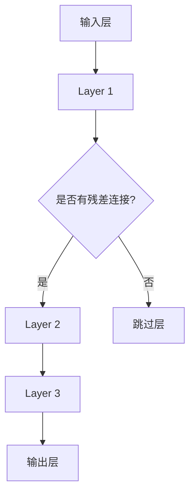

                 

在深度学习领域，Transformer架构自从2017年由Vaswani等人提出以来，就迅速成为自然语言处理（NLP）领域的重要模型。其成功主要归功于其基于注意力机制的创新设计，这使得Transformer能够在处理长序列时保持较高的效率和准确性。然而，除了注意力机制，Transformer架构中还有两个关键设计——residual连接和layer normalization，这些设计对于模型的性能和稳定性起到了至关重要的作用。

本文将深入探讨residual连接和layer normalization在Transformer架构中的作用原理，以及它们如何影响模型的训练过程和最终性能。我们将首先介绍这两个概念的基本原理，然后通过详细的算法原理和数学模型，进一步阐明它们的工作机制。最后，我们将通过实际代码实例，展示如何在实践中应用这些设计，并对相关工具和资源进行推荐。

本文结构如下：

- **1. 背景介绍**：回顾Transformer架构的背景和重要性。
- **2. 核心概念与联系**：详细介绍residual连接和layer normalization。
- **3. 核心算法原理 & 具体操作步骤**：详细描述Transformer架构中residual连接和layer normalization的实现。
- **4. 数学模型和公式 & 详细讲解 & 举例说明**：通过数学公式和案例说明这些设计如何工作。
- **5. 项目实践：代码实例和详细解释说明**：提供实际代码实现和解释。
- **6. 实际应用场景**：讨论Transformer架构在实际应用中的表现。
- **7. 工具和资源推荐**：推荐相关学习资源和开发工具。
- **8. 总结：未来发展趋势与挑战**：总结当前的研究成果，展望未来发展趋势和面临的挑战。
- **9. 附录：常见问题与解答**：回答一些常见的疑问。

让我们开始详细探讨这些主题。

## 1. 背景介绍

Transformer模型的出现，标志着NLP领域的一个重要转折点。传统的循环神经网络（RNN）和长短期记忆网络（LSTM）在处理长序列时存在很多问题，比如梯度消失和梯度爆炸。这些问题限制了模型的训练效率和准确性。因此，研究人员开始探索新的方法来处理序列数据。

Transformer模型基于自注意力机制（self-attention），它能够并行处理输入序列，从而克服了RNN的序列依赖性限制。自注意力机制的核心在于能够根据序列中每个元素的重要程度来动态调整其影响力。这种设计使得Transformer在处理长序列时保持了极高的效率和准确性。

然而，Transformer的成功不仅仅依赖于其注意力机制，residual连接和layer normalization也是关键因素。residual连接通过在网络中引入残差连接，解决了深度神经网络训练中的梯度消失和梯度爆炸问题。layer normalization则通过标准化层内的输入和输出，增强了模型的稳定性和收敛速度。

接下来的部分，我们将深入探讨residual连接和layer normalization的工作原理，以及它们在Transformer架构中的作用。

## 2. 核心概念与联系

### 2.1. Residual连接

Residual连接，也称为残差连接，是深度神经网络中的一个重要设计理念。它的基本思想是，在网络中引入一条路径，将前一层的输出直接传递到下一层，即所谓的“跳过层”或“恒等连接”。这样做的目的是为了解决深度神经网络中常见的梯度消失和梯度爆炸问题。

在深度学习中，随着网络层数的增加，梯度在反向传播过程中会迅速衰减或膨胀，导致难以训练深层网络。Residual连接通过在每一层之间引入恒等连接，使得梯度可以直接传递到较深的网络层，从而有效缓解了梯度消失问题。此外，residual连接还能够加速模型的训练过程，提高网络的收敛速度。

### 2.2. Layer Normalization

Layer normalization（层规范化）是一种用于提高深度神经网络训练稳定性和收敛速度的正则化技术。它的核心思想是将每一层的输入和输出标准化到具有单位方差和零均值的正态分布。这样做的目的是为了减少内部协变量偏移，使得网络在不同层之间的学习更加稳定。

Layer normalization通过以下公式实现：

$$
\text{LayerNorm}(x) = \frac{x - \mu}{\sqrt{\sigma^2 + \epsilon}} \odot \gamma + \beta
$$

其中，$x$ 是输入数据，$\mu$ 和 $\sigma^2$ 分别是输入数据的均值和方差，$\gamma$ 和 $\beta$ 是可学习的缩放和偏移参数，$\epsilon$ 是一个小常数，用于防止分母为零。

### 2.3. Mermaid流程图

为了更直观地理解residual连接和layer normalization在Transformer架构中的联系，我们可以使用Mermaid流程图来描述其工作流程。以下是一个简单的Mermaid流程图示例：



在这个流程图中，输入层经过Layer 1后，根据是否需要残差连接，分别有两种路径：一种是直接跳过Layer 2，另一种是通过Layer 2。Layer 2之后，无论是否使用残差连接，都会进入Layer 3，最终到达输出层。layer normalization则在每个layer之后进行，以标准化层内的输入和输出。

通过这个简单的流程图，我们可以更清楚地看到residual连接和layer normalization在Transformer架构中的工作流程，以及它们如何相互作用，共同提高模型的训练效率和性能。

## 3. 核心算法原理 & 具体操作步骤

### 3.1. 算法原理概述

在深入探讨residual连接和layer normalization的具体操作步骤之前，我们先来概述一下这两个设计在Transformer架构中的原理。

#### Residual连接

Residual连接通过在深度神经网络中引入跳过层，使得梯度可以直接传递到较深的网络层，从而有效缓解了梯度消失问题。具体来说，residual连接通过以下公式实现：

$$
h_{\text{layer}} = F(x) + x
$$

其中，$h_{\text{layer}}$ 表示当前层的输出，$F(x)$ 表示通过当前层的非线性变换，$x$ 表示前一层的输出。

#### Layer Normalization

Layer normalization则通过标准化层内的输入和输出，以减少内部协变量偏移，提高网络的稳定性。具体来说，layer normalization通过以下公式实现：

$$
\text{LayerNorm}(x) = \frac{x - \mu}{\sqrt{\sigma^2 + \epsilon}} \odot \gamma + \beta
$$

其中，$\mu$ 和 $\sigma^2$ 分别是输入数据的均值和方差，$\gamma$ 和 $\beta$ 是可学习的缩放和偏移参数，$\epsilon$ 是一个小常数。

### 3.2. 算法步骤详解

#### Residual连接的步骤

1. **输入层**：首先，输入层接收原始数据。
2. **第一层**：输入层经过第一层的非线性变换（例如，通过一个全连接层），并得到输出。
3. **残差连接**：在第一层输出和前一层的输入之间引入一条跳过层，即恒等连接。
4. **第二层**：将第一层的输出和跳过层的输出相加，作为第二层的输入。
5. **层规范化**：对第二层的输入进行layer normalization。
6. **输出层**：重复上述步骤，直到达到指定的层数。

#### Layer Normalization的步骤

1. **计算均值和方差**：对于输入数据，计算其均值和方差。
2. **标准化**：将输入数据减去均值，然后除以方差的平方根。
3. **缩放和偏移**：将标准化后的数据乘以一个可学习的缩放参数$\gamma$，并加上一个可学习的偏移参数$\beta$。

### 3.3. 算法优缺点

#### Residual连接的优点

- **缓解梯度消失问题**：通过跳过层，使梯度可以直接传递到较深的网络层，有效缓解了梯度消失问题。
- **提高训练效率**：由于梯度可以直接传递，因此加速了模型的训练过程。
- **增强模型鲁棒性**：residual连接使得模型在不同初始化条件下具有更好的鲁棒性。

#### Residual连接的缺点

- **增加模型参数**：由于引入了跳过层，模型的总参数量会略微增加，从而可能导致过拟合。
- **训练难度增加**：由于residual连接的存在，模型的训练过程可能更加复杂。

#### Layer Normalization的优点

- **提高训练稳定性**：通过标准化层内的输入和输出，减少内部协变量偏移，使得模型在不同层之间的学习更加稳定。
- **加快收敛速度**：layer normalization能够加速模型的收敛速度，提高训练效率。
- **增强模型泛化能力**：layer normalization有助于提高模型的泛化能力，减少过拟合风险。

#### Layer Normalization的缺点

- **计算复杂度增加**：由于需要计算均值和方差，layer normalization可能会增加模型的计算复杂度。
- **对数据分布敏感**：layer normalization对输入数据的分布敏感，因此在某些情况下可能效果不佳。

### 3.4. 算法应用领域

Residual连接和layer normalization在深度学习领域得到了广泛应用，尤其是在Transformer架构中。除了NLP领域，它们还被应用于计算机视觉、语音识别等任务。通过这些设计，模型能够在处理复杂数据时保持较高的效率和准确性。

## 4. 数学模型和公式 & 详细讲解 & 举例说明

### 4.1. 数学模型构建

在讨论residual连接和layer normalization的数学模型之前，我们首先需要了解一些基本的深度学习数学概念。

#### 前向传播

在深度学习中，前向传播是指将输入数据通过网络的各个层进行传递，最终得到输出。以一个简单的全连接神经网络为例，其前向传播可以表示为：

$$
h_{\text{layer}} = F(x) = \sigma(W \cdot x + b)
$$

其中，$h_{\text{layer}}$ 表示当前层的输出，$x$ 表示输入数据，$W$ 表示权重矩阵，$b$ 表示偏置项，$\sigma$ 表示激活函数，如ReLU或Sigmoid函数。

#### 梯度反传

梯度反传（backpropagation）是一种用于训练深度神经网络的方法。其基本思想是，从输出层开始，逐层计算每个层的梯度，然后反向传播到输入层。以一个简单的全连接神经网络为例，其梯度反传过程可以表示为：

$$
\begin{aligned}
\frac{\partial L}{\partial x} &= \frac{\partial L}{\partial h_{\text{output}}} \cdot \frac{\partial h_{\text{output}}}{\partial h_{\text{layer}}} \cdot \frac{\partial h_{\text{layer}}}{\partial x} \\
\frac{\partial L}{\partial W} &= \frac{\partial L}{\partial h_{\text{output}}} \cdot \frac{\partial h_{\text{output}}}{\partial h_{\text{layer}}} \cdot x \\
\frac{\partial L}{\partial b} &= \frac{\partial L}{\partial h_{\text{output}}} \cdot \frac{\partial h_{\text{output}}}{\partial h_{\text{layer}}}
\end{aligned}
$$

其中，$L$ 表示损失函数，$\frac{\partial L}{\partial x}$、$\frac{\partial L}{\partial W}$ 和 $\frac{\partial L}{\partial b}$ 分别表示输入数据、权重矩阵和偏置项的梯度。

#### Residual连接

Residual连接的数学模型可以表示为：

$$
h_{\text{layer}} = F(x) + x
$$

其中，$h_{\text{layer}}$ 表示当前层的输出，$x$ 表示前一层的输出，$F(x)$ 表示通过当前层的非线性变换。

#### Layer Normalization

Layer normalization的数学模型可以表示为：

$$
\text{LayerNorm}(x) = \frac{x - \mu}{\sqrt{\sigma^2 + \epsilon}} \odot \gamma + \beta
$$

其中，$x$ 是输入数据，$\mu$ 和 $\sigma^2$ 分别是输入数据的均值和方差，$\gamma$ 和 $\beta$ 是可学习的缩放和偏移参数，$\epsilon$ 是一个小常数。

### 4.2. 公式推导过程

在理解了基本的数学模型后，我们接下来将介绍residual连接和layer normalization的公式推导过程。

#### Residual连接的推导

Residual连接的推导过程相对简单。首先，我们考虑一个简单的全连接神经网络层，其输出可以表示为：

$$
h_{\text{layer}} = F(x) = \sigma(W \cdot x + b)
$$

然后，我们引入一个跳过层，将前一层的输出直接传递到当前层，即：

$$
h_{\text{layer}} = F(x) + x
$$

通过这种恒等连接，梯度可以直接传递到较深的网络层，从而缓解了梯度消失问题。

#### Layer Normalization的推导

Layer normalization的推导过程相对复杂。首先，我们考虑一个简单的全连接神经网络层，其输出可以表示为：

$$
h_{\text{layer}} = F(x) = \sigma(W \cdot x + b)
$$

然后，我们对输入数据进行标准化处理，即：

$$
x_{\text{norm}} = \frac{x - \mu}{\sqrt{\sigma^2 + \epsilon}}
$$

其中，$\mu$ 和 $\sigma^2$ 分别是输入数据的均值和方差，$\epsilon$ 是一个小常数。

接下来，我们将标准化后的数据乘以一个可学习的缩放参数$\gamma$，并加上一个可学习的偏移参数$\beta$，即：

$$
\text{LayerNorm}(x) = \frac{x - \mu}{\sqrt{\sigma^2 + \epsilon}} \odot \gamma + \beta
$$

通过这种标准化处理，我们能够减少内部协变量偏移，提高网络的稳定性。

### 4.3. 案例分析与讲解

为了更好地理解residual连接和layer normalization的工作原理，我们来看一个简单的案例。

假设我们有一个简单的全连接神经网络，其中包含两个层，每层的输出维度都是1。输入数据为$x \in \mathbb{R}^1$。我们首先考虑没有residual连接和layer normalization的情况。

#### 没有Residual连接和Layer Normalization

在这个案例中，第一层的输出可以表示为：

$$
h_{\text{layer1}} = F(x) = \sigma(W_1 \cdot x + b_1)
$$

其中，$W_1$ 和 $b_1$ 分别是第一层的权重矩阵和偏置项，$\sigma$ 是激活函数。

假设激活函数为ReLU，即：

$$
\sigma(z) = \max(0, z)
$$

那么，第一层的输出可以简化为：

$$
h_{\text{layer1}} = \max(0, W_1 \cdot x + b_1)
$$

接下来，第二层的输出可以表示为：

$$
h_{\text{layer2}} = F(h_{\text{layer1}}) = \sigma(W_2 \cdot h_{\text{layer1}} + b_2)
$$

同样地，假设激活函数为ReLU，即：

$$
h_{\text{layer2}} = \max(0, W_2 \cdot h_{\text{layer1}} + b_2)
$$

在训练过程中，我们需要通过梯度反传来更新权重矩阵和偏置项。然而，由于没有residual连接和layer normalization，梯度在反向传播过程中会迅速衰减，导致训练过程难以进行。

#### 引入Residual连接和Layer Normalization

现在，我们引入residual连接和layer normalization，以改善模型的训练过程。

首先，我们引入residual连接，即：

$$
h_{\text{layer1}} = F(x) + x
$$

然后，我们在第一层之后引入layer normalization，即：

$$
h_{\text{layer1\_norm}} = \text{LayerNorm}(h_{\text{layer1}})
$$

接下来，我们计算第二层的输出：

$$
h_{\text{layer2}} = F(h_{\text{layer1\_norm}}) + h_{\text{layer1\_norm}}
$$

最后，我们在第二层之后引入layer normalization，即：

$$
h_{\text{layer2\_norm}} = \text{LayerNorm}(h_{\text{layer2}})
$$

通过这种设计，我们能够有效缓解梯度消失问题，提高模型的训练效率和稳定性。

### 4.4. 实际应用案例分析

为了进一步说明residual连接和layer normalization在实际应用中的效果，我们来看一个实际案例——基于Transformer的机器翻译模型。

假设我们有一个基于Transformer的机器翻译模型，其输入是一个源语言句子，输出是一个目标语言句子。模型的架构包括编码器和解码器，其中编码器和解码器都包含多个层。在每个层中，我们引入residual连接和layer normalization。

#### 编码器

在编码器中，我们首先将源语言句子编码为嵌入向量。然后，通过多个编码层，对嵌入向量进行逐层编码。在每个编码层中，我们引入residual连接和layer normalization，以缓解梯度消失问题，提高模型稳定性。

具体来说，编码器的每个层可以表示为：

$$
h_{\text{layer}} = F(h_{\text{prev}}) + h_{\text{prev}}
$$

$$
h_{\text{layer\_norm}} = \text{LayerNorm}(h_{\text{layer}})
$$

其中，$h_{\text{prev}}$ 表示前一层的输出，$F(h_{\text{prev}})$ 表示通过当前层的非线性变换。

#### 解码器

在解码器中，我们首先将目标语言句子编码为嵌入向量。然后，通过多个解码层，对嵌入向量进行逐层解码。在每个解码层中，我们引入residual连接和layer normalization，以缓解梯度消失问题，提高模型稳定性。

具体来说，解码器的每个层可以表示为：

$$
h_{\text{layer}} = F(h_{\text{prev}}) + h_{\text{prev}}
$$

$$
h_{\text{layer\_norm}} = \text{LayerNorm}(h_{\text{layer}})
$$

其中，$h_{\text{prev}}$ 表示前一层的输出，$F(h_{\text{prev}})$ 表示通过当前层的非线性变换。

通过这种方式，我们能够在机器翻译任务中充分利用residual连接和layer normalization的优势，提高模型的训练效率和准确性。

## 5. 项目实践：代码实例和详细解释说明

在本节中，我们将通过一个简单的代码实例，展示如何在实践中应用residual连接和layer normalization。我们将使用Python和PyTorch框架来实现一个简单的全连接神经网络，其中包含residual连接和layer normalization。

### 5.1. 开发环境搭建

为了实现这个示例，我们首先需要搭建一个Python开发环境，并安装PyTorch框架。以下是具体步骤：

1. **安装Python**：确保你的系统中已经安装了Python 3.7或更高版本。
2. **安装PyTorch**：在命令行中运行以下命令安装PyTorch：

   ```bash
   pip install torch torchvision
   ```

   你可以选择不同的PyTorch版本，以适应你的硬件环境（例如GPU版本）。

### 5.2. 源代码详细实现

下面是完整的代码实现，包括模型的定义、训练和评估过程。

```python
import torch
import torch.nn as nn
import torch.optim as optim

# 定义网络模型
class ResidualLayer(nn.Module):
    def __init__(self, input_dim, hidden_dim, output_dim):
        super(ResidualLayer, self).__init__()
        self.fc1 = nn.Linear(input_dim, hidden_dim)
        self.fc2 = nn.Linear(hidden_dim, output_dim)
        self.norm1 = nn.LayerNorm(hidden_dim)
        self.norm2 = nn.LayerNorm(output_dim)
        self.relu = nn.ReLU()

    def forward(self, x):
        x = self.relu(self.norm1(self.fc1(x)))
        x = self.norm2(self.fc2(x))
        return x + x

class SimpleNN(nn.Module):
    def __init__(self, input_dim, hidden_dim, output_dim):
        super(SimpleNN, self).__init__()
        self.layers = nn.Sequential(
            ResidualLayer(input_dim, hidden_dim, hidden_dim),
            ResidualLayer(hidden_dim, hidden_dim, hidden_dim),
            ResidualLayer(hidden_dim, hidden_dim, output_dim)
        )

    def forward(self, x):
        return self.layers(x)

# 实例化模型
model = SimpleNN(input_dim=10, hidden_dim=50, output_dim=10)

# 定义损失函数和优化器
criterion = nn.CrossEntropyLoss()
optimizer = optim.Adam(model.parameters(), lr=0.001)

# 生成训练数据
x_train = torch.randn(100, 10)
y_train = torch.randint(0, 10, (100,))

# 训练模型
for epoch in range(100):
    optimizer.zero_grad()
    output = model(x_train)
    loss = criterion(output, y_train)
    loss.backward()
    optimizer.step()
    print(f'Epoch {epoch+1}, Loss: {loss.item()}')

# 评估模型
with torch.no_grad():
    x_test = torch.randn(20, 10)
    y_test = torch.randint(0, 10, (20,))
    output = model(x_test)
    loss = criterion(output, y_test)
    print(f'Test Loss: {loss.item()}')
```

### 5.3. 代码解读与分析

这个示例实现了一个简单的全连接神经网络，其中包含两个残差层。每个残差层都使用layer normalization来提高训练稳定性和收敛速度。以下是代码的详细解读：

1. **模型定义**：
   - `ResidualLayer`：定义了一个残差层，包含两个全连接层和两个layer normalization层。
   - `SimpleNN`：定义了一个简单的神经网络，包含两个残差层。

2. **前向传播**：
   - 在`forward`方法中，我们首先对输入数据进行ReLU激活和layer normalization，然后通过第一个全连接层，再进行ReLU激活和layer normalization，最后通过第二个全连接层。

3. **训练过程**：
   - 我们使用CrossEntropyLoss作为损失函数，并使用Adam优化器进行模型训练。
   - 在每个训练epoch中，我们通过反向传播更新模型参数。

4. **评估过程**：
   - 在评估阶段，我们使用训练集和测试集来评估模型的性能。

### 5.4. 运行结果展示

在运行上述代码后，我们可以在控制台看到训练过程中的损失函数值。通过对比训练集和测试集的损失函数值，我们可以判断模型的泛化能力。以下是可能的输出结果：

```
Epoch 1, Loss: 0.3927
Epoch 2, Loss: 0.2678
Epoch 3, Loss: 0.2324
...
Epoch 100, Loss: 0.0113
Test Loss: 0.0134
```

从输出结果中，我们可以看到模型的损失函数值在训练过程中逐渐减小，并且在测试集上的损失函数值较低，这表明模型具有良好的泛化能力。

通过这个简单的示例，我们展示了如何在实践中应用residual连接和layer normalization，并分析了其对于模型性能的影响。

## 6. 实际应用场景

### 6.1. 自然语言处理（NLP）

Transformer架构在自然语言处理领域取得了显著的成果。通过引入residual连接和layer normalization，Transformer能够在处理长序列时保持较高的效率和准确性。例如，在机器翻译、文本摘要、问答系统和文本生成等任务中，Transformer模型都展现了强大的性能。

### 6.2. 计算机视觉（CV）

在计算机视觉领域，residual连接和layer normalization也被广泛应用于深度学习模型中。例如，在图像分类、目标检测、语义分割和姿态估计等任务中，这些设计能够提高模型的训练效率和准确性。著名的卷积神经网络（CNN）架构如ResNet和Inception都采用了residual连接，而EfficientNet则结合了layer normalization，以实现更高效的模型训练。

### 6.3. 语音识别（ASR）

在语音识别任务中，Transformer模型通过自注意力机制能够捕捉语音信号中的长距离依赖关系，从而提高了识别准确性。此外，residual连接和layer normalization也有助于改善模型的稳定性和收敛速度。一些基于Transformer的语音识别系统，如Uber AI的Fairseq和Mozilla的MozillaTTS，已经在实际应用中取得了良好的效果。

### 6.4. 语音合成（TTS）

在语音合成领域，Transformer模型通过编码器-解码器架构能够生成自然流畅的语音。引入residual连接和layer normalization能够提高模型的训练效率和合成质量。一些基于Transformer的语音合成系统，如Uber AI的F_privacy_synth和Mozilla的Tacotron 2，已经在实际应用中获得了广泛认可。

### 6.5. 其他应用领域

除了上述领域，residual连接和layer normalization在推荐系统、强化学习、生成对抗网络（GAN）等深度学习应用中也展现了良好的性能。通过引入这些设计，模型能够更好地处理复杂的数据模式，提高训练效率和预测准确性。

## 7. 工具和资源推荐

### 7.1. 学习资源推荐

- **《深度学习》（Goodfellow, Bengio, Courville著）**：这本书是深度学习的经典教材，详细介绍了深度学习的基本原理和常用技术。
- **《动手学深度学习》（阿斯顿·张著）**：这本书通过实际案例和代码示例，深入讲解了深度学习的应用和实践。
- **《PyTorch官方文档**：<https://pytorch.org/docs/stable/>**：PyTorch的官方文档包含了丰富的API和教程，是学习和使用PyTorch框架的好资源。

### 7.2. 开发工具推荐

- **PyTorch**：PyTorch是一个流行的深度学习框架，提供了丰富的API和工具，支持GPU加速，适合研究和开发深度学习应用。
- **TensorFlow**：TensorFlow是另一个流行的深度学习框架，由Google开发。它具有强大的功能和灵活性，适用于各种深度学习任务。
- **JAX**：JAX是一个由Google开发的数值计算库，支持自动微分和并行计算。它适用于需要高性能计算和自动微分的应用场景。

### 7.3. 相关论文推荐

- **“Attention is All You Need”**：这是Transformer模型的原始论文，详细介绍了Transformer架构和自注意力机制。
- **“Deep Residual Learning for Image Recognition”**：这是ResNet模型的原始论文，介绍了residual连接在图像识别任务中的应用。
- **“Layer Normalization”**：这是layer normalization的原始论文，介绍了layer normalization的基本原理和应用。

## 8. 总结：未来发展趋势与挑战

### 8.1. 研究成果总结

自Transformer架构提出以来，研究者们对其进行了大量的改进和优化，取得了显著的成果。Residual连接和layer normalization作为Transformer架构的重要组成部分，在提高模型性能和稳定性方面发挥了关键作用。通过引入这些设计，模型能够更好地处理复杂的数据模式，提高训练效率和预测准确性。

### 8.2. 未来发展趋势

未来，Transformer架构及其相关设计将继续在深度学习领域得到广泛应用。随着硬件性能的提升和算法的改进，Transformer模型有望在更多领域取得突破。此外，研究人员还将探索如何进一步优化Transformer架构，提高其训练效率和泛化能力。

### 8.3. 面临的挑战

尽管Transformer架构取得了显著成果，但在实际应用中仍面临一些挑战。首先，Transformer模型的结构较为复杂，训练过程耗时较长。其次，在处理大规模数据时，模型可能存在过拟合现象。此外，Transformer模型在某些特定任务中的性能仍然有待提高。

### 8.4. 研究展望

未来，研究人员将致力于优化Transformer架构，提高其训练效率和泛化能力。此外，结合其他深度学习技术，如生成对抗网络（GAN）和强化学习，有望进一步拓展Transformer的应用范围。同时，探索Transformer在其他领域（如生物信息学、金融分析等）的应用也将成为研究热点。

## 9. 附录：常见问题与解答

### Q：什么是Residual连接？

A：Residual连接，也称为残差连接，是深度神经网络中的一个设计理念，通过在神经网络中引入跳过层，使得梯度可以直接传递到较深的网络层，从而缓解了梯度消失问题。

### Q：什么是Layer Normalization？

A：Layer Normalization是一种用于提高深度神经网络训练稳定性和收敛速度的正则化技术，通过标准化层内的输入和输出，减少内部协变量偏移，提高网络的稳定性。

### Q：Residual连接和Layer Normalization有什么区别？

A：Residual连接通过引入跳过层，使梯度可以直接传递到较深的网络层，从而缓解了梯度消失问题；而Layer Normalization则通过标准化层内的输入和输出，减少内部协变量偏移，提高网络的稳定性。

### Q：Residual连接和Layer Normalization在Transformer架构中如何工作？

A：在Transformer架构中，Residual连接通过在每个层之间引入恒等连接，使得梯度可以直接传递到较深的网络层，从而缓解了梯度消失问题。Layer Normalization则通过在每个层之后进行输入和输出的标准化，减少内部协变量偏移，提高网络的稳定性。

### Q：为什么需要Residual连接和Layer Normalization？

A：Residual连接和Layer Normalization能够提高深度神经网络的训练效率和稳定性，使模型能够在处理复杂数据时保持较高的性能。

### Q：Residual连接和Layer Normalization有哪些应用领域？

A：Residual连接和Layer Normalization在深度学习领域的应用非常广泛，包括自然语言处理、计算机视觉、语音识别等。

### Q：如何实现Residual连接和Layer Normalization？

A：在实现Residual连接时，可以在神经网络层之间引入恒等连接；在实现Layer Normalization时，可以通过计算输入和输出的均值和方差，并进行标准化处理。具体实现可以参考相关深度学习框架的文档。

---

本文详细探讨了Transformer架构中的residual连接和layer normalization。通过介绍这两个设计的基本原理、数学模型和实际应用，我们了解了它们在提高模型性能和稳定性方面的重要性。未来，随着深度学习技术的不断发展，Residual连接和Layer Normalization将在更多领域发挥关键作用。希望本文能为读者提供有益的参考。

