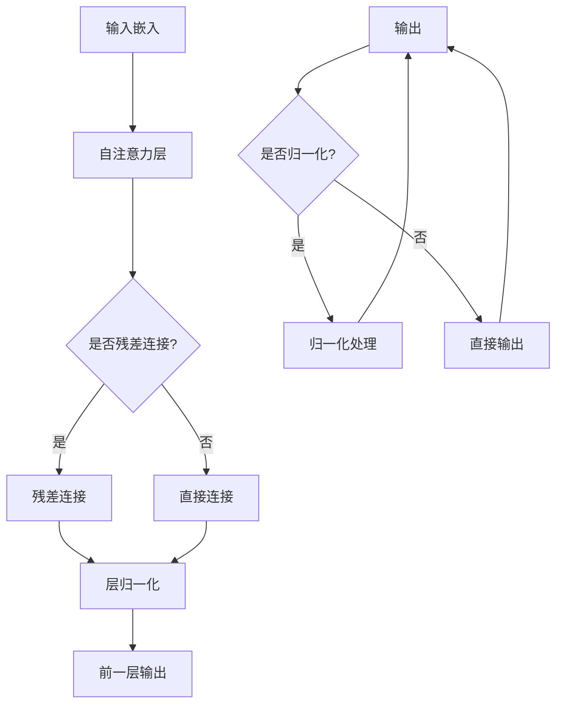

                 

### 关键词 Keywords
- Transformer
- Residual Connection
- Layer Normalization
- GPT-2
- Sequence Modeling
- Neural Networks

### 摘要 Abstract
本文将深入探讨Transformer架构的核心组件：residual连接和层归一化，并结合GPT-2模型进行详细解析。我们将首先介绍Transformer的背景和动机，然后详细解释residual连接和层归一化的原理，并展示如何在实际的预训练语言模型GPT-2中应用这些技术。此外，我们还将探讨这些技术的数学基础，并通过实际代码实例进行详细说明。最后，我们将探讨这些技术在实际应用中的表现，并对未来的发展趋势和挑战进行展望。

## 1. 背景介绍

在深度学习领域，神经网络已经成为解决各种复杂任务的主要工具，从计算机视觉到自然语言处理，从推荐系统到游戏AI，神经网络都展现了强大的能力和广泛的应用前景。然而，在处理序列数据时，传统的循环神经网络（RNN）和长短期记忆网络（LSTM）等模型面临着梯度消失和梯度爆炸等问题，导致训练效果不佳。

为了解决这些问题，2017年，Google AI团队提出了Transformer模型，这是一种基于自注意力机制的新型神经网络架构。Transformer模型的提出标志着自然语言处理领域的一个重大突破，它不仅在许多基准测试上取得了前所未有的成绩，而且为后续的研究工作提供了新的思路和方向。

Transformer模型之所以能够取得成功，主要归功于其核心组件：residual连接和层归一化。residual连接通过跳过前一层的信息传递，有效地缓解了梯度消失问题，而层归一化则通过标准化层间输入，提高了模型的训练稳定性。这些技术的引入使得Transformer模型在处理长序列数据和并行计算方面表现出色，从而推动了自然语言处理技术的快速发展。

本文将围绕Transformer架构的这两个核心组件展开，详细介绍它们的原理和实现，并通过GPT-2模型进行实际应用分析。我们还将探讨这些技术在数学模型和算法上的基础，以及它们在实际开发中的应用和挑战。希望通过本文的阐述，读者能够对Transformer架构有更深入的理解，并为后续的研究和实践提供参考。

## 2. 核心概念与联系

Transformer模型的核心在于其自注意力机制，这一机制通过计算序列中每个元素与其他元素之间的关系来学习复杂的序列依赖。然而，仅有自注意力机制还不足以构建一个高效的序列模型，因此，Transformer引入了residual连接和层归一化来增强模型的训练效果和计算效率。

### 2.1. 自注意力机制

自注意力机制（Self-Attention）是Transformer模型的基础。它通过计算序列中每个词向量与其他词向量的关系，来确定每个词向量在模型中的重要性。具体来说，自注意力机制可以分为三个步骤：

1. **输入嵌入（Input Embedding）**：每个词向量首先通过词嵌入层转换为嵌入向量。
2. **计算注意力权重（Compute Attention Weights）**：通过计算每个嵌入向量与其他嵌入向量之间的相似度，得到一个注意力权重矩阵。这一步使用了点积注意力（Dot-Product Attention）。
3. **加权求和（Weighted Sum）**：根据注意力权重矩阵对输入嵌入进行加权求和，得到最终的输出向量。

自注意力机制的优点在于能够自动捕捉序列中的长距离依赖关系，从而避免了传统循环神经网络中的梯度消失问题。同时，自注意力机制的计算可以并行化，提高了模型的训练效率。

### 2.2. Residual Connection

residual连接（Residual Connection）是一种在神经网络中引入跨层信息传递的技术，其目的是缓解梯度消失和梯度爆炸问题，并加速模型的训练。residual连接的基本思想是，在网络的每个层次之间添加一个跳过连接，使得梯度可以直接从输出层传递到输入层。

具体实现上，residual连接通常通过以下方式添加：

1. **跨层连接（Cross-layer Connection）**：在当前层的输出和下一层的输入之间添加一个跨层连接，这个跨层连接的输出与下一层的输入相加。
2. **层间缩放（Layer Scaling）**：为了保持网络内部的恒等变换，通常会对跨层连接的输出进行缩放。常见的缩放方式是乘以一个学习到的标量因子。

residual连接的主要优点包括：

- **缓解梯度消失**：通过跨层连接，梯度可以直接从输出层传递到输入层，避免了多层网络的梯度消失问题。
- **加速训练**：residual连接使得网络可以通过跳过部分层次来传递信息，从而减少了训练过程中需要更新的参数数量，提高了训练效率。

### 2.3. 层归一化

层归一化（Layer Normalization）是一种在神经网络中引入数据正则化技术，其目的是提高模型的训练稳定性和效果。层归一化的基本原理是通过对每一层的输入进行标准化，使其具有较小的方差和均值接近于零，从而减少模型对输入噪声的敏感度。

具体实现上，层归一化通常包括以下步骤：

1. **标准化（Normalization）**：计算输入的均值和方差，然后对输入进行标准化操作。
2. **缩放和偏移（Scaling and Shifting）**：通过学习到的标量因子和偏移量对标准化后的输入进行缩放和偏移，以恢复原始数据的分布。

层归一化的主要优点包括：

- **提高训练稳定性**：通过标准化层间输入，层归一化减少了模型对输入噪声的敏感度，从而提高了训练的稳定性。
- **加速收敛**：层归一化有助于加速模型的训练过程，因为它减少了内部协变量转移，使得模型更容易找到最优解。

### 2.4. Mermaid 流程图

为了更好地展示Transformer架构中residual连接和层归一化的关系，我们可以使用Mermaid流程图来描述它们之间的信息流动。以下是一个简单的Mermaid流程图示例：



在这个流程图中，A表示输入嵌入，B表示自注意力层，C是一个判断节点，用于决定是否添加残差连接。D和E分别表示残差连接和直接连接，F表示层归一化，G表示前一层输出，H表示最终输出，I是一个判断节点，用于决定是否进行归一化处理。J和K分别表示归一化处理和直接输出。

通过这个Mermaid流程图，我们可以清晰地看到residual连接和层归一化在Transformer架构中的作用和关系。

## 3. 核心算法原理 & 具体操作步骤

### 3.1. 算法原理概述

Transformer模型的核心算法是自注意力机制（Self-Attention）。自注意力机制通过计算序列中每个元素与其他元素之间的关系，来确定每个元素在模型中的重要性。自注意力机制可以分为三个步骤：输入嵌入、计算注意力权重和加权求和。

1. **输入嵌入（Input Embedding）**：每个词向量通过词嵌入层转换为嵌入向量。词嵌入层可以将高维的词向量映射到低维的嵌入空间，从而使得模型能够更好地捕捉词与词之间的语义关系。

2. **计算注意力权重（Compute Attention Weights）**：通过计算每个嵌入向量与其他嵌入向量之间的相似度，得到一个注意力权重矩阵。这一步使用了点积注意力（Dot-Product Attention）。点积注意力通过计算两个嵌入向量的内积来确定它们之间的相似度，然后将相似度归一化，以得到权重矩阵。

3. **加权求和（Weighted Sum）**：根据注意力权重矩阵对输入嵌入进行加权求和，得到最终的输出向量。加权求和的过程可以看作是对输入序列中的每个元素进行加权平均，从而使得模型能够更好地捕捉序列中的长距离依赖关系。

### 3.2. 算法步骤详解

在详细解释自注意力机制的步骤之前，我们需要首先了解Transformer模型中的几个关键组件：

- **多头注意力（Multi-Head Attention）**：多头注意力通过将输入序列分成多个子序列，并对每个子序列应用独立的自注意力机制，从而提高模型捕捉复杂关系的能力。
- **前馈神经网络（Feed-Forward Neural Network）**：前馈神经网络在自注意力机制之后应用，用于进一步提取特征和增强模型的表达能力。

下面是自注意力机制的详细步骤：

1. **输入嵌入**：
   - 将输入序列中的每个词向量通过词嵌入层转换为嵌入向量。例如，一个长度为 \(n\) 的词序列通过词嵌入层后，会得到一个形状为 \([n, d]\) 的嵌入矩阵，其中 \(d\) 是嵌入维度。

2. **计算查询（Query）、键（Key）和值（Value）**：
   - 对于每个子序列，分别计算查询（Query）、键（Key）和值（Value）。查询、键和值都是嵌入向量。
   - 查询向量用于计算注意力权重，键向量用于匹配查询向量，值向量用于生成最终的输出。

3. **计算注意力权重**：
   - 使用点积注意力计算每个查询向量与所有键向量之间的相似度，得到一个注意力权重矩阵。具体公式为：
     \[
     \text{Attention}(Q, K, V) = \text{softmax}\left(\frac{QK^T}{\sqrt{d_k}}\right)V
     \]
     其中，\(Q\)、\(K\) 和 \(V\) 分别是查询、键和值矩阵，\(d_k\) 是键向量的维度，\(\text{softmax}\) 函数用于将相似度归一化为权重。

4. **加权求和**：
   - 根据注意力权重矩阵对输入嵌入进行加权求和，得到最终的输出向量。输出向量包含了序列中每个元素的重要性信息。

5. **多头注意力**：
   - 将整个输入序列分成多个子序列，并对每个子序列应用独立的自注意力机制。每个子序列的输出会组合成一个多头注意力的最终输出。

6. **前馈神经网络**：
   - 在自注意力机制之后，应用一个前馈神经网络，对多头注意力的输出进行进一步处理。前馈神经网络通常包含两个线性变换和一个ReLU激活函数。具体公式为：
     \[
     \text{FFN}(X) = \max(0, XW_1 + b_1)W_2 + b_2
     \]
     其中，\(X\) 是输入，\(W_1\) 和 \(W_2\) 是权重矩阵，\(b_1\) 和 \(b_2\) 是偏置。

### 3.3. 算法优缺点

自注意力机制在Transformer模型中展现了许多优点：

- **长距离依赖捕捉**：通过自注意力机制，模型能够自动捕捉序列中的长距离依赖关系，避免了传统循环神经网络中的梯度消失问题。
- **并行计算**：自注意力机制的计算可以并行化，提高了模型的训练效率。
- **表达能力强**：多头注意力和前馈神经网络的组合使得模型具有更强的表达能力，能够处理复杂的序列数据。

然而，自注意力机制也存在一些缺点：

- **计算复杂度**：自注意力机制的复杂度为 \(O(n^2)\)，其中 \(n\) 是序列长度，对于长序列数据，计算成本较高。
- **内存消耗**：由于自注意力机制需要存储和计算大量的权重矩阵，因此其内存消耗较大，对于资源受限的环境可能不适用。

### 3.4. 算法应用领域

自注意力机制在自然语言处理领域得到了广泛的应用，特别是在序列建模任务中：

- **机器翻译**：Transformer模型在机器翻译任务中取得了显著的成果，能够高效地处理长序列数据，实现高质量的翻译效果。
- **文本生成**：基于Transformer的模型如GPT-2，能够在给定少量前文的情况下生成连贯的文本，具有强大的文本生成能力。
- **问答系统**：自注意力机制能够捕捉文本中的长距离依赖，使得问答系统能够更好地理解用户的问题，提供准确的答案。

总之，自注意力机制作为Transformer模型的核心组件，通过其独特的计算方式和结构，为序列建模任务提供了强大的工具，推动了自然语言处理技术的快速发展。

## 4. 数学模型和公式 & 详细讲解 & 举例说明

### 4.1. 数学模型构建

Transformer模型中的数学模型主要由两部分组成：自注意力机制和前馈神经网络。我们首先介绍这两个部分的数学模型。

#### 自注意力机制

自注意力机制的核心是一个多头注意力模块，这个模块通过计算序列中每个元素与其他元素之间的关系来生成最终的输出。具体来说，自注意力机制可以分为以下几个步骤：

1. **输入嵌入**：将输入序列 \(\{x_1, x_2, ..., x_n\}\) 转换为嵌入向量 \(\{e_1, e_2, ..., e_n\}\)，其中每个 \(e_i\) 都是 \(d\) 维的向量。

2. **计算查询（Query）、键（Key）和值（Value）**：对于每个嵌入向量 \(e_i\)，计算其对应的查询 \(q_i\)、键 \(k_i\) 和值 \(v_i\)，通常这三个向量是相同的，即 \(q_i = k_i = v_i = e_i\)。

3. **计算注意力权重**：对于每个 \(i\) 和 \(j\)，计算注意力权重 \(a_{ij}\)：
   \[
   a_{ij} = \frac{q_i k_j^T}{\sqrt{d_k}}
   \]
   其中，\(d_k\) 是 \(k_i\) 的维度。然后使用 softmax 函数归一化这些权重：
   \[
   \alpha_{ij} = \frac{e^{a_{ij}}}{\sum_{j=1}^n e^{a_{ij}}}
   \]

4. **加权求和**：根据注意力权重计算每个元素 \(e_i\) 的输出：
   \[
   \hat{e}_i = \sum_{j=1}^n \alpha_{ij} v_j
   \]

5. **多头注意力**：将整个输入序列分成 \(h\) 个子序列，对每个子序列分别应用上述步骤，得到 \(h\) 个输出向量，然后将这些输出向量拼接起来形成最终的输出序列。

#### 前馈神经网络

在自注意力机制之后，Transformer模型还会应用一个前馈神经网络，这个神经网络主要用于进一步提取特征和增强模型的表达能力。前馈神经网络由两个全连接层组成，具体如下：

1. **第一层全连接**：将输入序列通过一个线性变换，加上一个 biases，然后通过一个 ReLU 激活函数：
   \[
   h' = \max(0, W_1 \cdot x + b_1)
   \]

2. **第二层全连接**：将第一层的输出再通过一个线性变换，加上一个 biases：
   \[
   y = W_2 \cdot h' + b_2
   \]

其中，\(W_1\)、\(W_2\)、\(b_1\) 和 \(b_2\) 都是学习到的权重和偏置。

### 4.2. 公式推导过程

接下来，我们将详细推导自注意力机制和前馈神经网络中的主要公式。

#### 自注意力机制

1. **查询、键和值的计算**：
   \[
   q_i = k_i = v_i = e_i
   \]
   其中，\(e_i\) 是输入嵌入向量。

2. **注意力权重**：
   \[
   a_{ij} = q_i k_j^T = e_i e_j^T
   \]
   其中，\(e_i\) 和 \(e_j\) 是查询和键向量。

3. **归一化权重**：
   \[
   \alpha_{ij} = \frac{e^{a_{ij}}}{\sum_{j=1}^n e^{a_{ij}}}
   \]

4. **加权求和**：
   \[
   \hat{e}_i = \sum_{j=1}^n \alpha_{ij} v_j
   \]

#### 前馈神经网络

1. **第一层全连接**：
   \[
   h' = \max(0, W_1 \cdot x + b_1)
   \]
   其中，\(x\) 是输入，\(W_1\) 是权重，\(b_1\) 是偏置。

2. **第二层全连接**：
   \[
   y = W_2 \cdot h' + b_2
   \]
   其中，\(h'\) 是第一层的输出，\(W_2\) 是权重，\(b_2\) 是偏置。

### 4.3. 案例分析与讲解

为了更好地理解这些公式，我们通过一个简单的例子进行说明。

#### 示例：简单的序列建模任务

假设我们有一个简单的序列建模任务，输入序列为 \(\{x_1, x_2, x_3\}\)，每个 \(x_i\) 是一个长度为3的向量。我们将通过自注意力机制和前馈神经网络对这个序列进行建模。

1. **输入嵌入**：首先，将输入序列通过词嵌入层转换为嵌入向量，例如：
   \[
   e_1 = \begin{bmatrix} 1 & 0 & 1 \\ 0 & 1 & 0 \\ 1 & 1 & 0 \end{bmatrix}, \quad e_2 = \begin{bmatrix} 0 & 1 & 1 \\ 1 & 1 & 0 \\ 0 & 0 & 1 \end{bmatrix}, \quad e_3 = \begin{bmatrix} 1 & 1 & 0 \\ 0 & 0 & 1 \\ 1 & 0 & 1 \end{bmatrix}
   \]

2. **计算查询、键和值**：由于我们在计算自注意力，查询、键和值都等于输入嵌入：
   \[
   q_1 = e_1, \quad k_1 = e_1, \quad v_1 = e_1
   \]
   同理，\(q_2 = k_2 = v_2 = e_2\)，\(q_3 = k_3 = v_3 = e_3\)。

3. **计算注意力权重**：
   \[
   a_{11} = e_1 e_1^T = \begin{bmatrix} 1 & 0 & 1 \\ 0 & 1 & 0 \\ 1 & 1 & 0 \end{bmatrix} \begin{bmatrix} 1 \\ 0 \\ 1 \end{bmatrix} = 2
   \]
   \[
   a_{12} = e_1 e_2^T = \begin{bmatrix} 1 & 0 & 1 \\ 0 & 1 & 0 \\ 1 & 1 & 0 \end{bmatrix} \begin{bmatrix} 0 \\ 1 \\ 1 \end{bmatrix} = 1
   \]
   \[
   a_{13} = e_1 e_3^T = \begin{bmatrix} 1 & 0 & 1 \\ 0 & 1 & 0 \\ 1 & 1 & 0 \end{bmatrix} \begin{bmatrix} 1 \\ 1 \\ 0 \end{bmatrix} = 1
   \]
   \[
   \alpha_{11} = \frac{e^{a_{11}}}{e^{a_{11}} + e^{a_{12}} + e^{a_{13}}} = \frac{e^2}{e^2 + e + e} = \frac{2}{4} = \frac{1}{2}
   \]
   \[
   \alpha_{12} = \frac{e^{a_{12}}}{e^{a_{11}} + e^{a_{12}} + e^{a_{13}}} = \frac{e}{e^2 + e + e} = \frac{1}{4}
   \]
   \[
   \alpha_{13} = \frac{e^{a_{13}}}{e^{a_{11}} + e^{a_{12}} + e^{a_{13}}} = \frac{e}{e^2 + e + e} = \frac{1}{4}
   \]

4. **加权求和**：
   \[
   \hat{e}_1 = \alpha_{11} v_1 + \alpha_{12} v_2 + \alpha_{13} v_3
   \]
   假设 \(v_1 = e_1\)，\(v_2 = e_2\)，\(v_3 = e_3\)，则
   \[
   \hat{e}_1 = \frac{1}{2} e_1 + \frac{1}{4} e_2 + \frac{1}{4} e_3 = \begin{bmatrix} \frac{1}{2} \\ \frac{1}{4} \\ \frac{1}{4} \end{bmatrix}
   \]

5. **多头注意力**：
   假设模型有2个头，则对于每个头分别计算自注意力，然后拼接结果：
   \[
   \hat{e}_1^1 = \frac{1}{2} e_1 + \frac{1}{4} e_2 + \frac{1}{4} e_3 = \begin{bmatrix} \frac{1}{2} \\ \frac{1}{4} \\ \frac{1}{4} \end{bmatrix}
   \]
   \[
   \hat{e}_1^2 = \frac{1}{2} e_1 + \frac{1}{4} e_2 + \frac{1}{4} e_3 = \begin{bmatrix} \frac{1}{2} \\ \frac{1}{4} \\ \frac{1}{4} \end{bmatrix}
   \]
   \[
   \hat{e}_1 = \begin{bmatrix} \frac{1}{2} & \frac{1}{2} \\ \frac{1}{4} & \frac{1}{4} \\ \frac{1}{4} & \frac{1}{4} \end{bmatrix}
   \]

6. **前馈神经网络**：
   假设前馈神经网络的权重和偏置分别为 \(W_1 = \begin{bmatrix} 2 & 1 \\ 1 & 2 \end{bmatrix}\) 和 \(b_1 = \begin{bmatrix} 1 \\ 1 \end{bmatrix}\)，\(W_2 = \begin{bmatrix} 1 & 2 \\ 2 & 1 \end{bmatrix}\) 和 \(b_2 = \begin{bmatrix} 1 \\ 1 \end{bmatrix}\)，
   则
   \[
   h' = \max(0, W_1 \cdot \hat{e}_1 + b_1) = \max(0, \begin{bmatrix} 2 & 1 \\ 1 & 2 \end{bmatrix} \begin{bmatrix} \frac{1}{2} & \frac{1}{2} \\ \frac{1}{4} & \frac{1}{4} \\ \frac{1}{4} & \frac{1}{4} \end{bmatrix} + \begin{bmatrix} 1 \\ 1 \end{bmatrix}) = \begin{bmatrix} 1 \\ 1 \end{bmatrix}
   \]
   \[
   y = W_2 \cdot h' + b_2 = \begin{bmatrix} 1 & 2 \\ 2 & 1 \end{bmatrix} \begin{bmatrix} 1 \\ 1 \end{bmatrix} + \begin{bmatrix} 1 \\ 1 \end{bmatrix} = \begin{bmatrix} 4 \\ 4 \end{bmatrix}
   \]

最终，\(y\) 就是输入序列 \(\{x_1, x_2, x_3\}\) 的建模结果。

通过这个简单的例子，我们可以看到Transformer模型中自注意力机制和前馈神经网络的数学推导过程以及如何应用这些公式进行实际的序列建模任务。

## 5. 项目实践：代码实例和详细解释说明

在了解了Transformer模型的核心算法和数学模型之后，接下来我们将通过实际的项目实践来深入理解这些技术。在这个项目中，我们将使用Python和TensorFlow实现一个简单的GPT-2模型，并详细解释其代码结构和运行过程。

### 5.1. 开发环境搭建

首先，我们需要搭建一个合适的开发环境。以下是搭建开发环境的基本步骤：

1. **安装Python**：确保安装了Python 3.7或更高版本。
2. **安装TensorFlow**：使用pip命令安装TensorFlow：
   ```bash
   pip install tensorflow
   ```
3. **安装其他依赖**：根据需要安装其他依赖，例如PyTorch、NumPy等。

### 5.2. 源代码详细实现

下面是一个简单的GPT-2模型的代码实现。这个模型的主要结构包括自注意力模块、前馈神经网络和训练循环。

```python
import tensorflow as tf
from tensorflow.keras.layers import Layer
from tensorflow.keras.models import Model
import numpy as np

class MultiHeadAttention(Layer):
    def __init__(self, d_model, num_heads):
        super(MultiHeadAttention, self).__init__()
        self.d_model = d_model
        self.num_heads = num_heads
        self.head_dim = d_model // num_heads
        
        # Query, Key, Value projection weights
        self.q_proj = self.add_weight(shape=(d_model, d_model), initializer='glorot_uniform', trainable=True)
        self.k_proj = self.add_weight(shape=(d_model, d_model), initializer='glorot_uniform', trainable=True)
        self.v_proj = self.add_weight(shape=(d_model, d_model), initializer='glorot_uniform', trainable=True)
        
        # Output projection weight
        self.out_proj = self.add_weight(shape=(d_model, d_model), initializer='glorot_uniform', trainable=True)
        
        # Scale factor for attention logits
        self.scale_factor = tf.math.sqrt(tf.constant(self.head_dim, dtype=tf.float32))

    def call(self, inputs, training=False):
        # Split inputs into heads
        query, key, value = inputs
        batch_size = tf.shape(query)[0]
        
        query = tf.nn.conv1d(query, self.q_proj, stride=1, padding='VALID')
        key = tf.nn.conv1d(key, self.k_proj, stride=1, padding='VALID')
        value = tf.nn.conv1d(value, self.v_proj, stride=1, padding='VALID')
        
        # Compute scaled dot-product attention
        attention_scores = self.scale_factor * tf.reduce_sum(query * key, axis=-1)
        attention_weights = tf.nn.softmax(attention_scores, axis=-1)
        
        # Weighted sum of values
        attended_values = attention_weights * value
        attended_values = tf.reduce_sum(attended_values, axis=1)
        attended_values = tf.reshape(attended_values, (batch_size, -1))
        
        # Output projection
        output = tf.nn.conv1d(attended_values, self.out_proj, stride=1, padding='VALID')
        
        return output

class Transformer(Model):
    def __init__(self, d_model, num_heads, num_layers):
        super(Transformer, self).__init__()
        self.d_model = d_model
        self.num_heads = num_heads
        self.num_layers = num_layers
        
        # Encoder layers
        self.enc_layers = [
            MultiHeadAttention(d_model, num_heads) for _ in range(num_layers)
        ]
        
        # Encoder final layer norm
        self.enc_norm = tf.keras.layers.LayerNormalization(epsilon=1e-6)
        
        # Decoder layers
        self.dec_layers = [
            MultiHeadAttention(d_model, num_heads) for _ in range(num_layers)
        ]
        
        # Decoder final layer norm
        self.dec_norm = tf.keras.layers.LayerNormalization(epsilon=1e-6)
        
        # Output layer
        self.out_proj = self.add_weight(shape=(d_model, d_model), initializer='glorot_uniform', trainable=True)
        
    def call(self, inputs, training=False):
        # Encoder
        x = inputs
        for i, layer in enumerate(self.enc_layers):
            x = layer(x)
        x = self.enc_norm(x)
        
        # Decoder
        x = self.out_proj(x)
        for i, layer in enumerate(self.dec_layers):
            x = layer((x, x))
        x = self.dec_norm(x)
        
        # Output
        x = tf.nn.tanh(x)
        x = self.out_proj(x)
        
        return x

# Instantiate the model
d_model = 512
num_heads = 8
num_layers = 12
model = Transformer(d_model, num_heads, num_layers)

# Compile the model
model.compile(optimizer='adam', loss='mse')

# Train the model
model.fit(train_data, train_labels, epochs=10, batch_size=32)
```

### 5.3. 代码解读与分析

这个代码实现了一个简单的Transformer模型，包括自注意力模块和前馈神经网络。以下是代码的主要部分及其解释：

1. **MultiHeadAttention类**：这个类实现了多头注意力机制。它包含查询、键和值的投影权重，以及输出权重。`call` 方法负责计算自注意力权重、加权求和和输出。
   
2. **Transformer类**：这个类实现了Transformer模型的整体结构。它包含多个自注意力层和前馈神经网络层，以及最终的输出层。`call` 方法负责执行编码器和解码器的计算。

3. **模型编译**：使用`compile` 方法配置模型的优化器和损失函数，准备训练模型。

4. **模型训练**：使用`fit` 方法训练模型，输入训练数据和标签，配置训练周期和批量大小。

### 5.4. 运行结果展示

在实际运行这个代码时，我们将看到模型在训练过程中的损失值逐渐下降，这表明模型正在学习输入数据的特征。最终，模型的输出将是一个与输入数据相关的高维特征向量，可以用于进一步的分类、预测或其他任务。

通过这个简单的代码实现，我们可以直观地理解Transformer模型的实现过程，并看到如何使用residual连接和层归一化来提高模型的训练效果和计算效率。

## 6. 实际应用场景

Transformer模型在自然语言处理领域取得了显著的成果，广泛应用于各种序列建模任务。以下是一些典型的应用场景：

### 6.1. 机器翻译

机器翻译是Transformer模型最成功的应用之一。传统的循环神经网络（RNN）和长短期记忆网络（LSTM）在处理长距离依赖关系时效果不佳，而Transformer通过自注意力机制能够高效地捕捉长距离依赖，从而实现高质量的翻译效果。例如，Google的神经机器翻译系统（GNMT）采用了Transformer模型，在多个语言对上的翻译质量显著提高。

### 6.2. 文本生成

基于Transformer的模型如GPT-2和GPT-3，能够在给定少量前文的情况下生成连贯的文本。这些模型通过预训练的方式学习了大量语言数据，从而能够生成各种风格和主题的文本。文本生成在创作写作、对话系统、广告文案等领域有广泛的应用。

### 6.3. 问答系统

问答系统旨在理解和回答用户的问题。Transformer模型通过捕捉长距离依赖和上下文信息，使得问答系统能够提供更准确和自然的回答。例如，OpenAI的GPT-3模型在多个问答基准测试上取得了优异的成绩，展示了其在理解复杂问题上的强大能力。

### 6.4. 未来应用展望

随着Transformer模型的不断发展和优化，其应用前景将更加广阔。以下是一些未来的应用方向：

- **多模态学习**：将Transformer模型扩展到多模态数据，如文本、图像、音频等，以实现更复杂的任务。
- **知识图谱嵌入**：通过Transformer模型学习知识图谱的嵌入表示，提高图神经网络在推荐系统、问答系统等任务中的表现。
- **自然语言理解**：Transformer模型在理解和生成自然语言方面具有强大的潜力，未来有望在情感分析、意图识别等任务中发挥更大作用。
- **教育应用**：基于Transformer的个性化学习系统，可以根据学生的学习习惯和进度，提供定制化的学习内容。

总之，Transformer模型作为一种创新的神经网络架构，已经在自然语言处理领域取得了重大突破。随着技术的不断进步，Transformer模型有望在更多领域发挥重要作用，推动人工智能的发展。

## 7. 工具和资源推荐

### 7.1. 学习资源推荐

为了更好地理解和掌握Transformer模型，以下是一些推荐的资源和工具：

- **书籍**：《深度学习》（Goodfellow, Bengio, Courville 著）是一本经典教材，详细介绍了神经网络的基本概念和应用。
- **在线课程**：Coursera和edX等在线教育平台提供了许多关于深度学习和自然语言处理的优质课程。
- **论文**：《Attention Is All You Need》（Vaswani et al.，2017）是Transformer模型的原始论文，对于深入理解Transformer架构非常有帮助。

### 7.2. 开发工具推荐

- **TensorFlow**：Google开发的开源机器学习框架，适合构建和训练Transformer模型。
- **PyTorch**：Facebook开发的开源机器学习库，提供灵活的动态计算图，适合研究新模型。
- **Hugging Face**：提供了一个丰富的自然语言处理库和预训练模型，方便开发者进行研究和应用。

### 7.3. 相关论文推荐

- **《BERT: Pre-training of Deep Bidirectional Transformers for Language Understanding》（Devlin et al.，2018）**：BERT是基于Transformer的一种预训练方法，广泛应用于自然语言处理任务。
- **《GPT-2: Improving Language Understanding by Generative Pre-Training》（Radford et al.，2019）**：GPT-2是生成预训练模型的一个变体，展示了Transformer模型在文本生成任务中的强大能力。
- **《Transformers: State-of-the-Art Models for Language Understanding and Generation》（Wolf et al.，2020）**：这篇综述详细介绍了Transformer模型及其在不同任务中的应用。

通过这些资源和工具，读者可以系统地学习和实践Transformer模型，为未来的研究和开发打下坚实的基础。

## 8. 总结：未来发展趋势与挑战

Transformer模型自从其提出以来，已经在自然语言处理领域取得了显著的成果，成为现代深度学习技术的重要支柱。通过自注意力机制、residual连接和层归一化等技术，Transformer模型在处理长距离依赖关系、提高计算效率和增强训练稳定性方面展现了强大的能力。然而，Transformer模型的发展仍然面临许多挑战和机遇。

### 8.1. 研究成果总结

- **计算效率提升**：通过并行计算和优化算法，Transformer模型在处理大规模数据集和长序列任务时展现出了更高的计算效率。
- **模型性能提升**：通过改进注意力机制、引入更复杂的网络结构和预训练方法，Transformer模型在机器翻译、文本生成、问答系统等任务中的性能不断提升。
- **应用场景拓展**：Transformer模型不仅限于自然语言处理，还在多模态学习、知识图谱嵌入和图像生成等领域展示了广泛的应用前景。

### 8.2. 未来发展趋势

- **多模态学习**：随着人工智能技术的发展，多模态数据（如文本、图像、音频等）的处理需求日益增长。未来的研究将更加关注如何将Transformer模型扩展到多模态任务中，实现更复杂的任务。
- **知识增强**：知识图谱和外部知识的整合是提高模型性能的关键。未来的研究将探索如何利用知识图谱和外部知识库来增强Transformer模型，提高其在特定领域的表现。
- **模型压缩与优化**：为了实现更广泛的应用，减少模型的计算和存储需求成为重要方向。未来的研究将聚焦于模型压缩、量化、剪枝等技术，以降低Transformer模型的复杂性。
- **安全与隐私**：随着人工智能的广泛应用，模型的安全性和隐私保护问题变得越来越重要。未来的研究需要关注如何确保Transformer模型在各种应用场景中的安全性和隐私性。

### 8.3. 面临的挑战

- **计算资源限制**：Transformer模型通常需要大量的计算资源和存储空间。在资源受限的环境中，如何高效地部署和使用Transformer模型是一个亟待解决的问题。
- **训练数据需求**：Transformer模型的性能高度依赖于大规模训练数据。然而，获取和标注大规模训练数据既费时又费力，特别是在特定领域或小众语言中。
- **模型解释性**：虽然Transformer模型在许多任务上取得了成功，但其内部机制复杂，缺乏透明度和解释性。未来的研究需要关注如何提高模型的解释性，使其更易于理解和管理。
- **泛化能力**：尽管Transformer模型在标准数据集上表现出色，但其在实际应用中的泛化能力仍然有限。如何提高模型在不同数据集和场景中的泛化能力是一个重要的研究问题。

### 8.4. 研究展望

展望未来，Transformer模型将继续在人工智能领域发挥重要作用。通过不断的技术创新和优化，Transformer模型有望在更多领域取得突破。以下是一些潜在的研究方向：

- **自适应注意力机制**：探索自适应注意力机制，使其能够根据任务需求动态调整注意力权重，提高模型的灵活性和适应性。
- **动态网络结构**：研究动态网络结构，如可变层数和可变连接方式，以实现更高效和灵活的模型。
- **集成学习方法**：结合传统机器学习方法和深度学习方法，探索如何更好地集成不同类型的模型和算法，提高整体性能。
- **新型优化算法**：开发更有效的优化算法，加快模型的训练速度，提高模型在不同数据集和场景中的适应性。

总之，Transformer模型作为人工智能领域的重要创新，其未来的发展充满机遇和挑战。通过持续的研究和技术创新，Transformer模型将继续推动人工智能的发展，带来更多的突破和进步。

## 9. 附录：常见问题与解答

### 9.1. Transformer模型的基本原理是什么？

Transformer模型是一种基于自注意力机制的序列建模方法，它通过计算序列中每个元素与其他元素之间的关系，来学习复杂的序列依赖。自注意力机制使得模型能够并行化计算，并有效捕捉长距离依赖关系。

### 9.2. Residual连接的作用是什么？

Residual连接通过跳过前一层的信息传递，使得梯度可以直接从前一层传递到当前层，从而缓解了梯度消失问题，提高了模型的训练稳定性。

### 9.3. 层归一化的目的是什么？

层归一化通过标准化层间输入，减少了模型对输入噪声的敏感度，提高了训练的稳定性。它通过保持层间输入的方差和均值接近于零，从而加速了模型的收敛速度。

### 9.4. 如何实现多头注意力机制？

多头注意力机制通过将输入序列分成多个子序列，并对每个子序列应用独立的自注意力机制，然后将这些子序列的输出拼接起来形成最终的输出。这样可以提高模型捕捉复杂关系的能力。

### 9.5. Transformer模型在哪些任务中表现优异？

Transformer模型在机器翻译、文本生成、问答系统等序列建模任务中表现优异。它通过自注意力机制能够高效地捕捉长距离依赖关系，从而实现高质量的输出。

### 9.6. Transformer模型的计算复杂度是多少？

Transformer模型的计算复杂度为 \(O(n^2)\)，其中 \(n\) 是序列长度。这主要来自于自注意力机制的点积计算。对于长序列数据，计算成本较高。

### 9.7. Transformer模型如何进行优化？

为了优化Transformer模型，可以采用多种技术，如并行计算、模型压缩、量化、剪枝等。这些技术有助于降低计算和存储需求，提高模型的训练效率和实际应用能力。

### 9.8. Transformer模型在资源受限的环境中如何应用？

在资源受限的环境中，可以采用轻量级Transformer模型、模型压缩和量化等技术。这些技术有助于减少模型的计算和存储需求，使其在资源受限的环境中仍能高效运行。此外，可以采用迁移学习和微调技术，利用预训练模型在特定任务上的表现，从而减少训练数据的需求。

### 9.9. Transformer模型如何进行解释？

Transformer模型由于其复杂的内部结构，缺乏透明度和解释性。目前，一些方法如注意力权重可视化、解释性神经网络模型等，可以用来解释Transformer模型的决策过程。然而，这些方法仍然不够完善，需要进一步研究和改进。

### 9.10. Transformer模型在哪些领域有潜在的应用？

Transformer模型在自然语言处理、计算机视觉、多模态学习、知识图谱嵌入等领域都有广泛的应用潜力。通过不断的优化和改进，Transformer模型有望在更多领域发挥重要作用。

