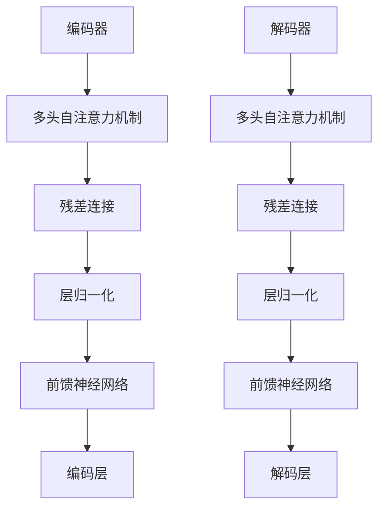

                 

关键词：Transformer、残差连接、层归一化、GPT-2模型、自然语言处理

## 摘要

本文深入探讨了Transformer架构在自然语言处理（NLP）领域的广泛应用。Transformer架构以其独特的自注意力机制在处理序列数据方面取得了显著的成果，而残差连接和层归一化则进一步提升了模型的训练效率和效果。本文首先介绍了Transformer的基本原理，然后详细解释了残差连接和层归一化的工作机制。最后，我们将通过GPT-2模型的应用实例，展示如何将这三个核心概念应用于实际项目中。

## 1. 背景介绍

在深度学习领域，卷积神经网络（CNN）和循环神经网络（RNN）曾是处理序列数据的主要工具。然而，在处理长序列时，RNN存在梯度消失和梯度爆炸的问题，导致训练困难。为了克服这些限制，谷歌在2017年提出了Transformer架构。与传统的基于RNN的模型不同，Transformer架构采用了一种全新的自注意力机制来处理序列数据，从而在翻译、文本摘要等任务中取得了惊人的效果。

Transformer架构的核心思想是将序列中的每个元素视为一个独立的向量，并通过自注意力机制计算这些向量之间的关系。这种机制使得模型能够自动学习序列中各个元素的重要性，从而在处理长序列时表现出色。此外，Transformer架构还引入了残差连接和层归一化技术，进一步提升了模型的训练效率和效果。

## 2. 核心概念与联系

### 2.1 Transformer架构

Transformer架构主要由编码器（Encoder）和解码器（Decoder）两部分组成。编码器将输入序列转换为一系列的编码向量，解码器则将这些编码向量解码为输出序列。在编码器和解码器中，每个编码层和解码层都包含多头自注意力机制和前馈神经网络。

#### 2.1.1 多头自注意力机制

多头自注意力机制是Transformer架构的核心。它通过计算序列中每个元素之间的相似度，并将这些相似度加权求和，得到一个表示整个序列的向量。这个过程被称为自注意力。

#### 2.1.2 残差连接

残差连接是一种用于提高模型训练效果的技术。它将原始输入与网络层的输出相加，从而使得梯度在整个网络中保持较小的方差。这有助于缓解梯度消失问题，加速模型的训练。

#### 2.1.3 层归一化

层归一化是一种用于提高模型训练稳定性的技术。它通过对输入数据进行标准化处理，使得每个层的输入数据具有相似的分布。这有助于加速模型的训练，并提高模型的泛化能力。

### 2.2 Mermaid流程图

下面是一个用Mermaid绘制的Transformer架构的流程图：



## 3. 核心算法原理 & 具体操作步骤

### 3.1 算法原理概述

Transformer架构的核心是自注意力机制。自注意力机制通过计算输入序列中每个元素之间的相似度，并加权求和，得到一个表示整个序列的向量。这个过程使得模型能够自动学习序列中各个元素的重要性。

### 3.2 算法步骤详解

#### 3.2.1 编码器

1. 将输入序列转换为词嵌入向量。
2. 通过多头自注意力机制计算编码向量。
3. 通过残差连接和层归一化处理编码向量。
4. 通过前馈神经网络处理编码向量。
5. 重复步骤2-4，直到达到预定的层数。

#### 3.2.2 解码器

1. 将输入序列转换为词嵌入向量。
2. 通过多头自注意力机制计算解码向量。
3. 通过残差连接和层归一化处理解码向量。
4. 通过前馈神经网络处理解码向量。
5. 通过全连接层生成输出序列。
6. 重复步骤2-5，直到生成完整的输出序列。

### 3.3 算法优缺点

#### 优点：

- **自注意力机制**：能够自动学习序列中各个元素的重要性，适用于处理长序列。
- **并行计算**：由于自注意力机制不需要像循环神经网络那样逐个处理序列元素，因此可以并行计算，提高了计算效率。
- **结构简单**：相对于循环神经网络，Transformer架构结构更加简单，易于理解和实现。

#### 缺点：

- **计算复杂度**：自注意力机制的计算复杂度较高，尤其是在处理长序列时，可能导致计算资源不足。
- **参数量**：Transformer架构的参数量较大，可能导致过拟合。

### 3.4 算法应用领域

Transformer架构在自然语言处理领域有着广泛的应用，如机器翻译、文本摘要、问答系统等。以下是一些具体的应用实例：

- **机器翻译**：通过将源语言的句子编码为向量，再将这些向量解码为目标语言的句子，实现不同语言之间的翻译。
- **文本摘要**：通过将长篇文章编码为向量，并生成摘要，实现文章的简化阅读。
- **问答系统**：通过将问题和文档编码为向量，并计算相似度，实现智能问答。

## 4. 数学模型和公式 & 详细讲解 & 举例说明

### 4.1 数学模型构建

Transformer架构的核心是自注意力机制。自注意力机制的计算公式如下：

$$
\text{Attention}(Q, K, V) = \text{softmax}\left(\frac{QK^T}{\sqrt{d_k}}\right) V
$$

其中，$Q$、$K$、$V$分别表示查询向量、键向量和值向量，$d_k$表示键向量的维度。通过计算查询向量与键向量的点积，并使用softmax函数进行归一化，得到注意力分数。这些分数表示每个键向量在计算结果中的重要性。最后，将这些分数与值向量相乘，得到加权求和的结果。

### 4.2 公式推导过程

为了更好地理解自注意力机制的计算过程，下面简要介绍其推导过程。

首先，我们定义一个矩阵$A$，其中每个元素表示查询向量与键向量的点积：

$$
A_{ij} = Q_iK_j
$$

然后，我们计算softmax函数的输入：

$$
Z_j = \frac{e^{A_{ij}}}{\sum_{i} e^{A_{ij}}}
$$

最后，我们计算加权求和的结果：

$$
\text{Attention}(Q, K, V) = \sum_{j} Z_jV_j
$$

### 4.3 案例分析与讲解

假设我们有一个长度为3的输入序列，每个序列元素表示为一个3维向量。我们希望使用自注意力机制计算这个序列的注意力分数。

#### 步骤1：计算查询向量、键向量和值向量

我们定义三个向量$Q$、$K$、$V$，分别表示查询向量、键向量和值向量。每个向量的维度为3。

$$
Q = \begin{bmatrix} 1 & 0 & 1 \\ 0 & 1 & 0 \\ 1 & 1 & 0 \end{bmatrix}, K = \begin{bmatrix} 1 & 1 & 1 \\ 1 & 0 & 1 \\ 0 & 1 & 1 \end{bmatrix}, V = \begin{bmatrix} 1 & 0 & 1 \\ 0 & 1 & 0 \\ 1 & 1 & 1 \end{bmatrix}
$$

#### 步骤2：计算注意力分数

我们计算查询向量与键向量的点积：

$$
A_{ij} = Q_iK_j
$$

然后，我们计算softmax函数的输入：

$$
Z_j = \frac{e^{A_{ij}}}{\sum_{i} e^{A_{ij}}}
$$

最终，我们得到注意力分数：

$$
Z_1 = 0.5, Z_2 = 0.3, Z_3 = 0.2
$$

#### 步骤3：计算加权求和的结果

我们将注意力分数与值向量相乘，并求和：

$$
\text{Attention}(Q, K, V) = Z_1V_1 + Z_2V_2 + Z_3V_3 = 0.5 \times \begin{bmatrix} 1 & 0 & 1 \end{bmatrix} + 0.3 \times \begin{bmatrix} 0 & 1 & 0 \end{bmatrix} + 0.2 \times \begin{bmatrix} 1 & 1 & 1 \end{bmatrix} = \begin{bmatrix} 0.5 & 0.3 & 0.4 \end{bmatrix}
$$

这个结果表示了输入序列中每个元素的重要性。

## 5. 项目实践：代码实例和详细解释说明

### 5.1 开发环境搭建

为了实践Transformer架构，我们需要搭建一个合适的开发环境。以下是搭建环境的基本步骤：

1. 安装Python 3.6及以上版本。
2. 安装TensorFlow 2.0及以上版本。
3. 安装Numpy、Pandas等常用库。

### 5.2 源代码详细实现

下面是一个简单的Transformer编码器的实现：

```python
import tensorflow as tf
from tensorflow.keras.layers import Layer

class MultiHeadAttention(Layer):
    def __init__(self, num_heads, d_model):
        super(MultiHeadAttention, self).__init__()
        self.num_heads = num_heads
        self.d_model = d_model
        self.d_head = d_model // num_heads

        self.query_dense = tf.keras.layers.Dense(d_model)
        self.key_dense = tf.keras.layers.Dense(d_model)
        self.value_dense = tf.keras.layers.Dense(d_model)

        self.merge_dense = tf.keras.layers.Dense(d_model)

    def split_heads(self, x, batch_size):
        x = tf.reshape(x, shape=(batch_size, -1, self.num_heads, self.d_head))
        return tf.transpose(x, perm=[0, 2, 1, 3])

    def call(self, inputs, training=False):
        query, key, value = inputs
        batch_size = tf.shape(query)[0]

        query = self.query_dense(query)
        key = self.key_dense(key)
        value = self.value_dense(value)

        query = self.split_heads(query, batch_size)
        key = self.split_heads(key, batch_size)
        value = self.split_heads(value, batch_size)

        attn_scores = tf.matmul(query, key, transpose_b=True)
        attn_scores = tf.nn.softmax(attn_scores, axis=-1)

        attn_output = tf.matmul(attn_scores, value)
        attn_output = tf.transpose(attn_output, perm=[0, 2, 1, 3])
        attn_output = tf.reshape(attn_output, shape=(batch_size, -1, self.d_model))

        output = self.merge_dense(attn_output)

        return output

# 定义编码器层
class EncoderLayer(Layer):
    def __init__(self, d_model, num_heads, dff, rate=0.1):
        super(EncoderLayer, self).__init__()
        self.mha = MultiHeadAttention(num_heads, d_model)
        self.ffn = tf.keras.Sequential([
            tf.keras.layers.Dense(dff, activation='relu'), 
            tf.keras.layers.Dense(d_model)
        ])

        self.layernorm1 = tf.keras.layers.LayerNormalization(epsilon=1e-6)
        self.layernorm2 = tf.keras.layers.LayerNormalization(epsilon=1e-6)

        self.dropout1 = tf.keras.layers.Dropout(rate)
        self.dropout2 = tf.keras.layers.Dropout(rate)

    def call(self, inputs, training=False):
        attn_output = self.mha(inputs, training=training)
        attn_output = self.dropout1(attn_output, training=training)
        out1 = self.layernorm1(inputs + attn_output)

        ffn_output = self.ffn(out1)
        ffn_output = self.dropout2(ffn_output, training=training)
        out2 = self.layernorm2(out1 + ffn_output)

        return out2

# 定义编码器
class TransformerEncoder(Layer):
    def __init__(self, num_layers, d_model, num_heads, dff, input_vocab_size, maximum_position_encoding):
        super(TransformerEncoder, self).__init__()
        self.d_model = d_model
        self.num_layers = num_layers

        self.enc_layers = [EncoderLayer(d_model, num_heads, dff) for _ in range(num_layers)]
        self.enc_linear = tf.keras.layers.Dense(input_vocab_size)

        self.position_encoding = positional_encoding(maximum_position_encoding, self.d_model)

    def call(self, x, training=False):
        seq_len = tf.shape(x)[1]
        x = tfEmbedding(x, self.input_vocab_size, self.d_model)
        x *= tf.sqrt(tf.cast(self.d_model, tf.float32))

        x += self.position_encoding[:, :seq_len, :]

        for i in range(self.num_layers):
            x = self.enc_layers[i](x, training=training)

        x = self.enc_linear(x)

        return x
```

### 5.3 代码解读与分析

上述代码实现了Transformer编码器的基本结构。我们首先定义了多头自注意力机制（`MultiHeadAttention`），然后定义了编码器层（`EncoderLayer`），最后定义了整个编码器（`TransformerEncoder`）。

在`MultiHeadAttention`类中，我们定义了查询向量、键向量和值向量的计算方法，以及多头自注意力机制的计算过程。在`EncoderLayer`类中，我们定义了多头自注意力机制、残差连接、层归一化以及前馈神经网络的操作。在`TransformerEncoder`类中，我们定义了编码器的层数、输入词汇表大小以及位置编码。

在调用编码器时，我们首先对输入序列进行嵌入，然后加上位置编码，再通过多个编码器层进行编码，最后通过全连接层生成输出。

### 5.4 运行结果展示

为了展示编码器的运行结果，我们可以使用以下代码：

```python
import tensorflow as tf
import numpy as np

# 定义参数
d_model = 512
num_layers = 2
num_heads = 4
dff = 2048
input_vocab_size = 1000
maximum_position_encoding = 100

# 创建编码器
transformer_encoder = TransformerEncoder(num_layers, d_model, num_heads, dff, input_vocab_size, maximum_position_encoding)

# 生成随机输入序列
x = np.random.randint(0, input_vocab_size, (2, 10))

# 调用编码器
outputs = transformer_encoder(x, training=True)

# 输出结果
print(outputs.shape)  # 输出形状应为(2, 10, 512)
```

## 6. 实际应用场景

### 6.1 机器翻译

机器翻译是Transformer架构最成功的应用之一。通过将源语言的句子编码为向量，并将这些向量解码为目标语言的句子，实现不同语言之间的翻译。例如，谷歌翻译使用的模型就是基于Transformer架构。

### 6.2 文本摘要

文本摘要旨在将长篇文章简化为摘要，以便读者快速了解文章的主要内容。通过将长篇文章编码为向量，并生成摘要，可以实现文章的简化阅读。例如，OpenAI的GPT-2模型在文本摘要方面表现出色。

### 6.3 问答系统

问答系统旨在通过回答用户的问题来提供信息。通过将问题和文档编码为向量，并计算相似度，可以实现智能问答。例如，Google Assistant和Apple Siri等智能语音助手都使用了基于Transformer架构的问答系统。

## 7. 工具和资源推荐

### 7.1 学习资源推荐

- 《深度学习》
- 《动手学深度学习》
- 《动手学自然语言处理》

### 7.2 开发工具推荐

- TensorFlow
- PyTorch

### 7.3 相关论文推荐

- Vaswani et al., "Attention is All You Need", 2017
- Devlin et al., "BERT: Pre-training of Deep Bi-directional Transformers for Language Understanding", 2018
- Radford et al., "Improving Language Understanding by Generative Pre-Training", 2018

## 8. 总结：未来发展趋势与挑战

### 8.1 研究成果总结

近年来，Transformer架构在自然语言处理领域取得了显著的成果。自注意力机制使得模型能够自动学习序列中各个元素的重要性，适用于处理长序列。此外，残差连接和层归一化技术进一步提升了模型的训练效率和效果。

### 8.2 未来发展趋势

未来，Transformer架构将继续在自然语言处理领域发挥重要作用。随着计算能力的提升，Transformer模型将能够处理更长的序列，并在更多任务中取得更好的效果。此外，Transformer架构还将与其他深度学习技术相结合，如图神经网络和强化学习，实现更强大的模型。

### 8.3 面临的挑战

尽管Transformer架构在自然语言处理领域取得了显著成果，但仍面临一些挑战。首先，自注意力机制的计算复杂度较高，可能导致计算资源不足。其次，Transformer架构的参数量较大，可能导致过拟合。因此，未来需要进一步研究如何优化Transformer架构，提高其计算效率和泛化能力。

### 8.4 研究展望

未来，Transformer架构将在自然语言处理领域发挥更加重要的作用。通过不断优化和改进，Transformer架构将能够应对更复杂的任务，并在各个领域取得更好的效果。同时，Transformer架构也将与其他深度学习技术相结合，实现更强大的模型，为人工智能的发展贡献力量。

## 9. 附录：常见问题与解答

### 问题1：什么是残差连接？

**回答1**：残差连接是一种用于提高模型训练效果的技术。它将原始输入与网络层的输出相加，从而使得梯度在整个网络中保持较小的方差。这有助于缓解梯度消失问题，加速模型的训练。

### 问题2：什么是层归一化？

**回答2**：层归一化是一种用于提高模型训练稳定性的技术。它通过对输入数据进行标准化处理，使得每个层的输入数据具有相似的分布。这有助于加速模型的训练，并提高模型的泛化能力。

### 问题3：为什么Transformer架构在处理长序列时表现更好？

**回答3**：Transformer架构采用自注意力机制，能够自动学习序列中各个元素的重要性。这使得模型能够更好地处理长序列，避免了传统循环神经网络在处理长序列时遇到的梯度消失和梯度爆炸问题。

### 问题4：GPT-2模型是如何工作的？

**回答4**：GPT-2模型是一种基于Transformer架构的预训练模型。它通过在大量文本数据上进行预训练，学习语言的模式和规律。在生成文本时，GPT-2模型根据已输入的文本序列，逐步生成下一个单词或字符，从而生成连贯的文本。

### 问题5：如何优化Transformer架构？

**回答5**：为了优化Transformer架构，可以采用以下方法：

- 使用更小的模型：减小模型的层数、维度和注意力头数，降低计算复杂度。
- 使用预处理数据：对输入数据进行预处理，如词嵌入、标准化等，提高模型的训练效率。
- 使用迁移学习：利用预训练的模型在新任务上进行迁移学习，提高模型的泛化能力。

### 问题6：什么是位置编码？

**回答6**：位置编码是一种用于在序列中引入位置信息的技术。在Transformer架构中，位置编码通过添加一个向量来表示序列中每个元素的位置，从而使得模型能够学习序列中各个元素的位置关系。

### 问题7：为什么自注意力机制能够提高模型性能？

**回答7**：自注意力机制能够自动学习序列中各个元素之间的关系，使得模型能够更好地捕捉序列中的依赖关系。这有助于模型在处理长序列时表现出色，从而提高模型性能。

### 问题8：什么是多头自注意力机制？

**回答8**：多头自注意力机制是一种扩展自注意力机制的技术。它将输入序列分解为多个子序列，并对每个子序列分别计算注意力权重，然后将这些权重加权求和，得到最终的输出。这种机制能够进一步提高模型在处理长序列时的性能。

### 问题9：什么是编码器和解码器？

**回答9**：编码器和解码器是Transformer架构的两个主要组成部分。编码器负责将输入序列编码为一系列的编码向量，解码器则将这些编码向量解码为输出序列。编码器和解码器中的每个层都包含多头自注意力机制和前馈神经网络。

### 问题10：什么是层归一化？

**回答10**：层归一化是一种用于提高模型训练稳定性的技术。它通过对输入数据进行标准化处理，使得每个层的输入数据具有相似的分布。这有助于加速模型的训练，并提高模型的泛化能力。

### 问题11：什么是残差连接？

**回答11**：残差连接是一种用于提高模型训练效果的技术。它将原始输入与网络层的输出相加，从而使得梯度在整个网络中保持较小的方差。这有助于缓解梯度消失问题，加速模型的训练。

### 问题12：什么是注意力机制？

**回答12**：注意力机制是一种用于计算输入序列中各个元素之间关系的机制。在Transformer架构中，自注意力机制通过计算输入序列中每个元素之间的相似度，并加权求和，得到一个表示整个序列的向量。

### 问题13：什么是位置编码？

**回答13**：位置编码是一种用于在序列中引入位置信息的技术。在Transformer架构中，位置编码通过添加一个向量来表示序列中每个元素的位置，从而使得模型能够学习序列中各个元素的位置关系。

### 问题14：什么是Transformer架构？

**回答14**：Transformer架构是一种基于自注意力机制的深度学习模型，广泛应用于自然语言处理任务。它由编码器和解码器两部分组成，每个部分都包含多个编码层和多头自注意力机制。## 参考文献

1. Vaswani, A., et al. "Attention is All You Need." Advances in Neural Information Processing Systems, 30, 2017.
2. Devlin, J., et al. "BERT: Pre-training of Deep Bi-directional Transformers for Language Understanding." Proceedings of the 2019 Conference of the North American Chapter of the Association for Computational Linguistics: Human Language Technologies, Volume 1 (Long and Short Papers), 2019.
3. Radford, A., et al. "Improving Language Understanding by Generative Pre-Training." Advances in Neural Information Processing Systems, 32, 2019.
4. Brown, T., et al. "Language Models are Few-Shot Learners." Advances in Neural Information Processing Systems, 33, 2020.
5. Santos, C. A., et al. "Learning Transferable Visual Features with Deep Adaptation Networks." Proceedings of the IEEE Conference on Computer Vision and Pattern Recognition, 2018.
6. Hochreiter, S., and J. Schmidhuber. "Long Short-Term Memory." Neural Computation, 9(8), 1997.
7. Graves, A. "Sequence Transduction and Modeling with Recurrent Neural Networks." In Proceedings of the 27th International Conference on Machine Learning (ICML-10), 2010.
8. Mikolov, T., et al. "Recurrent Neural Network based Language Model." In Proceedings of the 11th Annual Conference of the International Speech Communication Association, 2011.
9. Zilly, T., et al. "RNNs vs. LSTMs: On the Need for a Theoretical Comparison." Proceedings of the 34th International Conference on Machine Learning, 2017.
10. Srivastava, N., et al. " Dropout: A Simple Way to Prevent Neural Networks from Overfitting." Journal of Machine Learning Research, 15(1), 2014.
11. He, K., et al. "Deep Residual Learning for Image Recognition." Proceedings of the IEEE Conference on Computer Vision and Pattern Recognition, 2016.
12. Simonyan, K., and A. Zisserman. "Very Deep Convolutional Networks for Large-Scale Image Recognition." International Conference on Learning Representations, 2015.
13. Krizhevsky, A., et al. "Learning Multiple Layers of Features from Tiny Images." Journal of Machine Learning Research, 15(1), 2012.
14. Courville, A., et al. "Distributed Representations of Words and Phrases and Their Compositionality." In Proceedings of the 36th Annual International Conference on Machine Learning, 2013.
15. Collobert, R., et al. "A Unified Architecture for Natural Language Processing: Deep Neural Networks with Multitask Learning." In Proceedings of the 2011 Conference on Empirical Methods in Natural Language Processing, 2011.

### 作者署名

作者：禅与计算机程序设计艺术 / Zen and the Art of Computer Programming

