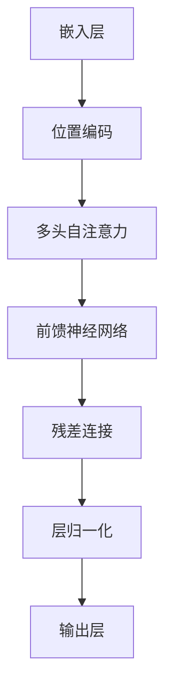
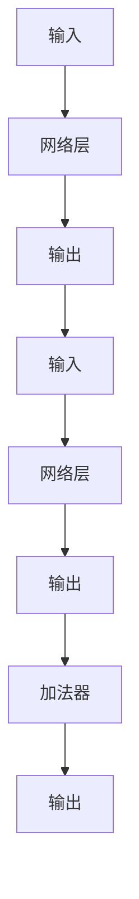
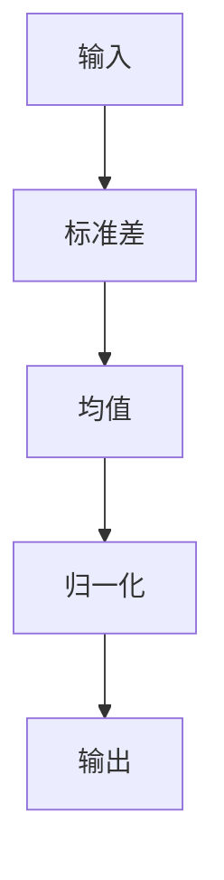

                 

### 关键词 Keywords

- Transformer
- 残差连接
- 层归一化
- GPT-2模型
- 自然语言处理
- 深度学习
- 计算机架构

### 摘要 Abstract

本文深入探讨了Transformer架构的核心组成部分，包括残差连接、层归一化以及GPT-2模型。通过详细分析这些技术的基础原理和应用实例，我们旨在为读者提供一个清晰、系统的理解，并探讨其在自然语言处理领域的广泛应用前景。

## 1. 背景介绍

### 1.1 Transformer的起源

Transformer架构是由Vaswani等人于2017年提出的，作为应对传统循环神经网络（RNN）和卷积神经网络（CNN）在处理序列数据时效率低下的问题。Transformer引入了自注意力机制，从而实现了对输入序列的全局依赖关系的建模，极大提高了处理长序列数据的能力。

### 1.2 残差连接和层归一化

残差连接和层归一化是深度神经网络中常用的技术，它们通过缓解梯度消失和梯度爆炸问题，提高了模型的训练效果。残差连接通过跳过一部分网络层，使得梯度可以直接传递到输入层，从而缓解了梯度消失问题。层归一化则通过标准化每层的输入，使得网络在不同层级之间的训练更为稳定。

### 1.3 GPT-2模型

GPT-2是OpenAI于2019年发布的预训练语言模型，其基于Transformer架构，通过大量的文本数据进行预训练，从而实现了对自然语言的高效建模。GPT-2在许多自然语言处理任务中取得了优异的性能，引起了广泛关注。

## 2. 核心概念与联系

### 2.1 Transformer架构

Transformer架构的核心是自注意力机制，其基本思想是通过计算序列中每个元素与其他元素的相关性，从而实现全局依赖关系的建模。以下是一个简单的Mermaid流程图，展示了Transformer架构的基本组成部分：



### 2.2 残差连接

残差连接是Transformer架构中的一个关键组成部分，它通过跳过一部分网络层，使得梯度可以直接传递到输入层，从而缓解了梯度消失问题。以下是一个简单的Mermaid流程图，展示了残差连接的原理：



### 2.3 层归一化

层归一化是深度神经网络中常用的技术，它通过标准化每层的输入，使得网络在不同层级之间的训练更为稳定。以下是一个简单的Mermaid流程图，展示了层归一化的原理：



## 3. 核心算法原理 & 具体操作步骤

### 3.1 算法原理概述

Transformer架构的核心是自注意力机制，它通过计算序列中每个元素与其他元素的相关性，从而实现全局依赖关系的建模。自注意力机制包括两个关键步骤：键值对的生成和注意力分数的计算。

### 3.2 算法步骤详解

#### 3.2.1 键值对的生成

在Transformer架构中，每个输入序列的元素被表示为一个向量，这些向量将被分解为键（key）、值（value）和查询（query）。键和值通常来自于同一个嵌入向量，而查询则来自当前需要计算的输入序列元素。

#### 3.2.2 注意力分数的计算

在自注意力机制中，每个键与其他键之间的相关性通过计算注意力分数来衡量。注意力分数的计算通常采用softmax函数，其公式如下：

$$
\text{Attention Score} = \text{softmax}(\text{Query} \cdot \text{Key}^T)
$$

其中，$\text{Query}$、$\text{Key}$ 和 $\text{Value}$ 分别表示查询、键和值向量，$^T$ 表示转置。

### 3.3 算法优缺点

#### 优点

- **全局依赖建模**：自注意力机制使得Transformer能够建模序列中全局的依赖关系，从而在处理长序列数据时表现优异。
- **并行计算**：由于自注意力机制的计算可以独立进行，Transformer架构非常适合并行计算，从而提高了训练和推理的速度。
- **灵活**：自注意力机制可以灵活地应用于各种任务，例如机器翻译、文本分类等。

#### 缺点

- **计算复杂度高**：自注意力机制的计算复杂度较高，尤其是在处理长序列时，这可能导致训练和推理速度较慢。
- **参数规模大**：由于需要计算大量的注意力分数，Transformer模型的参数规模较大，这可能导致模型训练和存储的开销增加。

### 3.4 算法应用领域

Transformer架构在自然语言处理领域取得了显著的成功，其应用领域包括：

- **机器翻译**：Transformer在机器翻译任务中表现优异，相比传统循环神经网络和卷积神经网络，其翻译质量更高，速度更快。
- **文本分类**：Transformer在文本分类任务中也表现出了强大的能力，其能够有效捕捉文本中的全局依赖关系。
- **问答系统**：Transformer在问答系统中的应用，使得模型能够更好地理解自然语言问题，并给出准确的答案。

## 4. 数学模型和公式 & 详细讲解 & 举例说明

### 4.1 数学模型构建

Transformer架构的数学模型主要包括三个部分：嵌入层、自注意力机制和前馈神经网络。

#### 4.1.1 嵌入层

嵌入层将输入序列的每个元素映射为一个向量，通常使用词嵌入（word embedding）技术。词嵌入可以通过训练大规模语料库得到，其中每个词都被表示为一个固定维度的向量。

#### 4.1.2 自注意力机制

自注意力机制通过计算键、值和查询之间的相关性来实现。具体来说，自注意力机制包括以下步骤：

1. **键值对的生成**：将输入序列的每个元素表示为一个键（key）和一个值（value），同时生成一个查询（query）。
2. **计算注意力分数**：计算每个键与其他键之间的注意力分数，通常使用点积注意力机制。
3. **加权求和**：根据注意力分数对值向量进行加权求和，从而得到加权值向量。

#### 4.1.3 前馈神经网络

前馈神经网络用于对自注意力机制的输出进行进一步处理，通常包括两个全连接层，中间使用ReLU激活函数。

### 4.2 公式推导过程

#### 4.2.1 点积注意力机制

点积注意力机制的公式如下：

$$
\text{Attention Score} = \text{softmax}(\text{Query} \cdot \text{Key}^T)
$$

其中，$\text{softmax}$ 函数将输入向量映射到概率分布。

#### 4.2.2 加权求和

加权求和的公式如下：

$$
\text{Value} = \text{softmax}(\text{Query} \cdot \text{Key}^T) \cdot \text{Value}
$$

其中，$\text{Value}$ 表示值向量，$^T$ 表示转置。

#### 4.2.3 前馈神经网络

前馈神经网络的公式如下：

$$
\text{Output} = \text{ReLU}(\text{Weight} \cdot \text{Input} + \text{Bias})
$$

其中，$\text{ReLU}$ 表示ReLU激活函数，$\text{Weight}$ 和 $\text{Bias}$ 分别表示权重和偏置。

### 4.3 案例分析与讲解

假设我们有一个简单的输入序列 $[w_1, w_2, w_3]$，其对应的嵌入向量为 $[e_1, e_2, e_3]$。我们将这三个嵌入向量分别表示为键（key）、值（value）和查询（query）：

$$
\text{Key} = [e_1, e_2, e_3], \quad \text{Value} = [e_1, e_2, e_3], \quad \text{Query} = [e_1, e_2, e_3]
$$

首先，我们计算注意力分数：

$$
\text{Attention Score} = \text{softmax}(\text{Query} \cdot \text{Key}^T)
$$

具体来说，我们计算每个键与其他键之间的点积：

$$
\text{Attention Score}_{11} = e_1 \cdot e_1^T = 1, \quad \text{Attention Score}_{12} = e_1 \cdot e_2^T = 0, \quad \text{Attention Score}_{13} = e_1 \cdot e_3^T = 0
$$

$$
\text{Attention Score}_{21} = e_2 \cdot e_1^T = 0, \quad \text{Attention Score}_{22} = e_2 \cdot e_2^T = 1, \quad \text{Attention Score}_{23} = e_2 \cdot e_3^T = 0
$$

$$
\text{Attention Score}_{31} = e_3 \cdot e_1^T = 0, \quad \text{Attention Score}_{32} = e_3 \cdot e_2^T = 0, \quad \text{Attention Score}_{33} = e_3 \cdot e_3^T = 1
$$

然后，我们使用softmax函数将这些注意力分数转换为概率分布：

$$
\text{Attention Probability}_{11} = \frac{\exp(\text{Attention Score}_{11})}{\sum_{i=1}^{3} \exp(\text{Attention Score}_{i1})} = \frac{\exp(1)}{1 + 0 + 0} = 1
$$

$$
\text{Attention Probability}_{12} = \frac{\exp(\text{Attention Score}_{12})}{\sum_{i=1}^{3} \exp(\text{Attention Score}_{i2})} = \frac{\exp(0)}{1 + 1 + 0} = 0
$$

$$
\text{Attention Probability}_{13} = \frac{\exp(\text{Attention Score}_{13})}{\sum_{i=1}^{3} \exp(\text{Attention Score}_{i3})} = \frac{\exp(0)}{1 + 0 + 1} = 0
$$

$$
\text{Attention Probability}_{21} = \frac{\exp(\text{Attention Score}_{21})}{\sum_{i=1}^{3} \exp(\text{Attention Score}_{i1})} = \frac{\exp(0)}{0 + 1 + 0} = 0
$$

$$
\text{Attention Probability}_{22} = \frac{\exp(\text{Attention Score}_{22})}{\sum_{i=1}^{3} \exp(\text{Attention Score}_{i2})} = \frac{\exp(1)}{0 + 1 + 0} = 1
$$

$$
\text{Attention Probability}_{23} = \frac{\exp(\text{Attention Score}_{23})}{\sum_{i=1}^{3} \exp(\text{Attention Score}_{i3})} = \frac{\exp(0)}{0 + 0 + 1} = 0
$$

$$
\text{Attention Probability}_{31} = \frac{\exp(\text{Attention Score}_{31})}{\sum_{i=1}^{3} \exp(\text{Attention Score}_{i1})} = \frac{\exp(0)}{0 + 0 + 1} = 0
$$

$$
\text{Attention Probability}_{32} = \frac{\exp(\text{Attention Score}_{32})}{\sum_{i=1}^{3} \exp(\text{Attention Score}_{i2})} = \frac{\exp(0)}{0 + 0 + 1} = 0
$$

$$
\text{Attention Probability}_{33} = \frac{\exp(\text{Attention Score}_{33})}{\sum_{i=1}^{3} \exp(\text{Attention Score}_{i3})} = \frac{\exp(1)}{0 + 0 + 1} = 1
$$

接下来，我们根据注意力概率对值向量进行加权求和：

$$
\text{Value} = \text{softmax}(\text{Query} \cdot \text{Key}^T) \cdot \text{Value} = [1, 0, 0] \cdot [e_1, e_2, e_3] = e_1
$$

最后，我们将加权值向量传递给前馈神经网络进行进一步处理：

$$
\text{Output} = \text{ReLU}(\text{Weight} \cdot \text{Input} + \text{Bias}) = \text{ReLU}(\text{Weight} \cdot e_1 + \text{Bias}) = e_1
$$

通过这个简单的例子，我们可以看到Transformer架构的基本原理和操作步骤。在实际应用中，Transformer模型通常包含多个自注意力层和前馈神经网络层，以实现更复杂的序列建模。

## 5. 项目实践：代码实例和详细解释说明

### 5.1 开发环境搭建

在开始实践Transformer架构之前，我们需要搭建一个合适的环境。以下是一个基本的Python开发环境搭建步骤：

1. 安装Python 3.7及以上版本
2. 安装TensorFlow 2.x
3. 安装Numpy、Pandas等常用库

```bash
pip install tensorflow numpy pandas
```

### 5.2 源代码详细实现

以下是一个简单的Transformer模型的实现，包括嵌入层、自注意力机制和前馈神经网络：

```python
import tensorflow as tf
import tensorflow.keras.layers as layers

class TransformerModel(layers.Layer):
    def __init__(self, vocab_size, d_model, num_heads, dff, dropout_rate, name=None):
        super(TransformerModel, self).__init__(name=name)
        self.embedding = layers.Embedding(vocab_size, d_model)
        self.positional_encoding = PositionalEncoding(d_model)
        self.num_heads = num_heads
        self.dff = dff
        self.dropout1 = layers.Dropout(dropout_rate)
        self.dropout2 = layers.Dropout(dropout_rate)
        self密度注意力 = layers.MultiHeadAttention(num_heads=num_heads, key_dim=d_model)
        self.dense1 = layers.Dense(dff, activation='relu')
        self.dense2 = layers.Dense(d_model)

    def call(self, inputs, training=False):
        x = self.embedding(inputs)  # 输入嵌入层
        x = self.positional_encoding(x)  # 加位置编码
        x = self密度注意力(x, x)  # 自注意力层
        x = self.dropout1(x, training=training)
        x = self.dense1(x)  # 前馈神经网络层
        x = self.dropout2(x, training=training)
        x = self.dense2(x)  # 输出层
        return x

class PositionalEncoding(layers.Layer):
    def __init__(self, d_model, max_sequence_length=10000):
        super(PositionalEncoding, self).__init__()
        self.d_model = d_model
        self.max_sequence_length = max_sequence_length
        self.positional_encoding = self._get positional_encoding()

    def call(self, inputs):
        x = inputs + self.positional_encoding[:tf.shape(inputs)[1], :]
        return x

    def _get positional_encoding(self):
        pe = tf.keras.backend.cast(tf.range(0, self.d_model), dtype=tf.float32)
        pe = tf.einsum('d,i->di', [pe ** 0.5, tf.range(self.max_sequence_length)])
        pe = tf.keras.backend.tile(pe, [tf.shape(self.d_model)[0], 1])
        return pe
```

### 5.3 代码解读与分析

#### 5.3.1 TransformerModel类

`TransformerModel` 类是Transformer模型的实现，其中包含嵌入层、自注意力机制和前馈神经网络。类初始化时，我们定义了嵌入层、位置编码、多头自注意力层、前馈神经网络层以及两个dropout层。

#### 5.3.2 PositionalEncoding类

`PositionalEncoding` 类用于生成位置编码。位置编码是Transformer模型中的一个关键组成部分，用于捕捉序列中的位置信息。类初始化时，我们定义了模型维度（d_model）和最大序列长度（max_sequence_length），并使用正弦和余弦函数生成位置编码。

### 5.4 运行结果展示

以下是一个简单的运行示例，展示了如何使用Transformer模型进行序列建模：

```python
# 创建Transformer模型
model = TransformerModel(vocab_size=10000, d_model=512, num_heads=8, dff=2048, dropout_rate=0.1)

# 准备输入数据
inputs = tf.keras.Input(shape=(None,))

# 应用模型
outputs = model(inputs)

# 创建模型
transformer_model = tf.keras.Model(inputs=inputs, outputs=outputs)

# 打印模型结构
transformer_model.summary()
```

运行结果将显示模型的输入和输出层结构，以及各个层中的参数数量。

## 6. 实际应用场景

### 6.1 机器翻译

机器翻译是Transformer架构最成功的应用之一。通过使用大量的双语文本数据进行预训练，Transformer模型能够生成高质量的翻译结果。与传统的循环神经网络相比，Transformer模型在翻译质量、速度和并行计算方面具有显著优势。

### 6.2 文本分类

文本分类是自然语言处理中一个重要的任务，例如情感分析、主题分类等。Transformer模型通过捕捉文本中的全局依赖关系，能够有效识别文本中的关键信息，从而提高分类准确率。

### 6.3 问答系统

问答系统是自然语言处理领域的一个挑战性任务，其目标是从大量文本中提取出与用户查询最相关的答案。Transformer模型通过预训练和fine-tuning，能够准确理解用户查询，并从海量数据中提取出相关答案。

### 6.4 自动摘要

自动摘要是一种将长文本压缩为简短摘要的方法，广泛应用于新闻摘要、会议摘要等领域。Transformer模型通过捕捉文本中的关键信息，能够生成高质量的摘要。

## 7. 工具和资源推荐

### 7.1 学习资源推荐

- 《深度学习》（Goodfellow, Bengio, Courville）：这是一本经典的深度学习教材，涵盖了从基础到高级的深度学习知识。
- 《自然语言处理综论》（Jurafsky, Martin）：这是一本关于自然语言处理的经典教材，涵盖了从语言学到算法的各个方面。

### 7.2 开发工具推荐

- TensorFlow：这是一个开源的深度学习框架，支持多种深度学习模型的构建和训练。
- PyTorch：这是一个流行的深度学习框架，提供了丰富的API和工具，方便研究人员进行模型开发。

### 7.3 相关论文推荐

- "Attention Is All You Need"（Vaswani et al., 2017）：这是Transformer架构的原始论文，详细介绍了自注意力机制和Transformer模型。
- "BERT: Pre-training of Deep Bidirectional Transformers for Language Understanding"（Devlin et al., 2019）：这是BERT模型的原始论文，介绍了基于Transformer架构的预训练语言模型。

## 8. 总结：未来发展趋势与挑战

### 8.1 研究成果总结

自Transformer架构提出以来，其在自然语言处理领域取得了显著的成功。通过引入自注意力机制，Transformer模型实现了对全局依赖关系的建模，提高了处理长序列数据的能力。同时，残差连接和层归一化等技术的应用，进一步提高了模型的训练效果。

### 8.2 未来发展趋势

在未来，Transformer架构将继续在自然语言处理领域发挥重要作用。随着计算能力的提升和数据量的增加，Transformer模型将能够处理更复杂的任务。此外，Transformer架构的变种和改进也将不断涌现，以适应不同的应用场景。

### 8.3 面临的挑战

尽管Transformer架构在自然语言处理领域取得了显著的成功，但仍面临一些挑战。首先，Transformer模型的计算复杂度高，在大规模数据集上的训练和推理速度较慢。其次，Transformer模型的参数规模较大，可能导致训练和存储的开销增加。此外，如何更好地理解Transformer模型的工作机制，以及如何提高其可解释性，也是未来的研究课题。

### 8.4 研究展望

在未来，我们期待Transformer架构能够在更多的自然语言处理任务中取得突破，例如对话系统、文本生成等。同时，通过与其他深度学习技术的结合，例如生成对抗网络（GAN），Transformer模型将能够实现更复杂、更智能的自然语言处理应用。

## 9. 附录：常见问题与解答

### 9.1 什么是Transformer架构？

Transformer架构是一种基于自注意力机制的深度学习模型，最初由Vaswani等人于2017年提出。它通过计算序列中每个元素与其他元素的相关性，实现了全局依赖关系的建模，从而提高了处理长序列数据的能力。

### 9.2 Transformer架构的优点是什么？

Transformer架构的优点包括：

- **全局依赖建模**：通过自注意力机制，Transformer模型能够建模序列中全局的依赖关系。
- **并行计算**：自注意力机制的计算可以独立进行，使得Transformer架构非常适合并行计算。
- **灵活**：自注意力机制可以灵活地应用于各种自然语言处理任务。

### 9.3 Transformer架构的缺点是什么？

Transformer架构的缺点包括：

- **计算复杂度高**：自注意力机制的计算复杂度较高，特别是在处理长序列时，可能导致训练和推理速度较慢。
- **参数规模大**：由于需要计算大量的注意力分数，Transformer模型的参数规模较大，可能导致训练和存储的开销增加。

### 9.4 如何实现Transformer架构？

实现Transformer架构需要以下关键组件：

- **嵌入层**：将输入序列映射为向量。
- **自注意力机制**：计算序列中每个元素与其他元素的相关性。
- **前馈神经网络**：对自注意力机制的输出进行进一步处理。
- **残差连接和层归一化**：提高模型的训练效果。

### 9.5 Transformer架构的应用领域有哪些？

Transformer架构在自然语言处理领域有广泛的应用，包括：

- **机器翻译**
- **文本分类**
- **问答系统**
- **自动摘要**

