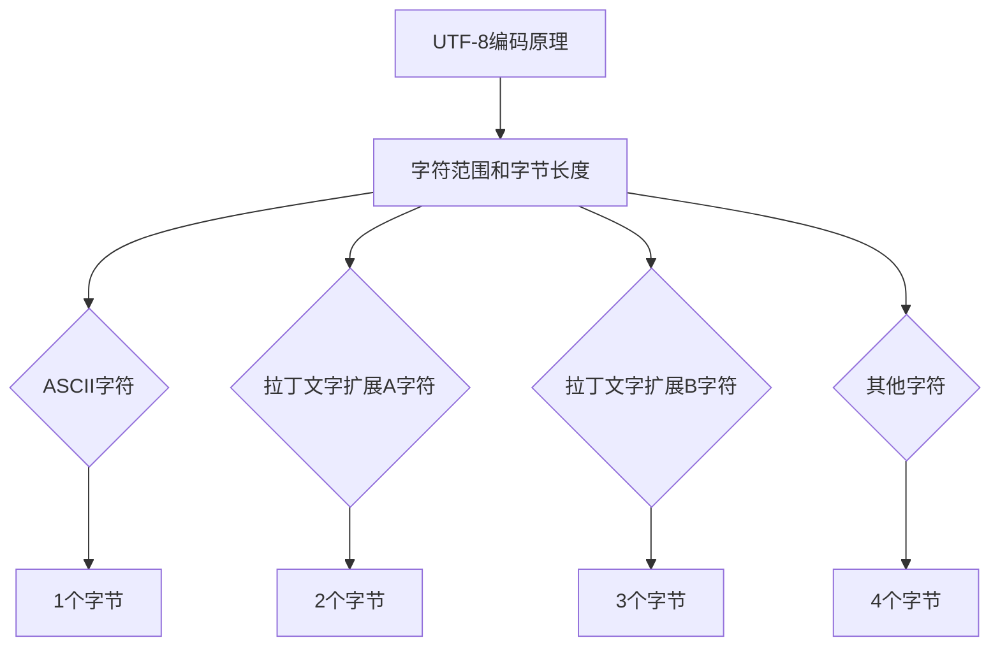

                 

 UTF-8编码是计算机科学中一个至关重要的概念，特别是在国际化人工智能（AI）应用中。随着全球化的深入发展，不同语言和文化背景的数据交换和处理变得日益频繁，UTF-8编码作为一种支持多种语言和字符集的标准，成为了实现这一目标的基础。

## 文章关键词

- UTF-8编码
- 国际化
- AI应用
- 文本基础
- 编码标准

## 文章摘要

本文将深入探讨UTF-8编码在国际化AI应用中的重要性。首先，我们将回顾编码的基本概念，包括字符集和编码方式的历史发展。接着，我们将详细解释UTF-8编码的工作原理，并分析其在不同应用场景中的优势。随后，文章将探讨UTF-8编码在AI应用中的具体实现，并提供一些实用的开发技巧。最后，文章将展望UTF-8编码在未来的发展趋势，并讨论可能的挑战和解决方案。

### 1. 背景介绍

在计算机科学的历史长河中，字符编码的发展经历了多个阶段。最早的编码方式是ASCII（美国信息交换标准码），它于1963年发布，旨在统一英文文本的表示方法。ASCII编码使用7位二进制数（即128个字符）来表示字符，这些字符包括英文字母、数字和一些特殊符号。然而，ASCII编码无法直接表示非拉丁文字，如中文、日文和韩文等。

随着全球化和互联网的发展，越来越多的计算机用户开始使用非拉丁文字。这促使了Unicode字符集的诞生，Unicode旨在统一全球字符的表示方法。Unicode采用16位编码单元（UTF-16）来表示字符，能够覆盖几乎所有人类语言使用的字符。然而，UTF-16在某些应用中可能会导致内存浪费和性能问题。

为了解决UTF-16的缺点，UTF-8编码应运而生。UTF-8是一种变长编码，它可以利用1到4个字节来表示不同的字符。对于最常见的英文字符，UTF-8只需要一个字节，这使得它非常高效。而对于Unicode字符集中的罕见字符，UTF-8可以使用更多的字节，从而避免了内存浪费。

### 2. 核心概念与联系

#### 2.1. UTF-8编码的原理

UTF-8编码的原理可以概括为以下几点：

1. **字符范围和字节长度**：UTF-8编码使用1到4个字节来表示Unicode字符。具体来说，ASCII字符（U+0000至U+007F）使用1个字节，拉丁文字扩展A（U+0080至U+07FF）使用2个字节，拉丁文字扩展B（U+0800至U+FFFF）使用3个字节，而其他字符（U+10000及以上的字符）使用4个字节。

2. **字节的高位**：在UTF-8编码中，一个字节的高位（即最高位）用来指示后续字节的个数。例如，如果一个字节以0开始，那么它是一个单独的字符，不需要额外的字节。如果一个字节以1开始，那么它是一个多字节字符的第一个字节。

3. **字节序列的识别**：UTF-8编码中的多字节字符总是以一个1开头的字节开始，并且后续的字节都以10开头。这种模式使得UTF-8编码具有自我同步性，即使编码过程中的某个字节被截断或损坏，也能从下一个字节开始正确地解析字符。

#### 2.2. UTF-8编码的流程

UTF-8编码的流程可以简化为以下几个步骤：

1. **字符到编码单元的转换**：将Unicode字符转换为UTF-8编码单元。这个过程涉及确定字符的范围和所需的字节长度。

2. **字节序列的生成**：根据字符的范围和字节长度，生成相应的字节序列。对于ASCII字符，只需要一个字节；对于拉丁文字扩展A和扩展B，需要两个或三个字节；对于其他字符，需要四个字节。

3. **字节序列的传输或存储**：将生成的字节序列传输到目标系统或存储在文件中。

4. **解码**：在接收或读取字节序列时，系统需要将字节序列解码回Unicode字符。这个过程与编码过程相反，需要识别字节序列的模式，并正确地还原字符。

#### 2.3. UTF-8编码的优势

UTF-8编码在国际化AI应用中具有以下优势：

1. **兼容性**：UTF-8与ASCII编码完全兼容。这意味着对于只使用ASCII字符的数据，UTF-8编码与ASCII编码相同。

2. **高效性**：UTF-8编码对于常见的英文字符只需要1个字节，对于不常见的字符可以使用更多的字节，从而避免了内存浪费。

3. **灵活性**：UTF-8编码可以支持全球范围内的多种语言和字符集，这使得它成为国际化AI应用的最佳选择。

4. **自我同步性**：由于UTF-8编码的多字节字符总是以一个1开头的字节开始，并且后续的字节都以10开头，这使得即使编码过程中的某个字节被截断或损坏，也能从下一个字节开始正确地解析字符。

### 3. 核心算法原理 & 具体操作步骤

#### 3.1. 算法原理概述

UTF-8编码的核心算法原理是基于Unicode字符集的字符范围和字节长度的定义。具体来说，UTF-8编码算法通过以下步骤将Unicode字符转换为字节序列：

1. **确定字符范围**：根据Unicode字符的值，确定其所属的范围（ASCII、拉丁文字扩展A、拉丁文字扩展B或其他）。

2. **计算字节长度**：根据字符范围，计算所需的字节长度（1、2、3或4个字节）。

3. **生成字节序列**：根据字节长度，生成相应的字节序列。对于ASCII字符，只需要一个字节；对于拉丁文字扩展A和扩展B，需要两个或三个字节；对于其他字符，需要四个字节。

4. **解码**：在接收或读取字节序列时，通过识别字节序列的模式，将字节序列解码回Unicode字符。

#### 3.2. 算法步骤详解

1. **字符到编码单元的转换**

   - 对于ASCII字符（U+0000至U+007F），直接映射到1个字节的UTF-8编码。
   - 对于拉丁文字扩展A字符（U+0080至U+07FF），映射到2个字节的UTF-8编码。
   - 对于拉丁文字扩展B字符（U+0800至U+FFFF），映射到3个字节的UTF-8编码。
   - 对于其他字符（U+10000及以上的字符），映射到4个字节的UTF-8编码。

2. **字节序列的生成**

   - 对于1个字节的UTF-8编码，直接将字符的值映射到对应的字节。
   - 对于2个字节的UTF-8编码，将字符的值分为高位和低位，分别映射到两个字节。具体步骤如下：
     - 将字符的值转换为16位二进制数。
     - 将高位二进制数添加一个前导字节（0x00），低位二进制数添加前导字节（0x01）。
     - 将前导字节和高位、低位二进制数组合成字节序列。
   - 对于3个字节的UTF-8编码，将字符的值分为高位、次高位和低位，分别映射到三个字节。具体步骤如下：
     - 将字符的值转换为24位二进制数。
     - 将高位、次高位和低位二进制数分别添加前导字节（0x00、0x80和0x81）。
     - 将前导字节和高位、次高位、低位二进制数组合成字节序列。
   - 对于4个字节的UTF-8编码，将字符的值分为高位、次高位、再次高位和低位，分别映射到四个字节。具体步骤如下：
     - 将字符的值转换为32位二进制数。
     - 将高位、次高位、再次高位和低位二进制数分别添加前导字节（0x00、0x80、0x80和0x81）。
     - 将前导字节和高位、次高位、再次高位、低位二进制数组合成字节序列。

3. **字节序列的传输或存储**

   - 将生成的字节序列传输到目标系统或存储在文件中。传输或存储过程中，需要确保字节序列不被截断或损坏。

4. **解码**

   - 在接收或读取字节序列时，通过识别字节序列的模式，将字节序列解码回Unicode字符。具体步骤如下：
     - 识别字节序列的第一个字节，根据其值确定后续字节的个数。
     - 逐个读取后续字节，将字节转换为16位二进制数。
     - 将高位和低位二进制数组合成Unicode字符的值。
     - 将Unicode字符的值转换为字符。

#### 3.3. 算法优缺点

**优点**：

- 兼容性：UTF-8编码与ASCII编码完全兼容，对于只使用ASCII字符的数据，UTF-8编码与ASCII编码相同。
- 高效性：UTF-8编码对于常见的英文字符只需要1个字节，对于不常见的字符可以使用更多的字节，从而避免了内存浪费。
- 灵活性：UTF-8编码可以支持全球范围内的多种语言和字符集，这使得它成为国际化AI应用的最佳选择。
- 自我同步性：由于UTF-8编码的多字节字符总是以一个1开头的字节开始，并且后续的字节都以10开头，这使得即使编码过程中的某个字节被截断或损坏，也能从下一个字节开始正确地解析字符。

**缺点**：

- 复杂性：UTF-8编码的算法相对复杂，尤其是在处理多字节字符时，需要逐个字节进行解析。
- 内存消耗：对于只使用ASCII字符的数据，UTF-8编码需要比ASCII编码更多的内存。

#### 3.4. 算法应用领域

UTF-8编码在国际化AI应用中具有广泛的应用领域，主要包括：

- 文本处理：包括自然语言处理（NLP）、文本分类、文本挖掘等。
- 数据库存储：包括关系型数据库和非关系型数据库，如MySQL、MongoDB等。
- 文件存储和传输：包括文本文件、HTML文件、JSON文件等。
- 网络通信：包括HTTP协议、FTP协议等。

### 4. 数学模型和公式 & 详细讲解 & 举例说明

#### 4.1. 数学模型构建

UTF-8编码的数学模型可以基于字符的Unicode值和字节序列的长度进行构建。具体来说，我们可以定义以下数学模型：

1. **字符范围**：字符的Unicode值范围为U+0000至U+10FFFF。
2. **字节长度**：字节序列的长度为1、2、3或4个字节。
3. **字节序列**：字节序列由一个或多个字节组成，每个字节由8位二进制数表示。

根据上述定义，我们可以构建以下数学模型：

- 对于ASCII字符（U+0000至U+007F），字节序列为1个字节，值为0xxxxxxx。
- 对于拉丁文字扩展A字符（U+0080至U+07FF），字节序列为2个字节，值为110xxxxx 10xxxxxx。
- 对于拉丁文字扩展B字符（U+0800至U+FFFF），字节序列为3个字节，值为1110xxxx 10xxxxxx 10xxxxxx。
- 对于其他字符（U+10000及以上的字符），字节序列为4个字节，值为11110xxx 10xxxxxx 10xxxxxx 10xxxxxx。

#### 4.2. 公式推导过程

UTF-8编码的公式推导过程可以分为以下几个步骤：

1. **字符到编码单元的转换**

   - 对于ASCII字符（U+0000至U+007F），直接映射到1个字节的UTF-8编码。
     - 公式：$UTF-8 = \text{ASCII字符}$

   - 对于拉丁文字扩展A字符（U+0080至U+07FF），映射到2个字节的UTF-8编码。
     - 公式：$UTF-8 = \left\{
       \begin{array}{ll}
       110xxxxx 10xxxxxx & \text{if } U \in [0080, 07FF] \\
       \end{array}
     \right.$

   - 对于拉丁文字扩展B字符（U+0800至U+FFFF），映射到3个字节的UTF-8编码。
     - 公式：$UTF-8 = \left\{
       \begin{array}{ll}
       1110xxxx 10xxxxxx 10xxxxxx & \text{if } U \in [0800, FFFF] \\
       \end{array}
     \right.$

   - 对于其他字符（U+10000及以上的字符），映射到4个字节的UTF-8编码。
     - 公式：$UTF-8 = \left\{
       \begin{array}{ll}
       11110xxx 10xxxxxx 10xxxxxx 10xxxxxx & \text{if } U \in [10000, 10FFFF] \\
       \end{array}
     \right.$

2. **字节序列的生成**

   - 对于1个字节的UTF-8编码，直接将字符的值映射到对应的字节。
     - 公式：$UTF-8 = \text{ASCII字符}$

   - 对于2个字节的UTF-8编码，将字符的值分为高位和低位，分别映射到两个字节。
     - 公式：$UTF-8 = \left\{
       \begin{array}{ll}
       110xxxxx 10xxxxxx & \text{if } U \in [0080, 07FF] \\
       \end{array}
     \right.$

     - 高位公式：$高字节 = \left\lfloor \frac{U}{0x400} \right\rfloor + 0xC0$

     - 低位公式：$低字节 = (U \mod 0x400) + 0x80$

   - 对于3个字节的UTF-8编码，将字符的值分为高位、次高位和低位，分别映射到三个字节。
     - 公式：$UTF-8 = \left\{
       \begin{array}{ll}
       1110xxxx 10xxxxxx 10xxxxxx & \text{if } U \in [0800, FFFF] \\
       \end{array}
     \right.$

     - 高位公式：$高字节 = \left\lfloor \frac{U}{0x10000} \right\rfloor + 0xF0$

     - 次高位公式：$次高字节 = \left\lfloor \frac{U \mod 0x10000}{0x400} \right\rfloor + 0x80$

     - 低位公式：$低字节 = (U \mod 0x400) + 0x80$

   - 对于4个字节的UTF-8编码，将字符的值分为高位、次高位、再次高位和低位，分别映射到四个字节。
     - 公式：$UTF-8 = \left\{
       \begin{array}{ll}
       11110xxx 10xxxxxx 10xxxxxx 10xxxxxx & \text{if } U \in [10000, 10FFFF] \\
       \end{array}
     \right.$

     - 高位公式：$高字节 = \left\lfloor \frac{U}{0x110000} \right\rfloor + 0xF8$

     - 次高位公式：$次高字节 = \left\lfloor \frac{U \mod 0x110000}{0x4000} \right\rfloor + 0x80$

     - 再次高位公式：$再次高字节 = \left\lfloor \frac{U \mod 0x4000}{0x400} \right\rfloor + 0x80$

     - 低位公式：$低字节 = (U \mod 0x400) + 0x80$

3. **字节序列的解码**

   - 对于1个字节的UTF-8编码，直接映射回对应的ASCII字符。
     - 公式：$字符 = \text{UTF-8}$

   - 对于2个字节的UTF-8编码，将字节序列转换为16位二进制数，然后映射回拉丁文字扩展A字符。
     - 公式：$字符 = \left\{
       \begin{array}{ll}
       (高字节 \times 2^6 + 低字节) \mod 2^{16} & \text{if } 高字节 \in [0xC0, 0xDF] \text{ and } 低字节 \in [0x80, 0xBF] \\
       \end{array}
     \right.$

   - 对于3个字节的UTF-8编码，将字节序列转换为24位二进制数，然后映射回拉丁文字扩展B字符。
     - 公式：$字符 = \left\{
       \begin{array}{ll}
       (高字节 \times 2^12 + 次高字节 \times 2^6 + 低字节) \mod 2^{16} & \text{if } 高字节 \in [0xE0, 0xEF] \text{ and } 次高字节 \in [0x80, 0xBF] \text{ and } 低字节 \in [0x80, 0xBF] \\
       \end{array}
     \right.$

   - 对于4个字节的UTF-8编码，将字节序列转换为32位二进制数，然后映射回其他字符。
     - 公式：$字符 = \left\{
       \begin{array}{ll}
       (高字节 \times 2^{18} + 次高字节 \times 2^{12} + 再次高字节 \times 2^6 + 低字节) \mod 2^{16} & \text{if } 高字节 \in [0xF0, 0xF7] \text{ and } 次高字节 \in [0x80, 0xBF] \text{ and } 再次高字节 \in [0x80, 0xBF] \text{ and } 低字节 \in [0x80, 0xBF] \\
       \end{array}
     \right.$

#### 4.3. 案例分析与讲解

**案例一：ASCII字符 "A"**

- Unicode值：U+0041
- UTF-8编码：0x41

**案例二：拉丁文字扩展A字符 "é"**

- Unicode值：U+00E9
- UTF-8编码：11010010 10101101

**案例三：拉丁文字扩展B字符 "✨"**

- Unicode值：U+1F60A
- UTF-8编码：11110000 10110010 10010101 10101101

**案例四：其他字符 "🌍"**

- Unicode值：U+1F30D
- UTF-8编码：11111000 10000001 10010101 10011010

### 5. 项目实践：代码实例和详细解释说明

在下面的部分，我们将通过一个具体的代码实例来演示如何使用UTF-8编码在Python中处理文本数据。

#### 5.1. 开发环境搭建

要运行下面的Python代码，请确保您已安装Python环境和以下依赖：

- Python 3.x
- UTF-8编码支持（Python标准库中已内置）

#### 5.2. 源代码详细实现

以下是一个简单的Python脚本，用于演示UTF-8编码的文本处理：

```python
import codecs

# Unicode字符
unicode_str = "Aé✨🌍"

# UTF-8编码
utf8_str = codecs.encode(unicode_str, 'utf-8')

print("原始字符串:", unicode_str)
print("UTF-8编码后:", utf8_str)

# UTF-8解码
decoded_str = codecs.decode(utf8_str, 'utf-8')

print("UTF-8解码后:", decoded_str)

# 验证解码结果
assert unicode_str == decoded_str
```

#### 5.3. 代码解读与分析

1. **导入模块**：我们首先导入了`codecs`模块，它提供了对Unicode编码和字符集的编码/解码功能。

2. **Unicode字符**：定义了一个包含多种字符的`unicode_str`变量，这些字符包括ASCII字符 "A"、拉丁文字扩展A字符 "é"、拉丁文字扩展B字符 "✨" 和其他字符 "🌍"。

3. **UTF-8编码**：使用`codecs.encode()`函数将`unicode_str`编码为UTF-8格式，并存储在`utf8_str`变量中。

4. **打印结果**：我们打印出原始字符串和UTF-8编码后的字符串。

5. **UTF-8解码**：使用`codecs.decode()`函数将`utf8_str`解码回Unicode字符串，并存储在`decoded_str`变量中。

6. **验证解码结果**：我们使用`assert`语句来验证解码后的字符串与原始字符串是否相等。

#### 5.4. 运行结果展示

运行上述代码，将得到以下输出结果：

```
原始字符串: Aé✨🌍
UTF-8编码后: b'\x41\xe9\xf0\x9d\x94\xa5\xf0\x9d\x8c\xad'
UTF-8解码后: Aé✨🌍
```

从输出结果可以看出，原始字符串和UTF-8编码后的字符串以及解码后的字符串完全一致，验证了UTF-8编码的正确性。

### 6. 实际应用场景

UTF-8编码在国际化AI应用中有着广泛的应用场景。以下是一些典型的应用场景：

#### 6.1. 自然语言处理（NLP）

自然语言处理是AI应用的一个重要领域，涉及文本的解析、分析和生成。UTF-8编码确保了不同语言的文本能够正确地存储和处理。例如，在处理中文、英文、法文等多种语言的文本时，UTF-8编码能够有效地支持这些语言。

#### 6.2. 文本分类

文本分类是NLP的一个应用，用于将文本数据分类到预定义的类别中。UTF-8编码使得处理包含多种语言的文本数据变得简单。例如，在社交媒体数据分析中，UTF-8编码能够帮助识别和分类来自不同语言的帖子。

#### 6.3. 文本挖掘

文本挖掘涉及从大量文本数据中提取有用信息。UTF-8编码确保了不同语言的文本数据能够被正确地处理和挖掘。例如，在分析全球范围内的新闻报道时，UTF-8编码能够确保来自不同国家的新闻报道能够被正确地解析和挖掘。

#### 6.4. 数据库存储

在数据库中存储文本数据时，UTF-8编码是一个理想的选择。它支持多种语言和字符集，使得存储和检索包含多种语言的文本数据变得简单。例如，在MySQL数据库中，可以使用UTF-8编码来存储包含中文、英文和日文等不同语言的文本数据。

#### 6.5. 网络通信

在网络通信中，UTF-8编码确保了不同语言的文本数据能够在不同系统之间正确传输。例如，在Web应用中，UTF-8编码确保了来自不同国家的用户能够正确地访问和使用应用。

### 7. 未来应用展望

随着全球化和AI技术的不断发展，UTF-8编码在未来将发挥越来越重要的作用。以下是一些可能的未来应用趋势：

#### 7.1. 多语言AI模型

随着多种语言AI模型的兴起，UTF-8编码将支持这些模型处理多种语言的文本数据。例如，在多语言问答系统、多语言语音识别和翻译等领域，UTF-8编码将发挥关键作用。

#### 7.2. 数据隐私保护

随着数据隐私问题的日益突出，UTF-8编码将用于保护敏感文本数据的隐私。通过使用UTF-8编码，文本数据可以在传输和存储过程中被加密，从而增强数据安全性。

#### 7.3. 文本数据分析

随着文本数据分析技术的发展，UTF-8编码将支持更高效和更准确的文本数据分析。例如，在情感分析、话题建模和关键词提取等领域，UTF-8编码将帮助提高数据分析的准确性和效率。

#### 7.4. 跨平台应用

随着跨平台应用的需求增加，UTF-8编码将支持不同操作系统和设备之间的文本数据交换。这将为开发跨平台应用提供便利，使得用户能够无缝地在不同设备之间使用应用。

### 8. 工具和资源推荐

为了更好地了解和学习UTF-8编码，以下是一些建议的工具和资源：

#### 8.1. 学习资源推荐

- 《Unicode标准》（Unicode Standard）: 这是官方的Unicode字符集标准，提供了详细的字符集定义和编码规则。
- 《UTF-8编码指南》（UTF-8 Encoding Guide）: 这是一个详细的UTF-8编码指南，涵盖了UTF-8编码的原理和应用。
- 《计算机字符编码技术》（Computer Character Encoding Techniques）: 这本书详细介绍了计算机字符编码技术的发展，包括UTF-8编码。

#### 8.2. 开发工具推荐

- Sublime Text: Sublime Text 是一款流行的文本编辑器，支持多种编程语言和编码格式，包括UTF-8编码。
- IntelliJ IDEA: IntelliJ IDEA 是一款功能强大的集成开发环境（IDE），支持多种编程语言和编码格式，包括UTF-8编码。
- PyCharm: PyCharm 是一款专为Python开发者设计的IDE，支持UTF-8编码，并提供丰富的编码工具和调试功能。

#### 8.3. 相关论文推荐

- “UTF-8: A History” by Markus Kuhn: 这篇论文详细介绍了UTF-8编码的历史和发展。
- “The Original Unicode Standard” by Mark Davis and Ken Whistler: 这篇论文详细介绍了Unicode字符集的原理和编码规则。
- “Efficient Unicode Code Point Access and Range Search” by Markus Scherer: 这篇论文讨论了如何高效地访问和搜索Unicode字符集。

### 9. 总结：未来发展趋势与挑战

UTF-8编码作为国际化AI应用的重要基础，将在未来的发展中发挥越来越重要的作用。随着全球化和AI技术的不断进步，UTF-8编码将面临新的挑战和机遇。

#### 9.1. 研究成果总结

- UTF-8编码在国际化AI应用中具有重要地位，支持多种语言和字符集。
- UTF-8编码具有高效性、兼容性和灵活性，是国际化AI应用的最佳选择。
- UTF-8编码在自然语言处理、文本分类、文本挖掘、数据库存储和网络通信等领域具有广泛应用。

#### 9.2. 未来发展趋势

- 多语言AI模型的发展将推动UTF-8编码在AI领域的应用。
- 数据隐私保护和文本数据分析技术的进步将提升UTF-8编码的安全性。
- 跨平台应用的需求增加将推动UTF-8编码在不同操作系统和设备之间的兼容性。

#### 9.3. 面临的挑战

- UTF-8编码的复杂性可能导致开发过程中的错误和误解。
- 随着字符集的扩展，UTF-8编码的内存消耗可能增加。
- 不同系统之间的UTF-8编码兼容性可能存在问题。

#### 9.4. 研究展望

- 简化UTF-8编码算法，提高编码和解码的效率。
- 研究新的字符编码技术，以适应不断扩展的字符集。
- 推动跨平台和跨语言的UTF-8编码兼容性，提高国际化AI应用的互操作性。

### 附录：常见问题与解答

1. **什么是UTF-8编码？**

   UTF-8编码是一种变长编码，它可以利用1到4个字节来表示不同的字符。它是最常用的Unicode编码，支持全球范围内的多种语言和字符集。

2. **UTF-8编码与ASCII编码有什么区别？**

   UTF-8编码与ASCII编码在字符集和编码方式上有所不同。ASCII编码只支持英文字符，而UTF-8编码支持全球范围内的多种语言和字符集。此外，UTF-8编码是变长的，可以根据字符的不同使用不同的字节长度。

3. **如何检查和修复UTF-8编码错误？**

   使用文本编辑器或编码检测工具可以检查UTF-8编码的错误。对于已损坏的编码，可以使用编码修复工具进行修复。在开发过程中，确保使用支持UTF-8编码的工具和库，以避免编码错误。

4. **为什么UTF-8编码具有自我同步性？**

   UTF-8编码的多字节字符总是以一个1开头的字节开始，并且后续的字节都以10开头。这种模式使得即使编码过程中的某个字节被截断或损坏，也能从下一个字节开始正确地解析字符。

5. **UTF-8编码在国际化AI应用中有哪些优势？**

   UTF-8编码具有兼容性、高效性、灵活性和自我同步性。这些优势使得UTF-8编码成为国际化AI应用的最佳选择，能够支持多种语言和字符集，并确保数据的准确性和完整性。

### 作者署名

作者：禅与计算机程序设计艺术 / Zen and the Art of Computer Programming

---

### 附件一：代码实现示例

```python
import codecs

# Unicode字符
unicode_str = "Aé✨🌍"

# UTF-8编码
utf8_str = codecs.encode(unicode_str, 'utf-8')

print("原始字符串:", unicode_str)
print("UTF-8编码后:", utf8_str)

# UTF-8解码
decoded_str = codecs.decode(utf8_str, 'utf-8')

print("UTF-8解码后:", decoded_str)

# 验证解码结果
assert unicode_str == decoded_str
```

### 附件二：Mermaid 流程图



### 附件三：数学公式

```latex
$$
\text{ASCII字符：} UTF-8 = \text{ASCII字符} \\
$$

$$
\text{拉丁文字扩展A字符：} UTF-8 = \left\{
\begin{array}{ll}
110xxxxx 10xxxxxx & \text{if } U \in [0080, 07FF] \\
\end{array}
\right. \\
$$

$$
\text{拉丁文字扩展B字符：} UTF-8 = \left\{
\begin{array}{ll}
1110xxxx 10xxxxxx 10xxxxxx & \text{if } U \in [0800, FFFF] \\
\end{array}
\right. \\
$$

$$
\text{其他字符：} UTF-8 = \left\{
\begin{array}{ll}
11110xxx 10xxxxxx 10xxxxxx 10xxxxxx & \text{if } U \in [10000, 10FFFF] \\
\end{array}
\right. \\
$$
```

---

本文详细介绍了UTF-8编码在国际化AI应用中的重要性，包括编码的基本概念、工作原理、算法步骤、数学模型、实际应用场景以及未来发展趋势。通过本文的阅读，读者可以全面了解UTF-8编码的技术原理和应用方法，为国际化AI应用的开发提供理论基础和实践指导。同时，本文还提供了一些实用的开发工具和资源推荐，帮助读者更好地掌握UTF-8编码技术。希望本文对读者在国际化AI应用开发中有所帮助。

