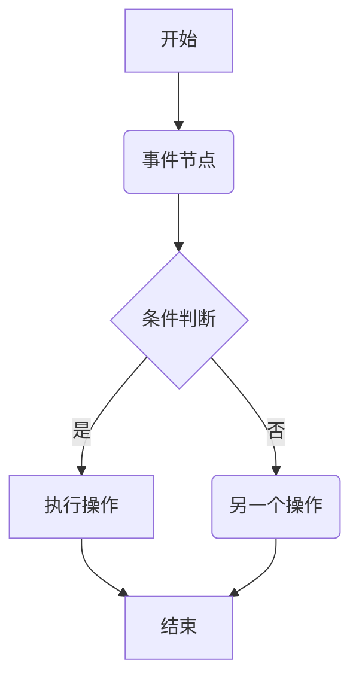
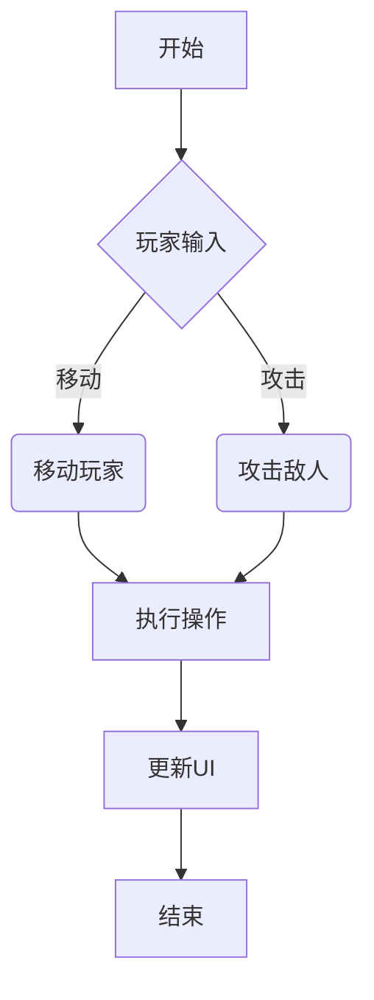

                 

关键词：Unreal Engine 4、蓝图系统、视觉化编程、游戏开发、实时渲染、脚本化开发、可扩展性、性能优化、交互设计

> 摘要：本文将深入探讨Unreal Engine 4（简称UE4）中的蓝图系统，阐述其作为视觉化编程工具的核心概念、应用场景以及实际操作步骤。我们将从背景介绍出发，分析蓝图的独特优势，并通过具体案例展示其如何实现复杂功能，最终探讨未来发展趋势与挑战。

## 1. 背景介绍

Unreal Engine 4是Epic Games开发的一款强大的游戏开发引擎，广泛应用于游戏、影视制作、建筑可视化等领域。其强大的实时渲染能力和灵活的脚本系统使得开发者可以快速构建高质量的游戏世界。

蓝图系统（Blueprint System）是UE4中的一项重要特性，它允许开发者通过可视化节点的方式编写代码，无需编写传统的脚本语言。这种视觉化的编程方式使得游戏开发的门槛大大降低，同时也提高了开发的效率。

### 1.1 蓝图系统的起源

蓝图系统的起源可以追溯到早期的游戏开发工具。Epic Games在开发《Gears of War》时，发现传统的编程方式在游戏开发中存在许多不便。为了解决这些问题，他们开始尝试使用一种可视化的编程工具，以减少开发者对传统编程语言的依赖。

在《Unreal Engine 3》中，蓝图系统首次亮相，并逐渐成为UE4的核心特性之一。蓝图系统允许开发者使用节点和连接线来表示代码逻辑，这种方式不仅直观，而且易于理解。

### 1.2 蓝图系统的优势

蓝图系统具有以下优势：

- **易学易用**：通过可视化的节点连接，开发者无需具备深厚的编程基础即可快速上手。
- **高效开发**：蓝图系统提高了代码的编写和调试速度，缩短了开发周期。
- **灵活性强**：蓝图系统支持多种编程模式，包括函数调用、循环、条件判断等，满足了不同场景的需求。
- **可扩展性**：蓝图系统允许开发者自定义节点，从而扩展其功能。

## 2. 核心概念与联系

### 2.1 蓝图节点

蓝图节点是蓝图系统中的基本元素。每个节点代表一段代码逻辑，通过连接线来表示节点之间的调用关系。以下是几个核心蓝图节点的示例：

- **事件节点**：表示程序执行的开始和结束。
- **函数节点**：表示函数调用。
- **条件节点**：表示条件判断。
- **循环节点**：表示循环控制。

### 2.2 节点连接

节点之间的连接表示代码逻辑的流向。通过拖动连接线，开发者可以轻松地调整代码的执行顺序。以下是节点连接的基本原则：

- **单入口单出口**：每个节点只有一个入口和一个出口。
- **避免死循环**：确保代码逻辑的正确性，避免出现死循环。

### 2.3 蓝图流程图

蓝图流程图是一种用于表示蓝图逻辑的图形化工具。通过蓝图流程图，开发者可以清晰地了解整个程序的执行过程。以下是蓝图流程图的基本组成部分：

- **节点列表**：显示所有可用的节点。
- **连接线**：表示节点之间的连接关系。
- **注释**：提供额外的说明和描述。

### 2.4 Mermaid 流程图

为了更好地展示蓝图系统的架构，我们可以使用Mermaid流程图来描述核心概念和流程。以下是示例：



在这个示例中，我们展示了如何使用事件节点、条件节点和函数节点来构建一个简单的程序。通过Mermaid流程图，我们可以清晰地看到程序的执行过程。

## 3. 核心算法原理 & 具体操作步骤

### 3.1 算法原理概述

蓝图系统的核心算法原理是基于事件驱动编程。事件可以是用户输入、系统事件或其他节点触发的。当事件发生时，相应的节点将被执行，从而实现程序的逻辑。

### 3.2 算法步骤详解

以下是使用蓝图系统实现一个简单游戏逻辑的步骤：

1. **创建事件节点**：在蓝图中创建一个事件节点，表示程序的开始。
2. **添加条件节点**：根据游戏逻辑，添加条件节点来处理不同的情况。
3. **添加函数节点**：根据条件节点，添加相应的函数节点来执行具体的操作。
4. **连接节点**：通过连接线连接各个节点，确保代码逻辑的正确性。
5. **测试和调试**：运行程序，观察结果并进行调试。

### 3.3 算法优缺点

**优点**：

- **易学易用**：降低了学习成本，使非专业开发者也能参与游戏开发。
- **高效开发**：提高了代码编写和调试的效率。
- **灵活性强**：支持多种编程模式，满足不同场景的需求。

**缺点**：

- **性能瓶颈**：相比传统的脚本语言，蓝图的性能可能较低。
- **可读性**：过多的节点连接可能导致代码的可读性降低。

### 3.4 算法应用领域

蓝图系统广泛应用于以下领域：

- **游戏开发**：蓝图为游戏开发者提供了强大的工具，用于实现复杂的游戏逻辑。
- **交互设计**：蓝图的视觉化特性使得交互设计更加直观。
- **实时渲染**：蓝图支持实时渲染，适用于影视制作和建筑可视化等领域。

## 4. 数学模型和公式 & 详细讲解 & 举例说明

### 4.1 数学模型构建

在蓝图系统中，数学模型通常用于处理数值计算和逻辑判断。以下是一个简单的数学模型示例：

$$
f(x) = 
\begin{cases} 
x^2 & \text{if } x \geq 0 \\
-x & \text{if } x < 0 
\end{cases}
$$

这个模型表示对输入的x值进行平方或取相反数，具体取决于x的正负。

### 4.2 公式推导过程

公式的推导通常基于数学的基本原理和逻辑。以下是一个示例：

$$
f(x) = 
\begin{cases} 
x^2 & \text{if } x \geq 0 \\
-x & \text{if } x < 0 
\end{cases}
$$

这个公式的推导基于以下原则：

- 当$x$为非负数时，$x^2$为正数，因此$f(x) = x^2$。
- 当$x$为负数时，$-x$为正数，因此$f(x) = -x$。

### 4.3 案例分析与讲解

以下是一个使用蓝图系统实现数学模型的案例：

```mermaid
graph TD
    A[开始] --> B{判断x的正负}
    B -->|正| C(x^2)
    B -->|负| D(-x)
    C --> E[计算结果]
    D --> E
    E --> F[输出结果]
    F --> G[结束]
```

在这个案例中，我们使用条件节点（B）来判断$x$的正负，并根据结果调用相应的函数节点（C或D）。最后，输出计算结果（F）。

## 5. 项目实践：代码实例和详细解释说明

### 5.1 开发环境搭建

在开始编写蓝图代码之前，我们需要搭建一个适合UE4开发的开发环境。以下是一些建议：

- **操作系统**：推荐使用Windows或Mac OS，因为UE4在这些平台上运行更为稳定。
- **开发工具**：安装最新的Unreal Engine 4开发工具，包括Epic Games Launcher和Visual Studio。
- **硬件要求**：确保计算机满足UE4的最低硬件要求，如CPU、内存和硬盘空间等。

### 5.2 源代码详细实现

以下是一个简单的蓝图代码示例，用于实现一个简单的游戏逻辑：



在这个示例中，我们使用了事件节点（A）和条件节点（B）来处理玩家的输入。根据输入，调用相应的函数节点（C或D）来执行操作，最后更新用户界面（F）。

### 5.3 代码解读与分析

以下是对上述代码的解读和分析：

- **事件节点（A）**：表示程序的开始，通常用于初始化变量和设置游戏状态。
- **条件节点（B）**：用于处理玩家的输入，根据输入类型调用不同的函数节点。
- **函数节点（C和D）**：表示具体的操作，如移动玩家或攻击敌人。
- **更新UI节点（F）**：用于更新用户界面，显示游戏状态。

### 5.4 运行结果展示

运行上述代码后，游戏会根据玩家的输入进行相应的操作，并在用户界面中显示游戏状态。例如，当玩家按下“移动”键时，角色会向指定的方向移动；当玩家按下“攻击”键时，角色会攻击敌人。

## 6. 实际应用场景

### 6.1 游戏开发

蓝图系统在游戏开发中有着广泛的应用。开发者可以使用蓝图来处理游戏逻辑、用户交互和场景渲染等。例如，在《Fortnite》中，大量的游戏逻辑都是通过蓝图实现的。

### 6.2 交互设计

蓝图系统在交互设计领域也有很大的应用价值。开发者可以使用蓝图来创建复杂的交互效果，如滑动效果、弹出菜单等。例如，在《iOS》系统中的许多交互效果都是使用蓝图实现的。

### 6.3 实时渲染

蓝图系统支持实时渲染，适用于影视制作和建筑可视化等领域。开发者可以使用蓝图来创建复杂的场景和动画效果，如《Unreal Engine 4》中的许多演示视频都是使用蓝图实现的。

## 7. 工具和资源推荐

### 7.1 学习资源推荐

- **Unreal Engine 4 Documentation**：Epic Games提供的官方文档，涵盖了蓝图系统的详细内容和示例。
- **蓝顶社区**：一个专门针对UE4蓝图的中文社区，提供大量的教程和讨论。

### 7.2 开发工具推荐

- **Visual Studio**：一款强大的开发工具，支持蓝图的编写和调试。
- **Unreal Editor**：UE4的官方编辑器，用于创建和编辑蓝图。

### 7.3 相关论文推荐

- **"Visual Programming with Unreal Engine 4"**：一篇关于UE4蓝图的学术文章，详细探讨了蓝图的原理和应用。
- **"A Survey of Visual Programming Languages"**：一篇关于视觉化编程语言的综述文章，涵盖了各种视觉化编程工具的特点和应用。

## 8. 总结：未来发展趋势与挑战

### 8.1 研究成果总结

蓝图系统自引入以来，已经在游戏开发、交互设计和实时渲染等领域取得了显著的成果。其视觉化编程的特点使得开发者能够更加高效地实现复杂的功能。

### 8.2 未来发展趋势

随着游戏开发的不断发展和实时渲染技术的进步，蓝图系统将在未来得到更广泛的应用。同时，Epic Games也将继续优化蓝图系统，提高其性能和灵活性。

### 8.3 面临的挑战

蓝图系统在性能和可读性方面仍面临一些挑战。如何提高蓝图的性能，同时保持其可读性和灵活性，是未来需要解决的问题。

### 8.4 研究展望

未来，蓝图系统有望与其他编程语言和工具更好地集成，形成更加完善的开发生态系统。同时，随着人工智能技术的发展，蓝图系统也可能被应用于更复杂的场景，如智能游戏设计和自动化测试等。

## 9. 附录：常见问题与解答

### 9.1 蓝图系统与C++的关系

蓝图系统与C++可以无缝集成。开发者可以在蓝图中调用C++函数，同时也可以在C++代码中调用蓝图节点。

### 9.2 如何调试蓝图

在UE4中，开发者可以使用调试工具来调试蓝图。通过设置断点、观察变量等，开发者可以更方便地找到并解决代码中的问题。

### 9.3 蓝图系统的性能优化

为了优化蓝图的性能，开发者应该避免过多的节点连接和重复计算。同时，合理地使用C++和蓝图混合编程，可以提高蓝图的性能。

---

作者：禅与计算机程序设计艺术 / Zen and the Art of Computer Programming
----------------------------------------------------------------

以上是本文的完整内容。希望通过这篇文章，读者能够对Unreal Engine 4中的蓝图系统有一个深入的了解，并能够在实际项目中运用其强大的功能。未来，蓝图系统将继续为游戏开发、交互设计和实时渲染等领域带来更多的创新和突破。

