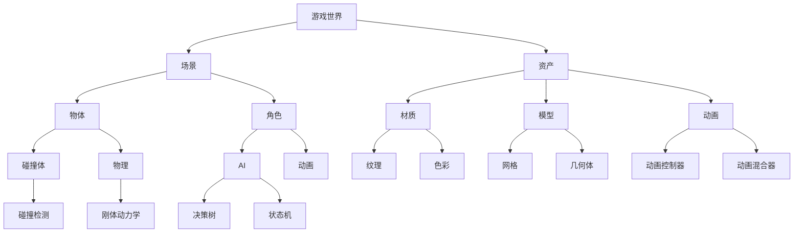

                 

关键词：Unreal Engine、游戏引擎开发、入门教程、3D渲染、蓝图系统、性能优化、虚拟现实、跨平台开发

> 摘要：本文将带领读者从零开始，逐步了解并掌握使用Unreal Engine进行游戏引擎开发的基本知识和技巧。通过本文的阅读，读者将能够搭建一个简单的游戏场景，学习到Unreal Engine的核心概念和功能，并了解到开发过程中的关键技巧和注意事项。

## 1. 背景介绍

Unreal Engine是一款强大的游戏开发引擎，由Epic Games开发并维护。自2002年首次发布以来，它已经在游戏开发领域取得了巨大的成功，被广泛应用于多个游戏项目中。Unreal Engine以其卓越的3D渲染能力、直观的蓝图系统和丰富的工具集而闻名，为开发者提供了极大的灵活性和创作空间。

在过去的几年中，Unreal Engine不断更新和升级，不仅支持传统的2D和3D游戏开发，还扩展到了虚拟现实（VR）和增强现实（AR）领域。它还支持跨平台开发，使得开发者可以在多个平台上发布游戏，从而吸引更多的玩家。

本教程的目标是帮助那些对游戏引擎开发感兴趣的新手，了解并掌握Unreal Engine的基础知识。无论您是游戏开发者、设计师、程序员还是对游戏开发有兴趣的爱好者，这篇文章都将为您提供有用的信息和指导。

## 2. 核心概念与联系

在开始Unreal Engine游戏引擎开发之前，我们需要了解一些核心概念和它们之间的联系。以下是一个使用Mermaid绘制的流程图，用于描述这些核心概念：



### 2.1. 游戏世界与场景

游戏世界是游戏发生的环境，包含了游戏的所有规则和逻辑。场景（Scene）是游戏世界的一个实例，包含了游戏中的所有物体和角色。在Unreal Engine中，每个场景都是一个独立的文件，可以随时保存和加载。

### 2.2. 资产

资产（Assets）是游戏中的可重用资源，包括材质（Materials）、模型（Models）、动画（Animations）等。这些资产可以在多个场景和项目中共享，提高了开发效率和资源利用率。

### 2.3. 物体与角色

物体（Actors）是场景中的基本元素，可以是静态的或动态的。角色（Actors）是一种特殊的物体，具有特定的属性和行为，如移动、互动和AI。

### 2.4. 材质与模型

材质定义了物体的外观，包括颜色、纹理、光泽等。模型（Meshes）是物体的几何形状，由顶点、面和纹理坐标构成。

### 2.5. 动画

动画使物体在游戏中具有动态行为。动画控制器（Animation Controllers）和动画混合器（Animation Mixers）用于管理和混合多个动画，以实现复杂的动画效果。

### 2.6. 碰撞体与物理

碰撞体（Collision Bodies）用于检测物体之间的碰撞。物理（Physics）系统用于处理物体的运动和交互，如重力、碰撞反应等。

### 2.7. AI

人工智能（AI）使角色具有智能行为。决策树（Decision Trees）和状态机（State Machines）是常见的AI控制结构，用于实现复杂的AI逻辑。

## 3. 核心算法原理 & 具体操作步骤

### 3.1. 算法原理概述

Unreal Engine的核心算法包括3D渲染、物理模拟、AI等。以下是对这些算法原理的概述：

### 3.1.1. 3D渲染

3D渲染是将3D模型和场景转换为二维图像的过程。关键算法包括光栅化（Rasterization）、阴影（Shadows）、光照（Lighting）和后处理（Post-Processing）。

### 3.1.2. 物理模拟

物理模拟用于处理物体的运动和碰撞。关键算法包括刚体动力学（Rigid Body Dynamics）、软体动力学（Soft Body Dynamics）和碰撞检测（Collision Detection）。

### 3.1.3. AI

AI算法用于模拟角色的智能行为。常见的算法包括决策树（Decision Trees）、状态机（State Machines）、路径规划（Pathfinding）和行为树（Behavior Trees）。

### 3.2. 算法步骤详解

#### 3.2.1. 3D渲染

1. 准备场景和模型。
2. 进行顶点处理，包括变换、裁剪和投影。
3. 执行光栅化，将顶点转换为像素。
4. 应用材质和纹理。
5. 进行光照计算。
6. 应用后处理效果，如模糊、色彩校正等。

#### 3.2.2. 物理模拟

1. 初始化物理系统。
2. 更新物体位置和速度。
3. 检测碰撞并处理碰撞反应。
4. 应用重力和其他外部力。
5. 更新物理约束，如关节和弹簧。

#### 3.2.3. AI

1. 初始化AI系统。
2. 根据环境和目标，更新角色状态。
3. 应用决策树或状态机，确定角色行为。
4. 更新角色位置和行为。
5. 处理角色与环境的交互。

### 3.3. 算法优缺点

#### 3.3.1. 3D渲染

优点：高真实感、丰富的视觉效果。
缺点：计算量大、对硬件要求高。

#### 3.3.2. 物理模拟

优点：真实的物体运动和碰撞效果。
缺点：计算复杂、性能影响大。

#### 3.3.3. AI

优点：模拟智能行为、提高游戏互动性。
缺点：算法复杂、调试困难。

### 3.4. 算法应用领域

3D渲染：虚拟现实、增强现实、实时渲染。
物理模拟：物理游戏、模拟游戏、运动游戏。
AI：策略游戏、角色扮演游戏、冒险游戏。

## 4. 数学模型和公式 & 详细讲解 & 举例说明

### 4.1. 数学模型构建

在Unreal Engine中，数学模型用于描述物体的几何形状、运动轨迹和物理特性。以下是一些常用的数学模型：

#### 4.1.1. 几何模型

- 点（Point）：描述空间中的位置。
- 线段（Line Segment）：描述两点之间的线段。
- 平面（Plane）：描述无限延伸的平面。
- 球体（Sphere）：描述中心的球体。

#### 4.1.2. 运动模型

- 刚体运动（Rigid Body Motion）：描述刚体的旋转和移动。
- 欧拉角（Euler Angles）：描述刚体的旋转角度。
- 四元数（Quaternions）：用于更高效地描述刚体旋转。

#### 4.1.3. 物理模型

- 质量（Mass）：描述物体的质量。
- 体积（Volume）：描述物体的体积。
- 动量（ Momentum）：描述物体的运动状态。
- 能量（Energy）：描述物体的能量状态。

### 4.2. 公式推导过程

以下是一个简单的物理模型：物体的动能（Kinetic Energy）公式。

动能公式为：\[ KE = \frac{1}{2} m v^2 \]

其中，\( KE \) 表示动能，\( m \) 表示质量，\( v \) 表示速度。

推导过程：

1. 动能是物体由于运动而具有的能量。
2. 物体的速度是质量与加速度的乘积，即 \( v = m \times a \)。
3. 将加速度 \( a \) 替换为 \( v \div m \)，得到 \( v = m \times (v \div m) \)。
4. 将速度 \( v \) 的平方代入动能公式，得到 \( KE = \frac{1}{2} m (m \times (v \div m))^2 \)。
5. 化简得到 \( KE = \frac{1}{2} m v^2 \)。

### 4.3. 案例分析与讲解

#### 4.3.1. 案例背景

假设有一个质量为5千克的物体，以10米/秒的速度水平移动。我们需要计算该物体的动能。

#### 4.3.2. 计算过程

1. 将物体的质量 \( m \) 设为5千克。
2. 将物体的速度 \( v \) 设为10米/秒。
3. 代入动能公式：\[ KE = \frac{1}{2} m v^2 \]。
4. 计算：\[ KE = \frac{1}{2} \times 5 \times 10^2 = \frac{1}{2} \times 5 \times 100 = 250 \text{焦耳} \]。

#### 4.3.3. 结果分析

该物体的动能为250焦耳。这意味着物体在运动过程中具有250焦耳的能量。如果物体与另一个物体发生碰撞，这部分能量可能会转化为其他形式的能量，如热能或声能。

## 5. 项目实践：代码实例和详细解释说明

### 5.1. 开发环境搭建

在开始项目实践之前，我们需要搭建一个适合开发Unreal Engine项目的环境。以下是在Windows系统上搭建开发环境的基本步骤：

1. 下载并安装Visual Studio 2019或更高版本。
2. 下载并安装Epic Games Launcher。
3. 通过Epic Games Launcher下载并安装Unreal Engine 4。
4. 配置Visual Studio与Unreal Engine的集成。

### 5.2. 源代码详细实现

在这个项目中，我们将创建一个简单的3D游戏场景，包含一个可移动的立方体。以下是将立方体移动到屏幕上的源代码实现：

```csharp
// 引入必要的命名空间
using UnityEngine;

public class CubeMovement : MonoBehaviour
{
    public float speed = 5.0f;

    void Update()
    {
        // 获取玩家的输入
        float horizontal = Input.GetAxis("Horizontal");
        float vertical = Input.GetAxis("Vertical");

        // 计算移动方向
        Vector3 direction = new Vector3(horizontal, 0, vertical);

        // 应用移动
        transform.Translate(direction * speed * Time.deltaTime);
    }
}
```

### 5.3. 代码解读与分析

这个脚本用于控制一个立方体的移动。以下是代码的解读和分析：

- 使用`using`语句引入必要的命名空间，以便使用Unity引擎提供的功能。
- `public class CubeMovement : MonoBehaviour`定义了一个名为`CubeMovement`的公共类，该类继承自`MonoBehaviour`类，这是Unity引擎中所有组件的基础。
- `public float speed = 5.0f;`定义了一个名为`speed`的公共字段，用于设置立方体的移动速度。默认值为5.0f。
- `void Update()`是一个Unity引擎中用于每帧更新组件状态的方法。每次游戏循环都会调用这个方法。
- `float horizontal = Input.GetAxis("Horizontal");`和`float vertical = Input.GetAxis("Vertical");`分别获取玩家的水平方向和垂直方向的输入。
- `Vector3 direction = new Vector3(horizontal, 0, vertical);`创建一个三维向量，表示移动方向。
- `transform.Translate(direction * speed * Time.deltaTime);`将立方体沿移动方向移动一段距离。`direction * speed * Time.deltaTime`计算每次移动的距离，`Time.deltaTime`确保移动与帧率无关。

### 5.4. 运行结果展示

将这段脚本添加到一个立方体对象上，并启动游戏。玩家将能够通过键盘上的左右箭头和上下箭头控制立方体的移动。立方体会以每秒5米的速度向对应的方向移动。这个简单的例子展示了如何使用Unreal Engine的脚本系统来控制游戏对象的运动。

## 6. 实际应用场景

### 6.1. 虚拟现实游戏开发

虚拟现实（VR）游戏开发是Unreal Engine的强项之一。利用Unreal Engine的3D渲染能力和虚拟现实支持，开发者可以创建沉浸式的游戏体验。例如，VR游戏《Beat Saber》就是使用Unreal Engine开发的，它提供了令人兴奋的节奏游戏体验。

### 6.2. 教育和培训应用

Unreal Engine不仅可以用于娱乐游戏，还可以用于教育和培训领域。通过创建交互式的3D场景，开发者可以为学生提供丰富的学习体验。例如，医学教育中可以使用3D解剖模型来帮助学生更好地理解人体结构。

### 6.3. 建筑和设计模拟

建筑设计师和城市规划师可以利用Unreal Engine来创建真实感强的建筑和城市模拟。这些模拟可以帮助设计师在项目开发过程中更好地评估设计方案的可行性和效果。

### 6.4. 未来应用展望

随着技术的不断进步，Unreal Engine在未来还有许多潜在的应用场景。例如，虚拟现实和增强现实将进一步融入日常生活，为教育、医疗、娱乐等领域带来革命性的变化。此外，Unreal Engine的跨平台特性将使开发者能够更轻松地将游戏和模拟应用发布到多个平台，从而吸引更多的用户。

## 7. 工具和资源推荐

### 7.1. 学习资源推荐

- Unreal Engine官方文档：提供了丰富的教程、API参考和最佳实践。
- Udemy和Coursera等在线课程平台：提供了大量的Unreal Engine教程和课程。
- GitHub：有很多开源的Unreal Engine项目和示例代码，可以供学习和参考。

### 7.2. 开发工具推荐

- Visual Studio：官方推荐的集成开发环境（IDE），支持C++和蓝图系统。
- Unity：另一个流行的游戏开发引擎，可以与Unreal Engine相互补充。

### 7.3. 相关论文推荐

- “Unreal Engine 4 Architecture Overview”：详细介绍了Unreal Engine 4的架构和设计原则。
- “Ray Tracing in Unreal Engine 4”：介绍了如何使用光线追踪技术提高3D渲染质量。

## 8. 总结：未来发展趋势与挑战

### 8.1. 研究成果总结

本文介绍了Unreal Engine的基础知识和核心概念，包括游戏世界、场景、资产、物体、角色、材质、模型、动画、碰撞体、物理、AI等。通过具体案例和实践，读者可以了解如何使用Unreal Engine进行游戏引擎开发，并掌握了一些关键技巧和注意事项。

### 8.2. 未来发展趋势

Unreal Engine在未来将继续在虚拟现实、增强现实、跨平台开发等领域发挥重要作用。随着技术的进步，Unreal Engine的功能和性能将得到进一步提升，为开发者提供更强大的创作工具和平台。

### 8.3. 面临的挑战

尽管Unreal Engine具有许多优势，但它也面临着一些挑战。例如，3D渲染和物理模拟的复杂性和计算量对硬件要求较高，可能会导致性能瓶颈。此外，AI算法的复杂性和调试困难也是开发者需要关注的问题。

### 8.4. 研究展望

未来的研究可以集中在以下几个方面：优化3D渲染和物理模拟算法以提高性能，开发更智能和高效的AI算法，以及探索新的应用场景，如数字孪生、虚拟制作等。

## 9. 附录：常见问题与解答

### 9.1. 如何在Unreal Engine中创建一个场景？

在Unreal Engine中，可以按以下步骤创建一个场景：

1. 打开Unreal Engine编辑器。
2. 在菜单栏中选择“File” > “New” > “Scene”。
3. 在弹出的窗口中输入场景名称，选择保存位置，然后点击“Create”。
4. 新场景创建后，可以在场景视图中添加和编辑物体。

### 9.2. 如何在Unreal Engine中编写蓝图脚本？

在Unreal Engine中，可以按以下步骤编写蓝图脚本：

1. 打开Unreal Engine编辑器。
2. 在场景中选择一个物体，如角色或摄像机。
3. 在细节面板中找到“Script”选项，点击“New Script”按钮。
4. 选择要使用的编程语言（如C++或蓝图），然后编写脚本代码。
5. 编写完成后，保存脚本并关闭编辑器。

### 9.3. 如何优化Unreal Engine游戏的性能？

要优化Unreal Engine游戏的性能，可以采取以下措施：

1. 减少场景中的物体数量。
2. 使用LOD（细节层次）技术。
3. 关闭不需要的后处理效果。
4. 优化3D模型和纹理。
5. 使用异步加载和卸载场景。

作者：禅与计算机程序设计艺术 / Zen and the Art of Computer Programming
----------------------------------------------------------------
### 结语

通过本文，我们深入探讨了Unreal Engine游戏引擎开发的基础知识和核心概念。从场景和资产的管理，到3D渲染、物理模拟和AI算法的应用，读者应该对Unreal Engine有了更全面的认识。同时，通过项目实践和代码实例，读者可以实际操作并掌握游戏引擎开发的基本技能。

Unreal Engine作为一款功能强大且灵活的游戏引擎，具有广泛的应用前景。未来，随着虚拟现实和增强现实技术的不断发展，Unreal Engine将迎来更多的创新和应用场景。然而，这也带来了新的挑战，如优化性能和开发高效的AI算法等。

为了更好地掌握Unreal Engine，我们推荐读者进一步学习官方文档和在线教程，实践更多的项目，并不断探索新的技术。希望本文能够为您的游戏开发之旅提供有益的指导和启示。祝您在Unreal Engine的世界中探索出属于自己的精彩作品！
----------------------------------------------------------------
# Unreal Engine游戏引擎开发入门

关键词：Unreal Engine、游戏引擎开发、入门教程、3D渲染、蓝图系统、性能优化、虚拟现实、跨平台开发

摘要：本文将带领读者从零开始，逐步了解并掌握使用Unreal Engine进行游戏引擎开发的基本知识和技巧。通过本文的阅读，读者将能够搭建一个简单的游戏场景，学习到Unreal Engine的核心概念和功能，并了解到开发过程中的关键技巧和注意事项。

## 1. 背景介绍

Unreal Engine是一款强大的游戏开发引擎，由Epic Games开发并维护。自2002年首次发布以来，它已经在游戏开发领域取得了巨大的成功，被广泛应用于多个游戏项目中。Unreal Engine以其卓越的3D渲染能力、直观的蓝图系统和丰富的工具集而闻名，为开发者提供了极大的灵活性和创作空间。

在过去的几年中，Unreal Engine不断更新和升级，不仅支持传统的2D和3D游戏开发，还扩展到了虚拟现实（VR）和增强现实（AR）领域。它还支持跨平台开发，使得开发者可以在多个平台上发布游戏，从而吸引更多的玩家。

本教程的目标是帮助那些对游戏引擎开发感兴趣的新手，了解并掌握Unreal Engine的基础知识。无论您是游戏开发者、设计师、程序员还是对游戏开发有兴趣的爱好者，这篇文章都将为您提供有用的信息和指导。

## 2. 核心概念与联系

在开始Unreal Engine游戏引擎开发之前，我们需要了解一些核心概念和它们之间的联系。以下是一个使用Mermaid绘制的流程图，用于描述这些核心概念：


### 2.1. 游戏世界与场景

游戏世界是游戏发生的环境，包含了游戏的所有规则和逻辑。场景（Scene）是游戏世界的一个实例，包含了游戏中的所有物体和角色。在Unreal Engine中，每个场景都是一个独立的文件，可以随时保存和加载。

### 2.2. 资产

资产（Assets）是游戏中的可重用资源，包括材质（Materials）、模型（Models）、动画（Animations）等。这些资产可以在多个场景和项目中共享，提高了开发效率和资源利用率。

### 2.3. 物体与角色

物体（Actors）是场景中的基本元素，可以是静态的或动态的。角色（Actors）是一种特殊的物体，具有特定的属性和行为，如移动、互动和AI。

### 2.4. 材质与模型

材质定义了物体的外观，包括颜色、纹理、光泽等。模型（Meshes）是物体的几何形状，由顶点、面和纹理坐标构成。

### 2.5. 动画

动画使物体在游戏中具有动态行为。动画控制器（Animation Controllers）和动画混合器（Animation Mixers）用于管理和混合多个动画，以实现复杂的动画效果。

### 2.6. 碰撞体与物理

碰撞体（Collision Bodies）用于检测物体之间的碰撞。物理（Physics）系统用于处理物体的运动和交互，如重力、碰撞反应等。

### 2.7. AI

人工智能（AI）使角色具有智能行为。决策树（Decision Trees）和状态机（State Machines）是常见的AI控制结构，用于实现复杂的AI逻辑。

## 3. 核心算法原理 & 具体操作步骤

### 3.1. 算法原理概述

Unreal Engine的核心算法包括3D渲染、物理模拟、AI等。以下是对这些算法原理的概述：

### 3.1.1. 3D渲染

3D渲染是将3D模型和场景转换为二维图像的过程。关键算法包括光栅化（Rasterization）、阴影（Shadows）、光照（Lighting）和后处理（Post-Processing）。

### 3.1.2. 物理模拟

物理模拟用于处理物体的运动和碰撞。关键算法包括刚体动力学（Rigid Body Dynamics）、软体动力学（Soft Body Dynamics）和碰撞检测（Collision Detection）。

### 3.1.3. AI

AI算法用于模拟角色的智能行为。常见的算法包括决策树（Decision Trees）、状态机（State Machines）、路径规划（Pathfinding）和行为树（Behavior Trees）。

### 3.2. 算法步骤详解

#### 3.2.1. 3D渲染

1. 准备场景和模型。
2. 进行顶点处理，包括变换、裁剪和投影。
3. 执行光栅化，将顶点转换为像素。
4. 应用材质和纹理。
5. 进行光照计算。
6. 应用后处理效果，如模糊、色彩校正等。

#### 3.2.2. 物理模拟

1. 初始化物理系统。
2. 更新物体位置和速度。
3. 检测碰撞并处理碰撞反应。
4. 应用重力和其他外部力。
5. 更新物理约束，如关节和弹簧。

#### 3.2.3. AI

1. 初始化AI系统。
2. 根据环境和目标，更新角色状态。
3. 应用决策树或状态机，确定角色行为。
4. 更新角色位置和行为。
5. 处理角色与环境的交互。

### 3.3. 算法优缺点

#### 3.3.1. 3D渲染

优点：高真实感、丰富的视觉效果。

缺点：计算量大、对硬件要求高。

#### 3.3.2. 物理模拟

优点：真实的物体运动和碰撞效果。

缺点：计算复杂、性能影响大。

#### 3.3.3. AI

优点：模拟智能行为、提高游戏互动性。

缺点：算法复杂、调试困难。

### 3.4. 算法应用领域

3D渲染：虚拟现实、增强现实、实时渲染。

物理模拟：物理游戏、模拟游戏、运动游戏。

AI：策略游戏、角色扮演游戏、冒险游戏。

## 4. 数学模型和公式 & 详细讲解 & 举例说明

### 4.1. 数学模型构建

在Unreal Engine中，数学模型用于描述物体的几何形状、运动轨迹和物理特性。以下是一些常用的数学模型：

#### 4.1.1. 几何模型

- 点（Point）：描述空间中的位置。
- 线段（Line Segment）：描述两点之间的线段。
- 平面（Plane）：描述无限延伸的平面。
- 球体（Sphere）：描述中心的球体。

#### 4.1.2. 运动模型

- 刚体运动（Rigid Body Motion）：描述刚体的旋转和移动。
- 欧拉角（Euler Angles）：描述刚体的旋转角度。
- 四元数（Quaternions）：用于更高效地描述刚体旋转。

#### 4.1.3. 物理模型

- 质量（Mass）：描述物体的质量。
- 体积（Volume）：描述物体的体积。
- 动量（ Momentum）：描述物体的运动状态。
- 能量（Energy）：描述物体的能量状态。

### 4.2. 公式推导过程

以下是一个简单的物理模型：物体的动能（Kinetic Energy）公式。

动能公式为：\[ KE = \frac{1}{2} m v^2 \]

其中，\( KE \) 表示动能，\( m \) 表示质量，\( v \) 表示速度。

推导过程：

1. 动能是物体由于运动而具有的能量。
2. 物体的速度是质量与加速度的乘积，即 \( v = m \times a \)。
3. 将加速度 \( a \) 替换为 \( v \div m \)，得到 \( v = m \times (v \div m) \)。
4. 将速度 \( v \) 的平方代入动能公式，得到 \( KE = \frac{1}{2} m (m \times (v \div m))^2 \)。
5. 化简得到 \( KE = \frac{1}{2} m v^2 \)。

### 4.3. 案例分析与讲解

#### 4.3.1. 案例背景

假设有一个质量为5千克的物体，以10米/秒的速度水平移动。我们需要计算该物体的动能。

#### 4.3.2. 计算过程

1. 将物体的质量 \( m \) 设为5千克。
2. 将物体的速度 \( v \) 设为10米/秒。
3. 代入动能公式：\[ KE = \frac{1}{2} m v^2 \]。
4. 计算：\[ KE = \frac{1}{2} \times 5 \times 10^2 = \frac{1}{2} \times 5 \times 100 = 250 \text{焦耳} \]。

#### 4.3.3. 结果分析

该物体的动能为250焦耳。这意味着物体在运动过程中具有250焦耳的能量。如果物体与另一个物体发生碰撞，这部分能量可能会转化为其他形式的能量，如热能或声能。

## 5. 项目实践：代码实例和详细解释说明

### 5.1. 开发环境搭建

在开始项目实践之前，我们需要搭建一个适合开发Unreal Engine项目的环境。以下是在Windows系统上搭建开发环境的基本步骤：

1. 下载并安装Visual Studio 2019或更高版本。
2. 下载并安装Epic Games Launcher。
3. 通过Epic Games Launcher下载并安装Unreal Engine 4。
4. 配置Visual Studio与Unreal Engine的集成。

### 5.2. 源代码详细实现

在这个项目中，我们将创建一个简单的3D游戏场景，包含一个可移动的立方体。以下是将立方体移动到屏幕上的源代码实现：

```csharp
// 引入必要的命名空间
using UnityEngine;

public class CubeMovement : MonoBehaviour
{
    public float speed = 5.0f;

    void Update()
    {
        // 获取玩家的输入
        float horizontal = Input.GetAxis("Horizontal");
        float vertical = Input.GetAxis("Vertical");

        // 计算移动方向
        Vector3 direction = new Vector3(horizontal, 0, vertical);

        // 应用移动
        transform.Translate(direction * speed * Time.deltaTime);
    }
}
```

### 5.3. 代码解读与分析

这个脚本用于控制一个立方体的移动。以下是代码的解读和分析：

- 使用`using`语句引入必要的命名空间，以便使用Unity引擎提供的功能。
- `public class CubeMovement : MonoBehaviour`定义了一个名为`CubeMovement`的公共类，该类继承自`MonoBehaviour`类，这是Unity引擎中所有组件的基础。
- `public float speed = 5.0f;`定义了一个名为`speed`的公共字段，用于设置立方体的移动速度。默认值为5.0f。
- `void Update()`是一个Unity引擎中用于每帧更新组件状态的方法。每次游戏循环都会调用这个方法。
- `float horizontal = Input.GetAxis("Horizontal");`和`float vertical = Input.GetAxis("Vertical");`分别获取玩家的水平方向和垂直方向的输入。
- `Vector3 direction = new Vector3(horizontal, 0, vertical);`创建一个三维向量，表示移动方向。
- `transform.Translate(direction * speed * Time.deltaTime);`将立方体沿移动方向移动一段距离。`direction * speed * Time.deltaTime`计算每次移动的距离，`Time.deltaTime`确保移动与帧率无关。

### 5.4. 运行结果展示

将这段脚本添加到一个立方体对象上，并启动游戏。玩家将能够通过键盘上的左右箭头和上下箭头控制立方体的移动。立方体会以每秒5米的速度向对应的方向移动。这个简单的例子展示了如何使用Unreal Engine的脚本系统来控制游戏对象的运动。

## 6. 实际应用场景

### 6.1. 虚拟现实游戏开发

虚拟现实（VR）游戏开发是Unreal Engine的强项之一。利用Unreal Engine的3D渲染能力和虚拟现实支持，开发者可以创建沉浸式的游戏体验。例如，VR游戏《Beat Saber》就是使用Unreal Engine开发的，它提供了令人兴奋的节奏游戏体验。

### 6.2. 教育和培训应用

Unreal Engine不仅可以用于娱乐游戏，还可以用于教育和培训领域。通过创建交互式的3D场景，开发者可以为学生提供丰富的学习体验。例如，医学教育中可以使用3D解剖模型来帮助学生更好地理解人体结构。

### 6.3. 建筑和设计模拟

建筑设计师和城市规划师可以利用Unreal Engine来创建真实感强的建筑和城市模拟。这些模拟可以帮助设计师在项目开发过程中更好地评估设计方案的可行性和效果。

### 6.4. 未来应用展望

随着技术的不断进步，Unreal Engine在未来还有许多潜在的应用场景。例如，虚拟现实和增强现实将进一步融入日常生活，为教育、医疗、娱乐等领域带来革命性的变化。此外，Unreal Engine的跨平台特性将使开发者能够更轻松地将游戏和模拟应用发布到多个平台，从而吸引更多的用户。

## 7. 工具和资源推荐

### 7.1. 学习资源推荐

- Unreal Engine官方文档：提供了丰富的教程、API参考和最佳实践。
- Udemy和Coursera等在线课程平台：提供了大量的Unreal Engine教程和课程。
- GitHub：有很多开源的Unreal Engine项目和示例代码，可以供学习和参考。

### 7.2. 开发工具推荐

- Visual Studio：官方推荐的集成开发环境（IDE），支持C++和蓝图系统。
- Unity：另一个流行的游戏开发引擎，可以与Unreal Engine相互补充。

### 7.3. 相关论文推荐

- “Unreal Engine 4 Architecture Overview”：详细介绍了Unreal Engine 4的架构和设计原则。
- “Ray Tracing in Unreal Engine 4”：介绍了如何使用光线追踪技术提高3D渲染质量。

## 8. 总结：未来发展趋势与挑战

### 8.1. 研究成果总结

本文介绍了Unreal Engine的基础知识和核心概念，包括游戏世界、场景、资产、物体、角色、材质、模型、动画、碰撞体、物理、AI等。通过具体案例和实践，读者可以了解如何使用Unreal Engine进行游戏引擎开发，并掌握了一些关键技巧和注意事项。

### 8.2. 未来发展趋势

Unreal Engine在未来将继续在虚拟现实、增强现实、跨平台开发等领域发挥重要作用。随着技术的进步，Unreal Engine的功能和性能将得到进一步提升，为开发者提供更强大的创作工具和平台。

### 8.3. 面临的挑战

尽管Unreal Engine具有许多优势，但它也面临着一些挑战。例如，3D渲染和物理模拟的复杂性和计算量对硬件要求较高，可能会导致性能瓶颈。此外，AI算法的复杂性和调试困难也是开发者需要关注的问题。

### 8.4. 研究展望

未来的研究可以集中在以下几个方面：优化3D渲染和物理模拟算法以提高性能，开发更智能和高效的AI算法，以及探索新的应用场景，如数字孪生、虚拟制作等。

## 9. 附录：常见问题与解答

### 9.1. 如何在Unreal Engine中创建一个场景？

在Unreal Engine中，可以按以下步骤创建一个场景：

1. 打开Unreal Engine编辑器。
2. 在菜单栏中选择“File” > “New” > “Scene”。
3. 在弹出的窗口中输入场景名称，选择保存位置，然后点击“Create”。
4. 新场景创建后，可以在场景视图中添加和编辑物体。

### 9.2. 如何在Unreal Engine中编写蓝图脚本？

在Unreal Engine中，可以按以下步骤编写蓝图脚本：

1. 打开Unreal Engine编辑器。
2. 在场景中选择一个物体，如角色或摄像机。
3. 在细节面板中找到“Script”选项，点击“New Script”按钮。
4. 选择要使用的编程语言（如C++或蓝图），然后编写脚本代码。
5. 编写完成后，保存脚本并关闭编辑器。

### 9.3. 如何优化Unreal Engine游戏的性能？

要优化Unreal Engine游戏的性能，可以采取以下措施：

1. 减少场景中的物体数量。
2. 使用LOD（细节层次）技术。
3. 关闭不需要的后处理效果。
4. 优化3D模型和纹理。
5. 使用异步加载和卸载场景。

作者：禅与计算机程序设计艺术 / Zen and the Art of Computer Programming
--------------------------------------------------------------------

