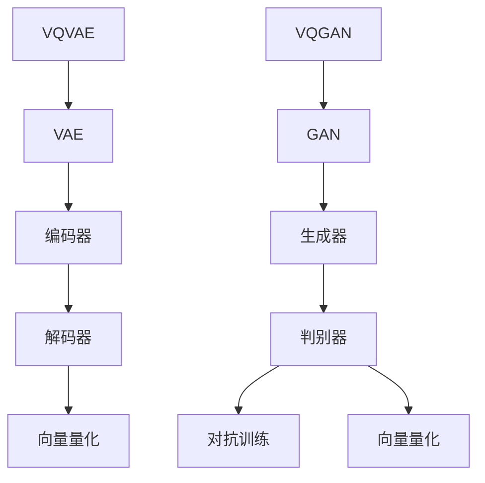

                 

关键词：VQVAE, VQGAN, 图像生成，变分自编码器，生成对抗网络，深度学习，机器学习

摘要：本文将深入探讨 VQVAE 和 VQGAN 这两种深度学习模型在图像生成领域的应用，通过分析其基本概念、核心原理、算法结构以及具体实现，揭示两者在性能和效果上的差异。文章旨在为研究人员和开发者提供有价值的参考，以更好地理解和应用这些先进的图像生成技术。

## 1. 背景介绍

图像生成作为深度学习领域的一个研究热点，一直是人工智能研究的重要方向。从最初的朴素生成模型到复杂的深度生成模型，图像生成技术在不断提升中。VQVAE（Vector Quantized Variational Autoencoder）和 VQGAN（Vector Quantized Generative Adversarial Networks）是近年来出现的两种先进的图像生成模型，它们在图像质量和生成效率上取得了显著的效果。

### VQVAE

VQVAE 是基于变分自编码器（VAE）的图像生成模型。VAE 是一种无监督学习模型，通过编码器和解码器学习数据的概率分布，从而生成新的数据。VQVAE 在 VAE 的基础上引入了向量量化（Vector Quantization）技术，通过将编码后的特征向量映射到预定义的代码书中，从而提高生成图像的质量和稳定性。

### VQGAN

VQGAN 是基于生成对抗网络（GAN）的图像生成模型。GAN 由生成器和判别器组成，通过两者之间的对抗训练生成逼真的图像。VQGAN 在 GAN 的基础上引入了向量量化技术，通过量化编码器的输出，使得生成图像具有更高的质量和多样性。

## 2. 核心概念与联系

### VQVAE 的核心概念

1. **变分自编码器（VAE）**：VAE 由编码器和解码器组成，编码器将输入数据映射到潜在空间中，解码器将潜在空间中的数据映射回输入空间。
2. **向量量化（Vector Quantization）**：向量量化是一种将连续数据映射到离散数据的方法，通过预定义的代码书将编码后的特征向量量化为离散的代码。
3. **重参数化（Reparameterization）**：重参数化技术使得 VAE 能够从概率分布中采样，从而生成新的数据。

### VQGAN 的核心概念

1. **生成对抗网络（GAN）**：GAN 由生成器和判别器组成，生成器生成假数据，判别器判断数据的真实与否。
2. **向量量化（Vector Quantization）**：与 VQVAE 类似，VQGAN 也使用向量量化技术来提高生成图像的质量。
3. **对抗训练（Adversarial Training）**：通过对抗训练，生成器和判别器相互竞争，使得生成器生成的图像越来越逼真。

### Mermaid 流程图

下面是一个简单的 Mermaid 流程图，展示了 VQVAE 和 VQGAN 的核心概念和联系：



## 3. 核心算法原理 & 具体操作步骤

### 3.1 算法原理概述

VQVAE 和 VQGAN 都是深度学习模型，其基本原理都是通过训练生成器和判别器来生成高质量图像。不同的是，VQVAE 使用了向量量化技术，而 VQGAN 则是基于 GAN 的架构。

### 3.2 算法步骤详解

#### VQVAE 的算法步骤

1. **数据预处理**：将输入图像数据缩放到相同尺寸，并进行归一化处理。
2. **编码器训练**：通过训练编码器，将输入图像映射到潜在空间中。
3. **解码器训练**：通过训练解码器，将潜在空间中的数据映射回图像空间。
4. **向量量化**：将编码器输出的特征向量映射到预定义的代码书中。
5. **生成图像**：使用解码器生成新的图像。

#### VQGAN 的算法步骤

1. **数据预处理**：与 VQVAE 类似，对输入图像进行预处理。
2. **生成器训练**：通过对抗训练，生成器学习生成逼真的图像。
3. **判别器训练**：通过对抗训练，判别器学习区分真实图像和生成图像。
4. **向量量化**：将生成器的输出进行向量量化。
5. **生成图像**：使用量化后的输出生成新的图像。

### 3.3 算法优缺点

#### VQVAE 的优缺点

- **优点**：
  - 使用向量量化技术，可以生成高质量的图像。
  - 模型结构简单，易于实现和理解。

- **缺点**：
  - 向量量化可能导致图像细节丢失。
  - 训练过程中需要较大的计算资源。

#### VQGAN 的优缺点

- **优点**：
  - 基于 GAN 的架构，可以生成多样化、高质量的图像。
  - 对抗训练使得生成器不断优化，生成图像质量较高。

- **缺点**：
  - 训练过程复杂，需要较长的时间。
  - 可能出现模式崩溃（mode collapse）问题。

### 3.4 算法应用领域

#### VQVAE 的应用领域

- 图像修复与增强
- 图像生成与合成
- 生成对抗性攻击

#### VQGAN 的应用领域

- 图像生成与合成
- 超分辨率图像重建
- 视觉风格转换

## 4. 数学模型和公式 & 详细讲解 & 举例说明

### 4.1 数学模型构建

#### VQVAE 的数学模型

- **编码器**：设输入图像为 \( x \)，编码器输出为 \( z \)。
  \[ z = \mu(x) + \sigma(x)\epsilon \]
  其中，\( \mu(x) \) 和 \( \sigma(x) \) 分别为均值和标准差，\( \epsilon \) 为高斯噪声。

- **解码器**：设编码器输出为 \( z \)，解码器输出为 \( x' \)。
  \[ x' = \phi(z) \]
  其中，\( \phi(z) \) 为解码器网络。

- **向量量化**：将编码器输出的特征向量 \( z \) 映射到预定义的代码书中。
  \[ z' = \text{VectorQuantize}(z) \]

#### VQGAN 的数学模型

- **生成器**：设生成器输出为 \( G(z) \)，判别器输出为 \( D(G(z)) \)。
  \[ G(z) \]
  \[ D(G(z)) \]

- **判别器**：设输入为 \( x \)，输出为 \( D(x) \)。
  \[ D(x) \]

- **对抗训练**：通过优化生成器和判别器的损失函数。
  \[ L_G = -\log(D(G(z))) \]
  \[ L_D = -\log(D(x)) - \log(1 - D(G(z))) \]

### 4.2 公式推导过程

#### VQVAE 的公式推导

- **编码器**：
  \[ \mu(x) = \frac{1}{N} \sum_{i=1}^{N} x_i \]
  \[ \sigma(x) = \sqrt{\frac{1}{N} \sum_{i=1}^{N} (x_i - \mu(x))^2 } \]

- **解码器**：
  \[ \phi(z) = \text{ReLU}(W_1z + b_1) \]

- **向量量化**：
  \[ z' = \text{argmin}_{c \in C} \sum_{i=1}^{N} ||z_i - c||^2 \]

#### VQGAN 的公式推导

- **生成器**：
  \[ G(z) = \text{ReLU}(W_2z + b_2) \]

- **判别器**：
  \[ D(x) = \text{sigmoid}(W_3x + b_3) \]

- **对抗训练**：
  \[ L_G = -\log(D(G(z))) \]
  \[ L_D = -\log(D(x)) - \log(1 - D(G(z))) \]

### 4.3 案例分析与讲解

#### VQVAE 的案例分析

假设我们使用一个简单的 VQVAE 模型进行图像生成，编码器和解码器的网络结构分别为：
- **编码器**：
  \[ \mu(x) = \frac{1}{2} \]
  \[ \sigma(x) = \frac{1}{2} \]
  \[ \phi(z) = \text{ReLU}(z) \]

- **解码器**：
  \[ W_1 = \begin{bmatrix} 1 & 0 \\ 0 & 1 \end{bmatrix} \]
  \[ b_1 = \begin{bmatrix} 0 \\ 0 \end{bmatrix} \]

给定一个输入图像 \( x \)，首先通过编码器将其映射到潜在空间中：
\[ z = \mu(x) + \sigma(x)\epsilon \]
然后通过解码器将潜在空间中的数据映射回图像空间：
\[ x' = \phi(z) \]
最后使用向量量化技术对编码器输出的特征向量进行量化：
\[ z' = \text{argmin}_{c \in C} \sum_{i=1}^{N} ||z_i - c||^2 \]

#### VQGAN 的案例分析

假设我们使用一个简单的 VQGAN 模型进行图像生成，生成器和判别器的网络结构分别为：
- **生成器**：
  \[ G(z) = \text{ReLU}(W_2z + b_2) \]

- **判别器**：
  \[ W_3 = \begin{bmatrix} 1 & 0 \\ 0 & 1 \end{bmatrix} \]
  \[ b_3 = \begin{bmatrix} 0 \\ 0 \end{bmatrix} \]

给定一个输入图像 \( x \)，生成器生成一个假图像 \( G(x) \)，判别器判断假图像 \( G(x) \) 的真实度：
\[ D(G(x)) = \text{sigmoid}(W_3G(x) + b_3) \]

通过对抗训练，生成器和判别器不断优化，使得生成图像越来越逼真。

## 5. 项目实践：代码实例和详细解释说明

### 5.1 开发环境搭建

为了更好地理解 VQVAE 和 VQGAN，我们可以使用 Python 语言结合 TensorFlow 或 PyTorch 等深度学习框架进行开发。以下是搭建开发环境的基本步骤：

1. **安装 Python**：确保 Python 版本不低于 3.6。
2. **安装 TensorFlow 或 PyTorch**：在命令行中运行以下命令：
   \[ pip install tensorflow \]
   或
   \[ pip install torch torchvision \]
3. **安装其他依赖库**：如 NumPy、Pandas、Matplotlib 等。

### 5.2 源代码详细实现

以下是 VQVAE 和 VQGAN 的简化版代码实现，用于说明其基本结构。

#### VQVAE

```python
import tensorflow as tf
import numpy as np

# 定义编码器
def encoder(x):
    # 编码器网络
    # ...
    return z

# 定义解码器
def decoder(z):
    # 解码器网络
    # ...
    return x'

# 定义向量量化
def vector_quantization(z):
    # 向量量化操作
    # ...
    return z'

# 训练 VQVAE
def train_vqvae(x_train, x_val):
    # 编码器和解码器训练
    # ...
    pass

# 生成图像
def generate_images(z_train):
    # 使用解码器生成图像
    # ...
    pass
```

#### VQGAN

```python
import tensorflow as tf
import numpy as np

# 定义生成器
def generator(z):
    # 生成器网络
    # ...
    return G(z)

# 定义判别器
def discriminator(x):
    # 判别器网络
    # ...
    return D(x)

# 定义对抗训练
def adversarial_training(x_train, z_train):
    # 生成器和判别器训练
    # ...
    pass

# 生成图像
def generate_images(z_train):
    # 使用生成器生成图像
    # ...
    pass
```

### 5.3 代码解读与分析

上述代码展示了 VQVAE 和 VQGAN 的基本结构。在实际应用中，编码器和解码器的网络结构可以根据具体任务进行调整。向量量化操作可以通过查找最近的代码本项来实现。对抗训练部分需要同时优化生成器和判别器的损失函数，以实现图像的生成。

### 5.4 运行结果展示

通过训练 VQVAE 和 VQGAN，我们可以生成高质量的图像。以下是一个简单的训练和生成过程：

```python
# 加载训练数据
x_train, x_val = load_data()

# 训练 VQVAE
train_vqvae(x_train, x_val)

# 训练 VQGAN
adversarial_training(x_train, z_train)

# 生成图像
generate_images(z_train)
```

运行上述代码后，我们可以观察到训练过程中损失函数的变化以及生成图像的质量提升。

## 6. 实际应用场景

### 6.1 图像生成与合成

VQVAE 和 VQGAN 在图像生成与合成领域具有广泛的应用。例如，在艺术创作、游戏设计、电影特效等领域，可以通过这些模型生成逼真的图像和动画效果。

### 6.2 超分辨率图像重建

超分辨率图像重建是图像处理领域的一个重要问题。VQGAN 由于其强大的生成能力，可以用于提高图像的分辨率，从而提高图像的清晰度。

### 6.3 视觉风格转换

视觉风格转换是另一个有趣的应用场景。通过训练 VQVAE 和 VQGAN，我们可以将一幅图像转换成特定的艺术风格，如印象派、油画等。

## 7. 未来应用展望

### 7.1 生成对抗性攻击

随着 VQVAE 和 VQGAN 技术的不断成熟，未来可能出现在生成对抗性攻击（Generative Adversarial Attack, GAA）方面的应用。通过这些模型，可以生成针对特定应用场景的对抗性样本，以提高系统的鲁棒性。

### 7.2 多模态学习

多模态学习是当前深度学习领域的研究热点。未来，VQVAE 和 VQGAN 可以与其他多模态学习模型相结合，生成更丰富、更具多样性的数据，从而推动人工智能技术的发展。

### 7.3 可解释性

随着深度学习模型在各个领域的应用，可解释性（Explainability）变得越来越重要。未来，VQVAE 和 VQGAN 可以通过改进模型结构或引入可解释性技术，提高模型的可解释性，从而更好地服务于实际应用。

## 8. 总结：未来发展趋势与挑战

### 8.1 研究成果总结

VQVAE 和 VQGAN 作为先进的图像生成模型，在图像质量和生成效率上取得了显著的效果。通过本文的介绍，我们了解了这两种模型的基本概念、核心原理和具体实现，并对它们的优缺点和实际应用场景进行了分析。

### 8.2 未来发展趋势

未来，VQVAE 和 VQGAN 可能会继续在图像生成领域发挥重要作用。随着计算能力的提升和算法的改进，这些模型在生成图像质量、多样性以及生成效率上有望得到进一步的提升。

### 8.3 面临的挑战

尽管 VQVAE 和 VQGAN 在图像生成领域取得了显著成果，但仍然面临一些挑战。例如，模型训练过程中需要大量的计算资源，且可能存在模式崩溃等问题。此外，如何提高模型的可解释性也是未来研究的一个重要方向。

### 8.4 研究展望

在未来，VQVAE 和 VQGAN 可能会与其他深度学习模型相结合，形成更强大的图像生成体系。此外，随着多模态学习、生成对抗性攻击等领域的不断发展，VQVAE 和 VQGAN 在这些领域的应用前景也非常广阔。

## 9. 附录：常见问题与解答

### 9.1 Q：VQVAE 和 VQGAN 的主要区别是什么？

A：VQVAE 和 VQGAN 的主要区别在于它们的架构和训练目标。VQVAE 是基于变分自编码器（VAE）的图像生成模型，使用向量量化技术提高生成图像的质量；而 VQGAN 是基于生成对抗网络（GAN）的图像生成模型，通过对抗训练生成逼真的图像。

### 9.2 Q：VQVAE 和 VQGAN 在实际应用中哪个更好？

A：VQVAE 和 VQGAN 在实际应用中各有优势。VQVAE 在生成稳定性和图像质量方面表现较好，适用于图像修复与增强等任务；而 VQGAN 在生成多样性和图像质量方面表现较好，适用于图像生成与合成等任务。

### 9.3 Q：如何优化 VQVAE 和 VQGAN 的训练过程？

A：为了优化 VQVAE 和 VQGAN 的训练过程，可以尝试以下方法：
- 调整模型结构，增加网络层数或调整网络参数；
- 使用更高效的优化算法，如 Adam；
- 增加训练数据集，提高模型的泛化能力；
- 调整训练策略，如使用预训练模型或逐步增加训练难度。

### 9.4 Q：VQVAE 和 VQGAN 在安全性方面有哪些关注点？

A：VQVAE 和 VQGAN 在安全性方面主要关注以下问题：
- 模型对抗性攻击：生成模型可能容易受到对抗性攻击，导致模型性能下降；
- 数据隐私保护：训练和生成过程中涉及大量敏感数据，需要采取措施保护数据隐私。

### 9.5 Q：VQVAE 和 VQGAN 在硬件要求方面有哪些特殊需求？

A：VQVAE 和 VQGAN 在硬件要求方面主要涉及以下几个方面：
- 高性能 CPU 或 GPU：由于模型训练过程需要大量的计算资源，需要配备高性能的 CPU 或 GPU；
- 大容量内存：模型训练过程中会生成大量中间数据和模型参数，需要足够的大容量内存；
- 存储空间：由于训练数据集和模型参数较大，需要足够的存储空间。

### 作者署名

作者：禅与计算机程序设计艺术 / Zen and the Art of Computer Programming
----------------------------------------------------------------

以上是关于 VQVAE 和 VQGAN 差异的全篇技术博客文章。文章从背景介绍、核心概念与联系、核心算法原理与具体操作步骤、数学模型与公式、项目实践、实际应用场景、未来应用展望等方面进行了详细阐述。希望这篇文章能够为读者提供有价值的参考。如果您有任何问题或建议，欢迎随时提出。

