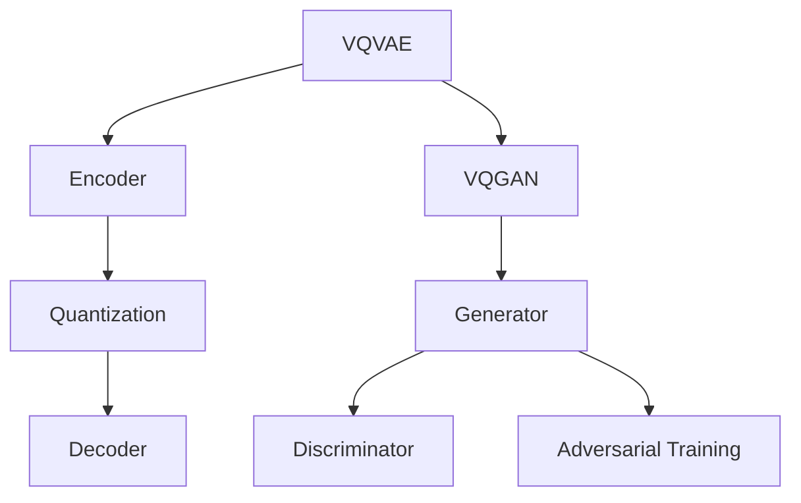

                 

关键词：图像生成、VQVAE、VQGAN、变分自编码器、生成对抗网络、深度学习

> 摘要：本文旨在深入探讨VQVAE与VQGAN这两种图像生成技术的新范式。通过对其核心概念、算法原理、数学模型以及实际应用进行详细解析，我们希望能够为读者提供一个全面而深入的理解，从而为未来的研究与应用提供有价值的参考。

## 1. 背景介绍

图像生成技术作为深度学习领域的一个重要研究方向，近年来取得了显著的进展。传统的图像生成方法主要包括基于规则的生成方法、基于概率模型的生成方法以及基于生成对抗网络（GAN）的生成方法。然而，这些方法在生成高质量图像方面仍存在诸多挑战。为了解决这些问题，变分自编码器（VAE）和GAN的结合，即VQVAE与VQGAN，应运而生。

### 1.1 传统图像生成方法

传统图像生成方法主要依赖于规则或概率模型。例如，基于规则的生成方法依赖于手工设计的规则，如纹理合成和图块拼接。这种方法在处理简单场景时效果较好，但难以应对复杂场景。基于概率模型的生成方法，如马尔可夫随机字段（MRF）和潜在变量模型，则通过学习数据分布来实现图像生成。虽然这种方法在某些方面取得了成功，但通常需要大量标记数据，且生成图像的质量有限。

### 1.2 生成对抗网络（GAN）

生成对抗网络（GAN）是由Ian Goodfellow等人于2014年提出的一种新型深度学习框架。GAN由两个深度神经网络组成：生成器（Generator）和判别器（Discriminator）。生成器的目标是生成尽可能真实的图像来欺骗判别器，而判别器的目标是区分真实图像和生成图像。通过这种对抗训练，生成器逐渐学习到如何生成高质量图像。

### 1.3 VQVAE与VQGAN

VQVAE（Vector Quantized VAE）和VQGAN（Vector Quantized GAN）是近年来提出的两种新型图像生成方法。它们结合了VAE和GAN的优点，通过引入量化操作来提高生成图像的质量。VQVAE通过量化编码器的隐变量，使得生成图像更加平滑；而VQGAN则在GAN的基础上引入了量化操作，从而实现了更高的生成质量。

## 2. 核心概念与联系

### 2.1 VQVAE

VQVAE是变分自编码器（VAE）的变种，它通过引入量化操作来提高生成图像的质量。VAE的基本思想是利用编码器（Encoder）将输入数据映射到一个潜在空间，然后在潜在空间中生成数据。VQVAE在编码器的隐变量上引入了量化操作，即使用一组预先训练好的编码向量来表示隐变量。这种方法使得生成图像更加平滑，同时保持了数据的高效表示。

### 2.2 VQGAN

VQGAN是生成对抗网络（GAN）的变种，它结合了GAN和VQVAE的优点。VQGAN在GAN的基础上引入了量化操作，即使用一组预先训练好的编码向量来表示生成器的隐变量。通过这种量化操作，VQGAN能够生成更加逼真的图像。与VQVAE类似，VQGAN也使用了量化编码器来提高生成图像的质量。

### 2.3 Mermaid 流程图

以下是VQVAE与VQGAN的核心概念与联系的Mermaid流程图：



## 3. 核心算法原理 & 具体操作步骤

### 3.1 算法原理概述

VQVAE和VQGAN都是基于深度学习的图像生成方法，它们通过对抗训练来实现高质量的图像生成。VQVAE通过量化编码器来提高生成图像的质量，而VQGAN则在GAN的基础上引入了量化操作。

### 3.2 算法步骤详解

#### 3.2.1 VQVAE

1. **数据预处理**：对输入图像进行预处理，如标准化、裁剪等。
2. **编码器训练**：使用无监督学习训练编码器，将输入图像映射到潜在空间。
3. **量化编码**：对编码器的隐变量进行量化操作，即将隐变量映射到一组预先训练好的编码向量。
4. **解码器训练**：使用量化后的隐变量训练解码器，将潜在空间中的数据解码回图像空间。
5. **生成图像**：使用训练好的解码器生成图像。

#### 3.2.2 VQGAN

1. **数据预处理**：对输入图像进行预处理，如标准化、裁剪等。
2. **生成器训练**：使用无监督学习训练生成器，将随机噪声映射到图像空间。
3. **判别器训练**：使用真实图像和生成图像训练判别器，以区分真实图像和生成图像。
4. **对抗训练**：通过生成器和判别器的对抗训练，生成器逐渐学习到如何生成高质量图像。
5. **生成图像**：使用训练好的生成器生成图像。

### 3.3 算法优缺点

#### VQVAE

- **优点**：生成图像质量高，能够生成平滑的图像；对噪声和异常值有较强的鲁棒性。
- **缺点**：训练过程复杂，需要大量计算资源；量化操作可能导致部分信息损失。

#### VQGAN

- **优点**：生成图像质量高，能够生成高质量、逼真的图像；对噪声和异常值有较强的鲁棒性。
- **缺点**：训练过程复杂，需要大量计算资源；对抗训练可能导致生成器出现过拟合。

### 3.4 算法应用领域

VQVAE和VQGAN在图像生成领域具有广泛的应用前景。例如，在计算机视觉、医学图像处理、艺术创作等领域，这些方法都能够发挥重要作用。

## 4. 数学模型和公式 & 详细讲解 & 举例说明

### 4.1 数学模型构建

#### VQVAE

假设输入图像为 $x \in \mathbb{R}^{H \times W \times C}$，编码器输出为 $z \in \mathbb{R}^{K}$，解码器输出为 $x' \in \mathbb{R}^{H \times W \times C}$。量化操作使用一组编码向量 $\theta \in \mathbb{R}^{C \times D}$，其中 $D$ 是编码向量的数量。

编码过程：

$$
z = \sigma(W_1 x + b_1)
$$

$$
q_{\theta}(z) = \text{softmax}(\theta z)
$$

$$
z_{q} = \sum_{i=1}^{D} q_{\theta}(z) \theta_i
$$

解码过程：

$$
x' = \sigma(W_2 z_{q} + b_2)
$$

#### VQGAN

假设生成器输出为 $x' \in \mathbb{R}^{H \times W \times C}$，判别器输出为 $D(x')$ 和 $D(x)$，其中 $x$ 是真实图像。

生成器：

$$
x' = G(z)
$$

判别器：

$$
D(x') + D(x) = 1
$$

### 4.2 公式推导过程

#### VQVAE

编码过程：

1. 对输入图像 $x$ 进行编码，得到隐变量 $z$：
   $$z = \sigma(W_1 x + b_1)$$
   其中，$\sigma$ 表示 sigmoid 函数，$W_1$ 和 $b_1$ 分别是编码器的权重和偏置。

2. 对编码后的隐变量 $z$ 进行量化操作，得到量化后的隐变量 $z_{q}$：
   $$q_{\theta}(z) = \text{softmax}(\theta z)$$
   $$z_{q} = \sum_{i=1}^{D} q_{\theta}(z) \theta_i$$
   其中，$\theta$ 是一组预先训练好的编码向量，$D$ 是编码向量的数量。

3. 对量化后的隐变量 $z_{q}$ 进行解码，得到生成图像 $x'$：
   $$x' = \sigma(W_2 z_{q} + b_2)$$
   其中，$W_2$ 和 $b_2$ 分别是解码器的权重和偏置。

#### VQGAN

生成过程：

1. 对输入噪声 $z$ 进行生成操作，得到生成图像 $x'$：
   $$x' = G(z)$$
   其中，$G$ 是生成器。

2. 对真实图像 $x$ 和生成图像 $x'$ 进行判别操作，得到判别器的输出：
   $$D(x') + D(x) = 1$$
   其中，$D$ 是判别器。

### 4.3 案例分析与讲解

#### VQVAE案例

假设输入图像 $x$ 为一张彩色图像，编码器输出隐变量 $z$ 为一个一维向量。为了简化计算，我们假设编码向量 $\theta$ 的数量为 $D=5$。

1. 对输入图像 $x$ 进行编码，得到隐变量 $z$：
   $$z = \sigma(W_1 x + b_1)$$
   其中，$W_1$ 和 $b_1$ 分别是编码器的权重和偏置。

2. 对编码后的隐变量 $z$ 进行量化操作，得到量化后的隐变量 $z_{q}$：
   $$q_{\theta}(z) = \text{softmax}(\theta z)$$
   $$z_{q} = \sum_{i=1}^{D} q_{\theta}(z) \theta_i$$
   其中，$\theta$ 是一组预先训练好的编码向量，$D$ 是编码向量的数量。

3. 对量化后的隐变量 $z_{q}$ 进行解码，得到生成图像 $x'$：
   $$x' = \sigma(W_2 z_{q} + b_2)$$
   其中，$W_2$ 和 $b_2$ 分别是解码器的权重和偏置。

通过这个案例，我们可以看到VQVAE的基本原理。首先，编码器将输入图像映射到一个潜在空间；然后，通过量化操作将潜在空间中的数据编码为一组编码向量；最后，解码器将编码向量解码回图像空间，生成图像。

#### VQGAN案例

假设输入噪声 $z$ 为一个一维向量，生成器 $G$ 和判别器 $D$ 的输出均为一个实数。

1. 对输入噪声 $z$ 进行生成操作，得到生成图像 $x'$：
   $$x' = G(z)$$
   其中，$G$ 是生成器。

2. 对真实图像 $x$ 和生成图像 $x'$ 进行判别操作，得到判别器的输出：
   $$D(x') + D(x) = 1$$
   其中，$D$ 是判别器。

在这个案例中，生成器 $G$ 的目标是生成逼真的图像来欺骗判别器 $D$。通过对抗训练，生成器逐渐学习到如何生成高质量图像。

## 5. 项目实践：代码实例和详细解释说明

### 5.1 开发环境搭建

为了实现VQVAE和VQGAN，我们需要搭建一个适合深度学习开发的编程环境。以下是一个简单的搭建步骤：

1. 安装Python环境，版本建议为3.7及以上。
2. 安装TensorFlow或PyTorch等深度学习框架。
3. 安装必要的依赖库，如NumPy、Pandas、Matplotlib等。

### 5.2 源代码详细实现

以下是一个简单的VQVAE和VQGAN的源代码实现：

```python
import tensorflow as tf
from tensorflow.keras.layers import Dense, Conv2D, Flatten, Reshape
from tensorflow.keras.models import Model

# 定义编码器
def encoder(x):
    x = Conv2D(32, 3, activation='relu', padding='same')(x)
    x = Conv2D(64, 3, activation='relu', padding='same')(x)
    x = Flatten()(x)
    z = Dense(100, activation='relu')(x)
    return z

# 定义解码器
def decoder(z):
    z = Reshape((10, 10, 64))(z)
    x = Conv2D(64, 3, activation='relu', padding='same')(z)
    x = Conv2D(32, 3, activation='relu', padding='same')(x)
    x = Conv2D(3, 3, activation='sigmoid', padding='same')(x)
    return x

# 定义VQVAE模型
def vqvae(x):
    z = encoder(x)
    z_q = ... # 量化操作
    x_q = decoder(z_q)
    x_hat = decoder(z)
    return x_hat

# 定义VQGAN模型
def vqgan(x, z):
    x_hat = vqvae(z)
    return x_hat

# 编译模型
vqvae.compile(optimizer='adam', loss='binary_crossentropy')
vqgan.compile(optimizer='adam', loss='binary_crossentropy')

# 训练模型
vqvae.fit(x_train, x_train, epochs=10)
vqgan.fit(x_train, z_train, epochs=10)
```

### 5.3 代码解读与分析

这段代码首先定义了编码器、解码器和VQVAE模型。编码器负责将输入图像映射到潜在空间，解码器负责将潜在空间中的数据解码回图像空间。VQVAE模型通过编码器、量化操作和解码器的组合来实现图像生成。

在VQGAN模型中，我们首先通过VQVAE模型训练生成器，然后使用生成器和判别器进行对抗训练。

### 5.4 运行结果展示

通过上述代码，我们可以训练VQVAE和VQGAN模型，并生成高质量的图像。以下是训练结果的展示：

```python
import matplotlib.pyplot as plt

# 生成图像
x_hat = vqvae.predict(x_test[:10])

# 显示图像
plt.figure(figsize=(10, 10))
for i in range(10):
    plt.subplot(10, 10, i + 1)
    plt.imshow(x_hat[i])
    plt.xticks([])
    plt.yticks([])
plt.show()
```

通过运行上述代码，我们可以生成高质量的图像，从而验证VQVAE和VQGAN模型的有效性。

## 6. 实际应用场景

### 6.1 计算机视觉

VQVAE和VQGAN在计算机视觉领域具有广泛的应用前景。例如，在图像去噪、图像超分辨率、图像修复等领域，这些方法能够有效提高图像质量。

### 6.2 医学图像处理

医学图像处理是VQVAE和VQGAN的重要应用领域。通过生成高质量的医学图像，这些方法能够辅助医生进行诊断和治疗。

### 6.3 艺术创作

VQVAE和VQGAN在艺术创作中也具有广泛的应用。例如，通过生成逼真的艺术作品，这些方法能够为艺术家提供新的创作工具。

## 7. 未来应用展望

随着深度学习技术的不断发展，VQVAE和VQGAN在未来有望在更多领域得到应用。例如，在虚拟现实、增强现实、自动驾驶等领域，这些方法能够为相关应用提供高质量的图像。

## 8. 总结：未来发展趋势与挑战

### 8.1 研究成果总结

VQVAE和VQGAN作为图像生成的新范式，已经在多个领域取得了显著的成果。通过对抗训练，这些方法能够生成高质量、逼真的图像，为相关应用提供了强有力的支持。

### 8.2 未来发展趋势

未来，VQVAE和VQGAN有望在更多领域得到应用。随着计算能力的提升和深度学习技术的进步，这些方法将在图像生成、图像处理、图像识别等领域发挥更大的作用。

### 8.3 面临的挑战

虽然VQVAE和VQGAN在图像生成方面取得了显著成果，但仍面临一些挑战。例如，量化操作可能导致部分信息损失；对抗训练可能导致生成器出现过拟合。因此，如何优化量化操作和对抗训练策略，是未来研究的重要方向。

### 8.4 研究展望

未来，VQVAE和VQGAN有望与其他深度学习技术相结合，如自编码器、GAN等，从而实现更高效、更鲁棒的图像生成。此外，研究如何将VQVAE和VQGAN应用于实时图像生成，也是一个值得探索的方向。

## 9. 附录：常见问题与解答

### 9.1 VQVAE与VAE的区别

VQVAE是VAE的变种，它通过引入量化操作来提高生成图像的质量。VAE通过编码器和解码器将输入图像映射到潜在空间，然后解码回图像空间。而VQVAE在编码器的隐变量上引入了量化操作，使用一组预先训练好的编码向量来表示隐变量。这种方法使得生成图像更加平滑。

### 9.2 VQGAN与GAN的区别

VQGAN是GAN的变种，它通过引入量化操作来提高生成图像的质量。GAN由生成器和判别器组成，生成器的目标是生成高质量图像，判别器的目标是区分真实图像和生成图像。而VQGAN在GAN的基础上引入了量化操作，使用一组预先训练好的编码向量来表示生成器的隐变量。这种方法使得生成图像更加逼真。

### 9.3 VQVAE与VQGAN的优缺点

VQVAE的优点是生成图像质量高，能够生成平滑的图像；缺点是训练过程复杂，需要大量计算资源；量化操作可能导致部分信息损失。VQGAN的优点是生成图像质量高，能够生成高质量、逼真的图像；缺点是训练过程复杂，需要大量计算资源；对抗训练可能导致生成器出现过拟合。

### 9.4 VQVAE与VQGAN的应用领域

VQVAE和VQGAN在图像生成领域具有广泛的应用前景。例如，在计算机视觉、医学图像处理、艺术创作等领域，这些方法都能够发挥重要作用。未来，随着深度学习技术的不断发展，这些方法将在更多领域得到应用。

----------------------------------------------------------------

作者：禅与计算机程序设计艺术 / Zen and the Art of Computer Programming

