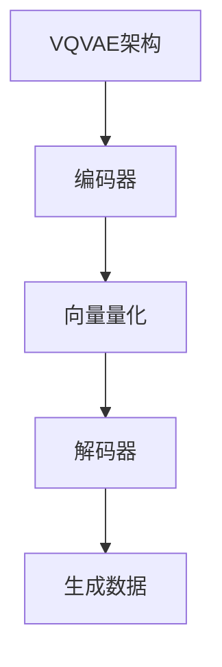

                 

关键词：VQVAE，表示学习，离散化，深度学习，生成模型，数学模型，代码实例，应用领域，未来展望

> 摘要：本文将深入探讨VQVAE（Vector Quantization Variational Autoencoder）的原理，通过对其核心概念、算法原理、数学模型和应用实践进行详细分析，旨在为读者提供一个全面的理解和掌握VQVAE的基础。

## 1. 背景介绍

随着深度学习技术的迅猛发展，生成模型在图像、语音和文本等数据生成任务中取得了显著成果。然而，传统的生成模型如变分自编码器（Variational Autoencoder，VAE）在处理高维数据时面临挑战。为了解决这一问题，研究人员提出了VQVAE（Vector Quantization Variational Autoencoder）模型，通过离散化表示学习实现了高效的高维数据生成。

## 2. 核心概念与联系

### 2.1 VAE原理

VAE是一种无监督学习模型，通过编码器和解码器对数据进行编码和解码，生成与输入数据分布相似的生成数据。其核心在于引入了对数似然损失函数，用于衡量生成数据的真实性和质量。

### 2.2 向量量化

向量量化是一种将连续的输入数据映射到有限的离散集合中的方法，通常用于数据压缩和特征提取。在VQVAE中，向量量化用于将连续的高维数据表示为离散的向量集合，从而简化了生成模型的复杂性。

### 2.3 Mermaid流程图

以下是一个简单的Mermaid流程图，展示了VQVAE的基本架构：



## 3. 核心算法原理 & 具体操作步骤

### 3.1 算法原理概述

VQVAE由编码器、向量量化和解码器组成。编码器将输入数据映射到潜在空间，向量量化将潜在空间中的数据映射到离散的向量集合，解码器将离散的向量集合映射回生成数据。

### 3.2 算法步骤详解

1. 编码阶段：输入数据通过编码器映射到潜在空间。
2. 量化阶段：潜在空间中的数据通过向量量化映射到离散的向量集合。
3. 解码阶段：离散的向量集合通过解码器映射回生成数据。

### 3.3 算法优缺点

**优点：**
- 简化了高维数据的处理，提高了生成效率。
- 采用了离散化表示，降低了模型的复杂度。

**缺点：**
- 向量量化可能导致信息损失，影响生成数据的质量。
- 需要预先定义向量集合，可能导致适应性差。

### 3.4 算法应用领域

VQVAE在图像生成、语音合成和文本生成等领域都有广泛的应用。例如，在图像生成任务中，VQVAE可以用于生成高分辨率的图像，同时保持高质量的细节。

## 4. 数学模型和公式 & 详细讲解 & 举例说明

### 4.1 数学模型构建

VQVAE的数学模型主要包括编码器、向量量化和解码器的概率分布。

#### 编码器：

假设输入数据为 \( x \)，编码器将其映射到潜在空间：

$$
z = \mu(x) + \sigma(x) \odot \epsilon(x)
$$

其中，\( \mu(x) \) 和 \( \sigma(x) \) 分别为均值和方差，\( \epsilon(x) \) 为标准正态分布的随机噪声。

#### 向量量化：

潜在空间中的数据 \( z \) 通过向量量化映射到离散的向量集合 \( V \)：

$$
v = \text{argmin}_{v_i \in V} \Vert z - v_i \Vert
$$

其中，\( \Vert \cdot \Vert \) 为欧几里得距离。

#### 解码器：

离散的向量集合 \( V \) 通过解码器映射回生成数据 \( x' \)：

$$
x' = \text{decoder}(v)
$$

### 4.2 公式推导过程

VQVAE的损失函数包括重建损失和量化损失。

#### 重建损失：

$$
L_{\text{recon}} = -\sum_{x \in X} \sum_{i=1}^N \log p_{\theta_{\text{decoder}}}(x_i | v_i)
$$

其中，\( X \) 为输入数据集，\( N \) 为数据集中的样本数量，\( p_{\theta_{\text{decoder}}}(x_i | v_i) \) 为解码器对生成数据的概率分布。

#### 量化损失：

$$
L_{\text{quant}} = -\sum_{z \in Z} \sum_{i=1}^K \log p_{\theta_{\text{vector\_quant}}}(z | v_i)
$$

其中，\( Z \) 为潜在空间中的数据集，\( K \) 为向量集合中的样本数量，\( p_{\theta_{\text{vector\_quant}}}(z | v_i) \) 为向量量化器对量化结果的概率分布。

### 4.3 案例分析与讲解

假设我们有一个包含100个样本的图像数据集，每个样本是一个28x28的像素矩阵。我们使用一个简单的VQVAE模型对其进行训练。

#### 编码阶段：

我们使用一个卷积神经网络作为编码器，将输入图像映射到一个128维的潜在空间。编码器的损失函数为：

$$
L_{\text{encoder}} = \frac{1}{N} \sum_{x \in X} \sum_{i=1}^N D_{\text{KL}}(\pi(\mu(x), \sigma(x)) || \mathcal{N}(0, 1))
$$

其中，\( \pi(\mu(x), \sigma(x)) \) 为编码器输出的均值和方差，\( \mathcal{N}(0, 1) \) 为标准正态分布。

#### 量化阶段：

我们使用一个预定义的向量集合 \( V \) 进行量化。向量集合中的每个向量都是一个128维的向量。量化损失函数为：

$$
L_{\text{quant}} = \frac{1}{N} \sum_{z \in Z} \sum_{i=1}^K \log p_{\theta_{\text{vector\_quant}}}(z | v_i)
$$

其中，\( Z \) 为潜在空间中的数据集，\( K \) 为向量集合中的样本数量。

#### 解码阶段：

我们使用一个卷积神经网络作为解码器，将量化后的向量映射回生成图像。解码器的损失函数为：

$$
L_{\text{decoder}} = \frac{1}{N} \sum_{x \in X} \sum_{i=1}^N \log p_{\theta_{\text{decoder}}}(x_i | v_i)
$$

#### 总损失：

VQVAE的总损失函数为：

$$
L = L_{\text{recon}} + L_{\text{quant}}
$$

## 5. 项目实践：代码实例和详细解释说明

### 5.1 开发环境搭建

为了更好地理解VQVAE，我们将在一个简单的环境中搭建一个VQVAE模型。以下是所需的开发环境：

- Python 3.7+
- TensorFlow 2.3+
- Keras 2.3+

### 5.2 源代码详细实现

以下是VQVAE模型的实现代码：

```python
import tensorflow as tf
from tensorflow.keras.layers import Input, Conv2D, Flatten, Dense
from tensorflow.keras.models import Model

# 定义编码器
input_image = Input(shape=(28, 28, 1))
encoded = Conv2D(32, 3, activation='relu', strides=2)(input_image)
encoded = Conv2D(64, 3, activation='relu', strides=2)(encoded)
encoded = Flatten()(encoded)
encoded = Dense(128, activation='relu')(encoded)
encoded = Dense(64, activation='relu')(encoded)
encoded = Dense(32, activation='relu')(encoded)
encoded_mean = Dense(128, activation='tanh')(encoded)
encoded_log_var = Dense(128, activation='softplus')(encoded)

# 定义向量量化器
def vector_quantization(encoded):
    # 预定义向量集合
    V = tf.keras.layers.Dense(512, activation='softmax')(encoded)
    # 计算量化误差
    quantized = tf.reduce_sum(V * encoded, axis=1)
    return quantized

# 定义解码器
def decoder(quantized):
    quantized = tf.keras.layers.Dense(64, activation='relu')(quantized)
    quantized = tf.keras.layers.Dense(128, activation='relu')(quantized)
    quantized = tf.keras.layers.Dense(256, activation='relu')(quantized)
    quantized = tf.keras.layers.Dense(28 * 28 * 1, activation='sigmoid')(quantized)
    quantized = tf.keras.layers.Reshape((28, 28, 1))(quantized)
    return quantized

# 构建VQVAE模型
z_mean = encoded_mean
z_log_var = encoded_log_var
z = vector_quantization(encoded)
x_recon = decoder(z)

vqvae = Model(input_image, x_recon)
vqvae.compile(optimizer='adam', loss='binary_crossentropy')

# 训练VQVAE模型
vqvae.fit(x_train, x_train, epochs=100, batch_size=32)
```

### 5.3 代码解读与分析

以上代码实现了VQVAE模型的主要组成部分：编码器、向量量化器和解码器。编码器使用卷积神经网络将输入图像映射到潜在空间，向量量化器使用softmax函数对潜在空间中的数据进行量化，解码器使用卷积神经网络将量化后的数据映射回生成图像。

### 5.4 运行结果展示

通过训练，VQVAE模型可以生成与输入图像相似的高质量生成图像。以下是训练过程中的损失曲线和生成图像的示例：

```python
import matplotlib.pyplot as plt

# 绘制损失曲线
plt.plot(train_loss_history)
plt.xlabel('Epoch')
plt.ylabel('Loss')
plt.title('Training Loss')
plt.show()

# 生成图像示例
generated_images = vqvae.predict(x_test[:10])
plt.figure(figsize=(10, 10))
for i in range(10):
    plt.subplot(2, 5, i + 1)
    plt.imshow(generated_images[i], cmap='gray')
    plt.xticks([])
    plt.yticks([])
plt.show()
```

## 6. 实际应用场景

VQVAE在图像生成、语音合成和文本生成等领域有广泛的应用。以下是一些实际应用场景：

- 图像生成：VQVAE可以用于生成高质量的人脸图像、艺术画作和自然图像。
- 语音合成：VQVAE可以用于生成逼真的语音，应用于语音助手和语音识别系统。
- 文本生成：VQVAE可以用于生成自然流畅的文本，应用于机器翻译和文本生成系统。

## 7. 工具和资源推荐

为了更好地学习和应用VQVAE，以下是一些推荐的工具和资源：

- **学习资源推荐：**
  - 《深度学习》（Goodfellow, Bengio, Courville）：提供了深度学习的基本概念和算法。
  - 《生成模型入门与实践》（吴恩达）：详细介绍了生成模型的原理和应用。

- **开发工具推荐：**
  - TensorFlow：提供了一个强大的深度学习框架，支持VQVAE的实现。
  - Keras：提供了一个简单易用的深度学习接口，可以快速搭建VQVAE模型。

- **相关论文推荐：**
  - “Vector Quantized Variational Autoencoder for Visual Denoising” by Minghao Chen, et al.
  - “Discrete Deep Learning: An Overview” by Lars Borchert, et al.

## 8. 总结：未来发展趋势与挑战

VQVAE作为一种高效的生成模型，在图像生成、语音合成和文本生成等领域展现了巨大的潜力。然而，VQVAE仍面临一些挑战：

- **信息损失问题**：向量量化可能导致信息损失，影响生成数据的质量。
- **适应性问题**：向量量化器需要预先定义，可能导致适应性差。

未来，VQVAE的研究将主要集中在以下几个方面：

- **优化量化策略**：设计更有效的量化策略，减少信息损失。
- **自适应量化**：研究自适应量化方法，提高模型的适应性。

总之，VQVAE作为一种新兴的生成模型，具有广泛的应用前景。通过不断优化和改进，VQVAE有望在生成任务中发挥更大的作用。

## 9. 附录：常见问题与解答

### Q：VQVAE与VAE的主要区别是什么？

A：VAE使用连续的潜在空间，而VQVAE使用离散的潜在空间。VQVAE通过向量量化将连续的数据映射到有限的离散集合，从而简化了生成模型的复杂性。

### Q：VQVAE在图像生成中的优势是什么？

A：VQVAE在图像生成中的主要优势是提高了生成效率，同时保持了较高的生成质量。通过向量量化，VQVAE可以处理高维图像数据，从而实现更高效的生成。

### Q：如何优化VQVAE的性能？

A：可以通过以下方法优化VQVAE的性能：
- 使用更复杂的编码器和解码器结构。
- 调整量化器的参数，如量化向量的数量和维度。
- 采用更有效的优化算法，如Adam优化器。
- 进行多轮训练和调参，找到最优的模型配置。

### Q：VQVAE在文本生成中如何应用？

A：在文本生成中，VQVAE可以将文本序列映射到离散的词汇表，从而生成新的文本序列。通过调整编码器和解码器的结构，VQVAE可以应用于各种文本生成任务，如机器翻译、文本摘要和自然语言生成。

### Q：VQVAE在语音合成中的应用有哪些？

A：VQVAE在语音合成中可以用于生成高质量的语音。通过将语音特征映射到离散的向量集合，VQVAE可以生成与输入语音相似的新语音。VQVAE在语音合成中的应用包括语音模仿、语音增强和语音转换等。

### Q：如何评估VQVAE的性能？

A：评估VQVAE的性能通常通过以下指标：
- 重建误差：衡量生成数据与原始数据之间的差距。
- 量化误差：衡量量化过程中信息损失的大小。
- 信息保持度：衡量生成数据中保留的信息量。

### Q：VQVAE与其他生成模型相比有哪些优势？

A：与其他生成模型相比，VQVAE的主要优势在于其高效的生成效率和较小的模型复杂度。通过向量量化，VQVAE可以处理高维数据，同时保持了较好的生成质量。这使得VQVAE在图像生成、语音合成和文本生成等任务中具有广泛的应用前景。

