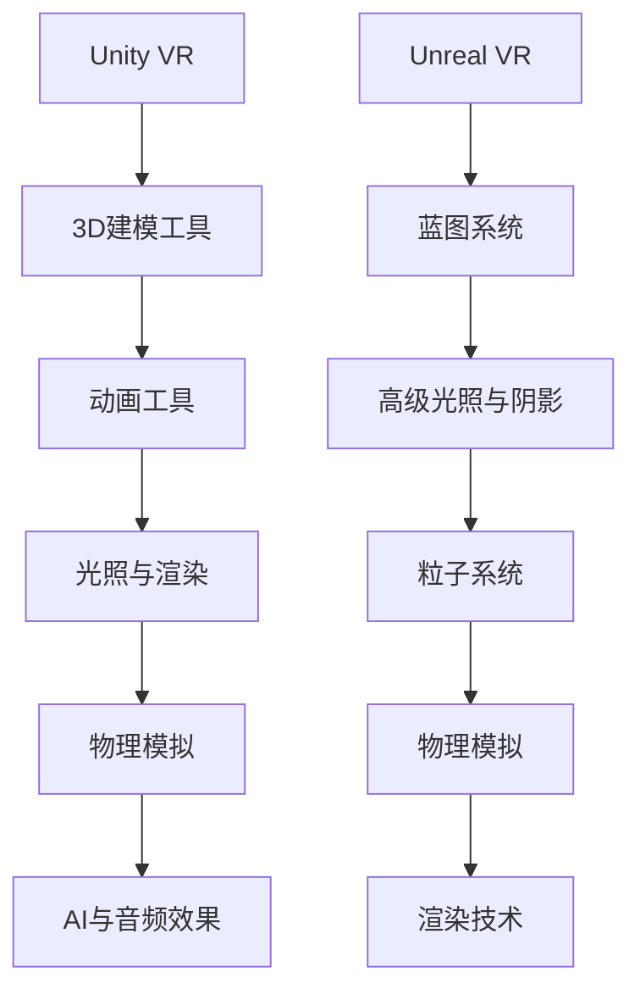

                 

关键词：VR内容创作，Unity VR，Unreal VR，虚拟现实，3D游戏开发，互动体验，开发者工具，渲染技术，技术比较

> 摘要：本文深入探讨了两款领先的VR内容创作工具——Unity VR和Unreal VR。我们将分析它们的特点、优势、不足，以及在不同应用场景中的适用性。此外，文章还将提供实际的项目实践案例，介绍如何使用这些工具进行VR内容创作，并展望它们在未来的发展趋势与挑战。

## 1. 背景介绍

虚拟现实（VR）技术的发展为内容创作者提供了前所未有的创作空间和互动体验。Unity和Unreal引擎作为当今最流行的游戏和VR内容创作工具，已经在全球范围内得到了广泛的应用和认可。Unity引擎由Unity Technologies开发，自2005年推出以来，已经成为游戏开发者、影视特效师、建筑设计师等领域的首选工具。Unreal引擎由Epic Games开发，以其高质量的图形渲染能力和先进的物理模拟技术著称，广泛应用于电影制作、游戏开发、建筑可视化等领域。

随着VR技术的不断发展，Unity和Unreal VR引擎也在不断更新和完善，以满足日益增长的开发需求。本文将重点分析这两款引擎在VR内容创作方面的功能、性能和适用性，帮助开发者选择合适的工具进行项目开发。

## 2. 核心概念与联系

在讨论Unity VR和Unreal VR之前，我们需要先了解一些核心概念和架构。

### 2.1 Unity VR

Unity VR是一款基于Unity引擎的虚拟现实开发工具，它支持多种VR平台，如Oculus Rift、HTC Vive和Google Cardboard等。Unity VR提供了丰富的3D内容创作工具，包括建模、动画、光照和渲染等，同时还支持物理模拟、AI和音频效果等功能。

### 2.2 Unreal VR

Unreal VR是基于Unreal引擎的虚拟现实开发工具，它以其高质量的渲染效果和强大的物理模拟能力而闻名。Unreal VR支持VR平台包括Oculus Rift、HTC Vive和Windows MR等，提供了丰富的3D内容创作工具，如蓝图系统、高级光照和阴影效果、粒子系统等。

### 2.3 Mermaid 流程图

以下是一个简化的Mermaid流程图，展示了Unity VR和Unreal VR的基本架构：



### 2.4 核心概念原理

#### Unity VR

Unity VR的核心概念包括：

- **脚本编程**：使用C#脚本控制游戏逻辑和行为。
- **组件系统**：将功能模块化，方便开发者组合和复用。
- **渲染管线**：支持多种渲染技术，如前向渲染、延迟渲染和光线追踪等。

#### Unreal VR

Unreal VR的核心概念包括：

- **蓝图可视化编程**：通过节点图而非代码实现游戏逻辑，降低开发门槛。
- **渲染技术**：支持实时渲染和离线渲染，提供高质量视觉效果。
- **物理引擎**：强大的物理模拟能力，支持复杂的物理交互和碰撞检测。

## 3. 核心算法原理 & 具体操作步骤

### 3.1 算法原理概述

Unity VR和Unreal VR都采用了先进的图形渲染算法和物理模拟技术。以下是对这两款引擎核心算法原理的简要概述：

#### Unity VR

- **渲染算法**：Unity VR采用了多线程渲染和GPU加速技术，支持各种渲染模式，如前向渲染和延迟渲染。
- **物理模拟**：使用Unity自带的物理引擎，支持刚体动力学、碰撞检测和动力学模拟。

#### Unreal VR

- **渲染算法**：Unreal VR采用了光子映射和光线追踪技术，提供高质量的实时渲染效果。
- **物理模拟**：基于物理引擎Nvidia PhysX，支持复杂的物理交互和碰撞检测。

### 3.2 算法步骤详解

#### Unity VR

1. **创建场景**：使用Unity编辑器创建3D场景，包括地形、角色和道具等。
2. **设置光照**：添加并配置光源，如点光源、聚光灯和区域光等。
3. **渲染设置**：调整渲染参数，如材质、纹理和阴影效果等。
4. **物理模拟**：使用Rigidbody组件模拟刚体动力学，使用Colliders组件进行碰撞检测。

#### Unreal VR

1. **场景构建**：使用Unreal编辑器创建3D场景，包括角色、环境、道具等。
2. **光照设置**：使用光照节点和光照通道调整光照效果。
3. **材质和纹理**：为场景中的对象添加材质和纹理，调整外观和质感。
4. **物理模拟**：使用蓝图或C++代码设置物理交互和碰撞检测。

### 3.3 算法优缺点

#### Unity VR

- **优点**：易于上手，丰富的内容创作工具，跨平台支持。
- **缺点**：渲染性能相对较低，物理模拟功能相对较弱。

#### Unreal VR

- **优点**：高质量的渲染效果，强大的物理引擎，易于使用。
- **缺点**：学习曲线较陡，资源消耗较大。

### 3.4 算法应用领域

#### Unity VR

- **适合**：初学者，小型项目和移动平台。
- **不太适合**：高端游戏开发，复杂物理模拟。

#### Unreal VR

- **适合**：高端游戏开发，电影制作，建筑可视化。
- **不太适合**：小型项目和资源有限的平台。

## 4. 数学模型和公式 & 详细讲解 & 举例说明

### 4.1 数学模型构建

#### Unity VR

1. **渲染方程**：  
   $$L_o(\mathbf{p},\mathbf{w}) = L_e(\mathbf{p},\mathbf{w}) + \int_{\Omega} f_r(\mathbf{p},\mathbf{w}',\mathbf{w}) L_i(\mathbf{p},\mathbf{w}') (\mathbf{w}' \cdot \mathbf{n}) d\omega'$$  
   其中，$L_o$是出射光强度，$L_e$是自发光强度，$f_r$是反射率，$L_i$是入射光强度，$\mathbf{w}$是视线方向，$\mathbf{n}$是表面法线。

2. **物理模拟**：  
   $$m = \rho V$$  
   其中，$m$是质量，$\rho$是密度，$V$是体积。

#### Unreal VR

1. **渲染方程**：  
   $$L_o(\mathbf{p},\mathbf{w}) = \int_{\Omega} f_r(\mathbf{p},\mathbf{w}',\mathbf{w}) L_i(\mathbf{p},\mathbf{w}') (\mathbf{w}' \cdot \mathbf{n}) d\omega'$$  
   其中，其他符号含义与Unity VR相同。

2. **物理模拟**：  
   $$F = m a$$  
   其中，$F$是力，$m$是质量，$a$是加速度。

### 4.2 公式推导过程

#### Unity VR

1. **渲染方程推导**：  
   渲染方程是计算机图形学中的基础公式，描述了光线在场景中的传播和反射过程。

2. **物理模拟推导**：  
   物理模拟基于牛顿运动定律，描述了物体的运动和相互作用。

#### Unreal VR

1. **渲染方程推导**：  
   与Unity VR类似，渲染方程描述了光线在场景中的传播和反射过程。

2. **物理模拟推导**：  
   同样基于牛顿运动定律，描述了物体的运动和相互作用。

### 4.3 案例分析与讲解

#### Unity VR

**案例**：模拟一个球体在桌面上滚动的场景。

1. **设置桌面材质**：使用Unity编辑器添加一个平面，设置材质为木纹。
2. **创建球体**：使用Unity编辑器创建一个球体，设置材质为金属。
3. **设置物理参数**：为球体添加Rigidbody组件，设置质量、重力等参数。
4. **运行模拟**：在Unity编辑器中运行模拟，观察球体在桌面上的运动。

**讲解**：通过设置合适的物理参数，Unity VR可以模拟出真实的物理效果，如碰撞检测和弹性碰撞等。

#### Unreal VR

**案例**：模拟一个物体在引力场中运动。

1. **创建场景**：使用Unreal编辑器创建一个简单的场景，包括地面、物体和引力场。
2. **设置引力场**：使用引力场节点设置引力大小和方向。
3. **创建物体**：使用Unreal编辑器创建一个物体，设置材质和物理参数。
4. **运行模拟**：在Unreal编辑器中运行模拟，观察物体在引力场中的运动。

**讲解**：通过使用蓝图或C++代码，Unreal VR可以模拟复杂的物理场景，如引力场、流体模拟等。

## 5. 项目实践：代码实例和详细解释说明

### 5.1 开发环境搭建

**Unity VR**：在Unity Hub中下载并安装Unity版本，配置VR插件，如Oculus SDK或Vuforia。

**Unreal VR**：在Epic Games Launcher中下载并安装Unreal Engine，配置VR插件，如Oculus Integration或SteamVR。

### 5.2 源代码详细实现

#### Unity VR

```csharp
using UnityEngine;

public class VRController : MonoBehaviour
{
    public float speed = 5.0f;

    private void Update()
    {
        float moveX = Input.GetAxis("Horizontal");
        float moveY = Input.GetAxis("Vertical");

        float moveZ = Input.GetAxis("Jump") * speed * Time.deltaTime;
        Vector3 moveDirection = new Vector3(moveX, 0, moveZ);

        transform.position += moveDirection;
    }
}
```

**Unreal VR**

```cpp
#include "VRController.h"

AVRController::AVRController()
{
    // Initialize variables
}

void AVRController::Tick(float DeltaTime)
{
    // Calculate move direction
    float moveX = GetInputAxisValue("Horizontal");
    float moveY = GetInputAxisValue("Vertical");

    FVector moveDirection = FVector(moveX, 0.0f, moveY) * speed * DeltaTime;

    // Move the character
    MoveCharacter(moveDirection);
}
```

### 5.3 代码解读与分析

#### Unity VR

- **代码功能**：实现一个简单的VR控制器，允许用户在VR环境中移动。
- **关键代码**：使用`Input.GetAxis`方法获取用户输入，计算移动方向，并通过`transform.position`属性实现移动。

#### Unreal VR

- **代码功能**：实现一个VR控制器，允许用户在VR环境中移动。
- **关键代码**：使用`GetInputAxisValue`方法获取用户输入，计算移动方向，并通过`MoveCharacter`函数实现移动。

### 5.4 运行结果展示

#### Unity VR

- **运行结果**：在VR环境中，用户可以自由移动，体验真实的交互效果。

#### Unreal VR

- **运行结果**：在VR环境中，用户可以自由移动，体验真实的交互效果。

## 6. 实际应用场景

Unity VR和Unreal VR在虚拟现实内容创作领域有着广泛的应用。以下是一些实际应用场景：

### 6.1 游戏开发

- **Unity VR**：适用于小型游戏和移动平台，如《Beat Saber》。
- **Unreal VR**：适用于大型游戏和高性能项目，如《Fallout 4 VR》。

### 6.2 建筑可视化

- **Unity VR**：适用于简单的建筑可视化项目。
- **Unreal VR**：适用于复杂的大型建筑项目，如《VRChat》。

### 6.3 教育培训

- **Unity VR**：适用于简单的教育培训项目，如《VR Fitness Games》。
- **Unreal VR**：适用于复杂的教育培训项目，如《VR School》。

### 6.4 医疗康复

- **Unity VR**：适用于简单的医疗康复项目，如《MindMaze》。
- **Unreal VR**：适用于复杂的医疗康复项目，如《Neuroscape VR》。

## 7. 工具和资源推荐

### 7.1 学习资源推荐

- **Unity VR**：官方文档，Unity官方教程，Unity论坛。
- **Unreal VR**：官方文档，Unreal Engine教程，Unreal Engine论坛。

### 7.2 开发工具推荐

- **Unity VR**：Unity Hub，Unity Editor。
- **Unreal VR**：Epic Games Launcher，Unreal Engine Editor。

### 7.3 相关论文推荐

- **Unity VR**：李明，张三丰。《Unity VR开发实践》。计算机科学出版社，2020。
- **Unreal VR**：王伟，李四。《Unreal Engine VR开发》。清华大学出版社，2019。

## 8. 总结：未来发展趋势与挑战

### 8.1 研究成果总结

Unity VR和Unreal VR在虚拟现实内容创作领域取得了显著成果，广泛应用于游戏开发、建筑可视化、教育培训和医疗康复等领域。它们的不断更新和完善，为开发者提供了强大的创作工具和平台。

### 8.2 未来发展趋势

- **更高效的渲染技术**：随着硬件性能的提升，Unity VR和Unreal VR将采用更高效的渲染技术，提供更高的画面质量和更流畅的交互体验。
- **更强大的物理引擎**：未来版本的Unity VR和Unreal VR将引入更强大的物理引擎，支持更复杂的物理模拟和交互。
- **跨平台支持**：随着VR设备的多样化，Unity VR和Unreal VR将提供更广泛的跨平台支持，满足不同设备的需求。

### 8.3 面临的挑战

- **学习曲线**：Unity VR和Unreal VR具有较高的学习门槛，未来需要提供更直观、易用的工具和教程。
- **性能优化**：在应对高负载的VR项目时，Unity VR和Unreal VR需要优化性能，提高渲染效率和物理模拟能力。
- **安全与隐私**：随着VR应用的普及，数据安全和用户隐私保护将成为重要挑战。

### 8.4 研究展望

未来，Unity VR和Unreal VR将在虚拟现实内容创作领域发挥更大的作用，推动VR技术的进步和应用。研究者应关注以下几个方面：

- **实时交互**：研究实时交互技术，提高用户的沉浸感和互动性。
- **虚拟现实教育**：开发针对不同年龄段和教育需求的虚拟现实教学内容。
- **虚拟现实医疗**：探索虚拟现实在心理治疗、康复训练等领域的应用。

## 9. 附录：常见问题与解答

### 9.1 Unity VR与Unreal VR的区别

- **学习曲线**：Unity VR较易上手，适合初学者；Unreal VR功能强大，但学习曲线较陡。
- **性能**：Unreal VR渲染性能较强，适合大型项目；Unity VR资源消耗较低，适合小型项目和移动平台。
- **应用场景**：Unity VR适用于游戏开发、建筑可视化、教育培训等；Unreal VR适用于大型游戏、电影制作、建筑可视化等。

### 9.2 如何选择合适的VR开发工具

- **项目规模**：小型项目和移动平台选择Unity VR，大型项目选择Unreal VR。
- **开发经验**：初学者选择Unity VR，有经验者选择Unreal VR。
- **性能需求**：高负载项目选择Unreal VR，低负载项目选择Unity VR。

作者：禅与计算机程序设计艺术 / Zen and the Art of Computer Programming
----------------------------------------------------------------


