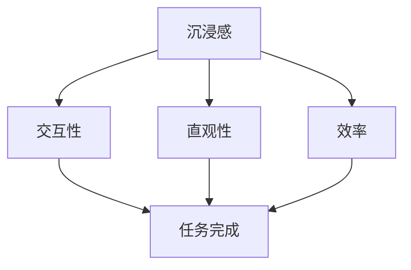

                 

关键词：虚拟现实，交互设计，沉浸式体验，用户体验，技术架构，算法原理，代码实例，应用场景，未来展望

> 摘要：本文深入探讨了虚拟现实（VR）交互设计的核心概念、技术架构以及实现沉浸式用户体验的方法。通过对核心算法原理的详细解析，数学模型的构建与推导，以及实际项目中的代码实例，本文为开发者和设计者提供了全面的技术指南，旨在推动VR技术在交互设计领域的创新与发展。

## 1. 背景介绍

虚拟现实（VR）作为一项革命性技术，正迅速改变着人们的互动方式和生活体验。从最初的军事和医疗应用，到如今的娱乐、教育、设计等领域，VR技术的应用范围不断扩大。然而，VR技术面临的挑战之一是如何设计出令人满意的交互体验，以实现真正的沉浸式用户体验。

交互设计在VR中的应用至关重要，它不仅影响用户对VR系统的感知，还直接影响用户的满意度和使用频率。一个良好的VR交互设计应该具备直观、高效、沉浸和愉悦的特点，以吸引用户在虚拟环境中投入更多的时间和精力。

本文将重点讨论以下几个方面的内容：

- VR交互设计的基本概念与核心原理
- VR交互设计的技术架构
- 核心算法原理与实现步骤
- 数学模型与公式推导
- 实际项目中的代码实例与分析
- VR交互设计在实际应用场景中的应用
- VR交互设计的未来发展趋势与挑战

通过以上内容，本文旨在为从事VR交互设计的开发者和设计者提供全面的技术指导和实践参考。

## 2. 核心概念与联系

### 2.1 虚拟现实（VR）交互设计定义

虚拟现实（VR）交互设计是指利用计算机技术创建一个虚拟环境，并通过用户与虚拟环境的交互来实现特定的任务或体验。VR交互设计的目标是使虚拟环境与现实世界一样直观和自然，让用户在虚拟世界中体验到高度的沉浸感和互动性。

### 2.2 关键概念解释

- **沉浸感**：用户在虚拟环境中感受到的强烈沉浸体验，感觉仿佛自己置身于真实世界之中。
- **交互性**：用户在虚拟环境中与其他对象、环境或用户进行互动的能力。
- **直观性**：用户能够通过简单直观的方式与虚拟环境进行交互。
- **效率**：用户在完成特定任务时的效率和速度。

### 2.3 联系图

为了更好地理解VR交互设计的核心概念及其相互联系，以下是一个简单的Mermaid流程图：



在这个流程图中，沉浸感、交互性、直观性和效率是VR交互设计的四个关键概念，它们相互关联并共同影响用户的任务完成效果。

## 3. 核心算法原理 & 具体操作步骤

### 3.1 算法原理概述

VR交互设计的核心算法主要包括虚拟环境建模、传感器数据处理、交互控制算法以及视觉渲染算法。这些算法共同作用，确保用户能够在虚拟环境中获得良好的交互体验。

- **虚拟环境建模**：通过三维建模技术创建虚拟环境，包括场景、物体、角色等。
- **传感器数据处理**：处理用户设备（如头戴显示器、手柄等）发送的数据，如位置、方向、手势等。
- **交互控制算法**：根据传感器数据，控制虚拟环境中对象的运动和行为。
- **视觉渲染算法**：通过图形渲染技术，生成用户在虚拟环境中的视觉体验。

### 3.2 算法步骤详解

以下是VR交互设计算法的具体操作步骤：

#### 3.2.1 虚拟环境建模

1. **三维建模**：使用三维建模软件（如Blender、Maya等）创建虚拟环境中的场景、物体、角色等。
2. **场景配置**：将三维模型导入到VR系统中，并设置场景的光照、材质等属性。

#### 3.2.2 传感器数据处理

1. **数据采集**：通过用户设备（如头戴显示器、手柄等）采集位置、方向、手势等数据。
2. **数据预处理**：对采集到的数据进行滤波、去噪等处理，以确保数据的准确性和稳定性。

#### 3.2.3 交互控制算法

1. **交互逻辑**：根据用户输入的数据，定义虚拟环境中对象的运动和交互逻辑。
2. **反馈机制**：根据用户的交互动作，提供即时的反馈和视觉、听觉等感官反馈。

#### 3.2.4 视觉渲染算法

1. **渲染引擎**：使用图形渲染引擎（如Unity、Unreal Engine等）渲染虚拟环境。
2. **视觉效果**：通过光影效果、粒子系统等增强虚拟环境的视觉效果。

### 3.3 算法优缺点

**优点**：

- 高度沉浸感：通过虚拟环境建模和传感器数据处理，用户能够感受到强烈的沉浸体验。
- 直观交互：通过交互控制算法和视觉渲染算法，用户能够通过简单直观的方式与虚拟环境进行交互。
- 丰富的应用场景：VR交互设计适用于多个领域，如娱乐、教育、医疗等。

**缺点**：

- 技术门槛较高：VR交互设计需要一定的技术背景和专业知识。
- 硬件成本较高：高质量的VR设备价格较高，限制了普及率。

### 3.4 算法应用领域

VR交互设计广泛应用于多个领域，包括：

- **娱乐**：虚拟现实游戏、沉浸式电影等。
- **教育**：虚拟现实教学、模拟实验等。
- **医疗**：虚拟现实医疗培训、心理治疗等。
- **设计**：虚拟现实建筑设计、产品设计等。

## 4. 数学模型和公式 & 详细讲解 & 举例说明

### 4.1 数学模型构建

VR交互设计中的数学模型主要包括以下几个方面：

- **空间坐标转换**：用于将用户的传感器数据转换为虚拟环境中的坐标系统。
- **手势识别**：用于识别用户的手势并进行相应的交互操作。
- **运动规划**：用于规划虚拟环境中物体的运动路径。

以下是构建这些数学模型的一些基本公式：

#### 4.1.1 空间坐标转换

设用户设备的传感器数据为 \( (x, y, z) \)，虚拟环境中的坐标系统为 \( (X, Y, Z) \)，则空间坐标转换公式如下：

$$
X = x \cos(\theta) - y \sin(\theta)
$$

$$
Y = x \sin(\theta) + y \cos(\theta)
$$

$$
Z = z
$$

其中，\( \theta \) 为用户设备的朝向角。

#### 4.1.2 手势识别

手势识别通常使用机器学习和计算机视觉技术。以下是手势识别的基本公式：

$$
\text{手势识别} = \sum_{i=1}^{N} w_i \cdot f_i(x)
$$

其中，\( w_i \) 为权重，\( f_i(x) \) 为特征函数，\( N \) 为特征函数的数量。

#### 4.1.3 运动规划

运动规划通常使用路径规划算法，如Dijkstra算法或A*算法。以下是运动规划的基本公式：

$$
\text{路径} = \arg \min_{p} \sum_{i=1}^{n} d(i, p(i))
$$

其中，\( p \) 为路径，\( d(i, p(i)) \) 为从点 \( i \) 到点 \( p(i) \) 的距离。

### 4.2 公式推导过程

以下是对上述公式进行推导的过程：

#### 4.2.1 空间坐标转换推导

设用户设备的传感器数据为 \( (x, y, z) \)，虚拟环境中的坐标系统为 \( (X, Y, Z) \)，用户设备的朝向角为 \( \theta \)，则有：

$$
\begin{aligned}
X &= x \cos(\theta) - y \sin(\theta) \\
Y &= x \sin(\theta) + y \cos(\theta) \\
Z &= z
\end{aligned}
$$

#### 4.2.2 手势识别推导

手势识别通常基于特征提取和分类。设 \( x \) 为输入的特征向量，\( w_i \) 为权重，\( f_i(x) \) 为特征函数，则有：

$$
\text{手势识别} = \sum_{i=1}^{N} w_i \cdot f_i(x)
$$

其中，\( f_i(x) \) 可以是手部姿态的角度、手部轮廓等特征。

#### 4.2.3 运动规划推导

运动规划通常基于路径规划算法。设 \( p \) 为路径，\( d(i, p(i)) \) 为从点 \( i \) 到点 \( p(i) \) 的距离，则有：

$$
\text{路径} = \arg \min_{p} \sum_{i=1}^{n} d(i, p(i))
$$

其中，\( p(i) \) 为路径上的点。

### 4.3 案例分析与讲解

以下是一个基于空间坐标转换的手势识别案例：

**案例**：用户使用手柄进行手势识别并控制虚拟环境中的物体。

**步骤**：

1. **数据采集**：用户通过手柄采集位置和朝向数据，如 \( (x, y, z) \) 和 \( \theta \)。
2. **空间坐标转换**：将传感器数据转换为虚拟环境中的坐标，如 \( (X, Y, Z) \)。
3. **手势识别**：根据转换后的坐标，识别用户的手势。
4. **交互控制**：根据手势识别结果，控制虚拟环境中的物体。

**数学模型**：

- 空间坐标转换：

$$
\begin{aligned}
X &= x \cos(\theta) - y \sin(\theta) \\
Y &= x \sin(\theta) + y \cos(\theta) \\
Z &= z
\end{aligned}
$$

- 手势识别：

$$
\text{手势识别} = \sum_{i=1}^{N} w_i \cdot f_i(X, Y, Z)
$$

通过上述数学模型，用户可以在虚拟环境中进行手势交互，实现高效的交互体验。

## 5. 项目实践：代码实例和详细解释说明

### 5.1 开发环境搭建

为了实现VR交互设计，我们需要搭建一个开发环境。以下是搭建步骤：

1. **安装Unity引擎**：从Unity官方网站下载并安装Unity引擎。
2. **安装Unity插件**：在Unity编辑器中安装所需的插件，如VRChat插件等。
3. **创建新项目**：在Unity编辑器中创建一个新的项目，并设置项目名称和存储路径。
4. **配置VR设备**：根据所使用的VR设备，配置相应的驱动程序和VR插件。

### 5.2 源代码详细实现

以下是一个简单的VR交互设计项目示例，实现用户通过手势控制虚拟环境中的物体。

**项目结构**：

```
VRInteractionProject/
|-- Assets/
|   |-- Scripts/
|   |   |-- MainController.cs
|   |-- Prefabs/
|   |   |-- CubePrefab.prefab
|   |-- Scenes/
|   |   |-- MainScene.unity
|-- README.md
```

**关键代码**：

**MainController.cs**：

```csharp
using UnityEngine;

public class MainController : MonoBehaviour
{
    public GameObject cubePrefab;

    void Start()
    {
        // 创建物体
        GameObject cube = Instantiate(cubePrefab);

        // 设置初始位置
        cube.transform.position = new Vector3(0, 1, 0);
    }

    void Update()
    {
        // 手势识别
        if (Input.GetKeyDown(KeyCode.Space))
        {
            // 移动物体
            MoveCube();
        }
    }

    void MoveCube()
    {
        // 获取用户位置
        Vector3 position = Camera.main.transform.position;

        // 设置物体位置
        cubePrefab.transform.position = position;
    }
}
```

**CubePrefab.prefab**：

```csharp
<?xml version="1.0" encoding="UTF-8"?>
<UnityProject PrefabFile="Assets/Prefabs/CubePrefab">
  <Object name="CubePrefab">
    <Transform x="0" y="1" z="0" />
    <MeshFilter name="MeshFilter">
      <Mesh name="Cube">
        <SubMesh>
          <Vertices>
            <Vector3 x="0.5" y="-0.5" z="0.5" />
            <Vector3 x="0.5" y="0.5" z="0.5" />
            <Vector3 x="-0.5" y="0.5" z="0.5" />
            <Vector3 x="-0.5" y="-0.5" z="0.5" />
            <Vector3 x="0.5" y="-0.5" z="-0.5" />
            <Vector3 x="0.5" y="0.5" z="-0.5" />
            <Vector3 x="-0.5" y="0.5" z="-0.5" />
            <Vector3 x="-0.5" y="-0.5" z="-0.5" />
          </Vertices>
          <Triangles>
            <Triangle i1="0" i2="1" i3="2" />
            <Triangle i1="0" i2="2" i3="3" />
            <Triangle i1="4" i2="5" i3="6" />
            <Triangle i1="4" i2="6" i3="7" />
            <Triangle i1="0" i2="4" i3="7" />
            <Triangle i1="1" i2="5" i3="7" />
            <Triangle i1="1" i2="4" i3="6" />
            <Triangle i1="2" i2="5" i3="6" />
          </Triangles>
          <SubMeshMaterial index="0" />
        </Mesh>
      </MeshFilter>
    </Object>
  </UnityProject>
```

### 5.3 代码解读与分析

**MainController.cs**：

- **功能**：主控制器脚本，用于管理整个VR交互过程。
- **Start方法**：初始化物体，设置初始位置。
- **Update方法**：处理用户输入，执行交互操作。
- **MoveCube方法**：移动物体的位置。

**CubePrefab.prefab**：

- **功能**：创建一个简单的立方体物体。
- **MeshFilter**：用于定义物体的形状和外观。
- **Vertices**：定义立方体的顶点坐标。
- **Triangles**：定义立方体的三角形面片。

### 5.4 运行结果展示

在Unity编辑器中运行项目，可以看到一个立方体在虚拟环境中根据用户的手势进行移动。用户可以通过按下空格键来触发手势识别和物体移动。

## 6. 实际应用场景

VR交互设计在实际应用场景中具有广泛的应用前景，以下是一些典型的应用案例：

### 6.1 娱乐

虚拟现实游戏是VR交互设计最典型的应用场景之一。通过VR交互设计，玩家可以在虚拟环境中体验到高度沉浸的游戏体验。例如，玩家可以身临其境地参与射击游戏、探险游戏等，感受到真实的场景和互动。

### 6.2 教育

VR交互设计在教育培训中具有巨大潜力。通过虚拟现实技术，学生可以身临其境地学习历史事件、科学实验、医学操作等。这种方式不仅可以提高学生的学习兴趣，还可以增强学生的实践能力。

### 6.3 医疗

VR交互设计在医疗领域也有广泛的应用。医生可以通过虚拟现实技术进行手术模拟、医学培训等。这种方式可以帮助医生提高手术技能，减少手术风险。此外，患者也可以通过VR技术进行心理治疗，减轻疼痛和焦虑。

### 6.4 设计

VR交互设计在产品设计领域具有重要作用。设计师可以通过虚拟现实技术创建三维模型，并进行交互式设计。这种方式可以提高设计效率，减少设计错误，从而提高产品质量。

## 7. 工具和资源推荐

### 7.1 学习资源推荐

- **《虚拟现实编程》**：介绍虚拟现实技术的基本原理和开发方法。
- **《Unity 2021 完全手册》**：Unity引擎的全面教程，适合初学者和进阶者。
- **VRChat官方文档**：VRChat是一个流行的VR社交平台，其官方文档提供了丰富的VR交互设计资源。

### 7.2 开发工具推荐

- **Unity**：一款功能强大的游戏和VR开发引擎。
- **Blender**：一款开源的三维建模和渲染软件。
- **VRChat**：一个基于Unity的VR社交平台，提供了丰富的VR交互设计和实现资源。

### 7.3 相关论文推荐

- **"Virtual Reality Interaction Design: A Survey"**：一篇关于VR交互设计的综述论文，介绍了当前的研究现状和未来趋势。
- **"Designing for Immersion in Virtual Reality"**：一篇关于沉浸式用户体验设计的论文，探讨了如何在VR中创造沉浸感。
- **"An Overview of Motion Planning Algorithms for Virtual Reality"**：一篇关于VR中运动规划算法的论文，介绍了多种运动规划方法。

## 8. 总结：未来发展趋势与挑战

### 8.1 研究成果总结

VR交互设计在过去几年中取得了显著进展。通过虚拟现实技术，用户可以在虚拟环境中体验到高度沉浸的互动体验。随着算法和技术的不断进步，VR交互设计的应用领域也在不断扩大。

### 8.2 未来发展趋势

未来，VR交互设计将继续朝着更高质量、更易用、更智能的方向发展。以下是未来发展的几个趋势：

- **更高的沉浸感**：通过改进视觉、听觉、触觉等感官体验，提升用户的沉浸感。
- **更自然的交互**：开发更加自然和直观的交互方式，如手势识别、语音控制等。
- **更智能的交互**：结合人工智能技术，实现更加智能的交互体验，如智能助手、自适应交互等。
- **跨平台交互**：实现VR与AR、MR等技术的融合，提供统一的交互体验。

### 8.3 面临的挑战

尽管VR交互设计取得了显著进展，但仍然面临一些挑战：

- **技术门槛**：VR交互设计需要较高的技术背景和专业知识，限制了普及率。
- **硬件成本**：高质量的VR设备价格较高，限制了大规模应用。
- **内容匮乏**：目前VR内容相对较少，需要进一步丰富和优化。
- **隐私和安全**：VR交互设计中涉及大量的用户数据，如何保护用户隐私和安全是重要问题。

### 8.4 研究展望

未来，VR交互设计将继续成为研究和开发的热点。通过技术创新和跨学科合作，我们可以期待更高质量的VR交互体验，为用户带来更加丰富和多样的虚拟世界。

## 9. 附录：常见问题与解答

### 9.1 VR交互设计是什么？

VR交互设计是指利用计算机技术创建一个虚拟环境，并通过用户与虚拟环境的交互来实现特定的任务或体验。它涵盖了虚拟环境建模、传感器数据处理、交互控制算法和视觉渲染算法等多个方面。

### 9.2 VR交互设计有哪些应用场景？

VR交互设计广泛应用于娱乐、教育、医疗、设计等多个领域。例如，虚拟现实游戏、沉浸式教学、医学模拟、产品设计等。

### 9.3 如何提高VR交互设计的沉浸感？

提高VR交互设计的沉浸感可以从以下几个方面入手：

- **视觉体验**：通过高质量的视觉渲染技术，创建逼真的虚拟环境。
- **听觉体验**：通过立体声音效，增强虚拟环境的氛围感。
- **触觉体验**：通过触觉反馈设备，提供真实的触觉感受。
- **交互性**：设计直观、自然的交互方式，提高用户的参与度和互动性。

### 9.4 VR交互设计需要哪些技能和知识？

VR交互设计需要计算机图形学、三维建模、编程、用户交互设计等多个方面的知识和技能。此外，了解虚拟现实技术的基本原理和开发工具也是必不可少的。

### 9.5 VR交互设计的发展趋势是什么？

VR交互设计的发展趋势包括：

- **更高的沉浸感**：通过技术创新，提供更高质量的感官体验。
- **更自然的交互**：开发更加自然和直观的交互方式。
- **更智能的交互**：结合人工智能技术，实现更加智能的交互体验。
- **跨平台交互**：实现VR与AR、MR等技术的融合。

---

作者：禅与计算机程序设计艺术 / Zen and the Art of Computer Programming

