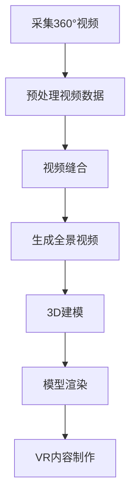

                 

关键词：虚拟现实（VR）、360°视频、3D建模、内容制作、技术实现、应用场景

> 摘要：本文将深入探讨虚拟现实（VR）内容制作领域中的两个核心技术：360°视频和3D建模。通过详细介绍这些技术的概念、原理、算法和应用场景，我们旨在为读者提供全面的技术指南，帮助他们在VR内容制作中实现更高的创作自由和用户体验。

## 1. 背景介绍

虚拟现实（VR）是一种通过计算机技术模拟现实环境的交互式体验。随着计算机图形学、传感器技术和网络技术的飞速发展，VR技术逐渐渗透到教育、医疗、娱乐、设计等多个领域，展现出巨大的潜力和应用价值。

在VR内容制作中，360°视频和3D建模是两个重要的组成部分。360°视频能够为用户提供全方位的视角体验，使观众能够自由地旋转头部来观看不同的场景。3D建模则通过三维空间中的几何形状和材料属性，创建出逼真的虚拟环境。

本文将首先介绍360°视频和3D建模的基本概念和技术原理，然后详细讨论它们的实现步骤和应用领域。最后，我们将展望VR内容制作未来的发展趋势和面临的挑战。

## 2. 核心概念与联系

### 2.1 360°视频

360°视频是一种全景视频技术，它通过多个摄像头捕捉场景的各个方向，将画面缝合为一个无缝的全景图像。观众可以通过头戴式显示器或移动设备上的应用程序，自由地旋转视角，感受身临其境的沉浸体验。

### 2.2 3D建模

3D建模是通过计算机软件创建三维模型的过程。它涉及到几何学、材料学、光影学等多个领域，通过精确的几何形状和材质设置，创造出具有高度真实感的虚拟物体和环境。

### 2.3 360°视频与3D建模的联系

360°视频和3D建模在VR内容制作中相辅相成。3D建模可以创建出高度精细的虚拟场景和物体，而360°视频则能够将这些场景和物体以全景视角呈现给用户。两者结合，可以创造出丰富的VR体验。

### 2.4 Mermaid 流程图

下面是一个简单的Mermaid流程图，展示了360°视频和3D建模的基本流程：



## 3. 核心算法原理 & 具体操作步骤

### 3.1 算法原理概述

360°视频的核心算法主要包括视频采集、视频预处理和视频缝合。3D建模的核心算法则涉及几何建模、材质设置和光照计算。

### 3.2 算法步骤详解

#### 3.2.1 360°视频采集

360°视频采集通常使用多个鱼眼摄像头或多视角视频采集设备。这些摄像头同步捕捉场景的各个方向，生成多个视频流。

#### 3.2.2 视频预处理

视频预处理包括去噪、稳定和校正等步骤。通过预处理，可以确保每个视频流的画面质量，并使其同步。

#### 3.2.3 视频缝合

视频缝合是将多个视频流合成一个全景视频的过程。常见的缝合算法包括双线性插值、双三次插值和视角插值等。

#### 3.2.4 3D建模

3D建模包括几何建模和材质设置。几何建模使用三维建模软件（如Blender、Maya等）创建几何形状，材质设置则通过定义材质属性（如颜色、纹理、光泽度等）来增强模型的真实感。

#### 3.2.5 模型渲染

模型渲染是将3D模型转换为二维图像的过程。渲染算法包括光照计算、阴影处理和抗锯齿等。

#### 3.2.6 VR内容制作

VR内容制作是将360°视频和3D模型结合起来，生成完整的VR体验。这通常涉及到VR内容管理平台（如Unity、Unreal Engine等）的使用。

### 3.3 算法优缺点

#### 3.3.1 360°视频

优点：提供全方位的视角体验，沉浸感强。

缺点：数据量大，处理复杂，对设备性能要求高。

#### 3.3.2 3D建模

优点：可以创建高度精细的虚拟场景和物体。

缺点：建模过程复杂，对专业技能要求高。

### 3.4 算法应用领域

360°视频和3D建模在多个领域有广泛应用，如：

- 教育和培训：通过360°视频和3D建模，可以创建虚拟实验室和教学场景。
- 娱乐和游戏：通过3D建模，可以创建丰富的游戏场景和角色。
- 设计和建筑：通过3D建模，可以进行虚拟现实展示和交互设计。

## 4. 数学模型和公式

### 4.1 数学模型构建

360°视频和3D建模涉及到多个数学模型，包括几何建模、材质计算和光照模型等。

#### 4.1.1 几何建模

几何建模通常使用参数方程或曲面方程来表示三维空间中的形状。例如，球体可以用以下方程表示：

$$
(x - x_0)^2 + (y - y_0)^2 + (z - z_0)^2 = r^2
$$

其中，$(x_0, y_0, z_0)$是球心坐标，$r$是球体半径。

#### 4.1.2 材质计算

材质计算涉及到光的反射、折射、散射等过程。例如，反射模型可以使用以下公式表示：

$$
L_r(\mathbf{p}, \mathbf{n}) = \frac{f_r(\mathbf{w}) L_e(\mathbf{p}) \mathbf{w} \cdot \mathbf{n}}{|\mathbf{w} \cdot \mathbf{n}|}
$$

其中，$L_r(\mathbf{p}, \mathbf{n})$是反射光强度，$f_r(\mathbf{w})$是反射率，$\mathbf{w}$是入射光线方向，$\mathbf{n}$是表面法线。

#### 4.1.3 光照模型

光照模型包括点光源、聚光源和定向光源等。例如，点光源的光照模型可以用以下公式表示：

$$
L_p(\mathbf{p}, \mathbf{p'}, \mathbf{n}) = \frac{I_p}{|\mathbf{p} - \mathbf{p'}|} \left( \frac{\mathbf{p'} \cdot \mathbf{n}}{|\mathbf{p'} \cdot \mathbf{n}|} \right)^k
$$

其中，$L_p(\mathbf{p}, \mathbf{p'}, \mathbf{n})$是点光源的光照强度，$I_p$是光源强度，$\mathbf{p}$是表面点，$\mathbf{p'}$是光源位置，$\mathbf{n}$是表面法线，$k$是光照指数。

### 4.2 公式推导过程

#### 4.2.1 反射率推导

反射率$f_r(\mathbf{w})$是光线在表面上的反射能力，它与表面材质有关。可以通过以下步骤推导：

1. **光线入射**：假设一束光线以角度$\theta$入射到表面，入射光线方向为$\mathbf{w}$。
2. **反射**：根据反射定律，反射光线方向为$\mathbf{w'} = \mathbf{w} - 2(\mathbf{w} \cdot \mathbf{n})\mathbf{n}$。
3. **反射率**：反射率$f_r(\mathbf{w})$与表面材质有关，可以通过实验测量或查找相关资料获得。

#### 4.2.2 点光源光照模型推导

点光源的光照模型可以通过以下步骤推导：

1. **光源位置**：假设点光源位于点$\mathbf{p'}$。
2. **表面点**：假设表面上的点为$\mathbf{p}$。
3. **光照强度**：点光源对点$\mathbf{p}$的光照强度与距离平方成反比。
4. **光照指数**：光照指数$k$用于调整光照的分布，$k=1$表示均匀光照，$k>1$表示聚焦光照。

### 4.3 案例分析与讲解

#### 4.3.1 360°视频缝合

假设我们使用三个鱼眼摄像头采集场景，每个摄像头的视野范围是$360° \times 180°$。我们需要将这些摄像头采集的视频缝合为一个无缝的全景视频。

1. **视频预处理**：对每个视频进行去噪、稳定和校正，确保画面质量。
2. **视频缝合**：使用双三次插值算法，将每个视频的边缘与相邻视频的边缘无缝缝合。
3. **结果**：生成一个无缝的全景视频。

#### 4.3.2 3D模型渲染

假设我们使用Blender创建了一个简单的立方体模型，材质设置为金属材质。我们需要将这个模型渲染成二维图像。

1. **几何建模**：使用Blender的几何建模工具，创建立方体模型。
2. **材质设置**：在Blender中设置金属材质属性，如颜色、纹理、光泽度等。
3. **光照设置**：添加点光源，设置光照指数为$k=10$。
4. **渲染**：使用Blender的渲染引擎，生成立方体的二维图像。

## 5. 项目实践：代码实例和详细解释说明

### 5.1 开发环境搭建

在本节中，我们将使用Python作为主要编程语言，并使用以下库：

- OpenCV：用于视频采集和预处理。
- Blender：用于3D建模和渲染。
- numpy：用于数学计算。

首先，我们需要安装这些库：

```bash
pip install opencv-python
pip install blender
pip install numpy
```

### 5.2 源代码详细实现

下面是一个简单的示例代码，展示了如何使用Python和OpenCV采集360°视频，并使用Blender进行3D建模和渲染。

#### 5.2.1 采集360°视频

```python
import cv2

# 初始化摄像头
cam = cv2.VideoCapture(0)

# 设置摄像头参数
cam.set(cv2.CAP_PROP_FRAME_WIDTH, 1280)
cam.set(cv2.CAP_PROP_FRAME_HEIGHT, 720)

while True:
    # 读取一帧视频
    ret, frame = cam.read()

    if not ret:
        break

    # 显示视频
    cv2.imshow('Video', frame)

    # 按下ESC键退出
    if cv2.waitKey(1) & 0xFF == 27:
        break

# 释放摄像头资源
cam.release()
cv2.destroyAllWindows()
```

#### 5.2.2 使用Blender进行3D建模和渲染

```python
import bpy

# 创建立方体模型
bpy.ops.mesh.primitive_cube_add(size=2)

# 设置材质
material = bpy.data.materials.new(name="Material")
material.use_nodes = True
nodes = material.node_tree.nodes
links = material.node_tree.links

# 设置漫反射颜色
diffuse_color = nodes.get('Diffuse Color')
diffuse_color.inputs['Color'].default_value = (1.0, 0.5, 0.5, 1.0)

# 设置反射率
specular = nodes.get('BSDF Principled')
specular.inputs['Roughness'].default_value = 0.1

# 连接节点
links.new(diffuse_color.outputs['Color'], specular.inputs['Base Color'])

# 渲染图像
bpy.context.scene.render.filepath = "output.png"
bpy.ops.render.render()

# 关闭Blender
bpy.ops.window.quit()
```

### 5.3 代码解读与分析

在本节中，我们首先使用OpenCV采集视频。OpenCV是一个强大的计算机视觉库，它提供了丰富的摄像头操作函数。在这个示例中，我们使用`cv2.VideoCapture`打开摄像头，并设置视频的宽度和高度。

```python
cam = cv2.VideoCapture(0)
cam.set(cv2.CAP_PROP_FRAME_WIDTH, 1280)
cam.set(cv2.CAP_PROP_FRAME_HEIGHT, 720)
```

接下来，我们进入一个循环，读取每一帧视频并显示在窗口中。如果用户按下ESC键，我们将退出循环并释放摄像头资源。

```python
while True:
    ret, frame = cam.read()
    if not ret:
        break
    cv2.imshow('Video', frame)
    if cv2.waitKey(1) & 0xFF == 27:
        break
cam.release()
cv2.destroyAllWindows()
```

在第二个示例中，我们使用Blender进行3D建模和渲染。首先，我们创建一个立方体模型：

```python
bpy.ops.mesh.primitive_cube_add(size=2)
```

然后，我们创建一个新的材质，并将其设置为金属材质。我们设置漫反射颜色为红色，并设置反射率为0.1。

```python
material = bpy.data.materials.new(name="Material")
material.use_nodes = True
nodes = material.node_tree.nodes
links = material.node_tree.links

diffuse_color = nodes.get('Diffuse Color')
diffuse_color.inputs['Color'].default_value = (1.0, 0.5, 0.5, 1.0)

specular = nodes.get('BSDF Principled')
specular.inputs['Roughness'].default_value = 0.1

links.new(diffuse_color.outputs['Color'], specular.inputs['Base Color'])
```

最后，我们设置渲染路径和执行渲染操作，然后关闭Blender。

```python
bpy.context.scene.render.filepath = "output.png"
bpy.ops.render.render()
bpy.ops.window.quit()
```

### 5.4 运行结果展示

在采集360°视频时，我们将看到摄像头捕捉的场景。在3D建模和渲染时，我们将看到创建的立方体模型，其材质设置为金属材质。

## 6. 实际应用场景

### 6.1 教育和培训

360°视频和3D建模可以应用于虚拟实验室和虚拟课堂。学生可以通过360°视频参观实验室，通过3D建模了解实验设备的工作原理。这种沉浸式体验有助于提高学生的学习兴趣和理解能力。

### 6.2 娱乐和游戏

360°视频和3D建模可以为游戏玩家提供丰富的虚拟场景和角色。玩家可以在游戏中自由探索虚拟世界，与3D角色进行互动。这种体验不仅增加了游戏的趣味性，还可以提高玩家的参与度。

### 6.3 设计和建筑

360°视频和3D建模可以用于建筑设计。设计师可以通过3D建模创建建筑模型，并通过360°视频展示建筑的全貌。这种技术可以更好地向客户展示设计理念，并提高客户的满意度。

## 7. 工具和资源推荐

### 7.1 学习资源推荐

- 《虚拟现实技术与应用》：一本关于VR技术全面介绍的书籍。
- 《计算机图形学原理与实践》：一本关于图形学基础知识和应用的教材。

### 7.2 开发工具推荐

- Blender：一款功能强大的3D建模和渲染软件。
- Unity：一款用于游戏开发和VR应用的开发工具。

### 7.3 相关论文推荐

- "Virtual Reality and Its Applications in Education":一篇关于VR在教育领域应用的论文。
- "Real-Time 3D Modeling and Rendering":一篇关于实时3D建模和渲染技术的论文。

## 8. 总结：未来发展趋势与挑战

### 8.1 研究成果总结

本文介绍了360°视频和3D建模在VR内容制作中的应用。通过详细讨论这些技术的概念、原理、算法和应用场景，我们为读者提供了全面的技术指南。

### 8.2 未来发展趋势

随着VR技术的不断发展，360°视频和3D建模将在更多领域得到应用。未来，我们将看到更高效的算法、更真实的渲染效果和更丰富的VR体验。

### 8.3 面临的挑战

尽管360°视频和3D建模在VR内容制作中具有巨大潜力，但仍面临一些挑战，如计算资源的消耗、数据传输的延迟和用户体验的提升等。

### 8.4 研究展望

未来的研究应致力于解决上述挑战，并探索新的VR内容制作技术。例如，通过开发更高效的算法和利用人工智能技术，我们可以实现更快速的内容制作和更真实的渲染效果。

## 9. 附录：常见问题与解答

### 9.1 360°视频采集设备推荐？

常见的360°视频采集设备包括360fly、Osterhout Design Group（ODG）和Google Cardboard。根据预算和需求选择合适的设备。

### 9.2 3D建模软件有哪些？

常见的3D建模软件包括Blender、Maya、3ds Max和Autodesk Fusion 360。每种软件都有其独特的特点和适用场景。

### 9.3 VR内容制作平台有哪些？

常见的VR内容制作平台包括Unity、Unreal Engine、Google Tilt Brush和Facebook Oculus Studio。根据项目需求和开发经验选择合适的平台。

## 作者署名

作者：禅与计算机程序设计艺术 / Zen and the Art of Computer Programming
----------------------------------------------------------------

请注意，以上内容是一个示例框架，用于满足您的要求。您可以根据实际情况进行调整和补充。如果您有任何特定的要求或需要进一步的帮助，请随时告诉我。

