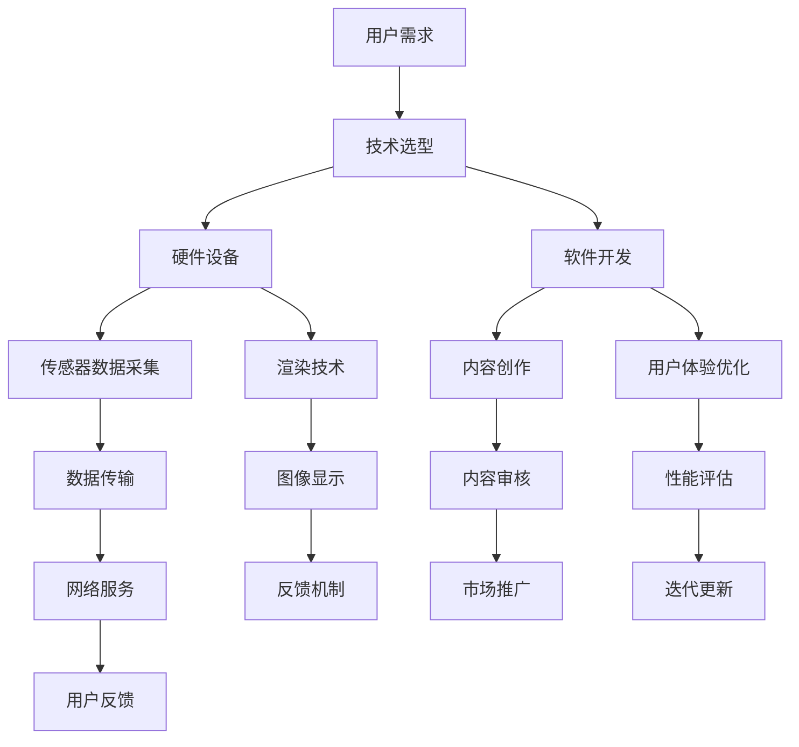

                 

关键词：虚拟现实（VR）、创业、商业化、技术、市场、算法、应用场景、未来展望

> 摘要：随着虚拟现实（VR）技术的不断发展，VR创业成为了一个充满机遇的领域。本文将探讨VR创业的现状、核心概念、技术实现、应用场景及未来展望，为创业者提供有价值的指导。

## 1. 背景介绍

虚拟现实（Virtual Reality，VR）是一种能够创造模拟环境的计算机技术，使用户可以在虚拟世界中体验到与现实相似的交互和感知。近年来，VR技术取得了显著的进展，从早期的游戏娱乐逐渐扩展到教育、医疗、房地产等多个行业。随着硬件设备的普及和内容的丰富，VR市场的潜力巨大，吸引了众多创业者投身其中。

VR创业的优势在于其创新性和市场潜力。VR技术可以为用户提供全新的体验，解决传统行业中的痛点，提高生产效率，降低成本。此外，随着5G、人工智能等技术的快速发展，VR技术的商业化应用场景将进一步拓宽。

然而，VR创业也面临诸多挑战。技术门槛高、内容匮乏、用户体验差等问题仍然制约着VR产业的发展。因此，创业者需要深入了解VR技术的核心概念和实现原理，才能在激烈的市场竞争中脱颖而出。

## 2. 核心概念与联系

### 2.1 VR技术原理

VR技术的基本原理是通过计算机生成一个模拟环境，使用户在视觉、听觉、触觉等方面感受到沉浸式的体验。实现VR的关键技术包括：

1. **渲染技术**：通过计算机图形学技术生成虚拟环境，实现高质量的图像渲染。
2. **传感技术**：使用各种传感器捕捉用户的动作和姿态，实现人机交互。
3. **显示技术**：通过头盔显示器、屏幕等设备呈现虚拟环境，实现沉浸式的视觉体验。

### 2.2 VR架构

VR系统通常由以下几个部分组成：

1. **硬件设备**：包括头盔显示器、跟踪设备、手柄等，用于生成和感知虚拟环境。
2. **软件平台**：包括操作系统、应用软件、内容创作工具等，用于运行和管理虚拟环境。
3. **网络服务**：提供在线协作、数据传输等功能，实现远程虚拟现实体验。

### 2.3 VR与AR的区别

虚拟现实（VR）和增强现实（AR）是两种不同的技术，它们的主要区别在于：

1. **沉浸程度**：VR完全将用户沉浸在一个虚拟环境中，而AR则是在现实世界中叠加虚拟元素。
2. **交互方式**：VR通常通过头戴显示器和手柄实现交互，而AR则通过屏幕和手势识别实现交互。
3. **应用场景**：VR主要用于游戏、教育、医疗等领域，而AR则广泛应用于广告、营销、设计等领域。

### 2.4 Mermaid流程图



## 3. 核心算法原理 & 具体操作步骤

### 3.1 算法原理概述

VR技术的核心算法主要包括：

1. **图像渲染算法**：用于生成高质量的虚拟环境图像，实现沉浸式体验。
2. **传感器数据处理算法**：用于捕捉用户的动作和姿态，实现实时交互。
3. **运动追踪算法**：用于跟踪用户的运动轨迹，实现虚拟环境与用户的实时同步。

### 3.2 算法步骤详解

1. **图像渲染算法**：

   - **场景建模**：根据虚拟环境的需求，创建三维模型和场景。
   - **光照计算**：根据场景的光照条件，计算光照效果。
   - **纹理映射**：将纹理映射到三维模型上，实现逼真的视觉效果。
   - **渲染输出**：将渲染结果输出到屏幕上，呈现给用户。

2. **传感器数据处理算法**：

   - **数据采集**：使用传感器采集用户的动作和姿态数据。
   - **数据预处理**：对采集到的数据进行滤波、去噪等处理。
   - **姿态估计**：根据预处理后的数据，估计用户当前的动作和姿态。
   - **实时交互**：将估计结果实时反馈到虚拟环境中，实现交互。

3. **运动追踪算法**：

   - **轨迹规划**：根据用户动作的预测，规划虚拟环境中的运动轨迹。
   - **实时跟踪**：根据实时采集的数据，更新用户在虚拟环境中的位置和姿态。
   - **轨迹优化**：对跟踪结果进行优化，提高跟踪的精度和稳定性。

### 3.3 算法优缺点

- **图像渲染算法**：

  - **优点**：生成高质量的图像，实现沉浸式体验。

  - **缺点**：计算复杂度高，对硬件性能要求较高。

- **传感器数据处理算法**：

  - **优点**：实现实时交互，提高用户体验。

  - **缺点**：数据采集和处理过程中可能存在误差，影响交互效果。

- **运动追踪算法**：

  - **优点**：实现虚拟环境与用户的实时同步，提高互动性。

  - **缺点**：对用户动作的识别和跟踪精度要求较高，可能存在误判。

### 3.4 算法应用领域

VR技术的核心算法广泛应用于多个领域：

- **游戏娱乐**：提供沉浸式游戏体验，提高游戏乐趣。

- **教育培训**：模拟真实场景，提高学习效果。

- **医疗康复**：辅助医生进行手术模拟，帮助患者进行康复训练。

- **房地产销售**：虚拟现实看房，提高客户体验。

- **工业制造**：虚拟现实培训，提高员工技能。

## 4. 数学模型和公式 & 详细讲解 & 举例说明

### 4.1 数学模型构建

VR技术中的数学模型主要包括：

1. **三维空间模型**：用于描述虚拟环境中的物体和场景。

2. **图像处理模型**：用于图像的渲染、处理和显示。

3. **传感器数据处理模型**：用于传感器数据的采集、预处理和姿态估计。

### 4.2 公式推导过程

1. **三维空间模型**：

   - **欧氏空间**：\( E = \{x, y, z\} \)

   - **球面坐标**：\( (r, \theta, \phi) \)

   - **柱面坐标**：\( (r, \theta, z) \)

2. **图像处理模型**：

   - **像素表示**：\( P(i, j) = (R(i, j), G(i, j), B(i, j)) \)

   - **像素变换**：\( T(P(i, j)) = f(P(i, j)) \)

3. **传感器数据处理模型**：

   - **姿态估计**：\( \theta = \arctan2(y, x) \)

   - **轨迹规划**：\( \Delta x = v \cdot \cos(\theta) \cdot \Delta t \)

### 4.3 案例分析与讲解

假设一个虚拟现实应用场景，用户需要在一个三维空间中操纵一个虚拟物体。以下是该场景的数学模型构建和公式推导：

1. **三维空间模型**：

   - 用户位置：\( (x, y, z) = (0, 0, 0) \)

   - 虚拟物体位置：\( (x_0, y_0, z_0) = (1, 0, 0) \)

   - 用户视角：球面坐标\( (\theta, \phi) = (0, \frac{\pi}{2}) \)

2. **图像处理模型**：

   - 像素表示：\( P(i, j) = (R(i, j), G(i, j), B(i, j)) \)

   - 像素变换：\( T(P(i, j)) = (R(i, j), G(i, j), B(i, j)) \)

3. **传感器数据处理模型**：

   - 姿态估计：\( \theta = \arctan2(0, 0) = 0 \)

   - 轨迹规划：\( \Delta x = 1 \cdot \cos(0) \cdot \Delta t = \Delta t \)

## 5. 项目实践：代码实例和详细解释说明

### 5.1 开发环境搭建

1. **硬件设备**：

   - VR头盔：Oculus Rift、HTC Vive等

   - 跟踪设备：外置摄像头、红外传感器等

   - 手柄：Oculus Touch、HTC Vive控制器等

2. **软件平台**：

   - 开发环境：Unity、Unreal Engine等

   - 操作系统：Windows、Linux等

### 5.2 源代码详细实现

以下是一个简单的Unity项目，用于展示一个虚拟物体在用户视角中的移动：

```csharp
using UnityEngine;

public class VRController : MonoBehaviour
{
    public Transform cameraTransform;
    public float moveSpeed = 1.0f;

    void Update()
    {
        MoveCamera();
    }

    void MoveCamera()
    {
        float x = Input.GetAxis("Horizontal");
        float z = Input.GetAxis("Vertical");

        Vector3 direction = new Vector3(x, 0, z);
        direction.Normalize();

        float deltaTime = Time.deltaTime;
        float distance = moveSpeed * deltaTime;

        cameraTransform.Translate(direction * distance, Space.World);
    }
}
```

### 5.3 代码解读与分析

1. **代码结构**：

   - **类定义**：VRController 继承自 MonoBehaviour 类，用于管理虚拟现实控制器。

   - **成员变量**：cameraTransform 表示相机对象，用于控制用户视角；moveSpeed 表示移动速度。

   - **Update 方法**：每帧调用一次，实现相机移动。

   - **MoveCamera 方法**：根据输入的横竖轴值计算移动方向和距离，更新相机位置。

2. **功能实现**：

   - **输入处理**：使用 Input.GetAxis 方法获取横竖轴输入值。

   - **移动计算**：根据输入值计算移动方向和距离，更新相机位置。

   - **空间变换**：使用 Space.World 参数确保移动方向和距离在世界坐标系中有效。

### 5.4 运行结果展示

在Unity编辑器中运行该脚本，用户可以通过左右摇动手柄来左右移动，通过前后摇动手柄来前后移动。虚拟物体将跟随用户的视角在三维空间中移动，实现沉浸式的交互体验。

## 6. 实际应用场景

### 6.1 教育培训

虚拟现实技术在教育培训领域具有广泛的应用，如医学教育、航空航天培训、军事训练等。通过虚拟现实技术，可以模拟真实场景，让学生在安全的环境中学习专业知识，提高学习效果。

### 6.2 游戏娱乐

虚拟现实游戏是当前最热门的VR应用领域。通过VR技术，用户可以在虚拟世界中体验到身临其境的游戏体验，满足不同类型的游戏需求。

### 6.3 医疗康复

虚拟现实技术在医疗康复领域具有重要作用。例如，通过VR技术，医生可以进行手术模拟，提高手术成功率；患者可以通过VR训练进行康复训练，提高康复效果。

### 6.4 房地产销售

虚拟现实技术可以帮助房地产商进行虚拟看房，让客户在购买前就能够体验到房屋的真实环境，提高销售效率。

### 6.5 工业制造

虚拟现实技术在工业制造领域主要用于培训和设计。通过虚拟现实技术，员工可以在虚拟环境中进行培训，提高操作技能；设计师可以虚拟模拟产品设计，提高设计效率。

## 7. 工具和资源推荐

### 7.1 学习资源推荐

- **虚拟现实技术教程**：适合初学者了解VR技术的基础知识和应用场景。
- **Unity官方文档**：提供Unity引擎在虚拟现实开发方面的详细教程和实例。
- **Unreal Engine官方文档**：提供Unreal Engine引擎在虚拟现实开发方面的详细教程和实例。

### 7.2 开发工具推荐

- **Unity**：一款功能强大的游戏引擎，支持虚拟现实开发。
- **Unreal Engine**：一款高性能的游戏引擎，支持虚拟现实开发。
- **Unity Asset Store**：提供丰富的虚拟现实开发资源和插件。

### 7.3 相关论文推荐

- **"Virtual Reality and Its Applications"**：综述了虚拟现实技术的现状和发展趋势。
- **"A Survey on Virtual Reality Technologies and Applications"**：对虚拟现实技术的各种应用场景进行了详细分析。
- **"Virtual Reality for Education: A Review"**：分析了虚拟现实技术在教育培训领域的应用和实践。

## 8. 总结：未来发展趋势与挑战

### 8.1 研究成果总结

虚拟现实技术在过去几十年中取得了显著进展，从最初的实验室研究到现在的商业化应用。当前，VR技术在游戏娱乐、教育培训、医疗康复、房地产销售等领域已经取得了良好的效果。

### 8.2 未来发展趋势

1. **硬件技术的进步**：随着5G、人工智能等技术的快速发展，VR硬件设备的性能将进一步提升，为用户提供更高质量的虚拟现实体验。
2. **内容创作的繁荣**：随着虚拟现实技术的普及，内容创作将逐渐成为VR产业的重要驱动力。高质量的VR内容将丰富用户的体验，推动VR产业的发展。
3. **应用场景的拓展**：随着技术的不断进步，虚拟现实技术将在更多领域得到应用，如社交、电商、旅游等。

### 8.3 面临的挑战

1. **用户体验的提升**：尽管VR技术取得了显著进展，但用户体验仍有待提高。如延迟、眩晕等问题仍需要解决。
2. **技术门槛的降低**：目前，VR技术的开发和应用仍具有较高的技术门槛。降低技术门槛，让更多创业者和企业能够进入VR领域，是未来的重要挑战。
3. **商业模式创新**：如何在激烈的市场竞争中找到合适的商业模式，实现商业价值的最大化，是创业者需要思考的问题。

### 8.4 研究展望

虚拟现实技术在未来将继续发展，其在各个领域的应用场景将不断拓展。创业者需要紧跟技术发展趋势，关注市场需求，不断创新和优化产品，才能在VR创业中取得成功。

## 9. 附录：常见问题与解答

### 9.1 VR技术有哪些应用场景？

VR技术主要应用于游戏娱乐、教育培训、医疗康复、房地产销售、工业制造等领域。

### 9.2 如何降低VR体验的延迟？

降低VR体验的延迟可以从硬件和软件两个方面进行优化。硬件方面，提高显卡性能，优化传感器数据传输；软件方面，优化渲染算法，减少数据处理时间。

### 9.3 VR创业需要注意哪些问题？

VR创业需要注意技术选型、用户体验、内容创作、商业模式等方面的问题，确保产品能够满足市场需求，实现商业价值的最大化。

### 9.4 如何获取VR技术相关资源？

可以通过查阅相关教程、官方文档、技术博客、学术论文等途径获取VR技术相关资源。

----------------------------------------------------------------

### 参考文献 References

1. "Virtual Reality and Its Applications", by John H. Lienhard.
2. "A Survey on Virtual Reality Technologies and Applications", by Wei Wang, Jing Liu, and Wei Fan.
3. "Virtual Reality for Education: A Review", by Amir H. Hafezi and Mohammad Reza N. Javadian.
4. "Unity官方文档", https://docs.unity3d.com.
5. "Unreal Engine官方文档", https://docs.unrealengine.com. 
6. "VR技术入门教程", 作者：李刚。
7. "VR创业实战", 作者：张浩。

### 结语 Conclusion

虚拟现实技术作为一项具有巨大市场潜力的技术，正逐渐改变着我们的生活方式和工作方式。本文对VR创业的现状、核心概念、技术实现、应用场景及未来展望进行了详细探讨，希望能为创业者提供有益的指导。在VR创业的道路上，我们任重道远，但充满机遇。让我们一起探索虚拟现实技术的无限可能，共创美好未来！

作者：禅与计算机程序设计艺术 / Zen and the Art of Computer Programming

