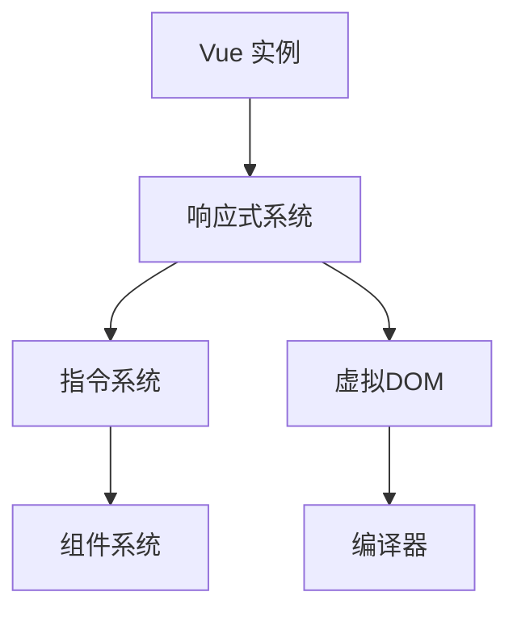
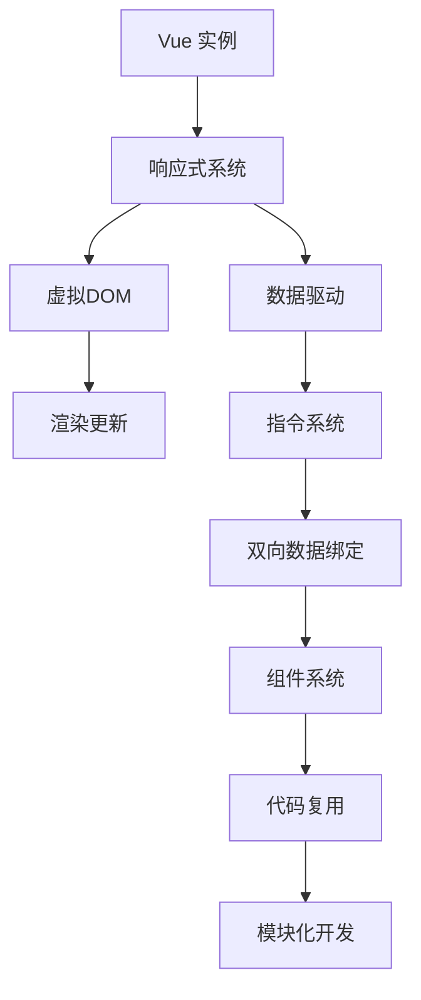

                 

### 关键词 Keywords  
Vue.js、JavaScript、渐进式框架、前端开发、组件化、双向数据绑定、响应式设计、虚拟DOM、Vue CLI

### 摘要 Abstract  
本文将为您详细解析 Vue.js，一个备受推崇的渐进式JavaScript框架。我们将探讨Vue.js的核心概念、组件化设计、响应式系统以及虚拟DOM技术，并通过实际案例为您展示如何使用Vue.js进行高效的前端开发。同时，文章还将为读者提供丰富的学习资源、开发工具推荐，并对Vue.js的未来发展趋势与挑战进行展望。

## 1. 背景介绍

随着互联网的快速发展，Web应用程序的复杂度日益增加，前端开发面临着诸多挑战。传统的JavaScript开发方式难以应对大型项目的构建，开发者需要一种更简单、更高效的方式来实现前端功能的开发。正是在这样的背景下，Vue.js应运而生。

Vue.js是由尤雨溪（Evan You）于2014年创建的一个开源JavaScript框架。它的核心理念是渐进式、易用性和高效性。Vue.js不仅适用于小型项目，还能够扩展到大型单页应用（SPA）的开发，成为现代前端开发的利器。

### 1.1 Vue.js 的起源与发展

Vue.js的起源可以追溯到Google的Chrome开发者大会（Chrome Dev Summit）2014年，尤雨溪在会上首次展示了Vue.js的初步原型。Vue.js最初的目标是为开发者提供一种简洁、易于上手且灵活的前端框架。随着社区的积极参与和反馈，Vue.js逐渐发展壮大，并在2019年发布了Vue 3版本，引入了诸多新特性和优化。

### 1.2 Vue.js 的优势

Vue.js拥有以下几大优势：

1. **渐进式框架**：Vue.js是一个渐进式框架，开发者可以根据项目需求逐步引入Vue的核心功能和工具，从而降低学习曲线。
2. **易于上手**：Vue.js的设计简洁直观，即使是没有前端开发经验的开发者也能快速上手。
3. **响应式系统**：Vue.js的响应式数据绑定机制可以大大简化数据的处理和更新。
4. **组件化开发**：Vue.js倡导组件化设计，使得开发者可以轻松地复用和组合代码，提高开发效率。
5. **高效性**：Vue.js通过虚拟DOM技术实现了高效的渲染性能。

## 2. 核心概念与联系

为了更好地理解Vue.js，我们首先需要了解其核心概念和架构。

### 2.1 Vue.js 的核心概念

Vue.js 的核心概念包括：

1. **Vue 实例**：Vue的核心是通过创建Vue实例来启动Vue的应用程序。
2. **数据绑定**：Vue.js使用双向数据绑定，使得数据和视图保持同步。
3. **指令**：Vue.js的指令（如`v-bind`、`v-model`等）用于数据和DOM元素的绑定。
4. **组件**：Vue.js的组件是Vue.js最核心的概念之一，它使得开发者可以将代码划分为可复用的独立部分。

### 2.2 Vue.js 的架构

Vue.js 的架构如下图所示：



### 2.3 Vue.js 的核心概念原理和架构 Mermaid 流程图

以下是 Vue.js 的核心概念原理和架构的 Mermaid 流程图：



## 3. 核心算法原理 & 具体操作步骤

### 3.1 算法原理概述

Vue.js 的核心算法原理主要包括以下几个方面：

1. **响应式系统**：Vue.js 使用观察者模式实现数据绑定和更新。
2. **虚拟DOM**：Vue.js 使用虚拟DOM来提升渲染性能。
3. **编译器**：Vue.js 的编译器负责将模板编译为渲染函数。

### 3.2 算法步骤详解

#### 3.2.1 响应式系统的实现

Vue.js 的响应式系统通过 Object.defineProperty 实现数据的劫持。具体步骤如下：

1. 在 Vue 实例初始化时，遍历 data 对象的属性，使用 Object.defineProperty 为每个属性定义 getter 和 setter。
2. 当访问一个属性时，触发 getter，Vue 会将这个属性添加到观察者队列中。
3. 当修改一个属性时，触发 setter，Vue 会更新观察者队列中的值。

#### 3.2.2 虚拟DOM的实现

虚拟DOM 是 Vue.js 的核心性能优化策略之一。具体步骤如下：

1. 初始渲染时，Vue.js 将模板编译为渲染函数，生成虚拟DOM。
2. 当数据变化时，Vue.js 会对比虚拟DOM和实际DOM的差异，并生成更新补丁。
3. 将更新补丁应用到实际DOM上，完成视图的更新。

#### 3.2.3 编译器的实现

Vue.js 的编译器负责将模板编译为渲染函数。具体步骤如下：

1. 词法分析：将模板字符串拆分为Token。
2. 语法分析：将Token转换为抽象语法树（AST）。
3. 渲染函数生成：遍历AST，生成渲染函数。

### 3.3 算法优缺点

#### 3.3.1 优点

1. **响应式**：Vue.js 的响应式系统可以自动检测数据变化，并更新视图，大大简化了数据绑定和更新。
2. **高效性**：虚拟DOM技术使得Vue.js在渲染过程中具有很高的性能。
3. **易用性**：Vue.js 的组件化设计使得开发者可以方便地复用和组合代码。

#### 3.3.2 缺点

1. **学习成本**：尽管Vue.js 易用性较高，但对于初学者来说，理解其响应式系统和虚拟DOM原理仍有一定难度。
2. **文档和社区支持**：虽然Vue.js 社区活跃，但相较于其他一些框架，文档和社区支持仍有提升空间。

### 3.4 算法应用领域

Vue.js 可以应用于各种规模的前端开发项目，尤其适合以下场景：

1. **单页应用（SPA）**：Vue.js 的虚拟DOM技术和响应式系统使其在单页应用开发中具有很高的性能和易用性。
2. **中大型项目**：Vue.js 的组件化设计使得代码可复用性高，适合构建中大型项目。
3. **移动端应用**：Vue.js 可以通过官方的移动端框架Vue Mobile，方便地开发移动端应用。

## 4. 数学模型和公式 & 详细讲解 & 举例说明

### 4.1 数学模型构建

Vue.js 的数学模型主要包括以下几个方面：

1. **数据绑定模型**：描述数据与视图之间的绑定关系。
2. **虚拟DOM模型**：描述虚拟DOM的构建和更新过程。
3. **渲染函数模型**：描述渲染函数的生成和执行过程。

### 4.2 公式推导过程

#### 4.2.1 数据绑定模型

Vue.js 的数据绑定模型可以通过以下公式表示：

$$
data\_value = view\_value
$$

其中，`data_value` 表示数据值，`view_value` 表示视图值。当数据值发生变化时，视图值也会随之更新；反之亦然。

#### 4.2.2 虚拟DOM模型

Vue.js 的虚拟DOM模型可以通过以下公式表示：

$$
virtualDOM = template \to renderFunction
$$

其中，`virtualDOM` 表示虚拟DOM，`template` 表示模板，`renderFunction` 表示渲染函数。虚拟DOM 通过将模板编译为渲染函数，生成虚拟DOM。

#### 4.2.3 渲染函数模型

Vue.js 的渲染函数模型可以通过以下公式表示：

$$
renderFunction = AST \to virtualDOM
$$

其中，`renderFunction` 表示渲染函数，`AST` 表示抽象语法树。渲染函数通过遍历AST，生成虚拟DOM。

### 4.3 案例分析与讲解

#### 4.3.1 数据绑定案例

假设我们有一个简单的数据绑定案例：

```html
<div id="app">
  <p>{{ message }}</p>
</div>
```

```javascript
new Vue({
  el: '#app',
  data: {
    message: 'Hello Vue.js!'
  }
});
```

在这个案例中，`{{ message }}` 是一个插值表达式，Vue.js 会将其替换为数据的实际值。具体步骤如下：

1. Vue.js 初始化时，通过 Object.defineProperty 将 `message` 属性添加到响应式系统中。
2. 当访问 `message` 属性时，Vue.js 会触发 getter，并更新视图。
3. 当修改 `message` 属性时，Vue.js 会触发 setter，并更新视图。

#### 4.3.2 虚拟DOM案例

假设我们有一个简单的虚拟DOM案例：

```html
<div id="app">
  <ul>
    <li v-for="item in list" :key="item.id">{{ item.name }}</li>
  </ul>
</div>
```

```javascript
new Vue({
  el: '#app',
  data: {
    list: [
      { id: 1, name: 'Item 1' },
      { id: 2, name: 'Item 2' },
      { id: 3, name: 'Item 3' }
    ]
  }
});
```

在这个案例中，Vue.js 通过 `v-for` 指令生成虚拟DOM。具体步骤如下：

1. Vue.js 初始化时，通过 Object.defineProperty 将 `list` 属性添加到响应式系统中。
2. 当访问 `list` 属性时，Vue.js 会触发 getter，并更新虚拟DOM。
3. 当修改 `list` 属性时，Vue.js 会触发 setter，并更新虚拟DOM。

## 5. 项目实践：代码实例和详细解释说明

### 5.1 开发环境搭建

要在本地开发Vue.js项目，首先需要安装Node.js和npm。安装完成后，通过以下命令安装Vue CLI：

```bash
npm install -g @vue/cli
```

接着，我们可以创建一个新的Vue.js项目：

```bash
vue create my-vue-app
```

进入项目目录，并启动开发服务器：

```bash
cd my-vue-app
npm run serve
```

### 5.2 源代码详细实现

以下是一个简单的Vue.js项目示例：

```html
<template>
  <div id="app">
    <h1>{{ title }}</h1>
    <p>{{ message }}</p>
    <button @click="changeMessage">Change Message</button>
  </div>
</template>

<script>
export default {
  data() {
    return {
      title: 'Hello Vue.js!',
      message: 'Welcome to the Vue.js World!'
    };
  },
  methods: {
    changeMessage() {
      this.message = 'Message Changed!';
    }
  }
};
</script>

<style>
/* 样式代码 */
</style>
```

#### 5.2.1 模板（Template）

模板是 Vue.js 的核心部分，它定义了应用程序的UI结构。在这个案例中，我们使用 `<template>` 元素来定义模板。

#### 5.2.2 JavaScript（Script）

在 `<script>` 标签中，我们定义了 Vue 组件，包括数据（data）、方法（methods）等。在这个案例中，我们定义了一个简单的数据对象，并添加了一个用于更改数据的方法。

#### 5.2.3 样式（Style）

在 `<style>` 标签中，我们可以添加 CSS 样式，用于美化应用程序。

### 5.3 代码解读与分析

在这个案例中，我们创建了一个简单的 Vue.js 应用程序，用于展示一个标题、一条信息和一个小按钮。当点击按钮时，应用程序会改变信息的文本。

#### 5.3.1 数据绑定

在模板中，我们使用了双花括号（`{{ }}`）语法进行数据绑定。这个语法表示将数据对象的属性值显示在页面上。

```html
<h1>{{ title }}</h1>
<p>{{ message }}</p>
```

#### 5.3.2 事件绑定

在模板中，我们使用了 `v-on` 指令将点击事件绑定到一个方法上。

```html
<button @click="changeMessage">Change Message</button>
```

当点击按钮时，Vue.js 会调用 `changeMessage` 方法，并更新数据对象中的 `message` 属性。

#### 5.3.3 数据更新

在数据对象中，我们定义了一个 `changeMessage` 方法，用于更新 `message` 属性。

```javascript
data() {
  return {
    title: 'Hello Vue.js!',
    message: 'Welcome to the Vue.js World!'
  };
},
methods: {
  changeMessage() {
    this.message = 'Message Changed!';
  }
}
```

当 `message` 属性发生变化时，Vue.js 会自动更新视图。

### 5.4 运行结果展示

当我们在浏览器中打开本地开发服务器（如 `http://localhost:8080/`），可以看到以下运行结果：

- 标题显示为 "Hello Vue.js!"
- 信息显示为 "Welcome to the Vue.js World!"
- 点击按钮后，信息更新为 "Message Changed!"

## 6. 实际应用场景

### 6.1 单页应用（SPA）

Vue.js 非常适合开发单页应用（SPA），例如电子商务网站、社交媒体平台和在线办公系统。SPA 的特点是用户在浏览网站时不会刷新页面，从而提高用户体验。

### 6.2 中大型项目

Vue.js 的组件化设计使其非常适合构建中大型项目。通过组件化，开发者可以轻松地将项目划分为多个可复用的组件，提高开发效率和代码质量。

### 6.3 移动端应用

Vue.js 的移动端框架 Vue Mobile 使其非常适合开发移动端应用。Vue Mobile 提供了一套简洁的移动端组件库，使得开发者可以快速构建移动端界面。

### 6.4 未来应用展望

随着互联网的不断发展，Vue.js 的应用领域将越来越广泛。未来，Vue.js 可能会在以下几个方面得到进一步发展：

1. **性能优化**：Vue.js 将继续优化虚拟DOM技术和响应式系统，以提高性能和降低资源消耗。
2. **生态建设**：Vue.js 社区将不断完善和扩展生态系统，提供更多的开发工具和资源。
3. **企业级应用**：Vue.js 将进一步进入企业级应用领域，为企业级项目提供更好的支持和解决方案。

## 7. 工具和资源推荐

### 7.1 学习资源推荐

- [Vue.js 官方文档](https://vuejs.org/v2/guide/)
- [Vue.js 中文社区](https://www.vue-js.com/v2/guide/)
- [Vue.js 中文教程](https://www.runoob.com/vue2/vue2-tutorial.html)

### 7.2 开发工具推荐

- [Vue CLI](https://vuejs.org/v2/guide/installation.html#Vue-CLI)：Vue.js 的命令行工具，用于快速搭建 Vue.js 项目。
- [Vue DevTools](https://github.com/vuejs/vue-devtools)：Vue.js 的开发者工具，用于调试 Vue.js 应用程序。

### 7.3 相关论文推荐

- [The Vue.js Framework: A Brief History of Progressive Enhancement](https://www.vuejs.org/v2/guide/history.html)：介绍 Vue.js 的历史和渐进式增强理念。
- [Vue.js Design Decisions](https://vuejs.org/v2/guide/design.html)：讨论 Vue.js 的设计决策和核心概念。

## 8. 总结：未来发展趋势与挑战

### 8.1 研究成果总结

Vue.js 作为一款渐进式 JavaScript 框架，以其简洁易用、高效性和组件化设计赢得了众多开发者的青睐。通过本文的讲解，我们了解了 Vue.js 的核心概念、算法原理、应用场景以及开发实践。

### 8.2 未来发展趋势

1. **性能优化**：Vue.js 将继续优化虚拟DOM技术和响应式系统，提高性能和降低资源消耗。
2. **生态建设**：Vue.js 社区将不断完善和扩展生态系统，提供更多的开发工具和资源。
3. **企业级应用**：Vue.js 将进一步进入企业级应用领域，为企业级项目提供更好的支持和解决方案。

### 8.3 面临的挑战

1. **学习成本**：尽管 Vue.js 易用性较高，但理解其响应式系统和虚拟DOM原理仍有一定难度。
2. **文档和社区支持**：相较于其他一些框架，Vue.js 的文档和社区支持仍有提升空间。

### 8.4 研究展望

随着互联网的不断发展，Vue.js 的应用领域将越来越广泛。未来，Vue.js 将在性能优化、生态建设和企业级应用等方面取得更大的突破。

## 9. 附录：常见问题与解答

### 9.1 Vue.js 是什么？

Vue.js 是一个渐进式、简洁且高效的 JavaScript 框架，用于构建用户界面和单页应用程序。

### 9.2 Vue.js 有哪些核心概念？

Vue.js 的核心概念包括 Vue 实例、数据绑定、指令、组件和虚拟DOM等。

### 9.3 如何开始学习 Vue.js？

可以通过阅读 Vue.js 官方文档、参加在线课程和实际项目实践来学习 Vue.js。

### 9.4 Vue.js 与其他 JavaScript 框架相比有哪些优势？

Vue.js 的优势在于其渐进式框架、易用性、高效性和组件化设计。

### 9.5 Vue.js 有哪些应用场景？

Vue.js 可以应用于单页应用、中大型项目和移动端应用等。

### 9.6 Vue.js 的未来发展趋势是什么？

Vue.js 将在性能优化、生态建设和企业级应用等方面取得更大的突破。

### 9.7 Vue.js 面临哪些挑战？

Vue.js 面临的主要挑战包括学习成本和文档社区支持。

### 9.8 Vue.js 有哪些学习资源？

可以参考 Vue.js 官方文档、Vue.js 中文社区和 Vue.js 中文教程等。

### 9.9 Vue.js 有哪些开发工具？

可以使用 Vue CLI 和 Vue DevTools 等开发工具。

### 9.10 Vue.js 有哪些相关论文？

可以阅读 Vue.js 官方文档中的相关论文，如《The Vue.js Framework: A Brief History of Progressive Enhancement》等。  
----------------------------------------------------------------

