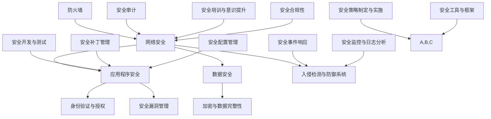

                 

关键词：Web安全、安全策略、网络安全、应用程序安全、安全威胁、威胁防护、安全措施、安全漏洞、安全审计

> 摘要：本文旨在探讨现代Web应用程序所面临的安全威胁，以及如何通过有效的安全策略来保护这些应用程序免受攻击。文章首先介绍了Web安全的重要性，然后详细分析了常见的安全威胁类型，并提出了具体的防御措施。此外，本文还讨论了安全策略的实施步骤，并提供了实用的工具和资源推荐。

## 1. 背景介绍

随着互联网技术的飞速发展，Web应用程序已经成为了现代企业和个人生活中不可或缺的一部分。无论是电商平台、社交媒体、在线银行，还是企业内部管理系统，Web应用程序在提供便捷服务的同时，也带来了巨大的安全风险。据统计，每年全球因网络安全攻击导致的损失高达数十亿美元。因此，确保Web应用程序的安全性成为了企业和开发者的首要任务。

然而，Web安全并非一个简单的概念。它涉及多个方面，包括技术安全、应用程序安全、网络安全、数据安全等。不同的安全威胁具有不同的特点和攻击手段，需要采用针对性的防御措施。此外，随着技术的发展，新的安全威胁和漏洞层出不穷，使得Web安全策略的实施变得更加复杂和挑战性。

本文将围绕以下核心问题展开讨论：

- Web安全的重要性及其在企业和个人生活中的影响。
- 常见的安全威胁类型和攻击手段。
- 安全策略的实施步骤和最佳实践。
- 有效的安全措施和工具推荐。

通过本文的阅读，读者将能够获得关于Web安全策略实施方面的全面知识和实用技巧，从而更好地保护自己的Web应用程序免受威胁。

### 2. 核心概念与联系

要深入理解Web安全策略的实施，我们首先需要了解几个核心概念，这些概念包括网络安全、应用程序安全、数据安全等。为了更好地展示这些概念之间的联系，我们可以借助Mermaid流程图来描述它们。



**网络安全**：指的是保护网络环境免受外部攻击和内部威胁的一系列措施。它包括防火墙、入侵检测与防御系统、安全审计等。

**应用程序安全**：关注Web应用程序自身的安全，包括身份验证与授权、安全漏洞管理、加密与数据完整性等。

**数据安全**：确保数据在传输和存储过程中不被未授权访问、篡改或泄露。

这些核心概念相互关联，共同构成了一个完整的Web安全体系。例如，网络安全措施可以防止外部攻击，但需要应用程序安全的配合来确保攻击无法利用应用程序的漏洞；同样，数据安全也需要网络安全和应用安全的保障来实现。

### 3. 核心算法原理 & 具体操作步骤

**3.1 算法原理概述**

在Web安全策略的实施中，核心算法的原理至关重要。以下是几个关键算法的原理概述：

1. **哈希算法**：用于确保数据传输和存储的一致性。常见的哈希算法包括MD5、SHA-1和SHA-256等。

2. **加密算法**：用于保护数据的机密性。对称加密算法如AES和非对称加密算法如RSA都是常用的加密算法。

3. **安全协议**：如HTTPS、SSL/TLS等，用于确保网络通信的安全性。

4. **访问控制算法**：用于确保只有授权用户才能访问受保护的数据和资源。

**3.2 算法步骤详解**

1. **哈希算法**：
    - **输入**：待加密的数据。
    - **处理**：将数据通过算法处理，生成固定长度的哈希值。
    - **输出**：哈希值，用于验证数据的完整性和一致性。

2. **加密算法**：
    - **对称加密**：
        - **输入**：明文数据和密钥。
        - **处理**：使用加密算法（如AES）将明文数据转换成密文。
        - **输出**：密文数据。
    - **非对称加密**：
        - **输入**：明文数据、公钥和私钥。
        - **处理**：使用公钥加密明文数据。
        - **输出**：密文数据。

3. **安全协议**：
    - **HTTPS/SSL/TLS**：
        - **输入**：客户端请求和服务器配置。
        - **处理**：客户端和服务器之间进行握手，建立加密通信。
        - **输出**：安全的通信通道。

4. **访问控制算法**：
    - **输入**：用户身份和资源访问请求。
    - **处理**：根据访问策略判断用户是否有权限访问资源。
    - **输出**：访问结果（授权或拒绝）。

**3.3 算法优缺点**

1. **哈希算法**：
    - **优点**：高效、不可逆、不易受攻击。
    - **缺点**：无法解密，只能用于验证数据的完整性和一致性。

2. **加密算法**：
    - **对称加密**：
        - **优点**：速度快、效率高。
        - **缺点**：密钥管理复杂、安全性较低。
    - **非对称加密**：
        - **优点**：安全性高、方便密钥管理。
        - **缺点**：计算复杂度高、效率较低。

3. **安全协议**：
    - **优点**：确保通信的机密性、完整性和认证性。
    - **缺点**：部署和维护成本高、配置复杂。

4. **访问控制算法**：
    - **优点**：有效控制资源的访问权限。
    - **缺点**：配置不当可能导致安全隐患。

**3.4 算法应用领域**

1. **哈希算法**：广泛应用于数据完整性验证、密码存储等领域。
2. **加密算法**：用于保护数据传输和存储的安全性。
3. **安全协议**：主要用于Web安全的通信保障。
4. **访问控制算法**：用于确保应用程序的安全访问控制。

通过了解这些核心算法的原理和应用步骤，我们可以更好地理解和实施Web安全策略，从而保护Web应用程序和数据的安全。

### 4. 数学模型和公式 & 详细讲解 & 举例说明

**4.1 数学模型构建**

在Web安全策略的实施中，数学模型和公式的作用不可或缺。以下是一些关键的数学模型和公式：

1. **加密算法中的哈希函数**：

    - 哈希函数：\( H(D) \rightarrow h \)

    - \( H \)：哈希函数
    
    - \( D \)：数据

    - \( h \)：哈希值

2. **加密算法中的模运算**：

    - \( E_k(D) = D^e \mod n \)

    - \( E_k \)：加密函数
    
    - \( D \)：明文
    
    - \( e \)：公开密钥
    
    - \( n \)：模数
    
    - \( k \)：私钥

3. **安全协议中的密钥交换**：

    - Diffie-Hellman密钥交换：

    \( 
    \begin{align*}
    g^{ab} &= (g^a)^b \mod p \\
    g^{cb} &= (g^c)^b \mod p \\
    \end{align*}
    \)

    - \( g \)：生成元
    
    - \( p \)：大素数
    
    - \( a \)：客户端私钥
    
    - \( b \)：服务器私钥
    
    - \( c \)：客户端公钥
    
    - \( d \)：服务器公钥

**4.2 公式推导过程**

1. **哈希函数**：

    假设 \( H \) 是一个哈希函数，\( D \) 是一个数据块，我们希望计算 \( H(D) \) 的哈希值。

    \( H(D) \rightarrow h \)

    通常，哈希函数的输入是任意长度的数据，输出是固定长度的哈希值。哈希函数的设计要满足以下几个条件：

    - **抗碰撞性**：两个不同的输入产生相同哈希值的概率极低。
    - **不可逆性**：给定哈希值，无法推导出原始输入。
    - **雪崩效应**：输入的微小变化会导致哈希值发生巨大变化。

    一种常见的哈希函数是MD5，其计算过程如下：

    \( 
    \begin{align*}
    D &= D_0 \oplus D_1 \oplus ... \oplus D_{n-1} \\
    H(D) &= (D \rightarrow D_1) \oplus (D \rightarrow D_2) \oplus ... \oplus (D \rightarrow D_n) \\
    \end{align*}
    \)

    - \( D \)：输入数据块
    
    - \( D_0, D_1, ..., D_{n-1} \)：数据块划分
    
    - \( \oplus \)：异或运算
    
    - \( \rightarrow \)：MD5哈希函数

2. **模运算**：

    模运算用于加密算法中的指数运算。其基本原理是：如果 \( a \) 和 \( n \) 是整数，且 \( n \) 是正整数，那么 \( a \mod n \) 是 \( a \) 除以 \( n \) 的余数。

    模运算的一个关键性质是 **费马小定理**：

    \( 
    \begin{align*}
    a^{p-1} &\equiv 1 \mod p \\
    \end{align*}
    \)

    - \( a \)：整数
    
    - \( p \)：大素数

    利用费马小定理，我们可以简化非对称加密中的指数运算：

    \( 
    \begin{align*}
    D^e &= D^{e \mod (p-1)} \mod p \\
    \end{align*}
    \)

3. **Diffie-Hellman密钥交换**：

    Diffie-Hellman密钥交换是一种在公开信道上安全交换密钥的方法。其基本原理是基于生成元 \( g \)、大素数 \( p \) 和私钥 \( a \)、\( b \) 的指数运算。

    假设客户端和服务器分别选择私钥 \( a \) 和 \( b \)，并公开公钥 \( c \) 和 \( d \)：

    \( 
    \begin{align*}
    c &= g^a \mod p \\
    d &= g^b \mod p \\
    \end{align*}
    \)

    客户端和服务器可以利用各自的公钥和对方的私钥计算共享密钥：

    \( 
    \begin{align*}
    k &= c^b \mod p \\
    l &= d^a \mod p \\
    \end{align*}
    \)

    - \( k \)：客户端的共享密钥
    
    - \( l \)：服务器的共享密钥

    由于 \( k = l \)，客户端和服务器成功交换了密钥。

**4.3 案例分析与讲解**

假设我们使用RSA加密算法和Diffie-Hellman密钥交换协议来保护Web应用程序的数据传输。

1. **RSA加密算法**：

    - **选择素数**：选择两个大素数 \( p \) 和 \( q \)，计算 \( n = p \times q \) 和 \( \phi(n) = (p-1) \times (q-1) \)。

    - **选择公开密钥**：选择 \( e \)，满足 \( 1 < e < \phi(n) \) 且 \( e \) 与 \( \phi(n) \) 互质。

    - **计算私钥**：计算 \( d \)，满足 \( d \times e \mod \phi(n) = 1 \)。

    - **加密**：对于明文 \( m \)，计算 \( c = m^e \mod n \)。

    - **解密**：对于密文 \( c \)，计算 \( m = c^d \mod n \)。

    例如，选择 \( p = 61 \)，\( q = 53 \)，计算 \( n = 3233 \)，\( \phi(n) = 3120 \)。选择 \( e = 17 \)，计算 \( d \)，得到 \( d = 7 \)。

    - **加密**：明文 \( m = 1234 \)，计算 \( c = 1234^{17} \mod 3233 \)，得到 \( c = 1511 \)。

    - **解密**：密文 \( c = 1511 \)，计算 \( m = 1511^{7} \mod 3233 \)，得到 \( m = 1234 \)。

2. **Diffie-Hellman密钥交换**：

    假设客户端和服务器分别选择私钥 \( a = 3 \)，\( b = 5 \)，并公开公钥 \( c = 10 \)，\( d = 20 \)。

    客户端计算共享密钥 \( k \)：

    \( 
    \begin{align*}
    k &= 10^5 \mod 61 \\
    k &= 22 \\
    \end{align*}
    \)

    服务器计算共享密钥 \( l \)：

    \( 
    \begin{align*}
    l &= 20^3 \mod 61 \\
    l &= 22 \\
    \end{align*}
    \)

    由于 \( k = l = 22 \)，客户端和服务器成功交换了密钥。

通过这些数学模型和公式，我们可以有效地保护Web应用程序的数据传输和存储，确保其安全性。

### 5. 项目实践：代码实例和详细解释说明

**5.1 开发环境搭建**

为了实现Web安全策略，我们需要搭建一个支持安全功能的开发环境。以下是搭建步骤：

1. 安装操作系统：选择一个稳定且支持安全功能的操作系统，如Ubuntu 20.04。
2. 安装Web服务器：选择一个支持SSL/TLS的Web服务器，如Apache或Nginx。
3. 安装开发框架：选择一个支持安全开发的Web框架，如Django或Flask。
4. 安装安全工具：安装一些常用的安全工具，如OWASP ZAP或Burp Suite。

**5.2 源代码详细实现**

以下是一个简单的Web应用程序示例，实现基本的身份验证和授权功能。

```python
# 安装必要的库
pip install django

# settings.py
INSTALLED_APPS = [
    'django.contrib.admin',
    'django.contrib.auth',
    'django.contrib.contenttypes',
    'django.contrib.sessions',
    'django.contrib.messages',
    'django.contrib.staticfiles',
    'myapp',
]

# myapp/views.py
from django.contrib.auth import authenticate, login
from django.http import HttpResponse

def login_view(request):
    if request.method == 'POST':
        username = request.POST['username']
        password = request.POST['password']
        user = authenticate(username=username, password=password)
        if user is not None:
            login(request, user)
            return HttpResponse('登录成功')
        else:
            return HttpResponse('用户名或密码错误')
    return HttpResponse('登录页面')

# myapp/urls.py
from django.urls import path
from .views import login_view

urlpatterns = [
    path('login/', login_view, name='login'),
]
```

**5.3 代码解读与分析**

在这个示例中，我们使用了Django框架来实现身份验证和授权功能。以下是关键部分的解读：

1. **settings.py**：
    - `INSTALLED_APPS`：指定了使用Django的应用程序。
2. **myapp/views.py**：
    - `login_view`：处理登录请求。
    - `authenticate`：验证用户名和密码。
    - `login`：登录用户。
    - `HttpResponse`：返回登录结果。
3. **myapp/urls.py**：
    - `urlpatterns`：定义了URL路由。

**5.4 运行结果展示**

1. 启动Web服务器：

```shell
python manage.py runserver
```

2. 访问登录页面：

```shell
http://localhost:8000/login/
```

3. 输入用户名和密码，登录成功后，页面会显示“登录成功”。

通过这个简单的示例，我们可以看到如何使用Django框架实现基本的Web安全功能。在实际应用中，我们还需要进一步实现更复杂的身份验证、授权和访问控制策略，以确保应用程序的安全。

### 6. 实际应用场景

Web安全策略的实施不仅仅是为了满足合规性和预防安全事件，更重要的是在实际应用场景中发挥关键作用。以下是一些常见的实际应用场景：

**6.1 在线银行系统**

在线银行系统是一个高度敏感的应用场景，其安全策略需要涵盖用户身份验证、交易授权、数据加密和防欺诈等多个方面。例如，通过多因素身份验证（MFA）可以显著提高账户的安全性，确保只有合法用户才能访问账户。同时，实时监控和入侵检测系统能够及时发现并阻止恶意交易，保障用户资产安全。

**6.2 电子商务平台**

电子商务平台需要处理大量的用户数据和交易数据，因此其安全策略尤为重要。除了确保用户账户安全外，还需要实现数据传输加密、防止SQL注入和跨站脚本攻击（XSS）等。例如，使用HTTPS协议可以确保用户数据在传输过程中的机密性和完整性，而通过定期进行安全审计和漏洞扫描，可以发现并修复潜在的安全漏洞。

**6.3 企业内部管理系统**

企业内部管理系统涉及企业的核心数据和敏感信息，因此其安全策略需要更加严密。除了传统的网络安全措施（如防火墙和入侵检测系统）外，还需要实施访问控制策略、数据备份和恢复计划等。例如，通过严格的权限管理，确保只有授权人员才能访问特定数据和系统功能，从而防止内部威胁和数据泄露。

**6.4 社交媒体平台**

社交媒体平台需要保护用户隐私和数据安全，同时也需要防范各种网络攻击，如DDoS攻击、恶意软件传播等。例如，通过实施动态防御机制，可以在检测到异常流量时迅速采取措施，防止服务被瘫痪。此外，定期进行安全培训和提升用户安全意识，也是防止网络攻击的重要手段。

**6.5 政府和公共部门网站**

政府和公共部门网站需要确保数据安全和服务的可靠性，因为其涉及到公众利益和信息安全。例如，通过实现电子签名和加密文档传输，可以保障公共事务的合法性和真实性。同时，通过安全审计和合规性检查，确保网站符合相关法律法规的要求。

在实际应用场景中，Web安全策略的实施需要根据具体的业务需求和风险情况制定，并不断进行更新和优化。只有通过全面的安全措施和持续的监控，才能有效保护Web应用程序和数据的安全。

### 7. 工具和资源推荐

为了更好地实施Web安全策略，我们需要借助一些实用的工具和资源。以下是一些推荐的工具和资源，包括学习资源、开发工具和相关的学术论文。

**7.1 学习资源推荐**

1. **OWASP Top 10**：这是由开放网络应用安全项目（OWASP）发布的十大Web安全漏洞列表，是学习Web安全的基础资源。
2. **Secure coding guidelines**：多个组织和机构发布的编码安全指南，如OWASP Secure Coding Practices，为开发人员提供了详细的安全编码实践。
3. **Web安全培训课程**：如Coursera上的“Web安全与加密”课程，提供了系统的Web安全知识和实践技能。

**7.2 开发工具推荐**

1. **OWASP ZAP**：这是一款开源的Web应用安全扫描工具，能够自动化发现多种Web安全漏洞。
2. **Burp Suite**：这是一个功能强大的Web应用安全测试工具，支持各种安全测试功能，包括代理、扫描、攻击等。
3. **OWASP Dependency-Check**：用于检测项目依赖库中是否存在已知漏洞的开源工具。

**7.3 相关论文推荐**

1. **"Threat Modeling: A New Approach to Creating Information Security Requirements"**：这是关于威胁建模的经典论文，介绍了如何通过威胁建模来制定信息安全的实际需求。
2. **"Web Security Testing Cookbook"**：这是一本关于Web安全测试的实用指南，提供了大量的测试技巧和案例分析。
3. **"The Web Application Security Testing Field Manual"**：这是由OWASP发布的关于Web应用安全测试的详细指南，包含了大量的测试方法和工具。

通过利用这些工具和资源，开发人员可以更好地理解和实施Web安全策略，从而提高Web应用程序的安全性。

### 8. 总结：未来发展趋势与挑战

**8.1 研究成果总结**

Web安全策略的实施在近年来取得了显著的进展。随着技术的发展，新的安全工具和策略不断涌现，如多因素身份验证（MFA）、零信任安全模型等。此外，自动化安全测试和人工智能技术在Web安全中的应用也越来越广泛，有效提升了安全防护能力。同时，安全合规性和法规要求也推动了Web安全策略的不断完善。

**8.2 未来发展趋势**

1. **零信任安全模型**：零信任安全模型强调不再信任内部网络，所有访问请求都需要经过严格验证和授权。这一模型在未来的Web安全中具有广阔的应用前景。
2. **自动化安全测试**：自动化安全测试将成为Web安全策略的重要组成部分。通过引入人工智能和机器学习技术，自动化测试工具将能够更高效地发现和应对新的安全威胁。
3. **安全培训与意识提升**：随着安全威胁的多样化，提高开发人员和安全团队的安全意识和技能变得至关重要。未来的Web安全策略将更加重视安全培训和教育。

**8.3 面临的挑战**

1. **安全威胁的复杂性**：随着互联网的不断发展，Web安全威胁变得更加复杂和多样化。传统的安全策略和工具可能无法应对新兴的威胁。
2. **合规性和法规要求**：随着各国对网络安全的要求越来越高，Web安全策略需要不断适应新的合规性和法规要求，这增加了实施难度。
3. **资源限制**：许多中小型企业和开发团队可能面临资源和预算限制，难以实施全面的安全策略。

**8.4 研究展望**

未来的Web安全研究需要关注以下几个方向：

1. **跨领域安全策略**：结合多个领域的安全策略和最佳实践，形成更加全面和高效的Web安全解决方案。
2. **安全自动化与智能化**：通过引入人工智能和机器学习技术，实现自动化安全测试和威胁检测，提高安全防护能力。
3. **安全教育**：加强安全培训和教育，提高开发人员和安全团队的安全意识和技能，从根本上提升Web安全水平。

总之，随着Web应用的不断发展和安全威胁的演变，Web安全策略的实施将面临更大的挑战和机遇。通过持续的研究和创新，我们可以更好地应对这些挑战，保护Web应用程序和数据的安全。

### 9. 附录：常见问题与解答

**Q1：Web安全策略的实施是否需要法律法规的指导？**

A1：是的，法律法规为Web安全策略的实施提供了重要的指导和框架。例如，GDPR（通用数据保护条例）和CCPA（加州消费者隐私法）等法规要求企业必须保护用户数据的安全。遵循这些法律法规不仅能够帮助企业避免法律风险，还能提升用户对企业的信任。

**Q2：零信任安全模型是否适用于所有Web应用程序？**

A2：零信任安全模型虽然是一种高度安全的安全策略，但并不一定适用于所有Web应用程序。对于涉及敏感数据和高度机密信息的Web应用程序，零信任模型可以提供更严格的安全保障。但对于一些非敏感的Web应用程序，过于严格的零信任模型可能带来额外的使用不便。

**Q3：如何确保Web安全策略的有效性？**

A3：确保Web安全策略的有效性需要以下步骤：

1. **定期评估**：定期对安全策略进行评估，以确保其与最新的安全威胁相适应。
2. **持续培训**：对开发人员和安全团队进行持续的安全培训，提高他们的安全意识和技能。
3. **安全审计**：进行安全审计，检查安全策略和措施的实际效果，及时发现和修复漏洞。
4. **安全测试**：定期进行安全测试，包括渗透测试和自动化漏洞扫描，以发现潜在的安全威胁。

**Q4：什么是多因素身份验证（MFA）？**

A4：多因素身份验证（MFA）是一种安全机制，要求用户在登录时提供两个或多个验证因素，通常是密码、手机验证码或指纹等。这种机制可以显著提高账户的安全性，即使密码泄露，攻击者也无法访问账户。

**Q5：如何处理Web安全事件？**

A5：处理Web安全事件需要以下步骤：

1. **快速响应**：一旦发现安全事件，应立即采取措施，防止事件扩大。
2. **记录和分析**：详细记录事件发生的时间、地点、涉及的用户和系统等，并进行分析，确定事件的根本原因。
3. **通知相关方**：通知受影响的用户和相关管理层，解释事件的严重性和影响。
4. **修复和恢复**：修复发现的安全漏洞，并对系统进行恢复，防止类似事件再次发生。

通过这些常见问题的解答，我们可以更好地理解和实施Web安全策略，保护Web应用程序和数据的安全。

