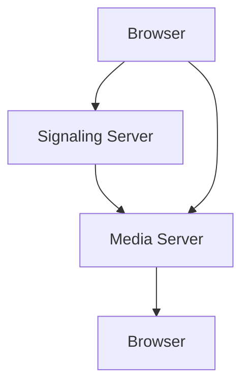

                 

 关键词：WebRTC, 实时通信, Web 应用程序, 数据传输, 浏览器技术, HTML5, JavaScript, 用户体验

> 摘要：本文深入探讨了 WebRTC 实时通信技术，解释了其在 Web 应用程序中的重要性，并详细介绍了如何在浏览器中实现 WebRTC。通过该技术，开发者能够轻松构建低延迟、高质量的视频和音频通信解决方案，满足现代 Web 应用对实时交互的需求。

## 1. 背景介绍

随着互联网的快速发展，人们对实时通信的需求日益增长。无论是视频会议、在线教育、游戏直播，还是即时消息和社交应用，实时通信已经成为许多 Web 应用程序的核心功能。传统的实时通信解决方案往往依赖于第三方服务或专门的客户端应用程序，这增加了开发成本和维护复杂性。

为了解决这一问题，WebRTC（Web Real-Time Communication）技术应运而生。WebRTC 是一个开放协议，它允许 Web 应用程序在不依赖第三方插件的情况下，直接在浏览器中实现实时视频和音频通信。自 2011 年首次发布以来，WebRTC 已经成为 Web 实时通信领域的核心技术，并被广泛用于各种应用场景。

## 2. 核心概念与联系

### 2.1 WebRTC 概念

WebRTC 是一个基于 JavaScript 的 API，它提供了一套完整的通信工具，包括音频、视频、数据通道和信令机制。WebRTC 的主要目标是在 Web 应用程序中实现实时通信，同时保持低延迟和高性能。

### 2.2 WebRTC 架构

WebRTC 的架构可以分为三个主要部分：浏览器、信令服务器和媒体服务器。

- **浏览器**：WebRTC 在浏览器中实现，提供了 JavaScript API，使得开发者能够轻松地集成实时通信功能。
- **信令服务器**：信令服务器负责传输会话描述协议（SDP）和信令消息，用于建立和协商通信连接。
- **媒体服务器**：媒体服务器处理实际的媒体流，如视频和音频，并通过 RTP（实时传输协议）传输。

### 2.3 Mermaid 流程图

下面是一个简化的 WebRTC 架构 Mermaid 流程图：



### 2.4 WebRTC 关键特性

- **低延迟**：WebRTC 采用 UDP 作为传输协议，以减少延迟，确保实时通信的流畅性。
- **高质量**：WebRTC 支持自适应比特率，能够根据网络状况调整视频和音频质量。
- **安全性**：WebRTC 提供了加密功能，确保通信数据的安全性。

## 3. 核心算法原理 & 具体操作步骤

### 3.1 算法原理概述

WebRTC 的核心算法包括信令机制、NAT 冲突解决、ICE（Interactive Connectivity Establishment）协议等。

- **信令机制**：信令是建立 WebRTC 连接的第一步，它用于交换 SDP 和 ICE 候选人。
- **NAT 冲突解决**：NAT（网络地址转换）冲突是 WebRTC 通信中常见的问题，ICE 协议用于解决这一问题。
- **ICE 协议**：ICE 协议是一种用于建立端到端通信的协议，它通过交换 ICE 候选人信息，找到最佳通信路径。

### 3.2 算法步骤详解

1. **信令协商**：浏览器与信令服务器交换 SDP，包括支持的媒体类型、编解码器、NAT 类型等信息。
2. **NAT 检测**：浏览器通过 STUN（Session Traversal Utilities for NAT）和 TURN（Traversal Using Relays around NAT）协议检测和绕过 NAT。
3. **ICE 候选人交换**：浏览器与对端交换 ICE 候选人，包括 STUN、TURN 和本机地址。
4. **连接建立**：根据 ICE 候选人信息，浏览器选择最佳通信路径，建立 RTP 连接。

### 3.3 算法优缺点

- **优点**：
  - 低延迟和高性能。
  - 无需第三方插件。
  - 提供了丰富的信令和媒体传输功能。
- **缺点**：
  - 对网络条件要求较高，容易受到网络抖动和丢包的影响。
  - 需要考虑安全性问题。

### 3.4 算法应用领域

WebRTC 可以应用于多种实时通信场景，包括：

- **视频会议**：实现高质量、低延迟的视频通信。
- **在线教育**：提供实时互动课堂，支持视频和音频通信。
- **游戏直播**：实现实时视频流和互动。

## 4. 数学模型和公式 & 详细讲解 & 举例说明

### 4.1 数学模型构建

WebRTC 的核心算法涉及到多个数学模型，包括 RTP（实时传输协议）、RTCP（实时传输控制协议）等。

- **RTP**：RTP 是一种数据传输协议，用于传输实时音频和视频数据。
- **RTCP**：RTCP 是 RTP 的控制协议，用于监控和反馈网络状况。

### 4.2 公式推导过程

以下是一个简化的 RTP 报头公式：

```latex
RTP\_Header = [Version][Padding][Extension][CSRC\_Count] \
             [Marker][Payload\_Type][Sequence\_Number] \
             [Timestamp][Sync\_Source\_ID][CSRC\[0\...n\]]
```

其中，每个字段的含义如下：

- **Version**：RTP 版本号。
- **Padding**：填充标志。
- **Extension**：扩展标志。
- **CSRC\_Count**：贡献源计数。
- **Marker**：标记字段。
- **Payload\_Type**：负载类型。
- **Sequence\_Number**：序列号。
- **Timestamp**：时间戳。
- **Sync\_Source\_ID**：同步源标识。
- **CSRC\[0\...n\]**：贡献源标识。

### 4.3 案例分析与讲解

假设有两个浏览器 A 和 B，通过 WebRTC 进行通信。以下是一个简化的 RTP 数据包传输过程：

1. **浏览器 A 发送 RTP 数据包**：
   - A 发送 RTP 数据包到媒体服务器。
   - 数据包包括 RTP 报头和实际音频数据。
   - RTP 报头包含 A 的序列号和时间戳。
2. **媒体服务器转发 RTP 数据包**：
   - 服务器接收 A 的 RTP 数据包。
   - 根据信令协商的信息，服务器将 RTP 数据包转发给浏览器 B。
3. **浏览器 B 接收 RTP 数据包**：
   - B 接收 RTP 数据包。
   - 根据 RTP 报头中的序列号和时间戳，B 能够正确解码和播放音频数据。

## 5. 项目实践：代码实例和详细解释说明

### 5.1 开发环境搭建

要实现 WebRTC 实时通信，需要以下开发环境：

- **浏览器**：支持 WebRTC 的现代浏览器，如 Google Chrome、Mozilla Firefox 等。
- **信令服务器**：用于交换信令信息的中间服务器。
- **媒体服务器**：处理媒体流的中间服务器。

### 5.2 源代码详细实现

以下是一个简化的 WebRTC 实时通信示例：

```javascript
// 浏览器 A 的代码
const constraints = { audio: true, video: true };
const localStream = await navigator.mediaDevices.getUserMedia(constraints);

const peerConnection = new RTCPeerConnection();
peerConnection.addStream(localStream);

// 监听远程流
peerConnection.addEventListener('addstream', (event) => {
  const remoteStream = event.stream;
  // 处理远程流，如显示在视频标签中
});

// 监听 ICE 候选人
peerConnection.addEventListener('icecandidate', (event) => {
  if (event.candidate) {
    // 发送 ICE 候选人给信令服务器
  }
});

// 发起信令协商
const offer = await peerConnection.createOffer();
await peerConnection.setLocalDescription(offer);

// 将 SDP 发送给信令服务器
```

### 5.3 代码解读与分析

1. **获取本地媒体流**：通过 `navigator.mediaDevices.getUserMedia()` 获取本地音频和视频流。
2. **创建 RTCPeerConnection**：创建一个 RTCPeerConnection 实例，用于处理媒体传输。
3. **监听远程流**：当对端添加媒体流时，将其添加到页面上。
4. **监听 ICE 候选人**：当发现 ICE 候选人时，将其发送给信令服务器。
5. **发起信令协商**：创建 SDP 描述，并将其发送给信令服务器。

### 5.4 运行结果展示

在浏览器中运行上述代码，可以实现在两个浏览器之间进行实时音频和视频通信。

## 6. 实际应用场景

WebRTC 实时通信技术已经被广泛应用于多个领域：

- **视频会议**：提供高质量、低延迟的视频会议解决方案。
- **在线教育**：实现实时互动课堂，支持视频和音频通信。
- **游戏直播**：实现实时视频流和互动。
- **远程医疗**：提供实时视频诊断和咨询服务。
- **社交应用**：实现即时消息和视频通话功能。

## 7. 工具和资源推荐

### 7.1 学习资源推荐

- **官方文档**：WebRTC 官方文档是学习 WebRTC 的最佳资源。
- **在线教程**：许多在线教程和课程可以帮助开发者快速掌握 WebRTC。
- **开源项目**：GitHub 上有许多开源的 WebRTC 项目，可以学习实际应用。

### 7.2 开发工具推荐

- **WebRTC 客户端库**：如 getUserMedia、SimpleWebRTC 等，可以简化 WebRTC 开发。
- **信令服务器库**：如 node-webrtc、sip.js 等，可以方便地搭建信令服务器。

### 7.3 相关论文推荐

- **WebRTC: Native Communication in the Browser**：介绍了 WebRTC 的核心技术和应用。
- **WebRTC: A Protocol for Real-Time Communication**：详细探讨了 WebRTC 的协议和实现。

## 8. 总结：未来发展趋势与挑战

### 8.1 研究成果总结

WebRTC 技术在实时通信领域取得了显著成果，为 Web 应用程序提供了强大的实时通信能力。随着技术的不断发展和优化，WebRTC 在未来将有更广泛的应用。

### 8.2 未来发展趋势

- **性能提升**：WebRTC 将继续优化性能，提高实时通信的质量。
- **标准化**：WebRTC 标准将继续完善，以适应更多应用场景。
- **跨平台**：WebRTC 将支持更多平台和设备，实现真正的跨平台实时通信。

### 8.3 面临的挑战

- **网络条件**：WebRTC 对网络条件要求较高，需要在各种网络环境下保持稳定性。
- **安全性**：WebRTC 需要提供更强的安全性保障，防止通信数据泄露。

### 8.4 研究展望

WebRTC 在实时通信领域的应用前景广阔，未来将继续推动 Web 应用程序的实时交互体验。同时，研究者需要关注性能、安全性和跨平台等方面，为 WebRTC 的发展提供持续支持。

## 9. 附录：常见问题与解答

### 9.1 问题 1：WebRTC 是否需要安装插件？

解答：不需要。WebRTC 是基于 HTML5 和 JavaScript 的 API，可以直接在支持 WebRTC 的现代浏览器中实现，无需安装插件。

### 9.2 问题 2：WebRTC 支持哪些编解码器？

解答：WebRTC 支持多种音频和视频编解码器，包括 H.264、VP8、VP9、Opus 等。具体支持的编解码器取决于浏览器和操作系统。

### 9.3 问题 3：如何解决 WebRTC 的 NAT 冲突？

解答：WebRTC 使用 ICE 协议解决 NAT 冲突。通过 ICE，WebRTC 可以自动检测和绕过 NAT，建立端到端的通信连接。

---

作者：禅与计算机程序设计艺术 / Zen and the Art of Computer Programming
------------------------------------------------------------------------

