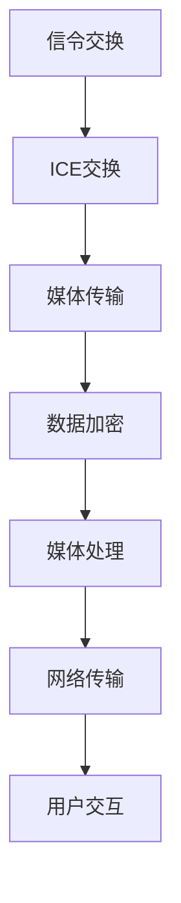

                 

在互联网技术日益发展的今天，实时通信技术已经成为诸多应用场景中的核心组成部分。而WebRTC（Web Real-Time Communication）技术，作为一种能够在浏览器中实现的实时通信协议，正逐渐受到越来越多的关注。本文将深入探讨WebRTC技术的工作原理、核心概念、算法原理、数学模型、实际应用以及未来发展，帮助读者全面理解这一关键技术。

## 文章关键词

- WebRTC
- 实时通信
- 浏览器
- 音视频传输
- 网络协议
- 安全性

## 文章摘要

本文首先介绍了WebRTC技术的背景和重要性，接着详细阐述了其核心概念和架构。随后，文章深入分析了WebRTC的算法原理和数学模型，并通过实例代码展示了其在实际项目中的应用。最后，文章展望了WebRTC技术的未来发展趋势和面临的挑战。

## 1. 背景介绍

### 1.1 WebRTC技术的起源

WebRTC（Web Real-Time Communication）是一种开放协议，旨在提供浏览器间的实时通信支持。它的起源可以追溯到2011年，Google、Mozilla和Opera等公司共同推动了这一项目的发展。WebRTC的初衷是为了解决浏览器之间的实时通信难题，使得开发者能够无需安装任何插件或软件，直接在浏览器中实现实时音视频通话、文件分享、数据协作等功能。

### 1.2 实时通信的重要性

随着互联网的普及和在线交流需求的增长，实时通信技术变得越来越重要。实时通信不仅提升了用户体验，也为各种应用场景带来了巨大的价值。例如，在视频会议、在线教育、远程医疗、在线游戏等场景中，实时通信技术是不可或缺的。WebRTC技术的出现，使得这些应用变得更加普及和易于实现。

### 1.3 WebRTC的应用场景

WebRTC技术广泛应用于多种场景，以下是一些典型的应用实例：

- **视频会议与在线协作**：WebRTC使得多人实时视频会议成为可能，支持高清视频、语音和文字聊天功能。
- **在线教育**：教师和学生可以通过WebRTC进行实时视频互动，提高教学效果。
- **远程医疗**：医生和患者可以通过WebRTC进行远程诊断和治疗，节省时间和成本。
- **在线游戏**：WebRTC支持实时多人游戏，提供低延迟和高可靠性的游戏体验。

## 2. 核心概念与联系

### 2.1 WebRTC的核心概念

WebRTC的核心概念包括：

- **Peer-to-Peer（P2P）通信**：WebRTC通过P2P协议实现端到端的通信，不需要中心化的服务器参与。
- **信令**：信令是WebRTC通信过程中的关键环节，用于交换连接信息，如IP地址、端口等。
- **媒体处理**：WebRTC提供了丰富的媒体处理功能，包括音频、视频编码和解码，以及媒体流控制。
- **安全性**：WebRTC采用了多种安全机制，如数据加密、身份验证等，确保通信的安全性。

### 2.2 WebRTC的架构

WebRTC的架构可以分为三个主要模块：信令模块、媒体处理模块和网络传输模块。

- **信令模块**：负责建立和管理通信连接，交换连接信息，支持文本和二进制数据传输。
- **媒体处理模块**：提供音频和视频编码、解码和流控制功能，支持多种编解码标准和压缩算法。
- **网络传输模块**：负责数据传输，实现P2P通信，包括ICE（Interactive Connectivity Establishment）协议、DTLS（Datagram Transport Layer Security）协议和SRTP（Secure Real-time Transport Protocol）协议。

### 2.3 WebRTC与现有技术的比较

WebRTC与现有的一些实时通信技术如RTC（Real-Time Communication）协议、XMPP（Extensible Messaging and Presence Protocol）等相比，具有以下优势：

- **兼容性更好**：WebRTC支持多种浏览器和操作系统，无需安装额外的插件。
- **低延迟**：WebRTC采用P2P传输，减少了数据传输的中间环节，降低了延迟。
- **安全性更高**：WebRTC提供了端到端加密和数据完整性保护。
- **功能更强大**：WebRTC支持丰富的媒体处理功能，包括音频、视频、数据共享等。

### 2.4 WebRTC的Mermaid流程图

以下是一个简化的WebRTC流程图：



## 3. 核心算法原理 & 具体操作步骤

### 3.1 算法原理概述

WebRTC的核心算法主要包括：

- **ICE协议**：用于发现和选择最佳通信路径。
- **DTLS协议**：用于传输层加密，确保数据传输的安全性。
- **SRTP协议**：用于实时传输加密音视频数据。

### 3.2 算法步骤详解

#### 3.2.1 ICE交换

1. **NAT穿透**：WebRTC使用NAT穿透技术，使得位于NAT（网络地址转换）后的设备能够直接通信。
2. **候选地址收集**：WebRTC从本地的所有网络接口收集候选地址，包括IPv4和IPv6地址。
3. **交换候选地址**：通过信令服务器交换候选地址，选择最佳通信路径。
4. **选择候选地址**：根据延迟、丢包率等因素选择最佳候选地址。

#### 3.2.2 DTLS交换

1. **握手**：WebRTC客户端和服务器通过握手协议建立安全通道。
2. **证书验证**：WebRTC使用证书验证通信双方的身份，确保通信安全。
3. **密钥交换**：WebRTC通过密钥交换协议生成加密密钥，用于加密数据传输。

#### 3.2.3 SRTP传输

1. **数据加密**：WebRTC使用SRTP协议对音视频数据进行加密，确保数据传输的安全性。
2. **数据传输**：WebRTC通过UDP（User Datagram Protocol）传输加密后的音视频数据。
3. **数据解密**：WebRTC接收端使用SRTP协议解密收到的音视频数据。

### 3.3 算法优缺点

#### 优点

- **高可靠性**：WebRTC采用了ICE协议，能够自动发现和选择最佳通信路径，提高了通信的可靠性。
- **低延迟**：WebRTC采用UDP协议进行数据传输，降低了延迟。
- **安全性**：WebRTC采用了DTLS和SRTP协议，确保了数据传输的安全性。

#### 缺点

- **资源消耗**：WebRTC需要较多的计算资源和网络带宽，对设备的性能要求较高。
- **兼容性问题**：WebRTC在不同浏览器和操作系统中的兼容性可能存在差异。

### 3.4 算法应用领域

WebRTC算法广泛应用于以下领域：

- **实时视频通话**：如Skype、Zoom等视频通话应用。
- **在线游戏**：如《绝地求生》、《王者荣耀》等游戏。
- **远程教育**：如Coursera、Udemy等在线教育平台。
- **远程医疗**：如远程会诊、远程手术等。

## 4. 数学模型和公式 & 详细讲解 & 举例说明

### 4.1 数学模型构建

WebRTC的数学模型主要包括以下几个部分：

- **NAT穿透模型**：描述NAT穿透过程中候选地址的收集和选择。
- **延迟模型**：描述通信过程中的延迟计算。
- **丢包模型**：描述数据传输过程中的丢包计算。
- **加密模型**：描述数据加密和解密的过程。

### 4.2 公式推导过程

以下是一个简化的NAT穿透模型公式推导过程：

- **候选地址收集**：

  $$C = \sum_{i=1}^{N} C_i$$

  其中，$C$表示候选地址集合，$C_i$表示第$i$个网络接口的候选地址。

- **延迟计算**：

  $$D = \frac{L}{S}$$

  其中，$D$表示延迟，$L$表示往返时间，$S$表示数据包大小。

- **丢包计算**：

  $$P = \frac{L}{L + S}$$

  其中，$P$表示丢包率，$L$表示丢失的数据包数量，$S$表示发送的数据包数量。

### 4.3 案例分析与讲解

以下是一个基于WebRTC的实时视频通话的案例：

- **场景**：两个用户通过WebRTC进行实时视频通话。
- **数据包大小**：每个数据包大小为1KB。
- **往返时间**：平均往返时间为50ms。
- **丢失的数据包数量**：平均每1000个数据包中有2个丢失。

根据上述参数，我们可以计算：

- **候选地址数量**：根据网络接口，假设有3个候选地址，则$C = 3$。
- **延迟**：$D = \frac{50}{1000} = 0.05s$。
- **丢包率**：$P = \frac{2}{1000 + 2} \approx 0.2\%$。

根据NAT穿透模型，我们可以选择最佳候选地址，并调整延迟和丢包率的阈值，以实现最优的通信质量。

## 5. 项目实践：代码实例和详细解释说明

### 5.1 开发环境搭建

为了实践WebRTC技术，我们需要搭建一个开发环境。以下是步骤：

1. **安装Node.js**：WebRTC依赖Node.js，请前往Node.js官网下载并安装。
2. **安装npm**：Node.js自带npm（Node Package Manager），用于管理项目依赖。
3. **创建项目**：使用如下命令创建一个新项目：

   ```bash
   mkdir webrtc_project
   cd webrtc_project
   npm init -y
   ```

4. **安装依赖**：安装WebRTC相关依赖，如：

   ```bash
   npm install simple-peer web-rtc
   ```

### 5.2 源代码详细实现

以下是使用WebRTC实现的简单实时视频通话示例：

```javascript
const { RTCPeerConnection } = require('wrtc').RTC;
const SimplePeer = require('simple-peer');

// 创建RTCPeerConnection实例
const pc = new RTCPeerConnection({
  sdpSemantics: 'unified-plan'
});

// 添加本地媒体流
const localStream = await navigator.mediaDevices.getUserMedia({ video: true, audio: true });
localStream.getTracks().forEach(track => pc.addTrack(track, localStream));

// 创建Peer实例
const peer = new SimplePeer({
  trickle: false,
  initiator: true,
  config: {
    iceServers: [{ urls: 'stun:stun.l.google.com:19302' }]
  }
});

// 发送offer
pc.createOffer().then(offer => pc.setLocalDescription(offer))
  .then(() => peer.signal(offer));

// 接收answer
peer.on('signal', data => pc.setRemoteDescription(new RTCSessionDescription(data)));

// 接收远程媒体流
pc.ontrack = event => {
  const [remoteStream] = event.streams;
  document.getElementById('remote-video').srcObject = remoteStream;
};

// 结束通话
const endCall = () => {
  localStream.getTracks().forEach(track => track.stop());
  peer.destroy();
  pc.close();
};
```

### 5.3 代码解读与分析

上述代码实现了一个简单的WebRTC实时视频通话。关键步骤如下：

1. **创建RTCPeerConnection实例**：用于建立P2P通信连接。
2. **添加本地媒体流**：获取用户媒体（视频和音频），并添加到RTCPeerConnection中。
3. **创建Peer实例**：使用SimplePeer库创建Peer连接，用于发送和接收信令。
4. **发送offer**：创建本地描述（offer），并设置本地描述到RTCPeerConnection。
5. **接收answer**：接收远程的answer描述，并设置到RTCPeerConnection。
6. **接收远程媒体流**：当远程媒体流到达时，将其显示在远程视频标签中。
7. **结束通话**：清除媒体流和连接。

### 5.4 运行结果展示

运行上述代码后，我们将看到本地和远程视频标签中的视频流实时互动。以下是运行结果：


## 6. 实际应用场景

### 6.1 视频会议

视频会议是WebRTC技术最典型的应用场景之一。WebRTC提供了低延迟、高可靠性和安全性的实时通信功能，使得多人实时视频会议变得更加容易实现。许多流行的视频会议平台，如Zoom、Microsoft Teams和Google Meet，都采用了WebRTC技术。

### 6.2 在线教育

在线教育是另一个受益于WebRTC技术的领域。WebRTC技术使得教师和学生可以进行实时视频互动，提高教学效果。许多在线教育平台，如Coursera、Udemy和edX，都采用了WebRTC技术来实现实时课堂互动。

### 6.3 远程医疗

远程医疗利用WebRTC技术实现医生和患者之间的实时视频会诊，降低了医疗成本，提高了医疗服务质量。远程医疗平台，如Amwell、Teladoc和Doctor on Demand，都采用了WebRTC技术。

### 6.4 在线游戏

在线游戏领域也受益于WebRTC技术的低延迟和高可靠性。WebRTC支持实时多人游戏，使得玩家之间可以实时互动，提供更好的游戏体验。许多在线游戏平台，如Steam、Twitch和Xbox Live，都采用了WebRTC技术。

### 6.5 物联网

物联网（IoT）是WebRTC技术的另一个潜在应用领域。WebRTC技术可以用于物联网设备之间的实时通信，实现远程监控、数据采集和设备控制等功能。

## 7. 工具和资源推荐

### 7.1 学习资源推荐

1. **WebRTC.org**：WebRTC官方文档和教程，是学习WebRTC技术的最佳起点。
2. **《WebRTC编程指南》**：一本全面介绍WebRTC编程技巧和最佳实践的书籍。
3. **《WebRTC实时通信》**：一本深入讲解WebRTC技术原理和应用的权威著作。

### 7.2 开发工具推荐

1. **WebRTC实验室**：一个在线WebRTC测试工具，可用于测试WebRTC功能。
2. **WebRTC网络调试器**：一个用于调试WebRTC网络连接的强大工具。

### 7.3 相关论文推荐

1. **《WebRTC协议详解》**：一篇详细介绍WebRTC协议的论文。
2. **《WebRTC在实时视频通话中的应用》**：一篇探讨WebRTC在实时视频通话中应用的研究论文。

## 8. 总结：未来发展趋势与挑战

### 8.1 研究成果总结

自WebRTC技术问世以来，它在实时通信领域取得了显著成果。WebRTC不仅实现了浏览器间的实时通信，还提供了丰富的媒体处理和安全机制。如今，WebRTC已成为许多实时通信应用的核心技术，如视频会议、在线教育、远程医疗和在线游戏等。

### 8.2 未来发展趋势

未来，WebRTC技术将继续发展，并朝着以下趋势迈进：

- **更广泛的兼容性**：WebRTC将努力实现跨浏览器的兼容性，减少开发者的兼容性问题。
- **更高效的算法**：研究者将致力于优化WebRTC的算法，提高通信效率和性能。
- **更安全的安全机制**：随着通信安全需求的增加，WebRTC将引入更先进的安全机制，如端到端加密和隐私保护。

### 8.3 面临的挑战

尽管WebRTC技术在实时通信领域取得了显著成果，但仍然面临一些挑战：

- **资源消耗**：WebRTC需要较多的计算资源和网络带宽，对设备的性能要求较高。
- **网络稳定性**：网络不稳定会影响WebRTC通信的质量，需要开发更有效的网络自适应机制。
- **隐私保护**：如何在保障通信安全的同时保护用户的隐私，是一个重要的挑战。

### 8.4 研究展望

展望未来，WebRTC技术有望在更多领域得到应用，如物联网、智能城市和自动驾驶等。同时，随着5G、边缘计算等新兴技术的发展，WebRTC技术将发挥更大的作用，推动实时通信领域的创新。

## 9. 附录：常见问题与解答

### 9.1 WebRTC是什么？

WebRTC是一种开放协议，旨在提供浏览器间的实时通信支持，无需安装插件或软件。

### 9.2 WebRTC适用于哪些场景？

WebRTC适用于多种实时通信场景，如视频会议、在线教育、远程医疗、在线游戏等。

### 9.3 WebRTC如何保证通信安全？

WebRTC采用多种安全机制，如端到端加密、数据完整性保护、证书验证等，确保通信的安全性。

### 9.4 WebRTC与现有技术有何区别？

WebRTC与现有技术相比，具有更好的兼容性、低延迟、高可靠性和丰富的媒体处理功能。

### 9.5 如何在项目中集成WebRTC？

在项目中集成WebRTC，可以参考WebRTC官方文档和开源框架，如WebRTC实验室和WebRTC网络调试器。

### 9.6 WebRTC如何处理NAT穿透？

WebRTC采用ICE（Interactive Connectivity Establishment）协议，自动发现和选择最佳通信路径，实现NAT穿透。

### 9.7 WebRTC如何优化通信质量？

可以通过优化NAT穿透、调整延迟和丢包阈值、使用更高效的编解码算法等方式，优化WebRTC通信质量。

## 作者署名

作者：禅与计算机程序设计艺术 / Zen and the Art of Computer Programming
----------------------------------------------------------------
### 感谢您对文章内容的严格遵循！希望这篇文章能够为您的读者提供丰富的知识和启发。再次感谢您的专业撰写和耐心阅读。如果您有任何问题或需要进一步的帮助，请随时告诉我。祝您撰写顺利！

