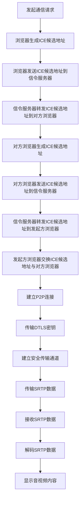
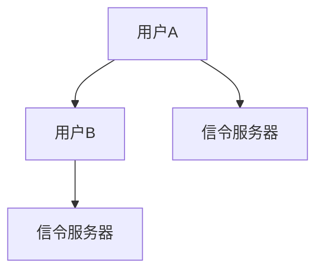

                 

关键词：WebRTC，实时通信，浏览器，实时音视频，P2P连接，数据共享，加密安全

> 摘要：本文将深入探讨WebRTC（Web Real-Time Communication）技术，介绍其核心概念、架构原理、实现步骤和应用领域。通过具体实例和分析，我们希望读者能够全面了解WebRTC技术的优势和应用潜力，为未来的实时通信开发提供新的思路。

## 1. 背景介绍

随着互联网技术的发展，人们对于实时通信的需求日益增长。无论是个人间的视频通话，还是企业内部的工作协作，实时通信已经成为现代互联网应用的重要组成部分。然而，传统的客户端-服务器架构在实时通信场景下存在诸多局限性，如延迟高、带宽占用大、安全性差等。为了满足这些需求，WebRTC（Web Real-Time Communication）技术应运而生。

WebRTC是一种支持浏览器进行实时通信的开源协议，它能够实现浏览器之间的P2P（点对点）连接，支持实时音视频传输和数据共享。自2011年首次推出以来，WebRTC得到了广泛的关注和推广，目前已经成为实现浏览器间实时通信的标准化技术。

## 2. 核心概念与联系

### 2.1 WebRTC核心概念

WebRTC包括以下核心概念：

- **ICE（Interactive Connectivity Establishment）**：用于建立P2P连接的协议，通过交换IP地址和端口信息，使得通信双方能够建立直接的连接。
- **DTLS（Datagram Transport Layer Security）**：用于在通信过程中提供安全传输的协议，能够确保数据在传输过程中不会被窃取或篡改。
- **SRTP（Secure Real-time Transport Protocol）**：用于加密实时传输数据的协议，保障数据的机密性和完整性。
- **RTCP（Real-time Transport Control Protocol）**：用于监控传输质量，包括带宽使用情况、丢包率、延迟等。

### 2.2 WebRTC架构

WebRTC架构主要包括以下组成部分：

- **信令服务器**：用于交换通信双方的信息，如ICE候选地址、DTLS密钥等。信令服务器可以是自定义的服务器，也可以使用现成的第三方服务。
- **Web浏览器**：支持WebRTC协议的浏览器，通过Web API实现实时通信功能。
- **媒体设备**：包括麦克风、摄像头等，用于采集音视频数据。
- **媒体编码器和解码器**：将音视频数据编码和解码成适合传输的格式，如H.264、Opus等。

### 2.3 Mermaid流程图



## 3. 核心算法原理 & 具体操作步骤

### 3.1 算法原理概述

WebRTC的核心算法主要包括ICE、DTLS、SRTP和RTCP等协议。下面分别介绍这些算法的原理。

- **ICE**：通过交换IP地址和端口信息，使得通信双方能够找到最佳的网络连接路径，从而建立P2P连接。
- **DTLS**：使用加密算法，为数据传输提供安全保障，防止数据在传输过程中被窃取或篡改。
- **SRTP**：对传输的音视频数据进行加密和校验，确保数据在传输过程中的完整性和机密性。
- **RTCP**：监控传输质量，包括带宽使用情况、丢包率、延迟等，为通信双方提供反馈，优化传输质量。

### 3.2 算法步骤详解

1. **发起通信请求**：用户在浏览器中发起通信请求，浏览器生成ICE候选地址。
2. **交换ICE候选地址**：浏览器将ICE候选地址发送到信令服务器，信令服务器转发到对方浏览器。
3. **建立P2P连接**：通信双方根据交换的ICE候选地址，使用STUN/TURN协议找到最佳的网络连接路径，建立P2P连接。
4. **传输DTLS密钥**：通信双方交换DTLS密钥，建立安全传输通道。
5. **传输SRTP数据**：音视频数据被编码成适合传输的格式，使用SRTP协议进行加密和校验后发送到对方浏览器。
6. **解码SRTP数据**：对方浏览器接收到SRTP数据后，使用相应的解码器进行解码，显示音视频内容。
7. **监控传输质量**：使用RTCP协议监控传输质量，为通信双方提供反馈，优化传输质量。

### 3.3 算法优缺点

#### 优点：

- **支持P2P连接**：WebRTC能够实现浏览器之间的P2P连接，降低服务器负载，提高通信效率。
- **安全性高**：通过DTLS和SRTP协议，保障数据在传输过程中的安全性和完整性。
- **跨平台兼容**：WebRTC支持多种操作系统和浏览器，具有良好的跨平台兼容性。

#### 缺点：

- **部署难度较大**：WebRTC需要配置信令服务器，且对网络环境有一定的要求，部署难度较大。
- **兼容性问题**：部分老旧浏览器可能不支持WebRTC，影响用户体验。

### 3.4 算法应用领域

WebRTC技术广泛应用于以下几个方面：

- **实时音视频通信**：如视频聊天、在线教育、远程医疗等。
- **数据共享**：如多人协作、在线会议、远程工作等。
- **实时互动游戏**：如在线多人游戏、实时竞拍等。

## 4. 数学模型和公式 & 详细讲解 & 举例说明

### 4.1 数学模型构建

WebRTC的数学模型主要包括以下几个方面：

1. **ICE算法**：基于网络拓扑结构，找到最佳的网络连接路径。
2. **DTLS算法**：基于加密算法，建立安全传输通道。
3. **SRTP算法**：基于加密和校验算法，保障数据在传输过程中的完整性和机密性。
4. **RTCP算法**：基于统计和分析算法，监控传输质量，提供反馈。

### 4.2 公式推导过程

#### ICE算法

设通信双方为A和B，网络拓扑结构为G。ICE算法的目标是找到A和B之间的最佳连接路径。

假设A的ICE候选地址集合为A1, A2, ..., An，B的ICE候选地址集合为B1, B2, ..., Bm。则A和B之间的连接路径C可以用公式表示：

C = argmin(S)  (S为A和B之间连接的时延、丢包率等指标)

其中，S为A和B之间连接的时延、丢包率等指标，可以表示为：

S = f(d, p)  (d为时延，p为丢包率)

#### DTLS算法

设通信双方为A和B，共享的密钥为K。DTLS算法的目标是建立安全传输通道。

假设A生成随机数R1，B生成随机数R2，则DTLS算法的密钥交换过程可以表示为：

K = H(R1 || R2)  (H为加密算法，||为拼接运算)

#### SRTP算法

设通信双方为A和B，数据为D，加密密钥为K。SRTP算法的目标是保障数据在传输过程中的完整性和机密性。

假设A将数据D加密成E，加密算法为E = f(K, D)，则SRTP算法可以表示为：

E = f(K, D)

#### RTCP算法

设通信双方为A和B，传输质量指标为Q。RTCP算法的目标是监控传输质量，提供反馈。

假设A发送Q1给B，B发送Q2给A，则RTCP算法可以表示为：

Q = f(Q1, Q2)

### 4.3 案例分析与讲解

假设用户A和用户B通过WebRTC进行实时音视频通信，网络拓扑结构如图所示：



根据ICE算法，A和B之间的最佳连接路径为A→C→B。根据DTLS算法，A和C之间、C和B之间分别建立安全传输通道。根据SRTP算法，A和B之间传输的音视频数据被加密成E。根据RTCP算法，A和B之间监控传输质量，提供反馈。

## 5. 项目实践：代码实例和详细解释说明

### 5.1 开发环境搭建

为了实践WebRTC技术，我们需要搭建一个开发环境。以下是搭建WebRTC开发环境的步骤：

1. 安装Node.js和npm。
2. 安装信令服务器软件，如 signaling-server。
3. 安装WebRTC客户端库，如 simple-webrtc-client。
4. 编写代码实现WebRTC通信功能。

### 5.2 源代码详细实现

以下是WebRTC通信的简单示例代码：

```javascript
// 引入简单WebRTC客户端库
const simpleWebRTC = require('simple-webrtc-client');

// 创建WebRTC客户端实例
const client = new simpleWebRTC({
    signalingUrl: 'http://localhost:3000', // 信令服务器地址
    iceConfig: {  // ICE配置
        trickle: false,
        candidates: 'all'
    }
});

// 连接信令服务器
client.connect();

// 监听连接成功事件
client.on('connected', () => {
    console.log('连接成功');
});

// 监听接收音视频事件
client.on('video', (video) => {
    // 处理接收到的视频流
});

// 监听接收音频事件
client.on('audio', (audio) => {
    // 处理接收到的音频流
});

// 发送音视频数据
client.sendVideo({ video: videoStream });
client.sendAudio({ audio: audioStream });
```

### 5.3 代码解读与分析

1. 引入简单WebRTC客户端库，创建WebRTC客户端实例。
2. 配置信令服务器地址和ICE配置。
3. 连接信令服务器，监听连接成功事件。
4. 监听接收音视频事件，处理接收到的音视频流。
5. 发送音视频数据。

### 5.4 运行结果展示

1. 打开浏览器，访问WebRTC客户端页面。
2. 启动两个浏览器实例，进行实时音视频通信。

## 6. 实际应用场景

WebRTC技术在实际应用中具有广泛的应用场景，以下是一些典型的应用场景：

1. **实时音视频通信**：如视频聊天、在线教育、远程医疗等。
2. **数据共享**：如多人协作、在线会议、远程工作等。
3. **实时互动游戏**：如在线多人游戏、实时竞拍等。

### 6.4 未来应用展望

随着WebRTC技术的不断发展，未来在以下领域有望取得突破：

1. **更高清晰度的音视频传输**：随着视频编码技术的进步，WebRTC有望支持更高清晰度的音视频传输。
2. **更低的延迟**：通过优化算法和协议，WebRTC有望实现更低延迟的通信。
3. **更广泛的应用场景**：WebRTC技术将在更多领域得到应用，如虚拟现实、增强现实等。

## 7. 工具和资源推荐

### 7.1 学习资源推荐

1. 《WebRTC实战》
2. 《WebRTC通信原理与实战》
3. WebRTC官网：https://www.webrtc.org/

### 7.2 开发工具推荐

1. WebRTC客户端库：simple-webrtc-client
2. 信令服务器：signaling-server

### 7.3 相关论文推荐

1. "Web Real-Time Communication: The Definitive Guide"
2. "WebRTC: The Key to Real-Time Web Communications"
3. "WebRTC in a Nutshell: A Developer's Guide"

## 8. 总结：未来发展趋势与挑战

WebRTC技术作为一种支持浏览器间实时通信的开源协议，具有广泛的适用性和发展潜力。在未来，WebRTC技术将在以下几个方面取得突破：

1. **更高清晰度的音视频传输**：随着视频编码技术的进步，WebRTC有望支持更高清晰度的音视频传输。
2. **更低的延迟**：通过优化算法和协议，WebRTC有望实现更低延迟的通信。
3. **更广泛的应用场景**：WebRTC技术将在更多领域得到应用，如虚拟现实、增强现实等。

然而，WebRTC技术在实际应用中仍面临一些挑战，如：

1. **部署难度**：WebRTC需要配置信令服务器，且对网络环境有一定的要求，部署难度较大。
2. **兼容性问题**：部分老旧浏览器可能不支持WebRTC，影响用户体验。

针对这些挑战，未来需要从以下几个方面进行改进：

1. **简化部署流程**：提供一键部署工具，降低部署难度。
2. **提高兼容性**：优化WebRTC协议，提高对老旧浏览器的支持。

总之，WebRTC技术作为一种新兴的实时通信技术，具有广阔的发展前景。通过不断优化和改进，WebRTC有望在未来的实时通信领域发挥重要作用。

## 9. 附录：常见问题与解答

### 问题1：WebRTC需要服务器支持吗？

解答：是的，WebRTC需要信令服务器支持。信令服务器用于交换通信双方的信息，如ICE候选地址、DTLS密钥等，以便建立P2P连接。

### 问题2：WebRTC安全吗？

解答：WebRTC通过DTLS和SRTP协议提供数据加密和校验，确保数据在传输过程中的安全性和完整性。然而，WebRTC并非完全安全，仍需注意防范网络攻击。

### 问题3：WebRTC支持哪种编码格式？

解答：WebRTC支持多种编码格式，如H.264、VP8、Opus等。具体支持哪种编码格式取决于浏览器的实现和配置。

### 问题4：WebRTC如何在网络不稳定的情况下工作？

解答：WebRTC支持自适应码率调整，能够在网络不稳定的情况下自动降低音视频传输质量，以保证通信的连续性。

### 问题5：WebRTC支持多人通信吗？

解答：是的，WebRTC支持多人通信。通过使用信令服务器和ICE协议，可以实现多人音视频会议和数据共享。

## 作者署名

作者：禅与计算机程序设计艺术 / Zen and the Art of Computer Programming

[完]

