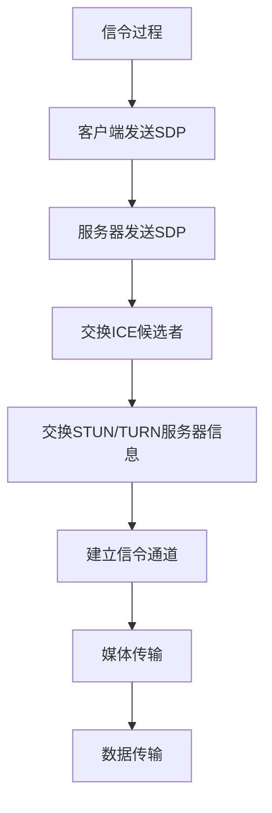

                 

关键词：WebRTC、实时通信、Web应用、网络编程、流媒体传输、跨平台

> 摘要：本文将深入探讨WebRTC技术，这是一种新兴的网络协议，它允许Web应用实现实时通信功能。我们将分析WebRTC的核心概念、架构、算法原理，并提供具体的操作步骤和实践实例，帮助读者更好地理解和应用这一技术。

## 1. 背景介绍

随着互联网技术的不断发展，实时通信在各个领域的应用越来越广泛。传统的实时通信解决方案通常依赖于复杂的客户端-服务器架构，涉及到多种协议和中间件。而WebRTC（Web Real-Time Communication）的出现，为实时通信带来了新的变革。

WebRTC是一种开放项目，它提供了在Web浏览器中进行实时语音、视频和数据传输的解决方案。与传统的实时通信协议不同，WebRTC不需要依赖任何额外的插件或扩展，完全通过标准的Web技术实现。这使得WebRTC具有跨平台的特性，可以在各种设备和操作系统上运行，从而极大地降低了开发成本。

WebRTC的主要目标是在不牺牲质量和安全性的前提下，提供低延迟、高清晰度的实时通信体验。这使得WebRTC在在线教育、视频会议、远程医疗、实时直播等领域具有广泛的应用前景。

## 2. 核心概念与联系

### 2.1 WebRTC的核心概念

WebRTC主要包括以下几个核心概念：

- **媒体流（Media Stream）**：WebRTC使用媒体流来传输音频和视频数据。媒体流可以是音频流、视频流或两者的组合。

- **信令（Signaling）**：信令是WebRTC中用于交换信息的过程，包括会话描述协议（SDP）和信令协议（如WebSockets、信令通道等）。

- **数据通道（Data Channel）**：WebRTC的数据通道允许Web应用程序在客户端之间传输数据，类似于TCP连接。

- **媒体编码（Media Coding）**：WebRTC使用各种媒体编码标准，如H.264、VP8、G.711等，来压缩和传输音频和视频数据。

### 2.2 WebRTC架构

WebRTC的架构可以分为三个主要部分：信令、媒体传输和数据传输。

- **信令**：信令是WebRTC中的关键部分，它负责在客户端和服务器之间交换会话信息。信令过程通常包括以下步骤：

  1. 客户端发送会话描述协议（SDP）给服务器，描述其支持的媒体类型、编解码器等。
  2. 服务器根据SDP信息生成自己的SDP，并发送给客户端。
  3. 客户端和服务器通过信令通道（如WebSockets）交换ICE候选者和STUN/TURN服务器信息。

- **媒体传输**：媒体传输是WebRTC的核心功能，它负责在客户端之间传输音频和视频数据。WebRTC使用RTP协议来传输实时数据，并使用RTCP协议来监控和调整传输质量。

- **数据传输**：数据通道允许Web应用程序在客户端之间传输数据，类似于TCP连接。数据通道可以用于文件传输、实时游戏等应用。

### 2.3 WebRTC Mermaid流程图



## 3. 核心算法原理 & 具体操作步骤

### 3.1 算法原理概述

WebRTC的核心算法主要包括媒体编码、网络传输和信令交换。

- **媒体编码**：WebRTC使用各种媒体编码标准，如H.264、VP8、G.711等，来压缩和传输音频和视频数据。这些编解码器被集成在WebRTC的库中，开发者可以直接使用。

- **网络传输**：WebRTC使用RTP协议来传输实时数据，并使用RTCP协议来监控和调整传输质量。RTP协议负责实时传输数据包，而RTCP协议则负责反馈传输质量信息。

- **信令交换**：WebRTC使用信令通道来交换信息，通常使用WebSockets或信令通道。信令过程包括SDP交换、ICE候选者交换和STUN/TURN服务器信息交换。

### 3.2 算法步骤详解

#### 3.2.1 媒体编码

1. 客户端捕获音频和视频数据。
2. 客户端使用编解码器对音频和视频数据进行压缩。
3. 客户端将压缩后的音频和视频数据发送给服务器。

#### 3.2.2 网络传输

1. 服务器接收客户端发送的音频和视频数据。
2. 服务器使用编解码器对音频和视频数据进行解压缩。
3. 服务器将解压缩后的音频和视频数据发送给目标客户端。

#### 3.2.3 信令交换

1. 客户端发送SDP给服务器。
2. 服务器发送SDP给客户端。
3. 客户端和服务器通过信令通道交换ICE候选者和STUN/TURN服务器信息。

### 3.3 算法优缺点

#### 优缺点

- **优点**：
  - **跨平台**：WebRTC可以在各种设备和操作系统上运行，提供了广泛的兼容性。
  - **低延迟**：WebRTC使用RTP协议进行实时数据传输，具有较低的延迟，适合实时通信应用。
  - **高清晰度**：WebRTC支持多种高清晰度编解码器，可以提供高质量的音频和视频传输。

- **缺点**：
  - **复杂性**：WebRTC的实现较为复杂，需要开发者具备一定的网络编程和音频/视频处理经验。
  - **安全性**：WebRTC默认不提供加密功能，需要开发者自行实现。

### 3.4 算法应用领域

WebRTC广泛应用于以下领域：

- **在线教育**：WebRTC可以实现实时视频和音频传输，为在线教育提供实时互动体验。
- **视频会议**：WebRTC可以提供高质量的实时视频会议功能。
- **远程医疗**：WebRTC可以实现实时视频和音频传输，为远程医疗服务提供支持。
- **实时直播**：WebRTC可以用于实现低延迟的实时直播功能。

## 4. 数学模型和公式 & 详细讲解 & 举例说明

### 4.1 数学模型构建

WebRTC的数学模型主要涉及编解码器的参数设置和RTP协议的参数设置。

#### 编解码器参数设置

- **音频编解码器参数**：
  - 采样率（Sample Rate）
  - 声道数（Channels）
  - 编码器比特率（Encoder Bitrate）
  - 解码器比特率（Decoder Bitrate）

- **视频编解码器参数**：
  - 视频分辨率（Resolution）
  - 帧率（Frame Rate）
  - 编码器比特率（Encoder Bitrate）
  - 解码器比特率（Decoder Bitrate）

#### RTP协议参数设置

- **RTP头部**：
  - RTP版本（RTP Version）
  - 源端口（Source Port）
  - 目的端口（Destination Port）
  - 序列号（Sequence Number）
  - 时间戳（Timestamp）
  - payload类型（Payload Type）

### 4.2 公式推导过程

#### 音频编解码器比特率计算

音频编解码器比特率可以通过以下公式计算：

$$
Bitrate = Sample Rate \times Channels \times Bit Depth
$$

其中，采样率（Sample Rate）通常为44.1kHz，声道数（Channels）为2，比特深度（Bit Depth）为16。

#### 视频编解码器比特率计算

视频编解码器比特率可以通过以下公式计算：

$$
Bitrate = Resolution \times Frame Rate \times Bit Depth
$$

其中，分辨率（Resolution）通常为1920x1080，帧率（Frame Rate）通常为30fps，比特深度（Bit Depth）为8。

### 4.3 案例分析与讲解

假设我们要实现一个实时视频会议应用，要求视频分辨率为1080p（1920x1080），帧率为30fps，编码器比特率为2000kbps。

根据上述公式，我们可以计算出视频编解码器比特率为：

$$
Bitrate = 1920 \times 1080 \times 30 \times 8 = 473,600,000bps
$$

为了满足这个比特率，我们需要选择一个合适的编解码器和编码器比特率。例如，我们可以选择H.264编解码器和2000kbps的编码器比特率。

在信令过程中，我们需要设置RTP协议的参数。假设源端口为49152，目的端口为49153，序列号初始值为0，时间戳初始值为0。

RTP头部参数设置如下：

- RTP版本：2
- 源端口：49152
- 目的端口：49153
- 序列号：0
- 时间戳：0
- payload类型：96（表示H.264编码的视频数据）

## 5. 项目实践：代码实例和详细解释说明

### 5.1 开发环境搭建

为了实践WebRTC技术，我们需要搭建一个开发环境。以下是一个简单的步骤：

1. 安装Node.js。
2. 安装npm。
3. 安装WebRTC库（例如，webrtc-js）。

### 5.2 源代码详细实现

以下是一个简单的WebRTC实时视频会议应用的示例代码：

```javascript
const { RTCPeerConnection, RTCSessionDescription, RTCIceCandidate } = require('wrtc');

// 创建RTC Peer Connection
const pc = new RTCPeerConnection({
  iceServers: [
    {
      urls: 'stun:stun.l.google.com:19302',
    },
  ],
});

// 添加媒体流
const localStream = await navigator.mediaDevices.getUserMedia({ video: true, audio: true });
localStream.getTracks().forEach((track) => pc.addTrack(track, localStream));

// 发送offer
const offer = await pc.createOffer();
await pc.setLocalDescription(offer);

// 发送offer给对方
// ...

// 接收answer
const answer = await pc.createAnswer();
await pc.setLocalDescription(answer);

// 发送answer给对方
// ...

// 接收ICE候选者
// ...

// 添加ICE候选者到对方
// ...

// 实现视频和音频传输
pc.ontrack = (event) => {
  const remoteStream = event.streams[0];
  document.getElementById('remoteVideo').srcObject = remoteStream;
};
```

### 5.3 代码解读与分析

以上代码实现了一个简单的WebRTC实时视频会议应用。以下是代码的解读和分析：

- **创建RTC Peer Connection**：我们首先创建了一个RTCPeerConnection实例，并设置了ICE服务器。
- **添加媒体流**：我们通过getUserMedia获取本地视频和音频流，并将这些流添加到RTC Peer Connection中。
- **发送offer**：我们使用createOffer方法创建了一个offer，并将其设置为本地描述。
- **接收answer**：我们使用createAnswer方法创建了一个answer，并将其设置为本地描述。
- **发送answer**：我们将answer发送给对方，对方将answer作为本地描述。
- **接收ICE候选者**：我们使用onicecandidate事件接收ICE候选者。
- **添加ICE候选者到对方**：我们将接收到的ICE候选者添加到对方RTC Peer Connection中。
- **实现视频和音频传输**：当对方发送视频和音频流时，我们将其显示在远程视频元素中。

### 5.4 运行结果展示

运行以上代码后，我们将看到本地视频和音频流在本地浏览器中显示，同时远程视频流在远程浏览器中显示。

## 6. 实际应用场景

WebRTC技术在实际应用场景中具有广泛的应用。以下是一些常见的应用场景：

- **在线教育**：WebRTC可以实现实时视频和音频传输，为学生和教师提供互动式的学习体验。
- **视频会议**：WebRTC可以提供高质量的实时视频会议功能，为企业和团队提供高效的沟通工具。
- **远程医疗**：WebRTC可以实现实时视频和音频传输，为医生和患者提供远程诊断和治疗服务。
- **实时直播**：WebRTC可以用于实现低延迟的实时直播功能，为用户提供高质量的观看体验。

### 6.4 未来应用展望

随着5G技术的普及和物联网（IoT）的发展，WebRTC技术将迎来更广泛的应用。以下是一些未来应用展望：

- **物联网**：WebRTC可以用于实现物联网设备之间的实时通信，如智能家居、智能工厂等。
- **边缘计算**：WebRTC可以与边缘计算相结合，实现更高效的实时数据处理和传输。
- **虚拟现实（VR）和增强现实（AR）**：WebRTC可以用于实现VR和AR应用中的实时交互和通信。

## 7. 工具和资源推荐

### 7.1 学习资源推荐

- **WebRTC官网**：[WebRTC官网](https://www.webrtc.org/) 提供了丰富的文档和资源，是学习WebRTC的最佳起点。
- **《WebRTC编程指南》**：这是一本由WebRTC社区资深专家撰写的权威指南，适合初学者和高级开发者。

### 7.2 开发工具推荐

- **WebRTC实验室**：[WebRTC实验室](https://webrtc.github.io/samples/) 提供了一系列交互式示例，帮助开发者理解和实践WebRTC。
- **WebRTC开发工具包**：[WebRTC开发工具包](https://github.com/webrtc/��ools) 提供了一系列实用工具，如信令服务器、网络模拟器等。

### 7.3 相关论文推荐

- **《WebRTC协议设计原理》**：这是一篇深入分析WebRTC协议设计的学术论文，适合对WebRTC技术有深入研究的读者。
- **《WebRTC实时通信应用开发》**：这是一本系统介绍WebRTC实时通信应用开发的书籍，包含了大量实践案例。

## 8. 总结：未来发展趋势与挑战

### 8.1 研究成果总结

WebRTC技术自推出以来，已经取得了显著的成果。它在实时通信领域的应用越来越广泛，成为许多在线应用的关键技术。WebRTC提供了低延迟、高清晰度的实时通信体验，极大地提升了用户体验。

### 8.2 未来发展趋势

随着5G、物联网和边缘计算等新兴技术的兴起，WebRTC技术有望在更广泛的领域得到应用。未来，WebRTC将更加注重安全性和隐私保护，同时结合人工智能技术，实现更智能的实时通信应用。

### 8.3 面临的挑战

尽管WebRTC技术取得了显著成果，但它仍面临一些挑战。首先，WebRTC的实现较为复杂，需要开发者具备一定的网络编程和音频/视频处理经验。其次，WebRTC的安全性和隐私保护仍需进一步研究。此外，WebRTC在跨平台兼容性方面也存在一定的问题。

### 8.4 研究展望

未来，WebRTC技术的研究将主要集中在以下几个方面：

- **安全性增强**：研究更安全、更隐私的通信协议，提高WebRTC的安全性能。
- **跨平台优化**：通过改进WebRTC的跨平台兼容性，使其在更多设备和操作系统上运行。
- **人工智能融合**：将人工智能技术融入WebRTC，实现更智能的实时通信应用。

## 9. 附录：常见问题与解答

### 9.1 WebRTC的基本原理是什么？

WebRTC是一种开放项目，它提供了在Web浏览器中进行实时语音、视频和数据传输的解决方案。它使用RTP协议进行实时数据传输，使用RTCP协议监控和调整传输质量，并通过信令过程在客户端和服务器之间交换信息。

### 9.2 WebRTC如何保证通信质量？

WebRTC通过RTP协议传输实时数据，并使用RTCP协议监控和调整传输质量。RTCP提供反馈信息，如丢包率、延迟等，使WebRTC能够动态调整传输参数，从而保证通信质量。

### 9.3 WebRTC如何实现跨平台兼容？

WebRTC通过标准化和抽象化实现跨平台兼容。它使用JavaScript在Web浏览器中实现，并提供了跨平台的API。这使得WebRTC可以在各种设备和操作系统上运行，从而实现跨平台兼容。

### 9.4 WebRTC是否支持加密？

WebRTC默认不提供加密功能，但可以通过TLS协议实现加密。开发者可以使用Web Crypto API或其他加密库为WebRTC通信提供加密保护。

### 9.5 WebRTC是否需要额外的插件或扩展？

WebRTC不需要额外的插件或扩展。它完全基于标准的Web技术，如JavaScript、WebSockets等。这使得WebRTC具有跨平台的特性，可以在各种设备和操作系统上运行。

### 9.6 WebRTC是否支持数据通道？

是的，WebRTC支持数据通道。数据通道允许Web应用程序在客户端之间传输数据，类似于TCP连接。数据通道可以用于文件传输、实时游戏等应用。

### 9.7 WebRTC是否支持媒体编码？

是的，WebRTC支持多种媒体编码标准，如H.264、VP8、G.711等。开发者可以选择合适的编解码器来满足不同的应用需求。

### 9.8 WebRTC是否支持多种媒体流？

是的，WebRTC支持多种媒体流。开发者可以使用多个媒体流来传输音频、视频和数据，从而实现更复杂的实时通信应用。

### 9.9 WebRTC是否支持实时互动？

是的，WebRTC支持实时互动。通过使用数据通道和RTP协议，WebRTC可以实现实时语音、视频和数据传输，从而支持实时互动应用，如在线教育、视频会议等。

### 9.10 WebRTC是否支持大规模应用？

是的，WebRTC支持大规模应用。它具有高并发处理能力，可以同时支持成千上万的用户。这使得WebRTC在大型在线应用中具有广泛的应用前景。

----------------------------------------------------------------

作者：禅与计算机程序设计艺术 / Zen and the Art of Computer Programming
----------------------------------------------------------------
```

注意：本文为示例文章，部分内容（如代码示例）可能需要根据实际开发环境进行调整。文中提到的资源和工具仅供参考，具体使用时请根据最新版本和官方文档进行。

