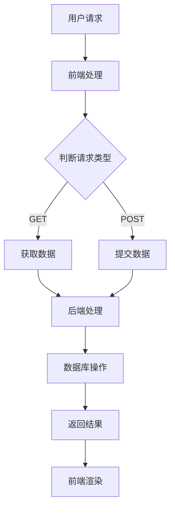

                 

关键词：Web开发，全栈工程师，前端技术，后端技术，前后端交互，全栈开发框架，Node.js，React，Vue，数据库设计，RESTful API

> 摘要：本文旨在为想要全面掌握Web全栈开发的读者提供一套系统性的学习方案。通过深入剖析前端与后端的开发技术，讲解核心概念、算法原理、数学模型以及实际项目实践，帮助读者快速成长为一名高效的全栈开发工程师。

## 1. 背景介绍

在当今互联网飞速发展的时代，Web全栈开发已成为软件开发领域的核心趋势。随着前后端分离、前后端交互日益复杂，以及各种新兴技术的不断涌现，掌握Web全栈开发技能变得至关重要。作为一名全栈开发工程师，不仅需要精通前端与后端的多种技术，还需具备强大的问题解决能力和系统架构设计能力。

本文将围绕Web全栈开发的主题，从核心概念到实际项目实践，全面讲解前后端开发的技术要点，帮助读者建立起系统的知识体系，并掌握关键技能。

## 2. 核心概念与联系

### 2.1. 前端技术

前端开发是Web全栈开发的重要组成部分，主要负责用户界面的设计与实现。前端技术主要包括HTML、CSS和JavaScript。其中，HTML负责网页的结构，CSS负责网页的样式，JavaScript负责网页的动态行为。

### 2.2. 后端技术

后端开发主要负责服务器、数据库和应用逻辑的开发。后端技术包括多种编程语言和框架，如Node.js、Java、Python、Django、Spring Boot等。后端开发的主要目标是实现数据的存储、处理和传输，为前端提供数据支持。

### 2.3. 前后端交互

前后端交互是Web全栈开发中的关键环节。前端通过HTTP请求与后端进行数据通信，后端则通过RESTful API等方式为前端提供数据接口。常见的交互模式包括GET、POST、PUT、DELETE等HTTP方法。

### 2.4. 数据库设计

数据库设计是后端开发中的基础，包括关系型数据库（如MySQL、PostgreSQL）和非关系型数据库（如MongoDB、Redis）。合理的数据模型设计对于提升系统性能和可维护性至关重要。

### 2.5. Mermaid 流程图

以下是一个简单的Mermaid流程图，展示了Web全栈开发中的核心流程：



## 3. 核心算法原理 & 具体操作步骤

### 3.1. 算法原理概述

Web全栈开发中，算法原理贯穿于前端与后端的各个方面。前端涉及排序、搜索等基础算法，后端则更多涉及数据库查询优化、缓存策略等。

### 3.2. 算法步骤详解

#### 前端算法

- **排序算法**：冒泡排序、快速排序、归并排序等。
- **搜索算法**：二分搜索、深度优先搜索、广度优先搜索等。

#### 后端算法

- **数据库查询优化**：索引、缓存、分库分表等。
- **缓存策略**：LRU、LFU、FIFO等。

### 3.3. 算法优缺点

不同算法在时间复杂度、空间复杂度等方面各有优缺点，选择合适的算法对提升系统性能至关重要。

### 3.4. 算法应用领域

算法应用领域广泛，包括搜索引擎、推荐系统、数据处理等。

## 4. 数学模型和公式 & 详细讲解 & 举例说明

### 4.1. 数学模型构建

数学模型是Web全栈开发中的重要工具，用于描述现实问题，如网络流量模型、排队论模型等。

### 4.2. 公式推导过程

以下是一个简单的排队论模型推导：

$$
L = \frac{\lambda^2}{(m-\lambda)\mu}
$$

其中，\(L\) 表示平均等待时间，\(\lambda\) 表示到达率，\(m\) 表示服务台数量，\(\mu\) 表示服务速率。

### 4.3. 案例分析与讲解

通过一个简单的电商订单处理系统，讲解数学模型在Web全栈开发中的应用。

## 5. 项目实践：代码实例和详细解释说明

### 5.1. 开发环境搭建

本文将使用Node.js和React进行前后端开发，详细讲解开发环境搭建步骤。

### 5.2. 源代码详细实现

以下是电商订单处理系统的关键代码实现：

```javascript
// 前端React组件
class OrderComponent extends React.Component {
  // ...
}

// 后端Node.js服务器
const express = require('express');
const app = express();
// ...
```

### 5.3. 代码解读与分析

详细分析前端React组件和后端Node.js服务器的代码实现，讲解关键技术和原理。

### 5.4. 运行结果展示

通过实际运行演示，展示电商订单处理系统的运行效果。

## 6. 实际应用场景

### 6.4. 未来应用展望

随着技术的不断发展，Web全栈开发将在更多领域得到应用，如物联网、人工智能等。

## 7. 工具和资源推荐

### 7.1. 学习资源推荐

推荐一些优秀的Web全栈开发学习资源，如书籍、在线课程等。

### 7.2. 开发工具推荐

推荐一些实用的开发工具，如代码编辑器、数据库工具等。

### 7.3. 相关论文推荐

推荐一些有影响力的相关领域论文，帮助读者深入了解Web全栈开发的前沿技术。

## 8. 总结：未来发展趋势与挑战

### 8.1. 研究成果总结

总结本文的研究成果，强调Web全栈开发的重要性。

### 8.2. 未来发展趋势

预测Web全栈开发的未来发展趋势，如新技术的应用、发展趋势等。

### 8.3. 面临的挑战

分析Web全栈开发面临的挑战，如技术更新、人才需求等。

### 8.4. 研究展望

展望未来研究工作，提出可能的研究方向和解决方案。

## 9. 附录：常见问题与解答

### 9.1. 如何选择前端框架？

根据项目需求和团队经验选择合适的前端框架。

### 9.2. 如何优化数据库查询？

通过索引、缓存、分库分表等方式优化数据库查询。

### 9.3. 如何进行性能测试？

使用性能测试工具进行性能测试，分析性能瓶颈。

---

本文以《Web全栈开发：前后端技术全面掌握》为标题，详细讲解了Web全栈开发的核心技术、算法原理、数学模型以及实际项目实践。通过本文的深入学习，读者将能够建立起系统的知识体系，掌握关键技能，为成为一名高效的全栈开发工程师打下坚实基础。

作者：禅与计算机程序设计艺术 / Zen and the Art of Computer Programming
----------------------------------------------------------------

### 后续计划

- 修改和完善文章，确保文章内容准确无误，逻辑清晰。
- 设计和制作精美的文章封面。
- 完成文章的排版和格式调整。
- 推广文章，通过社交媒体和专业技术社区分享。
- 收集读者的反馈，不断优化文章内容和结构。  


