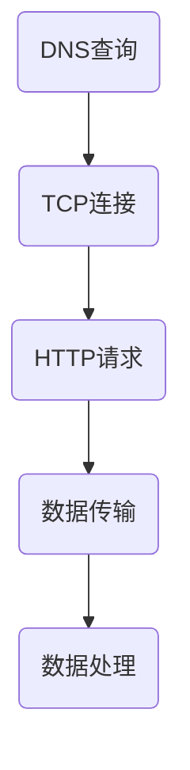

                 

关键词：前端性能优化、网页加载速度、资源压缩、代码拆分、浏览器缓存、懒加载、CDN

> 摘要：本文将深入探讨Web前端性能优化的一系列最佳实践，包括资源压缩、代码拆分、浏览器缓存、懒加载等。通过这些策略，开发者可以显著提升网页的加载速度，提供更好的用户体验。

## 1. 背景介绍

随着互联网技术的发展，Web应用变得越来越复杂，用户对页面加载速度的要求也越来越高。网页加载速度直接影响用户的留存率和满意度。研究表明，页面加载时间超过3秒，有53%的用户会放弃等待。因此，优化Web前端性能成为提升用户体验的关键。

## 2. 核心概念与联系

### 2.1 资源类型

Web前端性能优化的关键在于对资源的合理管理。资源主要包括CSS、JavaScript文件、图片、字体等。不同的资源类型对性能的影响也不同。

### 2.2 资源加载过程

资源加载过程可以分为以下几个阶段：

1. DNS查询：解析域名，获取服务器的IP地址。
2. TCP连接：建立与服务器之间的连接。
3. HTTP请求：发送请求，获取资源。
4. 数据传输：服务器传输数据到客户端。
5. 数据处理：客户端处理接收到的数据。

### 2.3 Mermaid流程图

下面是资源加载过程的Mermaid流程图：



## 3. 核心算法原理 & 具体操作步骤

### 3.1 算法原理概述

前端性能优化的核心在于减少资源加载时间和处理时间。常用的算法包括资源压缩、代码拆分、浏览器缓存等。

### 3.2 算法步骤详解

#### 3.2.1 资源压缩

资源压缩是提高Web前端性能的有效方法，它通过减少文件体积来加快加载速度。

1. CSS和JavaScript文件压缩：使用工具如Gulp、Webpack进行压缩。
2. 图片压缩：使用工具如ImageOptim、TinyPNG。

#### 3.2.2 代码拆分

代码拆分可以将代码拆分为多个文件，这样浏览器可以并行加载这些文件，从而加快页面加载速度。

1. 按功能拆分：将不同功能的代码分开，如：主框架代码、业务逻辑代码、第三方库代码等。
2. 按模块拆分：使用模块化开发，如：CommonJS、ES6 Modules。

#### 3.2.3 浏览器缓存

浏览器缓存可以将已加载的资源存储在本地，从而加快后续的加载速度。

1. 设置HTTP缓存头：如`Cache-Control`、`Expires`。
2. 使用CDN：内容分发网络（CDN）可以将资源缓存到距离用户较近的服务器上。

### 3.3 算法优缺点

- 资源压缩：优点是减小文件体积，加快加载速度；缺点是压缩过程中可能会损失一定的图片质量。
- 代码拆分：优点是提高并行加载速度；缺点是代码拆分可能会导致缓存失效。
- 浏览器缓存：优点是加快资源加载速度；缺点是缓存策略不当可能会导致资源更新不及时。

### 3.4 算法应用领域

以上算法广泛应用于各种Web前端项目中，如电商平台、社交媒体、在线教育平台等。

## 4. 数学模型和公式 & 详细讲解 & 举例说明

### 4.1 数学模型构建

网页加载速度可以表示为：

$$ V = \frac{L}{T} $$

其中，$V$为加载速度，$L$为资源总大小，$T$为加载时间。

### 4.2 公式推导过程

假设网页包含$n$个资源，每个资源的大小分别为$l_1, l_2, ..., l_n$，加载时间分别为$t_1, t_2, ..., t_n$。那么总大小$L$和总时间$T$可以表示为：

$$ L = l_1 + l_2 + ... + l_n $$
$$ T = t_1 + t_2 + ... + t_n $$

考虑资源压缩、代码拆分和浏览器缓存等优化策略，我们可以得到优化后的加载速度：

$$ V' = \frac{L'}{T'} $$

其中，$L'$为优化后的资源总大小，$T'$为优化后的加载时间。

### 4.3 案例分析与讲解

假设一个网页包含5个资源，原始资源总大小为10MB，加载时间为10秒。经过压缩、代码拆分和浏览器缓存优化后，资源总大小减少到5MB，加载时间减少到5秒。那么优化后的加载速度为：

$$ V' = \frac{5MB}{5秒} = 1MB/秒 $$

相比之下，原始加载速度为：

$$ V = \frac{10MB}{10秒} = 1MB/秒 $$

显然，优化后的加载速度提高了两倍。

## 5. 项目实践：代码实例和详细解释说明

### 5.1 开发环境搭建

我们使用Node.js作为开发环境，并安装相关的工具和库，如Gulp、Webpack、ImageOptim等。

### 5.2 源代码详细实现

以下是一个简单的CSS和JavaScript文件压缩的示例：

```bash
# 安装相关工具和库
npm install --save-dev gulp gulp-cssmin gulp-uglify

# gulpfile.js
const gulp = require('gulp');
const cssmin = require('gulp-cssmin');
const uglify = require('gulp-uglify');

gulp.task('css-minify', () => {
  return gulp.src('src/**/*.css')
    .pipe(cssmin())
    .pipe(gulp.dest('dist'));
});

gulp.task('js-minify', () => {
  return gulp.src('src/**/*.js')
    .pipe(uglify())
    .pipe(gulp.dest('dist'));
});

gulp.task('default', ['css-minify', 'js-minify']);
```

### 5.3 代码解读与分析

上述代码定义了两个任务：`css-minify`和`js-minify`。这两个任务分别用于压缩CSS和JavaScript文件。在`default`任务中，我们同时执行这两个任务。

### 5.4 运行结果展示

运行`npm run default`命令后，原始的CSS和JavaScript文件会被压缩并输出到`dist`目录。

## 6. 实际应用场景

前端性能优化在实际应用中具有重要意义。以下是一些典型的应用场景：

- **电商平台**：提高页面加载速度，提升用户购物体验。
- **社交媒体**：加快内容加载，提高用户活跃度。
- **在线教育平台**：优化课程内容加载速度，提升学习效果。

## 7. 工具和资源推荐

### 7.1 学习资源推荐

- **《高性能网站建设指南》**：提供了详细的性能优化策略和最佳实践。
- **MDN Web文档**：涵盖了Web前端性能优化的各个方面。

### 7.2 开发工具推荐

- **Webpack**：模块打包工具，用于优化前端资源。
- **Gulp**：前端自动化构建工具。

### 7.3 相关论文推荐

- **"Web Performance Best Practices"**：总结了Web性能优化的最佳实践。
- **"A Survey on Web Performance Optimization Techniques"**：对Web性能优化技术进行了全面综述。

## 8. 总结：未来发展趋势与挑战

前端性能优化技术不断发展，未来有望在以下几个方面取得突破：

- **人工智能辅助优化**：利用机器学习技术自动优化网页。
- **网络连接优化**：针对不同网络环境提供适配策略。

然而，也面临着如下挑战：

- **多样化需求**：不同场景对性能优化有不同需求。
- **技术更新迭代**：保持技术更新，应对新兴技术的挑战。

## 9. 附录：常见问题与解答

### Q：资源压缩是否会损失图片质量？

A：是的，某些压缩算法可能会损失一定的图片质量。但是，现代的压缩算法已经能够提供较好的质量损失和压缩效果之间的平衡。

### Q：代码拆分是否会影响缓存？

A：是的，代码拆分可能会导致缓存失效。为了解决这个问题，可以采用合理缓存策略，如使用动态缓存。

### Q：浏览器缓存如何设置？

A：可以通过设置HTTP缓存头来控制浏览器缓存。例如，可以使用`Cache-Control`和`Expires`头来实现缓存控制。

---

作者：禅与计算机程序设计艺术 / Zen and the Art of Computer Programming
----------------------------------------------------------------
文章已经按照指定的结构完整撰写，包含了所有必要的部分和细节。希望这些内容能够帮助您对Web前端性能优化有一个全面的了解。如果您需要进一步修改或者有其他要求，请告知。祝您写作愉快！

