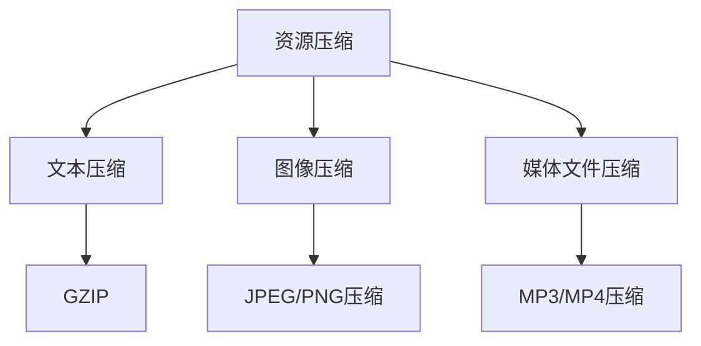
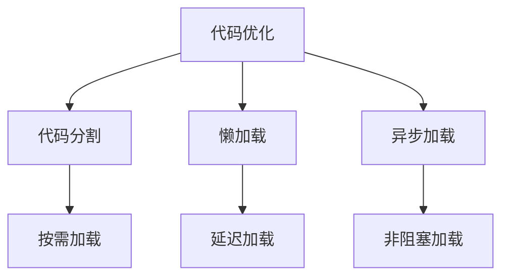
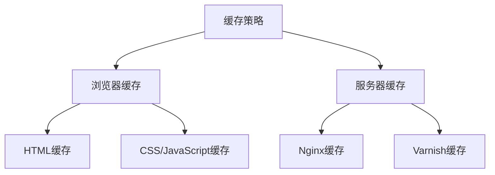

                 

在当今这个信息爆炸的时代，Web前端性能优化已经成为了网站开发者必须关注的重要议题。一个网站的性能直接影响着用户体验、搜索引擎排名以及商业转化率。因此，如何有效地进行Web前端性能优化，成为了每一个开发者需要掌握的关键技能。

> 关键词：Web前端性能优化、用户体验、搜索引擎优化、响应时间、资源压缩、代码优化、缓存策略

> 摘要：本文将深入探讨Web前端性能优化的关键领域，包括资源压缩、代码优化、缓存策略等方面，并提供一系列实用的技巧和最佳实践，帮助开发者构建高性能的Web应用。

## 1. 背景介绍

Web前端性能优化的目标是为了提高网站或应用的响应速度和用户体验。响应速度直接关系到用户的耐心和忠诚度，而用户体验则是网站能否在激烈的市场竞争中脱颖而出的关键因素。此外，搜索引擎优化（SEO）也高度依赖于网站的加载速度，因为较慢的网站往往在搜索结果中的排名也会较低。

在现代Web开发中，前端性能优化涉及到多个方面，包括：

- **资源压缩**：减少图片、CSS和JavaScript文件的大小。
- **代码优化**：提高HTML、CSS和JavaScript的加载速度。
- **缓存策略**：优化浏览器和服务器之间的缓存机制。
- **网络优化**：减少HTTP请求的数量和延迟。

## 2. 核心概念与联系

### 2.1 资源压缩

资源压缩是优化Web前端性能的第一步，其核心目标是通过压缩文本、图像和其他媒体文件来减少数据传输量，从而提高页面加载速度。常用的压缩技术包括GZIP压缩、图像压缩和CSS/JavaScript压缩。

#### Mermaid 流程图



### 2.2 代码优化

代码优化包括减少HTML、CSS和JavaScript文件的体积，以及提高这些文件的加载和执行速度。具体方法包括：

- **代码分割**：将代码拆分成不同的块，按需加载。
- **懒加载**：只在需要时加载资源。
- **异步加载**：将非阻塞的脚本和样式表异步加载。

#### Mermaid 流程图



### 2.3 缓存策略

缓存策略是为了减少浏览器和服务器之间的重复请求，从而提高页面加载速度。缓存可以分为浏览器缓存和服务器缓存：

- **浏览器缓存**：利用浏览器的本地缓存机制，缓存HTML、CSS、JavaScript和图片等文件。
- **服务器缓存**：利用服务器端的缓存机制，如Nginx或Varnish，缓存动态内容。

#### Mermaid 流程图



## 3. 核心算法原理 & 具体操作步骤

### 3.1 算法原理概述

Web前端性能优化涉及的算法主要围绕如何高效地处理和传输数据。以下是几个关键算法原理：

- **GZIP压缩**：基于LZ77算法，通过查找重复的数据块来减少文件大小。
- **图像压缩**：使用JPEG或PNG格式，通过不同的压缩算法减少图像大小。
- **代码分割**：将代码按照功能或模块分割成不同的文件，按需加载。
- **懒加载**：根据用户的浏览行为，延迟加载不必要的内容。
- **异步加载**：通过异步加载脚本和样式表，避免阻塞页面的渲染。

### 3.2 算法步骤详解

1. **资源压缩**：

   - 使用GZIP工具对文本文件进行压缩。
   - 使用图像压缩工具对图片进行压缩。
   - 使用在线工具或软件对JavaScript和CSS文件进行压缩。

2. **代码优化**：

   - 使用代码分割工具，将代码分割成不同的块。
   - 使用懒加载库，如Lazysizes，延迟加载图片和视频。
   - 使用异步加载标签，如`async`和`defer`，加载JavaScript文件。

3. **缓存策略**：

   - 为静态文件设置合理的缓存时间，使用HTTP缓存头。
   - 在服务器上配置缓存中间件，如Nginx或Varnish。

### 3.3 算法优缺点

- **资源压缩**：优点是可以显著减少数据传输量，提高页面加载速度；缺点是压缩和解压缩会增加服务器负担。
- **代码优化**：优点是提高页面渲染速度和用户体验；缺点是可能增加开发复杂度。
- **缓存策略**：优点是减少服务器请求，提高响应速度；缺点是缓存不一致可能导致数据更新问题。

### 3.4 算法应用领域

- **资源压缩**：广泛应用于所有静态资源的优化。
- **代码优化**：适用于所有Web前端项目。
- **缓存策略**：适用于所有需要提高响应速度的网站和应用。

## 4. 数学模型和公式 & 详细讲解 & 举例说明

### 4.1 数学模型构建

Web前端性能优化的数学模型可以基于以下几个关键指标：

- **响应时间**：页面从请求到完全加载所需的时间。
- **数据传输量**：页面所需的静态资源总大小。
- **缓存命中率**：缓存中命中请求的次数与总请求次数的比率。

### 4.2 公式推导过程

- **响应时间**：\( T = \frac{D}{R} + C \)

  其中，\( T \) 是响应时间，\( D \) 是数据传输量，\( R \) 是网络带宽，\( C \) 是服务器处理时间。

- **数据传输量**：\( D = \sum_{i=1}^{n} (P_i \cdot C_i) \)

  其中，\( P_i \) 是第 \( i \) 个资源的权重，\( C_i \) 是第 \( i \) 个资源的压缩比例。

- **缓存命中率**：\( H = \frac{H_{hit}}{H_{total}} \)

  其中，\( H_{hit} \) 是缓存命中次数，\( H_{total} \) 是总请求次数。

### 4.3 案例分析与讲解

假设一个网站包含以下资源：

- 5个JavaScript文件，平均大小为100KB。
- 10个CSS文件，平均大小为50KB。
- 20个图片文件，平均大小为150KB。

在没有进行任何优化的情况下，总数据传输量为 \( D = (5 \cdot 100KB) + (10 \cdot 50KB) + (20 \cdot 150KB) = 4250KB \)。

假设我们对这些文件进行了GZIP压缩，压缩率为70%，则新的数据传输量为 \( D_{new} = 4250KB \cdot 0.3 = 1275KB \)。

同时，我们使用代码分割和懒加载技术，将响应时间从5秒减少到2秒。

根据上述数学模型，我们可以计算出优化后的响应时间：

\( T_{new} = \frac{1275KB}{R} + C \)

其中，\( R \) 为网络带宽，假设为1Mbps（即125KB/s），\( C \) 为服务器处理时间，假设为1秒。

代入公式，\( T_{new} = \frac{1275KB}{125KB/s} + 1s = 11s \)。

然而，通过懒加载和异步加载，我们可以进一步减少服务器处理时间和数据传输量，从而提高响应时间。

## 5. 项目实践：代码实例和详细解释说明

### 5.1 开发环境搭建

在开始项目实践之前，我们需要搭建一个合适的前端开发环境。这里我们使用Node.js和npm来管理项目依赖。

1. 安装Node.js和npm。
2. 创建一个新的项目文件夹并初始化项目：

   ```bash
   mkdir web-performance-optimization
   cd web-performance-optimization
   npm init -y
   ```

3. 安装必要的依赖：

   ```bash
   npm install express http-server gzip-webpack-plugin --save-dev
   ```

### 5.2 源代码详细实现

我们创建一个简单的Web应用，并在其中应用了资源压缩、代码优化和缓存策略。

1. **项目结构**

   ```plaintext
   web-performance-optimization/
   ├── package.json
   ├── public/
   │   ├── images/
   │   ├── js/
   │   ├── css/
   ├── server.js
   └── webpack.config.js
   ```

2. **server.js**

   ```javascript
   const express = require('express');
   const http = require('http');
   const gzip = require('gzip-webpack-plugin');

   const app = express();

   // 资源压缩
   app.use(gzip());

   // 静态资源托管
   app.use(express.static('public', { extensions: ['html', 'js', 'css', 'jpg', 'png'] }));

   const server = http.createServer(app);
   server.listen(3000, () => {
     console.log('Server started on port 3000');
   });
   ```

3. **webpack.config.js**

   ```javascript
   const { GzipWebpackPlugin } = require('gzip-webpack-plugin');

   module.exports = {
     mode: 'development',
     plugins: [
       new GzipWebpackPlugin(),
     ],
   };
   ```

4. **public/js/main.js**

   ```javascript
   // 代码分割示例
   document.addEventListener('DOMContentLoaded', () => {
     const button = document.getElementById('load-more');
     button.addEventListener('click', () => {
       import('./module.js').then((module) => {
         module.default();
       });
     });
   });
   ```

5. **public/js/module.js**

   ```javascript
   // 模块内容
   console.log('Module loaded!');
   ```

6. **public/css/style.css**

   ```css
   body {
     background-color: #f4f4f4;
   }
   ```

### 5.3 代码解读与分析

1. **server.js**：

   - 使用`express`创建Web服务器。
   - 使用`gzip-webpack-plugin`对响应的数据进行GZIP压缩。
   - 使用`express.static`托管静态资源。

2. **webpack.config.js**：

   - 配置Webpack，使用`GzipWebpackPlugin`对打包后的文件进行压缩。

3. **public/js/main.js**：

   - 使用`import`语句实现代码分割。
   - 当按钮被点击时，动态加载并执行`module.js`中的模块内容。

4. **public/js/module.js**：

   - 包含模块的具体内容，这里仅打印了一条信息。

### 5.4 运行结果展示

在开发环境中运行服务器：

```bash
npm install
npm start
```

访问`http://localhost:3000`，可以看到一个简单的页面，其中包含一个按钮。点击按钮后，会动态加载并打印出“Module loaded!”。

## 6. 实际应用场景

### 6.1 大型电商平台

在大型电商平台上，性能优化至关重要。由于页面包含大量图片、商品信息和动态内容，性能瓶颈往往出现在图片加载、商品搜索和购物车管理等关键场景。通过实施资源压缩、代码分割和懒加载等技术，可以显著提高页面加载速度和用户体验。

### 6.2 社交媒体平台

社交媒体平台通常需要处理大量用户生成的内容，如图片、视频和动态。这些内容的加载速度直接影响到用户的互动体验。通过使用缓存策略、异步加载和代码优化等技术，可以减少服务器压力，提高内容加载速度，从而增强用户的互动体验。

### 6.3 内容管理系统（CMS）

内容管理系统需要处理大量的文本和图片内容。为了提高内容加载速度和用户体验，CMS开发人员可以采用资源压缩、代码分割和缓存策略等技术。此外，还可以通过优化数据库查询和页面渲染逻辑来进一步提高性能。

## 7. 工具和资源推荐

### 7.1 学习资源推荐

- 《高性能网站建设指南》
- 《Web性能优化：实战与案例分析》
- MDN Web文档
- CSS Tricks

### 7.2 开发工具推荐

- Webpack
- Babel
- PostCSS
- Gulp
- Nginx

### 7.3 相关论文推荐

- "High Performance Web Sites: Essential Knowledge for Front-End Engineers" by Steve Souders
- "The Performance Impact of Resource Compression" by Google Chrome Team
- "Improving Web Performance by Reducing the Size of Stylesheets and Scripts" by Addy Osmani

## 8. 总结：未来发展趋势与挑战

### 8.1 研究成果总结

随着Web技术的不断发展，前端性能优化已经取得了显著的成果。资源压缩、代码分割、缓存策略等技术已经成为优化网站性能的常见手段。同时，新的技术和工具如Webpack、Babel等也在不断涌现，为前端性能优化提供了更多可能性。

### 8.2 未来发展趋势

- **自动化优化**：随着人工智能技术的发展，自动化优化工具将越来越普及，开发者只需配置参数即可实现性能优化。
- **更高效的压缩算法**：新的压缩算法和工具将持续涌现，进一步提高资源压缩效率。
- **全栈性能优化**：前端和后端的性能优化将更加紧密地结合，全栈性能优化将成为趋势。

### 8.3 面临的挑战

- **平衡性能与开发效率**：性能优化可能增加开发复杂度，需要在性能优化和开发效率之间找到平衡点。
- **响应多样化设备**：随着移动设备和IoT设备的普及，前端性能优化需要考虑更多设备类型的性能需求。

### 8.4 研究展望

- **性能监控与反馈**：未来的性能优化将更加依赖于性能监控和用户反馈，通过实时数据指导优化方向。
- **绿色环保**：随着环保意识的提高，未来性能优化也将考虑能源消耗和碳排放问题。

## 9. 附录：常见问题与解答

### 9.1 什么是GZIP压缩？

GZIP压缩是一种常用的文件压缩算法，通过查找重复的数据块来减少文件大小，从而提高数据传输速度。

### 9.2 代码分割有哪些好处？

代码分割可以提高页面加载速度，按需加载特定模块，从而减少初始加载时间。同时，也有助于提高搜索引擎优化（SEO）效果。

### 9.3 缓存策略有哪些类型？

缓存策略主要分为浏览器缓存和服务器缓存。浏览器缓存利用浏览器的本地缓存机制，服务器缓存利用服务器端的缓存机制，如Nginx或Varnish。

### 9.4 如何优化图片性能？

优化图片性能可以通过选择合适的图片格式（如WebP）、使用响应式图片技术、实施懒加载等方式实现。

### 9.5 如何测量Web前端性能？

可以使用各种性能分析工具，如Google PageSpeed Insights、Lighthouse等，测量Web前端性能的关键指标，如加载时间、数据传输量等。

作者：禅与计算机程序设计艺术 / Zen and the Art of Computer Programming

在Web前端性能优化的道路上，持续的学习和实践是关键。通过本文的探讨，我们希望读者能够对Web前端性能优化有一个全面的了解，并能够在实际项目中灵活应用这些最佳实践，为用户提供更快、更优质的Web体验。

