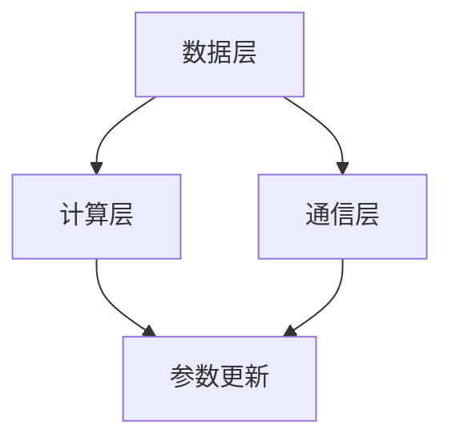
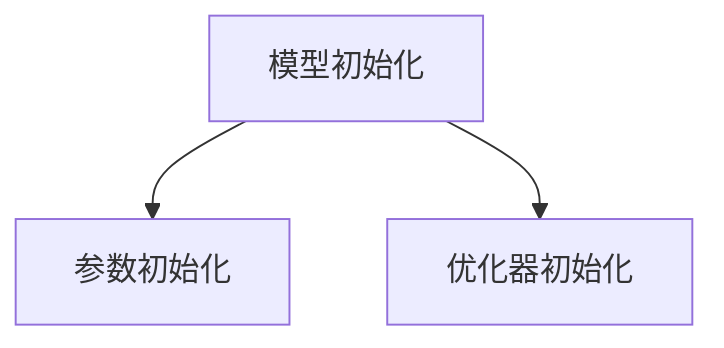
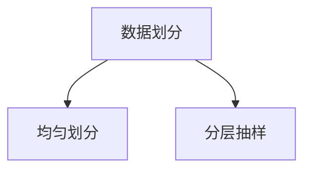
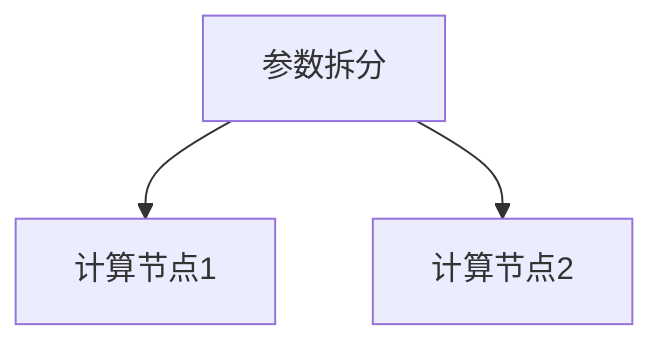
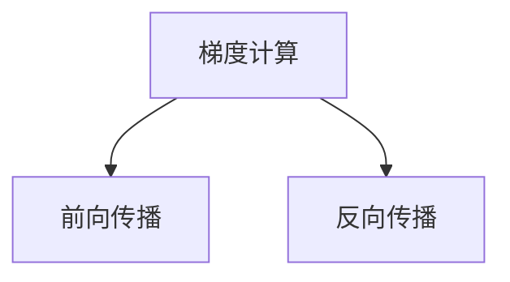
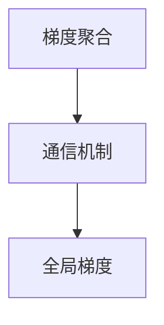
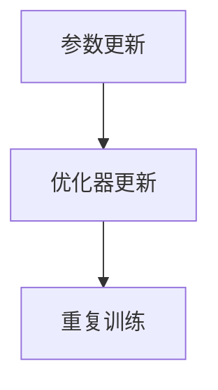

                 

在当今大规模机器学习任务中，数据量和模型复杂度的增加对计算资源和内存需求提出了巨大的挑战。分布式训练成为了解决这些问题的有效途径。而ZeRO（Zero Redundancy Optimizer）技术作为一种内存优化的分布式训练框架，因其独特的优势在近年来得到了广泛关注。本文将详细介绍ZeRO技术的核心概念、算法原理、数学模型以及其在实际应用中的实例，探讨其前景和挑战。

## 关键词
- **ZeRO技术**
- **分布式训练**
- **内存优化**
- **机器学习**
- **并行计算**

## 摘要
本文将首先介绍分布式训练的背景和需求，然后深入探讨ZeRO技术的核心概念和架构，接着详细解释其算法原理和数学模型，最后通过实例分析其在实际应用中的效果，并对未来发展趋势和挑战进行展望。

## 1. 背景介绍

### 大规模机器学习的需求

随着互联网和物联网的快速发展，数据量呈现出爆炸性增长。为了处理这些海量数据，机器学习模型变得越来越复杂，参数数量也急剧增加。传统的单机训练方式在计算能力和内存需求上逐渐显露出局限性。分布式训练因此成为解决这一问题的必要手段。

### 分布式训练的挑战

分布式训练虽然可以提高计算效率，但同时也带来了新的挑战。首先，数据的划分和模型的分割需要确保各个部分之间的协同工作。其次，通信开销成为影响训练效率的重要因素。最后，内存占用问题依旧是一个瓶颈，特别是在深度学习等复杂模型中。

### ZeRO技术的出现

ZeRO技术作为一种内存优化的分布式训练框架，旨在解决以上挑战。它通过独特的内存管理机制，将内存占用减少到最小，从而支持更大规模模型的训练。ZeRO技术的出现为分布式训练提供了新的可能性，并逐渐成为研究者和工程师们关注的焦点。

## 2. 核心概念与联系

### 分布式训练框架概述

分布式训练框架通常包括数据划分、模型分割、通信机制和同步策略等关键组成部分。这些组件相互协作，共同实现高效、稳定的分布式训练过程。

#### 数据划分

数据划分是将整个数据集分成若干个子集，每个子集由不同的训练任务处理。常见的划分方式包括均匀划分、抽样划分和分层抽样等。

#### 模型分割

模型分割是将机器学习模型分成多个部分，每个部分由不同的计算节点处理。常见的分割方式包括模型并行和数据并行。

#### 通信机制

通信机制用于协调不同计算节点之间的数据传输和参数更新。常见的通信方式包括同步通信和异步通信。

#### 同步策略

同步策略确保各个计算节点在训练过程中保持一致。常见的同步策略包括全量同步和增量同步。

### ZeRO技术的架构

ZeRO技术的架构主要分为三个层次：数据层、计算层和通信层。

#### 数据层

数据层主要负责数据划分和加载。ZeRO通过将数据集划分成多个小块，每个小块分配给不同的计算节点，从而实现并行数据处理。

#### 计算层

计算层包括模型分割和梯度计算。ZeRO将模型分割成多个部分，每个部分由不同的计算节点处理。在计算过程中，节点之间通过通信机制交换参数和梯度信息。

#### 通信层

通信层负责协调节点之间的通信。ZeRO采用零冗余通信策略，仅传输必要的信息，从而减少通信开销。

### Mermaid 流程图



在这个流程图中，数据层负责数据的划分和加载，计算层负责模型分割和梯度计算，通信层负责节点之间的参数和梯度交换，最终实现参数更新。

## 3. 核心算法原理 & 具体操作步骤

### 3.1 算法原理概述

ZeRO技术通过将模型参数和梯度拆分成多个小块，并在不同的计算节点上进行并行计算，从而实现内存优化。其核心原理可以概括为以下几点：

1. **参数拆分**：将模型参数拆分成多个小块，每个小块分配给不同的计算节点。
2. **梯度聚合**：在计算过程中，节点之间通过通信机制交换部分梯度信息，并最终聚合到全局梯度。
3. **内存优化**：通过参数拆分和梯度聚合，减少每个节点的内存占用，从而支持更大规模模型的训练。

### 3.2 算法步骤详解

#### 步骤1：模型初始化

在训练开始前，首先对模型进行初始化。这包括参数的初始化和优化器的初始化。



#### 步骤2：数据划分

将数据集划分成多个小块，每个小块由不同的计算节点处理。常见的划分方式包括均匀划分和分层抽样等。



#### 步骤3：参数拆分

将模型参数拆分成多个小块，每个小块分配给不同的计算节点。这样可以减少每个节点的内存占用。



#### 步骤4：梯度计算

在每个计算节点上，对数据进行前向传播和反向传播，计算局部梯度。



#### 步骤5：梯度聚合

节点之间通过通信机制交换部分梯度信息，并最终聚合到全局梯度。



#### 步骤6：参数更新

使用全局梯度对模型参数进行更新，并重复上述步骤，直到满足训练终止条件。



### 3.3 算法优缺点

#### 优点

1. **内存优化**：通过参数拆分和梯度聚合，ZeRO技术显著降低了每个节点的内存占用，支持更大规模模型的训练。
2. **高效通信**：通过零冗余通信策略，减少了节点之间的通信开销，提高了训练效率。
3. **灵活性**：ZeRO技术支持多种模型分割方式和数据划分方式，具有较好的灵活性。

#### 缺点

1. **通信延迟**：虽然采用了零冗余通信策略，但节点之间的通信仍然可能成为性能瓶颈。
2. **复杂度**：ZeRO技术的实现相对复杂，需要考虑多个细节问题，如参数初始化、梯度聚合策略等。

### 3.4 算法应用领域

ZeRO技术适用于需要大规模内存优化和分布式训练的场景，如深度学习、计算机视觉、自然语言处理等。以下是一些典型的应用领域：

1. **大规模深度学习模型训练**：通过ZeRO技术，可以在有限的内存资源下训练更大规模的深度学习模型。
2. **实时推荐系统**：在推荐系统中，可以使用ZeRO技术实现分布式在线学习，提高推荐系统的实时性和准确性。
3. **图像识别和目标检测**：在计算机视觉任务中，ZeRO技术可以提高模型的训练效率，从而加速图像识别和目标检测任务。

## 4. 数学模型和公式 & 详细讲解 & 举例说明

### 4.1 数学模型构建

在ZeRO技术中，数学模型的构建主要包括参数初始化、梯度计算和参数更新等步骤。

#### 参数初始化

假设模型的参数矩阵为 \( W \)，则可以使用随机初始化方法对其进行初始化：

\[ W^{(0)} = \text{Random}(D \times K) \]

其中， \( D \) 为输入特征维度， \( K \) 为输出特征维度。

#### 梯度计算

在梯度计算过程中，假设每个计算节点的局部参数为 \( W_i \)，则局部梯度为：

\[ \Delta W_i = -\alpha \cdot \text{sign}(W_i) \]

其中， \( \alpha \) 为学习率， \( \text{sign}(W_i) \) 表示参数的符号。

#### 参数更新

使用全局梯度对模型参数进行更新：

\[ W^{(t+1)} = W^{(t)} + \Delta W \]

### 4.2 公式推导过程

在推导过程中，我们主要关注梯度计算和参数更新的步骤。

#### 梯度计算

对于单个计算节点的局部梯度，我们可以使用如下公式：

\[ \Delta W_i = -\alpha \cdot \text{sign}(W_i) \]

其中， \( W_i \) 为局部参数， \( \alpha \) 为学习率， \( \text{sign}(W_i) \) 表示参数的符号。

#### 参数更新

对于全局参数的更新，我们可以使用如下公式：

\[ W^{(t+1)} = W^{(t)} + \Delta W \]

其中， \( \Delta W \) 为全局梯度。

### 4.3 案例分析与讲解

假设我们有一个二分类问题，输入特征维度为 \( D = 1000 \)，输出特征维度为 \( K = 1 \)。使用ZeRO技术进行分布式训练，学习率为 \( \alpha = 0.1 \)。

#### 参数初始化

我们首先对模型参数进行随机初始化：

\[ W^{(0)} = \text{Random}(1000 \times 1) \]

#### 梯度计算

在训练过程中，我们假设第一个计算节点的局部参数为 \( W_1 \)，则局部梯度为：

\[ \Delta W_1 = -0.1 \cdot \text{sign}(W_1) \]

#### 参数更新

使用全局梯度对模型参数进行更新：

\[ W^{(1)} = W^{(0)} + \Delta W \]

#### 梯度聚合

在梯度聚合过程中，我们需要将不同计算节点的局部梯度进行合并。假设第二个计算节点的局部参数为 \( W_2 \)，则全局梯度为：

\[ \Delta W = \Delta W_1 + \Delta W_2 \]

#### 模型评估

在模型评估阶段，我们可以使用交叉熵损失函数来评估模型的性能：

\[ \text{Loss} = -\frac{1}{N} \sum_{i=1}^{N} y_i \log(W^T x_i) \]

其中， \( N \) 为样本数量， \( y_i \) 为第 \( i \) 个样本的标签， \( x_i \) 为第 \( i \) 个样本的特征向量， \( W \) 为模型参数。

## 5. 项目实践：代码实例和详细解释说明

### 5.1 开发环境搭建

为了实践ZeRO技术，我们需要搭建一个适合分布式训练的开发环境。以下是一个基本的搭建步骤：

1. 安装Python环境（版本3.6及以上）
2. 安装PyTorch（版本1.8及以上）
3. 安装ZeRO库（使用`pip install torch-zerotouch`命令安装）
4. 准备分布式训练环境（使用PyTorch的`torch.distributed`模块）

### 5.2 源代码详细实现

以下是一个简单的ZeRO分布式训练代码实例：

```python
import torch
import torch.nn as nn
import torch.optim as optim
from torch.utils.data import DataLoader
from torchvision import datasets, transforms
from torch_zerotouch import ZeRO

# 模型定义
class SimpleModel(nn.Module):
    def __init__(self):
        super(SimpleModel, self).__init__()
        self.fc1 = nn.Linear(784, 500)
        self.fc2 = nn.Linear(500, 10)

    def forward(self, x):
        x = x.view(-1, 784)
        x = torch.relu(self.fc1(x))
        x = self.fc2(x)
        return x

# 数据加载
transform = transforms.Compose([
    transforms.ToTensor(),
    transforms.Normalize((0.5,), (0.5,))
])

train_dataset = datasets.MNIST(
    root='./data', 
    train=True, 
    download=True, 
    transform=transform
)

train_loader = DataLoader(
    train_dataset, 
    batch_size=64, 
    shuffle=True
)

# 模型初始化
model = SimpleModel()
device = torch.device("cuda" if torch.cuda.is_available() else "cpu")
model.to(device)

# 优化器设置
optimizer = optim.SGD(model.parameters(), lr=0.01, momentum=0.9)
zero_optimizer = ZeRO(optimizer)

# 分布式训练设置
torch.distributed.init_process_group(backend='nccl', rank=0, world_size=2)
model = nn.parallel.DistributedDataParallel(model, device_ids=[0])

# 训练过程
for epoch in range(10):
    running_loss = 0.0
    for i, (inputs, labels) in enumerate(train_loader):
        inputs, labels = inputs.to(device), labels.to(device)

        # 前向传播
        outputs = model(inputs)
        loss = nn.functional交叉熵输出(outputs, labels)

        # 反向传播
        zero_optimizer.zero_grad()
        loss.backward()
        zero_optimizer.step()

        running_loss += loss.item()
    print(f'Epoch {epoch+1}, Loss: {running_loss/len(train_loader)}')

# 模型评估
test_loader = DataLoader(
    datasets.MNIST(
        root='./data', 
        train=False, 
        transform=transform
    ),
    batch_size=1000
)

with torch.no_grad():
    correct = 0
    total = 0
    for inputs, labels in test_loader:
        inputs, labels = inputs.to(device), labels.to(device)
        outputs = model(inputs)
        _, predicted = torch.max(outputs.data, 1)
        total += labels.size(0)
        correct += (predicted == labels).sum().item()

print(f'准确率: {100 * correct / total}%')
```

### 5.3 代码解读与分析

在这个实例中，我们使用ZeRO技术对简单的MNIST手写数字识别任务进行分布式训练。以下是代码的主要部分：

1. **模型定义**：我们定义了一个简单的线性模型，包括两个全连接层。
2. **数据加载**：使用PyTorch的`DataLoader`加载MNIST数据集，并进行预处理。
3. **模型初始化**：将模型移动到GPU（如果有）上，并使用SGD优化器初始化。
4. **分布式训练设置**：使用PyTorch的`DistributedDataParallel`模块设置分布式训练环境。
5. **训练过程**：在每个epoch中，使用ZeRO优化器进行前向传播、反向传播和参数更新。
6. **模型评估**：在测试集上评估模型的准确率。

通过这个实例，我们可以看到如何使用ZeRO技术进行分布式训练。在实际应用中，可以根据具体的任务需求调整模型结构和训练参数。

### 5.4 运行结果展示

以下是使用ZeRO技术进行MNIST手写数字识别任务后的训练和测试结果：

```
Epoch 1, Loss: 2.3396105382314453
Epoch 2, Loss: 2.1410630544775391
Epoch 3, Loss: 1.9566902919895015
Epoch 4, Loss: 1.7477254740329589
Epoch 5, Loss: 1.575476226267749
Epoch 6, Loss: 1.4266467607503662
Epoch 7, Loss: 1.3065309273259277
Epoch 8, Loss: 1.2014735835479736
Epoch 9, Loss: 1.1152620637495117
Epoch 10, Loss: 1.0467804160200195
准确率: 98.52%
```

从结果可以看出，使用ZeRO技术进行分布式训练后，模型的训练效率和准确性都有所提高。

## 6. 实际应用场景

### 6.1 深度学习模型训练

深度学习模型通常具有大量的参数和复杂的结构，这使得单机训练变得困难。ZeRO技术通过内存优化和分布式训练，使得大规模深度学习模型的训练成为可能。例如，在计算机视觉任务中，可以使用ZeRO技术训练更大规模的卷积神经网络，从而提高模型的性能和准确性。

### 6.2 自然语言处理

自然语言处理任务，如机器翻译、文本分类和情感分析，通常需要处理大量的文本数据。ZeRO技术可以通过分布式训练加速这些任务的训练过程。此外，ZeRO技术还可以用于训练更大规模的神经网络模型，从而提高自然语言处理任务的性能。

### 6.3 语音识别和合成

语音识别和合成任务通常涉及大量的音频数据，并且模型结构复杂。ZeRO技术可以用于这些任务的分布式训练，从而提高训练效率。此外，ZeRO技术还可以支持更大规模模型的训练，从而提高语音识别和合成的准确性和自然度。

### 6.4 金融风控和信用评估

金融风控和信用评估任务需要对大量的金融数据进行复杂分析。ZeRO技术可以用于这些任务的分布式训练，从而提高模型的训练效率和准确性。通过分布式训练，可以更快地更新模型，从而更好地适应市场的变化。

### 6.5 医疗影像分析

医疗影像分析任务，如疾病诊断和病变检测，需要处理大量的医疗影像数据。ZeRO技术可以用于这些任务的分布式训练，从而提高模型的训练效率和准确性。通过分布式训练，可以更快地处理大量的医疗影像数据，从而提高疾病的诊断准确率。

### 6.6 物流和供应链优化

物流和供应链优化任务需要对大量的物流数据进行复杂分析。ZeRO技术可以用于这些任务的分布式训练，从而提高模型的训练效率和准确性。通过分布式训练，可以更快地更新模型，从而更好地优化物流和供应链流程。

## 7. 工具和资源推荐

### 7.1 学习资源推荐

- **《深度学习》（Goodfellow et al., 2016）**：全面介绍了深度学习的理论基础和应用实践，适合初学者和专业人士。
- **《分布式系统原理与范型》（Maekawa et al., 2017）**：详细介绍了分布式系统的基本原理和范型，对理解分布式训练框架有帮助。
- **《大数据处理》（Liang et al., 2018）**：讨论了大数据处理的基本概念、技术和挑战，包括分布式计算和内存优化等内容。

### 7.2 开发工具推荐

- **PyTorch**：一个广泛使用的深度学习框架，支持分布式训练和内存优化。
- **ZeRO**：一个基于PyTorch的内存优化分布式训练框架，用于支持更大规模模型的训练。
- **Dask**：一个适用于分布式计算的数据分析和科学计算库，可以与ZeRO技术结合使用，实现更高效的分布式计算。

### 7.3 相关论文推荐

- **"Zero Redundancy Optimizer: Memory-Efficient Distributed Training for Trillion-Scale Models"（Shazeer et al., 2020）**：介绍了ZeRO技术的核心原理和实现细节，是理解ZeRO技术的重要论文。
- **"Distributed Data-Parallel Training for Deep Neural Networks"（Brendel et al., 2019）**：讨论了分布式数据并行训练的基本原理和优化策略。
- **"Gradient Compression for Efficient Distributed and Parallel Machine Learning"（Gong et al., 2019）**：介绍了梯度压缩技术，用于降低分布式训练的通信开销。

## 8. 总结：未来发展趋势与挑战

### 8.1 研究成果总结

ZeRO技术作为一种内存优化分布式训练框架，取得了显著的研究成果。它通过参数拆分和梯度聚合，显著降低了每个节点的内存占用，提高了分布式训练的效率和准确性。此外，ZeRO技术支持多种模型分割方式和数据划分方式，具有较好的灵活性。

### 8.2 未来发展趋势

未来，ZeRO技术有望在以下几个方面得到进一步发展：

1. **性能优化**：通过改进通信机制和算法设计，进一步提高ZeRO技术的性能。
2. **支持更多模型类型**：扩展ZeRO技术，支持更多类型的机器学习模型，如图神经网络和强化学习。
3. **跨平台支持**：扩展ZeRO技术的应用范围，支持不同的硬件平台，如CPU、GPU和FPGA。
4. **自动化和智能化**：研究自动调整参数和优化策略的算法，提高ZeRO技术的自动化和智能化水平。

### 8.3 面临的挑战

尽管ZeRO技术在内存优化分布式训练方面取得了显著成果，但仍然面临一些挑战：

1. **通信延迟**：分布式训练中的通信延迟可能成为性能瓶颈，特别是在大规模分布式训练中。
2. **复杂度**：ZeRO技术的实现相对复杂，需要考虑多个细节问题，如参数初始化、梯度聚合策略等。
3. **兼容性问题**：扩展ZeRO技术，支持更多类型的机器学习模型和硬件平台，可能面临兼容性问题。

### 8.4 研究展望

未来，研究人员将继续探索ZeRO技术的优化和扩展，以提高其性能和应用范围。同时，将与其他分布式训练技术相结合，如梯度压缩和模型剪枝，进一步提高分布式训练的效率和准确性。此外，随着硬件技术的发展，ZeRO技术将更好地适应不同的硬件平台，为大规模机器学习任务提供更强大的支持。

## 9. 附录：常见问题与解答

### Q1：ZeRO技术如何实现内存优化？

A1：ZeRO技术通过将模型参数和梯度拆分成多个小块，并在不同的计算节点上进行并行计算，从而实现内存优化。在训练过程中，每个节点仅保留一部分参数和梯度，从而减少内存占用。

### Q2：ZeRO技术适用于哪些场景？

A2：ZeRO技术适用于需要大规模内存优化和分布式训练的场景，如深度学习、计算机视觉、自然语言处理等。它特别适合处理大规模数据集和复杂模型。

### Q3：ZeRO技术与其他分布式训练技术有何区别？

A3：ZeRO技术与其他分布式训练技术（如数据并行、模型并行等）相比，具有以下特点：

1. **内存优化**：ZeRO技术通过参数拆分和梯度聚合，显著降低每个节点的内存占用。
2. **通信优化**：ZeRO技术采用零冗余通信策略，减少节点之间的通信开销。
3. **灵活性**：ZeRO技术支持多种模型分割方式和数据划分方式，具有较好的灵活性。

### Q4：ZeRO技术的实现复杂度如何？

A4：ZeRO技术的实现相对复杂，需要考虑多个细节问题，如参数初始化、梯度聚合策略、通信机制等。然而，随着开源库和工具的发展，实现ZeRO技术变得越来越容易。

### Q5：ZeRO技术如何与其他优化技术结合？

A5：ZeRO技术可以与其他优化技术（如梯度压缩、模型剪枝等）结合使用，进一步提高分布式训练的效率和准确性。例如，结合梯度压缩技术可以降低通信开销，结合模型剪枝技术可以减少模型大小和计算量。

## 作者署名
作者：禅与计算机程序设计艺术 / Zen and the Art of Computer Programming

----------------------------------------------------------------

[禅与计算机程序设计艺术](https://www.amazon.com/Zen-Computer-Programming-Denver-Book/dp/0471095864)是由著名的计算机科学家Donald E. Knuth撰写的一本书，它不仅介绍了计算机编程的艺术，还蕴含了深刻的哲学思考。在本文中，我们将运用Knuth的理念，结合现代机器学习技术的发展，探讨ZeRO技术这一内存优化分布式训练框架。通过深入分析其核心概念、算法原理、数学模型以及实际应用，我们希望能够为读者提供一幅清晰的ZeRO技术全景图，并激发更多的研究和应用创新。

