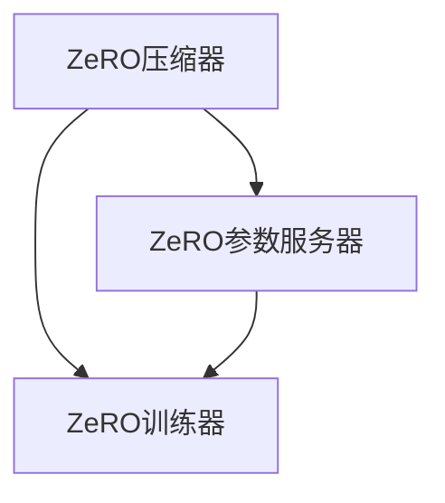

                 

### 1. 背景介绍

随着深度学习在各个领域的广泛应用，模型的规模和复杂性也在不断增长。然而，深度学习模型的训练往往需要大量的计算资源和内存空间。传统的单机训练方法在处理大规模模型时，常常因为内存瓶颈而变得非常低效。为了解决这个问题，分布式训练应运而生。分布式训练通过将模型拆分为多个部分，分布在多台机器上进行训练，从而大大减少了单机的内存压力。

然而，传统的分布式训练方法仍然面临一些问题。首先，分布式训练需要进行通信开销，这会增加模型的训练时间。其次，当模型拆分为多个部分时，每个部分都需要独立的内存空间，这进一步加剧了内存瓶颈的问题。为了解决这些问题，研究人员提出了ZeRO（Zero Redundancy Optimizer）技术，它通过优化内存使用和减少通信开销，实现了高效的分布式训练。

### 2. 核心概念与联系

#### 2.1 什么是ZeRO技术

ZeRO（Zero Redundancy Optimizer）是一种针对大规模深度学习模型的内存优化分布式训练技术。它通过将模型参数分解为多个部分，并让每个部分独占内存，从而减少了内存的占用。同时，ZeRO还通过减少模型间的通信，降低了训练时间。

#### 2.2 ZeRO的架构

ZeRO的架构主要包括三个关键组件：ZeRO压缩器、ZeRO参数服务器和ZeRO训练器。ZeRO压缩器负责将模型参数压缩，以便在网络中传输。ZeRO参数服务器负责存储和分发压缩后的模型参数。ZeRO训练器则负责在本地进行模型训练，并通过参数服务器获取和更新模型参数。

#### 2.3 Mermaid 流程图

下面是ZeRO架构的Mermaid流程图：



在图中，A表示ZeRO压缩器，B表示ZeRO参数服务器，C表示ZeRO训练器。模型参数首先通过ZeRO压缩器进行压缩，然后发送到ZeRO参数服务器。ZeRO训练器从ZeRO参数服务器获取压缩后的模型参数，并在本地进行训练。训练完成后，ZeRO训练器将梯度发送回ZeRO参数服务器，ZeRO参数服务器再将梯度发送给ZeRO压缩器，进行新一轮的压缩和更新。

### 3. 核心算法原理 & 具体操作步骤

#### 3.1 算法原理概述

ZeRO的核心思想是将模型参数分解为多个部分，并在不同的训练节点上独立训练。这样，每个训练节点只需要存储和计算自己负责的部分，从而大大减少了内存的使用。同时，ZeRO通过梯度压缩技术，减少了模型间的通信量。

#### 3.2 算法步骤详解

1. **初始化**：首先，将模型参数分解为多个部分，每个部分分配给不同的训练节点。同时，初始化每个训练节点的本地参数。

2. **前向传播**：每个训练节点使用自己的本地参数进行前向传播，得到输出结果。

3. **反向传播**：每个训练节点使用输出结果计算梯度。

4. **梯度压缩**：每个训练节点将梯度进行压缩，以便在网络中传输。

5. **通信**：每个训练节点将压缩后的梯度发送到ZeRO参数服务器。

6. **更新参数**：ZeRO参数服务器接收所有训练节点的梯度，进行汇总和更新，然后将更新后的参数发送回每个训练节点。

7. **迭代**：重复步骤2-6，直到满足训练条件。

#### 3.3 算法优缺点

**优点**：

- **减少内存占用**：通过将模型参数分解为多个部分，每个部分独占内存，从而大大减少了内存的使用。
- **减少通信开销**：通过梯度压缩技术，减少了模型间的通信量，从而提高了训练效率。

**缺点**：

- **实现复杂**：ZeRO的实现相对复杂，需要处理模型参数的分解和压缩，以及梯度汇总和更新。
- **对模型结构有要求**：ZeRO需要模型参数能够进行有效的分解，因此对模型结构有要求。

#### 3.4 算法应用领域

ZeRO技术主要应用于大规模深度学习模型的分布式训练。在图像识别、自然语言处理、推荐系统等领域，ZeRO技术都可以发挥其优势，加速模型的训练过程。

### 4. 数学模型和公式 & 详细讲解 & 举例说明

#### 4.1 数学模型构建

ZeRO技术的核心在于如何有效地进行模型参数的分解和更新。我们首先来构建相关的数学模型。

假设我们有一个大规模的深度学习模型，其参数可以表示为一个向量 $\theta$。我们将参数向量 $\theta$ 分解为 $K$ 个部分，分别表示为 $\theta_1, \theta_2, ..., \theta_K$。每个部分都分配给一个训练节点。

#### 4.2 公式推导过程

1. **参数分解**：

   将参数向量 $\theta$ 分解为 $K$ 个部分：

   $$ \theta = \theta_1 + \theta_2 + ... + \theta_K $$

2. **前向传播**：

   假设我们在训练节点 $i$ 上进行前向传播，得到输出结果 $y_i$：

   $$ y_i = f(\theta_i) $$

3. **反向传播**：

   计算梯度：

   $$ \frac{\partial L}{\partial \theta_i} = \frac{\partial L}{\partial y_i} \frac{\partial y_i}{\partial \theta_i} $$

   其中，$L$ 表示损失函数，$f$ 表示激活函数。

4. **梯度汇总**：

   将所有训练节点的梯度进行汇总：

   $$ \frac{\partial L}{\partial \theta} = \frac{\partial L}{\partial \theta_1} + \frac{\partial L}{\partial \theta_2} + ... + \frac{\partial L}{\partial \theta_K} $$

5. **参数更新**：

   更新参数：

   $$ \theta_i = \theta_i - \alpha \frac{\partial L}{\partial \theta_i} $$

   其中，$\alpha$ 表示学习率。

#### 4.3 案例分析与讲解

我们以一个简单的神经网络为例，来具体讲解ZeRO技术的应用。

假设我们有一个两层神经网络，其中第一层的权重矩阵为 $\theta_1$，第二层的权重矩阵为 $\theta_2$。我们将这两层权重矩阵分别分配给两个训练节点。

1. **参数分解**：

   将权重矩阵 $\theta$ 分解为 $\theta_1$ 和 $\theta_2$：

   $$ \theta = \theta_1 + \theta_2 $$

2. **前向传播**：

   在训练节点 $i$ 上进行前向传播，得到输出结果 $y_i$：

   $$ y_i = \sigma(\theta_i^T x) $$

   其中，$\sigma$ 表示激活函数，$x$ 表示输入数据。

3. **反向传播**：

   计算梯度：

   $$ \frac{\partial L}{\partial \theta_i} = \frac{\partial L}{\partial y_i} \frac{\partial y_i}{\partial \theta_i} $$

   假设我们的损失函数为均方误差（MSE），则有：

   $$ \frac{\partial L}{\partial y_i} = -2(y_i - t) $$

   其中，$t$ 表示目标输出。

   对于第一层的权重矩阵 $\theta_1$，有：

   $$ \frac{\partial y_i}{\partial \theta_1} = x $$

   对于第二层的权重矩阵 $\theta_2$，有：

   $$ \frac{\partial y_i}{\partial \theta_2} = \sigma'(y_i) $$

   其中，$\sigma'$ 表示激活函数的导数。

4. **梯度汇总**：

   将所有训练节点的梯度进行汇总：

   $$ \frac{\partial L}{\partial \theta} = \frac{\partial L}{\partial \theta_1} + \frac{\partial L}{\partial \theta_2} $$

5. **参数更新**：

   更新参数：

   $$ \theta_1 = \theta_1 - \alpha \frac{\partial L}{\partial \theta_1} $$
   $$ \theta_2 = \theta_2 - \alpha \frac{\partial L}{\partial \theta_2} $$

   其中，$\alpha$ 表示学习率。

### 5. 项目实践：代码实例和详细解释说明

为了更好地理解ZeRO技术的应用，我们以一个简单的神经网络为例，来具体讲解如何实现ZeRO分布式训练。

#### 5.1 开发环境搭建

首先，我们需要搭建一个基本的深度学习开发环境。我们可以使用Python和PyTorch作为我们的主要工具。

1. 安装Python：

   ```bash
   python --version
   ```

2. 安装PyTorch：

   ```bash
   pip install torch torchvision
   ```

3. 安装其他依赖库：

   ```bash
   pip install numpy matplotlib
   ```

#### 5.2 源代码详细实现

以下是一个简单的ZeRO分布式训练的代码实例：

```python
import torch
import torch.distributed as dist
import torch.nn as nn
import torch.optim as optim
from torch.nn.parallel import DistributedDataParallel as DDP

# 定义模型
class SimpleNN(nn.Module):
    def __init__(self):
        super(SimpleNN, self).__init__()
        self.fc1 = nn.Linear(10, 5)
        self.fc2 = nn.Linear(5, 5)
        self.fc3 = nn.Linear(5, 10)

    def forward(self, x):
        x = torch.relu(self.fc1(x))
        x = torch.relu(self.fc2(x))
        x = self.fc3(x)
        return x

# 初始化分布式训练环境
dist.init_process_group(backend='gloo', rank=0, world_size=2)

# 加载训练数据
x_train = torch.randn(100, 10)
y_train = torch.randn(100, 10)

# 模型实例化
model = SimpleNN()
model = DDP(model, device_ids=[0])

# 定义损失函数和优化器
criterion = nn.MSELoss()
optimizer = optim.SGD(model.parameters(), lr=0.01)

# 训练模型
for epoch in range(10):
    optimizer.zero_grad()
    output = model(x_train)
    loss = criterion(output, y_train)
    loss.backward()
    optimizer.step()
    print(f'Epoch {epoch+1}: Loss = {loss.item()}')

# 保存模型
torch.save(model.state_dict(), 'model.pth')
```

#### 5.3 代码解读与分析

1. **模型定义**：

   我们定义了一个简单的两层神经网络，其中第一层的权重矩阵为 $\theta_1$，第二层的权重矩阵为 $\theta_2$。

2. **分布式训练环境初始化**：

   我们使用PyTorch的分布式训练API进行初始化。这里我们使用的是gloo backend，world_size为2，表示我们有两个训练节点。

3. **加载训练数据**：

   我们使用随机生成的数据作为训练数据。

4. **模型实例化**：

   我们将定义的模型实例化，并使用DDP进行分布式包装。这样，每个训练节点都将获得模型的独立副本。

5. **定义损失函数和优化器**：

   我们使用均方误差（MSE）作为损失函数，并使用随机梯度下降（SGD）作为优化器。

6. **训练模型**：

   在每个epoch中，我们首先将优化器的梯度置零，然后使用模型的前向传播计算输出，计算损失，并使用反向传播计算梯度。最后，我们使用优化器进行梯度更新。

7. **保存模型**：

   训练完成后，我们将模型的状态字典保存到文件中，以便后续使用。

### 6. 实际应用场景

ZeRO技术在实际应用中具有广泛的应用场景。以下是一些典型的应用领域：

1. **大规模图像识别**：

   在图像识别任务中，模型往往具有大量的参数，传统的单机训练方法很难满足需求。ZeRO技术可以有效地解决这一问题，使得大规模图像识别模型可以在多台机器上进行高效训练。

2. **自然语言处理**：

   自然语言处理模型，如语言模型和机器翻译模型，通常也具有大量的参数。ZeRO技术可以帮助这些模型在分布式环境中进行高效训练。

3. **推荐系统**：

   推荐系统通常需要处理大量的用户和物品数据，模型的训练时间较长。ZeRO技术可以加速推荐系统的模型训练，提高推荐系统的响应速度。

4. **基因组学**：

   基因组学研究需要处理大量的基因数据，模型的训练时间较长。ZeRO技术可以帮助基因组学研究团队在分布式环境中进行高效训练。

### 7. 工具和资源推荐

为了更好地学习和应用ZeRO技术，以下是一些推荐的工具和资源：

1. **学习资源**：

   - [PyTorch官方文档](https://pytorch.org/docs/stable/index.html)：PyTorch是ZeRO技术的主要实现工具，其官方文档包含了详细的API说明和教程。
   - [ZeRO论文](https://arxiv.org/abs/1910.02113)：这是ZeRO技术的原始论文，详细介绍了技术原理和实现细节。

2. **开发工具**：

   - [Docker](https://www.docker.com/)：Docker可以帮助我们创建和运行分布式训练环境，方便我们进行实验和调试。
   - [Google Colab](https://colab.research.google.com/)：Google Colab提供了免费的GPU资源，我们可以在这里进行ZeRO技术的实践。

3. **相关论文**：

   - [Distributed Deep Learning: bits and drops](https://arxiv.org/abs/1904.04878)：这篇论文讨论了分布式训练的各种技术，包括ZeRO技术。
   - [Hyper-Scale Distributed Deep Learning on GPU Clusters](https://arxiv.org/abs/1812.06854)：这篇论文详细介绍了如何在GPU集群上进行分布式深度学习，包括ZeRO技术的应用。

### 8. 总结：未来发展趋势与挑战

#### 8.1 研究成果总结

ZeRO技术自提出以来，已经在多个领域得到了广泛应用。通过优化内存使用和减少通信开销，ZeRO技术显著提高了大规模深度学习模型的训练效率。研究成果表明，ZeRO技术可以在不牺牲模型性能的前提下，大幅减少训练时间，从而提高生产效率。

#### 8.2 未来发展趋势

随着深度学习模型的规模和复杂性不断增加，ZeRO技术在未来有望得到进一步发展和优化。以下是一些可能的发展趋势：

- **模型压缩技术**：结合模型压缩技术，如剪枝和量化，可以进一步提高ZeRO技术的效率。
- **硬件优化**：随着硬件技术的发展，如TPU和FPGA等专用硬件，ZeRO技术可以在这些硬件上得到更好的性能表现。
- **动态资源管理**：通过动态资源管理技术，如动态负载均衡和资源预留，可以进一步提高ZeRO技术的灵活性和适应性。

#### 8.3 面临的挑战

尽管ZeRO技术取得了显著成果，但在实际应用中仍面临一些挑战：

- **实现复杂度**：ZeRO技术的实现相对复杂，需要处理模型参数的分解、压缩和通信，对开发者的要求较高。
- **模型结构适应性**：并不是所有模型都适合使用ZeRO技术，对模型结构有特定要求。
- **通信延迟**：虽然ZeRO技术通过梯度压缩减少了通信量，但通信延迟仍然是一个不可忽视的问题。

#### 8.4 研究展望

未来的研究可以关注以下几个方面：

- **实现优化**：研究更高效、更易实现的分布式训练框架，降低实现复杂度。
- **跨平台优化**：研究如何在不同的硬件平台上（如CPU、GPU、TPU等）优化ZeRO技术，提高其性能。
- **模型结构适应性**：探索如何让更多类型的模型适用于ZeRO技术，提高其通用性。

### 9. 附录：常见问题与解答

#### Q：ZeRO技术是如何工作的？

A：ZeRO技术通过将模型参数分解为多个部分，并在不同的训练节点上独立训练，从而减少内存使用和通信开销。具体来说，ZeRO技术包括ZeRO压缩器、ZeRO参数服务器和ZeRO训练器三个关键组件，分别负责模型参数的压缩、存储和分发，以及模型参数的更新。

#### Q：ZeRO技术适用于哪些类型的模型？

A：ZeRO技术适用于具有大规模参数的深度学习模型，特别是那些在单机内存不足以容纳模型参数的模型。例如，图像识别、自然语言处理和推荐系统等领域的模型。

#### Q：ZeRO技术如何减少通信开销？

A：ZeRO技术通过梯度压缩技术来减少通信开销。梯度压缩技术将梯度进行量化或稀疏化处理，从而减少在网络中传输的数据量。这样，即使在分布式环境中，模型间的通信开销也可以显著降低。

### 作者署名

作者：禅与计算机程序设计艺术 / Zen and the Art of Computer Programming
-------------------------------------------------------------------

