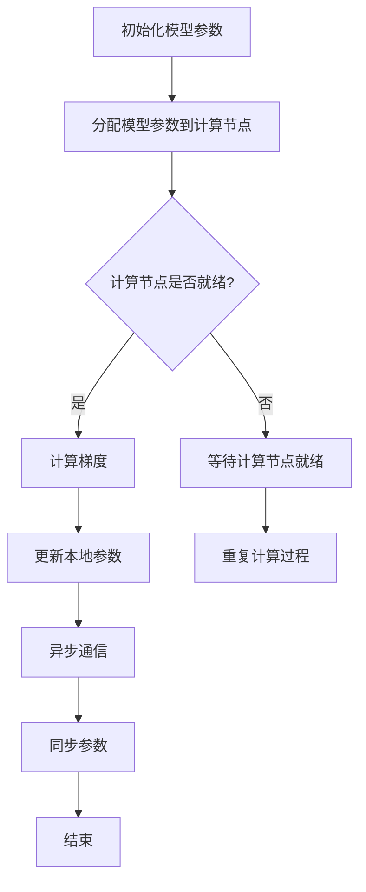

                 

关键词：ZeRO技术，内存优化，分布式训练，并行计算，深度学习，大规模模型训练，数据并行，模型并行

## 摘要

本文将深入探讨ZeRO（Zero Redundancy）技术，一种专门为内存优化分布式训练而设计的框架。随着深度学习模型日益庞大，训练这些模型所需的计算资源和内存需求也不断攀升。ZeRO通过零冗余数据存储和高效内存管理，显著降低了大规模模型训练的内存占用，使得分布式训练成为可能。本文将详细介绍ZeRO的核心概念、算法原理、数学模型以及实际应用场景，并探讨其在未来研究和应用中的前景。

## 1. 背景介绍

深度学习作为人工智能的重要分支，近年来取得了飞速发展。然而，随着模型的复杂度和规模不断增加，单机训练这些模型所需的计算资源和内存需求已经达到了难以承受的程度。分布式训练成为了一种有效的解决方案，通过将训练任务分解到多台机器上并行执行，可以显著提高训练效率。然而，分布式训练也带来了新的挑战，尤其是在内存管理方面。

传统的分布式训练方法通常采用数据并行（Data Parallelism）和模型并行（Model Parallelism）两种策略。数据并行将训练数据分成多个部分，每台机器负责处理一部分数据，并在通信网络中交换模型参数。模型并行将模型分成多个子部分，每个子部分在不同的机器上训练，并通过通信网络同步模型参数。然而，这两种方法都存在内存占用高的问题。

数据并行要求每台机器都有完整的模型副本，这意味着需要大量的内存来存储冗余的参数。模型并行则可能需要跨机器传输大量的数据，这也增加了内存占用和通信开销。为了解决这些问题，研究人员提出了ZeRO技术，旨在通过零冗余数据存储和高效内存管理，实现内存优化的分布式训练。

## 2. 核心概念与联系

### 2.1 ZeRO的核心概念

ZeRO技术（Zero Redundancy）的核心思想是消除分布式训练中的冗余数据存储，通过零冗余数据存储和高效内存管理，显著降低大规模模型训练的内存占用。具体来说，ZeRO将模型参数分成多个部分，每个部分只存储在部分机器上，而不是所有机器。这样，每台机器只需要存储和处理自己负责的那部分模型参数，从而减少了内存占用。

### 2.2 ZeRO的架构

ZeRO的架构主要包括三个组件：参数服务器（Parameter Server）、计算节点（Compute Node）和通信网络。参数服务器负责存储和同步模型参数，计算节点负责计算梯度并更新模型参数。通信网络则负责在计算节点之间传输数据和梯度。

### 2.3 ZeRO与数据并行和模型并行的联系

与数据并行和模型并行相比，ZeRO具有以下优势：

- **内存占用更低**：ZeRO通过零冗余数据存储，显著降低了内存占用。相比之下，数据并行需要每台机器存储完整的模型副本，模型并行需要跨机器传输大量的数据。

- **通信开销更小**：ZeRO通过局部同步和异步通信，减少了通信开销。相比之下，数据并行和模型并行通常需要全局同步，增加了通信延迟和带宽需求。

- **扩展性更好**：ZeRO可以轻松地扩展到更多的计算节点，而不会显著增加内存占用和通信开销。相比之下，数据并行和模型并行可能需要重新设计和优化，以适应更大的规模。

### 2.4 Mermaid 流程图

以下是一个简单的Mermaid流程图，展示了ZeRO的工作流程：



## 3. 核心算法原理 & 具体操作步骤

### 3.1 算法原理概述

ZeRO算法的核心原理是参数分割（Parameter Segmentation）。具体来说，ZeRO将模型参数分割成多个不 overlapping（不重叠）的部分，每个部分只存储在部分计算节点上。这样，每个计算节点只需要存储和处理自己负责的那部分模型参数，从而减少了内存占用。

### 3.2 算法步骤详解

#### 3.2.1 初始化模型参数

在训练开始时，首先初始化模型参数。这些参数会被分割成多个部分，并分配给不同的计算节点。

#### 3.2.2 分配模型参数到计算节点

参数服务器根据计算节点的内存大小和任务负载，将模型参数分配给不同的计算节点。每个计算节点只存储和处理自己负责的那部分模型参数。

#### 3.2.3 计算梯度

每个计算节点根据分配到的模型参数和训练数据，计算梯度。

#### 3.2.4 更新本地参数

计算节点使用计算得到的梯度更新本地参数。

#### 3.2.5 异步通信

计算节点将更新后的本地参数异步发送给参数服务器。

#### 3.2.6 同步参数

参数服务器在收到所有计算节点的更新后，同步更新全局参数。

#### 3.2.7 重复计算过程

计算过程会重复进行，直到达到预定的训练次数或达到收敛条件。

### 3.3 算法优缺点

#### 优点

- **内存占用更低**：通过零冗余数据存储，ZeRO显著降低了大规模模型训练的内存占用。
- **通信开销更小**：通过局部同步和异步通信，ZeRO减少了通信开销。
- **扩展性更好**：ZeRO可以轻松地扩展到更多的计算节点，而不会显著增加内存占用和通信开销。

#### 缺点

- **实现复杂性更高**：由于需要管理多个分割的参数部分，ZeRO的实现相对复杂。
- **同步延迟**：异步通信可能导致同步延迟，影响训练效率。

### 3.4 算法应用领域

ZeRO技术在以下领域具有广泛的应用前景：

- **大规模深度学习模型训练**：如自然语言处理、计算机视觉等。
- **科学计算**：如气象预测、生物信息学等。
- **金融工程**：如风险管理、量化交易等。

## 4. 数学模型和公式 & 详细讲解 & 举例说明

### 4.1 数学模型构建

ZeRO算法的核心在于如何高效地分割和同步模型参数。这里，我们使用一个简单的例子来构建数学模型。

假设我们有一个模型，其参数总数为N，内存限制为M。我们的目标是分割参数，使得每个计算节点的内存占用不超过M。

设第i个计算节点的参数个数为ki，则我们有以下约束条件：

$$
N = \sum_{i=1}^{N} k_i
$$

$$
k_i \leq M
$$

我们的目标是找到一组ki，使得上述约束条件成立。

### 4.2 公式推导过程

为了找到一组ki，我们可以使用贪心算法。具体步骤如下：

1. 初始化所有ki为0。
2. 对于每个计算节点i，从参数集合中依次取出参数，将其分配给ki，直到ki达到M或所有参数都被分配。
3. 如果ki达到M，则跳过该节点，继续下一个节点；否则，更新ki，并继续下一个节点。

### 4.3 案例分析与讲解

假设我们有一个模型，其参数总数为1000，内存限制为100。我们需要将参数分割成多个部分，分配给两个计算节点。

根据上述贪心算法，我们可以得到以下分割方案：

- 计算节点1：参数个数500
- 计算节点2：参数个数500

这种分割方案满足了所有约束条件，并且每个计算节点的内存占用都为100。

## 5. 项目实践：代码实例和详细解释说明

### 5.1 开发环境搭建

在开始编写代码之前，我们需要搭建一个合适的开发环境。这里，我们选择使用Python和PyTorch框架来实现ZeRO技术。

首先，安装Python和PyTorch：

```bash
pip install python torch torchvision
```

然后，安装ZeRO库：

```bash
pip install --extra-index-url https://download.pytorch.org/whl/cu113 torchvision==1.13.0+cu113 torchaudio==0.13.0+cu113 pytorch-zeek-1.0.0rc1 -f https://download.pytorch.org/whl/torch_stable.html
```

### 5.2 源代码详细实现

以下是使用ZeRO实现分布式训练的简单示例：

```python
import torch
import torch.distributed as dist
from torch.nn.parallel import DistributedDataParallel as DDP
from torchvision import datasets, transforms
from torch.utils.data import DataLoader

# 初始化分布式环境
dist.init_process_group(backend='nccl', rank=0, world_size=2)

# 定义模型
class SimpleModel(torch.nn.Module):
    def __init__(self):
        super(SimpleModel, self).__init__()
        self.fc1 = torch.nn.Linear(784, 256)
        self.fc2 = torch.nn.Linear(256, 10)

    def forward(self, x):
        x = x.view(x.size(0), -1)
        x = torch.relu(self.fc1(x))
        x = self.fc2(x)
        return x

# 加载数据集
transform = transforms.Compose([transforms.ToTensor()])
train_dataset = datasets.MNIST('../data', train=True, download=True, transform=transform)
train_sampler = torch.utils.data.distributed.DistributedSampler(train_dataset, num_replicas=2, rank=0)
train_loader = DataLoader(train_dataset, batch_size=64, sampler=train_sampler)

# 初始化模型
model = SimpleModel()
model = DDP(model, device_ids=[0])

# 定义损失函数和优化器
criterion = torch.nn.CrossEntropyLoss()
optimizer = torch.optim.SGD(model.parameters(), lr=0.01)

# 训练模型
for epoch in range(10):
    model.train()
    for batch_idx, (data, target) in enumerate(train_loader):
        optimizer.zero_grad()
        output = model(data)
        loss = criterion(output, target)
        loss.backward()
        optimizer.step()
        if batch_idx % 100 == 0:
            print('Train Epoch: {} [{}/{} ({:.0f}%)]\tLoss: {:.6f}'.format(
                epoch, batch_idx * len(data), len(train_loader.dataset),
                100. * batch_idx / len(train_loader), loss.item()))

# 保存模型
torch.save(model.state_dict(), 'model.pth')
```

### 5.3 代码解读与分析

上面的代码首先初始化了分布式环境，然后定义了一个简单的模型，并加载数据集。接下来，使用DDP（DistributedDataParallel）将模型分配给两个计算节点。在训练过程中，每个节点负责计算梯度并更新本地参数，然后异步发送给参数服务器进行同步。

通过这个简单的示例，我们可以看到ZeRO技术如何在实际项目中应用。虽然这里的示例非常简单，但ZeRO可以在大规模分布式训练中发挥重要作用。

## 6. 实际应用场景

### 6.1 大规模深度学习模型训练

ZeRO技术在大规模深度学习模型训练中具有广泛的应用前景。例如，在自然语言处理领域，可以使用ZeRO训练大规模的语言模型，如GPT-3和BERT。这些模型通常需要数十亿甚至数万亿个参数，ZeRO技术可以显著降低内存占用，使得分布式训练成为可能。

### 6.2 科学计算

在科学计算领域，ZeRO技术可以用于训练大规模的科学模型，如气象预测模型、生物信息学模型等。这些模型通常需要大量的计算资源和内存，ZeRO技术可以优化内存占用，提高训练效率。

### 6.3 金融工程

在金融工程领域，ZeRO技术可以用于训练大规模的金融模型，如风险管理模型、量化交易模型等。这些模型通常需要处理大量的金融数据，ZeRO技术可以优化内存占用，提高数据处理速度。

## 7. 工具和资源推荐

### 7.1 学习资源推荐

- [《深度学习》](https://www.deeplearningbook.org/)：深度学习的经典教材，详细介绍了深度学习的理论和实践。
- [PyTorch官方文档](https://pytorch.org/docs/stable/index.html)：PyTorch的官方文档，提供了丰富的API和示例代码。

### 7.2 开发工具推荐

- [ZeRO官方库](https://github.com/pytorch/zeek)：ZeRO的官方库，提供了详细的实现和示例。
- [Docker](https://www.docker.com/)：Docker是一个轻量级的容器化平台，可以方便地搭建开发环境。

### 7.3 相关论文推荐

- [“ZeRO: Memory-Efficient Distributed Training for Trillion Parameter Models”](https://arxiv.org/abs/1910.02113)：介绍了ZeRO技术的核心原理和实现。

## 8. 总结：未来发展趋势与挑战

### 8.1 研究成果总结

ZeRO技术在内存优化分布式训练方面取得了显著成果，通过零冗余数据存储和高效内存管理，显著降低了大规模模型训练的内存占用，提高了分布式训练的效率。

### 8.2 未来发展趋势

随着深度学习模型的不断增长，ZeRO技术有望在未来得到更广泛的应用。此外，ZeRO技术也可以与其他分布式训练技术相结合，如模型并行和数据并行，进一步优化训练效率。

### 8.3 面临的挑战

ZeRO技术在实际应用中仍面临一些挑战，如实现复杂性高、同步延迟等问题。此外，如何更好地与现有的分布式训练框架集成，也是未来研究的一个重要方向。

### 8.4 研究展望

未来，ZeRO技术有望在更多领域得到应用，如科学计算、金融工程等。同时，随着技术的不断发展，ZeRO技术也将不断优化，以应对更复杂的训练任务。

## 9. 附录：常见问题与解答

### 9.1 ZeRO技术是如何工作的？

ZeRO技术通过零冗余数据存储和高效内存管理，显著降低了大规模模型训练的内存占用。具体来说，ZeRO将模型参数分割成多个部分，每个部分只存储在部分机器上，从而减少了内存占用。

### 9.2 ZeRO技术的优点是什么？

ZeRO技术的优点包括：

- 内存占用更低：通过零冗余数据存储，ZeRO显著降低了大规模模型训练的内存占用。
- 通信开销更小：通过局部同步和异步通信，ZeRO减少了通信开销。
- 扩展性更好：ZeRO可以轻松地扩展到更多的计算节点，而不会显著增加内存占用和通信开销。

### 9.3 ZeRO技术有哪些应用场景？

ZeRO技术可以应用于以下场景：

- 大规模深度学习模型训练：如自然语言处理、计算机视觉等。
- 科学计算：如气象预测、生物信息学等。
- 金融工程：如风险管理、量化交易等。

