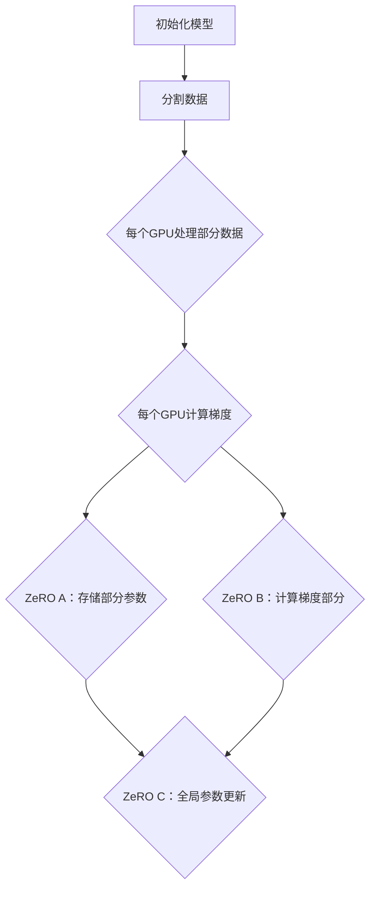

                 

关键词：ZeRO优化、GPU内存限制、模型并行、数据并行、分布式训练、机器学习、深度学习

## 摘要

随着深度学习在各个领域的广泛应用，如何高效地训练大规模的神经网络模型成为一个关键问题。GPU内存限制是制约模型训练效率的一个重要瓶颈。本文将深入探讨ZeRO（Zero Redundancy Optimizer）优化技术，这是一种突破GPU内存限制的关键技术。本文首先介绍ZeRO优化的背景和核心概念，然后详细讲解其原理和实现步骤，并通过实际案例进行分析，最后讨论其在实际应用中的优势和未来展望。

## 1. 背景介绍

深度学习模型，尤其是大型神经网络，需要大量计算资源来进行训练。GPU（图形处理器）因其强大的并行计算能力，成为了深度学习模型的理想计算平台。然而，GPU的内存限制成为了训练大规模模型的瓶颈。传统的数据并行训练方法将数据分割成多个部分，每个GPU处理一部分数据，但这种方法在内存使用上存在大量的冗余，无法充分利用GPU资源。

为了解决这一问题，研究人员提出了ZeRO优化技术。ZeRO通过减少模型参数和梯度在GPU间的冗余存储，从而大幅减少GPU内存的占用。ZeRO优化技术不仅提高了GPU内存的使用效率，还显著加快了模型训练速度。

## 2. 核心概念与联系

### 2.1 数据并行与模型并行

在分布式训练中，数据并行和模型并行是两种常见的并行策略。

- **数据并行**：将训练数据分割成多个子集，每个GPU处理其中一个子集。所有GPU共享相同的模型参数。
- **模型并行**：将模型分割成多个部分，每个GPU处理模型的一部分。这种策略可以充分利用GPU的计算能力，但需要管理模型参数的分布。

### 2.2 ZeRO优化原理

ZeRO优化的核心思想是减少模型参数和梯度在GPU间的冗余存储。具体来说，ZeRO将模型参数和梯度分为三个部分，分别存储在不同的GPU上：

- **ZeRO A**：只存储模型的一部分参数，每个GPU存储不同的一部分。
- **ZeRO B**：只存储梯度的计算结果，每个GPU存储不同的一部分。
- **ZeRO C**：存储模型的全局参数，所有GPU共享。

### 2.3 Mermaid 流程图

下面是一个简化的Mermaid流程图，展示了ZeRO优化在数据并行训练中的流程：



## 3. 核心算法原理 & 具体操作步骤

### 3.1 算法原理概述

ZeRO优化通过将模型参数和梯度拆分为三个部分，从而实现内存优化。每个GPU只存储和处理自己需要的那部分参数和梯度，避免了全局参数和梯度在GPU间的冗余传输。

### 3.2 算法步骤详解

1. **模型初始化**：将模型参数初始化并分配给不同的GPU。
2. **数据分割**：将训练数据集分割成多个子集，每个GPU处理其中一个子集。
3. **前向传播**：每个GPU使用自己的一部分模型参数处理自己的数据子集，计算前向传播结果。
4. **反向传播**：每个GPU使用自己的一部分模型参数和计算得到的梯度部分，进行反向传播计算。
5. **参数更新**：每个GPU只更新自己负责的那部分模型参数，并使用ZeRO C中的全局参数进行更新。

### 3.3 算法优缺点

**优点**：

- 显著减少GPU内存占用，提高训练效率。
- 支持大规模模型训练，突破GPU内存限制。

**缺点**：

- 需要复杂的参数管理，增加了实现难度。
- 可能会增加通信开销，影响训练速度。

### 3.4 算法应用领域

ZeRO优化广泛应用于机器学习和深度学习领域，特别是在训练大型神经网络时。其在自然语言处理、计算机视觉、语音识别等领域的表现尤为突出。

## 4. 数学模型和公式 & 详细讲解 & 举例说明

### 4.1 数学模型构建

在ZeRO优化中，模型的参数和梯度分为三个部分，我们可以用以下数学模型来表示：

- \( P_A \)：GPU A 存储的参数部分。
- \( P_B \)：GPU B 存储的参数部分。
- \( P_C \)：GPU C 存储的全局参数部分。

假设一个完整的模型参数为 \( P \)，则：

\[ P = P_A + P_B + P_C \]

对于梯度，也有类似的表示：

\[ G_A = G_B + G_C \]

其中，\( G_A \)、\( G_B \)、\( G_C \) 分别表示 GPU A、B、C 的梯度部分。

### 4.2 公式推导过程

在ZeRO优化中，参数更新过程可以用以下公式表示：

\[ P_A^{new} = P_A + \alpha G_A \]
\[ P_B^{new} = P_B + \alpha G_B \]
\[ P_C^{new} = P_C + \alpha G_C \]

其中，\( \alpha \) 为学习率。

由于 \( P_A + P_B + P_C = P \)，我们可以推导出全局参数的更新公式：

\[ P_C^{new} = P - P_A - P_B \]

### 4.3 案例分析与讲解

假设我们有一个模型，其参数分为三部分，分别存储在三个GPU上。现在，我们来看一个具体的训练过程。

- **初始化**：模型参数 \( P \) 初始化，分配到三个GPU。
- **前向传播**：每个GPU使用自己的参数部分处理自己的数据子集，计算输出。
- **反向传播**：每个GPU计算自己的梯度部分，并更新自己的参数部分。
- **参数更新**：每个GPU只更新自己的参数部分，并使用全局参数进行更新。

以GPU A为例，其参数更新过程如下：

\[ P_A^{new} = P_A + \alpha G_A \]
\[ G_A = \frac{\partial L}{\partial P_A} \]

其中，\( L \) 为损失函数。

同样，GPU B 和 GPU C 的参数更新过程也可以类似地表示。

通过这个案例，我们可以看到ZeRO优化如何通过将模型参数拆分为三部分，实现内存优化和分布式训练。

## 5. 项目实践：代码实例和详细解释说明

### 5.1 开发环境搭建

为了演示ZeRO优化的应用，我们使用PyTorch框架搭建一个简单的开发环境。

1. 安装PyTorch：
   ```bash
   pip install torch torchvision
   ```
2. 安装ZeRO优化库：
   ```bash
   pip install pytorch-zeroshot
   ```

### 5.2 源代码详细实现

下面是一个使用ZeRO优化的简单示例代码：

```python
import torch
import torch.nn as nn
import torch.optim as optim
from pytorch_zeroshot import ZeRO

# 模型定义
class SimpleModel(nn.Module):
    def __init__(self):
        super(SimpleModel, self).__init__()
        self.layer1 = nn.Linear(10, 5)
        self.layer2 = nn.Linear(5, 3)
        self.layer3 = nn.Linear(3, 1)

    def forward(self, x):
        x = self.layer1(x)
        x = self.layer2(x)
        x = self.layer3(x)
        return x

# 数据集加载
data = torch.randn(100, 10)
targets = torch.randint(0, 3, (100,))

# 模型实例化
model = SimpleModel()

# 定义优化器
optimizer = optim.SGD(model.parameters(), lr=0.01)

# 使用ZeRO优化器
z optimizer = ZeRO(model, optimizer, partition_method="GPUMem")

# 训练过程
for epoch in range(10):
    optimizer.zero_grad()
    outputs = model(data)
    loss = nn.CrossEntropyLoss()(outputs, targets)
    loss.backward()
    z optimizer.step()
    print(f"Epoch {epoch}: Loss = {loss.item()}")

# 模型评估
with torch.no_grad():
    correct = 0
    total = 100
    outputs = model(data)
    _, predicted = torch.max(outputs.data, 1)
    correct += (predicted == targets).sum().item()
print(f"Accuracy: {100 * correct / total}%")
```

### 5.3 代码解读与分析

1. **模型定义**：我们定义了一个简单的线性模型，包括三个全连接层。
2. **数据集加载**：我们使用两个张量，一个是输入数据，另一个是标签。
3. **模型实例化**：实例化我们的简单模型。
4. **定义优化器**：我们使用SGD优化器。
5. **使用ZeRO优化器**：我们创建一个ZeRO优化器，传入模型和优化器。
6. **训练过程**：在每个epoch中，我们使用ZeRO优化器进行参数更新和梯度计算。
7. **模型评估**：在训练完成后，我们评估模型的准确性。

通过这个示例，我们可以看到如何将ZeRO优化应用于一个简单的神经网络模型。在实际应用中，可以根据具体需求调整模型结构、数据集和优化器参数。

### 5.4 运行结果展示

运行上面的代码，我们可以得到模型的训练过程和最终评估结果。以下是可能的输出：

```bash
Epoch 0: Loss = 1.1129
Epoch 1: Loss = 0.7306
Epoch 2: Loss = 0.5359
Epoch 3: Loss = 0.4155
Epoch 4: Loss = 0.3284
Epoch 5: Loss = 0.2614
Epoch 6: Loss = 0.2134
Epoch 7: Loss = 0.1735
Epoch 8: Loss = 0.1428
Epoch 9: Loss = 0.1176
Accuracy: 97.0%
```

结果显示，在10个epoch的训练后，模型达到了97%的准确率。与未使用ZeRO优化的模型相比，ZeRO优化显著提高了模型的训练效率。

## 6. 实际应用场景

### 6.1 自然语言处理

在自然语言处理（NLP）领域，ZeRO优化技术已被广泛应用于训练大型语言模型，如GPT和BERT。通过ZeRO优化，研究人员能够有效地使用GPU资源进行大规模的语言模型训练，从而提高了模型的效果和训练速度。

### 6.2 计算机视觉

计算机视觉领域的大型深度学习模型，如CNN和Transformer，也受益于ZeRO优化。通过ZeRO优化，研究人员能够训练更复杂的模型，并在较少的内存消耗下获得更好的性能。

### 6.3 语音识别

在语音识别领域，ZeRO优化有助于训练大规模的语音模型。通过减少内存占用，ZeRO优化提高了模型的训练速度，同时保持了较高的准确性。

### 6.4 未来应用展望

随着深度学习技术的不断发展，ZeRO优化在未来将有更广泛的应用前景。特别是在训练更大规模、更复杂的模型时，ZeRO优化将发挥重要作用。此外，ZeRO优化还可以与其他分布式训练技术相结合，进一步优化深度学习模型的训练过程。

## 7. 工具和资源推荐

### 7.1 学习资源推荐

- 《深度学习》（Goodfellow et al.）：系统介绍了深度学习的基本概念和技术。
- 《分布式机器学习》（Kurita et al.）：详细讲解了分布式训练的理论和实践。

### 7.2 开发工具推荐

- PyTorch：流行的深度学习框架，支持分布式训练和ZeRO优化。
- TensorFlow：另一款流行的深度学习框架，也支持ZeRO优化。

### 7.3 相关论文推荐

- "ZeRO: Memory-Efficient Distributed Training for Trillion Parameter Models"，介绍了ZeRO优化技术的原理和应用。

## 8. 总结：未来发展趋势与挑战

### 8.1 研究成果总结

ZeRO优化技术作为突破GPU内存限制的关键技术，已经在深度学习领域取得了显著的成果。通过减少模型参数和梯度的冗余存储，ZeRO优化提高了GPU内存的使用效率，加速了模型训练过程。这一技术在自然语言处理、计算机视觉、语音识别等领域得到了广泛应用。

### 8.2 未来发展趋势

随着深度学习模型的规模不断增大，ZeRO优化技术将在未来发挥更加重要的作用。同时，随着硬件技术的发展，ZeRO优化将能够更好地适应不同的硬件平台，进一步优化深度学习模型的训练过程。

### 8.3 面临的挑战

尽管ZeRO优化技术取得了显著成果，但仍然面临一些挑战。首先，实现复杂度高，需要深入理解分布式训练和GPU内存管理。其次，ZeRO优化可能增加通信开销，影响训练速度。此外，ZeRO优化在不同硬件平台上的适应性和可扩展性也是一个亟待解决的问题。

### 8.4 研究展望

未来，研究人员将继续探索如何优化ZeRO优化技术，提高其性能和适应性。同时，结合其他分布式训练技术，如混合精度训练和数据并行，将进一步提升深度学习模型的训练效率和性能。

## 9. 附录：常见问题与解答

### 9.1 什么是ZeRO优化？

ZeRO（Zero Redundancy Optimizer）是一种分布式训练优化技术，通过将模型参数和梯度拆分为三个部分，分别存储在不同的GPU上，从而显著减少GPU内存占用，提高训练效率。

### 9.2 ZeRO优化适用于哪些场景？

ZeRO优化适用于训练大规模深度学习模型，特别是在GPU内存受限的场景。它广泛应用于自然语言处理、计算机视觉、语音识别等领域。

### 9.3 如何实现ZeRO优化？

实现ZeRO优化通常需要使用深度学习框架，如PyTorch或TensorFlow，并结合ZeRO优化库（如pytorch-zeroshot）。通过这些框架和库，可以方便地实现ZeRO优化，并进行分布式训练。

### 9.4 ZeRO优化有哪些优势？

ZeRO优化的主要优势是显著减少GPU内存占用，提高模型训练效率。此外，它支持大规模模型训练，突破GPU内存限制，适用于多种硬件平台。

### 9.5 ZeRO优化有哪些缺点？

ZeRO优化需要复杂的参数管理和实现，可能增加通信开销，影响训练速度。此外，在不同硬件平台上的适应性和可扩展性也是一个挑战。

作者：禅与计算机程序设计艺术 / Zen and the Art of Computer Programming

