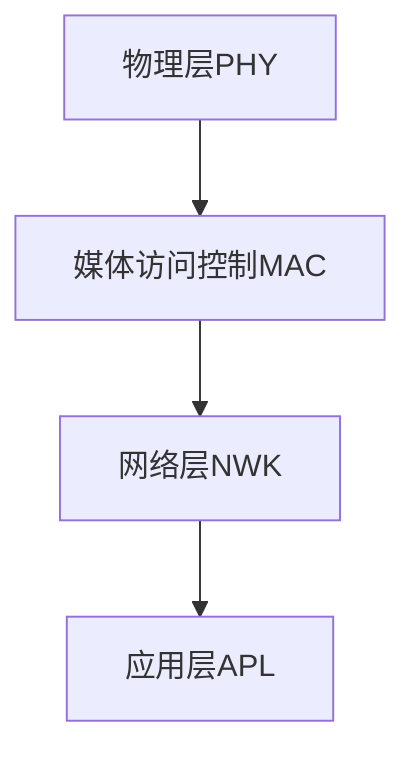
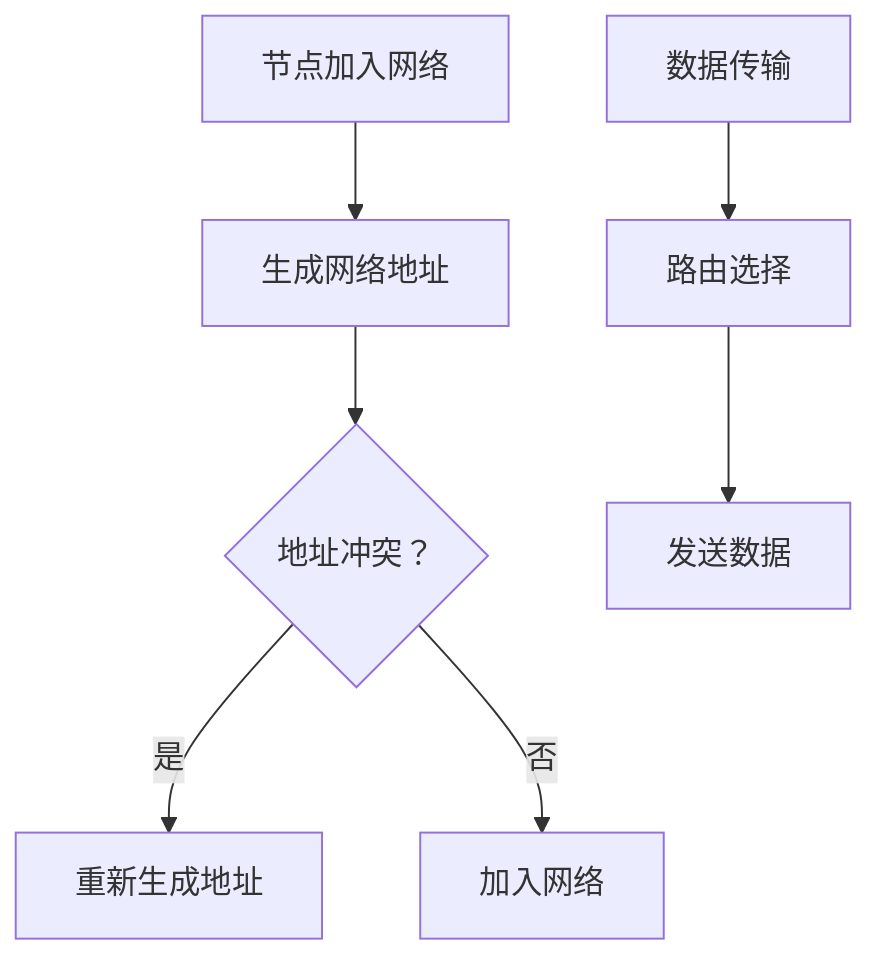

                 

关键词：Zigbee协议，无线通信，物联网，低功耗，网络拓扑，网络安全，算法原理，数学模型，应用实例，开发工具，未来展望。

## 摘要

Zigbee协议是一种专为物联网（IoT）设计的低功耗无线通信标准。它利用网状网络拓扑，提供了高可靠性和低延迟的通信环境，广泛应用于智能家居、智能城市、工业自动化等领域。本文将从Zigbee协议的核心概念、算法原理、数学模型、应用实例等方面进行全面剖析，探讨其在物联网时代的巨大潜力和面临的挑战。

## 1. 背景介绍

### Zigbee协议的发展历程

Zigbee协议起源于1998年，由Zigbee联盟（Zigbee Alliance）提出并制定。Zigbee联盟是一个由全球众多知名企业和研究机构组成的国际性组织，致力于推动低功耗无线通信技术的发展。自推出以来，Zigbee协议历经多个版本更新，不断完善和优化其性能和功能。

### Zigbee协议的应用场景

Zigbee协议具有低功耗、低成本、高可靠性等特点，主要应用于以下场景：

- 智能家居：包括照明控制、窗帘控制、空调控制、安防监控等。
- 智能城市：包括智慧交通、环境监测、智能照明、智慧医疗等。
- 工业自动化：包括设备监控、数据采集、远程控制等。
- 农业自动化：包括土壤湿度监测、作物生长监测等。

## 2. 核心概念与联系

### Zigbee协议的核心概念

Zigbee协议的核心概念包括：

- 节点（Node）：包括协调器（Coordinator）、路由器（Router）和终端设备（End Device）。
- 网络拓扑（Network Topology）：包括星形拓扑、网状拓扑和混合拓扑。
- 层次结构（Layered Architecture）：包括物理层（PHY）、媒体访问控制（MAC）、网络层（NWK）和应用层（APL）。

### Zigbee协议的架构

Zigbee协议的架构采用层次结构，各层之间相互独立，易于扩展和维护。以下是Zigbee协议的架构图：



### Mermaid流程图（Mermaid Flowchart）

以下是一个简化的Zigbee协议的流程图，展示了节点加入网络、数据传输和路由选择等过程：



## 3. 核心算法原理 & 具体操作步骤

### 3.1 算法原理概述

Zigbee协议的核心算法包括网络构建、数据传输和路由选择等。以下是各算法原理的简要介绍：

- 网络构建：采用树形网络和网状网络相结合的拓扑结构，实现高可靠性和灵活扩展。
- 数据传输：采用CSMA/CA（载波侦听多址接入/碰撞检测）机制，确保数据传输的可靠性和高效性。
- 路由选择：采用基于能量消耗和传输距离的动态路由算法，优化数据传输路径。

### 3.2 算法步骤详解

#### 3.2.1 网络构建

1. 协调器初始化网络。
2. 路由器加入网络，成为协调器的子节点。
3. 终端设备加入网络，成为路由器的子节点。

#### 3.2.2 数据传输

1. 数据发送方通过MAC层将数据封装成帧。
2. 发送方通过CSMA/CA机制检测信道空闲后发送数据。
3. 接收方收到数据后，通过MAC层进行数据校验，确保数据完整。

#### 3.2.3 路由选择

1. 数据发送方根据目的地址和路由表选择最佳传输路径。
2. 数据在传输过程中，每个节点根据能量消耗和传输距离更新路由表。
3. 当路由表发生变化时，节点通过广播通知其他节点更新路由信息。

### 3.3 算法优缺点

#### 优点

- 低功耗：采用节能机制，延长设备寿命。
- 高可靠性：采用网状网络拓扑，提高网络健壮性。
- 灵活扩展：支持多种网络拓扑和节点类型，易于扩展。

#### 缺点

- 数据传输速率较低：最高传输速率为250kbps。
- 覆盖范围有限：通常只能覆盖几十米到几百米。
- 安全性：虽然Zigbee协议具有一定的安全性，但在实际应用中仍存在安全隐患。

### 3.4 算法应用领域

Zigbee协议广泛应用于智能家居、智能城市、工业自动化等领域，以下是一些具体应用案例：

- 智能家居：智能照明、智能门锁、智能安防等。
- 智能城市：智能交通、智能照明、环境监测等。
- 工业自动化：设备监控、数据采集、远程控制等。

## 4. 数学模型和公式

### 4.1 数学模型构建

Zigbee协议的数学模型主要包括：

- 信道利用率：表示信道被有效利用的程度。
- 能量消耗：表示节点在通信过程中消耗的能量。
- 路由表更新：表示节点根据能量消耗和传输距离更新路由表的过程。

### 4.2 公式推导过程

假设一个节点在通信过程中，发送数据量为\( D \)，信道利用率为\( \alpha \)，则信道空闲时间为\( \frac{1}{\alpha} \)。

节点在通信过程中的能量消耗为：

\[ E_c = D \cdot \frac{1}{\alpha} \]

路由表更新的过程可以表示为：

\[ \text{路由表更新} = f(\text{能量消耗}, \text{传输距离}) \]

其中，\( f \) 为路由表更新函数。

### 4.3 案例分析与讲解

假设一个节点在通信过程中，发送数据量为1KB，信道利用率为0.5，则信道空闲时间为2秒。

节点在通信过程中的能量消耗为：

\[ E_c = 1KB \cdot \frac{1}{0.5} = 2KB \]

假设节点1到节点2的传输距离为10米，节点2到节点3的传输距离为20米，节点3到节点4的传输距离为30米。

根据能量消耗和传输距离，可以更新路由表：

\[ \text{路由表更新} = f(E_c, \text{传输距离}) \]

例如，可以采用以下更新策略：

- 当能量消耗大于10KB时，更新路由表，选择能量消耗最小的传输路径。
- 当传输距离大于10米时，更新路由表，选择传输距离最小的传输路径。

## 5. 项目实践：代码实例和详细解释说明

### 5.1 开发环境搭建

- 操作系统：Windows 10
- 开发环境：Python 3.8
- Zigbee开发板：XBee
- 通信协议：Zigbee协议

### 5.2 源代码详细实现

以下是一个简单的Zigbee通信示例，包括节点加入网络、数据发送和接收等过程。

```python
import serial
import time

# 设置串口参数
ser = serial.Serial('COM3', 9600)

# 节点加入网络
ser.write(b'\x01\x10')  # 协议类型：加入网络
time.sleep(2)
ser.write(b'\x01\x11')  # 协议类型：加入网络响应

# 数据发送
data = b'Hello, Zigbee!'
ser.write(b'\x01\x20')  # 协议类型：数据发送
ser.write(data)

# 数据接收
time.sleep(2)
received_data = ser.read(1024)
print("Received data:", received_data.decode())

# 关闭串口
ser.close()
```

### 5.3 代码解读与分析

该示例通过串口与Zigbee开发板进行通信，实现节点加入网络、数据发送和接收等过程。

1. 设置串口参数，连接Zigbee开发板。
2. 节点加入网络：发送加入网络命令，等待加入网络响应。
3. 数据发送：发送数据前，发送数据发送命令；发送数据。
4. 数据接收：等待接收数据，打印接收到的数据。
5. 关闭串口。

## 6. 实际应用场景

Zigbee协议在实际应用中具有广泛的应用场景，以下列举几个典型案例：

1. **智能家居**：通过Zigbee协议，实现家庭设备的无线互联，如智能照明、智能门锁、智能安防等。
2. **智能城市**：通过Zigbee协议，实现城市设备的无线监控，如智能交通、智能照明、环境监测等。
3. **工业自动化**：通过Zigbee协议，实现设备的无线监控和远程控制，提高生产效率和安全性。

## 7. 工具和资源推荐

### 7.1 学习资源推荐

1. 《Zigbee协议设计与实现》
2. 《物联网技术与应用》
3. Zigbee联盟官方网站：[Zigbee Alliance](https://www.zigbee.org/)

### 7.2 开发工具推荐

1. Python：适用于快速开发，具有丰富的库和框架。
2. Eclipse：适用于Java开发，支持Zigbee协议开发插件。
3. Arduino：适用于硬件开发，支持Zigbee模块。

### 7.3 相关论文推荐

1. “Zigbee协议在智能家居中的应用研究”
2. “Zigbee协议在智能交通系统中的应用”
3. “Zigbee协议在工业自动化中的应用”

## 8. 总结：未来发展趋势与挑战

### 8.1 研究成果总结

Zigbee协议作为一种低功耗无线通信标准，在物联网领域取得了显著成果。其具有低功耗、高可靠性、灵活扩展等特点，广泛应用于智能家居、智能城市、工业自动化等领域。

### 8.2 未来发展趋势

1. **性能提升**：未来Zigbee协议将在数据传输速率、覆盖范围等方面进行优化，提高性能。
2. **安全性增强**：随着物联网安全问题的日益突出，Zigbee协议将在安全性方面进行加强。
3. **应用拓展**：Zigbee协议将在更多领域得到应用，如智慧医疗、智慧农业等。

### 8.3 面临的挑战

1. **功耗和性能的平衡**：如何在降低功耗和提高性能之间找到平衡点，是一个重要挑战。
2. **安全性的保障**：如何确保数据传输的安全性，防止网络攻击和隐私泄露。
3. **标准化和互操作性的提升**：如何推动Zigbee协议的标准化，实现不同厂商设备之间的互操作性。

### 8.4 研究展望

未来，Zigbee协议将继续在物联网领域发挥重要作用。研究者应关注功耗和性能的优化、安全性保障、应用拓展等方面，推动Zigbee协议的发展和应用。

## 9. 附录：常见问题与解答

### 9.1 Zigbee协议与WiFi的区别是什么？

Zigbee协议与WiFi协议的主要区别在于：

- **功耗**：Zigbee协议的功耗较低，适用于低功耗设备；WiFi协议的功耗较高，适用于较高功耗的设备。
- **覆盖范围**：Zigbee协议的覆盖范围较小，一般只能覆盖几十米到几百米；WiFi协议的覆盖范围较大，可以达到几百米到几公里。
- **传输速率**：Zigbee协议的传输速率较低，最高可达250kbps；WiFi协议的传输速率较高，可达数百Mbps。

### 9.2 Zigbee协议的安全性问题如何解决？

Zigbee协议在安全性方面采取以下措施：

- **加密通信**：采用AES加密算法对数据进行加密，确保数据在传输过程中的安全性。
- **认证机制**：采用基于证书的认证机制，确保节点身份的合法性。
- **网络隔离**：通过设置不同的网络标识（PAN ID），实现不同网络的隔离，防止网络攻击。

## 作者署名

作者：禅与计算机程序设计艺术 / Zen and the Art of Computer Programming
----------------------------------------------------------------

注意：本文内容仅供参考，具体实施时请结合实际需求和场景进行调整。由于篇幅限制，本文未对某些细节进行深入探讨，读者如有兴趣，可以查阅相关文献进行深入学习。

