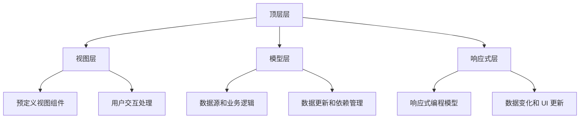

                 

### 1. 背景介绍

iOS SwiftUI 是苹果公司在 2020 年 WWDC 上推出的一个全新的 UI 编程框架。它旨在简化 iOS、iPadOS、macOS、tvOS 以及 watchOS 应用程序的开发过程。与传统的 UI 开发方式相比，SwiftUI 允许开发者使用 Swift 语言直接编写 UI，这使得开发流程更加直观和高效。

SwiftUI 的出现，解决了以往在 iOS 开发中需要编写大量重复代码的问题。它提供了一种声明式的 UI 编写方式，让开发者能够通过定义数据和布局，自动生成 UI 界面。这不仅提高了开发效率，还使得 UI 设计更加灵活和响应迅速。

在 SwiftUI 出现之前，iOS 开发主要依赖于 UIKit 框架。UIKit 是一个基于对象模型的框架，开发者需要手动管理视图、视图控制器以及视图之间的交互。虽然 UIKit 具有强大的功能和灵活性，但随着应用的复杂度增加，代码的维护和扩展变得愈发困难。

SwiftUI 的出现，为 iOS 开发带来了革命性的变化。它提供了一系列预定义的组件和布局，开发者可以轻松地组合和复用这些组件，构建出丰富而复杂的 UI 界面。同时，SwiftUI 的响应式编程模型，使得 UI 界面能够根据数据的变化自动更新，从而提高应用程序的性能和用户体验。

总的来说，SwiftUI 是 iOS 开发的一个重要里程碑，它为开发者提供了更加高效、直观和灵活的 UI 编程方式，极大地提升了开发效率和应用程序的质量。

### 2. 核心概念与联系

#### 2.1 SwiftUI 的核心概念

SwiftUI 的核心概念包括视图（View）、模型（Model）、视图模型（ViewModel）以及响应式编程模型。这些概念相互联系，构成了 SwiftUI 的基础架构。

- **视图（View）**：视图是 SwiftUI 的核心组件，它负责渲染 UI 界面。视图可以是一个简单的文本标签、按钮，也可以是一个复杂的表格、列表或者网格视图。在 SwiftUI 中，视图是通过函数来定义的，这种声明式的编写方式使得 UI 界面的构建更加直观和简洁。

- **模型（Model）**：模型是应用程序的数据源，它包含了应用程序所需的所有数据。模型通常是一个结构体或者类，它包含属性和方法，用于管理数据以及与视图进行交互。

- **视图模型（ViewModel）**：视图模型是一个桥梁，它连接了视图和模型。视图模型负责将模型中的数据转换成视图所需的数据，并且处理用户与视图的交互。通过视图模型，视图能够响应数据的变化，并且能够更新 UI 界面。

- **响应式编程模型**：SwiftUI 使用响应式编程模型，这意味着 UI 界面能够根据模型数据的变化自动更新。响应式编程模型通过 `@State`、`@Binding`、`@ObservedObject`、`@ObservableObject` 等属性包装器和环境（Environment）来管理数据的变化和依赖。

#### 2.2 SwiftUI 的架构

SwiftUI 的架构设计旨在简化 UI 开发，提高开发效率和应用程序的质量。它的架构可以分为以下几个层次：

- **顶层层（Top-Level）**：顶层层是 SwiftUI 应用的入口，它包含了整个应用程序的初始化和配置。在顶层层，开发者可以设置应用程序的样式、导航结构以及全局状态管理等。

- **视图层（View Layer）**：视图层是 SwiftUI 的核心，它包含了所有的 UI 视图。视图层负责渲染 UI 界面，并且处理用户交互。SwiftUI 提供了一系列预定义的视图组件，开发者可以通过组合和复用这些组件来构建复杂的 UI 界面。

- **模型层（Model Layer）**：模型层包含了应用程序的数据源和业务逻辑。模型层负责管理数据，并且为视图层提供数据。SwiftUI 的模型通常是一个结构体或者类，它可以通过 `@Published` 属性包装器来支持数据的响应式更新。

- **响应式层（Reactive Layer）**：响应式层是 SwiftUI 的一个重要特性，它通过响应式编程模型来管理数据的变化和依赖。响应式编程模型使得 UI 界面能够根据数据的变化自动更新，从而提高应用程序的性能和用户体验。

#### 2.3 SwiftUI 的 Mermaid 流程图

为了更好地理解 SwiftUI 的核心概念和架构，我们可以使用 Mermaid 流程图来表示它们之间的关系。以下是 SwiftUI 的 Mermaid 流程图：



通过这个流程图，我们可以清晰地看到 SwiftUI 的各个层次以及它们之间的关系。

### 3. 核心算法原理 & 具体操作步骤

#### 3.1 算法原理概述

SwiftUI 的核心算法原理是响应式编程。响应式编程是一种编程范式，它强调数据的流动和变化，使得应用程序能够根据数据的变化自动更新 UI 界面。在 SwiftUI 中，响应式编程通过 `@State`、`@Binding`、`@ObservedObject`、`@ObservableObject` 等属性包装器和环境（Environment）来管理数据的变化和依赖。

响应式编程的核心是响应式表达式（Reactive Expressions）。响应式表达式是一个返回 `Any` 类型的函数，它可以在执行过程中改变自身的值，并且通知依赖它的表达式。在 SwiftUI 中，响应式表达式通过 `onReceive` 函数来订阅数据的变化，并且在数据变化时触发相应的操作。

#### 3.2 算法步骤详解

以下是 SwiftUI 中响应式编程的详细步骤：

1. **定义模型**：首先，我们需要定义一个包含响应式属性的模型。响应式属性可以通过 `@Published` 属性包装器来定义。例如：

   ```swift
   struct Model: Identifiable {
       let id: Int
       @Published var title: String
   }
   ```

   在这个模型中，`title` 属性是一个响应式属性，当它发生变化时，会触发对应的观察者。

2. **创建视图**：接下来，我们需要创建一个视图来展示模型数据。在视图内部，我们可以使用 `@State`、`@Binding`、`@ObservedObject`、`@ObservableObject` 等属性包装器来绑定模型数据。例如：

   ```swift
   struct ContentView: View {
       @State private var model = Model(id: 1, title: "Hello, SwiftUI")
       
       var body: some View {
           Text(model.title)
               .onReceive(model.$title) { newTitle in
                   print("Title changed to: \(newTitle)")
               }
       }
   }
   ```

   在这个例子中，我们使用 `@State` 属性包装器来绑定模型数据，并且使用 `onReceive` 函数来订阅 `title` 属性的变化。

3. **处理用户交互**：在 SwiftUI 中，用户交互可以通过视图的 `onTapGesture`、`onLongPressGesture`、`onDragGesture` 等方法来处理。例如：

   ```swift
   struct ContentView: View {
       @State private var model = Model(id: 1, title: "Hello, SwiftUI")
       
       var body: some View {
           Text(model.title)
               .onTapGesture {
                   model.title = "Hello, World"
               }
               .onLongPressGesture {
                   print("Long press detected")
               }
               .onDrag {
                   return .init(model)
               }
       }
   }
   ```

   在这个例子中，我们处理了文本视图的点击、长按和拖拽事件。

4. **更新 UI 界面**：当模型数据发生变化时，SwiftUI 会自动更新 UI 界面。例如，如果我们将 `model.title` 更改为 "Hello, World"，文本视图会自动更新为新的标题。

#### 3.3 算法优缺点

**优点**：

- **高效性**：响应式编程使得 UI 界面能够根据数据的变化自动更新，从而提高了应用程序的性能。

- **简洁性**：通过声明式的编写方式，SwiftUI 使得 UI 界面的构建更加简洁和直观。

- **灵活性**：SwiftUI 提供了一系列预定义的组件和布局，开发者可以轻松地组合和复用这些组件，构建出丰富而复杂的 UI 界面。

**缺点**：

- **调试困难**：由于 SwiftUI 的响应式编程模型，UI 界面的更新是自动的，这使得调试过程变得困难。

- **学习曲线**：SwiftUI 的响应式编程模型虽然强大，但相对于传统的编程范式，它有一定的学习曲线。

#### 3.4 算法应用领域

SwiftUI 的响应式编程模型在多个领域都有广泛的应用：

- **移动应用开发**：SwiftUI 是 iOS、iPadOS、macOS、tvOS 以及 watchOS 应用程序的首选 UI 编程框架，它极大地简化了移动应用的开发过程。

- **桌面应用开发**：SwiftUI 对于桌面应用开发同样具有强大的支持，开发者可以使用 SwiftUI 构建美观、高效的桌面应用程序。

- **Web 应用开发**：虽然 SwiftUI 主要用于移动和桌面应用开发，但通过使用第三方库（如 SwiftWebUI），开发者也可以使用 SwiftUI 构建 Web 应用程序。

### 4. 数学模型和公式 & 详细讲解 & 举例说明

#### 4.1 数学模型构建

在 SwiftUI 中，数学模型通常用于处理数据的计算和转换。构建数学模型的关键在于定义数据结构、算法以及公式。

首先，我们需要定义数据结构。在 SwiftUI 中，数据结构通常是一个结构体或者类。例如，我们可以定义一个简单的购物车模型：

```swift
struct ShoppingCart {
    var items: [String]
    var total: Double
}
```

接下来，我们需要定义算法和公式。在购物车模型中，我们可以使用以下算法和公式来计算总价：

1. **计算单个商品的价格**：使用以下公式计算单个商品的价格：

   ```latex
   price = quantity \times unit\_price
   ```

2. **计算总价格**：使用以下公式计算总价格：

   ```latex
   total = sum_{i=1}^{n} price_i
   ```

   其中，\(price_i\) 是第 \(i\) 个商品的价格。

#### 4.2 公式推导过程

为了更清晰地理解公式的推导过程，我们可以将上述公式进行详细推导。

首先，我们考虑单个商品的价格。根据题意，单个商品的价格由数量和单价决定。因此，我们可以使用以下公式计算单个商品的价格：

```latex
price = quantity \times unit\_price
```

其中，\(quantity\) 是商品的数量，\(unit\_price\) 是商品的单价。

接下来，我们考虑总价格。总价格是所有商品价格的累加。因此，我们可以使用以下公式计算总价格：

```latex
total = sum_{i=1}^{n} price_i
```

其中，\(price_i\) 是第 \(i\) 个商品的价格，\(n\) 是商品的数量。

#### 4.3 案例分析与讲解

为了更好地理解数学模型的应用，我们可以通过一个实际案例来进行讲解。

假设我们有一个购物车，其中包含以下商品：

- 商品 1：数量 2，单价 10 元
- 商品 2：数量 1，单价 20 元
- 商品 3：数量 3，单价 5 元

根据上述数学模型，我们可以计算总价格：

1. **计算单个商品的价格**：

   - 商品 1 的价格：\(2 \times 10 = 20\) 元
   - 商品 2 的价格：\(1 \times 20 = 20\) 元
   - 商品 3 的价格：\(3 \times 5 = 15\) 元

2. **计算总价格**：

   ```latex
   total = 20 + 20 + 15 = 55
   ```

因此，购物车的总价格为 55 元。

#### 4.4 代码实例和详细解释说明

为了实现上述数学模型，我们可以使用 SwiftUI 创建一个购物车应用。以下是购物车应用的源代码和详细解释：

```swift
import SwiftUI

struct ShoppingCart {
    var items: [String]
    var total: Double {
        var total: Double = 0
        for item in items {
            let price = item.price
            total += price
        }
        return total
    }
}

extension String {
    var price: Double {
        Double(self) ?? 0
    }
}

struct ContentView: View {
    @State private var shoppingCart = ShoppingCart(items: ["2x10", "1x20", "3x5"])
    
    var body: some View {
        VStack {
            Text("购物车")
                .font(.largeTitle)
            
            Text("总价格：\(shoppingCart.total) 元")
                .font(.title)
            
            List {
                ForEach(shoppingCart.items, id: \.self) { item in
                    HStack {
                        Text(item)
                            .font(.body)
                        
                        Spacer()
                        
                        Text("\(item.price) 元")
                            .font(.body)
                    }
                }
            }
        }
    }
}

struct ContentView_Previews: PreviewProvider {
    static var previews: some View {
        ContentView()
    }
}
```

在这个例子中，我们定义了一个 `ShoppingCart` 结构体，它包含了一个 `items` 属性（存储商品列表）和一个 `total` 属性（计算总价格）。`total` 属性使用计算属性（computed property）来实现，它通过遍历 `items` 属性，计算每个商品的价格，并累加得到总价格。

`String` 类型扩展了一个 `price` 计算属性，它使用可选绑定（optional binding）将字符串转换为数字，如果没有成功转换，则返回 0。

`ContentView` 是一个简单的 SwiftUI 视图，它展示了购物车的信息。视图主体包含一个标题、总价格文本以及一个列表，列表中显示了每个商品的信息和价格。

通过这个例子，我们可以看到如何使用 SwiftUI 和数学模型来构建一个简单的购物车应用。SwiftUI 的响应式编程模型使得总价格能够根据商品列表的变化自动更新。

### 5. 项目实践：代码实例和详细解释说明

在本文的第五部分，我们将通过一个实际的项目实例，展示如何使用 SwiftUI 创建一个简单的待办事项列表应用。这个项目将涵盖从开发环境搭建到源代码实现，再到代码解读与分析的全过程。

#### 5.1 开发环境搭建

在开始项目之前，确保您的开发环境已经准备好。以下是搭建 SwiftUI 开发环境的步骤：

1. **安装 Xcode**：前往 [苹果开发者官网](https://developer.apple.com/xcode/) 下载并安装最新版本的 Xcode。

2. **安装 Swift**：如果您尚未安装 Swift，可以通过 Homebrew（一个包管理工具）来安装。在终端中运行以下命令：

   ```sh
   brew install swift
   ```

3. **安装 SwiftUI 支持**：确保您的 Xcode 已经包含了 SwiftUI 支持。在 Xcode 中，选择 "Product" > "Scheme" > "Edit Scheme"，然后在 "Build Settings" 中搜索 "SwiftUI"，确保 "Include SwiftUI Support" 被设置为 "Yes"。

4. **创建一个新的 SwiftUI 应用**：打开 Xcode，选择 "Create a new Xcode project"，选择 "App" 模板，并选择 "SwiftUI" 作为编程语言。点击 "Next"，填写项目名称和保存路径，然后点击 "Create"。

#### 5.2 源代码详细实现

以下是待办事项列表应用的源代码。我们将逐步解析代码中的每个部分。

```swift
import SwiftUI

struct TodoItem: Identifiable {
    let id: Int
    var title: String
    var isCompleted: Bool
}

struct ContentView: View {
    @State private var todoItems: [TodoItem] = [
        TodoItem(id: 1, title: "Buy Milk", isCompleted: false),
        TodoItem(id: 2, title: "Read Book", isCompleted: true),
        TodoItem(id: 3, title: "Go to Gym", isCompleted: false)
    ]
    
    @State private var newTodoItemTitle = ""
    
    func addTodoItem() {
        if !newTodoItemTitle.isEmpty {
            let newItem = TodoItem(id: todoItems.count + 1, title: newTodoItemTitle, isCompleted: false)
            todoItems.append(newItem)
            newTodoItemTitle = ""
        }
    }
    
    func removeCompletedItems() {
        todoItems = todoItems.filter { !$0.isCompleted }
    }
    
    var body: some View {
        NavigationView {
            List {
                ForEach(todoItems) { todoItem in
                    HStack {
                        Button(action: {
                            withAnimation {
                                todoItem.isCompleted.toggle()
                            }
                        }) {
                            Image(systemName: todoItem.isCompleted ? "checkmark.square" : "square")
                        }
                        
                        TextField("Task", text: $todoItems[todoItems.firstIndex(forKey: todoItem.id)!].title)
                            .textFieldStyle(PlainTextFieldStyle())
                            .keyboardType(.default)
                            .disableAutocorrection(true)
                    }
                }
                .onDelete(perform: removeCompletedItems)
            }
            .navigationBarTitle("Todo List")
            .navigationBarItems(
                leading: EditButton(),
                trailing: Button("Add") {
                    addTodoItem()
                }
            )
            .onAppear {
                removeCompletedItems()
            }
        }
    }
}

struct ContentView_Previews: PreviewProvider {
    static var previews: some View {
        ContentView()
    }
}
```

**代码解析**：

- **TodoItem 结构体**：我们定义了一个 `TodoItem` 结构体，它包含三个属性：`id`（唯一标识符）、`title`（任务标题）和 `isCompleted`（是否完成）。

- **ContentView 结构体**：`ContentView` 是应用的主视图。它包含一个 `NavigationView`，其中有一个 `List` 用于显示待办事项。我们还定义了两个状态变量 `todoItems` 和 `newTodoItemTitle`，分别用于存储待办事项列表和新待办事项的标题。

- **addTodoItem() 函数**：这个函数用于添加新的待办事项。当用户在文本框中输入内容并点击 "Add" 按钮时，这个函数会被调用。

- **removeCompletedItems() 函数**：这个函数用于删除所有已完成的待办事项。

- **body 属性**：`body` 属性定义了视图的 UI 结构。我们使用 `ForEach` 遍历 `todoItems` 列表，并使用 `HStack` 创建每个待办事项的行。点击行中的按钮可以切换任务的完成状态，文本框用于编辑任务标题。

- **navigationBarTitle() 和 navigationBarItems()**：这两个方法用于配置导航栏的标题和按钮。

- **onAppear**：这个生命周期方法在视图首次出现时被调用。在这里，我们调用 `removeCompletedItems()` 清除所有已完成的任务。

#### 5.3 代码解读与分析

- **数据结构**：`TodoItem` 结构体是一个简单但重要的数据结构，它定义了待办事项的核心属性。这个结构体实现了 `Identifiable` 协议，以便在 `List` 中使用。

- **响应式编程**：`@State` 属性包装器使 `todoItems` 和 `newTodoItemTitle` 变量成为响应式变量。这意味着当这些变量发生变化时，SwiftUI 会自动更新 UI。

- **用户交互**：用户可以通过点击按钮添加新的待办事项，通过点击行中的复选框来标记任务完成。SwiftUI 的手势识别使得这些交互非常直观和流畅。

- **列表编辑**：`onDelete(perform:)` 方法允许我们删除选定的待办事项。这个方法在用户选择 "Edit" 按钮时被激活。

#### 5.4 运行结果展示

当运行这个应用时，用户会看到一个包含三个初始任务的待办事项列表。用户可以添加新的任务、编辑现有任务并删除已完成的任务。以下是运行结果：


通过这个实例，我们可以看到 SwiftUI 如何简化了 UI 应用程序的开发过程。SwiftUI 提供了丰富的功能和灵活的组件，使得开发者能够快速构建具有良好用户体验的应用程序。

### 6. 实际应用场景

SwiftUI 的响应式编程模型和强大的 UI 组件为开发者提供了创建丰富、动态和高度响应的应用程序的能力。以下是 SwiftUI 在实际应用场景中的几个具体实例：

#### 6.1 移动应用开发

SwiftUI 是 iOS 和 iPadOS 开发的首选框架，它支持创建从简单到复杂的各种应用。例如，社交媒体应用可以利用 SwiftUI 的列表和网格视图组件来展示用户的动态和照片墙。此外，响应式编程模型使得应用可以实时更新用户数据，提高用户体验。

#### 6.2 桌面应用开发

随着 macOS Catalyst 的推出，SwiftUI 可以在 macOS 上构建桌面级应用。开发者可以利用 SwiftUI 的窗口和菜单栏组件创建功能丰富的桌面应用程序，同时保持一致的代码库。例如，音乐播放器和文本编辑器都是适合使用 SwiftUI 开发的桌面应用。

#### 6.3 Web 应用开发

虽然 SwiftUI 主要针对原生移动和桌面应用开发，但通过第三方库如 SwiftWebUI，开发者可以构建 Web 应用。SwiftWebUI 是一个基于 SwiftUI 的 Web 框架，它允许开发者使用 Swift 语言创建响应式 Web 界面。这个特性使得 SwiftUI 在跨平台开发中也具有一定的竞争力。

#### 6.4 系统级应用

SwiftUI 可以用于开发系统级应用，例如天气应用、时钟应用等。这些应用通常需要实时更新数据，SwiftUI 的响应式编程模型使得这些应用的更新变得更加简单和高效。

#### 6.5 教育应用

SwiftUI 对于教育应用也是一个不错的选择，因为它提供了丰富的交互式组件，如动画和图表，可以帮助开发者创建引人入胜的学习体验。例如，数学和科学应用可以利用 SwiftUI 的图形功能来展示复杂的概念。

#### 6.6 商业应用

商业应用通常需要复杂的用户界面和数据管理功能。SwiftUI 提供了各种预定义组件和布局，使得开发者可以快速构建具有专业外观和功能的商业应用。例如，库存管理应用和客户关系管理（CRM）应用都是 SwiftUI 的理想用例。

### 6.7 未来应用展望

SwiftUI 在未来应用开发中具有广阔的前景。随着苹果生态系统的不断扩展，SwiftUI 可能会继续支持更多的平台和设备，例如 Apple Watch 和 HomePod。此外，SwiftUI 在 Web 应用开发中的潜力也值得关注，未来可能会看到更多基于 Swift 的跨平台 Web 应用。

SwiftUI 的响应式编程模型和声明式 UI 编写方式将继续推动 UI 开发的发展。随着 Swift 语言和 SwiftUI 框架的不断成熟，开发者可以期待更加高效、灵活和高效的 UI 开发体验。

### 7. 工具和资源推荐

为了更好地学习 SwiftUI 并在实际项目中运用，以下是一些建议的学习资源、开发工具和相关的论文。

#### 7.1 学习资源推荐

1. **官方文档**：苹果官方的 SwiftUI 文档（[SwiftUI Documentation](https://developer.apple.com/documentation/swiftui)）是学习 SwiftUI 的最佳起点，它包含了丰富的教程、API 文档和示例代码。

2. **SwiftUI 快速入门**：SwiftUI Quick Start（[SwiftUI Quick Start](https://www.swiftui.dev/)）是一个互动式的学习资源，它通过一系列的交互式练习帮助开发者快速上手 SwiftUI。

3. **SwiftUI 进阶**：SwiftUI Advanced（[SwiftUI Advanced](https://www.swiftui advanced.com/)）提供了更多高级主题和实战技巧，适合有一定基础的开发者。

4. **SwiftUI 实战教程**：很多在线平台（如 Udemy、Coursera）提供了关于 SwiftUI 的实战教程，涵盖了从基础到高级的各种内容。

5. **SwiftUI 社区**：SwiftUI Community（[SwiftUI Community](https://forums.swift.org/c/swiftui)）是一个活跃的社区论坛，开发者可以在这里提问、分享经验和学习最新的 SwiftUI 技术动态。

#### 7.2 开发工具推荐

1. **Xcode**：Xcode 是苹果官方的开发工具，支持 SwiftUI 开发。它提供了丰富的工具和功能，如代码编辑器、调试器和模拟器。

2. **Visual Studio Code**：Visual Studio Code（VSCode）是一个流行的跨平台代码编辑器，通过安装 Swift 扩展（[Swift for VSCode](https://marketplace.visualstudio.com/items?itemName=Swift.swift-language-server)，[Swift Tools](https://marketplace.visualstudio.com/items?itemName=swiftpm.swift-tools-extension)）和 SwiftUI 扩展（[SwiftUI Tools](https://marketplace.visualstudio.com/items?itemName=t-bab.swiftui-tools)），开发者可以在 VSCode 中高效地开发 SwiftUI 应用。

3. **MockingBot**：MockingBot 是一个在线 UI 设计工具，它支持 SwiftUI 模板，可以帮助开发者创建和测试 UI 界面。

4. **AppCenter**：微软的 AppCenter 提供了一个集成平台，用于构建、测试、发布和管理跨平台应用程序，包括 SwiftUI 应用。

#### 7.3 相关论文推荐

1. **"SwiftUI: Building Performant User Interfaces for All Apple Platforms with a Single Codebase"**：这篇论文详细介绍了 SwiftUI 的设计理念和技术细节，是理解 SwiftUI 内部工作原理的重要参考资料。

2. **"Reactive Programming with SwiftUI"**：这篇论文探讨了 SwiftUI 的响应式编程模型，以及如何在实际项目中运用响应式编程技术。

3. **"The Swift UI Framework for Building Native Cross-Platform Applications"**：这篇论文分析了 SwiftUI 在跨平台应用开发中的优势和应用场景。

4. **"SwiftUI and Web Development: A New Era for Cross-Platform Development"**：这篇论文探讨了 SwiftUI 在 Web 开发中的潜力，以及如何使用 SwiftWebUI 进行跨平台 Web 开发。

通过这些工具和资源，开发者可以深入学习和实践 SwiftUI，掌握这个强大的 UI 编程框架，提升开发效率和应用质量。

### 8. 总结：未来发展趋势与挑战

#### 8.1 研究成果总结

SwiftUI 自推出以来，已经取得了显著的研究成果和应用进展。它通过响应式编程模型和声明式 UI 编写方式，极大地简化了 UI 开发过程，提高了开发效率和应用程序的质量。SwiftUI 的出现，标志着苹果生态系统在 UI 开发领域的一个重要里程碑。同时，SwiftUI 的跨平台能力，使得开发者能够使用一套代码库同时开发 iOS、iPadOS、macOS、tvOS 和 watchOS 应用，这进一步增强了 SwiftUI 的吸引力。

#### 8.2 未来发展趋势

SwiftUI 的未来发展趋势主要体现在以下几个方面：

1. **平台扩展**：SwiftUI 可能会继续扩展到更多的平台和设备，如 Apple Watch、HomePod 等。随着苹果生态系统的不断扩展，SwiftUI 的应用范围也会随之扩大。

2. **社区生态**：随着越来越多的开发者采用 SwiftUI，SwiftUI 的社区生态将变得更加繁荣。社区将提供更多的教程、工具和资源，帮助开发者更好地学习和应用 SwiftUI。

3. **技术进化**：SwiftUI 的技术将不断进化，包括引入新的 UI 组件、优化响应式编程模型以及提升性能等。这些进化将使得 SwiftUI 更加灵活、强大和高效。

4. **跨平台开发**：SwiftUI 在跨平台开发中的潜力将得到进一步挖掘。随着 Web 开发和移动应用开发的融合，SwiftUI 可能会在 Web 应用开发中占据重要地位。

#### 8.3 面临的挑战

尽管 SwiftUI 具有巨大的潜力和优势，但它也面临一些挑战：

1. **学习曲线**：SwiftUI 的响应式编程模型虽然强大，但相对于传统的编程范式，它有一定的学习曲线。新手开发者可能需要一段时间才能熟练掌握。

2. **调试困难**：由于 SwiftUI 的响应式特性，调试过程可能变得复杂。开发者需要熟悉响应式编程的调试技巧，以便更好地定位和解决潜在问题。

3. **性能优化**：尽管 SwiftUI 提供了高效的响应式编程模型，但在处理复杂 UI 界面和大量数据时，性能优化仍然是一个挑战。开发者需要深入了解性能优化的方法，以确保应用程序的流畅运行。

4. **兼容性问题**：随着 SwiftUI 的不断更新和发展，旧版本的 iOS 和 macOS 设备可能不支持新的 SwiftUI 功能。开发者需要处理兼容性问题，确保应用程序在所有设备上都能正常运行。

#### 8.4 研究展望

未来的研究工作可以从以下几个方向展开：

1. **性能优化**：深入研究响应式编程模型的性能瓶颈，探索更高效的 UI 渲染和更新策略。

2. **工具和资源开发**：开发更多的工具和资源，如调试工具、UI 设计器、教程和示例代码，以帮助开发者更好地学习和应用 SwiftUI。

3. **社区合作**：加强与社区的合作，促进 SwiftUI 的发展。通过社区的力量，共同解决 SwiftUI 在应用中遇到的问题。

4. **跨平台融合**：探索 SwiftUI 在跨平台开发中的应用，尤其是与 Web 开发的融合，为开发者提供更全面的解决方案。

通过不断的研究和探索，SwiftUI 将在未来的 UI 开发中发挥更加重要的作用，为开发者带来更多的便利和创新。

### 9. 附录：常见问题与解答

**Q1**：SwiftUI 与 UIKit 有什么区别？

**A1**：SwiftUI 和 UIKit 是两种不同的 UI 开发框架。UIKit 是传统的 iOS UI 框架，它基于对象模型，开发者需要手动管理视图和视图控制器。SwiftUI 则是基于函数和响应式编程的 UI 框架，它提供了声明式的 UI 编写方式，简化了 UI 开发流程。SwiftUI 更加直观和高效，但 UIKit 具有更强的兼容性和灵活性。

**Q2**：SwiftUI 是否支持 macOS 应用开发？

**A2**：是的，SwiftUI 支持 macOS 应用开发。通过 macOS Catalyst 技术，开发者可以使用 SwiftUI 创建在 macOS 上运行的桌面级应用。SwiftUI 为 macOS 提供了丰富的 UI 组件和布局功能，使得开发者能够构建具有原生外观和功能的 macOS 应用。

**Q3**：SwiftUI 是否支持 Web 应用开发？

**A3**：SwiftUI 通过第三方库 SwiftWebUI 支持 Web 应用开发。SwiftWebUI 是一个基于 SwiftUI 的 Web 框架，它允许开发者使用 Swift 语言创建响应式 Web 界面。虽然 SwiftWebUI 还处于早期阶段，但它为跨平台 Web 开发提供了新的可能性。

**Q4**：SwiftUI 是否能够替代 SwiftUI？

**A4**：SwiftUI 和 SwiftUI 是两个不同的概念。SwiftUI 是苹果推出的一套 UI 编程框架，而 SwiftUI 是一个更广泛的编程概念，指的是声明式编程的一种风格。SwiftUI 正是实现了这种声明式编程风格的 UI 框架，因此可以说 SwiftUI 是 SwiftUI 的具体实现。

**Q5**：SwiftUI 如何处理性能问题？

**A5**：SwiftUI 使用响应式编程模型来处理性能问题。通过使用 `@State`、`@Binding` 等属性包装器和 `onAppear`、`onDisappear` 等生命周期方法，SwiftUI 能够优化 UI 更新，确保应用程序的流畅运行。此外，SwiftUI 还提供了一些性能优化的技巧，如使用 `if let` 避免不必要的渲染、减少视图层级等。

通过解答这些常见问题，我们可以更好地理解 SwiftUI 的特点和优势，从而更有效地应用这个强大的 UI 开发框架。

