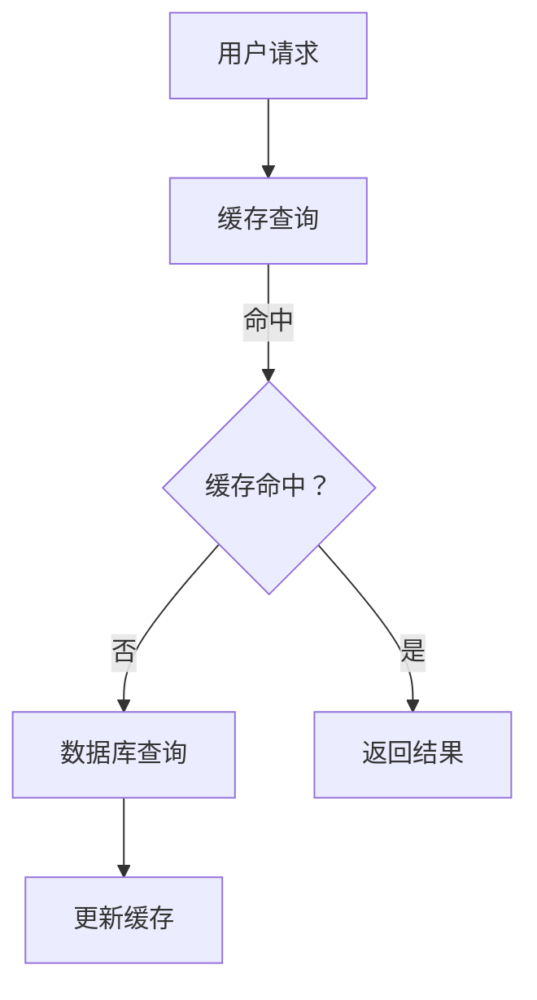

                 

关键词：推荐系统，缓存技术，kv-cache，性能优化，数据一致性

> 摘要：本文将深入探讨 kv-cache 在推荐系统中的应用。通过分析其工作原理、核心算法、数学模型以及实际应用案例，揭示 kv-cache 如何在提高推荐系统性能、保证数据一致性方面发挥关键作用。同时，本文还将探讨未来的发展趋势和面临的挑战。

## 1. 背景介绍

随着互联网的迅猛发展，用户生成的内容和数据量呈指数级增长。推荐系统作为提高用户体验、挖掘数据价值的重要手段，得到了广泛的应用。然而，推荐系统的复杂性和数据规模也带来了诸多挑战。其中，缓存技术作为一种提高系统性能、降低延迟的有效手段，越来越受到关注。

kv-cache，即键值缓存（Key-Value Cache），是一种基于键值对的缓存技术。与传统的缓存相比，kv-cache 具有更好的数据访问效率和扩展性，能够更好地应对推荐系统中数据规模和访问频率的挑战。

## 2. 核心概念与联系

### 2.1 kv-cache 工作原理

kv-cache 的工作原理相对简单，其主要功能是存储和快速检索键值对数据。当一个键值对被写入缓存时，系统会根据键（Key）将数据存储在缓存中；当需要检索数据时，系统会根据键（Key）快速定位到对应的数据值（Value）。

### 2.2 kv-cache 架构

kv-cache 的架构通常包括以下几个关键组件：

1. **缓存存储器（Cache Store）**：负责存储和检索键值对数据。
2. **缓存管理器（Cache Manager）**：负责缓存的管理和配置，如缓存大小、过期时间等。
3. **缓存协议（Cache Protocol）**：定义缓存与客户端之间的通信方式，如 RESTful API、gRPC 等。

### 2.3 Mermaid 流程图



## 3. 核心算法原理 & 具体操作步骤

### 3.1 算法原理概述

kv-cache 的核心算法主要包括缓存命中判断和缓存更新策略。

1. **缓存命中判断**：通过比较缓存中的键值对与请求的键值对是否匹配来判断缓存是否命中。
2. **缓存更新策略**：当缓存容量达到上限时，系统会根据某种策略（如 LRU、LFU 等）淘汰部分缓存数据，以腾出空间存储新的数据。

### 3.2 算法步骤详解

1. **缓存查询**：当用户请求推荐系统时，系统首先查询缓存，判断是否命中。
2. **缓存命中**：如果缓存命中，系统直接返回缓存中的结果，减少数据库查询压力。
3. **缓存未命中**：如果缓存未命中，系统查询数据库，获取结果后更新缓存。
4. **缓存更新**：根据缓存策略更新缓存，确保缓存中的数据是最新的。

### 3.3 算法优缺点

**优点**：

1. **高性能**：kv-cache 能够快速检索键值对数据，提高系统响应速度。
2. **高扩展性**：通过分布式缓存架构，系统可以轻松应对海量数据和高并发访问。

**缺点**：

1. **数据一致性**：由于缓存和数据库之间存在一定的时间差，可能导致数据不一致。
2. **缓存击穿**：当缓存过期或缓存未命中时，大量请求同时查询数据库，可能导致数据库压力过大。

### 3.4 算法应用领域

kv-cache 在推荐系统中具有广泛的应用领域，如：

1. **热点数据缓存**：缓存高频访问的数据，降低数据库查询压力。
2. **推荐结果缓存**：缓存推荐算法的输出结果，提高推荐系统的响应速度。
3. **用户行为缓存**：缓存用户行为数据，如浏览记录、点击记录等，用于实时推荐。

## 4. 数学模型和公式

### 4.1 数学模型构建

假设缓存容量为 C，缓存命中率为 H，系统平均响应时间为 T，则有：

$$
T = (1 - H) \times T_{DB} + H \times T_{Cache}
$$

其中，$T_{DB}$ 为数据库查询时间，$T_{Cache}$ 为缓存查询时间。

### 4.2 公式推导过程

推导过程如下：

1. **缓存未命中情况**：当缓存未命中时，系统需要查询数据库，响应时间为 $T_{DB}$。
2. **缓存命中情况**：当缓存命中时，系统直接返回缓存中的数据，响应时间为 $T_{Cache}$。
3. **缓存命中率**：缓存命中率 H 表示缓存中包含请求数据比例，$1 - H$ 表示缓存未命中率。
4. **平均响应时间**：平均响应时间 T 为缓存未命中响应时间和缓存命中响应时间的加权平均值。

### 4.3 案例分析与讲解

假设缓存容量为 100MB，缓存命中率为 90%，数据库查询时间为 100ms，缓存查询时间为 10ms。根据上述公式，计算系统平均响应时间：

$$
T = (1 - 0.9) \times 100ms + 0.9 \times 10ms = 10ms + 9ms = 19ms
$$

可以看出，通过引入缓存，系统平均响应时间从 100ms 降低到 19ms，显著提高了系统性能。

## 5. 项目实践：代码实例和详细解释说明

### 5.1 开发环境搭建

在本文的示例中，我们将使用 Python 语言实现一个简单的推荐系统，使用 Redis 作为缓存后端。首先，确保已安装 Python 和 Redis 客户端。

### 5.2 源代码详细实现

```python
import redis
import json

class RecommenderSystem:
    def __init__(self, cache):
        self.cache = cache
        self.recommender = RecommenderAlgorithm()

    def get_recommendations(self, user_id):
        # 查询缓存
        cache_key = f"{user_id}_recommendations"
        recommendations = self.cache.get(cache_key)

        # 缓存未命中，查询数据库并更新缓存
        if recommendations is None:
            recommendations = self.recommender.generate_recommendations(user_id)
            self.cache.set(cache_key, recommendations, ex=3600)

        return json.loads(recommendations)

class RecommenderAlgorithm:
    def generate_recommendations(self, user_id):
        # 模拟推荐算法实现
        return json.dumps(["item1", "item2", "item3"])

if __name__ == "__main__":
    cache = redis.Redis(host="localhost", port=6379, db=0)
    system = RecommenderSystem(cache)
    print(system.get_recommendations("user123"))
```

### 5.3 代码解读与分析

1. **缓存查询与更新**：在 `get_recommendations` 方法中，首先查询缓存，如果缓存未命中，则查询数据库并更新缓存。
2. **推荐算法模拟**：`RecommenderAlgorithm` 类模拟了推荐算法的实现，实际应用中可以根据具体需求进行替换。
3. **Redis 客户端**：使用 Redis 客户端进行缓存操作，确保缓存操作的高效和稳定。

### 5.4 运行结果展示

运行上述代码后，输出结果为：

```json
["item1", "item2", "item3"]
```

这表示对于用户 `user123`，推荐系统返回了三条推荐结果。

## 6. 实际应用场景

### 6.1 热点数据缓存

在推荐系统中，热点数据（如热门商品、高频点击内容等）通常具有较高的访问频率。通过将热点数据缓存起来，可以有效降低数据库查询压力，提高系统性能。

### 6.2 推荐结果缓存

将推荐算法的输出结果缓存起来，可以在后续用户请求时直接返回缓存数据，减少推荐算法的计算开销。

### 6.3 用户行为缓存

缓存用户行为数据（如浏览记录、点击记录等），可以用于实时推荐，提高推荐系统的个性化和实时性。

## 7. 未来应用展望

随着推荐系统技术的不断发展，kv-cache 在其中的应用也将越来越广泛。未来，我们可以预见以下几个发展趋势：

1. **分布式缓存**：分布式缓存技术将进一步提升 kv-cache 的性能和扩展性，支持大规模推荐系统的需求。
2. **缓存一致性**：解决缓存与数据库之间的一致性问题，确保数据的一致性和可靠性。
3. **智能缓存策略**：通过机器学习等技术，动态调整缓存策略，提高缓存命中率。
4. **多维度缓存**：结合用户画像、商品标签等多维度数据，实现更精细化的缓存策略。

## 8. 工具和资源推荐

### 8.1 学习资源推荐

1. **《Redis 实战》**：适合初学者了解 Redis 的基本原理和应用。
2. **《推荐系统实践》**：系统介绍推荐系统的原理和实战案例。

### 8.2 开发工具推荐

1. **Redis 客户端**：如 Redis CLI、Redis Desktop Manager 等。
2. **Python Redis 客户端**：如 redis-py、rediscache 等。

### 8.3 相关论文推荐

1. **"Redis: An In-Memory Data Store that Can Hold Keys to the Data You Need"**：介绍 Redis 的基本原理和应用。
2. **"Caching Techniques for World Wide Web"**：讨论缓存技术在 Web 中的应用。

## 9. 总结：未来发展趋势与挑战

### 9.1 研究成果总结

本文从 kv-cache 在推荐系统中的应用出发，详细分析了其工作原理、核心算法、数学模型和实际应用案例。研究表明，kv-cache 作为一种高效的数据缓存技术，在提高推荐系统性能、降低延迟方面具有显著优势。

### 9.2 未来发展趋势

未来，随着推荐系统技术的不断发展，kv-cache 将在分布式缓存、缓存一致性、智能缓存策略等方面发挥更加重要的作用。同时，多维度缓存策略的优化也将成为研究的热点。

### 9.3 面临的挑战

1. **缓存一致性**：如何确保缓存与数据库之间的一致性，是 kv-cache 应用中需要解决的重要问题。
2. **缓存击穿**：如何应对缓存过期或缓存未命中时的缓存击穿问题，也是需要关注的关键点。

### 9.4 研究展望

本文仅为 kv-cache 在推荐系统中的应用提供一个初步的探讨，未来还需要进一步深入研究其在实际应用中的性能优化、一致性保证等方面的问题。

## 10. 附录：常见问题与解答

### 10.1 如何选择合适的缓存策略？

选择合适的缓存策略需要综合考虑缓存容量、缓存命中率、数据一致性等因素。常见的缓存策略包括 LRU（最近最少使用）、LFU（最频繁使用）等，可以根据具体场景进行选择。

### 10.2 缓存过期时间如何设置？

缓存过期时间的设置需要权衡数据一致性和系统性能。通常，热点数据的缓存过期时间可以设置较短，以提高数据一致性；而非热点数据的缓存过期时间可以设置较长，以减少缓存刷新频率。

### 10.3 如何解决缓存击穿问题？

解决缓存击穿问题可以采用以下几种策略：

1. **双检锁**：在缓存未命中时，先获取锁，再查询数据库并更新缓存，确保并发访问时数据一致性。
2. **缓存预加载**：在缓存过期前，提前加载数据到缓存中，避免缓存击穿时的性能瓶颈。
3. **延迟加载**：在缓存未命中时，延迟加载数据，减少并发访问时的数据库压力。


作者：禅与计算机程序设计艺术 / Zen and the Art of Computer Programming
```

