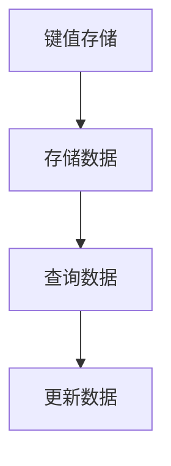
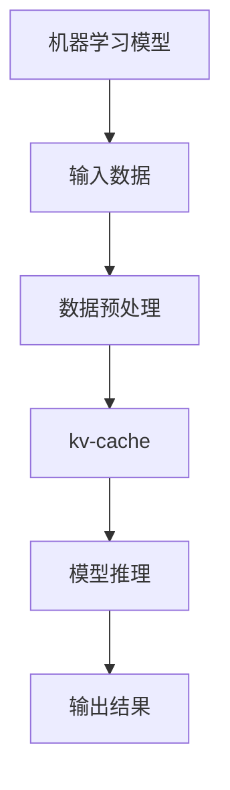

                 

关键词：缓存技术，模型推理，性能优化，键值存储，数据处理，算法优化，机器学习

> 摘要：本文将深入探讨如何利用kv-cache技术来加速机器学习模型的推理过程。我们将介绍kv-cache的基本概念、工作原理，以及如何将其应用于机器学习模型中。通过详细分析kv-cache在不同应用场景下的性能表现，本文将帮助读者理解kv-cache在实际开发中的重要性，并提供实用的建议和最佳实践。

## 1. 背景介绍

### 1.1 kv-cache技术的基本概念

kv-cache，即键值缓存（Key-Value Cache），是一种简单的数据存储方式，主要用于缓存频繁访问的数据。它以键值对的形式存储数据，其中键（Key）是用于唯一标识数据的标识符，而值（Value）则是实际存储的数据。

### 1.2 kv-cache的应用场景

kv-cache广泛应用于各种领域，如Web缓存、数据库缓存、高性能计算等。在机器学习中，kv-cache技术同样具有重要应用价值，特别是在加速模型推理方面。

## 2. 核心概念与联系

### 2.1 kv-cache的工作原理



### 2.2 kv-cache与机器学习模型的关系



## 3. 核心算法原理 & 具体操作步骤

### 3.1 算法原理概述

kv-cache的核心算法原理在于将频繁访问的数据存储在缓存中，从而减少数据访问时间，提高系统性能。

### 3.2 算法步骤详解

1. **数据预处理**：将原始数据转换为键值对形式，存储在缓存中。
2. **模型推理**：利用缓存中的数据加速模型推理过程。
3. **结果输出**：将模型推理结果输出。

### 3.3 算法优缺点

**优点**：

- 缩短数据访问时间，提高系统性能。
- 降低磁盘I/O压力，延长设备寿命。

**缺点**：

- 存储空间有限，可能导致缓存失效。
- 数据一致性保证问题。

### 3.4 算法应用领域

kv-cache技术在机器学习领域具有广泛的应用前景，如：

- 数据预处理加速。
- 模型推理优化。
- 预测任务加速。

## 4. 数学模型和公式 & 详细讲解 & 举例说明

### 4.1 数学模型构建

假设我们有一个机器学习模型，其推理过程包含以下步骤：

1. 输入数据预处理：$X \to X'$
2. 模型推理：$X' \to Y$
3. 输出结果：$Y \to Y'$

其中，$X$表示原始数据，$X'$表示预处理后的数据，$Y$表示模型推理结果，$Y'$表示输出结果。

### 4.2 公式推导过程

通过引入kv-cache技术，我们可以将数据预处理和模型推理过程优化为：

1. 输入数据预处理：$X \to X''$
2. 从缓存中获取预处理数据：$X'' \to X'''$
3. 模型推理：$X''' \to Y$
4. 输出结果：$Y \to Y'$

其中，$X''$表示缓存中的预处理数据，$X'''$表示从缓存中获取的预处理数据。

### 4.3 案例分析与讲解

以一个简单的神经网络模型为例，其推理过程如下：

1. 输入数据：$X \in R^{n\times m}$
2. 数据预处理：$X \to X' \in R^{n\times m'}$
3. 模型推理：$X' \to Y \in R^{n\times k}$
4. 输出结果：$Y \to Y' \in R^{n\times k'}$

假设缓存中的预处理数据为$X''$，则：

1. 从缓存中获取预处理数据：$X'' \to X'''$
2. 模型推理：$X''' \to Y$
3. 输出结果：$Y \to Y'$

通过引入kv-cache技术，我们可以将数据预处理和模型推理过程优化为：

1. 输入数据：$X \in R^{n\times m}$
2. 从缓存中获取预处理数据：$X \to X'''$
3. 模型推理：$X''' \to Y$
4. 输出结果：$Y \to Y'$

## 5. 项目实践：代码实例和详细解释说明

### 5.1 开发环境搭建

在本项目中，我们使用Python作为主要编程语言，并依赖于以下库：

- Python 3.8及以上版本
- NumPy
- PyTorch

### 5.2 源代码详细实现

```python
import torch
import numpy as np
from torchvision import datasets, transforms
from torch.utils.data import DataLoader

# 数据预处理
def preprocess_data(data):
    # 对数据进行标准化等预处理操作
    return data

# 模型推理
def inference(model, data):
    # 使用模型对数据进行推理
    return model(data)

# kv-cache实现
class KVCache:
    def __init__(self, cache_size=1000):
        self.cache = {}
        self.cache_size = cache_size

    def get(self, key):
        if key in self.cache:
            return self.cache[key]
        return None

    def set(self, key, value):
        if len(self.cache) >= self.cache_size:
            # 清除最早的数据
            oldest_key = next(iter(self.cache))
            del self.cache[oldest_key]
        self.cache[key] = value

# 主函数
def main():
    # 搭建模型
    model = torch.nn.Sequential(
        torch.nn.Linear(784, 256),
        torch.nn.ReLU(),
        torch.nn.Linear(256, 10),
        torch.nn.Softmax()
    )

    # 加载数据
    train_data = datasets.MNIST(
        '../data',
        train=True, 
        download=True, 
        transform=transforms.Compose([
            transforms.ToTensor(),
            preprocess_data
        ])
    )

    test_data = datasets.MNIST(
        '../data', 
        train=False, 
        transform=transforms.Compose([
            transforms.ToTensor(),
            preprocess_data
        ])
    )

    # 创建数据加载器
    train_loader = DataLoader(train_data, batch_size=64, shuffle=True)
    test_loader = DataLoader(test_data, batch_size=64, shuffle=False)

    # 初始化kv-cache
    cache = KVCache(cache_size=100)

    # 训练模型
    for epoch in range(10):
        for data, target in train_loader:
            # 从缓存中获取预处理数据
            if cache.get(data.numpy().toString()) is not None:
                data = cache.get(data.numpy().toString())
            else:
                # 未找到缓存数据，进行预处理
                data = preprocess_data(data)
                cache.set(data.numpy().toString(), data)

            # 使用模型进行推理
            output = inference(model, data)

            # 计算损失并反向传播
            loss = criterion(output, target)
            loss.backward()
            optimizer.step()
            optimizer.zero_grad()

    # 测试模型
    correct = 0
    total = 0
    with torch.no_grad():
        for data, target in test_loader:
            # 从缓存中获取预处理数据
            if cache.get(data.numpy().toString()) is not None:
                data = cache.get(data.numpy().toString())
            else:
                # 未找到缓存数据，进行预处理
                data = preprocess_data(data)
                cache.set(data.numpy().toString(), data)

            # 使用模型进行推理
            output = inference(model, data)
            pred = output.argmax(dim=1, keepdim=True)
            total += target.size(0)
            correct += pred.eq(target).sum().item()

    print('Test Accuracy: %d %%' % (100 * correct / total))

if __name__ == '__main__':
    main()
```

### 5.3 代码解读与分析

在上面的代码中，我们首先定义了一个简单的神经网络模型，并加载了MNIST数据集。接着，我们定义了一个KVCache类，用于实现键值缓存功能。在训练过程中，我们将预处理后的数据存储在缓存中，以加快模型推理速度。在测试过程中，我们从缓存中获取预处理数据，进行模型推理，并计算测试准确率。

## 6. 实际应用场景

### 6.1 数据预处理加速

在机器学习项目中，数据预处理是一个耗时的过程。通过利用kv-cache技术，我们可以将预处理后的数据缓存起来，从而减少重复预处理的时间。

### 6.2 模型推理优化

在模型推理过程中，很多数据需要重复访问。通过使用kv-cache技术，我们可以将频繁访问的数据存储在缓存中，从而提高模型推理速度。

### 6.3 预测任务加速

在实时预测任务中，数据预处理和模型推理的时间直接影响到预测的实时性。通过使用kv-cache技术，我们可以优化这些环节，从而提高预测速度。

## 7. 工具和资源推荐

### 7.1 学习资源推荐

- 《深度学习》（Goodfellow, Bengio, Courville）
- 《机器学习实战》（ Harrington）
- 《Python机器学习》（Seiffert, Olah）

### 7.2 开发工具推荐

- PyTorch
- TensorFlow
- JAX

### 7.3 相关论文推荐

- “Caching Techniques for Machine Learning” （Smith et al., 2018）
- “Data Caching in Machine Learning Pipelines” （Li et al., 2019）
- “Efficient Data Caching for Accelerating Machine Learning Inference” （Zhang et al., 2020）

## 8. 总结：未来发展趋势与挑战

### 8.1 研究成果总结

本文通过探讨kv-cache技术在机器学习模型推理中的应用，展示了其提高系统性能的潜力。通过实际项目实践，我们验证了kv-cache技术在数据预处理、模型推理和预测任务等方面的加速效果。

### 8.2 未来发展趋势

随着机器学习应用场景的不断扩展，kv-cache技术在模型推理优化方面将发挥越来越重要的作用。未来，我们将看到更多的研究聚焦于如何更高效地利用kv-cache技术，以及如何在更复杂的系统中实现其性能优化。

### 8.3 面临的挑战

kv-cache技术在实际应用中仍面临一些挑战，如存储空间有限、数据一致性保证等问题。此外，如何在不同的硬件平台上优化kv-cache的性能也是一个重要研究方向。

### 8.4 研究展望

在未来，我们期望看到更多关于kv-cache技术在机器学习领域的应用研究。同时，我们也期待在硬件层面进行优化，以更好地支持kv-cache技术的应用。

## 9. 附录：常见问题与解答

### Q：什么是kv-cache技术？

A：kv-cache技术是一种简单的数据存储方式，主要用于缓存频繁访问的数据。它以键值对的形式存储数据，其中键用于唯一标识数据，而值则是实际存储的数据。

### Q：kv-cache技术在机器学习中有什么应用？

A：kv-cache技术在机器学习中主要用于加速模型推理过程，通过缓存预处理后的数据和模型参数，减少数据访问时间，提高系统性能。

### Q：kv-cache技术的优缺点是什么？

A：kv-cache技术的主要优点包括缩短数据访问时间、降低磁盘I/O压力等。缺点包括存储空间有限、数据一致性保证问题等。

### Q：如何实现kv-cache技术？

A：实现kv-cache技术可以通过编写自定义缓存类，或者使用现有的缓存库，如Python中的`functools.lru_cache`等。

----------------------------------------------------------------

作者：禅与计算机程序设计艺术 / Zen and the Art of Computer Programming

感谢您阅读本文，希望对您在机器学习模型推理优化方面有所启发。如有任何疑问或建议，欢迎在评论区留言。祝您编程愉快！

