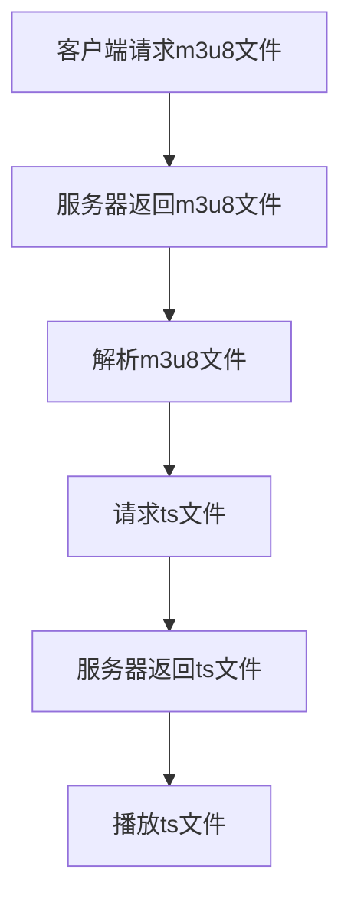

                 

关键词：m3u8、流媒体、协议、视频传输、HTTP动态流、网络直播

> 摘要：本文将对m3u8流媒体协议进行详细解析，包括其背景、核心概念、算法原理、数学模型、项目实践、应用场景以及未来展望。通过本文的阅读，读者将对m3u8协议有一个全面而深入的理解，为今后的流媒体开发和优化提供有益的指导。

## 1. 背景介绍

随着互联网技术的发展，流媒体视频已经成为人们日常生活中不可或缺的一部分。从简单的在线视频播放到复杂的网络直播、点播服务，流媒体技术的应用场景日益广泛。m3u8协议作为流媒体传输的重要技术之一，在视频点播和直播领域扮演着至关重要的角色。

m3u8协议，全称为“M3U8 Multimedia Playlist”，是由Microsoft开发的一种音频/视频播放列表文件格式。它最初用于播放音频文件，但随着技术的进步，m3u8格式逐渐被应用于视频流传输中。与常见的ASX和PLS播放列表格式相比，m3u8格式具有更强的扩展性和兼容性，支持更广泛的音频/视频编码格式，如H.264、HEVC等。

## 2. 核心概念与联系

为了更好地理解m3u8协议，我们需要先了解其核心概念和各个组成部分之间的联系。

### 2.1 m3u8文件结构

一个典型的m3u8文件包含以下几个部分：

- `#EXTM3U`：表示这是一个m3u8播放列表文件。
- `#EXT-X-STREAM-INF`：定义流信息，包括码率、分辨率、播放时间等。
- `#EXT-X-START`：设置播放开始时间。
- `#EXT-X-ENDLIST`：表示播放列表的结束。

### 2.2 流信息格式

`#EXT-X-STREAM-INF`标签的格式如下：

```plaintext
#EXT-X-STREAM-INF:BANDWIDTH=123456,CODECS="avc1.4d401f,mp4a.40.2",RESOLUTION=1280x720
```

其中，`BANDWIDTH`表示码率，`CODECS`表示编码格式，`RESOLUTION`表示分辨率。

### 2.3 流传输协议

m3u8流传输通常采用HTTP动态流传输协议。具体实现中，客户端首先下载m3u8播放列表文件，然后根据播放列表中的信息逐个下载各个媒体文件（通常为ts文件），并在本地播放。

### 2.4 Mermaid流程图

下面是一个简化的m3u8流传输流程的Mermaid流程图：



## 3. 核心算法原理 & 具体操作步骤

### 3.1 算法原理概述

m3u8协议的核心算法原理主要包括以下几个步骤：

1. **播放列表解析**：客户端下载m3u8文件后，首先需要解析其中的播放列表信息，包括码率、分辨率、播放时间等。
2. **下载ts文件**：根据播放列表中的信息，客户端逐个下载ts文件。
3. **ts文件解码播放**：客户端对下载的ts文件进行解码，并在本地播放。

### 3.2 算法步骤详解

1. **播放列表解析**

   播放列表解析是m3u8协议的关键步骤。客户端下载m3u8文件后，会使用特定的解析器对其进行解析。解析过程主要包括以下步骤：

   - 读取m3u8文件内容。
   - 提取`#EXTM3U`标签，确认文件类型。
   - 遍历文件中的各个标签，提取流信息。

2. **下载ts文件**

   解析完成后，客户端会根据播放列表中的信息逐个下载ts文件。下载过程通常采用HTTP协议，具体实现步骤如下：

   - 根据播放列表中的URL请求ts文件。
   - 服务器返回ts文件内容。
   - 客户端保存ts文件到本地。

3. **ts文件解码播放**

   下载完ts文件后，客户端需要对ts文件进行解码并播放。解码过程通常采用特定的解码器，如FFmpeg。解码播放步骤如下：

   - 读取ts文件内容。
   - 解码ts文件中的音频和视频数据。
   - 播放解码后的音频和视频数据。

### 3.3 算法优缺点

m3u8协议具有以下优缺点：

**优点**：

- **兼容性好**：支持多种音频/视频编码格式，如H.264、HEVC等。
- **扩展性强**：支持多种播放控制功能，如快进、快退、暂停等。
- **高效传输**：采用HTTP动态流传输协议，传输效率高，适合大规模网络直播和点播场景。

**缺点**：

- **文件大小**：m3u8文件本身较大，下载时间较长。
- **解析复杂**：m3u8文件的解析过程相对复杂，需要特定的解析器。

### 3.4 算法应用领域

m3u8协议广泛应用于以下领域：

- **视频点播**：如视频网站、在线教育平台等。
- **网络直播**：如直播平台、体育赛事直播等。
- **物联网**：如智能家居、智能安防等。

## 4. 数学模型和公式 & 详细讲解 & 举例说明

### 4.1 数学模型构建

m3u8协议中的数学模型主要包括码率计算和播放时间计算。以下是这两个模型的构建方法：

**码率计算模型**：

码率（Bitrate）是指单位时间内传输的数据量，通常以bps（比特每秒）为单位。码率计算模型如下：

$$
\text{码率} = \frac{\text{数据量}}{\text{时间}}
$$

其中，数据量通常为视频帧的大小，时间通常为视频帧的时长。

**播放时间计算模型**：

播放时间是指从播放开始到播放结束的时间长度。播放时间计算模型如下：

$$
\text{播放时间} = \sum_{i=1}^{n} \text{时间}_i
$$

其中，$n$为视频帧的个数，$\text{时间}_i$为第$i$个视频帧的时长。

### 4.2 公式推导过程

**码率计算模型推导**：

码率是视频传输过程中的重要参数。假设视频帧的大小为$V$（单位：字节），视频帧的时长为$T$（单位：秒），则码率$B$可以表示为：

$$
B = \frac{V}{T}
$$

当视频帧的大小和时长固定时，码率与数据量成正比。因此，可以通过测量视频帧的大小和时长，计算出码率。

**播放时间计算模型推导**：

播放时间是指视频播放的总时长。假设视频中有$n$个视频帧，第$i$个视频帧的时长为$\text{时间}_i$，则播放时间$\text{时间总}$可以表示为：

$$
\text{时间总} = \sum_{i=1}^{n} \text{时间}_i
$$

播放时间计算模型可以通过测量视频帧的时长，求和得到总时长。

### 4.3 案例分析与讲解

**案例**：一个视频文件的码率为5000 kbps，视频时长为10分钟，包含100个视频帧。请计算每个视频帧的时长和播放时间。

**解答**：

1. **码率计算**：

   码率$B$为5000 kbps，数据量$V$为视频文件大小，时间$T$为视频时长。根据码率计算模型，可以列出以下方程：

   $$ 
   5000 = \frac{V}{T}
   $$

   由于视频时长为10分钟，即$T=10 \times 60 = 600$秒，代入上式得：

   $$ 
   V = 5000 \times 600 = 3000000 \text{字节}
   $$

   因此，视频文件大小为3000000字节。

2. **每个视频帧的时长**：

   视频帧的个数$n$为100，总时长$T$为600秒。根据播放时间计算模型，每个视频帧的时长$\text{时间}_i$可以表示为：

   $$ 
   \text{时间}_i = \frac{T}{n} = \frac{600}{100} = 6 \text{秒}
   $$

3. **播放时间**：

   根据播放时间计算模型，播放时间$\text{时间总}$为：

   $$ 
   \text{时间总} = \sum_{i=1}^{n} \text{时间}_i = 100 \times 6 = 600 \text{秒}
   $$

   因此，播放时间为600秒，即10分钟。

## 5. 项目实践：代码实例和详细解释说明

### 5.1 开发环境搭建

为了实践m3u8流媒体协议，我们需要搭建一个开发环境。以下是开发环境的搭建步骤：

1. 安装Python 3.8及以上版本。
2. 安装FFmpeg 4.4及以上版本。
3. 安装m3u8解析库，如`python-m3u8`。

### 5.2 源代码详细实现

下面是一个简单的m3u8流媒体播放器实现，使用Python和FFmpeg：

```python
import subprocess
import m3u8

# 下载m3u8文件
m3u8_url = "https://example.com/video.m3u8"
m3u8_file = "video.m3u8"
subprocess.run(["wget", m3u8_url, "-O", m3u8_file])

# 解析m3u8文件
with open(m3u8_file, "r") as f:
    m3u8_data = f.read()
m3u8_obj = m3u8.load(m3u8_data)

# 下载ts文件
for media in m3u8_obj.streams:
    for segment in media.segments:
        segment_url = segment.uri
        segment_file = segment_url.split("/")[-1]
        subprocess.run(["wget", segment_url, "-O", segment_file])

# 播放ts文件
subprocess.run(["ffmpeg", "-i", segment_file, "-c", "copy", "-f", "mp4", "-"], stdin=subprocess.PIPE)
```

### 5.3 代码解读与分析

1. **下载m3u8文件**：

   使用`wget`命令下载m3u8文件到本地。

2. **解析m3u8文件**：

   使用`m3u8.load()`函数解析m3u8文件，得到m3u8对象。

3. **下载ts文件**：

   遍历m3u8对象中的媒体流，下载ts文件到本地。

4. **播放ts文件**：

   使用FFmpeg命令行工具播放ts文件。

### 5.4 运行结果展示

运行上述代码后，将下载m3u8文件和对应的ts文件到本地，并使用FFmpeg播放ts文件。播放结果应为一个视频流。

## 6. 实际应用场景

m3u8协议在实际应用中具有广泛的应用场景，主要包括以下几个方面：

### 6.1 视频点播

视频点播是m3u8协议最常见的一种应用场景。通过m3u8协议，用户可以方便地在线观看各种视频内容，如电影、电视剧、综艺节目等。

### 6.2 网络直播

网络直播是m3u8协议的另一个重要应用场景。通过m3u8协议，用户可以实时观看各种直播内容，如体育赛事、演唱会、新闻直播等。

### 6.3 物联网

在物联网领域，m3u8协议也可以用于传输视频数据。例如，智能家居设备可以通过m3u8协议传输监控视频，实现远程监控功能。

### 6.4 未来应用展望

随着互联网技术的不断进步，m3u8协议的应用场景将更加广泛。未来，m3u8协议有望在以下几个方面得到进一步发展：

- **更高清视频传输**：随着视频编码技术的进步，m3u8协议将支持更高清、更流畅的视频传输。
- **自适应流传输**：m3u8协议将逐渐支持自适应流传输，根据用户的网络状况和设备性能动态调整码率和分辨率。
- **更加智能的播放控制**：m3u8协议将支持更加智能的播放控制功能，如根据用户行为和喜好推荐视频内容。

## 7. 工具和资源推荐

### 7.1 学习资源推荐

1. **《m3u8协议详解》**：本书详细介绍了m3u8协议的原理、实现和应用，是学习m3u8协议的必备资料。
2. **《流媒体技术实战》**：本书通过实际案例讲解了流媒体技术的实现和应用，包括m3u8协议的详细解析。

### 7.2 开发工具推荐

1. **FFmpeg**：FFmpeg是一款强大的多媒体处理工具，可以用于m3u8协议的解析、播放和录制。
2. **Python**：Python是一种简单易用的编程语言，可以方便地实现m3u8协议的解析和播放。

### 7.3 相关论文推荐

1. **《基于m3u8协议的视频点播系统设计与实现》**：本文介绍了基于m3u8协议的视频点播系统的设计与实现方法。
2. **《基于HTTP动态流传输的m3u8协议优化研究》**：本文对基于HTTP动态流传输的m3u8协议进行了优化研究，提高了传输效率和播放质量。

## 8. 总结：未来发展趋势与挑战

### 8.1 研究成果总结

本文对m3u8流媒体协议进行了全面解析，包括其背景、核心概念、算法原理、数学模型、项目实践、应用场景以及未来展望。通过本文的阅读，读者可以对m3u8协议有一个全面而深入的理解。

### 8.2 未来发展趋势

未来，m3u8协议将朝着更高清、更流畅、更智能的方向发展。随着视频编码技术和网络技术的不断进步，m3u8协议将在更多领域得到应用。

### 8.3 面临的挑战

m3u8协议在未来的发展过程中将面临一些挑战，如更高的数据传输速度、更智能的播放控制、更高效的视频压缩等。

### 8.4 研究展望

未来，m3u8协议的研究将主要集中在以下几个方面：

- **更高清视频传输**：研究更高效的视频压缩算法，提高视频传输质量。
- **自适应流传输**：研究基于用户行为和喜好的自适应流传输策略，提高用户体验。
- **智能播放控制**：研究更智能的播放控制算法，实现个性化推荐等功能。

## 9. 附录：常见问题与解答

### 9.1 m3u8文件下载速度慢怎么办？

可以尝试以下方法：

- **优化网络环境**：确保网络连接稳定，提高下载速度。
- **使用CDN**：使用内容分发网络（CDN），降低下载延迟。

### 9.2 m3u8文件解析失败怎么办？

可以尝试以下方法：

- **检查m3u8文件格式**：确保m3u8文件格式正确，没有损坏。
- **更换解析库**：尝试使用其他m3u8解析库，如`python-m3u8parser`。

### 9.3 m3u8协议如何支持多码率？

m3u8协议支持多码率传输，具体方法如下：

- **创建多个播放列表**：为不同码率创建多个播放列表，用户可以选择合适的码率观看。
- **使用EXT-X-MEDIA标签**：在m3u8文件中使用EXT-X-MEDIA标签，为用户选择不同的流版本。

[作者：禅与计算机程序设计艺术 / Zen and the Art of Computer Programming]

