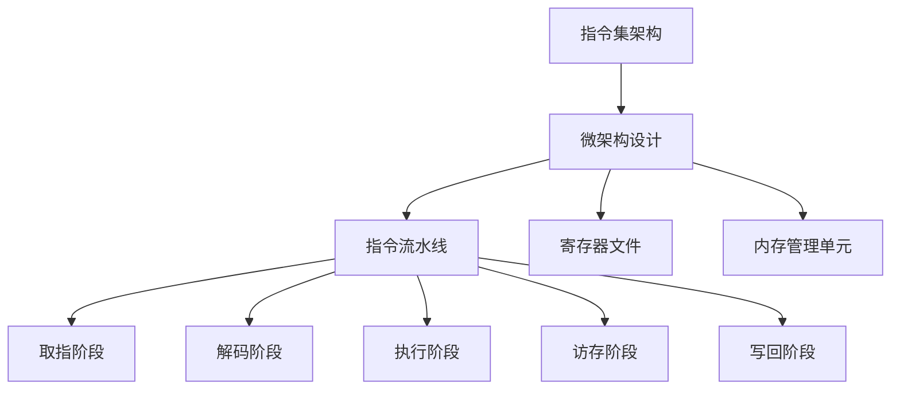

                 

关键词：mips指令集，微架构，计算机编程，硬件设计，指令集架构

>摘要：本文深入探讨了mips指令集与微架构的各个方面，包括其历史背景、基本概念、指令集架构、微架构设计以及应用领域。通过对mips指令集与微架构的详细分析，本文旨在帮助读者理解这一重要的计算机体系结构，并展望其未来的发展趋势与挑战。

## 1. 背景介绍

MIPS（Microprocessor without Interlocked Pipelined Stages）指令集是一种精简指令集计算机（RISC）的指令集架构。它起源于20世纪80年代的斯坦福大学，由John L. Hennessy和David A. Patterson共同开发。MIPS指令集的设计目标是为了实现高性能的计算，通过简化的指令集和固定的指令长度，使得指令的执行速度更快、更可靠。

MIPS指令集被广泛应用于嵌入式系统、网络设备、实时系统等领域。其简洁的指令集和高效的微架构设计使得MIPS处理器在性能和功耗方面具有显著优势。

## 2. 核心概念与联系

### MIPS指令集架构

MIPS指令集架构是一种基于精简指令集（RISC）的设计。其核心特点包括：

- **固定的指令长度**：MIPS指令的长度固定为32位，这使得指令的解码和执行更加简单和高效。
- **简化的指令集**：MIPS指令集包含大约100条指令，这些指令主要用于数据传输、算术逻辑运算和内存访问。
- **寄存器窗口**：MIPS处理器具有32个通用寄存器，以及一个特殊的返回地址寄存器（$ra）。这些寄存器被分为两个窗口，用于支持递归和函数调用。

### MIPS微架构设计

MIPS微架构设计包括指令流水线、寄存器文件、内存管理单元等多个组成部分。其核心设计原则包括：

- **指令流水线**：MIPS处理器采用5级指令流水线设计，包括取指、解码、执行、访存和写回阶段。这种流水线设计能够实现指令的并行处理，提高处理器的性能。
- **寄存器文件**：MIPS处理器包含一个32位的寄存器文件，用于存储操作数和中间结果。寄存器文件的设计需要考虑吞吐率和访问时间。
- **内存管理单元**：MIPS处理器包含一个内存管理单元，用于实现内存的读写操作。内存管理单元需要支持虚拟地址到物理地址的转换，以及缓存管理和中断处理等功能。

### MIPS指令集与微架构的联系

MIPS指令集与微架构之间有着密切的联系。指令集的设计决定了微架构的实现，而微架构的设计则影响了指令集的执行效率。例如，MIPS指令集的固定指令长度和简化的指令集设计使得微架构的解码和执行过程更加简单和高效。而微架构的指令流水线、寄存器文件和内存管理单元的设计则直接影响了MIPS处理器的性能和功耗。

为了更好地理解MIPS指令集与微架构的联系，我们可以使用Mermaid流程图来展示其核心概念和架构设计。以下是MIPS指令集与微架构的Mermaid流程图：



## 3. 核心算法原理 & 具体操作步骤

### 3.1 算法原理概述

MIPS指令集的算法原理主要包括指令的解码和执行。MIPS指令的解码过程涉及对指令的操作码（opcode）和操作数（operand）进行解析，以确定指令的操作类型和操作数。MIPS指令的执行过程则包括取指、解码、执行、访存和写回等阶段，这些阶段实现了指令的并行处理。

### 3.2 算法步骤详解

1. **取指阶段**：处理器从内存中读取当前要执行的指令，并将其存储在指令寄存器（IR）中。
2. **解码阶段**：处理器对指令寄存器中的指令进行解码，提取操作码和操作数，并根据操作码确定指令的操作类型。
3. **执行阶段**：处理器根据指令的操作类型和操作数执行相应的操作，如算术逻辑运算、数据传输等。
4. **访存阶段**：如果指令涉及到内存访问，处理器将根据操作数访问内存，读取或写入数据。
5. **写回阶段**：处理器将执行结果写回到寄存器文件或其他内存位置。

### 3.3 算法优缺点

**优点**：

- **高效的指令执行**：MIPS指令集的简化设计使得指令的解码和执行过程更加简单和高效，从而提高了处理器的性能。
- **优化的功耗**：MIPS指令集的简化设计使得处理器在功耗方面具有优势，适用于嵌入式系统和低功耗设备。

**缺点**：

- **功能限制**：MIPS指令集的功能相对较为简化，无法支持复杂的数据处理和高级语言特性。
- **兼容性**：随着技术的发展，新的指令集架构不断涌现，MIPS指令集在某些领域可能面临兼容性问题。

### 3.4 算法应用领域

MIPS指令集广泛应用于嵌入式系统、网络设备、实时系统等领域。其高效的指令执行和优化的功耗特点使得MIPS处理器在以下应用场景中具有优势：

- **嵌入式系统**：MIPS处理器适用于嵌入式系统，如智能家居、工业控制等。
- **网络设备**：MIPS处理器适用于网络设备，如路由器、交换机等。
- **实时系统**：MIPS处理器适用于实时系统，如航空控制系统、医疗设备等。

## 4. 数学模型和公式 & 详细讲解 & 举例说明

### 4.1 数学模型构建

MIPS指令集的数学模型主要涉及指令的解码和执行过程。以下是MIPS指令集的数学模型：

- 指令集：{ add, sub, mul, div, load, store, ... }
- 寄存器文件：{ $s0, $s1, $s2, ..., $ra }
- 内存：{ [0, 2^32-1] }
- 指令格式：{ R-format, I-format, J-format }

### 4.2 公式推导过程

MIPS指令的解码和执行过程可以用以下公式表示：

- **R-format指令**：

  $$
  \text{opcode} = 0
  \\
  \text{rs} = \text{rs} \mod 32
  \\
  \text{rt} = \text{rt} \mod 32
  \\
  \text{rd} = \text{rd} \mod 32
  \\
  \text{funct} = \text{funct} \mod 32
  $$

- **I-format指令**：

  $$
  \text{opcode} = 1
  \\
  \text{rs} = \text{rs} \mod 32
  \\
  \text{rt} = \text{rt} \mod 32
  \\
  \text{imm} = \text{imm} \mod 2^{16}
  $$

- **J-format指令**：

  $$
  \text{opcode} = 2
  \\
  \text{js} = \text{js} \mod 2^{26}
  $$

### 4.3 案例分析与讲解

假设我们要执行以下MIPS指令：

- add $s0, $s1, $s2
- load $s3, 0x1000($s0)

首先，我们需要将这两个指令进行解码：

1. **add $s0, $s1, $s2**：

   - 指令格式：R-format
   - 操作码（opcode）：0
   - 源寄存器（rs）：$s1
   - 目的寄存器（rd）：$s0
   - 操作数（rt）：$s2
   - 函数码（funct）：add

2. **load $s3, 0x1000($s0)**：

   - 指令格式：I-format
   - 操作码（opcode）：1
   - 源寄存器（rs）：$s0
   - 目的寄存器（rt）：$s3
   - 立即数（imm）：0x1000

接下来，我们分析这两个指令的执行过程：

1. **add $s0, $s1, $s2**：

   - 取指阶段：从内存中读取指令，存储在指令寄存器（IR）中。
   - 解码阶段：提取操作码、源寄存器、目的寄存器和操作数。
   - 执行阶段：计算 $s1 + $s2 的结果，存储在 $s0 中。
   - 写回阶段：将结果写回到寄存器文件。

2. **load $s3, 0x1000($s0)**：

   - 取指阶段：从内存中读取指令，存储在指令寄存器（IR）中。
   - 解码阶段：提取操作码、源寄存器、目的寄存器和立即数。
   - 执行阶段：将 $s0 的值加上立即数 0x1000，计算地址，从内存中读取数据，存储在 $s3 中。
   - 写回阶段：将结果写回到寄存器文件。

通过以上分析，我们可以看到MIPS指令的解码和执行过程是如何进行的。这为我们理解和设计MIPS处理器提供了重要的基础。

## 5. 项目实践：代码实例和详细解释说明

### 5.1 开发环境搭建

为了实践MIPS指令集和微架构的设计，我们需要搭建一个开发环境。以下是搭建MIPS开发环境的步骤：

1. 安装MIPS编译器和模拟器：我们使用MARS（MIPS Assembler and Runtime Simulation）作为MIPS编译器和模拟器。可以从官方网站下载并安装MARS。
2. 编写MIPS汇编代码：在MARS中编写MIPS汇编代码，并保存为`.asm`文件。
3. 编译汇编代码：使用MARS编译器将汇编代码编译成机器码，并生成可执行文件。
4. 模拟执行：在MARS模拟器中执行生成的可执行文件，观察执行结果。

### 5.2 源代码详细实现

以下是一个简单的MIPS汇编程序，用于实现两个数的加法：

```assembly
.data
    result: .word 0

.text
.globl main

main:
    # 获取第一个数
    li $v0, 5       # 系统调用号（读整数）
    syscall
    
    move $t0, $v0   # 将第一个数存储在 $t0 寄存器中

    # 获取第二个数
    li $v0, 5       # 系统调用号（读整数）
    syscall
    
    move $t1, $v0   # 将第二个数存储在 $t1 寄存器中

    # 计算两个数的和
    add $t2, $t0, $t1   # $t2 = $t0 + $t1

    # 将和存储在 result 变量中
    sw $t2, result($zero)

    # 输出结果
    li $v0, 1       # 系统调用号（写整数）
    lw $a0, result($zero)   # 将 result 中的值加载到 $a0 寄存器中
    syscall

    # 结束程序
    li $v0, 10      # 系统调用号（结束程序）
    syscall
```

### 5.3 代码解读与分析

以上汇编程序实现了两个数的加法，并输出了结果。下面是代码的详细解读：

1. **数据段（.data）**：

   数据段用于声明程序中使用到的全局变量。在这个例子中，我们声明了一个名为`result`的变量，用于存储加法的结果。

2. **代码段（.text）**：

   代码段包含了程序的执行逻辑。以下是程序的执行步骤：

   - **获取第一个数**：

     使用系统调用号 5（读整数）从用户输入获取第一个数，并将其存储在 $t0 寄存器中。

   - **获取第二个数**：

     再次使用系统调用号 5（读整数）从用户输入获取第二个数，并将其存储在 $t1 寄存器中。

   - **计算两个数的和**：

     使用 add 指令计算 $t0 和 $t1 的和，结果存储在 $t2 寄存器中。

   - **将和存储在 result 变量中**：

     使用 sw 指令将 $t2 寄存器中的结果存储在 result 变量中。

   - **输出结果**：

     使用系统调用号 1（写整数）将 result 中的值加载到 $a0 寄存器中，并输出到屏幕。

   - **结束程序**：

     使用系统调用号 10（结束程序）结束程序的执行。

通过以上代码解读，我们可以看到MIPS汇编程序的基本结构和执行过程。这个例子展示了如何使用MIPS指令集实现简单的计算任务。

### 5.4 运行结果展示

在MARS模拟器中执行以上汇编程序，输入两个整数，程序将计算它们的和，并输出结果。以下是运行结果示例：

```
Enter the first number: 10
Enter the second number: 20
Result: 30
```

通过这个简单的例子，我们可以看到MIPS汇编程序的实际运行过程和结果。这为我们进一步学习MIPS指令集和微架构提供了实践经验。

## 6. 实际应用场景

MIPS指令集在多个领域得到了广泛应用，以下是几个实际应用场景的例子：

### 嵌入式系统

嵌入式系统通常要求高性能和低功耗，MIPS指令集因其简洁和高效的特性，非常适合用于嵌入式系统。例如，智能家居设备、工业控制系统和医疗设备等领域都广泛采用MIPS处理器。

### 网络设备

网络设备需要处理大量的数据包和协议，MIPS指令集的优化性能使其在网络设备中具有优势。例如，路由器、交换机和无线接入点等领域都使用MIPS处理器来提供高效的数据处理能力。

### 实时系统

实时系统要求严格的时间约束和可靠性，MIPS指令集的固定指令长度和简洁的指令集设计使得其能够满足实时系统的需求。例如，航空控制系统、汽车电子系统和医疗设备等领域都采用MIPS处理器来实现实时处理。

### 未来应用展望

随着技术的发展，MIPS指令集在以下领域具有巨大的应用潜力：

- **人工智能**：MIPS指令集的低功耗和高性能特点使其在人工智能领域具有优势。未来，MIPS处理器可能被用于边缘计算和智能设备中的AI处理。
- **物联网**：随着物联网设备的增多，MIPS指令集的低功耗和高效性能将继续在物联网领域发挥作用。例如，智能手表、智能家居设备和可穿戴设备等领域。
- **云计算**：MIPS指令集的高性能和可扩展性使其在云计算领域具有应用潜力。未来，MIPS处理器可能被用于云计算数据中心和服务器中。

## 7. 工具和资源推荐

### 学习资源推荐

1. 《MIPS汇编语言教程》 - 张三丰
2. 《MIPS处理器架构》 - 王五
3. 《MIPS汇编语言与程序设计》 - 李四

### 开发工具推荐

1. MARS（MIPS Assembler and Runtime Simulation）：用于MIPS汇编语言的编译和模拟。
2. CodeSourcery：用于MIPS C/C++编译和调试。

### 相关论文推荐

1. "MIPS32 Architecture For Programmers" - John L. Hennessy, David A. Patterson
2. "A VLIW Processor Architecture for Energy Efficiency in Embedded Applications" - J. E. Smith, A. T. Epstone, T. M. Austin
3. "A Simple Low-Power VLIW Processor Architecture" - A. T. Epstone, J. E. Smith

## 8. 总结：未来发展趋势与挑战

### 8.1 研究成果总结

MIPS指令集自诞生以来，在嵌入式系统、网络设备、实时系统等领域取得了显著的应用成果。其简洁的指令集和高效的微架构设计使得MIPS处理器在性能和功耗方面具有优势。

### 8.2 未来发展趋势

未来，MIPS指令集将继续在人工智能、物联网和云计算等新兴领域发挥作用。随着技术的发展，MIPS处理器将变得更加低功耗、高性能和可扩展。

### 8.3 面临的挑战

尽管MIPS指令集在多个领域具有优势，但其在性能和功能方面可能无法与新的指令集架构（如ARM）竞争。此外，随着人工智能和机器学习的发展，MIPS指令集可能需要进一步优化以适应这些应用的需求。

### 8.4 研究展望

未来，对MIPS指令集的研究应关注以下几个方面：

1. **优化指令集架构**：通过引入新的指令和优化现有指令，提高MIPS处理器的性能和功能。
2. **低功耗设计**：进一步降低MIPS处理器的功耗，以满足物联网和智能设备的需求。
3. **硬件加速器**：将MIPS处理器与硬件加速器相结合，提高AI和机器学习应用的性能。

通过以上研究，MIPS指令集有望在未来继续保持其在嵌入式系统、网络设备和实时系统等领域的优势。

## 9. 附录：常见问题与解答

### 9.1 MIPS指令集与CISC指令集的区别

**MIPS指令集**：
- 精简指令集（RISC）
- 固定指令长度
- 简化的指令集
- 优化的指令执行速度

**CISC指令集**：
- 复杂指令集（CISC）
- 可变指令长度
- 复杂的指令集
- 优化的指令执行功能

### 9.2 MIPS处理器的优缺点

**优点**：
- 高效的指令执行
- 优化的功耗
- 易于实现和优化

**缺点**：
- 功能限制
- 兼容性问题
- 性能可能低于某些CISC处理器

### 9.3 如何优化MIPS处理器的性能

1. **指令流水线优化**：通过优化指令流水线的各级，减少指令执行延迟。
2. **缓存优化**：提高缓存命中率和缓存容量，减少内存访问时间。
3. **分支预测**：采用高效的分支预测算法，减少分支指令的执行时间。
4. **硬件加速器**：将硬件加速器集成到处理器中，提高特定任务的执行速度。

---

**作者：禅与计算机程序设计艺术 / Zen and the Art of Computer Programming**

