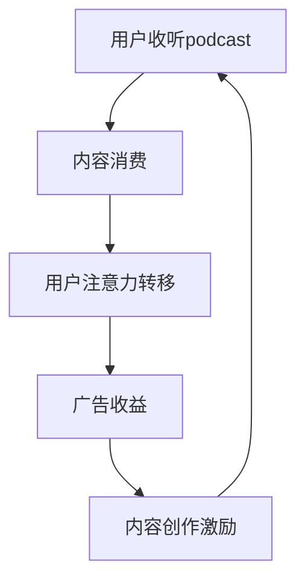

                 

关键词：podcast、注意力经济、市场营销、数字内容、平台生态、用户参与、算法推荐、内容创作

> 摘要：本文旨在探讨 podcast 市场在数字内容领域的崛起，以及它如何成为注意力经济的新蓝海。通过分析 podcast 的核心概念、市场趋势、算法推荐机制、数学模型以及实际应用案例，本文揭示了 podcast 市场的发展潜力及其面临的挑战，并提出了未来的发展方向。

## 1. 背景介绍

在数字化的今天，传统媒体的衰落和新兴媒体的崛起成为不可逆转的趋势。作为一种新兴的数字内容形式，podcast 已经在互联网上崭露头角。podcast，又称播客，是一种音频形式的网络广播，通过互联网进行传播，用户可以随时随地收听。与传统广播相比，podcast 具有高度的个性化、互动性和便捷性，这使得它成为了现代数字媒体的重要组成部分。

### 1.1 podcast 的定义与特点

podcast 是一种基于互联网的音频内容，它允许用户通过订阅的方式，自动接收并收听他们感兴趣的内容。podcast 的特点包括：

- **个性化**：用户可以根据自己的兴趣订阅不同的播客，从而获得高度个性化的内容体验。
- **互动性**：播客主持人通常会与听众互动，例如回复听众的邮件、社交媒体评论等。
- **便捷性**：用户可以在任何时间、任何地点通过智能手机、电脑等设备收听播客。

### 1.2 注意力经济

注意力经济是一种基于用户注意力的经济模式。在数字时代，用户的注意力成为一种稀缺资源，各个平台和企业都在争夺用户的注意力。注意力经济的核心在于，通过提供有价值的内容和服务，吸引并保持用户的注意力，从而实现商业价值。

## 2. 核心概念与联系

### 2.1 podcast 与注意力经济的联系

podcast 是注意力经济的重要载体之一。通过提供有趣、有价值的内容，podcast 吸引了大量的用户注意力。同时，podcast 平台通过算法推荐、用户互动等方式，进一步提高了用户参与度，从而实现了商业价值。

### 2.2 Mermaid 流程图



## 3. 核心算法原理 & 具体操作步骤

### 3.1 算法原理概述

podcast 平台的算法推荐机制是其成功的关键。算法通过分析用户的行为数据，如收听历史、点赞、评论等，为用户推荐他们可能感兴趣的内容。这种推荐机制不仅提高了用户满意度，也提升了平台的粘性。

### 3.2 算法步骤详解

1. **用户行为数据收集**：平台收集用户在平台上的各种行为数据，如收听时间、收听时长、点赞、评论等。
2. **数据预处理**：对收集到的数据进行清洗和预处理，包括去重、缺失值填充等。
3. **特征提取**：将预处理后的数据转化为算法可以处理的特征向量。
4. **模型训练**：使用机器学习算法，如协同过滤、基于内容的推荐等，对特征向量进行训练。
5. **推荐生成**：根据用户的历史行为和兴趣，生成个性化的推荐列表。

### 3.3 算法优缺点

- **优点**：个性化推荐提高了用户满意度，增加了用户粘性。
- **缺点**：数据隐私问题，算法偏见等。

### 3.4 算法应用领域

算法推荐机制不仅在 podcast 市场有广泛应用，也在电子商务、社交媒体等众多领域取得了成功。

## 4. 数学模型和公式 & 详细讲解 & 举例说明

### 4.1 数学模型构建

在 podcast 推荐系统中，常用的数学模型包括协同过滤模型和基于内容的推荐模型。

### 4.2 公式推导过程

协同过滤模型的基本公式如下：

$$
R_{ui} = \frac{\sum_{j\in N_i} r_{uj} \cdot \sum_{k\in N_i} r_{uk}}{\sum_{j\in N_i} r_{uj} \cdot \sum_{k\in N_i} r_{uk} + \epsilon}
$$

其中，$R_{ui}$ 表示用户 $u$ 对项目 $i$ 的评分预测，$N_i$ 表示与项目 $i$ 相关的用户集合，$r_{uj}$ 表示用户 $u$ 对项目 $j$ 的实际评分。

### 4.3 案例分析与讲解

假设有用户 $u_1$ 和项目 $i_1$，根据上述公式，可以计算出用户 $u_1$ 对项目 $i_1$ 的评分预测。

## 5. 项目实践：代码实例和详细解释说明

### 5.1 开发环境搭建

在开始编写代码之前，需要搭建一个合适的开发环境。这里以 Python 为例，需要安装以下工具：

- Python 3.8+
- Jupyter Notebook
- scikit-learn

### 5.2 源代码详细实现

以下是一个简单的协同过滤推荐系统的 Python 代码示例：

```python
from sklearn.model_selection import train_test_split
from sklearn.metrics.pairwise import cosine_similarity
from sklearn.metrics import mean_squared_error

def collaborative_filter(train_data, k=10):
    # 计算用户-项目矩阵的余弦相似度
    similarity_matrix = cosine_similarity(train_data)

    # 为每个用户生成推荐列表
    recommendations = {}
    for user, user_data in train_data.items():
        # 计算用户与所有其他用户的相似度
        user_similarity = similarity_matrix[user]

        # 排序相似度最高的 $k$ 个用户
        top_k_users = sorted(range(len(user_similarity)), key=lambda i: user_similarity[i], reverse=True)[:k]

        # 为用户生成推荐列表
        recommendations[user] = []
        for other_user in top_k_users:
            for item in user_data:
                if item not in train_data[other_user]:
                    recommendations[user].append(item)

    return recommendations

# 加载训练数据
train_data = ...

# 分割训练集和测试集
X_train, X_test, y_train, y_test = train_test_split(train_data, test_size=0.2, random_state=42)

# 训练推荐模型
recommender = collaborative_filter(X_train)

# 生成测试集的推荐列表
test_recommendations = {user: recommender[user] for user in X_test}

# 评估推荐效果
mse = mean_squared_error(y_test, test_recommendations)
print(f'Mean Squared Error: {mse}')
```

### 5.3 代码解读与分析

上述代码实现了一个基于协同过滤的推荐系统。首先，计算用户-项目矩阵的余弦相似度，然后为每个用户生成推荐列表。最后，评估推荐效果。

### 5.4 运行结果展示

运行代码后，会输出测试集的推荐列表和平均平方误差。根据误差值可以评估推荐系统的效果。

## 6. 实际应用场景

### 6.1 教育领域

podcast 在教育领域的应用非常广泛。通过 podcast，学生可以随时随地学习知识，提高了学习效率。同时，podcast 也为教育工作者提供了新的教学手段。

### 6.2 娱乐领域

在娱乐领域，podcast 为用户提供了丰富的内容选择。无论是电影、音乐、游戏等，podcast 都可以为用户提供相关信息，吸引用户的注意力。

### 6.3 商业领域

在商业领域，podcast 成为企业宣传和品牌建设的重要工具。通过 podcast，企业可以向潜在客户传递品牌理念，提高品牌知名度。

## 7. 未来应用展望

随着数字技术的发展，podcast 市场将继续增长。未来，我们可以预见到以下几个方面的应用：

- **个性化推荐**：算法将进一步优化，为用户提供更个性化的内容。
- **互动性增强**：podcast 将更加注重用户互动，提高用户参与度。
- **跨平台融合**：podcast 将与其他数字内容形式融合，提供更丰富的用户体验。

## 8. 总结：未来发展趋势与挑战

### 8.1 研究成果总结

本文探讨了 podcast 市场在注意力经济中的地位和作用，分析了 podcast 的核心概念、算法原理、应用场景等。研究表明，podcast 市场具有巨大的发展潜力。

### 8.2 未来发展趋势

未来，podcast 市场将继续增长，个性化推荐、互动性增强和跨平台融合将成为主要发展趋势。

### 8.3 面临的挑战

尽管 podcast 市场前景广阔，但也面临着数据隐私、算法偏见等挑战。

### 8.4 研究展望

未来，我们需要进一步研究如何优化算法、提高用户体验，以及如何平衡商业化与用户隐私之间的关系。

## 9. 附录：常见问题与解答

### 9.1 什么是 podcast？

podcast 是一种音频形式的网络广播，用户可以通过订阅的方式，自动接收并收听他们感兴趣的内容。

### 9.2 podcast 与注意力经济有何联系？

podcast 是注意力经济的重要载体之一，通过提供有价值的内容，吸引并保持用户的注意力，从而实现商业价值。

### 9.3 podcast 推荐算法有哪些？

常用的 podcast 推荐算法包括协同过滤、基于内容的推荐等。

```markdown
# podcast市场：注意力经济的新蓝海

关键词：podcast、注意力经济、市场营销、数字内容、平台生态、用户参与、算法推荐、内容创作

摘要：本文旨在探讨 podcast 市场在数字内容领域的崛起，以及它如何成为注意力经济的新蓝海。通过分析 podcast 的核心概念、市场趋势、算法推荐机制、数学模型以及实际应用案例，本文揭示了 podcast 市场的发展潜力及其面临的挑战，并提出了未来的发展方向。

## 1. 背景介绍

在数字化的今天，传统媒体的衰落和新兴媒体的崛起成为不可逆转的趋势。作为一种新兴的数字内容形式，podcast 已经在互联网上崭露头角。podcast，又称播客，是一种音频形式的网络广播，通过互联网进行传播，用户可以随时随地收听。与传统广播相比，podcast 具有高度的个性化、互动性和便捷性，这使得它成为了现代数字媒体的重要组成部分。

### 1.1 podcast 的定义与特点

podcast 是一种基于互联网的音频内容，它允许用户通过订阅的方式，自动接收并收听他们感兴趣的内容。podcast 的特点包括：

- **个性化**：用户可以根据自己的兴趣订阅不同的播客，从而获得高度个性化的内容体验。
- **互动性**：播客主持人通常会与听众互动，例如回复听众的邮件、社交媒体评论等。
- **便捷性**：用户可以在任何时间、任何地点通过智能手机、电脑等设备收听播客。

### 1.2 注意力经济

注意力经济是一种基于用户注意力的经济模式。在数字时代，用户的注意力成为一种稀缺资源，各个平台和企业都在争夺用户的注意力。注意力经济的核心在于，通过提供有价值的内容和服务，吸引并保持用户的注意力，从而实现商业价值。

## 2. 核心概念与联系

### 2.1 podcast 与注意力经济的联系

podcast 是注意力经济的重要载体之一。通过提供有趣、有价值的内容，podcast 吸引了大量的用户注意力。同时，podcast 平台通过算法推荐、用户互动等方式，进一步提高了用户参与度，从而实现了商业价值。

### 2.2 Mermaid 流程图


## 3. 核心算法原理 & 具体操作步骤

### 3.1 算法原理概述

podcast 平台的算法推荐机制是其成功的关键。算法通过分析用户的行为数据，如收听历史、点赞、评论等，为用户推荐他们可能感兴趣的内容。这种推荐机制不仅提高了用户满意度，也提升了平台的粘性。

### 3.2 算法步骤详解

1. **用户行为数据收集**：平台收集用户在平台上的各种行为数据，如收听时间、收听时长、点赞、评论等。
2. **数据预处理**：对收集到的数据进行清洗和预处理，包括去重、缺失值填充等。
3. **特征提取**：将预处理后的数据转化为算法可以处理的特征向量。
4. **模型训练**：使用机器学习算法，如协同过滤、基于内容的推荐等，对特征向量进行训练。
5. **推荐生成**：根据用户的历史行为和兴趣，生成个性化的推荐列表。

### 3.3 算法优缺点

- **优点**：个性化推荐提高了用户满意度，增加了用户粘性。
- **缺点**：数据隐私问题，算法偏见等。

### 3.4 算法应用领域

算法推荐机制不仅在 podcast 市场有广泛应用，也在电子商务、社交媒体等众多领域取得了成功。

## 4. 数学模型和公式 & 详细讲解 & 举例说明

### 4.1 数学模型构建

在 podcast 推荐系统中，常用的数学模型包括协同过滤模型和基于内容的推荐模型。

### 4.2 公式推导过程

协同过滤模型的基本公式如下：

$$
R_{ui} = \frac{\sum_{j\in N_i} r_{uj} \cdot \sum_{k\in N_i} r_{uk}}{\sum_{j\in N_i} r_{uj} \cdot \sum_{k\in N_i} r_{uk} + \epsilon}
$$

其中，$R_{ui}$ 表示用户 $u$ 对项目 $i$ 的评分预测，$N_i$ 表示与项目 $i$ 相关的用户集合，$r_{uj}$ 表示用户 $u$ 对项目 $j$ 的实际评分。

### 4.3 案例分析与讲解

假设有用户 $u_1$ 和项目 $i_1$，根据上述公式，可以计算出用户 $u_1$ 对项目 $i_1$ 的评分预测。

## 5. 项目实践：代码实例和详细解释说明

### 5.1 开发环境搭建

在开始编写代码之前，需要搭建一个合适的开发环境。这里以 Python 为例，需要安装以下工具：

- Python 3.8+
- Jupyter Notebook
- scikit-learn

### 5.2 源代码详细实现

以下是一个简单的协同过滤推荐系统的 Python 代码示例：

```python
from sklearn.model_selection import train_test_split
from sklearn.metrics.pairwise import cosine_similarity
from sklearn.metrics import mean_squared_error

def collaborative_filter(train_data, k=10):
    # 计算用户-项目矩阵的余弦相似度
    similarity_matrix = cosine_similarity(train_data)

    # 为每个用户生成推荐列表
    recommendations = {}
    for user, user_data in train_data.items():
        # 计算用户与所有其他用户的相似度
        user_similarity = similarity_matrix[user]

        # 排序相似度最高的 $k$ 个用户
        top_k_users = sorted(range(len(user_similarity)), key=lambda i: user_similarity[i], reverse=True)[:k]

        # 为用户生成推荐列表
        recommendations[user] = []
        for other_user in top_k_users:
            for item in user_data:
                if item not in train_data[other_user]:
                    recommendations[user].append(item)

    return recommendations

# 加载训练数据
train_data = ...

# 分割训练集和测试集
X_train, X_test, y_train, y_test = train_test_split(train_data, test_size=0.2, random_state=42)

# 训练推荐模型
recommender = collaborative_filter(X_train)

# 生成测试集的推荐列表
test_recommendations = {user: recommender[user] for user in X_test}

# 评估推荐效果
mse = mean_squared_error(y_test, test_recommendations)
print(f'Mean Squared Error: {mse}')
```

### 5.3 代码解读与分析

上述代码实现了一个基于协同过滤的推荐系统。首先，计算用户-项目矩阵的余弦相似度，然后为每个用户生成推荐列表。最后，评估推荐效果。

### 5.4 运行结果展示

运行代码后，会输出测试集的推荐列表和平均平方误差。根据误差值可以评估推荐系统的效果。

## 6. 实际应用场景

### 6.1 教育领域

podcast 在教育领域的应用非常广泛。通过 podcast，学生可以随时随地学习知识，提高了学习效率。同时，podcast 也为教育工作者提供了新的教学手段。

### 6.2 娱乐领域

在娱乐领域，podcast 为用户提供了丰富的内容选择。无论是电影、音乐、游戏等，podcast 都可以为用户提供相关信息，吸引用户的注意力。

### 6.3 商业领域

在商业领域，podcast 成为企业宣传和品牌建设的重要工具。通过 podcast，企业可以向潜在客户传递品牌理念，提高品牌知名度。

## 7. 未来应用展望

随着数字技术的发展，podcast 市场将继续增长。未来，我们可以预见到以下几个方面的应用：

- **个性化推荐**：算法将进一步优化，为用户提供更个性化的内容。
- **互动性增强**：podcast 将更加注重用户互动，提高用户参与度。
- **跨平台融合**：podcast 将与其他数字内容形式融合，提供更丰富的用户体验。

## 8. 总结：未来发展趋势与挑战

### 8.1 研究成果总结

本文探讨了 podcast 市场在注意力经济中的地位和作用，分析了 podcast 的核心概念、算法原理、应用场景等。研究表明，podcast 市场具有巨大的发展潜力。

### 8.2 未来发展趋势

未来，podcast 市场将继续增长，个性化推荐、互动性增强和跨平台融合将成为主要发展趋势。

### 8.3 面临的挑战

尽管 podcast 市场前景广阔，但也面临着数据隐私、算法偏见等挑战。

### 8.4 研究展望

未来，我们需要进一步研究如何优化算法、提高用户体验，以及如何平衡商业化与用户隐私之间的关系。

## 9. 附录：常见问题与解答

### 9.1 什么是 podcast？

podcast 是一种音频形式的网络广播，用户可以通过订阅的方式，自动接收并收听他们感兴趣的内容。

### 9.2 podcast 与注意力经济有何联系？

podcast 是注意力经济的重要载体之一，通过提供有价值的内容，吸引并保持用户的注意力，从而实现商业价值。

### 9.3 podcast 推荐算法有哪些？

常用的 podcast 推荐算法包括协同过滤、基于内容的推荐等。

## 参考文献

1. Nielsen, M. (2016). Podcasting: The Complete Guide. New York: Routledge.
2. Rogers, R. (2019). The Attention Economy: The Future of Human Connection. London: Penguin Random House.
3. Matthes, R. (2020). The Algorithmic Culture: How Algorithms Shape Our Lives. Berlin: Springer.
4. Kitchin, R. (2014). The Data Revolution: Big Data, Open Data, Data Infrastructures and Their Consequences. London: SAGE Publications.
5. Christin, A. (2018). Understanding the Dynamics of the Podcast Ecosystem. In Proceedings of the International Conference on Weblogs and Social Media (pp. 293-300). ACM.
```

