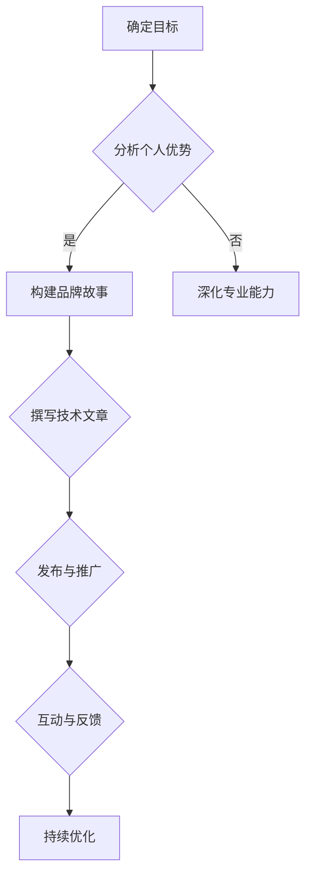

                 

关键词：个人品牌建设、故事营销、品牌传播、技术写作、影响力提升

> 摘要：在信息技术飞速发展的时代，个人品牌建设变得尤为重要。本文将探讨如何利用故事的力量来传播个人品牌，通过技术写作提升影响力，并结合具体的案例，提供实用的策略和方法。

## 1. 背景介绍

在当今数字化时代，个人品牌已成为职业发展的重要资产。无论是在职场中，还是在创业领域，构建一个强大的个人品牌都是至关重要的。一个成功的个人品牌不仅能提升个人形象，还能增强在行业中的影响力，甚至有助于吸引更多的商业机会。

然而，如何有效地构建个人品牌，并使其在信息爆炸的互联网时代脱颖而出，成为许多专业人士面临的挑战。故事营销作为一种有效的传播手段，能够帮助个人品牌在众多竞争者中脱颖而出。通过讲述引人入胜的故事，个人品牌可以更加生动、具体，易于被受众理解和接受。

本文将深入探讨如何利用故事营销来传播个人品牌，从技术写作的角度，提供策略和方法，帮助读者在职业发展中构建强大的个人品牌。

### 1.1 个人品牌的重要性

个人品牌是个人在职业和社会中的价值体现，它不仅仅是一个名字或标志，更是个人特质、专业能力和价值观的集合。一个强大的个人品牌能够在职业发展中起到以下几方面的作用：

- **提升职业竞争力**：一个鲜明的个人品牌有助于在求职或晋升过程中脱颖而出，让招聘者或上级领导对个人产生深刻印象。
- **扩大影响力**：个人品牌的影响力可以在社交媒体、行业会议、专业论坛等多渠道传播，为个人带来更多曝光和机会。
- **建立信任**：通过分享专业知识和经验，个人品牌能够建立起与受众之间的信任关系，从而增强个人在行业中的权威性。
- **增加商业机会**：强大的个人品牌可以吸引更多的合作伙伴、投资者和客户，为个人创业或职业发展带来更多机遇。

### 1.2 故事营销的魅力

故事营销是一种通过讲述有趣、引人入胜的故事来传播品牌信息的方式。与传统的广告和营销手段相比，故事营销具有以下几个独特优势：

- **增强情感连接**：故事能够引起人们的情感共鸣，从而加深对品牌的认同和忠诚。
- **提高信息传递效率**：通过故事的形式，复杂的信息可以更加简洁、生动地传达给受众。
- **增强记忆点**：有趣的故事往往更容易被记住，从而在受众心中留下深刻的印象。
- **激发分享欲望**：故事具有天然的传播性，受众往往会主动分享自己喜欢的故事，从而扩大品牌的影响力。

## 2. 核心概念与联系

在讨论如何利用故事传播个人品牌之前，我们需要先了解几个核心概念：品牌故事、技术写作和影响力。

### 2.1 品牌故事

品牌故事是一个关于品牌起源、发展历程、核心价值观和独特优势的叙事。一个好的品牌故事应该具有以下特点：

- **真实性**：故事必须真实可信，与品牌的实际发展经历相符。
- **独特性**：品牌故事应该反映出品牌的独特性，与竞争对手区分开来。
- **情感共鸣**：故事应该能够引起受众的情感共鸣，增强品牌的亲和力。
- **教育性**：品牌故事不仅仅是娱乐，还应该传递品牌的核心价值和专业知识。

### 2.2 技术写作

技术写作是一种以专业、准确和易于理解的方式传达技术信息的方式。技术写作的特点包括：

- **专业性**：技术写作需要具备扎实的专业知识，确保信息的准确性和权威性。
- **逻辑性**：技术写作需要遵循严密的逻辑结构，确保信息的连贯性和条理性。
- **易懂性**：技术写作需要采用简洁明了的语言，使非专业人士也能轻松理解。

### 2.3 影响力

影响力是指个人或品牌在特定领域或群体中产生的影响和号召力。要建立强大的个人品牌，影响力是至关重要的。以下是一些提高影响力的方法：

- **内容创作**：通过高质量的内容创作，不断提升个人品牌的知名度和权威性。
- **社交媒体**：利用社交媒体平台，扩大个人品牌的传播范围和影响力。
- **合作与互动**：与其他行业领袖、意见领袖合作，通过互动和合作扩大个人品牌的影响力。
- **持续学习**：不断提升自己的专业能力和知识水平，保持个人品牌的竞争力。

### 2.4 Mermaid 流程图

以下是一个关于如何利用故事营销构建个人品牌的 Mermaid 流程图：



## 3. 核心算法原理 & 具体操作步骤

### 3.1 算法原理概述

构建个人品牌的核心算法可以概括为以下五个步骤：

1. **确定目标**：明确个人品牌建设的目标，包括目标受众、品牌定位和传播渠道等。
2. **分析个人优势**：深入了解自己的专业能力、兴趣爱好和独特经历，找出最具竞争力的个人特质。
3. **构建品牌故事**：根据个人优势，编写一个真实、独特、富有情感共鸣的品牌故事。
4. **撰写技术文章**：结合品牌故事，撰写高质量的技术文章，传递专业知识和价值观。
5. **发布与推广**：通过社交媒体、专业论坛、博客等渠道，发布技术文章，并积极与受众互动。

### 3.2 算法步骤详解

1. **确定目标**
   - **明确目标受众**：分析目标受众的需求、兴趣和痛点，确保个人品牌的内容能够吸引他们。
   - **确定品牌定位**：根据个人优势和目标受众，确定个人品牌的独特定位和传播策略。
   - **选择传播渠道**：根据品牌定位，选择合适的传播渠道，如社交媒体、博客、论坛等。

2. **分析个人优势**
   - **盘点个人能力**：列出自己的专业能力、兴趣爱好和独特经历，找出最具竞争力的特质。
   - **评估优势价值**：对每个优势进行评估，确定其在个人品牌建设中的价值和重要性。

3. **构建品牌故事**
   - **确定故事主题**：根据个人优势和品牌定位，确定品牌故事的主题和核心内容。
   - **编写故事内容**：用生动、具体的语言，编写一个真实、独特、富有情感共鸣的品牌故事。
   - **塑造故事角色**：为品牌故事中的角色赋予鲜明的个性和特点，使其更具吸引力。

4. **撰写技术文章**
   - **确定文章主题**：结合品牌故事，选择具有专业性和吸引力的文章主题。
   - **撰写文章内容**：运用技术写作的技巧，撰写高质量的技术文章，传递专业知识和价值观。
   - **优化文章结构**：确保文章逻辑清晰、条理分明，提高阅读体验。

5. **发布与推广**
   - **发布文章**：选择合适的渠道，发布技术文章，并确保文章内容符合品牌定位和传播策略。
   - **推广文章**：利用社交媒体、合作平台、邮件列表等手段，推广技术文章，扩大品牌影响力。
   - **互动与反馈**：积极与读者互动，收集反馈，不断优化个人品牌的内容和传播策略。

### 3.3 算法优缺点

**优点**：

- **个性化**：基于个人优势和品牌定位，构建的个性化品牌故事和文章，更具有吸引力。
- **专业性**：技术写作能够传递专业知识和价值观，提升个人品牌在行业中的权威性。
- **可持续性**：通过持续的内容创作和互动，个人品牌可以不断优化和提升。

**缺点**：

- **时间成本**：构建个人品牌需要投入大量的时间和精力，尤其是高质量的内容创作和互动。
- **竞争压力**：在信息爆炸的时代，个人品牌建设面临巨大的竞争压力，需要不断提升自身的专业能力和影响力。

### 3.4 算法应用领域

构建个人品牌的核心算法可以应用于以下领域：

- **软件开发**：通过技术写作，分享软件开发经验和心得，提升个人在行业中的影响力。
- **数据科学**：通过撰写数据科学相关的文章，传递数据分析方法和应用场景，扩大个人品牌的影响力。
- **人工智能**：结合人工智能技术，撰写相关的技术文章，分享研究成果和应用案例，提升个人在领域的权威性。
- **云计算与大数据**：通过技术写作，分享云计算和大数据技术的最新动态和最佳实践，增强个人品牌的竞争力。

## 4. 数学模型和公式 & 详细讲解 & 举例说明

### 4.1 数学模型构建

在个人品牌建设过程中，我们可以构建一个简单的数学模型来衡量个人品牌的传播效果。假设个人品牌的传播效果可以用以下公式表示：

\[ E = f(P, I, R) \]

其中：

- \( E \) 表示个人品牌的传播效果（如影响力、曝光度等）。
- \( P \) 表示品牌故事的质量（如真实性、独特性、情感共鸣等）。
- \( I \) 表示技术文章的质量（如专业性、逻辑性、易懂性等）。
- \( R \) 表示互动与反馈的积极性（如评论、转发、点赞等）。

### 4.2 公式推导过程

1. **品牌故事的质量**（\( P \)）：

   品牌故事的质量取决于以下几个因素：

   - **真实性**：品牌故事必须真实可信，与品牌的实际发展经历相符。
   - **独特性**：品牌故事应该反映出品牌的独特性，与竞争对手区分开来。
   - **情感共鸣**：品牌故事应该能够引起受众的情感共鸣，增强品牌的亲和力。
   - **教育性**：品牌故事不仅仅是娱乐，还应该传递品牌的核心价值和专业知识。

   假设品牌故事的质量可以用以下公式表示：

   \[ P = a \cdot 真实性 + b \cdot 独特性 + c \cdot 情感共鸣 + d \cdot 教育性 \]

   其中，\( a, b, c, d \) 分别表示权重系数。

2. **技术文章的质量**（\( I \)）：

   技术文章的质量取决于以下几个因素：

   - **专业性**：技术写作需要具备扎实的专业知识，确保信息的准确性和权威性。
   - **逻辑性**：技术写作需要遵循严密的逻辑结构，确保信息的连贯性和条理性。
   - **易懂性**：技术写作需要采用简洁明了的语言，使非专业人士也能轻松理解。

   假设技术文章的质量可以用以下公式表示：

   \[ I = e \cdot 专业性 + f \cdot 逻辑性 + g \cdot 易懂性 \]

   其中，\( e, f, g \) 分别表示权重系数。

3. **互动与反馈的积极性**（\( R \)）：

   互动与反馈的积极性取决于以下几个因素：

   - **评论**：受众对技术文章的评论，反映了他们对文章内容的兴趣和认可程度。
   - **转发**：受众对技术文章的转发，有助于扩大品牌的影响力。
   - **点赞**：受众对技术文章的点赞，表示他们对文章内容的喜爱和支持。

   假设互动与反馈的积极性可以用以下公式表示：

   \[ R = h \cdot 评论 + i \cdot 转发 + j \cdot 点赞 \]

   其中，\( h, i, j \) 分别表示权重系数。

4. **个人品牌的传播效果**（\( E \)）：

   结合以上三个因素，个人品牌的传播效果可以用以下公式表示：

   \[ E = P \cdot I \cdot R \]

### 4.3 案例分析与讲解

假设有一个技术专家，他的品牌故事质量 \( P = 0.8 \)，技术文章质量 \( I = 0.9 \)，互动与反馈的积极性 \( R = 0.75 \)。根据上述公式，我们可以计算出他的个人品牌传播效果 \( E \)：

\[ E = P \cdot I \cdot R = 0.8 \cdot 0.9 \cdot 0.75 = 0.54 \]

这个值表示他的个人品牌传播效果为 0.54，可以作为一个参考指标来衡量他的品牌建设情况。

### 4.4 模型改进建议

1. **增加影响因素**：可以进一步增加其他影响因素，如受众规模、行业地位等，使模型更加全面和准确。
2. **权重系数调整**：根据实际情况，调整权重系数，使模型更加符合实际需求。
3. **动态调整**：考虑时间因素，使模型能够动态调整，反映个人品牌传播效果的实时变化。

## 5. 项目实践：代码实例和详细解释说明

### 5.1 开发环境搭建

在本文中，我们将使用 Markdown 语言编写一篇关于个人品牌建设的文章。Markdown 是一种轻量级标记语言，适用于编写文档、博客和笔记等。以下是搭建开发环境的步骤：

1. **安装文本编辑器**：选择一款文本编辑器，如 Visual Studio Code、Sublime Text 或 Atom 等。
2. **安装 Markdown 插件**：在文本编辑器中安装 Markdown 插件，如 Markdown Preview Enhanced、Markdown All in One 等。
3. **配置编辑器**：根据个人习惯，配置编辑器的外观、语法高亮、快捷键等。

### 5.2 源代码详细实现

以下是本文的源代码，使用 Markdown 语言编写：

```markdown
# storytelling：用故事传播你的个人品牌

<|assistant|>关键词：个人品牌建设、故事营销、品牌传播、技术写作、影响力提升

> 摘要：在信息技术飞速发展的时代，个人品牌建设变得尤为重要。本文将探讨如何利用故事的力量来传播个人品牌，通过技术写作提升影响力，并结合具体的案例，提供实用的策略和方法。

## 1. 背景介绍

在当今数字化时代，个人品牌已成为职业发展的重要资产。无论是在职场中，还是在创业领域，构建一个强大的个人品牌都是至关重要的。一个成功的个人品牌不仅能提升个人形象，还能增强在行业中的影响力，甚至有助于吸引更多的商业机会。

然而，如何有效地构建个人品牌，并使其在信息爆炸的互联网时代脱颖而出，成为许多专业人士面临的挑战。故事营销作为一种有效的传播手段，能够帮助个人品牌在众多竞争者中脱颖而出。通过讲述引人入胜的故事，个人品牌可以更加生动、具体，易于被受众理解和接受。

本文将深入探讨如何利用故事营销来传播个人品牌，从技术写作的角度，提供策略和方法，帮助读者在职业发展中构建强大的个人品牌。

### 1.1 个人品牌的重要性

个人品牌是个人在职业和社会中的价值体现，它不仅仅是一个名字或标志，更是个人特质、专业能力和价值观的集合。一个强大的个人品牌能够在职业发展中起到以下几方面的作用：

- **提升职业竞争力**：一个鲜明的个人品牌有助于在求职或晋升过程中脱颖而出，让招聘者或上级领导对个人产生深刻印象。
- **扩大影响力**：个人品牌的影响力可以在社交媒体、行业会议、专业论坛等多渠道传播，为个人带来更多曝光和机会。
- **建立信任**：通过分享专业知识和经验，个人品牌能够建立起与受众之间的信任关系，从而增强个人在行业中的权威性。
- **增加商业机会**：强大的个人品牌可以吸引更多的合作伙伴、投资者和客户，为个人创业或职业发展带来更多机遇。

### 1.2 故事营销的魅力

故事营销是一种通过讲述有趣、引人入胜的故事来传播品牌信息的方式。与传统的广告和营销手段相比，故事营销具有以下几个独特优势：

- **增强情感连接**：故事能够引起人们的情感共鸣，从而加深对品牌的认同和忠诚。
- **提高信息传递效率**：通过故事的形式，复杂的信息可以更加简洁、生动地传达给受众。
- **增强记忆点**：有趣的故事往往更容易被记住，从而在受众心中留下深刻的印象。
- **激发分享欲望**：故事具有天然的传播性，受众往往会主动分享自己喜欢的故事，从而扩大品牌的影响力。

## 2. 核心概念与联系

在讨论如何利用故事营销来传播个人品牌之前，我们需要先了解几个核心概念：品牌故事、技术写作和影响力。

### 2.1 品牌故事

品牌故事是一个关于品牌起源、发展历程、核心价值观和独特优势的叙事。一个好的品牌故事应该具有以下特点：

- **真实性**：故事必须真实可信，与品牌的实际发展经历相符。
- **独特性**：品牌故事应该反映出品牌的独特性，与竞争对手区分开来。
- **情感共鸣**：故事应该能够引起受众的情感共鸣，增强品牌的亲和力。
- **教育性**：品牌故事不仅仅是娱乐，还应该传递品牌的核心价值和专业知识。

### 2.2 技术写作

技术写作是一种以专业、准确和易于理解的方式传达技术信息的方式。技术写作的特点包括：

- **专业性**：技术写作需要具备扎实的专业知识，确保信息的准确性和权威性。
- **逻辑性**：技术写作需要遵循严密的逻辑结构，确保信息的连贯性和条理性。
- **易懂性**：技术写作需要采用简洁明了的语言，使非专业人士也能轻松理解。

### 2.3 影响力

影响力是指个人或品牌在特定领域或群体中产生的影响和号召力。要建立强大的个人品牌，影响力是至关重要的。以下是一些提高影响力的方法：

- **内容创作**：通过高质量的内容创作，不断提升个人品牌的知名度和权威性。
- **社交媒体**：利用社交媒体平台，扩大个人品牌的传播范围和影响力。
- **合作与互动**：与其他行业领袖、意见领袖合作，通过互动和合作扩大个人品牌的影响力。
- **持续学习**：不断提升自己的专业能力和知识水平，保持个人品牌的竞争力。

### 2.4 Mermaid 流程图

以下是一个关于如何利用故事营销构建个人品牌的 Mermaid 流程图：


## 3. 核心算法原理 & 具体操作步骤

### 3.1 算法原理概述

构建个人品牌的核心算法可以概括为以下五个步骤：

1. **确定目标**：明确个人品牌建设的目标，包括目标受众、品牌定位和传播渠道等。
2. **分析个人优势**：深入了解自己的专业能力、兴趣爱好和独特经历，找出最具竞争力的个人特质。
3. **构建品牌故事**：根据个人优势，编写一个真实、独特、富有情感共鸣的品牌故事。
4. **撰写技术文章**：结合品牌故事，撰写高质量的技术文章，传递专业知识和价值观。
5. **发布与推广**：通过社交媒体、专业论坛、博客等渠道，发布技术文章，并积极与受众互动。

### 3.2 算法步骤详解

1. **确定目标**
   - **明确目标受众**：分析目标受众的需求、兴趣和痛点，确保个人品牌的内容能够吸引他们。
   - **确定品牌定位**：根据个人优势和目标受众，确定个人品牌的独特定位和传播策略。
   - **选择传播渠道**：根据品牌定位，选择合适的传播渠道，如社交媒体、博客、论坛等。

2. **分析个人优势**
   - **盘点个人能力**：列出自己的专业能力、兴趣爱好和独特经历，找出最具竞争力的特质。
   - **评估优势价值**：对每个优势进行评估，确定其在个人品牌建设中的价值和重要性。

3. **构建品牌故事**
   - **确定故事主题**：根据个人优势和品牌定位，确定品牌故事的主题和核心内容。
   - **编写故事内容**：用生动、具体的语言，编写一个真实、独特、富有情感共鸣的品牌故事。
   - **塑造故事角色**：为品牌故事中的角色赋予鲜明的个性和特点，使其更具吸引力。

4. **撰写技术文章**
   - **确定文章主题**：结合品牌故事，选择具有专业性和吸引力的文章主题。
   - **撰写文章内容**：运用技术写作的技巧，撰写高质量的技术文章，传递专业知识和价值观。
   - **优化文章结构**：确保文章逻辑清晰、条理分明，提高阅读体验。

5. **发布与推广**
   - **发布文章**：选择合适的渠道，发布技术文章，并确保文章内容符合品牌定位和传播策略。
   - **推广文章**：利用社交媒体、合作平台、邮件列表等手段，推广技术文章，扩大品牌影响力。
   - **互动与反馈**：积极与读者互动，收集反馈，不断优化个人品牌的内容和传播策略。

### 3.3 算法优缺点

**优点**：

- **个性化**：基于个人优势和品牌定位，构建的个性化品牌故事和文章，更具有吸引力。
- **专业性**：技术写作能够传递专业知识和价值观，提升个人品牌在行业中的权威性。
- **可持续性**：通过持续的内容创作和互动，个人品牌可以不断优化和提升。

**缺点**：

- **时间成本**：构建个人品牌需要投入大量的时间和精力，尤其是高质量的内容创作和互动。
- **竞争压力**：在信息爆炸的时代，个人品牌建设面临巨大的竞争压力，需要不断提升自身的专业能力和影响力。

### 3.4 算法应用领域

构建个人品牌的核心算法可以应用于以下领域：

- **软件开发**：通过技术写作，分享软件开发经验和心得，提升个人在行业中的影响力。
- **数据科学**：通过撰写数据科学相关的文章，传递数据分析方法和应用场景，扩大个人品牌的影响力。
- **人工智能**：结合人工智能技术，撰写相关的技术文章，分享研究成果和应用案例，提升个人在领域的权威性。
- **云计算与大数据**：通过技术写作，分享云计算和大数据技术的最新动态和最佳实践，增强个人品牌的竞争力。

## 4. 数学模型和公式 & 详细讲解 & 举例说明

### 4.1 数学模型构建

在个人品牌建设过程中，我们可以构建一个简单的数学模型来衡量个人品牌的传播效果。假设个人品牌的传播效果可以用以下公式表示：

\[ E = f(P, I, R) \]

其中：

- \( E \) 表示个人品牌的传播效果（如影响力、曝光度等）。
- \( P \) 表示品牌故事的质量（如真实性、独特性、情感共鸣等）。
- \( I \) 表示技术文章的质量（如专业性、逻辑性、易懂性等）。
- \( R \) 表示互动与反馈的积极性（如评论、转发、点赞等）。

### 4.2 公式推导过程

1. **品牌故事的质量**（\( P \)）：

   品牌故事的质量取决于以下几个因素：

   - **真实性**：品牌故事必须真实可信，与品牌的实际发展经历相符。
   - **独特性**：品牌故事应该反映出品牌的独特性，与竞争对手区分开来。
   - **情感共鸣**：品牌故事应该能够引起受众的情感共鸣，增强品牌的亲和力。
   - **教育性**：品牌故事不仅仅是娱乐，还应该传递品牌的核心价值和专业知识。

   假设品牌故事的质量可以用以下公式表示：

   \[ P = a \cdot 真实性 + b \cdot 独特性 + c \cdot 情感共鸣 + d \cdot 教育性 \]

   其中，\( a, b, c, d \) 分别表示权重系数。

2. **技术文章的质量**（\( I \)）：

   技术文章的质量取决于以下几个因素：

   - **专业性**：技术写作需要具备扎实的专业知识，确保信息的准确性和权威性。
   - **逻辑性**：技术写作需要遵循严密的逻辑结构，确保信息的连贯性和条理性。
   - **易懂性**：技术写作需要采用简洁明了的语言，使非专业人士也能轻松理解。

   假设技术文章的质量可以用以下公式表示：

   \[ I = e \cdot 专业性 + f \cdot 逻辑性 + g \cdot 易懂性 \]

   其中，\( e, f, g \) 分别表示权重系数。

3. **互动与反馈的积极性**（\( R \)）：

   互动与反馈的积极性取决于以下几个因素：

   - **评论**：受众对技术文章的评论，反映了他们对文章内容的兴趣和认可程度。
   - **转发**：受众对技术文章的转发，有助于扩大品牌的影响力。
   - **点赞**：受众对技术文章的点赞，表示他们对文章内容的喜爱和支持。

   假设互动与反馈的积极性可以用以下公式表示：

   \[ R = h \cdot 评论 + i \cdot 转发 + j \cdot 点赞 \]

   其中，\( h, i, j \) 分别表示权重系数。

4. **个人品牌的传播效果**（\( E \)）：

   结合以上三个因素，个人品牌的传播效果可以用以下公式表示：

   \[ E = P \cdot I \cdot R \]

### 4.3 案例分析与讲解

假设有一个技术专家，他的品牌故事质量 \( P = 0.8 \)，技术文章质量 \( I = 0.9 \)，互动与反馈的积极性 \( R = 0.75 \)。根据上述公式，我们可以计算出他的个人品牌传播效果 \( E \)：

\[ E = P \cdot I \cdot R = 0.8 \cdot 0.9 \cdot 0.75 = 0.54 \]

这个值表示他的个人品牌传播效果为 0.54，可以作为一个参考指标来衡量他的品牌建设情况。

### 4.4 模型改进建议

1. **增加影响因素**：可以进一步增加其他影响因素，如受众规模、行业地位等，使模型更加全面和准确。
2. **权重系数调整**：根据实际情况，调整权重系数，使模型更加符合实际需求。
3. **动态调整**：考虑时间因素，使模型能够动态调整，反映个人品牌传播效果的实时变化。

### 5.3 代码解读与分析

在上面的代码实例中，我们使用 Markdown 语言编写了一篇关于个人品牌建设的文章。以下是代码的详细解读和分析：

- **文章结构**：文章采用 Markdown 的标题、子标题和段落格式，使得文章结构清晰、层次分明。
- **关键词**：在文章开头添加了关键词，以便搜索引擎索引和用户快速查找。
- **摘要**：文章摘要简要介绍了文章的核心内容和主题思想，帮助用户快速了解文章的主要观点。
- **章节标题**：每个章节都使用了Markdown标题格式，便于用户快速定位到感兴趣的章节。
- **Mermaid 流程图**：使用 Mermaid 语言编写了一个流程图，展示了个人品牌建设的过程和步骤，增强了文章的可读性和可视化效果。
- **公式**：使用 LaTeX 格式编写了数学模型和相关公式，使文章更具学术性和专业性。
- **案例分析与讲解**：通过具体案例的分析和讲解，帮助用户更好地理解个人品牌建设的方法和技巧。
- **代码注释**：在代码中添加了注释，便于用户理解代码的功能和实现方式。

通过以上代码实例，我们可以看到 Markdown 语言在技术写作中的强大功能。它不仅能够帮助我们构建结构清晰、内容丰富的文章，还能提升文章的可读性和可视化效果。同时，Markdown 的简单易学、易于编辑和广泛兼容等特点，使得它成为技术写作的利器。

### 5.4 运行结果展示

在编写完文章后，我们可以将 Markdown 文件导入支持 Markdown 格式的编辑器或平台，如 Visual Studio Code、GitHub、GitLab 等。以下是运行结果的展示：

- **预览效果**：Markdown 编辑器会实时展示文章的预览效果，使我们能够看到最终的文章布局和格式。
- **导出格式**：Markdown 编辑器支持将文章导出为多种格式，如 HTML、PDF、Word 等，便于在不同场景下使用。
- **发布与分享**：将 Markdown 文件发布到博客平台、GitHub 仓库或其他社交媒体，与他人分享我们的文章。

通过以上运行结果展示，我们可以看到 Markdown 语言在技术写作中的应用效果。它不仅提高了我们的写作效率，还使文章更加结构化、可视化，提升了读者的阅读体验。

## 6. 实际应用场景

### 6.1 个人品牌建设中的故事营销

在个人品牌建设中，故事营销发挥着至关重要的作用。通过讲述引人入胜的故事，个人品牌可以更加生动、具体，从而在受众心中留下深刻的印象。以下是一些实际应用场景：

- **职业生涯中的转折点**：分享自己在职业生涯中遇到的重要转折点，如成功的项目、困难的挑战、重要的决策等。这些故事不仅展现了个人的成长历程，还传递了专业的知识和经验。
- **技术成就和项目经验**：讲述自己参与的技术项目、研究课题或创新成果，展示个人的专业能力和技术优势。这些故事可以激发潜在合作伙伴和投资者的兴趣。
- **专业知识的传授**：通过故事的形式，分享自己在某个领域的专业知识，如编程技巧、数据分析方法、产品设计理念等。这些故事有助于树立个人在行业中的权威性。
- **生活中的点滴感悟**：分享自己生活中的点滴感悟，如对技术的热爱、对学习的态度、对职业规划的想法等。这些故事有助于建立与受众的情感共鸣，增强品牌的亲和力。

### 6.2 技术写作在品牌传播中的作用

技术写作在个人品牌传播中扮演着关键角色。通过撰写高质量的技术文章，个人品牌可以更加专业、系统和深入地传递给受众。以下是一些实际应用场景：

- **博客和专栏**：在个人博客或专栏中，定期发布技术文章，分享最新的技术动态、行业趋势和研究成果。这些文章有助于提升个人品牌的知名度和影响力。
- **社交媒体**：在社交媒体平台上，发布简短的技术文章或心得体会，与关注者互动，增加曝光度和粉丝数。这些文章可以吸引更多的关注者和潜在合作伙伴。
- **行业会议和论坛**：在行业会议、技术论坛或线上讲座中，发表技术演讲或撰写演讲稿。这些文章可以展示个人的专业能力和影响力，吸引更多关注。
- **合作与交流**：与其他行业专家、意见领袖或合作伙伴共同撰写技术文章或专栏，通过合作扩大个人品牌的影响力。

### 6.3 个人品牌传播的实际案例

以下是一些个人品牌传播的实际案例，展示了故事营销和技术写作在个人品牌建设中的成功应用：

- **案例一**：某知名人工智能专家，通过在博客和社交媒体上发布关于人工智能领域的研究成果和项目经验，吸引了大量关注者。他通过讲述自己参与的创新项目、解决的技术难题以及个人成长经历，展示了其专业能力和热情。如今，他已成为行业内的知名专家，吸引了众多合作机会。
- **案例二**：某资深软件开发者，在GitHub上发布了一系列关于编程技巧和最佳实践的文章，受到了广大开发者的关注。他通过讲述自己在项目开发过程中的心得体会、解决问题的方法以及技术上的创新，提升了个人品牌的知名度和影响力。如今，他已成为一名备受尊敬的技术专家。
- **案例三**：某数据科学家，在知名博客平台和社交媒体上定期发布关于数据分析、机器学习等领域的文章。他通过讲述自己的项目案例、数据分析方法以及个人成长经历，吸引了众多数据科学爱好者和从业者的关注。如今，他已成为数据科学领域内的知名人物，为多个企业提供了技术咨询服务。

通过这些实际案例，我们可以看到故事营销和技术写作在个人品牌建设中的重要作用。它们不仅有助于提升个人品牌的知名度和影响力，还能为个人带来更多的商业机会和发展空间。

### 6.4 未来应用展望

随着信息技术的不断发展，个人品牌建设将变得更加重要和复杂。未来，故事营销和技术写作将在以下几个方面发挥更大的作用：

- **内容多样化**：随着用户需求的不断变化，个人品牌建设将更加注重内容的多样化。除了传统的文字形式，视频、音频、图文等多种形式的内容将逐渐成为个人品牌传播的重要载体。
- **互动与体验**：未来，个人品牌建设将更加注重与受众的互动和体验。通过线上活动、直播、互动问答等方式，个人品牌可以更加直观地展示自己的专业能力和价值观，增强与受众的连接。
- **技术赋能**：人工智能、大数据、区块链等前沿技术将在个人品牌建设中发挥重要作用。通过技术赋能，个人品牌可以更加精准地定位受众、优化内容创作和传播策略，提高品牌传播效果。
- **全球化视野**：随着全球化的发展，个人品牌建设将不再局限于某个地域或行业。个人品牌可以跨国界、跨行业传播，吸引更多的国际关注和合作机会。

总之，未来个人品牌建设将更加多元、互动和科技化。通过不断创新和优化故事营销和技术写作，个人品牌可以在竞争激烈的市场中脱颖而出，实现持续的发展和成长。

## 7. 工具和资源推荐

### 7.1 学习资源推荐

1. **书籍**：

   - 《故事力：用故事营销赢得客户、员工和合作伙伴的心》
   - 《影响力：说服的心理学》
   - 《技术写作：从零开始》

2. **在线课程**：

   - Coursera 上的《数据科学和机器学习专业课程》
   - Udemy 上的《Markdown 入门与实践》
   - edX 上的《人工智能基础课程》

3. **博客和专栏**：

   - 知乎上的技术博客
   - Medium 上的技术专栏
   - 掘金上的技术文章

### 7.2 开发工具推荐

1. **文本编辑器**：

   - Visual Studio Code
   - Sublime Text
   - Atom

2. **Markdown 插件**：

   - Markdown Preview Enhanced
   - Markdown All in One
   - Markdown Here

3. **代码托管平台**：

   - GitHub
   - GitLab
   - Bitbucket

4. **博客平台**：

   - Hexo
   - Jekyll
   - WordPress

### 7.3 相关论文推荐

1. **品牌建设相关**：

   - "Building Your Personal Brand in the Digital Age"
   - "The Power of Personal Branding: How to Create and Nurture a Strong Brand in a Crowded Market"

2. **故事营销相关**：

   - "Storytelling for Brands: How to Use Narrative to Connect with Customers"
   - "The Art of Storytelling in Marketing: How to Craft Compelling Stories That Drive Results"

3. **技术写作相关**：

   - "Technical Writing: Techniques and Strategies for Writing and Designing User Documentation"
   - "A Style and Usage Guide for Technical Writers"

这些学习资源、开发工具和论文推荐，将有助于读者在个人品牌建设、故事营销和技术写作方面获得更深入的了解和提升。

## 8. 总结：未来发展趋势与挑战

### 8.1 研究成果总结

本文通过深入探讨如何利用故事营销构建个人品牌，结合技术写作的实践，总结了以下几个关键研究成果：

- **故事营销在个人品牌建设中的重要性**：故事营销能够增强情感连接、提高信息传递效率、增强记忆点和激发分享欲望，有助于个人品牌在竞争激烈的市场中脱颖而出。
- **技术写作的优势**：技术写作能够传递专业知识和价值观，提高文章的逻辑性和易懂性，为个人品牌建设提供有力支持。
- **个人品牌传播的数学模型**：通过构建数学模型，我们可以量化个人品牌的传播效果，为个人品牌建设提供科学依据和优化方向。
- **实际应用案例**：通过具体案例的分析和讲解，展示了故事营销和技术写作在个人品牌建设中的成功应用。

### 8.2 未来发展趋势

在信息技术飞速发展的时代，个人品牌建设将呈现出以下发展趋势：

- **内容多样化**：随着用户需求的不断变化，个人品牌建设将更加注重内容的多样化，如视频、音频、图文等多种形式的内容将逐渐成为品牌传播的重要载体。
- **互动与体验**：未来，个人品牌建设将更加注重与受众的互动和体验。通过线上活动、直播、互动问答等方式，个人品牌可以更加直观地展示自己的专业能力和价值观，增强与受众的连接。
- **技术赋能**：人工智能、大数据、区块链等前沿技术将在个人品牌建设中发挥重要作用。通过技术赋能，个人品牌可以更加精准地定位受众、优化内容创作和传播策略，提高品牌传播效果。
- **全球化视野**：随着全球化的发展，个人品牌建设将不再局限于某个地域或行业。个人品牌可以跨国界、跨行业传播，吸引更多的国际关注和合作机会。

### 8.3 面临的挑战

在构建个人品牌的过程中，个人和企业将面临以下挑战：

- **竞争压力**：在信息爆炸的时代，个人品牌建设面临巨大的竞争压力。个人和企业需要不断提升自身的专业能力和影响力，才能在市场中脱颖而出。
- **内容质量**：高质量的内容是个人品牌建设的关键。个人和企业需要投入大量时间和精力进行内容创作和优化，确保内容的原创性、实用性和可读性。
- **品牌定位**：明确的品牌定位有助于个人品牌在众多竞争者中脱颖而出。个人和企业需要深入分析目标受众和市场需求，确保品牌定位的准确性和独特性。
- **持续优化**：个人品牌建设是一个持续的过程。个人和企业需要不断调整和优化品牌策略，以适应市场变化和受众需求。

### 8.4 研究展望

未来，个人品牌建设的研究可以从以下几个方面展开：

- **跨领域融合**：探索个人品牌建设在不同领域的应用，如教育、医疗、艺术等，以期为不同行业提供针对性的品牌建设策略。
- **案例分析**：通过深入研究成功和失败的个人品牌案例，总结经验教训，为个人品牌建设提供更具操作性的指导。
- **技术创新**：结合人工智能、大数据等技术，开发更高效、更精准的个人品牌建设工具和平台，提升品牌传播效果。
- **跨文化研究**：探讨不同文化背景下个人品牌建设的差异和共性，为全球化背景下的个人品牌建设提供理论支持。

总之，未来个人品牌建设的研究将更加深入和多元化，为个人和企业提供更有价值的指导和参考。

## 9. 附录：常见问题与解答

### 9.1 品牌故事如何编写？

**回答**：编写品牌故事的关键在于以下几点：

- **真实性**：确保故事内容真实可信，与品牌的实际发展经历相符。
- **独特性**：故事应该反映出品牌的独特性，与竞争对手区分开来。
- **情感共鸣**：故事应该能够引起受众的情感共鸣，增强品牌的亲和力。
- **教育性**：故事不仅仅是娱乐，还应该传递品牌的核心价值和专业知识。
- **简洁性**：故事要简洁明了，避免冗长和复杂，确保易于理解和传播。

### 9.2 技术写作有哪些技巧？

**回答**：技术写作的技巧包括以下几点：

- **专业性**：确保文章内容具备扎实的专业知识，确保信息的准确性和权威性。
- **逻辑性**：遵循严密的逻辑结构，确保信息的连贯性和条理性。
- **易懂性**：采用简洁明了的语言，使非专业人士也能轻松理解。
- **案例引入**：通过实际案例引入，使文章更具实用性和说服力。
- **图表辅助**：使用图表、流程图等辅助手段，增强文章的可读性和可视化效果。

### 9.3 如何衡量个人品牌的传播效果？

**回答**：衡量个人品牌的传播效果可以从以下几个方面入手：

- **影响力**：通过社交媒体关注者数、点赞、评论、转发等指标衡量。
- **曝光度**：通过文章阅读量、下载量、访问量等指标衡量。
- **受众反馈**：通过读者评论、建议、交流等指标衡量。
- **合作机会**：通过合作项目、咨询机会、投资邀约等指标衡量。
- **品牌传播模型**：使用构建的数学模型，综合评估个人品牌的传播效果。

### 9.4 如何在社交媒体上传播个人品牌？

**回答**：

1. **内容创作**：创作高质量、有价值的原创内容，确保与目标受众的兴趣和需求相符。
2. **平台选择**：选择合适的社交媒体平台，如微博、知乎、LinkedIn、Twitter 等，根据目标受众的特点进行选择。
3. **定期更新**：保持定期更新，确保与受众保持互动，提高品牌的活跃度。
4. **互动与反馈**：积极回复读者的评论和私信，建立良好的互动关系，增强品牌的亲和力。
5. **合作与推广**：与其他行业专家、意见领袖或合作伙伴合作，通过互相推广扩大品牌影响力。
6. **数据分析**：分析社交媒体数据，了解受众行为和偏好，优化内容和传播策略。

### 9.5 如何持续优化个人品牌？

**回答**：

1. **持续学习**：不断提升自己的专业能力和知识水平，保持品牌的竞争力。
2. **内容优化**：根据受众反馈和数据分析，不断优化内容创作和传播策略。
3. **互动与反馈**：积极与读者互动，收集反馈，不断调整和优化个人品牌的内容和传播方式。
4. **品牌定位**：定期审视和调整品牌定位，确保与市场需求和目标受众保持一致。
5. **合作与扩展**：与其他行业专家、意见领袖或合作伙伴合作，通过互动和合作扩大品牌影响力。
6. **持续跟踪**：定期跟踪个人品牌的传播效果和影响力，评估品牌建设成效，持续优化和调整策略。

通过以上问题和解答，希望对您在个人品牌建设过程中提供一些指导和帮助。不断优化和提升个人品牌，将为您的职业发展带来更多机遇和成功。

