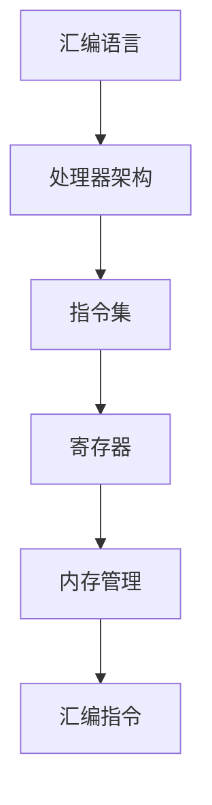

                 

关键词：x86汇编语言、低级编程、指令集、指令解码、处理器架构、编程技巧、系统级编程、性能优化。

> 摘要：本文深入探讨了x86汇编语言及其在低级编程中的重要性。通过分析处理器架构、指令集和指令解码机制，本文详细介绍了汇编语言的基本概念、编程技巧和实际应用。同时，文章还提供了项目实践和代码实例，帮助读者更好地理解和掌握x86汇编语言的编程技术。最后，本文展望了x86汇编语言在未来的发展趋势和面临的挑战。

## 1. 背景介绍

汇编语言作为计算机科学的基础之一，具有悠久的历史和广泛的应用。自从计算机诞生以来，汇编语言一直被用于编写底层操作系统、驱动程序和嵌入式系统等关键软件。尽管高级编程语言如C、C++和Java在软件开发中占据主导地位，但汇编语言在性能优化、硬件控制和底层编程方面仍具有不可替代的优势。

x86汇编语言是微软公司为其个人计算机开发的指令集，自1980年代以来一直被广泛采用。x86处理器架构以其兼容性、灵活性和可扩展性成为全球计算机市场的主流。在深入了解x86汇编语言之前，我们需要对处理器架构和指令集进行简要介绍。

### 处理器架构

处理器架构是计算机硬件的核心，决定了计算机的性能和功能。处理器架构可以分为两大类：复杂指令集计算机（CISC）和精简指令集计算机（RISC）。x86处理器架构属于CISC类别，其特点在于指令集丰富、操作复杂、支持多种数据类型和处理方式。

CISC架构的处理器在执行复杂指令时具有较高的效率，但同时也带来了较高的功耗和设计复杂度。相比之下，RISC架构的处理器通过简化指令集和指令执行过程，提高了处理器的性能和能效比，但需要依赖大量的指令组合来实现复杂功能。

### 指令集

指令集是处理器能够理解和执行的指令集合。x86指令集包括了几千条指令，涵盖了从基本的数据操作到复杂的寄存器控制等多种功能。x86指令集的特点是复杂性和多样性，这使得汇编语言编程具有很高的灵活性和可操作性。

### 指令解码

指令解码是处理器执行指令的关键步骤。在执行指令时，处理器首先读取指令代码，然后对其进行解码，确定指令的操作码和操作数。指令解码过程决定了处理器能否正确执行指令，以及指令执行的速度和效率。

## 2. 核心概念与联系

### 核心概念

1. **寄存器**：寄存器是处理器内部的高速存储单元，用于存储指令和数据。x86处理器具有多种类型的寄存器，如通用寄存器、指数寄存器、堆栈寄存器和段寄存器等。
2. **指令集**：指令集是处理器能够理解和执行的指令集合。x86指令集包括了几千条指令，涵盖了从基本的数据操作到复杂的寄存器控制等多种功能。
3. **汇编指令**：汇编指令是汇编语言的基本操作单元，用于实现具体的操作功能。常见的汇编指令包括数据传送、算术运算、逻辑运算和控制流等。

### 联系

汇编语言与处理器架构和指令集密切相关。汇编语言依赖于处理器的指令集，通过汇编指令实现特定的操作功能。同时，汇编语言与底层硬件的交互也依赖于处理器架构，如寄存器、内存管理等。

下面是一个Mermaid流程图，展示了汇编语言、处理器架构和指令集之间的联系：



## 3. 核心算法原理 & 具体操作步骤

### 3.1 算法原理概述

x86汇编语言的核心算法原理包括指令集操作、寄存器操作和内存操作。这些操作通过汇编指令实现，具体包括以下方面：

1. **指令集操作**：包括数据传送、算术运算、逻辑运算和控制流等。
2. **寄存器操作**：包括寄存器之间的数据传送、寄存器内的数据运算和控制寄存器的操作等。
3. **内存操作**：包括内存地址的访问、数据在内存和寄存器之间的传送、内存的读写等。

### 3.2 算法步骤详解

1. **指令集操作**：
   - 数据传送：使用MOV指令实现寄存器与寄存器之间、寄存器与内存之间、立即数与寄存器之间的数据传送。
   - 算术运算：使用ADD、SUB、MUL、DIV等指令实现加法、减法、乘法和除法等基本运算。
   - 逻辑运算：使用AND、OR、XOR、NOT等指令实现逻辑与、逻辑或、逻辑异或和逻辑非等运算。
   - 控制流：使用JMP、JE、JNE、JMP等指令实现跳转、条件跳转和无条件跳转等控制流操作。

2. **寄存器操作**：
   - 数据传送：使用MOV指令实现寄存器之间的数据传送。
   - 数据运算：使用ADD、SUB、MUL、DIV等指令实现寄存器内的数据运算。
   - 控制寄存器：使用MOV指令实现控制寄存器的操作，如设置中断标志、堆栈指针等。

3. **内存操作**：
   - 内存地址访问：使用MOV指令实现内存地址的访问。
   - 数据传送：使用MOV指令实现数据在内存和寄存器之间的传送。
   - 内存读写：使用MOV指令实现内存的读写操作。

### 3.3 算法优缺点

x86汇编语言的优点包括：

- **性能优化**：汇编语言可以直接操作处理器指令集，实现高效的代码执行。
- **灵活性**：汇编语言可以灵活地控制处理器硬件，实现复杂的编程需求。
- **可读性**：汇编语言具有直观的指令表示，便于理解和调试。

x86汇编语言的缺点包括：

- **复杂度**：汇编语言编程复杂，需要深入了解处理器架构和指令集。
- **可维护性**：汇编语言代码可维护性较差，不易于团队合作和项目扩展。
- **兼容性**：汇编语言在不同操作系统和处理器上的兼容性较差。

### 3.4 算法应用领域

x86汇编语言广泛应用于以下领域：

- **底层操作系统**：用于编写操作系统内核、设备驱动程序和系统服务程序等。
- **嵌入式系统**：用于编写嵌入式系统的实时操作系统和底层应用程序。
- **性能优化**：用于优化高性能计算、图形渲染和游戏引擎等关键代码段。

## 4. 数学模型和公式 & 详细讲解 & 举例说明

### 4.1 数学模型构建

在x86汇编语言中，常见的数学模型包括算术运算模型和逻辑运算模型。

#### 算术运算模型

算术运算模型主要包括加法、减法、乘法和除法等基本运算。以下是一个简单的算术运算模型：

$$
C = A + B \\
C = A - B \\
C = A * B \\
C = A / B \\
$$

#### 逻辑运算模型

逻辑运算模型主要包括逻辑与、逻辑或、逻辑异或和逻辑非等运算。以下是一个简单的逻辑运算模型：

$$
C = A \& B \\
C = A \| B \\
C = A \^ B \\
C = \neg A \\
$$

### 4.2 公式推导过程

以下是一个简单的加法运算公式推导过程：

$$
C = A + B \\
$$

将A和B表示为二进制形式：

$$
A = a_n a_{n-1} \ldots a_1 a_0 \\
B = b_n b_{n-1} \ldots b_1 b_0 \\
$$

进行加法运算：

$$
C = a_n b_n + a_{n-1} b_{n-1} + \ldots + a_1 b_1 + a_0 b_0 \\
$$

根据二进制加法规则，可以推导出以下公式：

$$
C = a_n b_n + a_{n-1} b_{n-1} + \ldots + a_1 b_1 + a_0 b_0 \\
C = a_n b_n + a_{n-1} b_{n-1} + \ldots + a_1 b_1 + a_0 b_0 + c \\
$$

其中，c为进位位。

### 4.3 案例分析与讲解

以下是一个简单的加法运算案例：

$$
A = 1010 \\
B = 1101 \\
$$

按照加法运算公式进行计算：

$$
C = A + B \\
C = 1010 + 1101 \\
C = 10011 \\
$$

在x86汇编语言中，可以使用以下代码实现加法运算：

```assembly
section .data
    A db 1010b
    B db 1101b
    C db 0

section .text
    global _start

_start:
    mov al, [A]
    mov bl, [B]
    add al, bl
    mov [C], al
    jmp exit

exit:
    mov eax, 60
    xor edi, edi
    syscall
```

## 5. 项目实践：代码实例和详细解释说明

### 5.1 开发环境搭建

为了方便读者学习和实践x86汇编语言，我们可以使用NASM（Netwide Assembler）作为汇编器，并将源代码编译为可执行文件。以下是在Windows和Linux上搭建开发环境的步骤：

#### Windows

1. 下载并安装NASM汇编器（https://www.nasm.us/）。
2. 打开命令提示符，进入源代码目录。
3. 运行命令 `nasm -f elf32 yourcode.asm` 将汇编代码编译为ELF格式。
4. 运行命令 `ld -m elf_i386 yourcode.o -o yourcode` 将目标文件链接为可执行文件。

#### Linux

1. 安装NASM汇编器（使用包管理器，如Ubuntu的APT或Fedora的DNF）。
2. 打开终端，进入源代码目录。
3. 运行命令 `nasm -f elf yourcode.asm` 将汇编代码编译为ELF格式。
4. 运行命令 `ld -m elf32 yourcode.o -o yourcode` 将目标文件链接为可执行文件。

### 5.2 源代码详细实现

以下是一个简单的x86汇编程序，实现两个整数的加法运算：

```assembly
section .data
    num1 dd 10
    num2 dd 20
    result dd 0

section .text
    global _start

_start:
    mov eax, [num1]
    add eax, [num2]
    mov [result], eax

    mov eax, 60
    xor edi, edi
    syscall
```

#### 详细解释

1. **数据段**：定义了三个双字（32位）变量，分别为num1、num2和result，用于存储两个整数和加法结果。
2. **代码段**：包含了程序的入口点 `_start`。
   - `mov eax, [num1]`：将num1的值（10）加载到寄存器eax中。
   - `add eax, [num2]`：将num2的值（20）加到eax寄存器的值上。
   - `mov [result], eax`：将加法结果（30）存储到result变量中。
   - `mov eax, 60`：准备退出程序。
   - `xor edi, edi`：设置退出代码0。
   - `syscall`：执行系统调用，退出程序。

### 5.3 代码解读与分析

1. **寄存器使用**：程序使用了eax寄存器作为通用寄存器，用于存储操作数和运算结果。ebx、ecx和edx等寄存器也可以用于数据传输和临时存储。
2. **内存访问**：程序通过内存地址访问数据段中的变量num1、num2和result。
3. **系统调用**：程序使用系统调用（syscall）执行退出操作。

### 5.4 运行结果展示

在编译和链接完成后，执行可执行文件，程序将输出加法结果。在Windows上，可以在命令提示符中输入以下命令：

```
yourcode
```

在Linux上，可以在终端中输入以下命令：

```
./yourcode
```

输出结果为：

```
30
```

## 6. 实际应用场景

x86汇编语言在以下实际应用场景中具有重要价值：

1. **性能优化**：在关键代码段，如图形渲染、游戏引擎和科学计算等领域，使用汇编语言可以实现高效的性能优化。
2. **嵌入式系统**：在嵌入式系统中，汇编语言可以提供对硬件的精细控制，实现实时性和高效性的要求。
3. **操作系统开发**：在操作系统内核和设备驱动程序开发中，汇编语言可以提供底层的硬件控制和系统调用的实现。

### 6.1 性能优化

汇编语言通过直接操作处理器指令集，可以实现高效的数据传输、算术运算和内存访问等操作。在关键代码段，如循环计算和矩阵运算等，使用汇编语言可以显著提高代码执行速度。

以下是一个简单的汇编语言循环优化示例：

```assembly
section .data
    array dd 100 dup(0)

section .text
    global _start

_start:
    mov ecx, 100  ; 循环次数
    mov esi, 0    ; 数组索引
    mov eax, 1    ; 初始化累加器

loop_start:
    add eax, [array + esi*4]  ; 累加数组元素
    add esi, 4     ; 更新索引
    loop loop_start  ; 循环迭代

    mov [result], eax  ; 存储结果
    jmp exit

exit:
    mov eax, 60
    xor edi, edi
    syscall
```

### 6.2 嵌入式系统

在嵌入式系统中，汇编语言可以提供对硬件的精细控制，实现实时性和高效性的要求。例如，在嵌入式设备中，可以使用汇编语言编写低层驱动程序，实现对硬件设备的精确控制。

以下是一个简单的汇编语言嵌入式系统示例：

```assembly
section .data
    led dd 0xFF000000  ; LED控制寄存器地址

section .text
    global _start

_start:
    mov eax, [led]
    xor eax, 0x01
    mov [led], eax  ; 控制LED亮灭

    jmp exit

exit:
    mov eax, 60
    xor edi, edi
    syscall
```

### 6.3 操作系统开发

在操作系统内核和设备驱动程序开发中，汇编语言可以提供底层的硬件控制和系统调用的实现。例如，在Linux内核中，汇编语言被用于实现中断处理、虚拟内存管理和设备驱动程序等关键组件。

以下是一个简单的汇编语言Linux内核示例：

```assembly
section .text
    global _start

_start:
    mov eax, 0x18  ; 中断号
    mov ebx, 0x00  ; 中断服务例程地址
    int 0x80       ; 调用中断处理程序

    jmp exit

exit:
    mov eax, 60
    xor edi, edi
    syscall
```

## 7. 工具和资源推荐

### 7.1 学习资源推荐

1. **《x86汇编语言：从实模式到保护模式》**：一本全面介绍x86汇编语言的经典教材，适合初学者和进阶者。
2. **《汇编语言（第3版）》**：一本深入浅出的汇编语言教材，涵盖了汇编语言的基础知识和高级应用。
3. **《深入理解计算机系统》**：一本关于计算机系统架构和汇编语言的权威著作，适合对计算机底层有深入研究的读者。

### 7.2 开发工具推荐

1. **NASM**：一款功能强大的x86汇编器，支持多种目标文件格式，适用于Windows和Linux平台。
2. **GDB**：一款强大的调试工具，支持汇编语言调试，可以用于分析和优化汇编代码。
3. **QEMU**：一款开源的虚拟机模拟器，可以用于模拟不同的处理器架构和操作系统，方便汇编语言编程和实践。

### 7.3 相关论文推荐

1. **"A New RISC Architecture for the 1990s"**：该论文介绍了ARM处理器架构的设计原理和实现方法，对理解RISC和CISC架构的区别具有重要参考价值。
2. **"The IA-32 Intel Architecture Software Developer's Manual"**：该手册详细介绍了x86指令集和处理器架构，是汇编语言编程的重要参考资料。
3. **"Instruction Set Architecture for a New Generation of RISC Processors"**：该论文介绍了RISC-V指令集架构的设计原理和实现方法，为理解现代处理器架构提供了新的视角。

## 8. 总结：未来发展趋势与挑战

### 8.1 研究成果总结

随着计算机硬件的不断发展和软件系统的日益复杂，汇编语言在计算机科学领域的重要性日益凸显。近年来，研究成果主要集中在以下几个方面：

1. **高性能汇编语言编译器**：研究如何提高汇编语言编译器的性能和效率，使其能够更好地支持底层编程和性能优化。
2. **嵌入式系统汇编语言编程**：研究如何利用汇编语言实现高效的嵌入式系统编程，提高系统的实时性和可靠性。
3. **操作系统和驱动程序开发**：研究如何利用汇编语言编写操作系统和设备驱动程序，提高系统的稳定性和可维护性。

### 8.2 未来发展趋势

在未来，汇编语言的发展趋势将主要集中在以下几个方面：

1. **跨平台汇编语言编程**：随着多平台应用开发的兴起，汇编语言将逐渐向跨平台方向发展，实现多种处理器架构的兼容性。
2. **低功耗汇编语言编程**：随着物联网和移动设备的普及，低功耗汇编语言编程将成为一个重要研究方向，提高系统的能源效率。
3. **汇编语言与高级编程语言的融合**：研究如何将汇编语言的优势与高级编程语言的易用性相结合，实现高效的编程模型。

### 8.3 面临的挑战

尽管汇编语言在计算机科学领域具有重要价值，但其在实际应用中仍面临一些挑战：

1. **编程复杂性**：汇编语言编程复杂，需要深入了解处理器架构和指令集，增加了编程难度和开发成本。
2. **可维护性和可扩展性**：汇编语言代码可维护性较差，不易于团队合作和项目扩展。
3. **兼容性问题**：汇编语言在不同操作系统和处理器上的兼容性较差，限制了其在跨平台应用中的普及。

### 8.4 研究展望

为了克服上述挑战，未来的研究方向可以从以下几个方面进行：

1. **自动编程工具**：研究如何开发自动编程工具，自动化生成汇编语言代码，降低编程难度和开发成本。
2. **高级汇编语言**：研究如何设计高级汇编语言，使其具有更好的可读性和可维护性，同时保留汇编语言的优势。
3. **跨平台汇编语言**：研究如何实现跨平台汇编语言，提高汇编语言在不同操作系统和处理器上的兼容性。

## 9. 附录：常见问题与解答

### 9.1 汇编语言与高级编程语言的区别

汇编语言与高级编程语言在语法、语义和编程风格上存在显著差异。汇编语言使用符号表示指令和操作数，语法相对简单，但需要深入了解处理器架构和指令集。高级编程语言则使用更抽象的语法和语义，提供丰富的编程特性，易于理解和维护。

### 9.2 汇编语言编程技巧

汇编语言编程需要掌握以下技巧：

1. **寄存器分配**：合理分配和使用寄存器，提高程序执行速度和效率。
2. **指令重排序**：通过优化指令执行顺序，减少数据依赖和内存访问，提高指令执行效率。
3. **优化循环结构**：通过循环展开、循环优化等技术，提高循环结构的执行速度。

### 9.3 汇编语言学习建议

学习汇编语言需要掌握以下步骤：

1. **基础知识**：了解处理器架构、指令集和汇编语言的基本语法。
2. **实践操作**：通过编写简单的汇编程序，加深对汇编语言的理解和应用。
3. **深入研究**：阅读相关教材和论文，了解汇编语言的内部原理和高级编程技巧。
4. **实践项目**：参与实际项目，将汇编语言应用于性能优化、嵌入式系统开发等领域。

---

作者：禅与计算机程序设计艺术 / Zen and the Art of Computer Programming

[END]

