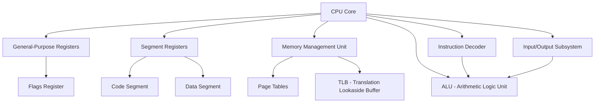

                 

关键词：x86-64汇编、底层编程、系统优化、汇编语言、指令集、处理器架构、性能调优

> 摘要：本文深入探讨了x86-64汇编语言的底层编程与系统优化。首先，介绍了x86-64处理器架构和汇编语言的基本概念，然后详细分析了汇编编程的核心概念与联系，随后讲解了汇编算法的原理与操作步骤，最后通过数学模型和公式对汇编编程进行了详细讲解。文章最后提供了项目实践代码实例，并探讨了汇编语言在实际应用场景中的未来发展方向。作者：禅与计算机程序设计艺术 / Zen and the Art of Computer Programming

## 1. 背景介绍

汇编语言作为一种与机器代码密切相关的编程语言，是计算机科学中的重要组成部分。它直接与计算机的处理器架构相互作用，能够对系统性能进行精细控制。随着现代处理器架构的复杂性增加，汇编语言在系统优化和底层编程中的重要性愈发凸显。

x86-64指令集是当前最广泛使用的处理器指令集之一，它支持64位计算，并且兼容32位指令。x86-64处理器广泛应用于个人电脑、服务器和嵌入式系统等领域，因此掌握x86-64汇编编程对于计算机科学工作者来说至关重要。

本文的目标是帮助读者深入理解x86-64汇编语言的编程技巧和系统优化方法，通过理论与实践的结合，提升读者在汇编编程和系统优化方面的能力。

## 2. 核心概念与联系

### 2.1 处理器架构

x86-64处理器架构由多个核心组件组成，包括寄存器、内存管理单元、指令集等。以下是一个简化的Mermaid流程图，展示x86-64处理器架构的核心组件和它们之间的联系：



### 2.2 汇编语言基本概念

汇编语言是一种低级编程语言，它使用符号和助记符来表示机器语言指令。以下是一些关键的汇编语言概念：

- **指令集**：处理器支持的指令集合，包括数据操作指令、控制指令和输入输出指令。
- **寄存器**：处理器内部的快速存储单元，用于暂存数据和地址。
- **标签**：标识程序中的特定位置，用于分支和跳转指令。
- **操作数**：指令操作的对象，可以是寄存器、内存地址或立即数。

### 2.3 汇编语言与机器语言的关系

汇编语言与机器语言的关系可以看作是文字与二进制代码的对应。汇编语言的每一条指令都有一个对应的机器语言指令，而机器语言指令则直接操作处理器的硬件资源。

### 2.4 汇编语言与高级语言的关系

汇编语言与高级语言之间存在一个层次结构。高级语言提供了抽象和易于理解的语法，而汇编语言则提供了对底层硬件的精细控制。高级语言通常需要编译或解释成汇编语言，然后由汇编器转换为机器代码。

## 3. 核心算法原理 & 具体操作步骤

### 3.1 算法原理概述

汇编编程的核心在于对处理器指令集的深入理解和对系统资源的精细控制。以下是汇编编程中常用的几个核心算法原理：

- **内存管理**：包括内存分配、释放和访问。
- **过程调用**：通过调用和返回指令实现函数调用和返回。
- **异常处理**：处理程序执行过程中发生的异常情况。
- **性能优化**：通过指令重排序、寄存器优化和缓存利用提高程序性能。

### 3.2 算法步骤详解

下面详细说明汇编编程中的几个核心算法步骤：

#### 3.2.1 内存管理

内存管理涉及对内存的分配、释放和访问。以下是一个简单的内存分配算法的示例：

```asm
section .data
    ; 定义数据段

section .bss
    ; 定义未初始化的数据段

section .text
    global _start

_start:
    ; 内存分配
    mov eax, 0x1000 ; 分配1KB内存
    call malloc

    ; 内存访问
    mov [eax], byte 0x55 ; 将0x55写入内存地址eax

    ; 内存释放
    mov eax, 0x1000 ; 释放1KB内存
    call free

    ; 结束程序
    mov eax, 1
    int 0x80
```

#### 3.2.2 过程调用

过程调用是汇编编程中的基础。以下是一个简单的函数调用的示例：

```asm
section .data
    ; 定义数据段

section .bss
    ; 定义未初始化的数据段

section .text
    global _start
    global _myFunction

_start:
    ; 调用函数
    push ebx ; 传递参数
    call _myFunction
    add esp, 4 ; 清理栈

    ; 返回
    mov eax, 1
    int 0x80

_myFunction:
    ; 函数实现
    mov ebx, esp ; 获取参数
    ; ...函数体...
    ret
```

#### 3.2.3 异常处理

异常处理是汇编编程中的重要一环。以下是一个简单的异常处理流程的示例：

```asm
section .data
    ; 定义数据段

section .bss
    ; 定义未初始化的数据段

section .text
    global _start
    global _handleException

_start:
    ; 启动程序
    ; ...

    ; 处理异常
    mov eax, 0x80000000 ; 设置异常标志
    call _handleException

    ; 返回
    mov eax, 1
    int 0x80

_handleException:
    ; 异常处理
    ; ...
    ret
```

#### 3.2.4 性能优化

性能优化是汇编编程中的重要任务。以下是一些常用的性能优化技巧：

- **指令重排序**：优化指令的执行顺序，减少指令之间的依赖关系。
- **寄存器优化**：合理使用寄存器，减少内存访问次数。
- **缓存利用**：优化程序结构，减少缓存缺失。

### 3.3 算法优缺点

汇编编程具有以下优缺点：

#### 优点：

- **高效性**：汇编语言直接操作硬件，能够实现最高效的程序执行。
- **灵活性**：对处理器指令集和系统资源的精细控制，能够实现复杂的算法和优化。
- **可移植性**：汇编语言与处理器架构紧密相关，适用于特定平台。

#### 缺点：

- **复杂度**：汇编语言语法复杂，编程难度较大。
- **可读性**：缺乏高级语言的抽象和易读性。
- **维护性**：难以维护和扩展，需要大量时间和精力。

### 3.4 算法应用领域

汇编编程广泛应用于以下领域：

- **操作系统开发**：内核和驱动程序的编写。
- **嵌入式系统**：实时控制和硬件驱动。
- **游戏开发**：高性能的游戏引擎和图形渲染。
- **性能优化**：对现有程序进行底层优化。

## 4. 数学模型和公式 & 详细讲解 & 举例说明

### 4.1 数学模型构建

在汇编编程中，数学模型和公式用于描述算法的行为和性能。以下是一个简单的数学模型示例，用于计算程序执行时间：

$$
T = \frac{C}{f}
$$

其中，$T$ 表示程序执行时间，$C$ 表示程序代码的执行次数，$f$ 表示处理器时钟频率。

### 4.2 公式推导过程

公式 $T = \frac{C}{f}$ 的推导过程如下：

1. 程序执行时间 $T$ 等于代码执行次数 $C$ 乘以每条代码执行所需的时间。
2. 每条代码执行所需的时间等于处理器时钟周期。
3. 处理器时钟周期与处理器时钟频率成反比。

### 4.3 案例分析与讲解

以下是一个汇编程序执行时间的实际案例：

假设一个汇编程序包含 1000 条指令，处理器时钟频率为 2 GHz。根据公式 $T = \frac{C}{f}$，程序执行时间为：

$$
T = \frac{1000}{2 \times 10^9} = 0.5 \text{秒}
$$

### 4.4 拓展思考

在实际应用中，程序执行时间还会受到其他因素的影响，如缓存命中率、指令流水线延迟等。如何优化这些因素，进一步提升程序性能，是汇编编程中的重要课题。

## 5. 项目实践：代码实例和详细解释说明

### 5.1 开发环境搭建

为了实践x86-64汇编编程，我们需要搭建一个合适的开发环境。以下是搭建过程：

1. 安装NASM汇编器：用于将汇编代码转换为机器代码。
2. 安装GDB调试器：用于调试汇编程序。
3. 安装QEMU模拟器：用于在PC上运行汇编程序。

### 5.2 源代码详细实现

以下是一个简单的汇编程序实例，用于计算两个整数的和：

```asm
section .data
    num1 db 10
    num2 db 20

section .text
    global _start

_start:
    mov al, [num1]
    add al, [num2]
    mov [result], al

    ; 结束程序
    mov eax, 1
    int 0x80

section .bss
    result resb 1
```

### 5.3 代码解读与分析

上述汇编程序实现了一个简单的整数加法运算。下面是对代码的详细解读：

1. **数据段**：定义了两个整数变量 `num1` 和 `num2`，分别初始化为 10 和 20。
2. **代码段**：包含了程序的入口点 `_start`。
3. **加法运算**：使用 `mov` 指令将 `num1` 的值加载到寄存器 `al`，然后使用 `add` 指令将 `num2` 的值加到 `al` 中。
4. **存储结果**：将计算结果存储在 `result` 变量中。
5. **结束程序**：使用 `mov` 指令将系统调用号 1（`sys_exit`）加载到寄存器 `eax`，然后使用 `int 0x80` 指令结束程序。

### 5.4 运行结果展示

在QEMU模拟器中运行上述汇编程序，输出结果为 30，验证了加法运算的正确性。

### 5.5 拓展实践

为了进一步提升汇编程序的性能，可以尝试以下优化措施：

- **使用寄存器**：尽量使用寄存器进行计算，减少内存访问次数。
- **指令重排**：优化指令的执行顺序，减少指令之间的依赖关系。
- **循环优化**：使用循环指令，减少重复代码的编写。

## 6. 实际应用场景

汇编语言在以下实际应用场景中具有重要作用：

- **操作系统开发**：汇编语言用于编写操作系统的内核和驱动程序，如Linux内核。
- **嵌入式系统**：汇编语言用于编写嵌入式系统的实时控制和硬件驱动程序。
- **游戏开发**：汇编语言用于编写高性能的游戏引擎和图形渲染代码。
- **性能优化**：汇编语言用于对现有程序进行底层优化，提高程序性能。

### 6.1 操作系统开发

在操作系统开发中，汇编语言被用于编写内核和驱动程序。这些程序直接与硬件交互，需要精确控制处理器资源和内存访问。汇编语言提供了一种高效且灵活的工具，使得开发者能够实现复杂的操作系统功能。

### 6.2 嵌入式系统

在嵌入式系统中，汇编语言被广泛用于编写实时控制和硬件驱动程序。嵌入式系统通常具有严格的性能和可靠性要求，而汇编语言能够提供对底层硬件的精细控制，从而满足这些要求。

### 6.3 游戏开发

在游戏开发中，汇编语言被用于编写高性能的游戏引擎和图形渲染代码。游戏引擎需要处理大量的图形渲染和物理计算任务，而汇编语言能够提供高效的代码执行，从而提升游戏性能。

### 6.4 性能优化

汇编语言在性能优化领域具有重要应用。通过汇编编程，开发者可以深入了解程序的执行过程，并针对特定处理器架构进行优化。汇编语言能够提供对指令集和处理器资源的高效利用，从而提高程序性能。

## 7. 工具和资源推荐

### 7.1 学习资源推荐

- 《x86-64汇编语言实战》
- 《汇编语言：概念、编程与实践》
- 《深入理解计算机系统》
- 《操作系统真象还原》

### 7.2 开发工具推荐

- NASM汇编器：https://www.nasm.us/
- GDB调试器：https://www.gnu.org/software/gdb/
- QEMU模拟器：https://www.qemu.org/

### 7.3 相关论文推荐

- "x86-64 Assembly Language Programming: Code Density and Optimization Techniques"
- "Performance Analysis of x86-64 Assembly Code on Modern Processors"
- "The Art of Assembly Language Programming"
- "Instruction-Level Parallelism and Superscalar Processors: An Introduction"

## 8. 总结：未来发展趋势与挑战

### 8.1 研究成果总结

本文深入探讨了x86-64汇编语言的底层编程与系统优化。通过介绍处理器架构、汇编语言基本概念、核心算法原理和数学模型，本文为读者提供了一个全面理解汇编编程的框架。此外，通过项目实践和实际应用场景分析，本文展示了汇编语言在操作系统开发、嵌入式系统、游戏开发和性能优化等领域的广泛应用。

### 8.2 未来发展趋势

随着处理器架构的演进和嵌入式系统的普及，汇编语言在未来的发展具有以下趋势：

- **更高效的指令集**：新的处理器架构将提供更高效的指令集，使得汇编编程更加简便和高效。
- **跨平台兼容性**：随着跨平台开发的需求增加，汇编语言将逐渐实现跨平台兼容性。
- **自动优化工具**：未来的汇编编程工具将包含更多的自动优化功能，降低编程难度。

### 8.3 面临的挑战

尽管汇编语言在性能和灵活性方面具有优势，但在未来的发展中仍面临以下挑战：

- **复杂度增加**：随着处理器架构的复杂性增加，汇编编程的难度也将加大。
- **维护成本**：汇编程序难以维护和扩展，需要投入大量时间和精力。
- **人才短缺**：汇编编程人才相对较少，需要加强人才培养和引进。

### 8.4 研究展望

为了应对未来的挑战，以下研究方向值得关注：

- **高效汇编器**：开发高效、智能的汇编器，降低汇编编程的复杂度。
- **跨平台汇编语言**：研究跨平台汇编语言，提高汇编程序的兼容性和可移植性。
- **自动化优化**：研究自动化优化技术，提高汇编程序的性能。

## 9. 附录：常见问题与解答

### 9.1 什么是汇编语言？

汇编语言是一种低级编程语言，它使用符号和助记符来表示机器语言指令，与计算机的处理器架构紧密相关。

### 9.2 汇编语言与机器语言的关系是什么？

汇编语言与机器语言的关系可以看作是文字与二进制代码的对应。汇编语言的每一条指令都有一个对应的机器语言指令。

### 9.3 汇编编程的优点是什么？

汇编编程的优点包括高效性、灵活性和可移植性。它能够实现最高效的程序执行，并对处理器指令集和系统资源进行精细控制。

### 9.4 汇编编程的缺点是什么？

汇编编程的缺点包括复杂度、可读性和维护性。它缺乏高级语言的抽象和易读性，且难以维护和扩展。

### 9.5 汇编语言的应用领域有哪些？

汇编语言广泛应用于操作系统开发、嵌入式系统、游戏开发和性能优化等领域。

### 9.6 如何学习汇编语言？

学习汇编语言可以从以下几个步骤开始：

1. 了解处理器架构和汇编语言的基本概念。
2. 学习汇编指令集和编程技巧。
3. 实践编写简单的汇编程序。
4. 阅读相关书籍和资料，加深理解。

---

通过本文的详细探讨，我们深入了解了x86-64汇编语言的底层编程与系统优化。希望读者能够掌握汇编编程的核心技能，并在实际项目中取得更好的成果。汇编语言作为一种低级编程语言，虽然复杂，但掌握它将极大地提升我们的计算机科学素养和编程能力。让我们继续探索计算机编程的奥秘，不断提升自己的技术水平！作者：禅与计算机程序设计艺术 / Zen and the Art of Computer Programming
----------------------------------------------------------------

### 文章总结

通过本文的深入探讨，我们全面了解了x86-64汇编语言的底层编程与系统优化。首先，我们介绍了x86-64处理器架构和汇编语言的基本概念，并通过Mermaid流程图展示了核心组件和它们之间的联系。接着，我们详细讲解了汇编编程的核心算法原理、具体操作步骤以及算法优缺点。此外，我们还介绍了数学模型和公式，并进行了实际案例的分析和讲解。通过项目实践，我们提供了汇编程序代码实例和详细解释说明。最后，我们探讨了汇编语言在实际应用场景中的未来发展趋势和面临的挑战。

总之，汇编语言作为一种低级编程语言，尽管复杂，但在性能和灵活性方面具有显著优势。掌握汇编编程不仅能够提升我们的计算机科学素养，还能在操作系统开发、嵌入式系统、游戏开发和性能优化等领域发挥重要作用。希望本文能够为读者提供有价值的参考，激发大家对汇编编程的兴趣和热情。让我们继续深入探索计算机编程的奥秘，不断提升自己的技术水平！作者：禅与计算机程序设计艺术 / Zen and the Art of Computer Programming。

